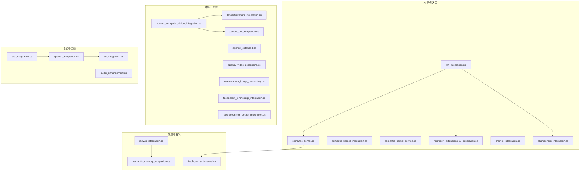
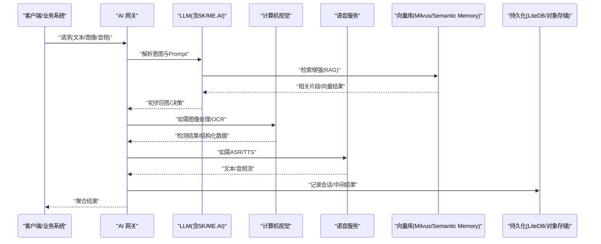
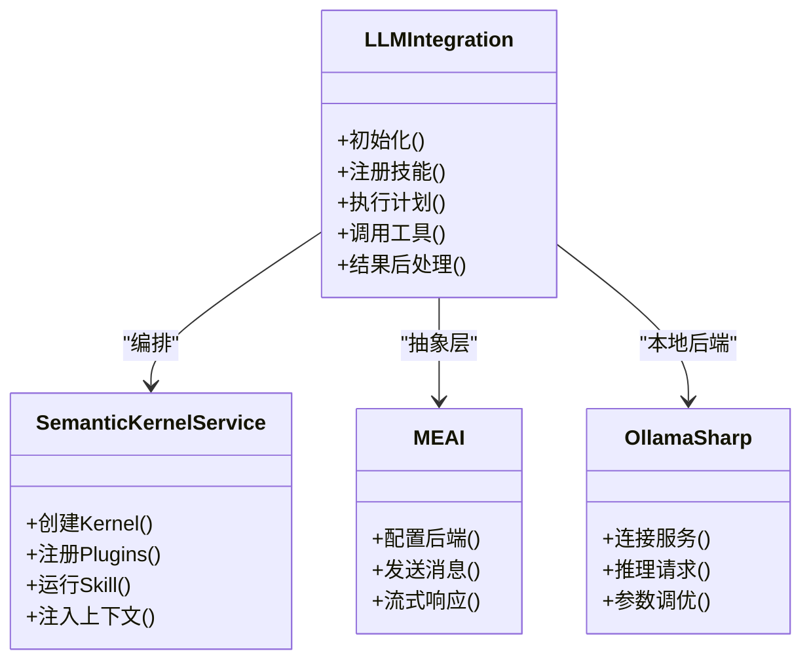
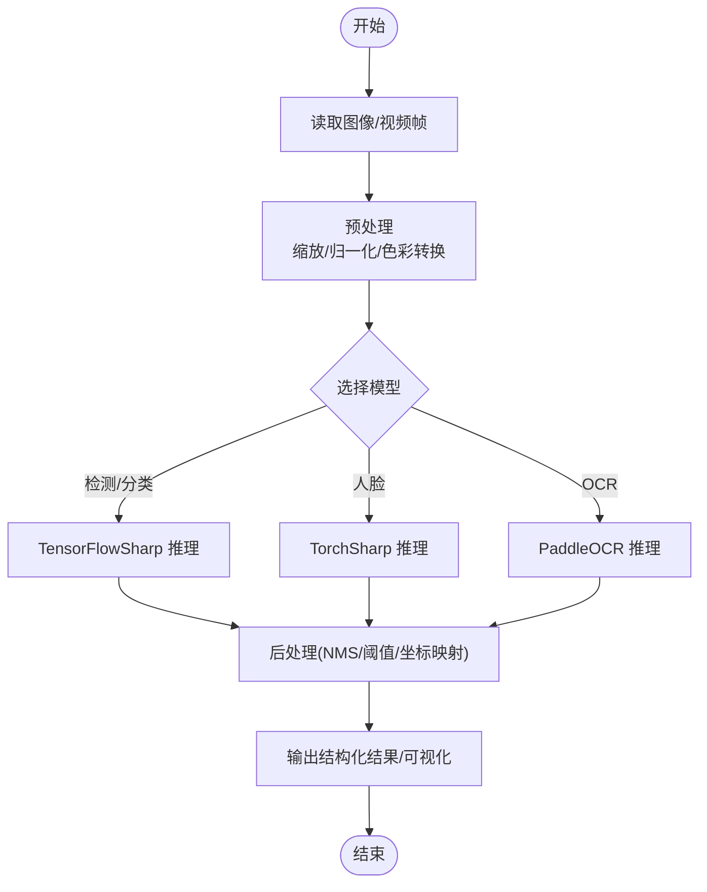
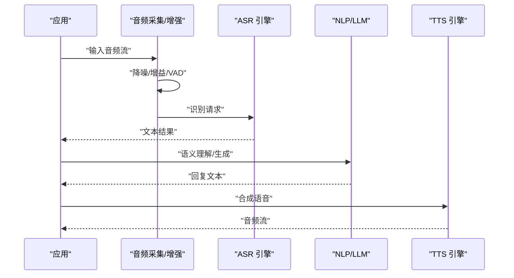
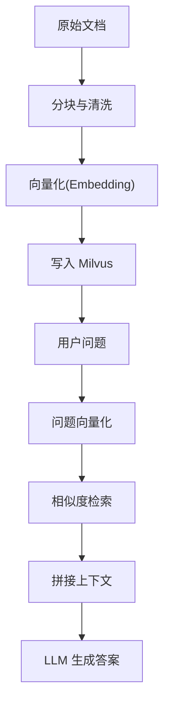
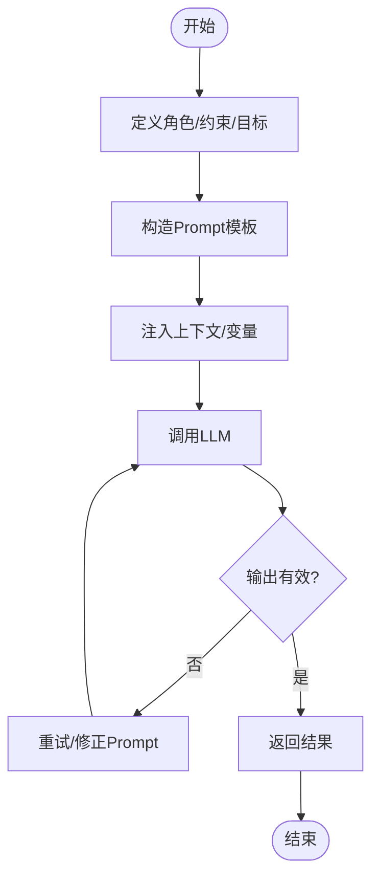
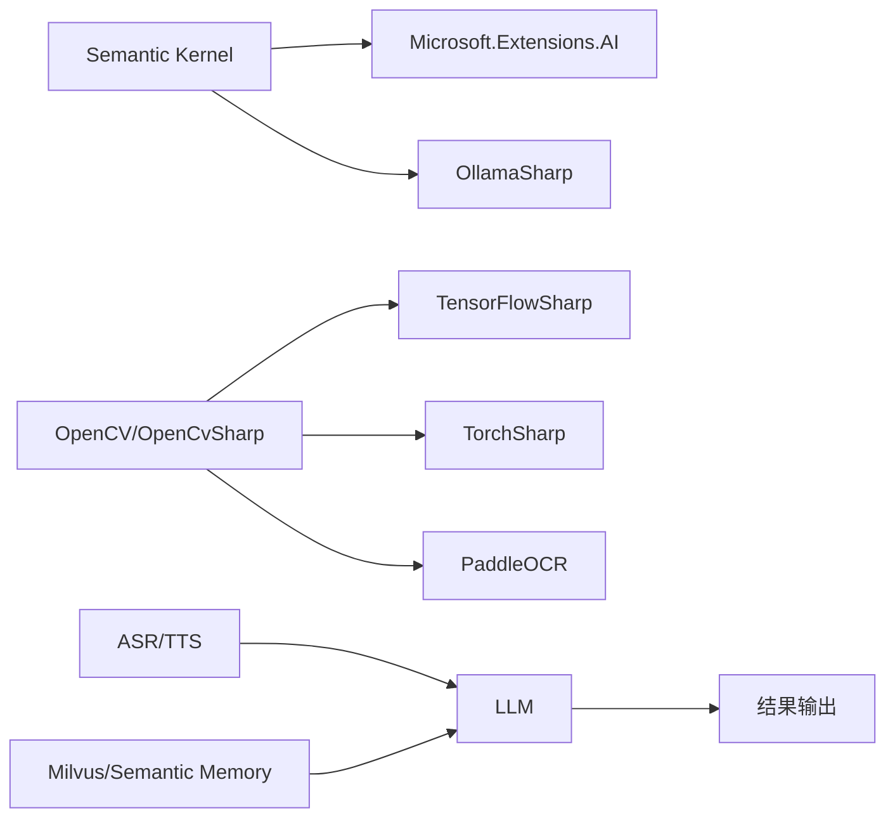

# AI与机器学习集成

<cite>
**本文档引用的文件**   
- [llm_integration.cs](file://llm_integration.cs)
- [semantic_kernel.cs](file://semantic_kernel.cs)
- [semantic_kernel_integration.cs](file://semantic_kernel_integration.cs)
- [semantic_kernel_service.cs](file://semantic_kernel_service.cs)
- [litedb_semantickernel.cs](file://litedb_semantickernel.cs)
- [microsoft_extensions_ai_integration.cs](file://microsoft_extensions_ai_integration.cs)
- [tensorflowsharp_integration.cs](file://tensorflowsharp_integration.cs)
- [opencv_computer_vision_integration.cs](file://opencv_computer_vision_integration.cs)
- [opencv_extended.cs](file://opencv_extended.cs)
- [opencv_video_processing.cs](file://opencv_video_processing.cs)
- [opencvsharp_image_processing.cs](file://opencvsharp_image_processing.cs)
- [asr_integration.cs](file://asr_integration.cs)
- [speech_integration.cs](file://speech_integration.cs)
- [tts_integration.cs](file://tts_integration.cs)
- [audio_enhancement.cs](file://audio_enhancement.cs)
- [paddle_ocr_integration.cs](file://paddle_ocr_integration.cs)
- [facedetect_torchsharp_integration.cs](file://facedetect_torchsharp_integration.cs)
- [facerecognition_dotnet_integration.cs](file://facerecognition_dotnet_integration.cs)
- [milvus_integration.cs](file://milvus_integration.cs)
- [semantic_memory_integration.cs](file://semantic_memory_integration.cs)
- [prompt_integration.cs](file://prompt_integration.cs)
- [ollamasharp_integration.cs](file://ollamasharp_integration.cs)
- [ai/DigitalHumanDemo.cs](file://ai/DigitalHumanDemo.cs)
- [ai/OllamaExtensions.cs](file://ai/OllamaExtensions.cs)
</cite>

## 目录
1. [简介](#简介)
2. [项目结构](#项目结构)
3. [核心组件](#核心组件)
4. [架构总览](#架构总览)
5. [详细组件分析](#详细组件分析)
6. [依赖关系分析](#依赖关系分析)
7. [性能考虑](#性能考虑)
8. [故障排查指南](#故障排查指南)
9. [结论](#结论)
10. [附录](#附录)

## 简介
本文件面向在 .NET 环境中构建 AI/ML 能力的应用，系统性梳理大语言模型（LLM）接入、计算机视觉处理、语音识别与自然语言处理的集成方案。重点覆盖：
- LLM 接入与编排：Semantic Kernel、Microsoft.Extensions.AI、OllamaSharp、本地/云端模型调用
- 计算机视觉：OpenCV/OpenCvSharp、TensorFlowSharp、TorchSharp（人脸检测）、PaddleOCR
- 语音技术：ASR 与 TTS 集成、音频增强
- 向量数据库与语义记忆：Milvus、Semantic Memory
- Prompt 工程与 AI 工作流编排最佳实践
- 模型部署、推理优化与 GPU 加速配置建议

## 项目结构
仓库采用“按能力域组织”的扁平化示例结构，AI/ML 相关代码以独立文件呈现，便于快速定位与复用。关键目录与文件：
- ai/：数字人演示、Ollama 扩展等
- code/ 根目录下大量 .cs 示例文件，涵盖 LLM、CV、语音、向量库、Prompt 工程等

图表来源 
- [llm_integration.cs](file://llm_integration.cs)
- [semantic_kernel.cs](file://semantic_kernel.cs)
- [semantic_kernel_integration.cs](file://semantic_kernel_integration.cs)
- [semantic_kernel_service.cs](file://semantic_kernel_service.cs)
- [microsoft_extensions_ai_integration.cs](file://microsoft_extensions_ai_integration.cs)
- [prompt_integration.cs](file://prompt_integration.cs)
- [ollamasharp_integration.cs](file://ollamasharp_integration.cs)
- [opencv_computer_vision_integration.cs](file://opencv_computer_vision_integration.cs)
- [opencv_extended.cs](file://opencv_extended.cs)
- [opencv_video_processing.cs](file://opencv_video_processing.cs)
- [opencvsharp_image_processing.cs](file://opencvsharp_image_processing.cs)
- [tensorflowsharp_integration.cs](file://tensorflowsharp_integration.cs)
- [paddle_ocr_integration.cs](file://paddle_ocr_integration.cs)
- [facedetect_torchsharp_integration.cs](file://facedetect_torchsharp_integration.cs)
- [facerecognition_dotnet_integration.cs](file://facerecognition_dotnet_integration.cs)
- [asr_integration.cs](file://asr_integration.cs)
- [speech_integration.cs](file://speech_integration.cs)
- [tts_integration.cs](file://tts_integration.cs)
- [audio_enhancement.cs](file://audio_enhancement.cs)
- [milvus_integration.cs](file://milvus_integration.cs)
- [semantic_memory_integration.cs](file://semantic_memory_integration.cs)
- [litedb_semantickernel.cs](file://litedb_semantickernel.cs)

章节来源
- [llm_integration.cs](file://llm_integration.cs)
- [semantic_kernel.cs](file://semantic_kernel.cs)
- [semantic_kernel_integration.cs](file://semantic_kernel_integration.cs)
- [semantic_kernel_service.cs](file://semantic_kernel_service.cs)
- [microsoft_extensions_ai_integration.cs](file://microsoft_extensions_ai_integration.cs)
- [prompt_integration.cs](file://prompt_integration.cs)
- [ollamasharp_integration.cs](file://ollamasharp_integration.cs)
- [opencv_computer_vision_integration.cs](file://opencv_computer_vision_integration.cs)
- [opencv_extended.cs](file://opencv_extended.cs)
- [opencv_video_processing.cs](file://opencv_video_processing.cs)
- [opencvsharp_image_processing.cs](file://opencvsharp_image_processing.cs)
- [tensorflowsharp_integration.cs](file://tensorflowsharp_integration.cs)
- [paddle_ocr_integration.cs](file://paddle_ocr_integration.cs)
- [facedetect_torchsharp_integration.cs](file://facedetect_torchsharp_integration.cs)
- [facerecognition_dotnet_integration.cs](file://facerecognition_dotnet_integration.cs)
- [asr_integration.cs](file://asr_integration.cs)
- [speech_integration.cs](file://speech_integration.cs)
- [tts_integration.cs](file://tts_integration.cs)
- [audio_enhancement.cs](file://audio_enhancement.cs)
- [milvus_integration.cs](file://milvus_integration.cs)
- [semantic_memory_integration.cs](file://semantic_memory_integration.cs)
- [litedb_semantickernel.cs](file://litedb_semantickernel.cs)

## 核心组件
- LLM 接入与编排
  - Semantic Kernel：技能注册、函数调用、插件编排、上下文管理
  - Microsoft.Extensions.AI：统一抽象层，屏蔽不同后端差异
  - OllamaSharp：本地/私有化 LLM 服务调用
- 计算机视觉
  - OpenCV/OpenCvSharp：图像预处理、特征提取、视频流处理
  - TensorFlowSharp：加载并推理 TF 模型
  - TorchSharp：人脸检测与识别
  - PaddleOCR：文档/票据 OCR
- 语音与音频
  - ASR/TTS：语音转文本、文本转语音
  - 音频增强：降噪、回声消除、增益控制
- 向量数据库与语义记忆
  - Milvus：高维向量存储与检索
  - Semantic Memory：基于向量库的记忆与检索增强
  - LiteDB + SK：轻量级知识索引与检索

章节来源
- [semantic_kernel.cs](file://semantic_kernel.cs)
- [semantic_kernel_integration.cs](file://semantic_kernel_integration.cs)
- [semantic_kernel_service.cs](file://semantic_kernel_service.cs)
- [microsoft_extensions_ai_integration.cs](file://microsoft_extensions_ai_integration.cs)
- [ollamasharp_integration.cs](file://ollamasharp_integration.cs)
- [opencv_computer_vision_integration.cs](file://opencv_computer_vision_integration.cs)
- [opencv_extended.cs](file://opencv_extended.cs)
- [opencv_video_processing.cs](file://opencv_video_processing.cs)
- [opencvsharp_image_processing.cs](file://opencvsharp_image_processing.cs)
- [tensorflowsharp_integration.cs](file://tensorflowsharp_integration.cs)
- [paddle_ocr_integration.cs](file://paddle_ocr_integration.cs)
- [facedetect_torchsharp_integration.cs](file://facedetect_torchsharp_integration.cs)
- [facerecognition_dotnet_integration.cs](file://facerecognition_dotnet_integration.cs)
- [asr_integration.cs](file://asr_integration.cs)
- [speech_integration.cs](file://speech_integration.cs)
- [tts_integration.cs](file://tts_integration.cs)
- [audio_enhancement.cs](file://audio_enhancement.cs)
- [milvus_integration.cs](file://milvus_integration.cs)
- [semantic_memory_integration.cs](file://semantic_memory_integration.cs)
- [litedb_semantickernel.cs](file://litedb_semantickernel.cs)

## 架构总览
下图展示从输入到输出的端到端流程：前端/业务系统通过统一 AI 网关路由至 LLM、CV、语音等能力，结合向量库进行检索增强，最终返回结构化结果。

图表来源 
- [llm_integration.cs](file://llm_integration.cs)
- [semantic_kernel.cs](file://semantic_kernel.cs)
- [semantic_kernel_integration.cs](file://semantic_kernel_integration.cs)
- [microsoft_extensions_ai_integration.cs](file://microsoft_extensions_ai_integration.cs)
- [opencv_computer_vision_integration.cs](file://opencv_computer_vision_integration.cs)
- [paddle_ocr_integration.cs](file://paddle_ocr_integration.cs)
- [asr_integration.cs](file://asr_integration.cs)
- [tts_integration.cs](file://tts_integration.cs)
- [milvus_integration.cs](file://milvus_integration.cs)
- [semantic_memory_integration.cs](file://semantic_memory_integration.cs)
- [litedb_semantickernel.cs](file://litedb_semantickernel.cs)

## 详细组件分析

### LLM 接入与编排（Semantic Kernel / Microsoft.Extensions.AI / OllamaSharp）
- 目标
  - 统一接入多种 LLM 后端（本地/云端），支持函数调用、工具链编排、RAG 增强
- 关键点
  - 使用 Microsoft.Extensions.AI 抽象层屏蔽后端差异
  - 通过 Semantic Kernel 注册技能与插件，实现复杂工作流
  - 借助 OllamaSharp 对接本地推理服务，降低延迟与成本
- 典型流程
  - 初始化 AI 客户端与服务集合
  - 注册技能/函数，绑定外部 API/工具
  - 构造 Prompt 模板与上下文，执行计划与调用
  - 收集结果并进行后处理与缓存

图表来源 
- [semantic_kernel_service.cs](file://semantic_kernel_service.cs)
- [semantic_kernel.cs](file://semantic_kernel.cs)
- [microsoft_extensions_ai_integration.cs](file://microsoft_extensions_ai_integration.cs)
- [ollamasharp_integration.cs](file://ollamasharp_integration.cs)

章节来源
- [llm_integration.cs](file://llm_integration.cs)
- [semantic_kernel.cs](file://semantic_kernel.cs)
- [semantic_kernel_integration.cs](file://semantic_kernel_integration.cs)
- [semantic_kernel_service.cs](file://semantic_kernel_service.cs)
- [microsoft_extensions_ai_integration.cs](file://microsoft_extensions_ai_integration.cs)
- [ollamasharp_integration.cs](file://ollamasharp_integration.cs)

### 计算机视觉（OpenCV / TensorFlowSharp / TorchSharp / PaddleOCR）
- 目标
  - 提供图像预处理、特征提取、目标检测、OCR、人脸识别等能力
- 关键点
  - OpenCvSharp 用于通用图像处理与视频流
  - TensorFlowSharp 加载并推理 TF 模型
  - TorchSharp 用于人脸检测/识别
  - PaddleOCR 用于文档/票据文字识别
- 典型流程
  - 读取图像/视频帧
  - 预处理（缩放、归一化、色彩空间转换）
  - 模型推理（检测/分类/分割/OCR）
  - 后处理（阈值、NMS、坐标映射）
  - 输出结构化结果或可视化

图表来源 
- [opencv_computer_vision_integration.cs](file://opencv_computer_vision_integration.cs)
- [opencv_extended.cs](file://opencv_extended.cs)
- [opencv_video_processing.cs](file://opencv_video_processing.cs)
- [opencvsharp_image_processing.cs](file://opencvsharp_image_processing.cs)
- [tensorflowsharp_integration.cs](file://tensorflowsharp_integration.cs)
- [facedetect_torchsharp_integration.cs](file://facedetect_torchsharp_integration.cs)
- [facerecognition_dotnet_integration.cs](file://facerecognition_dotnet_integration.cs)
- [paddle_ocr_integration.cs](file://paddle_ocr_integration.cs)

章节来源
- [opencv_computer_vision_integration.cs](file://opencv_computer_vision_integration.cs)
- [opencv_extended.cs](file://opencv_extended.cs)
- [opencv_video_processing.cs](file://opencv_video_processing.cs)
- [opencvsharp_image_processing.cs](file://opencvsharp_image_processing.cs)
- [tensorflowsharp_integration.cs](file://tensorflowsharp_integration.cs)
- [facedetect_torchsharp_integration.cs](file://facedetect_torchsharp_integration.cs)
- [facerecognition_dotnet_integration.cs](file://facerecognition_dotnet_integration.cs)
- [paddle_ocr_integration.cs](file://paddle_ocr_integration.cs)

### 语音识别与自然语言处理（ASR/TTS/音频增强）
- 目标
  - 将语音信号转为文本（ASR），或将文本转为语音（TTS），并对音频进行增强以提升质量
- 关键点
  - ASR 可对接云端或本地引擎，支持流式识别
  - TTS 支持多音色、语速、音量调节
  - 音频增强包括降噪、回声消除、自动增益
- 典型流程
  - 采集/接收音频流
  - 预处理（采样率对齐、分帧、VAD）
  - ASR 识别得到文本
  - 可选：TTS 合成语音
  - 输出文本/音频并记录日志

图表来源 
- [asr_integration.cs](file://asr_integration.cs)
- [speech_integration.cs](file://speech_integration.cs)
- [tts_integration.cs](file://tts_integration.cs)
- [audio_enhancement.cs](file://audio_enhancement.cs)

章节来源
- [asr_integration.cs](file://asr_integration.cs)
- [speech_integration.cs](file://speech_integration.cs)
- [tts_integration.cs](file://tts_integration.cs)
- [audio_enhancement.cs](file://audio_enhancement.cs)

### 向量数据库与语义记忆（Milvus / Semantic Memory / LiteDB+SK）
- 目标
  - 为 LLM 提供检索增强（RAG），实现知识库问答、对话记忆、上下文召回
- 关键点
  - Milvus 作为高性能向量数据库，支持大规模向量检索
  - Semantic Memory 封装记忆与检索逻辑
  - LiteDB + SK 适合轻量场景的知识索引与查询
- 典型流程
  - 文本分块与向量化
  - 写入向量库（Milvus）
  - 查询时相似度检索
  - 拼接上下文给 LLM 生成答案

图表来源 
- [milvus_integration.cs](file://milvus_integration.cs)
- [semantic_memory_integration.cs](file://semantic_memory_integration.cs)
- [litedb_semantickernel.cs](file://litedb_semantickernel.cs)

章节来源
- [milvus_integration.cs](file://milvus_integration.cs)
- [semantic_memory_integration.cs](file://semantic_memory_integration.cs)
- [litedb_semantickernel.cs](file://litedb_semantickernel.cs)

### Prompt 工程与 AI 工作流编排
- 目标
  - 设计高质量 Prompt，提升 LLM 输出稳定性与可控性；编排多步骤任务与工作流
- 关键点
  - 使用模板化 Prompt 与变量注入
  - 结合工具/函数调用实现多步推理
  - 引入重试、超时、熔断等弹性策略
- 典型流程
  - 定义角色与约束
  - 构造输入上下文与示例
  - 调用 LLM 并校验输出
  - 失败回退与迭代优化

图表来源 
- [prompt_integration.cs](file://prompt_integration.cs)
- [semantic_kernel.cs](file://semantic_kernel.cs)
- [semantic_kernel_integration.cs](file://semantic_kernel_integration.cs)

章节来源
- [prompt_integration.cs](file://prompt_integration.cs)
- [semantic_kernel.cs](file://semantic_kernel.cs)
- [semantic_kernel_integration.cs](file://semantic_kernel_integration.cs)

### 数字人与交互（示例）
- 目标
  - 结合 LLM、语音、图像生成等技术，构建数字人交互体验
- 关键点
  - 对话驱动的数字人动作与表情
  - 实时音视频流处理
  - 多模态融合（文本/语音/图像）

章节来源
- [ai/DigitalHumanDemo.cs](file://ai/DigitalHumanDemo.cs)
- [ai/OllamaExtensions.cs](file://ai/OllamaExtensions.cs)

## 依赖关系分析
- 组件耦合
  - LLM 编排层（SK/ME.AI）与具体后端（Ollama/云端）解耦
  - CV 各框架（OpenCV/TensorFlow/Torch/Paddle）职责清晰，互不干扰
  - 语音模块与 LLM/CV 通过网关聚合
  - 向量库与语义记忆为 LLM 提供检索增强
- 外部依赖
  - 向量数据库（Milvus）
  - 推理引擎（TF/Torch/Paddle）
  - 语音/OCR 服务（本地或云端）

图表来源 
- [semantic_kernel.cs](file://semantic_kernel.cs)
- [microsoft_extensions_ai_integration.cs](file://microsoft_extensions_ai_integration.cs)
- [ollamasharp_integration.cs](file://ollamasharp_integration.cs)
- [opencv_computer_vision_integration.cs](file://opencv_computer_vision_integration.cs)
- [tensorflowsharp_integration.cs](file://tensorflowsharp_integration.cs)
- [facedetect_torchsharp_integration.cs](file://facedetect_torchsharp_integration.cs)
- [paddle_ocr_integration.cs](file://paddle_ocr_integration.cs)
- [asr_integration.cs](file://asr_integration.cs)
- [tts_integration.cs](file://tts_integration.cs)
- [milvus_integration.cs](file://milvus_integration.cs)
- [semantic_memory_integration.cs](file://semantic_memory_integration.cs)

章节来源
- [semantic_kernel.cs](file://semantic_kernel.cs)
- [microsoft_extensions_ai_integration.cs](file://microsoft_extensions_ai_integration.cs)
- [ollamasharp_integration.cs](file://ollamasharp_integration.cs)
- [opencv_computer_vision_integration.cs](file://opencv_computer_vision_integration.cs)
- [tensorflowsharp_integration.cs](file://tensorflowsharp_integration.cs)
- [facedetect_torchsharp_integration.cs](file://facedetect_torchsharp_integration.cs)
- [paddle_ocr_integration.cs](file://paddle_ocr_integration.cs)
- [asr_integration.cs](file://asr_integration.cs)
- [tts_integration.cs](file://tts_integration.cs)
- [milvus_integration.cs](file://milvus_integration.cs)
- [semantic_memory_integration.cs](file://semantic_memory_integration.cs)

## 性能考虑
- 模型部署
  - 优先使用容器化部署，隔离依赖与环境
  - 对 CPU/GPU 资源进行合理分配与监控
- 推理优化
  - 批处理与并发控制，避免过载
  - 模型量化与图优化（如适用）
  - 缓存热点结果（向量/文本/音频）
- GPU 加速
  - 确保驱动与运行时版本匹配
  - 启用 CUDA/MKL 加速路径
  - 监控显存占用与温度
- 网络与 I/O
  - 使用连接池与超时策略
  - 流式传输减少内存峰值
- 观测与诊断
  - 指标埋点（延迟、吞吐、错误率）
  - 链路追踪与日志分级

[本节为通用指导，不直接分析具体文件]

## 故障排查指南
- LLM 相关问题
  - 检查后端连通性与鉴权配置
  - 验证 Prompt 模板与变量注入
  - 查看重试与熔断策略是否生效
- CV 相关问题
  - 确认模型文件路径与格式正确
  - 检查预处理参数（尺寸、归一化）
  - 监控 GPU/CPU 资源与内存泄漏
- 语音相关问题
  - 校验音频编码与采样率
  - 检查 ASR/TTS 服务状态与配额
  - 调试音频增强参数（降噪/增益）
- 向量库相关问题
  - 检查向量维度与索引类型
  - 验证相似度阈值与召回数量
  - 监控 Milvus 集群健康与磁盘 IO

章节来源
- [llm_integration.cs](file://llm_integration.cs)
- [semantic_kernel.cs](file://semantic_kernel.cs)
- [microsoft_extensions_ai_integration.cs](file://microsoft_extensions_ai_integration.cs)
- [opencv_computer_vision_integration.cs](file://opencv_computer_vision_integration.cs)
- [tensorflowsharp_integration.cs](file://tensorflowsharp_integration.cs)
- [asr_integration.cs](file://asr_integration.cs)
- [tts_integration.cs](file://tts_integration.cs)
- [milvus_integration.cs](file://milvus_integration.cs)

## 结论
本仓库提供了在 .NET 环境下构建 AI/ML 能力的完整示例集，覆盖 LLM、CV、语音、向量库与 Prompt 工程。通过统一的抽象层与模块化设计，开发者可以快速组合与扩展能力，满足多样化业务需求。建议在落地时关注性能优化、可观测性与安全合规，逐步完善生产级特性。

[本节为总结性内容，不直接分析具体文件]

## 附录
- 最佳实践清单
  - 使用统一 AI 抽象层（Microsoft.Extensions.AI）
  - 通过 Semantic Kernel 编排技能与工具
  - 采用 RAG 模式提升回答准确性
  - 对 CV/语音模型进行量化与批处理优化
  - 建立完善的监控与告警体系
- 参考示例
  - LLM：llm_integration.cs、semantic_kernel*.cs、microsoft_extensions_ai_integration.cs、ollamasharp_integration.cs
  - CV：opencv_*、tensorflowsharp_integration.cs、paddle_ocr_integration.cs、facedetect_torchsharp_integration.cs、facerecognition_dotnet_integration.cs
  - 语音：asr_integration.cs、speech_integration.cs、tts_integration.cs、audio_enhancement.cs
  - 向量与记忆：milvus_integration.cs、semantic_memory_integration.cs、litedb_semantickernel.cs
  - Prompt：prompt_integration.cs

[本节为补充信息，不直接分析具体文件]