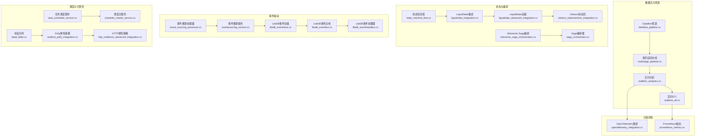
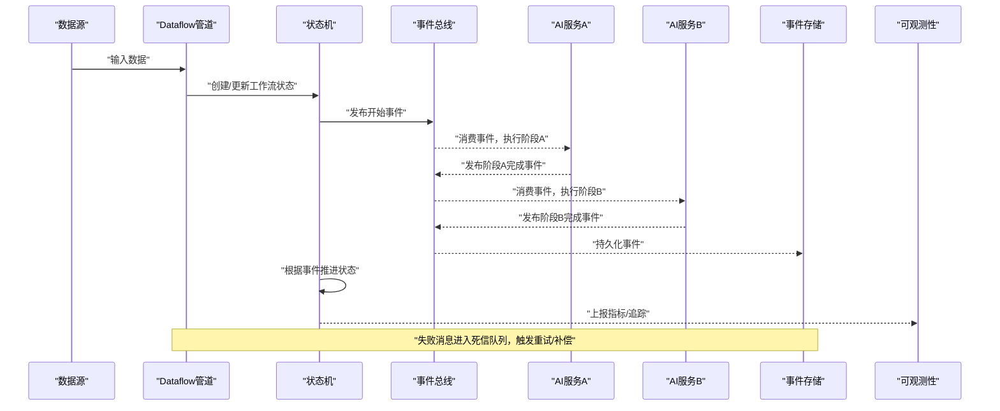
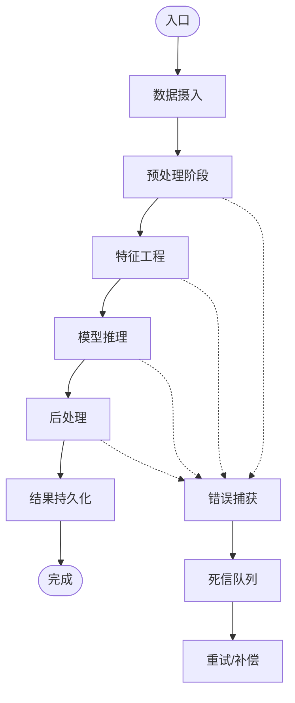
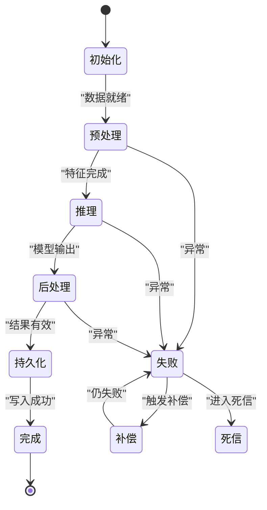
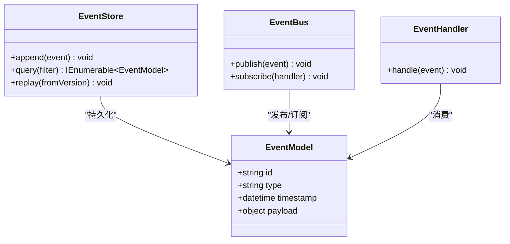
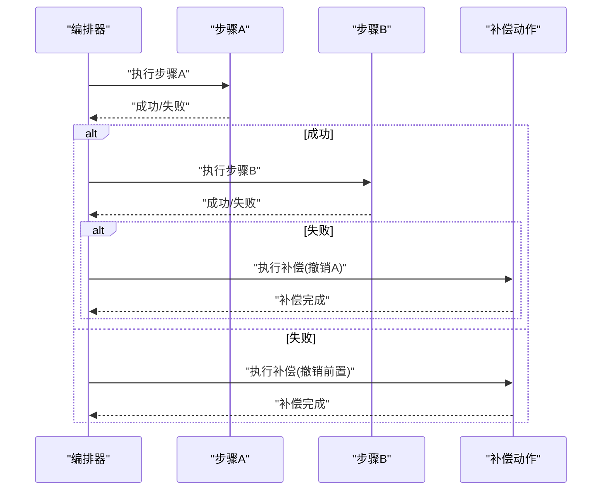
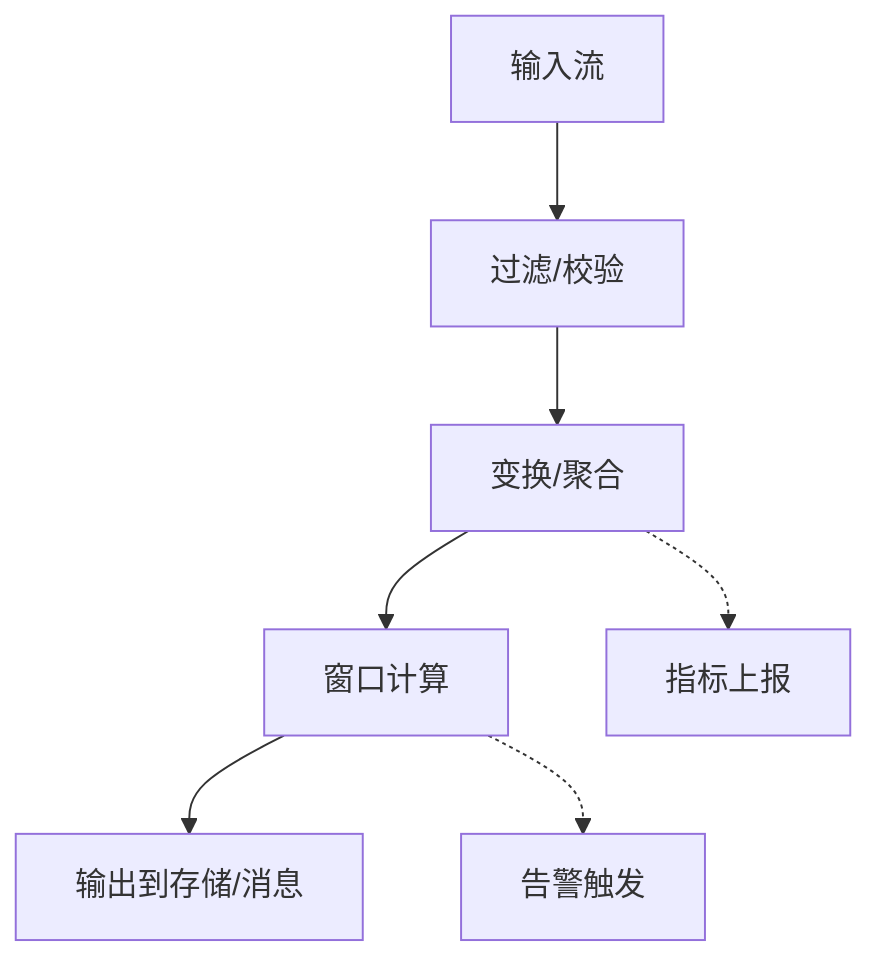
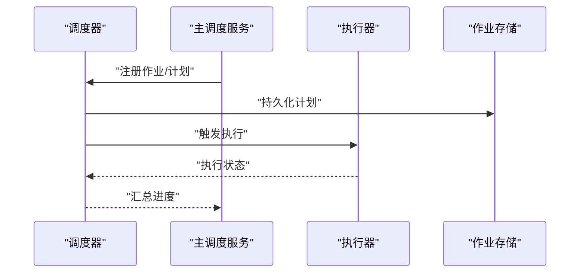
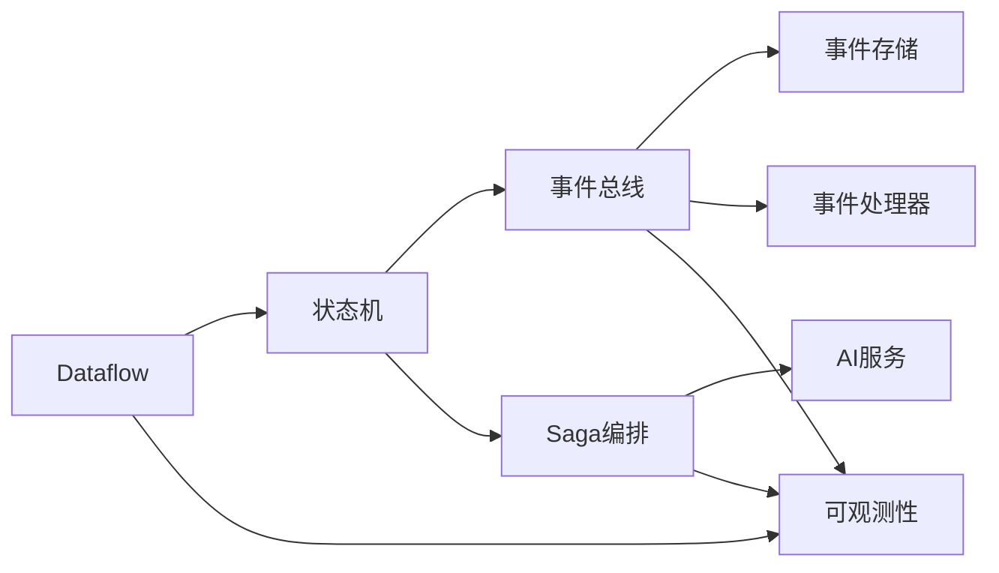

# AI工作流编排

<cite>
**本文引用的文件**   
- [dataflow_pipeline.cs](file://code/dataflow_pipeline.cs)
- [dataflow_demo.cs](file://code/dataflow_demo.cs)
- [dataflow_production_integration.cs](file://code/dataflow_production_integration.cs)
- [multistage_pipeline.cs](file://code/multistage_pipeline.cs)
- [state_machine_flow.cs](file://code/state_machine_flow.cs)
- [liquidstate_advanced_integration.cs](file://code/liquidstate_advanced_integration.cs)
- [liquidstate_integration.cs](file://code/liquidstate_integration.cs)
- [orleans_statemachine_integration.cs](file://code/orleans_statemachine_integration.cs)
- [event_sourcing_processor.cs](file://code/event_sourcing_processor.cs)
- [eventsourcing_service.cs](file://code/eventsourcing_service.cs)
- [litedb_eventstore.cs](file://code/litedb_eventstore.cs)
- [litedb_eventbus.cs](file://code/litedb_eventbus.cs)
- [litedb_eventhandlers.cs](file://code/litedb_eventhandlers.cs)
- [wolverine_saga_orchestration.cs](file://code/wolverine_saga_orchestration.cs)
- [saga_orchestrator.cs](file://code/saga_orchestrator.cs)
- [realtime_analytics.cs](file://code/realtime_analytics.cs)
- [realtime_etl.cs](file://code/realtime_etl.cs)
- [task_scheduler_service.cs](file://code/task_scheduler_service.cs)
- [schedule_master_service.cs](file://code/schedule_master_service.cs)
- [distributed_audit_store.cs](file://code/distributed_audit_store.cs)
- [dead_letter.cs](file://code/dead_letter.cs)
- [resilient_polly_integration.cs](file://code/resilient_polly_integration.cs)
- [http_resilience_advanced_integration.cs](file://code/http_resilience_advanced_integration.cs)
- [opentelemetry_integration.cs](file://code/opentelemetry_integration.cs)
- [prometheus_metrics.cs](file://code/prometheus_metrics.cs)
</cite>

## 目录
1. [简介](#简介)
2. [项目结构](#项目结构)
3. [核心组件](#核心组件)
4. [架构总览](#架构总览)
5. [详细组件分析](#详细组件分析)
6. [依赖关系分析](#依赖关系分析)
7. [性能考量](#性能考量)
8. [故障排查指南](#故障排查指南)
9. [结论](#结论)
10. [附录](#附录)

## 简介
本文件面向复杂AI应用的流程编排，围绕Dataflow管道、状态机模式与事件驱动架构，系统阐述多阶段数据处理、并行计算、错误处理与重试机制，并给出实时分析流水线、批处理作业调度与分布式AI任务编排的最佳实践。文档以仓库中的示例实现为依据，提供从概念到代码级映射的可视化说明，帮助读者快速落地可观测、可扩展、高可用的AI工作流。

## 项目结构
该仓库采用“按主题/能力”组织的大量独立示例文件，涵盖数据流、状态机、事件溯源、Saga编排、实时分析、调度与可观测性等。与AI工作流编排直接相关的核心文件集中在以下类别：
- Dataflow管道：用于构建高吞吐、低延迟的多阶段处理管线
- 状态机：用于显式建模工作流生命周期与分支收敛
- 事件驱动：基于事件总线/事件存储实现解耦与可回放
- Saga编排：跨服务长事务编排与补偿
- 实时分析/ETL：流式处理与近实时聚合
- 调度器：定时/周期性与分布式任务调度
- 可靠性与可观测性：重试、熔断、死信队列、指标与追踪

图表来源
- [dataflow_pipeline.cs](file://code/dataflow_pipeline.cs)
- [multistage_pipeline.cs](file://code/multistage_pipeline.cs)
- [realtime_analytics.cs](file://code/realtime_analytics.cs)
- [realtime_etl.cs](file://code/realtime_etl.cs)
- [state_machine_flow.cs](file://code/state_machine_flow.cs)
- [liquidstate_integration.cs](file://code/liquidstate_integration.cs)
- [liquidstate_advanced_integration.cs](file://code/liquidstate_advanced_integration.cs)
- [orleans_statemachine_integration.cs](file://code/orleans_statemachine_integration.cs)
- [event_sourcing_processor.cs](file://code/event_sourcing_processor.cs)
- [eventsourcing_service.cs](file://code/eventsourcing_service.cs)
- [litedb_eventstore.cs](file://code/litedb_eventstore.cs)
- [litedb_eventbus.cs](file://code/litedb_eventbus.cs)
- [litedb_eventhandlers.cs](file://code/litedb_eventhandlers.cs)
- [wolverine_saga_orchestration.cs](file://code/wolverine_saga_orchestration.cs)
- [saga_orchestrator.cs](file://code/saga_orchestrator.cs)
- [task_scheduler_service.cs](file://code/task_scheduler_service.cs)
- [schedule_master_service.cs](file://code/schedule_master_service.cs)
- [dead_letter.cs](file://code/dead_letter.cs)
- [resilient_polly_integration.cs](file://code/resilient_polly_integration.cs)
- [http_resilience_advanced_integration.cs](file://code/http_resilience_advanced_integration.cs)
- [opentelemetry_integration.cs](file://code/opentelemetry_integration.cs)
- [prometheus_metrics.cs](file://code/prometheus_metrics.cs)

章节来源
- [dataflow_pipeline.cs](file://code/dataflow_pipeline.cs)
- [multistage_pipeline.cs](file://code/multistage_pipeline.cs)
- [state_machine_flow.cs](file://code/state_machine_flow.cs)
- [liquidstate_integration.cs](file://code/liquidstate_integration.cs)
- [liquidstate_advanced_integration.cs](file://code/liquidstate_advanced_integration.cs)
- [orleans_statemachine_integration.cs](file://code/orleans_statemachine_integration.cs)
- [event_sourcing_processor.cs](file://code/event_sourcing_processor.cs)
- [eventsourcing_service.cs](file://code/eventsourcing_service.cs)
- [litedb_eventstore.cs](file://code/litedb_eventstore.cs)
- [litedb_eventbus.cs](file://code/litedb_eventbus.cs)
- [litedb_eventhandlers.cs](file://code/litedb_eventhandlers.cs)
- [wolverine_saga_orchestration.cs](file://code/wolverine_saga_orchestration.cs)
- [saga_orchestrator.cs](file://code/saga_orchestrator.cs)
- [task_scheduler_service.cs](file://code/task_scheduler_service.cs)
- [schedule_master_service.cs](file://code/schedule_master_service.cs)
- [dead_letter.cs](file://code/dead_letter.cs)
- [resilient_polly_integration.cs](file://code/resilient_polly_integration.cs)
- [http_resilience_advanced_integration.cs](file://code/http_resilience_advanced_integration.cs)
- [opentelemetry_integration.cs](file://code/opentelemetry_integration.cs)
- [prometheus_metrics.cs](file://code/prometheus_metrics.cs)

## 核心组件
- Dataflow管道：通过有向图式的处理节点与缓冲，实现高并发、背压可控的数据流转；适用于图像预处理、特征提取、推理后处理等阶段化AI任务。
- 状态机：将工作流生命周期抽象为状态与转移，支持条件分支、合并、超时与补偿，适合长耗时AI任务（如训练、评估、部署）的可靠编排。
- 事件驱动：以不可变事件为核心，实现解耦、可回放与审计；结合事件存储与处理器，支撑AI流水线的幂等与一致性。
- Saga编排：跨多个服务或步骤的分布式事务编排，失败时执行补偿动作，保证最终一致性。
- 实时分析/ETL：基于流式处理框架，对输入事件进行窗口聚合、过滤与转换，输出到下游消费者或存储。
- 调度器：集中式或分布式任务调度，支持周期性、延迟与依赖触发，保障批处理与离线AI任务的稳定运行。
- 可靠性与可观测性：重试、退避、熔断、降级、死信队列、指标与分布式追踪，确保流水线在异常场景下的鲁棒性与可诊断性。

章节来源
- [dataflow_pipeline.cs](file://code/dataflow_pipeline.cs)
- [state_machine_flow.cs](file://code/state_machine_flow.cs)
- [event_sourcing_processor.cs](file://code/event_sourcing_processor.cs)
- [wolverine_saga_orchestration.cs](file://code/wolverine_saga_orchestration.cs)
- [realtime_analytics.cs](file://code/realtime_analytics.cs)
- [task_scheduler_service.cs](file://code/task_scheduler_service.cs)
- [dead_letter.cs](file://code/dead_letter.cs)
- [resilient_polly_integration.cs](file://code/resilient_polly_integration.cs)
- [opentelemetry_integration.cs](file://code/opentelemetry_integration.cs)

## 架构总览
下图展示了一个典型的AI工作流编排架构：上游数据源经Dataflow管道进行多阶段处理，中间由状态机管理任务生命周期，事件总线承载步骤间通信，Saga协调跨服务调用，调度器驱动批处理，所有环节通过指标与追踪进行可观测。

图表来源
- [dataflow_pipeline.cs](file://code/dataflow_pipeline.cs)
- [state_machine_flow.cs](file://code/state_machine_flow.cs)
- [litedb_eventbus.cs](file://code/litedb_eventbus.cs)
- [litedb_eventstore.cs](file://code/litedb_eventstore.cs)
- [wolverine_saga_orchestration.cs](file://code/wolverine_saga_orchestration.cs)
- [opentelemetry_integration.cs](file://code/opentelemetry_integration.cs)

## 详细组件分析

### Dataflow管道与多阶段处理
- 设计要点
  - 使用有向无环图组织处理阶段，每个阶段具备独立的缓冲区与并发度控制
  - 通过背压与限流避免上游过载，保障整体稳定性
  - 支持并行计算与结果合并，提升吞吐
- 适用场景
  - 图像预处理→特征抽取→模型推理→后处理→结果落库
  - 文本清洗→分词→嵌入→检索→生成→校验
- 关键实现参考
  - 管道定义与阶段装配
  - 生产/消费端缓冲与并发配置
  - 错误隔离与失败路由

图表来源
- [dataflow_pipeline.cs](file://code/dataflow_pipeline.cs)
- [multistage_pipeline.cs](file://code/multistage_pipeline.cs)
- [dead_letter.cs](file://code/dead_letter.cs)

章节来源
- [dataflow_pipeline.cs](file://code/dataflow_pipeline.cs)
- [multistage_pipeline.cs](file://code/multistage_pipeline.cs)
- [dataflow_demo.cs](file://code/dataflow_demo.cs)
- [dataflow_production_integration.cs](file://code/dataflow_production_integration.cs)

### 状态机与工作流生命周期
- 设计要点
  - 显式定义状态集合与转移规则，避免隐式控制流
  - 支持条件分支、并行分支汇聚、超时与告警
  - 状态变更与事件一致，便于审计与回放
- 适用场景
  - 长耗时AI任务的生命周期管理（准备→训练→评估→部署→监控）
  - 多步骤审批与人工干预流程
- 关键实现参考
  - 状态定义与转移函数
  - 事件驱动的自动推进
  - 超时与补偿逻辑

图表来源
- [state_machine_flow.cs](file://code/state_machine_flow.cs)
- [liquidstate_integration.cs](file://code/liquidstate_integration.cs)
- [liquidstate_advanced_integration.cs](file://code/liquidstate_advanced_integration.cs)
- [orleans_statemachine_integration.cs](file://code/orleans_statemachine_integration.cs)

章节来源
- [state_machine_flow.cs](file://code/state_machine_flow.cs)
- [liquidstate_integration.cs](file://code/liquidstate_integration.cs)
- [liquidstate_advanced_integration.cs](file://code/liquidstate_advanced_integration.cs)
- [orleans_statemachine_integration.cs](file://code/orleans_statemachine_integration.cs)

### 事件驱动与事件溯源
- 设计要点
  - 以不可变事件为中心，记录系统状态变更的历史
  - 事件存储作为单一事实源，支持重放与重建
  - 事件处理器实现业务逻辑，保持幂等与顺序性
- 适用场景
  - AI流水线各阶段的状态同步与审计
  - 跨服务协作与最终一致性
- 关键实现参考
  - 事件模型与序列化
  - 事件存储与查询
  - 事件总线与处理器注册

图表来源
- [event_sourcing_processor.cs](file://code/event_sourcing_processor.cs)
- [eventsourcing_service.cs](file://code/eventsourcing_service.cs)
- [litedb_eventstore.cs](file://code/litedb_eventstore.cs)
- [litedb_eventbus.cs](file://code/litedb_eventbus.cs)
- [litedb_eventhandlers.cs](file://code/litedb_eventhandlers.cs)

章节来源
- [event_sourcing_processor.cs](file://code/event_sourcing_processor.cs)
- [eventsourcing_service.cs](file://code/eventsourcing_service.cs)
- [litedb_eventstore.cs](file://code/litedb_eventstore.cs)
- [litedb_eventbus.cs](file://code/litedb_eventbus.cs)
- [litedb_eventhandlers.cs](file://code/litedb_eventhandlers.cs)

### Saga编排与分布式事务
- 设计要点
  - 将长事务拆分为多个本地事务步骤，配合补偿动作保证最终一致性
  - 编排器负责步骤顺序、异常处理与补偿执行
  - 支持重试、超时与人工介入
- 适用场景
  - 跨多个AI服务的端到端编排（数据准备→训练→评估→部署→通知）
  - 需要回滚或补偿的复杂业务流程
- 关键实现参考
  - Saga步骤定义与编排
  - 补偿逻辑与幂等性
  - 状态持久化与恢复

图表来源
- [wolverine_saga_orchestration.cs](file://code/wolverine_saga_orchestration.cs)
- [saga_orchestrator.cs](file://code/saga_orchestrator.cs)

章节来源
- [wolverine_saga_orchestration.cs](file://code/wolverine_saga_orchestration.cs)
- [saga_orchestrator.cs](file://code/saga_orchestrator.cs)

### 实时分析与ETL流水线
- 设计要点
  - 基于流式处理框架，实现窗口聚合、过滤、转换与连接
  - 支持精确一次或至少一次语义，结合幂等与去重
  - 与外部存储/消息系统对接，输出到下游消费者
- 适用场景
  - 实时指标采集与告警
  - 近实时数据清洗与特征计算
- 关键实现参考
  - 流式算子定义与组合
  - 窗口与触发策略
  - 检查点与容错

图表来源
- [realtime_analytics.cs](file://code/realtime_analytics.cs)
- [realtime_etl.cs](file://code/realtime_etl.cs)

章节来源
- [realtime_analytics.cs](file://code/realtime_analytics.cs)
- [realtime_etl.cs](file://code/realtime_etl.cs)

### 批处理作业调度
- 设计要点
  - 集中式调度器维护作业元数据、依赖关系与执行计划
  - 支持周期性、延迟、事件触发与依赖触发
  - 分布式执行，具备故障转移与重试
- 适用场景
  - 离线AI训练、批量特征计算、报表生成
  - 定时数据同步与清理
- 关键实现参考
  - 作业定义与调度策略
  - 执行器与资源管理
  - 监控与告警

图表来源
- [task_scheduler_service.cs](file://code/task_scheduler_service.cs)
- [schedule_master_service.cs](file://code/schedule_master_service.cs)

章节来源
- [task_scheduler_service.cs](file://code/task_scheduler_service.cs)
- [schedule_master_service.cs](file://code/schedule_master_service.cs)

## 依赖关系分析
- 松耦合与内聚性
  - Dataflow、状态机、事件总线、Saga编排相互独立，通过明确接口交互
  - 事件存储与处理器解耦，便于扩展新处理器
- 外部依赖
  - 消息系统与存储（LiteDB、Redis、Kafka等）
  - 可观测性（OpenTelemetry、Prometheus）
- 潜在循环依赖
  - 通过事件与命令分离避免循环调用
  - 使用异步消息与CQRS降低耦合

图表来源
- [dataflow_pipeline.cs](file://code/dataflow_pipeline.cs)
- [state_machine_flow.cs](file://code/state_machine_flow.cs)
- [litedb_eventbus.cs](file://code/litedb_eventbus.cs)
- [litedb_eventstore.cs](file://code/litedb_eventstore.cs)
- [litedb_eventhandlers.cs](file://code/litedb_eventhandlers.cs)
- [wolverine_saga_orchestration.cs](file://code/wolverine_saga_orchestration.cs)
- [opentelemetry_integration.cs](file://code/opentelemetry_integration.cs)

章节来源
- [dataflow_pipeline.cs](file://code/dataflow_pipeline.cs)
- [state_machine_flow.cs](file://code/state_machine_flow.cs)
- [litedb_eventbus.cs](file://code/litedb_eventbus.cs)
- [litedb_eventstore.cs](file://code/litedb_eventstore.cs)
- [litedb_eventhandlers.cs](file://code/litedb_eventhandlers.cs)
- [wolverine_saga_orchestration.cs](file://code/wolverine_saga_orchestration.cs)
- [opentelemetry_integration.cs](file://code/opentelemetry_integration.cs)

## 性能考量
- 数据流优化
  - 合理设置阶段并发度与缓冲区大小，避免内存峰值过高
  - 使用零拷贝与高效序列化减少CPU与GC压力
- 状态机与事件
  - 事件压缩与分页查询，降低存储与网络开销
  - 状态快照与增量回放，缩短恢复时间
- 并行与负载均衡
  - 横向扩展处理节点，结合分区键实现均匀分布
  - 动态扩缩容与弹性伸缩
- 可观测性
  - 指标采样与聚合，避免高频上报影响性能
  - 分布式追踪采样率调优，平衡诊断与开销

[本节为通用指导，不直接分析具体文件]

## 故障排查指南
- 常见故障
  - 阶段处理失败：检查输入校验、资源不足、外部依赖超时
  - 状态卡住：检查事件是否到达、状态转移条件是否满足
  - 事件丢失或重复：检查幂等性、去重策略与一致性语义
  - 死信堆积：分析失败原因，修复后重新投递
- 排查手段
  - 查看指标与日志，定位瓶颈与异常
  - 重放事件，验证处理器正确性
  - 使用追踪链路，还原调用路径
- 恢复策略
  - 重试与退避，避免雪崩
  - 补偿与回滚，保证最终一致性
  - 降级与熔断，保护核心链路

章节来源
- [dead_letter.cs](file://code/dead_letter.cs)
- [resilient_polly_integration.cs](file://code/resilient_polly_integration.cs)
- [http_resilience_advanced_integration.cs](file://code/http_resilience_advanced_integration.cs)
- [opentelemetry_integration.cs](file://code/opentelemetry_integration.cs)
- [prometheus_metrics.cs](file://code/prometheus_metrics.cs)

## 结论
通过Dataflow管道、状态机与事件驱动的组合，可以构建出高可用、可扩展且可观测的AI工作流编排体系。结合Saga编排与调度器，能够覆盖从实时分析到批处理的完整场景。可靠性与可观测性是生产落地的关键，建议在设计与实现阶段即纳入考虑，持续优化性能与稳定性。

[本节为总结性内容，不直接分析具体文件]

## 附录
- 最佳实践清单
  - 明确阶段边界与职责，避免单点过载
  - 使用状态机显式管理生命周期，避免隐式状态
  - 以事件为中心，确保幂等与可回放
  - 引入重试、熔断与死信，提升韧性
  - 全面接入指标与追踪，实现可观测性
- 参考实现路径
  - Dataflow管道：[dataflow_pipeline.cs](file://code/dataflow_pipeline.cs)、[multistage_pipeline.cs](file://code/multistage_pipeline.cs)
  - 状态机：[state_machine_flow.cs](file://code/state_machine_flow.cs)、[liquidstate_integration.cs](file://code/liquidstate_integration.cs)
  - 事件驱动：[event_sourcing_processor.cs](file://code/event_sourcing_processor.cs)、[litedb_eventstore.cs](file://code/litedb_eventstore.cs)
  - Saga编排：[wolverine_saga_orchestration.cs](file://code/wolverine_saga_orchestration.cs)
  - 实时分析：[realtime_analytics.cs](file://code/realtime_analytics.cs)
  - 调度器：[task_scheduler_service.cs](file://code/task_scheduler_service.cs)
  - 可靠性：[dead_letter.cs](file://code/dead_letter.cs)、[resilient_polly_integration.cs](file://code/resilient_polly_integration.cs)
  - 可观测性：[opentelemetry_integration.cs](file://code/opentelemetry_integration.cs)、[prometheus_metrics.cs](file://code/prometheus_metrics.cs)

[本节为补充信息，不直接分析具体文件]