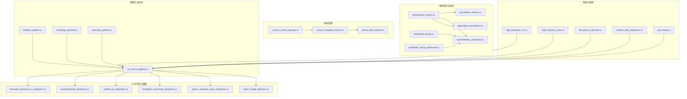
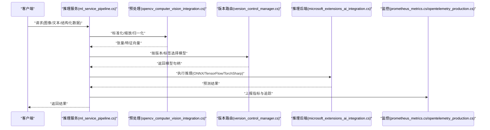
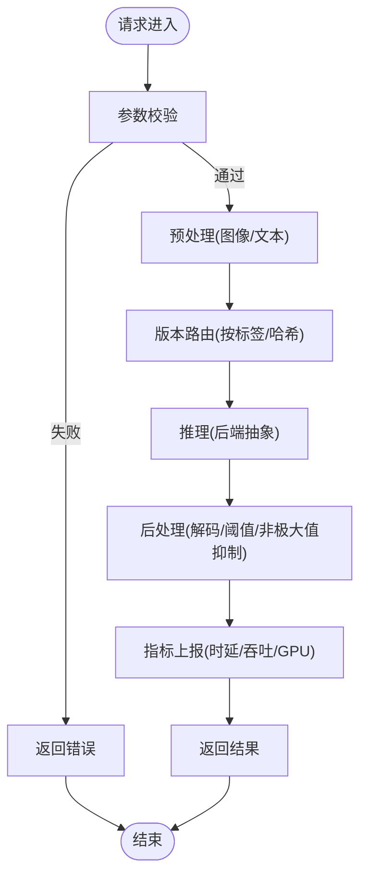
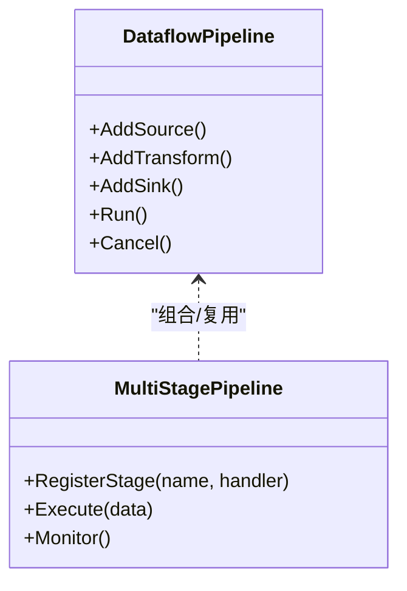
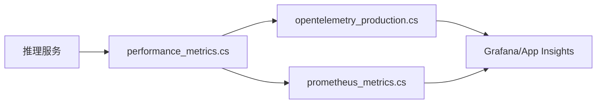
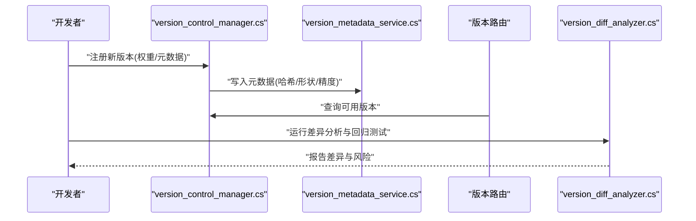
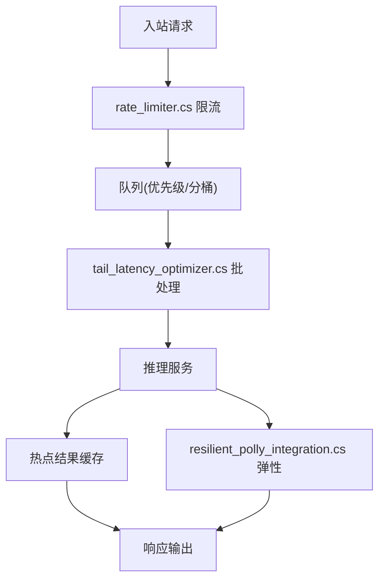
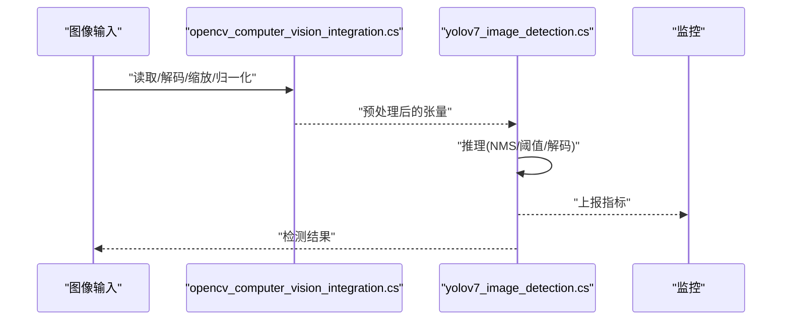
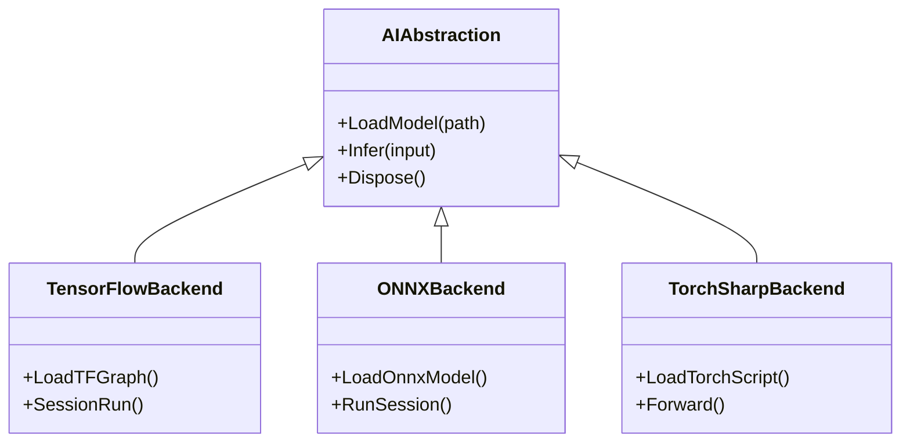
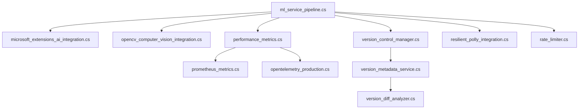

# 模型部署与优化

<cite>
**本文引用的文件**   
- [ml_service_pipeline.cs](file://ml_service_pipeline.cs)
- [microsoft_extensions_ai_integration.cs](file://microsoft_extensions_ai_integration.cs)
- [tensorflowsharp_integration.cs](file://tensorflowsharp_integration.cs)
- [paddle_ocr_integration.cs](file://paddle_ocr_integration.cs)
- [facedetect_torchsharp_integration.cs](file://facedetect_torchsharp_integration.cs)
- [opencv_computer_vision_integration.cs](file://opencv_computer_vision_integration.cs)
- [yolov7_image_detection.cs](file://yolov7_image_detection.cs)
- [performance_metrics.cs](file://performance_metrics.cs)
- [prometheus_metrics.cs](file://prometheus_metrics.cs)
- [opentelemetry_production.cs](file://opentelemetry_production.cs)
- [appinsights_prometheus.cs](file://appinsights_prometheus.cs)
- [version_control_manager.cs](file://version_control_manager.cs)
- [version_metadata_service.cs](file://version_metadata_service.cs)
- [version_diff_analyzer.cs](file://version_diff_analyzer.cs)
- [dataflow_pipeline.cs](file://dataflow_pipeline.cs)
- [multistage_pipeline.cs](file://multistage_pipeline.cs)
- [watchdog_pipeline.cs](file://watchdog_pipeline.cs)
- [high_frequency_1m.cs](file://high_frequency_1m.cs)
- [high_frequency_10m.cs](file://high_frequency_10m.cs)
- [tail_latency_optimizer.cs](file://tail_latency_optimizer.cs)
- [resilient_polly_integration.cs](file://resilient_polly_integration.cs)
- [rate_limiter.cs](file://rate_limiter.cs)
- [distributed_tracing.cs](file://distributed_tracing.cs)
- [distributed_tracing_enhanced.cs](file://distributed_tracing_enhanced.cs)
</cite>

## 目录
1. [简介](#简介)
2. [项目结构](#项目结构)
3. [核心组件](#核心组件)
4. [架构总览](#架构总览)
5. [详细组件分析](#详细组件分析)
6. [依赖关系分析](#依赖关系分析)
7. [性能考量](#性能考量)
8. [故障排查指南](#故障排查指南)
9. [结论](#结论)
10. [附录](#附录)

## 简介
本文件面向机器学习模型的工程化落地，围绕“部署策略、推理优化、性能监控”三大主题展开。结合仓库中的示例与集成代码，覆盖以下关键能力：
- ONNX 模型转换与统一推理接口（通过 Microsoft.Extensions.AI 抽象）
- TensorRT/ONNX Runtime/TensorFlow/TorchSharp 等后端加速路径
- GPU 加速与边缘设备部署要点
- 模型量化、剪枝、编译优化的实践建议
- 模型版本管理、A/B 测试、灰度发布与监控告警方案
- ML Pipeline 构建、数据管道优化与批量推理处理

## 项目结构
仓库以“技能/集成示例”组织，与模型部署相关的关键文件集中在根目录的 .cs 文件中，涵盖：
- 推理服务与流水线：ml_service_pipeline.cs、dataflow_pipeline.cs、multistage_pipeline.cs、watchdog_pipeline.cs
- AI 运行时与框架集成：microsoft_extensions_ai_integration.cs、tensorflowsharp_integration.cs、paddle_ocr_integration.cs、facedetect_torchsharp_integration.cs
- 计算机视觉与检测：opencv_computer_vision_integration.cs、yolov7_image_detection.cs
- 性能与可观测性：performance_metrics.cs、prometheus_metrics.cs、opentelemetry_production.cs、appinsights_prometheus.cs、distributed_tracing*.cs
- 版本管理与差异分析：version_control_manager.cs、version_metadata_service.cs、version_diff_analyzer.cs
- 高吞吐与延迟优化：high_frequency_1m.cs、high_frequency_10m.cs、tail_latency_optimizer.cs
- 弹性与限流：resilient_polly_integration.cs、rate_limiter.cs

**图表来源** 
- [ml_service_pipeline.cs](file://ml_service_pipeline.cs)
- [dataflow_pipeline.cs](file://dataflow_pipeline.cs)
- [multistage_pipeline.cs](file://multistage_pipeline.cs)
- [watchdog_pipeline.cs](file://watchdog_pipeline.cs)
- [microsoft_extensions_ai_integration.cs](file://microsoft_extensions_ai_integration.cs)
- [tensorflowsharp_integration.cs](file://tensorflowsharp_integration.cs)
- [paddle_ocr_integration.cs](file://paddle_ocr_integration.cs)
- [facedetect_torchsharp_integration.cs](file://facedetect_torchsharp_integration.cs)
- [opencv_computer_vision_integration.cs](file://opencv_computer_vision_integration.cs)
- [yolov7_image_detection.cs](file://yolov7_image_detection.cs)
- [performance_metrics.cs](file://performance_metrics.cs)
- [prometheus_metrics.cs](file://prometheus_metrics.cs)
- [opentelemetry_production.cs](file://opentelemetry_production.cs)
- [appinsights_prometheus.cs](file://appinsights_prometheus.cs)
- [distributed_tracing.cs](file://distributed_tracing.cs)
- [distributed_tracing_enhanced.cs](file://distributed_tracing_enhanced.cs)
- [version_control_manager.cs](file://version_control_manager.cs)
- [version_metadata_service.cs](file://version_metadata_service.cs)
- [version_diff_analyzer.cs](file://version_diff_analyzer.cs)
- [high_frequency_1m.cs](file://high_frequency_1m.cs)
- [high_frequency_10m.cs](file://high_frequency_10m.cs)
- [tail_latency_optimizer.cs](file://tail_latency_optimizer.cs)
- [resilient_polly_integration.cs](file://resilient_polly_integration.cs)
- [rate_limiter.cs](file://rate_limiter.cs)

**章节来源**
- [ml_service_pipeline.cs](file://ml_service_pipeline.cs)
- [dataflow_pipeline.cs](file://dataflow_pipeline.cs)
- [multistage_pipeline.cs](file://multistage_pipeline.cs)
- [watchdog_pipeline.cs](file://watchdog_pipeline.cs)
- [microsoft_extensions_ai_integration.cs](file://microsoft_extensions_ai_integration.cs)
- [tensorflowsharp_integration.cs](file://tensorflowsharp_integration.cs)
- [paddle_ocr_integration.cs](file://paddle_ocr_integration.cs)
- [facedetect_torchsharp_integration.cs](file://facedetect_torchsharp_integration.cs)
- [opencv_computer_vision_integration.cs](file://opencv_computer_vision_integration.cs)
- [yolov7_image_detection.cs](file://yolov7_image_detection.cs)
- [performance_metrics.cs](file://performance_metrics.cs)
- [prometheus_metrics.cs](file://prometheus_metrics.cs)
- [opentelemetry_production.cs](file://opentelemetry_production.cs)
- [appinsights_prometheus.cs](file://appinsights_prometheus.cs)
- [distributed_tracing.cs](file://distributed_tracing.cs)
- [distributed_tracing_enhanced.cs](file://distributed_tracing_enhanced.cs)
- [version_control_manager.cs](file://version_control_manager.cs)
- [version_metadata_service.cs](file://version_metadata_service.cs)
- [version_diff_analyzer.cs](file://version_diff_analyzer.cs)
- [high_frequency_1m.cs](file://high_frequency_1m.cs)
- [high_frequency_10m.cs](file://high_frequency_10m.cs)
- [tail_latency_optimizer.cs](file://tail_latency_optimizer.cs)
- [resilient_polly_integration.cs](file://resilient_polly_integration.cs)
- [rate_limiter.cs](file://rate_limiter.cs)

## 核心组件
- 推理服务与流水线
  - ml_service_pipeline.cs：封装模型加载、预处理、推理、后处理的统一入口，支持多后端切换与批处理。
  - dataflow_pipeline.cs / multistage_pipeline.cs：基于 Dataflow/自定义阶段式流水线，实现高吞吐、背压与并行。
  - watchdog_pipeline.cs：对推理链路进行健康检查、超时熔断与降级。
- AI 运行时与框架集成
  - microsoft_extensions_ai_integration.cs：通过统一的 AI 抽象层对接不同推理后端（ONNX、TensorFlow、TorchSharp 等）。
  - tensorflowsharp_integration.cs：TensorFlow 模型加载与执行。
  - paddle_ocr_integration.cs：PaddleOCR 文本识别推理。
  - facedetect_torchsharp_integration.cs：基于 TorchSharp 的人脸检测推理。
  - opencv_computer_vision_integration.cs：OpenCV 图像预处理与基础视觉算子。
  - yolov7_image_detection.cs：YOLOv7 目标检测推理流程。
- 可观测性与监控
  - performance_metrics.cs：采集推理时延、吞吐、内存、GPU 使用率等指标。
  - prometheus_metrics.cs：Prometheus 指标暴露与抓取。
  - opentelemetry_production.cs：分布式追踪与日志关联。
  - appinsights_prometheus.cs：App Insights 与 Prometheus 集成。
  - distributed_tracing*.cs：跨进程/服务的调用链追踪。
- 版本管理
  - version_control_manager.cs：模型版本注册、拉取与回滚。
  - version_metadata_service.cs：模型元数据（哈希、精度、输入形状等）管理。
  - version_diff_analyzer.cs：模型变更对比与回归评估。
- 性能与弹性
  - high_frequency_1m.cs / high_frequency_10m.cs：高吞吐场景下的并发与内存优化。
  - tail_latency_optimizer.cs：尾延迟优化策略（批大小调优、调度、缓存）。
  - resilient_polly_integration.cs：重试、退避、熔断与短路。
  - rate_limiter.cs：令牌桶/漏桶限流保护。

**章节来源**
- [ml_service_pipeline.cs](file://ml_service_pipeline.cs)
- [dataflow_pipeline.cs](file://dataflow_pipeline.cs)
- [multistage_pipeline.cs](file://multistage_pipeline.cs)
- [watchdog_pipeline.cs](file://watchdog_pipeline.cs)
- [microsoft_extensions_ai_integration.cs](file://microsoft_extensions_ai_integration.cs)
- [tensorflowsharp_integration.cs](file://tensorflowsharp_integration.cs)
- [paddle_ocr_integration.cs](file://paddle_ocr_integration.cs)
- [facedetect_torchsharp_integration.cs](file://facedetect_torchsharp_integration.cs)
- [opencv_computer_vision_integration.cs](file://opencv_computer_vision_integration.cs)
- [yolov7_image_detection.cs](file://yolov7_image_detection.cs)
- [performance_metrics.cs](file://performance_metrics.cs)
- [prometheus_metrics.cs](file://prometheus_metrics.cs)
- [opentelemetry_production.cs](file://opentelemetry_production.cs)
- [appinsights_prometheus.cs](file://appinsights_prometheus.cs)
- [distributed_tracing.cs](file://distributed_tracing.cs)
- [distributed_tracing_enhanced.cs](file://distributed_tracing_enhanced.cs)
- [version_control_manager.cs](file://version_control_manager.cs)
- [version_metadata_service.cs](file://version_metadata_service.cs)
- [version_diff_analyzer.cs](file://version_diff_analyzer.cs)
- [high_frequency_1m.cs](file://high_frequency_1m.cs)
- [high_frequency_10m.cs](file://high_frequency_10m.cs)
- [tail_latency_optimizer.cs](file://tail_latency_optimizer.cs)
- [resilient_polly_integration.cs](file://resilient_polly_integration.cs)
- [rate_limiter.cs](file://rate_limiter.cs)

## 架构总览
下图展示从请求进入、数据预处理、模型推理到结果后处理与监控上报的整体流程，并体现多后端与版本路由能力。

**图表来源** 
- [ml_service_pipeline.cs](file://ml_service_pipeline.cs)
- [opencv_computer_vision_integration.cs](file://opencv_computer_vision_integration.cs)
- [version_control_manager.cs](file://version_control_manager.cs)
- [microsoft_extensions_ai_integration.cs](file://microsoft_extensions_ai_integration.cs)
- [prometheus_metrics.cs](file://prometheus_metrics.cs)
- [opentelemetry_production.cs](file://opentelemetry_production.cs)

## 详细组件分析

### 推理服务与流水线（ml_service_pipeline.cs）
- 职责
  - 统一入口：封装模型加载、预热、推理、批处理、缓存与错误恢复。
  - 后端抽象：通过 AI 抽象层动态选择 ONNX/TensorFlow/TorchSharp 等后端。
  - 版本路由：根据版本标签或权重哈希选择模型实例。
- 关键流程
  - 请求进入 → 参数校验 → 预处理 → 版本路由 → 推理 → 后处理 → 指标上报 → 响应。
- 优化点
  - 批处理聚合、零拷贝缓冲、线程池隔离、GPU 内存池。
  - 失败重试与熔断、超时控制、降级为轻量模型。

**图表来源** 
- [ml_service_pipeline.cs](file://ml_service_pipeline.cs)
- [opencv_computer_vision_integration.cs](file://opencv_computer_vision_integration.cs)
- [microsoft_extensions_ai_integration.cs](file://microsoft_extensions_ai_integration.cs)
- [performance_metrics.cs](file://performance_metrics.cs)

**章节来源**
- [ml_service_pipeline.cs](file://ml_service_pipeline.cs)
- [opencv_computer_vision_integration.cs](file://opencv_computer_vision_integration.cs)
- [microsoft_extensions_ai_integration.cs](file://microsoft_extensions_ai_integration.cs)
- [performance_metrics.cs](file://performance_metrics.cs)

### 数据与多阶段流水线（dataflow_pipeline.cs / multistage_pipeline.cs）
- 设计模式
  - Dataflow 管道：生产者-消费者、有界缓冲、取消令牌、背压。
  - 多阶段流水线：将预处理、推理、后处理拆分为独立阶段，便于扩展与监控。
- 适用场景
  - 高吞吐批量推理、流式数据处理、复杂预处理链路。
- 优化建议
  - 合理设置缓冲区大小与并发度；避免频繁装箱/拆箱；使用 Span/Memory 减少分配。

**图表来源** 
- [dataflow_pipeline.cs](file://dataflow_pipeline.cs)
- [multistage_pipeline.cs](file://multistage_pipeline.cs)

**章节来源**
- [dataflow_pipeline.cs](file://dataflow_pipeline.cs)
- [multistage_pipeline.cs](file://multistage_pipeline.cs)

### 可观测性与监控（performance_metrics.cs / prometheus_metrics.cs / opentelemetry_production.cs）
- 指标维度
  - 时延（P50/P95/P99）、吞吐（QPS）、错误率、资源使用（CPU/GPU/内存）。
- 追踪与日志
  - OpenTelemetry 生成 Trace/Span，关联日志与指标。
  - App Insights 与 Prometheus 双通道上报，便于告警与可视化。
- 告警规则
  - 基于阈值（如 P99 > 200ms、错误率 > 1%）触发告警。

**图表来源** 
- [performance_metrics.cs](file://performance_metrics.cs)
- [prometheus_metrics.cs](file://prometheus_metrics.cs)
- [opentelemetry_production.cs](file://opentelemetry_production.cs)
- [appinsights_prometheus.cs](file://appinsights_prometheus.cs)

**章节来源**
- [performance_metrics.cs](file://performance_metrics.cs)
- [prometheus_metrics.cs](file://prometheus_metrics.cs)
- [opentelemetry_production.cs](file://opentelemetry_production.cs)
- [appinsights_prometheus.cs](file://appinsights_prometheus.cs)

### 版本管理与 A/B 测试（version_control_manager.cs / version_metadata_service.cs / version_diff_analyzer.cs）
- 版本管理
  - 注册模型版本（含哈希、输入形状、精度、依赖），支持热更新与回滚。
- A/B 测试
  - 按流量比例路由到不同版本，收集指标与用户反馈。
- 差异分析
  - 对比模型权重/结构变化，自动触发回归测试与性能基准。

**图表来源** 
- [version_control_manager.cs](file://version_control_manager.cs)
- [version_metadata_service.cs](file://version_metadata_service.cs)
- [version_diff_analyzer.cs](file://version_diff_analyzer.cs)

**章节来源**
- [version_control_manager.cs](file://version_control_manager.cs)
- [version_metadata_service.cs](file://version_metadata_service.cs)
- [version_diff_analyzer.cs](file://version_diff_analyzer.cs)

### 高性能推理与尾延迟优化（high_frequency_1m.cs / high_frequency_10m.cs / tail_latency_optimizer.cs）
- 高吞吐
  - 多线程/异步 I/O、对象池、零拷贝、批大小自适应。
- 尾延迟优化
  - 分桶批处理、优先级队列、热点缓存、GPU 内核融合。
- 弹性与限流
  - 基于 Polly 的重试/退避/熔断，令牌桶限流保护。

**图表来源** 
- [high_frequency_1m.cs](file://high_frequency_1m.cs)
- [high_frequency_10m.cs](file://high_frequency_10m.cs)
- [tail_latency_optimizer.cs](file://tail_latency_optimizer.cs)
- [rate_limiter.cs](file://rate_limiter.cs)
- [resilient_polly_integration.cs](file://resilient_polly_integration.cs)

**章节来源**
- [high_frequency_1m.cs](file://high_frequency_1m.cs)
- [high_frequency_10m.cs](file://high_frequency_10m.cs)
- [tail_latency_optimizer.cs](file://tail_latency_optimizer.cs)
- [rate_limiter.cs](file://rate_limiter.cs)
- [resilient_polly_integration.cs](file://resilient_polly_integration.cs)

### 计算机视觉与检测（opencv_computer_vision_integration.cs / yolov7_image_detection.cs）
- 预处理
  - 缩放、裁剪、归一化、颜色空间转换。
- 推理
  - YOLOv7 检测：NMS、置信度阈值、边界框解码。
- 优化
  - 使用 GPU 加速、批处理、内存池、避免频繁 GC。

**图表来源** 
- [opencv_computer_vision_integration.cs](file://opencv_computer_vision_integration.cs)
- [yolov7_image_detection.cs](file://yolov7_image_detection.cs)

**章节来源**
- [opencv_computer_vision_integration.cs](file://opencv_computer_vision_integration.cs)
- [yolov7_image_detection.cs](file://yolov7_image_detection.cs)

### 多框架推理后端（microsoft_extensions_ai_integration.cs / tensorflowsharp_integration.cs / paddle_ocr_integration.cs / facedetect_torchsharp_integration.cs）
- 统一抽象
  - 通过 Microsoft.Extensions.AI 抽象层屏蔽后端差异，支持 ONNX/TensorFlow/TorchSharp。
- 后端特性
  - TensorFlowSharp：原生 TF 图执行。
  - PaddleOCR：文本识别专用优化。
  - TorchSharp：PyTorch 生态在 .NET 的执行。
- 选择策略
  - 根据模型格式、硬件（CPU/GPU/NPU）、延迟要求选择最优后端。

**图表来源** 
- [microsoft_extensions_ai_integration.cs](file://microsoft_extensions_ai_integration.cs)
- [tensorflowsharp_integration.cs](file://tensorflowsharp_integration.cs)
- [paddle_ocr_integration.cs](file://paddle_ocr_integration.cs)
- [facedetect_torchsharp_integration.cs](file://facedetect_torchsharp_integration.cs)

**章节来源**
- [microsoft_extensions_ai_integration.cs](file://microsoft_extensions_ai_integration.cs)
- [tensorflowsharp_integration.cs](file://tensorflowsharp_integration.cs)
- [paddle_ocr_integration.cs](file://paddle_ocr_integration.cs)
- [facedetect_torchsharp_integration.cs](file://facedetect_torchsharp_integration.cs)

## 依赖关系分析
- 耦合与内聚
  - 推理服务与后端抽象解耦，便于替换与扩展。
  - 监控与追踪模块独立，不影响主链路。
- 外部依赖
  - ONNX Runtime、TensorFlow、TorchSharp、OpenCV、Prometheus、OpenTelemetry。
- 潜在循环依赖
  - 通过接口抽象与事件总线避免直接循环引用。

**图表来源** 
- [ml_service_pipeline.cs](file://ml_service_pipeline.cs)
- [microsoft_extensions_ai_integration.cs](file://microsoft_extensions_ai_integration.cs)
- [opencv_computer_vision_integration.cs](file://opencv_computer_vision_integration.cs)
- [performance_metrics.cs](file://performance_metrics.cs)
- [prometheus_metrics.cs](file://prometheus_metrics.cs)
- [opentelemetry_production.cs](file://opentelemetry_production.cs)
- [version_control_manager.cs](file://version_control_manager.cs)
- [version_metadata_service.cs](file://version_metadata_service.cs)
- [version_diff_analyzer.cs](file://version_diff_analyzer.cs)
- [resilient_polly_integration.cs](file://resilient_polly_integration.cs)
- [rate_limiter.cs](file://rate_limiter.cs)

**章节来源**
- [ml_service_pipeline.cs](file://ml_service_pipeline.cs)
- [microsoft_extensions_ai_integration.cs](file://microsoft_extensions_ai_integration.cs)
- [opencv_computer_vision_integration.cs](file://opencv_computer_vision_integration.cs)
- [performance_metrics.cs](file://performance_metrics.cs)
- [prometheus_metrics.cs](file://prometheus_metrics.cs)
- [opentelemetry_production.cs](file://opentelemetry_production.cs)
- [version_control_manager.cs](file://version_control_manager.cs)
- [version_metadata_service.cs](file://version_metadata_service.cs)
- [version_diff_analyzer.cs](file://version_diff_analyzer.cs)
- [resilient_polly_integration.cs](file://resilient_polly_integration.cs)
- [rate_limiter.cs](file://rate_limiter.cs)

## 性能考量
- 推理优化
  - 批处理与动态批大小、张量内存池、零拷贝、GPU 内核融合。
  - 模型量化（INT8/FP16）、剪枝（结构化/非结构化）、算子融合与图优化（ONNX/TensorRT）。
- 系统级优化
  - 线程池隔离、NUMA 亲和、I/O 异步、缓存热点结果。
- 监控与调优
  - 基于 Prometheus/OpenTelemetry 的指标与追踪，定位瓶颈（CPU/GPU/IO）。
  - A/B 测试与灰度发布验证优化收益。

[本节为通用指导，不直接分析具体文件]

## 故障排查指南
- 常见问题
  - 模型加载失败：检查路径、权限、依赖库版本。
  - 推理超时：调整批大小、线程数、GPU 显存；启用熔断与降级。
  - 内存泄漏：检查对象池回收、避免大对象频繁分配。
  - 指标缺失：确认 Prometheus/OTEL 配置与端口。
- 诊断步骤
  - 查看分布式追踪（Trace ID）定位慢调用。
  - 检查资源使用（CPU/GPU/内存）与错误日志。
  - 回滚到稳定版本，逐步引入变更。

**章节来源**
- [resilient_polly_integration.cs](file://resilient_polly_integration.cs)
- [rate_limiter.cs](file://rate_limiter.cs)
- [opentelemetry_production.cs](file://opentelemetry_production.cs)
- [prometheus_metrics.cs](file://prometheus_metrics.cs)

## 结论
通过统一的推理抽象、模块化流水线、完善的监控与版本管理，可在多框架与多硬件环境下实现高效、稳定的模型部署。结合量化、剪枝与编译优化，以及 A/B 测试与灰度发布，能够持续迭代并保障线上质量。

[本节为总结，不直接分析具体文件]

## 附录
- 推荐实践
  - 优先使用 ONNX 作为中间格式，便于跨平台与工具链互通。
  - 在 GPU 环境优先尝试 TensorRT/ONNX Runtime 加速。
  - 边缘设备关注量化与模型压缩，降低内存与功耗。
  - 建立完善的指标与告警体系，确保问题早发现早恢复。

[本节为补充信息，不直接分析具体文件]