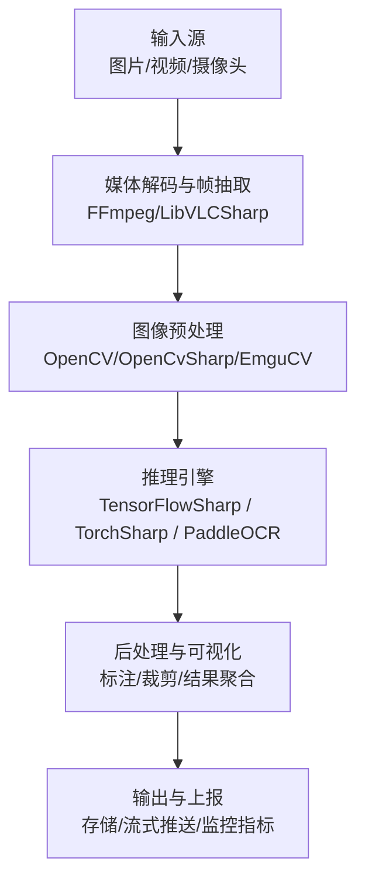
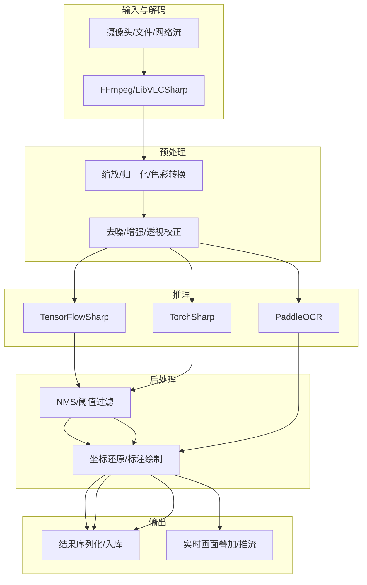
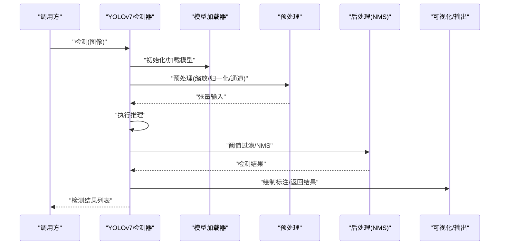
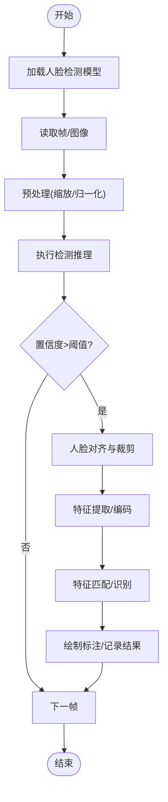
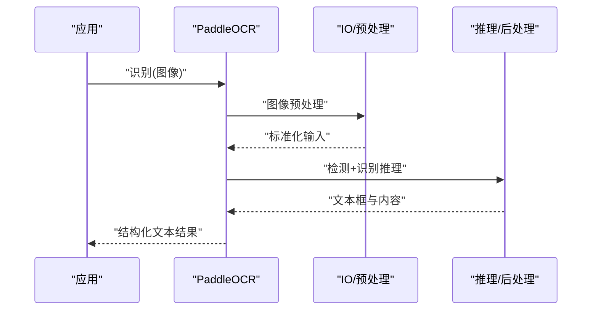
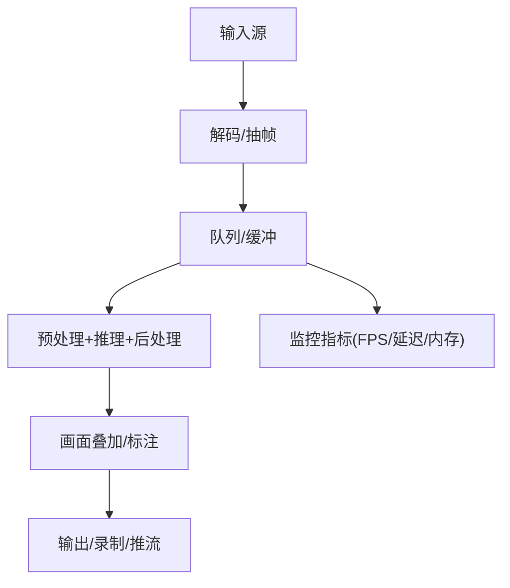
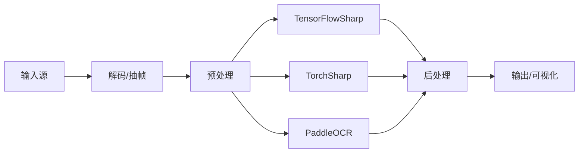

# 计算机视觉集成

<cite>
**本文引用的文件**   
- [tensorflowsharp_integration.cs](file://tensorflowsharp_integration.cs)
- [opencv_computer_vision_integration.cs](file://opencv_computer_vision_integration.cs)
- [opencv_video_processing.cs](file://opencv_video_processing.cs)
- [opencv_extended.cs](file://opencv_extended.cs)
- [opencv_biometric_processor.cs](file://opencv_biometric_processor.cs)
- [facedetect_torchsharp_integration.cs](file://facedetect_torchsharp_integration.cs)
- [facerecognition_dotnet_integration.cs](file://facerecognition_dotnet_integration.cs)
- [yolov7_image_detection.cs](file://yolov7_image_detection.cs)
- [emgucv_image_processing.cs](file://emgucv_image_processing.cs)
- [opencvsharp_image_processing.cs](file://opencvsharp_image_processing.cs)
- [ffmpeg_integration.cs](file://ffmpeg_integration.cs)
- [libvlcsharp_live_streaming.cs](file://libvlcsharp_live_streaming.cs)
- [paddle_ocr_integration.cs](file://paddle_ocr_integration.cs)
- [performance_metrics.cs](file://performance_metrics.cs)
</cite>

## 目录
1. [简介](#简介)
2. [项目结构](#项目结构)
3. [核心组件](#核心组件)
4. [架构总览](#架构总览)
5. [详细组件分析](#详细组件分析)
6. [依赖关系分析](#依赖关系分析)
7. [性能考量](#性能考量)
8. [故障排查指南](#故障排查指南)
9. [结论](#结论)
10. [附录](#附录)

## 简介
本文件面向在 .NET 生态中集成计算机视觉能力的开发者，系统梳理 TensorFlowSharp、OpenCV（含 OpenCvSharp/EmguCV）、TorchSharp 等框架在图像识别、目标检测、人脸识别等场景中的实践方案。文档覆盖 YOLOv7 目标检测、人脸检测与识别的实现思路，视频流处理、实时图像处理、GPU 加速配置与模型优化技术，并给出常见 CV 任务的最佳实践、性能调优与部署建议。内容基于仓库中与 CV 相关的集成示例文件进行归纳与提炼，帮助读者快速构建稳定高效的视觉处理管线。

## 项目结构
仓库采用“按能力/主题”组织代码的方式，将不同框架的集成示例以独立文件呈现，便于按需查阅与复用。与计算机视觉相关的关键文件包括：
- 深度学习推理：TensorFlowSharp 集成、TorchSharp 人脸检测、PaddleOCR 文本识别
- 传统视觉与预处理：OpenCV/OpenCvSharp/EmguCV 图像处理、视频处理、生物特征处理
- 目标检测：YOLOv7 图像检测示例
- 媒体流：FFmpeg、LibVLCSharp 直播/视频流接入
- 性能度量：通用性能指标采集

[本图为概念性流程图，不直接映射具体源码文件]

**章节来源**
- [opencv_computer_vision_integration.cs](file://opencv_computer_vision_integration.cs)
- [opencv_video_processing.cs](file://opencv_video_processing.cs)
- [tensorflowsharp_integration.cs](file://tensorflowsharp_integration.cs)
- [facedetect_torchsharp_integration.cs](file://facedetect_torchsharp_integration.cs)
- [paddle_ocr_integration.cs](file://paddle_ocr_integration.cs)
- [ffmpeg_integration.cs](file://ffmpeg_integration.cs)
- [libvlcsharp_live_streaming.cs](file://libvlcsharp_live_streaming.cs)

## 核心组件
- 深度学习推理层
  - TensorFlowSharp：加载 TensorFlow 模型并进行张量推理，适合分类、分割、检测等多种任务。
  - TorchSharp：承载 PyTorch 模型推理，常用于人脸检测、关键点定位等。
  - PaddleOCR：中文及多语言 OCR 识别，适用于票据、文档等文本提取。
- 图像处理与预处理层
  - OpenCV/OpenCvSharp/EmguCV：提供图像读写、色彩空间转换、几何变换、滤波、边缘检测、形态学操作等。
  - 视频处理：帧抽取、编解码、时间戳对齐、丢帧策略。
- 媒体流接入层
  - FFmpeg：强大的音视频转码与拉流能力。
  - LibVLCSharp：跨平台媒体播放与流式读取。
- 后处理与可视化层
  - 边界框绘制、标签叠加、ROI 裁剪、结果结构化。
- 性能与监控层
  - 指标采集：FPS、延迟、内存占用、GPU 利用率等。

**章节来源**
- [opencv_computer_vision_integration.cs](file://opencv_computer_vision_integration.cs)
- [opencv_extended.cs](file://opencv_extended.cs)
- [emgucv_image_processing.cs](file://emgucv_image_processing.cs)
- [opencvsharp_image_processing.cs](file://opencvsharp_image_processing.cs)
- [tensorflowsharp_integration.cs](file://tensorflowsharp_integration.cs)
- [facedetect_torchsharp_integration.cs](file://facedetect_torchsharp_integration.cs)
- [paddle_ocr_integration.cs](file://paddle_ocr_integration.cs)
- [performance_metrics.cs](file://performance_metrics.cs)

## 架构总览
整体架构遵循“输入→预处理→推理→后处理→输出”的分层设计，各层通过接口或约定数据格式解耦，便于替换实现与横向扩展。

[本图为概念性架构图，不直接映射具体源码文件]

## 详细组件分析

### 目标检测：YOLOv7 图像检测
- 功能要点
  - 输入：单图或多图批量推理
  - 预处理：尺寸缩放、归一化、通道顺序调整
  - 推理：模型加载、张量准备、执行推理
  - 后处理：置信度阈值、非极大值抑制（NMS）、坐标还原
  - 输出：边界框、类别、分数、可视化标注
- 关键流程

- 最佳实践
  - 合理设置输入分辨率与批大小，平衡精度与吞吐
  - 使用 GPU 加速时注意显存占用与预热
  - 对低质量图像增加增强步骤（如直方图均衡）
  - 缓存模型实例，避免重复加载

**章节来源**
- [yolov7_image_detection.cs](file://yolov7_image_detection.cs)

### 人脸检测与识别：TorchSharp + OpenCV
- 功能要点
  - 人脸检测：基于 TorchSharp 加载检测模型，输出人脸框
  - 人脸对齐与裁剪：利用 OpenCV 进行仿射对齐与 ROI 裁剪
  - 人脸识别：特征向量提取与比对（可结合本地库或外部服务）
- 关键流程

- 注意事项
  - 光照变化大时需做自适应增强
  - 多人脸场景需排序与跟踪（可选）
  - 特征库更新需考虑增量索引与检索性能

**章节来源**
- [facedetect_torchsharp_integration.cs](file://facedetect_torchsharp_integration.cs)
- [opencv_computer_vision_integration.cs](file://opencv_computer_vision_integration.cs)

### 文本识别：PaddleOCR
- 功能要点
  - 文本检测与识别一体化流程
  - 支持多语言与复杂版面
  - 可与业务系统对接输出结构化文本
- 关键流程

- 适用场景
  - 票据/发票识别、表单信息抽取、文档数字化

**章节来源**
- [paddle_ocr_integration.cs](file://paddle_ocr_integration.cs)

### 视频流处理与实时处理
- 功能要点
  - 多源输入：摄像头、RTSP、文件、网络流
  - 解码与抽帧：FFmpeg/LibVLCSharp 负责高效解码与时间戳管理
  - 实时处理：流水线并行、缓冲控制、丢帧策略
  - 输出：画面叠加、录制、推流
- 关键流程

**章节来源**
- [opencv_video_processing.cs](file://opencv_video_processing.cs)
- [ffmpeg_integration.cs](file://ffmpeg_integration.cs)
- [libvlcsharp_live_streaming.cs](file://libvlcsharp_live_streaming.cs)
- [performance_metrics.cs](file://performance_metrics.cs)

### 生物特征与人脸处理：OpenCV Biometric Processor
- 功能要点
  - 人脸检测、关键点定位、活体检测辅助
  - 与 OpenCV 传统算法结合，提升鲁棒性
- 典型用法
  - 级联分类器或深度学习模型检测
  - 关键点插值与对齐
  - 特征描述子计算与比对

**章节来源**
- [opencv_biometric_processor.cs](file://opencv_biometric_processor.cs)

### 传统图像处理：OpenCvSharp/EmguCV
- 功能要点
  - 图像读写、颜色空间转换、几何变换
  - 滤波、边缘检测、形态学、轮廓提取
  - 模板匹配、角点检测、透视变换
- 适用场景
  - 工业质检、条码/二维码识别、图像增强

**章节来源**
- [opencvsharp_image_processing.cs](file://opencvsharp_image_processing.cs)
- [emgucv_image_processing.cs](file://emgucv_image_processing.cs)
- [opencv_extended.cs](file://opencv_extended.cs)

### 深度学习推理：TensorFlowSharp
- 功能要点
  - 加载 SavedModel/GraphDef/TF Lite
  - 张量输入输出、批处理、GPU/CPU 设备选择
  - 与 OpenCV 数据格式互转
- 适用场景
  - 分类、分割、检测、关键点回归

**章节来源**
- [tensorflowsharp_integration.cs](file://tensorflowsharp_integration.cs)

## 依赖关系分析
- 组件耦合
  - 预处理与推理层通过标准张量/数组接口解耦，便于替换模型后端
  - 视频解码与处理层通过队列与事件驱动降低耦合
- 外部依赖
  - OpenCV/OpenCvSharp/EmguCV：图像处理基础库
  - TensorFlowSharp/TorchSharp：深度学习推理
  - FFmpeg/LibVLCSharp：媒体解码与流处理
  - PaddleOCR：文本识别
- 潜在循环依赖
  - 通过分层与接口隔离避免循环引用
- 集成点
  - 数据格式统一（RGB/BGR、归一化范围、通道顺序）
  - 错误码与异常类型规范化

[本图为概念性依赖图，不直接映射具体源码文件]

**章节来源**
- [opencv_computer_vision_integration.cs](file://opencv_computer_vision_integration.cs)
- [tensorflowsharp_integration.cs](file://tensorflowsharp_integration.cs)
- [facedetect_torchsharp_integration.cs](file://facedetect_torchsharp_integration.cs)
- [paddle_ocr_integration.cs](file://paddle_ocr_integration.cs)
- [opencv_video_processing.cs](file://opencv_video_processing.cs)
- [ffmpeg_integration.cs](file://ffmpeg_integration.cs)
- [libvlcsharp_live_streaming.cs](file://libvlcsharp_live_streaming.cs)

## 性能考量
- 模型与硬件
  - 优先启用 GPU 推理；合理设置批大小与输入分辨率
  - 模型量化/剪枝/导出为轻量格式（如 ONNX/TFLite）以降低延迟
- 数据处理
  - 使用零拷贝或内存池减少分配开销
  - 预处理与推理并行化，流水线化提高吞吐
- 视频流
  - 控制解码线程数与缓冲长度，避免积压
  - 丢帧策略：当处理耗时超过帧间隔时主动丢弃旧帧
- 监控与调优
  - 采集 FPS、端到端延迟、内存/GPU 占用
  - 热点函数 profiling，定位瓶颈

**章节来源**
- [performance_metrics.cs](file://performance_metrics.cs)
- [opencv_video_processing.cs](file://opencv_video_processing.cs)
- [tensorflowsharp_integration.cs](file://tensorflowsharp_integration.cs)
- [facedetect_torchsharp_integration.cs](file://facedetect_torchsharp_integration.cs)

## 故障排查指南
- 常见问题
  - 模型加载失败：检查路径、权限、依赖库版本
  - 推理崩溃：核对输入形状、数据类型、通道顺序
  - 视频卡顿：检查解码器、缓冲队列、CPU/GPU 负载
  - 识别率低：调整阈值、增强预处理、更换模型
- 诊断手段
  - 打印中间张量统计（均值/方差/极值）
  - 分段计时定位慢点
  - 日志级别与采样率调节
- 恢复策略
  - 自动重试与降级（回退到 CPU/小模型）
  - 健康检查与熔断保护

**章节来源**
- [opencv_computer_vision_integration.cs](file://opencv_computer_vision_integration.cs)
- [opencv_video_processing.cs](file://opencv_video_processing.cs)
- [tensorflowsharp_integration.cs](file://tensorflowsharp_integration.cs)
- [facedetect_torchsharp_integration.cs](file://facedetect_torchsharp_integration.cs)
- [paddle_ocr_integration.cs](file://paddle_ocr_integration.cs)

## 结论
本仓库提供了在 .NET 生态下构建计算机视觉系统的完整拼图：从媒体解码、图像处理、深度学习推理到后处理与输出的全链路示例。通过模块化设计与清晰的职责划分，开发者可以灵活组合 TensorFlowSharp、OpenCV、TorchSharp、PaddleOCR、FFmpeg、LibVLCSharp 等能力，快速落地图像识别、目标检测、人脸识别与 OCR 等场景。配合合理的性能优化与监控手段，可在保证精度的同时获得稳定的实时处理能力。

## 附录
- 推荐实践清单
  - 统一数据格式与预处理规范
  - 模型热加载与缓存
  - 异步流水线与背压控制
  - 指标采集与告警
  - 灰度发布与回滚策略
- 参考文件
  - 目标检测：[yolov7_image_detection.cs](file://yolov7_image_detection.cs)
  - 人脸检测与识别：[facedetect_torchsharp_integration.cs](file://facedetect_torchsharp_integration.cs)、[facerecognition_dotnet_integration.cs](file://facerecognition_dotnet_integration.cs)
  - 文本识别：[paddle_ocr_integration.cs](file://paddle_ocr_integration.cs)
  - 图像处理与视频：[opencv_computer_vision_integration.cs](file://opencv_computer_vision_integration.cs)、[opencv_video_processing.cs](file://opencv_video_processing.cs)、[opencv_extended.cs](file://opencv_extended.cs)、[emgucv_image_processing.cs](file://emgucv_image_processing.cs)、[opencvsharp_image_processing.cs](file://opencvsharp_image_processing.cs)
  - 媒体流：[ffmpeg_integration.cs](file://ffmpeg_integration.cs)、[libvlcsharp_live_streaming.cs](file://libvlcsharp_live_streaming.cs)
  - 性能监控：[performance_metrics.cs](file://performance_metrics.cs)