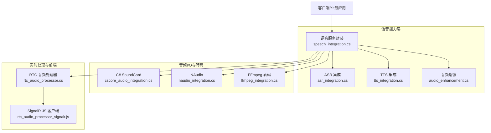
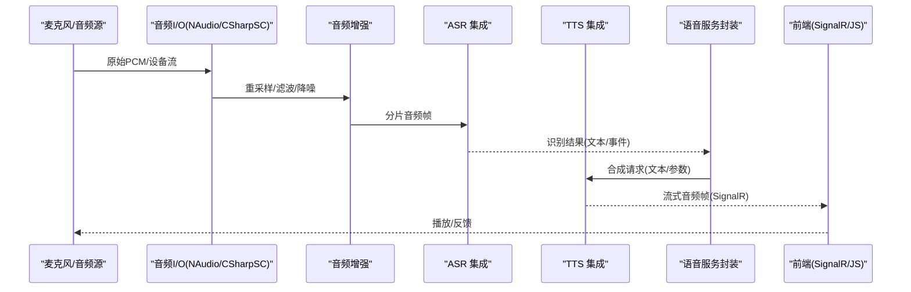
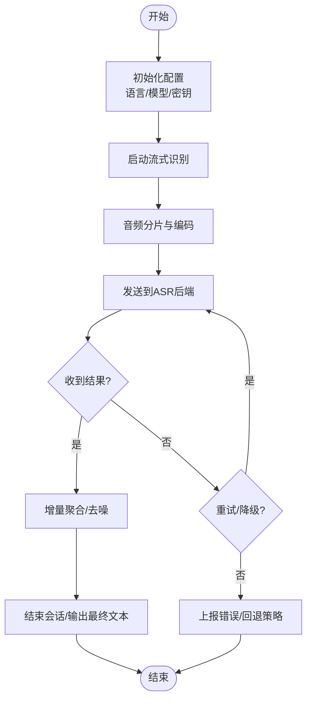
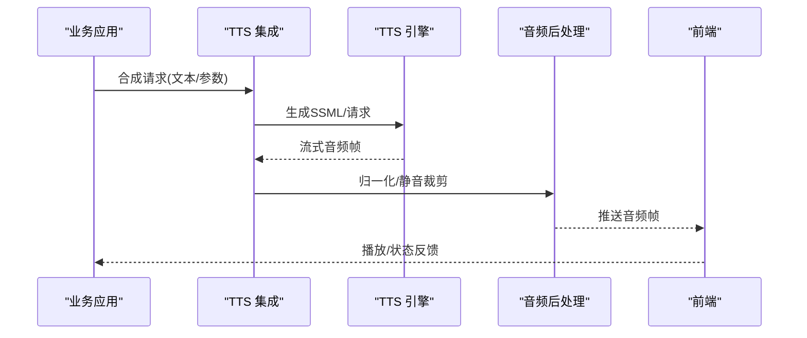
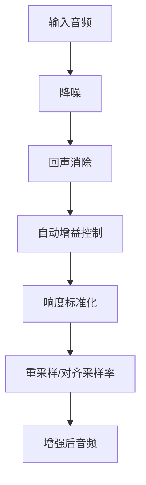
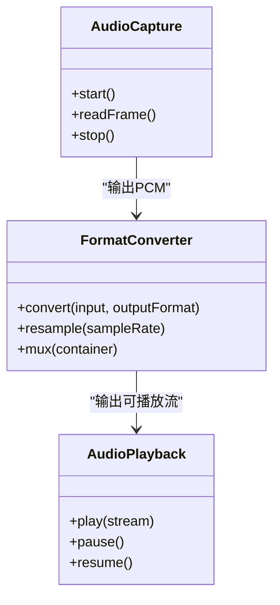
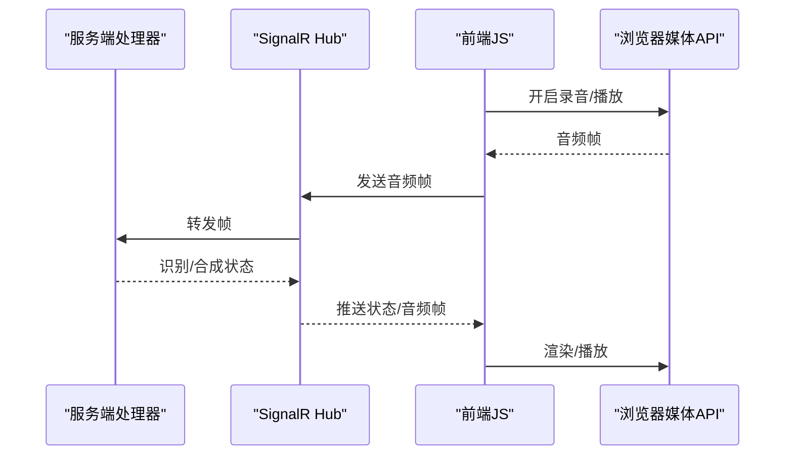
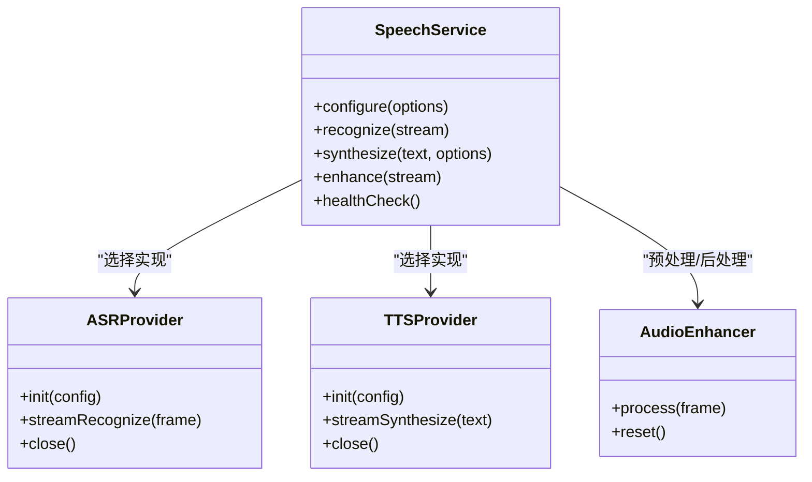
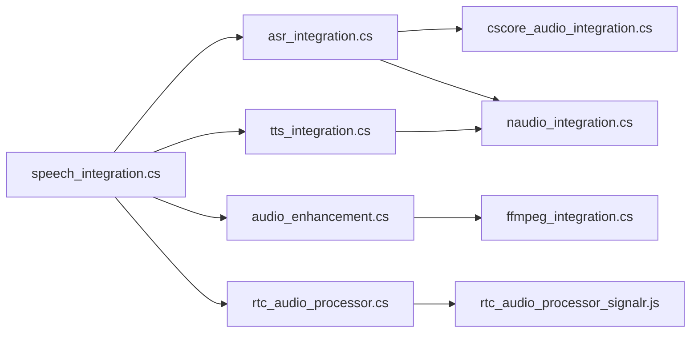

# 语音识别与合成

<cite>
**本文引用的文件**   
- [asr_integration.cs](file://asr_integration.cs)
- [tts_integration.cs](file://tts_integration.cs)
- [audio_enhancement.cs](file://audio_enhancement.cs)
- [speech_integration.cs](file://speech_integration.cs)
- [cscore_audio_integration.cs](file://cscore_audio_integration.cs)
- [naudio_integration.cs](file://naudio_integration.cs)
- [ffmpeg_integration.cs](file://ffmpeg_integration.cs)
- [rtc_audio_processor.cs](file://rtc_audio_processor.cs)
- [rtc_audio_processor_signalr.js](file://rtc_audio_processor_signalr.js)
</cite>

## 目录
1. [简介](#简介)
2. [项目结构](#项目结构)
3. [核心组件](#核心组件)
4. [架构总览](#架构总览)
5. [详细组件分析](#详细组件分析)
6. [依赖关系分析](#依赖关系分析)
7. [性能考虑](#性能考虑)
8. [故障排查指南](#故障排查指南)
9. [结论](#结论)
10. [附录](#附录)

## 简介
本文件面向在 .NET 生态中构建语音交互应用的开发者，系统梳理自动语音识别（ASR）与文本转语音（TTS）的集成方案。内容覆盖：
- Azure Speech Services、Whisper 模型、Vosk 等主流 ASR 框架的接入思路
- TTS 引擎选型与流式输出策略
- 音频预处理、实时识别、多语言支持与语音增强技术
- 语音交互应用开发指南、音频格式转换与音质优化方案

本仓库中与语音相关的示例实现集中在若干“integration”文件中，涵盖云端服务调用、本地推理、音频编解码与实时处理链路。

## 项目结构
与语音识别与合成直接相关的代码主要位于根目录下的若干独立示例文件，按职责划分如下：
- ASR 集成：asr_integration.cs
- TTS 集成：tts_integration.cs
- 音频增强：audio_enhancement.cs
- 通用语音服务封装：speech_integration.cs
- 音频采集/播放与设备抽象：cscore_audio_integration.cs、naudio_integration.cs
- 音频格式转换与转码：ffmpeg_integration.cs
- 实时音视频处理与前端协作：rtc_audio_processor.cs、rtc_audio_processor_signalr.js

**图表来源** 
- [asr_integration.cs](file://asr_integration.cs)
- [tts_integration.cs](file://tts_integration.cs)
- [speech_integration.cs](file://speech_integration.cs)
- [audio_enhancement.cs](file://audio_enhancement.cs)
- [cscore_audio_integration.cs](file://cscore_audio_integration.cs)
- [naudio_integration.cs](file://naudio_integration.cs)
- [ffmpeg_integration.cs](file://ffmpeg_integration.cs)
- [rtc_audio_processor.cs](file://rtc_audio_processor.cs)
- [rtc_audio_processor_signalr.js](file://rtc_audio_processor_signalr.js)

**章节来源**
- [asr_integration.cs](file://asr_integration.cs)
- [tts_integration.cs](file://tts_integration.cs)
- [speech_integration.cs](file://speech_integration.cs)
- [audio_enhancement.cs](file://audio_enhancement.cs)
- [cscore_audio_integration.cs](file://cscore_audio_integration.cs)
- [naudio_integration.cs](file://naudio_integration.cs)
- [ffmpeg_integration.cs](file://ffmpeg_integration.cs)
- [rtc_audio_processor.cs](file://rtc_audio_processor.cs)
- [rtc_audio_processor_signalr.js](file://rtc_audio_processor_signalr.js)

## 核心组件
- ASR 集成模块：提供统一的识别接口，支持云端（如 Azure Speech Services）与本地（如 Whisper、Vosk）两种路径；负责音频分片、编码适配、结果回调与错误重试。
- TTS 集成模块：统一文本到语音的合成接口，支持流式音频输出、多语种与多音色选择、音量/语速控制。
- 音频增强模块：降噪、回声消除、增益控制、响度标准化等预处理管线，提升识别与合成质量。
- 音频 I/O 与转码：基于 C# SoundCard 或 NAudio 进行设备级采集/播放；通过 FFmpeg 完成格式转换与采样率对齐。
- 实时处理与前端：基于 SignalR 将音频帧推送到前端，结合 WebRTC 进行低延迟传输与渲染。

**章节来源**
- [asr_integration.cs](file://asr_integration.cs)
- [tts_integration.cs](file://tts_integration.cs)
- [audio_enhancement.cs](file://audio_enhancement.cs)
- [cscore_audio_integration.cs](file://cscore_audio_integration.cs)
- [naudio_integration.cs](file://naudio_integration.cs)
- [ffmpeg_integration.cs](file://ffmpeg_integration.cs)
- [rtc_audio_processor.cs](file://rtc_audio_processor.cs)
- [rtc_audio_processor_signalr.js](file://rtc_audio_processor_signalr.js)

## 架构总览
下图展示从麦克风采集到 ASR/TTS 输出的端到端数据流，以及前后端协作方式。

**图表来源** 
- [cscore_audio_integration.cs](file://cscore_audio_integration.cs)
- [naudio_integration.cs](file://naudio_integration.cs)
- [audio_enhancement.cs](file://audio_enhancement.cs)
- [asr_integration.cs](file://asr_integration.cs)
- [tts_integration.cs](file://tts_integration.cs)
- [speech_integration.cs](file://speech_integration.cs)
- [rtc_audio_processor_signalr.js](file://rtc_audio_processor_signalr.js)

## 详细组件分析

### ASR 集成（asr_integration.cs）
- 目标：为上层提供一致的识别接口，屏蔽不同后端差异（Azure、Whisper、Vosk）。
- 关键能力：
  - 音频分片与缓冲：按时间窗口切分音频流，降低首字延迟。
  - 编码适配：将 PCM/WAV/OPUS 等转换为后端所需格式。
  - 结果回调：增量识别结果推送与最终确认。
  - 错误处理：网络异常、超时、配额限制的重试与降级。
- 典型流程：
  - 初始化配置（语言、模型、密钥、端点）
  - 启动流式识别
  - 接收并聚合识别片段
  - 结束会话并释放资源

**图表来源** 
- [asr_integration.cs](file://asr_integration.cs)

**章节来源**
- [asr_integration.cs](file://asr_integration.cs)

### TTS 集成（tts_integration.cs）
- 目标：将文本高效合成为高质量语音，支持流式输出与多语言/多音色。
- 关键能力：
  - 文本预处理：标点清理、SSML 生成、语言检测。
  - 合成策略：流式块合成、缓存热点短语、并发控制。
  - 音频后处理：响度归一化、静音裁剪、比特率调整。
  - 错误恢复：失败重试、备用引擎切换。
- 典型流程：
  - 输入文本与参数（语言、音色、语速、音量）
  - 生成 SSML/请求体
  - 流式获取音频帧并推送
  - 可选后处理与存储

**图表来源** 
- [tts_integration.cs](file://tts_integration.cs)

**章节来源**
- [tts_integration.cs](file://tts_integration.cs)

### 音频增强（audio_enhancement.cs）
- 目标：提升输入音频质量，减少噪声与回声，提高 ASR 准确率与 TTS 自然度。
- 关键能力：
  - 降噪：频谱减法、维纳滤波、深度学习降噪（可选）。
  - 回声消除（AEC）：自适应滤波消除扬声器回声。
  - 自动增益控制（AGC）：动态调节音量，避免削波。
  - 响度标准化：符合广播级响度标准，改善听感。
- 处理顺序建议：降噪 → AEC → AGC → 响度标准化 → 重采样。

**图表来源** 
- [audio_enhancement.cs](file://audio_enhancement.cs)

**章节来源**
- [audio_enhancement.cs](file://audio_enhancement.cs)

### 音频 I/O 与转码（cscore_audio_integration.cs / naudio_integration.cs / ffmpeg_integration.cs）
- 设备采集/播放：
  - C# SoundCard：轻量级设备访问，适合桌面端快速原型。
  - NAudio：功能全面，支持多种格式与混音，适合生产环境。
- 格式转换：
  - FFmpeg：跨平台转码、容器封装、码率/采样率对齐、切片与拼接。
- 典型用法：
  - 以固定帧长读取 PCM 数据，必要时转换为 OPUS/WAV。
  - 通过管道将音频流送入增强与 ASR/TTS 模块。

**图表来源** 
- [cscore_audio_integration.cs](file://cscore_audio_integration.cs)
- [naudio_integration.cs](file://naudio_integration.cs)
- [ffmpeg_integration.cs](file://ffmpeg_integration.cs)

**章节来源**
- [cscore_audio_integration.cs](file://cscore_audio_integration.cs)
- [naudio_integration.cs](file://naudio_integration.cs)
- [ffmpeg_integration.cs](file://ffmpeg_integration.cs)

### 实时处理与前端协作（rtc_audio_processor.cs / rtc_audio_processor_signalr.js）
- 服务端：
  - 使用 SignalR 建立双向通道，推送音频帧与识别/合成状态。
  - 维护连接生命周期、背压控制与断线重连。
- 前端：
  - 使用 MediaRecorder/Web Audio API 采集与播放。
  - 解析二进制音频帧，渲染波形与播放列表。
- 关键点：
  - 低延迟：小帧大小（如 10–20ms）、零拷贝传输。
  - 同步：时间戳对齐与抖动缓冲。
  - 容错：丢包补偿与静音填充。

**图表来源** 
- [rtc_audio_processor.cs](file://rtc_audio_processor.cs)
- [rtc_audio_processor_signalr.js](file://rtc_audio_processor_signalr.js)

**章节来源**
- [rtc_audio_processor.cs](file://rtc_audio_processor.cs)
- [rtc_audio_processor_signalr.js](file://rtc_audio_processor_signalr.js)

### 通用语音服务封装（speech_integration.cs）
- 目标：统一 ASR/TTS/增强/I/O 的调用入口，提供配置管理、日志与指标上报。
- 关键能力：
  - 工厂模式：根据配置选择具体 ASR/TTS 实现。
  - 上下文管理：会话 ID、用户信息、追踪 ID。
  - 限流与熔断：保护后端服务与本地资源。
  - 健康检查：服务可用性探测与告警。

**图表来源** 
- [speech_integration.cs](file://speech_integration.cs)

**章节来源**
- [speech_integration.cs](file://speech_integration.cs)

## 依赖关系分析
- 内部依赖：
  - speech_integration.cs 作为门面，依赖 asr_integration.cs、tts_integration.cs、audio_enhancement.cs。
  - asr/tts 实现可能依赖 cscore/naudio 进行设备 I/O，依赖 ffmpeg 进行格式转换。
  - rtc_audio_processor.cs 与前端 JS 通过 SignalR 通信。
- 外部依赖：
  - 云服务 SDK（如 Azure Speech Services）
  - 本地推理库（Whisper/Vosk）
  - 音频库（NAudio、C# SoundCard）
  - 转码工具（FFmpeg）
- 潜在风险：
  - 循环依赖：确保门面不反向依赖具体实现。
  - 版本兼容：音频库与 FFmpeg 版本需严格对齐。
  - 资源泄漏：流式处理需显式释放句柄与缓冲区。

**图表来源** 
- [speech_integration.cs](file://speech_integration.cs)
- [asr_integration.cs](file://asr_integration.cs)
- [tts_integration.cs](file://tts_integration.cs)
- [audio_enhancement.cs](file://audio_enhancement.cs)
- [cscore_audio_integration.cs](file://cscore_audio_integration.cs)
- [naudio_integration.cs](file://naudio_integration.cs)
- [ffmpeg_integration.cs](file://ffmpeg_integration.cs)
- [rtc_audio_processor.cs](file://rtc_audio_processor.cs)
- [rtc_audio_processor_signalr.js](file://rtc_audio_processor_signalr.js)

**章节来源**
- [speech_integration.cs](file://speech_integration.cs)
- [asr_integration.cs](file://asr_integration.cs)
- [tts_integration.cs](file://tts_integration.cs)
- [audio_enhancement.cs](file://audio_enhancement.cs)
- [cscore_audio_integration.cs](file://cscore_audio_integration.cs)
- [naudio_integration.cs](file://naudio_integration.cs)
- [ffmpeg_integration.cs](file://ffmpeg_integration.cs)
- [rtc_audio_processor.cs](file://rtc_audio_processor.cs)
- [rtc_audio_processor_signalr.js](file://rtc_audio_processor_signalr.js)

## 性能考虑
- 流式处理：采用小块帧（10–20ms）以降低首字延迟，避免大缓冲阻塞。
- 零拷贝：尽量使用内存池与 Span/Memory 减少分配与拷贝。
- 并行与异步：I/O 与编解码异步化，CPU 密集任务隔离线程池。
- 缓存与复用：热点文本/音频片段缓存，模型实例单例化。
- 资源管控：连接池、线程池上限、GPU 显存监控与告警。
- 前端优化：Web Audio 节点链最小化，合理设置缓冲区大小。

[本节为通用指导，无需特定文件引用]

## 故障排查指南
- 常见问题定位：
  - 无声音/无声：检查设备权限、采样率匹配、播放队列是否清空。
  - 识别不准：检查降噪/AEC 参数、背景噪声水平、语言模型是否匹配。
  - 合成卡顿：检查网络带宽、编码器负载、前端播放缓冲。
  - 格式错误：确认容器/编码类型、采样率、声道数一致。
- 诊断手段：
  - 启用详细日志与指标（延迟、丢包率、CPU/GPU 占用）。
  - 录制原始与处理后音频对比。
  - 使用 FFmpeg 命令验证转码链路。
- 恢复策略：
  - 自动重试与降级（切换到备用引擎或离线模型）。
  - 熔断与限流保护后端服务。
  - 前端静音填充与抖动缓冲缓解抖动。

**章节来源**
- [audio_enhancement.cs](file://audio_enhancement.cs)
- [ffmpeg_integration.cs](file://ffmpeg_integration.cs)
- [rtc_audio_processor.cs](file://rtc_audio_processor.cs)
- [rtc_audio_processor_signalr.js](file://rtc_audio_processor_signalr.js)

## 结论
本仓库提供了完整的语音识别与合成集成范式：以 speech_integration.cs 为门面，统一调度 ASR/TTS/增强/I/O/转码与实时处理链路。通过模块化设计与清晰的职责边界，既能快速对接云端服务，也能平滑迁移至本地推理。配合完善的音频预处理与实时传输方案，可在多场景下构建稳定、低延迟、高质量的语音交互应用。

[本节为总结性内容，无需特定文件引用]

## 附录
- 最佳实践清单：
  - 明确输入输出格式与采样率，统一在入口处转换。
  - 对 ASR 结果做语义后处理（标点恢复、数字规范化）。
  - 对 TTS 输出做响度归一化与静音裁剪。
  - 前端使用 Web Audio API 进行可视化与调试。
  - 全链路埋点与可观测性（延迟、错误率、资源使用）。
- 参考实现路径：
  - ASR：asr_integration.cs
  - TTS：tts_integration.cs
  - 增强：audio_enhancement.cs
  - I/O 与转码：cscore_audio_integration.cs、naudio_integration.cs、ffmpeg_integration.cs
  - 实时处理：rtc_audio_processor.cs、rtc_audio_processor_signalr.js

[本节为补充信息，无需特定文件引用]