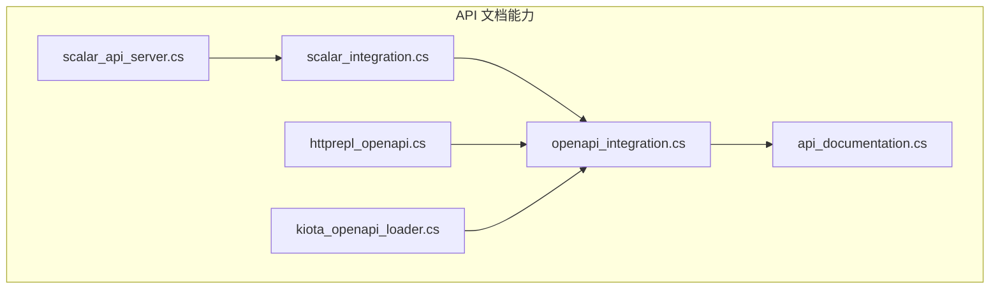
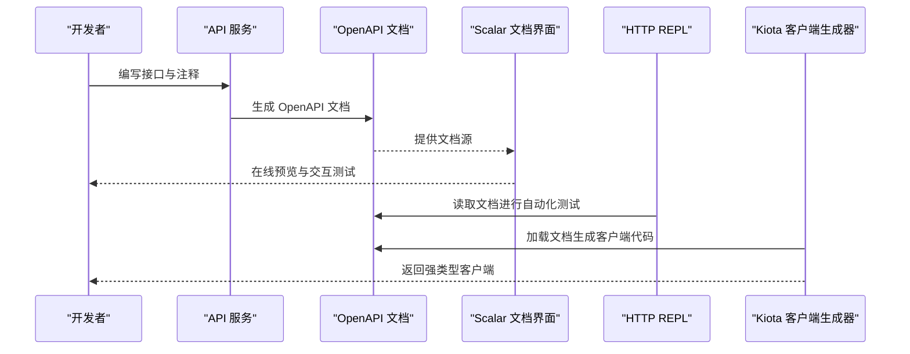
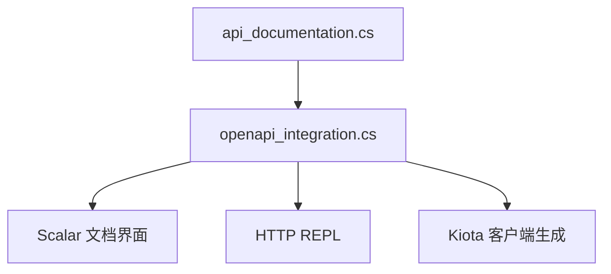

# API文档生成

<cite>
**本文档引用的文件**   
- [api_documentation.cs](file://api_documentation.cs)
- [openapi_integration.cs](file://openapi_integration.cs)
- [scalar_integration.cs](file://scalar_integration.cs)
- [scalar_api_server.cs](file://scalar_api_server.cs)
- [httprepl_openapi.cs](file://httprepl_openapi.cs)
- [kiota_openapi_loader.cs](file://kiota_openapi_loader.cs)
</cite>

## 目录
1. [简介](#简介)
2. [项目结构](#项目结构)
3. [核心组件](#核心组件)
4. [架构总览](#架构总览)
5. [详细组件分析](#详细组件分析)
6. [依赖关系分析](#依赖关系分析)
7. [性能考量](#性能考量)
8. [故障排查指南](#故障排查指南)
9. [结论](#结论)
10. [附录](#附录)

## 简介
本文件面向需要在项目中集成 OpenAPI/Swagger、Scalar 文档界面，并实现 API 文档自动化生成的团队与开发者。内容涵盖接口注释规范、参数描述与响应示例配置、文档版本管理、交互式测试与客户端代码生成、文档部署与在线预览、以及团队协作最佳实践。通过仓库中的相关示例与集成文件，提供可落地的实现路径与参考。

## 项目结构
围绕 API 文档能力，仓库中与 OpenAPI/Swagger、Scalar、HTTP REPL 与 Kiota 客户端生成相关的示例文件如下：
- api_documentation.cs：API 文档相关示例与说明
- openapi_integration.cs：OpenAPI 集成示例
- scalar_integration.cs：Scalar 文档界面集成示例
- scalar_api_server.cs：Scalar API Server 示例
- httprepl_openapi.cs：基于 HTTP REPL 的 OpenAPI 交互示例
- kiota_openapi_loader.cs：使用 Kiota 加载 OpenAPI 以生成客户端代码的示例

图表来源
- [api_documentation.cs](file://api_documentation.cs)
- [openapi_integration.cs](file://openapi_integration.cs)
- [scalar_integration.cs](file://scalar_integration.cs)
- [scalar_api_server.cs](file://scalar_api_server.cs)
- [httprepl_openapi.cs](file://httprepl_openapi.cs)
- [kiota_openapi_loader.cs](file://kiota_openapi_loader.cs)

章节来源
- [api_documentation.cs](file://api_documentation.cs)
- [openapi_integration.cs](file://openapi_integration.cs)
- [scalar_integration.cs](file://scalar_integration.cs)
- [scalar_api_server.cs](file://scalar_api_server.cs)
- [httprepl_openapi.cs](file://httprepl_openapi.cs)
- [kiota_openapi_loader.cs](file://kiota_openapi_loader.cs)

## 核心组件
- OpenAPI 集成（openapi_integration.cs）：负责在应用中注册 OpenAPI 服务、扫描控制器/端点、输出 JSON/YAML 文档，并提供版本化与元数据配置。
- Scalar 文档界面（scalar_integration.cs、scalar_api_server.cs）：将 OpenAPI 文档渲染为交互式 UI，支持在线调试、请求构造与响应查看。
- HTTP REPL 与 OpenAPI（httprepl_openapi.cs）：通过命令行或脚本方式与 OpenAPI 文档交互，便于自动化测试与 CI 集成。
- Kiota 客户端生成（kiota_openapi_loader.cs）：从 OpenAPI 文档生成强类型客户端代码，提升调用方开发效率与一致性。
- API 文档示例（api_documentation.cs）：展示如何编写接口注释、参数描述、响应示例等，确保文档质量与可读性。

章节来源
- [openapi_integration.cs](file://openapi_integration.cs)
- [scalar_integration.cs](file://scalar_integration.cs)
- [scalar_api_server.cs](file://scalar_api_server.cs)
- [httprepl_openapi.cs](file://httprepl_openapi.cs)
- [kiota_openapi_loader.cs](file://kiota_openapi_loader.cs)
- [api_documentation.cs](file://api_documentation.cs)

## 架构总览
下图展示了从接口定义到文档生成、UI 展示与客户端代码生成的整体流程。

图表来源
- [openapi_integration.cs](file://openapi_integration.cs)
- [scalar_integration.cs](file://scalar_integration.cs)
- [scalar_api_server.cs](file://scalar_api_server.cs)
- [httprepl_openapi.cs](file://httprepl_openapi.cs)
- [kiota_openapi_loader.cs](file://kiota_openapi_loader.cs)

## 详细组件分析

### OpenAPI 集成组件
- 职责
  - 注册 OpenAPI 服务与中间件
  - 扫描控制器/端点并生成文档
  - 配置版本信息、安全方案、示例与扩展元数据
- 关键流程
  - 启动时构建文档模型
  - 暴露 /swagger/v1/swagger.json 等端点
  - 与 Scalar/REPL/Kiota 对接
- 优化建议
  - 按需启用文档端点（仅开发/预发环境）
  - 缓存文档生成结果，减少重复开销
  - 对大型项目启用分组与过滤

章节来源
- [openapi_integration.cs](file://openapi_integration.cs)

### Scalar 文档界面组件
- 职责
  - 将 OpenAPI 文档渲染为现代 UI
  - 支持在线构造请求、鉴权注入、响应查看
  - 可选本地 Scalar API Server 托管文档
- 关键流程
  - 应用启动时挂载 Scalar 中间件
  - 指定 OpenAPI 文档 URL
  - 用户通过浏览器进行交互测试
- 部署建议
  - 生产环境限制访问范围（IP/鉴权）
  - 结合反向代理与静态资源缓存

章节来源
- [scalar_integration.cs](file://scalar_integration.cs)
- [scalar_api_server.cs](file://scalar_api_server.cs)

### HTTP REPL 与 OpenAPI 交互
- 职责
  - 通过命令行或脚本读取 OpenAPI 文档
  - 执行自动化测试用例与回归验证
  - 与 CI/CD 流水线集成
- 关键流程
  - 下载 OpenAPI 文档
  - 解析端点与参数
  - 发送请求并断言响应
- 注意事项
  - 处理鉴权令牌刷新
  - 设置超时与重试策略

章节来源
- [httprepl_openapi.cs](file://httprepl_openapi.cs)

### Kiota 客户端代码生成
- 职责
  - 从 OpenAPI 文档生成强类型客户端
  - 统一序列化/反序列化与错误处理
  - 支持多语言（根据工具链选择）
- 关键流程
  - 加载 OpenAPI 文档
  - 生成客户端 SDK
  - 在调用方项目中引用并使用
- 最佳实践
  - 固定文档版本，避免破坏性变更
  - 将生成产物纳入版本控制或制品库

章节来源
- [kiota_openapi_loader.cs](file://kiota_openapi_loader.cs)

### API 文档注释规范与示例
- 接口注释要点
  - 方法摘要与用途说明
  - 参数描述（必填、默认值、取值范围）
  - 响应结构与状态码说明
  - 示例请求与响应（JSON/YAML）
- 文档质量保障
  - 使用一致的命名与术语
  - 保持注释与实现同步更新
  - 引入自动化校验（如 Schema 校验）

章节来源
- [api_documentation.cs](file://api_documentation.cs)

## 依赖关系分析
- 组件耦合
  - Scalar 依赖 OpenAPI 文档源
  - HTTP REPL 依赖 OpenAPI 文档源
  - Kiota 依赖 OpenAPI 文档源
- 外部依赖
  - OpenAPI 生成库（由 openapi_integration.cs 体现）
  - Scalar UI 与服务器（由 scalar_integration.cs、scalar_api_server.cs 体现）
  - Kiota 工具链（由 kiota_openapi_loader.cs 体现）
- 潜在风险
  - 文档与实现不一致导致 UI/客户端异常
  - 大文档生成性能问题
  - 鉴权与安全策略未覆盖所有端点

图表来源
- [openapi_integration.cs](file://openapi_integration.cs)
- [scalar_integration.cs](file://scalar_integration.cs)
- [scalar_api_server.cs](file://scalar_api_server.cs)
- [httprepl_openapi.cs](file://httprepl_openapi.cs)
- [kiota_openapi_loader.cs](file://kiota_openapi_loader.cs)
- [api_documentation.cs](file://api_documentation.cs)

章节来源
- [openapi_integration.cs](file://openapi_integration.cs)
- [scalar_integration.cs](file://scalar_integration.cs)
- [scalar_api_server.cs](file://scalar_api_server.cs)
- [httprepl_openapi.cs](file://httprepl_openapi.cs)
- [kiota_openapi_loader.cs](file://kiota_openapi_loader.cs)
- [api_documentation.cs](file://api_documentation.cs)

## 性能考量
- 文档生成
  - 延迟加载与按需扫描，避免全量反射
  - 缓存生成的 OpenAPI 文档，缩短冷启动时间
- UI 渲染
  - 对大文档启用分页与懒加载
  - 静态资源 CDN 加速
- 客户端生成
  - 增量生成与缓存中间产物
  - 控制生成规模（按模块/版本）

[本节为通用指导，不直接分析具体文件]

## 故障排查指南
- 常见问题
  - 文档缺失或端点未显示：检查控制器/端点是否被正确扫描
  - 参数描述为空：确认注释与注解是否完整
  - 响应示例不生效：检查示例格式与 Schema 一致性
  - Scalar 无法加载文档：核对文档 URL 与跨域策略
  - Kiota 生成失败：确认 OpenAPI 版本兼容性与语法正确性
- 定位步骤
  - 直接访问 OpenAPI 文档端点，验证 JSON/YAML 有效性
  - 在 Scalar 中打开浏览器控制台，查看网络与错误日志
  - 使用 HTTP REPL 逐步验证端点行为
  - 检查鉴权中间件与路由配置

章节来源
- [openapi_integration.cs](file://openapi_integration.cs)
- [scalar_integration.cs](file://scalar_integration.cs)
- [scalar_api_server.cs](file://scalar_api_server.cs)
- [httprepl_openapi.cs](file://httprepl_openapi.cs)
- [kiota_openapi_loader.cs](file://kiota_openapi_loader.cs)
- [api_documentation.cs](file://api_documentation.cs)

## 结论
通过 OpenAPI 作为单一事实源，结合 Scalar 的交互式文档界面、HTTP REPL 的自动化测试能力与 Kiota 的客户端代码生成，可以在项目中形成“写即文档、测即验证、用即生成”的闭环。配合完善的注释规范与版本管理策略，能够显著提升团队协作效率与交付质量。

[本节为总结性内容，不直接分析具体文件]

## 附录
- 接口注释规范清单
  - 方法摘要、用途、适用场景
  - 参数：名称、类型、必填、默认值、约束、示例
  - 响应：状态码、结构体字段、错误码、示例
- 文档版本管理
  - 版本号策略（语义化版本）
  - 向后兼容性要求
  - 废弃端点标记与迁移指引
- 协作与发布
  - 文档端点的环境隔离
  - 权限控制与审计
  - 与 CI/CD 集成的自动化校验与发布

[本节为补充信息，不直接分析具体文件]