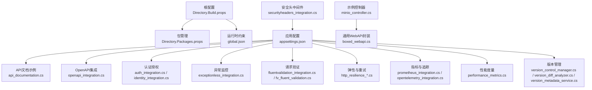
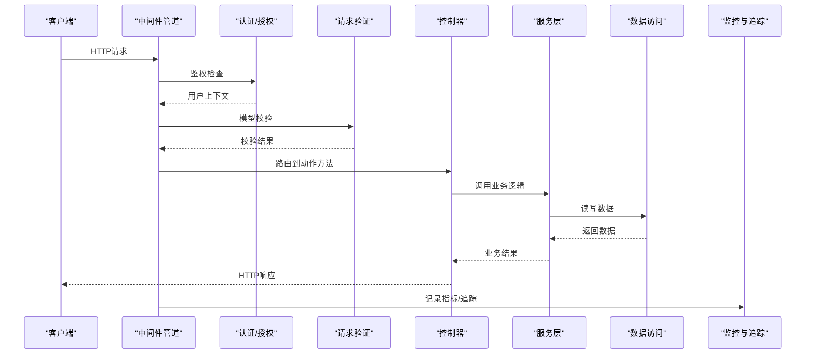
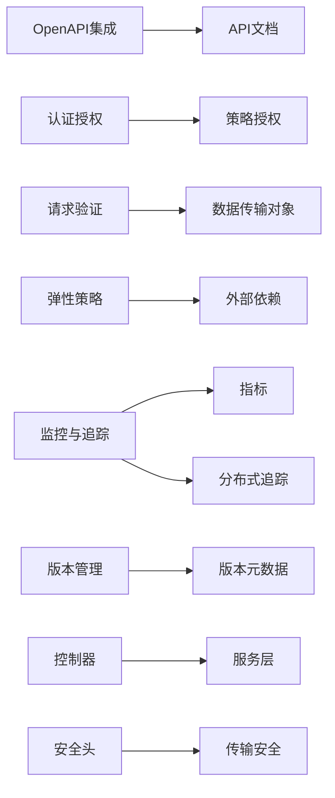

# Web API开发

<cite>
**本文档引用的文件**   
- [README.md](file://README.md)
- [appsettings.json](file://appsettings.json)
- [Directory.Build.props](file://Directory.Build.props)
- [Directory.Packages.props](file://Directory.Packages.props)
- [global.json](file://global.json)
- [api_documentation.cs](file://api_documentation.cs)
- [openapi_integration.cs](file://openapi_integration.cs)
- [auth_integration.cs](file://auth_integration.cs)
- [identity_integration.cs](file://identity_integration.cs)
- [exceptionless_integration.cs](file://exceptionless_integration.cs)
- [fluentvalidation_integration.cs](file://fluentvalidation_integration.cs)
- [fv_fluent_validation.cs](file://fv_fluent_validation.cs)
- [http_resilience_integration.cs](file://http_resilience_integration.cs)
- [http_resilience_advanced_integration.cs](file://http_resilience_advanced_integration.cs)
- [prometheus_integration.cs](file://prometheus_integration.cs)
- [opentelemetry_integration.cs](file://opentelemetry_integration.cs)
- [performance_metrics.cs](file://performance_metrics.cs)
- [version_control_manager.cs](file://version_control_manager.cs)
- [version_diff_analyzer.cs](file://version_diff_analyzer.cs)
- [version_metadata_service.cs](file://version_metadata_service.cs)
- [boxed_webapi.cs](file://boxed_webapi.cs)
- [minio_controller.cs](file://minio_controller.cs)
- [securityheaders_integration.cs](file://securityheaders_integration.cs)
</cite>

## 目录
1. [简介](#简介)
2. [项目结构](#项目结构)
3. [核心组件](#核心组件)
4. [架构总览](#架构总览)
5. [详细组件分析](#详细组件分析)
6. [依赖关系分析](#依赖关系分析)
7. [性能考量](#性能考量)
8. [故障排查指南](#故障排查指南)
9. [结论](#结论)
10. [附录](#附录)

## 简介
本文件面向ASP.NET Core Web API开发者，结合仓库中的示例与集成代码，系统化阐述API设计规范、控制器与服务层实现、认证授权、错误处理、请求验证、数据传输对象设计、Swagger/OpenAPI文档自动生成、API版本管理以及性能优化技巧。内容遵循RESTful原则、HTTP状态码规范与响应格式标准化，并提供可落地的最佳实践建议与参考路径，帮助团队构建高质量、可维护、可扩展的Web API。

## 项目结构
该仓库是一个以“技能/集成示例”为主的集合式项目，包含大量独立的C#示例文件，覆盖OpenAPI、身份认证、异常监控、验证、弹性策略、指标与追踪、版本管理等主题。根级配置文件用于统一包管理与全局属性，便于在示例之间复用一致的编译与打包行为。

图表来源
- [Directory.Build.props](file://Directory.Build.props)
- [Directory.Packages.props](file://Directory.Packages.props)
- [global.json](file://global.json)
- [appsettings.json](file://appsettings.json)
- [api_documentation.cs](file://api_documentation.cs)
- [openapi_integration.cs](file://openapi_integration.cs)
- [auth_integration.cs](file://auth_integration.cs)
- [identity_integration.cs](file://identity_integration.cs)
- [exceptionless_integration.cs](file://exceptionless_integration.cs)
- [fluentvalidation_integration.cs](file://fluentvalidation_integration.cs)
- [fv_fluent_validation.cs](file://fv_fluent_validation.cs)
- [http_resilience_integration.cs](file://http_resilience_integration.cs)
- [http_resilience_advanced_integration.cs](file://http_resilience_advanced_integration.cs)
- [prometheus_integration.cs](file://prometheus_integration.cs)
- [opentelemetry_integration.cs](file://opentelemetry_integration.cs)
- [performance_metrics.cs](file://performance_metrics.cs)
- [version_control_manager.cs](file://version_control_manager.cs)
- [version_diff_analyzer.cs](file://version_diff_analyzer.cs)
- [version_metadata_service.cs](file://version_metadata_service.cs)
- [minio_controller.cs](file://minio_controller.cs)
- [boxed_webapi.cs](file://boxed_webapi.cs)
- [securityheaders_integration.cs](file://securityheaders_integration.cs)

章节来源
- [README.md](file://README.md)
- [Directory.Build.props](file://Directory.Build.props)
- [Directory.Packages.props](file://Directory.Packages.props)
- [global.json](file://global.json)
- [appsettings.json](file://appsettings.json)

## 核心组件
- API文档与OpenAPI：通过示例文件展示如何启用并配置OpenAPI/Swagger，生成可交互的API文档，便于前后端协作与契约测试。
- 认证与授权：集成Identity或外部身份提供者，演示基于JWT/OIDC的认证流程与基于策略的授权控制。
- 错误处理与监控：集中式异常处理、结构化日志与外部异常上报（如Exceptionless），提升问题定位效率。
- 请求验证：使用FluentValidation进行模型校验，确保输入合法性与清晰的错误反馈。
- 弹性与可靠性：基于Polly等库实现重试、熔断、退避等策略，提高对外部依赖的容错能力。
- 可观测性：集成Prometheus与OpenTelemetry，暴露指标与分布式追踪，支撑生产运维。
- 版本管理：提供版本控制服务与差异分析工具，支持向后兼容与平滑升级。
- 控制器与服务层：以示例控制器为入口，配合服务层组织业务逻辑，保持职责清晰。

章节来源
- [api_documentation.cs](file://api_documentation.cs)
- [openapi_integration.cs](file://openapi_integration.cs)
- [auth_integration.cs](file://auth_integration.cs)
- [identity_integration.cs](file://identity_integration.cs)
- [exceptionless_integration.cs](file://exceptionless_integration.cs)
- [fluentvalidation_integration.cs](file://fluentvalidation_integration.cs)
- [fv_fluent_validation.cs](file://fv_fluent_validation.cs)
- [http_resilience_integration.cs](file://http_resilience_integration.cs)
- [http_resilience_advanced_integration.cs](file://http_resilience_advanced_integration.cs)
- [prometheus_integration.cs](file://prometheus_integration.cs)
- [opentelemetry_integration.cs](file://opentelemetry_integration.cs)
- [performance_metrics.cs](file://performance_metrics.cs)
- [version_control_manager.cs](file://version_control_manager.cs)
- [version_diff_analyzer.cs](file://version_diff_analyzer.cs)
- [version_metadata_service.cs](file://version_metadata_service.cs)
- [minio_controller.cs](file://minio_controller.cs)
- [boxed_webapi.cs](file://boxed_webapi.cs)

## 架构总览
下图展示了典型的ASP.NET Core Web API请求生命周期，涵盖中间件管道、认证授权、验证、控制器、服务层、数据访问、错误处理与可观测性。

图表来源
- [openapi_integration.cs](file://openapi_integration.cs)
- [auth_integration.cs](file://auth_integration.cs)
- [identity_integration.cs](file://identity_integration.cs)
- [fluentvalidation_integration.cs](file://fluentvalidation_integration.cs)
- [minio_controller.cs](file://minio_controller.cs)
- [boxed_webapi.cs](file://boxed_webapi.cs)
- [prometheus_integration.cs](file://prometheus_integration.cs)
- [opentelemetry_integration.cs](file://opentelemetry_integration.cs)

## 详细组件分析

### OpenAPI与API文档
- 目标：自动生成OpenAPI描述与交互式文档，统一接口契约，提升协作效率。
- 关键点：
  - 启用OpenAPI/Swagger中间件，配置文档元信息与安全方案。
  - 为控制器与方法添加注解，完善参数与响应描述。
  - 在生产环境按需关闭或限制访问，避免泄露敏感信息。
- 参考路径：[OpenAPI集成示例](file://openapi_integration.cs)、[API文档示例](file://api_documentation.cs)

章节来源
- [openapi_integration.cs](file://openapi_integration.cs)
- [api_documentation.cs](file://api_documentation.cs)

### 认证与授权
- 目标：实现安全的身份认证与细粒度授权控制。
- 关键点：
  - 使用Identity或OIDC/JWT进行认证，签发与验证令牌。
  - 基于角色或策略的授权规则，保护资源访问。
  - 将用户上下文注入控制器或服务层，贯穿请求生命周期。
- 参考路径：[认证集成示例](file://auth_integration.cs)、[Identity集成示例](file://identity_integration.cs)

章节来源
- [auth_integration.cs](file://auth_integration.cs)
- [identity_integration.cs](file://identity_integration.cs)

### 请求验证与数据传输对象
- 目标：保证输入数据的合法性与一致性，提供清晰的错误提示。
- 关键点：
  - 定义DTO，分离输入输出模型，避免直接暴露领域实体。
  - 使用FluentValidation编写校验规则，支持复杂条件与跨字段校验。
  - 统一验证失败响应格式，便于前端处理。
- 参考路径：[FluentValidation集成](file://fluentvalidation_integration.cs)、[FluentValidation示例](file://fv_fluent_validation.cs)

章节来源
- [fluentvalidation_integration.cs](file://fluentvalidation_integration.cs)
- [fv_fluent_validation.cs](file://fv_fluent_validation.cs)

### 错误处理与监控
- 目标：集中式异常捕获、结构化日志与外部异常上报。
- 关键点：
  - 全局异常中间件捕获未处理异常，返回标准错误响应。
  - 使用Serilog等记录结构化日志，关联请求ID与上下文。
  - 接入Exceptionless等第三方平台，聚合与分析异常。
- 参考路径：[Exceptionless集成](file://exceptionless_integration.cs)

章节来源
- [exceptionless_integration.cs](file://exceptionless_integration.cs)

### 弹性与可靠性
- 目标：提升对外部依赖的容错能力，保障服务稳定性。
- 关键点：
  - 使用Polly实现重试、熔断、限流与超时控制。
  - 针对不同依赖设置差异化策略，避免雪崩效应。
  - 结合指标与追踪评估策略效果。
- 参考路径：[HTTP弹性集成](file://http_resilience_integration.cs)、[高级弹性集成](file://http_resilience_advanced_integration.cs)

章节来源
- [http_resilience_integration.cs](file://http_resilience_integration.cs)
- [http_resilience_advanced_integration.cs](file://http_resilience_advanced_integration.cs)

### 可观测性与性能度量
- 目标：暴露关键指标与分布式追踪，支撑生产运维与性能优化。
- 关键点：
  - 集成Prometheus暴露自定义指标，如QPS、延迟、错误率。
  - 使用OpenTelemetry采集链路追踪，关联上下游调用。
  - 结合性能计数器与采样策略，降低开销。
- 参考路径：[Prometheus集成](file://prometheus_integration.cs)、[OpenTelemetry集成](file://opentelemetry_integration.cs)、[性能度量](file://performance_metrics.cs)

章节来源
- [prometheus_integration.cs](file://prometheus_integration.cs)
- [opentelemetry_integration.cs](file://opentelemetry_integration.cs)
- [performance_metrics.cs](file://performance_metrics.cs)

### API版本管理
- 目标：支持多版本共存与平滑演进，保障向后兼容。
- 关键点：
  - 使用URL路径或查询字符串区分版本。
  - 提供版本元数据服务与差异分析工具，辅助发布决策。
  - 在文档中明确版本策略与弃用计划。
- 参考路径：[版本控制管理器](file://version_control_manager.cs)、[版本差异分析器](file://version_diff_analyzer.cs)、[版本元数据服务](file://version_metadata_service.cs)

章节来源
- [version_control_manager.cs](file://version_control_manager.cs)
- [version_diff_analyzer.cs](file://version_diff_analyzer.cs)
- [version_metadata_service.cs](file://version_metadata_service.cs)

### 控制器与服务层实现
- 目标：清晰划分职责，控制器负责HTTP协议细节，服务层承载业务逻辑。
- 关键点：
  - 控制器仅做参数绑定、验证与调用服务，不包含业务规则。
  - 服务层抽象领域操作，支持单元测试与替换实现。
  - 使用依赖注入管理生命周期，避免单例污染。
- 参考路径：[示例控制器](file://minio_controller.cs)、[通用WebAPI封装](file://boxed_webapi.cs)

章节来源
- [minio_controller.cs](file://minio_controller.cs)
- [boxed_webapi.cs](file://boxed_webapi.cs)

### 安全头部与传输安全
- 目标：增强HTTP响应安全头，防范常见Web攻击。
- 关键点：
  - 配置CSP、HSTS、X-Frame-Options等安全头。
  - 强制HTTPS与TLS加密传输。
  - 定期审计安全头配置与证书有效性。
- 参考路径：[安全头集成](file://securityheaders_integration.cs)

章节来源
- [securityheaders_integration.cs](file://securityheaders_integration.cs)

## 依赖关系分析
下图展示了各示例模块之间的依赖关系与协作方式，突出OpenAPI、认证、验证、弹性、监控与版本管理的组合使用。

图表来源
- [openapi_integration.cs](file://openapi_integration.cs)
- [auth_integration.cs](file://auth_integration.cs)
- [identity_integration.cs](file://identity_integration.cs)
- [fluentvalidation_integration.cs](file://fluentvalidation_integration.cs)
- [fv_fluent_validation.cs](file://fv_fluent_validation.cs)
- [http_resilience_integration.cs](file://http_resilience_integration.cs)
- [http_resilience_advanced_integration.cs](file://http_resilience_advanced_integration.cs)
- [prometheus_integration.cs](file://prometheus_integration.cs)
- [opentelemetry_integration.cs](file://opentelemetry_integration.cs)
- [version_control_manager.cs](file://version_control_manager.cs)
- [version_diff_analyzer.cs](file://version_diff_analyzer.cs)
- [version_metadata_service.cs](file://version_metadata_service.cs)
- [minio_controller.cs](file://minio_controller.cs)
- [boxed_webapi.cs](file://boxed_webapi.cs)
- [securityheaders_integration.cs](file://securityheaders_integration.cs)

章节来源
- [Directory.Packages.props](file://Directory.Packages.props)
- [global.json](file://global.json)

## 性能考量
- 序列化与反序列化：选择高性能JSON序列化器，减少内存分配与GC压力。
- 异步编程：全面采用async/await，避免阻塞线程池，提升吞吐。
- 缓存策略：合理使用内存缓存与分布式缓存，降低数据库负载。
- 连接池与超时：合理配置数据库与HTTP客户端连接池大小与超时时间。
- 压缩与分页：启用响应压缩，对大数据集实施分页与过滤。
- 指标与追踪：通过Prometheus与OpenTelemetry定位瓶颈，持续优化。

[本节为通用指导，不直接分析具体文件]

## 故障排查指南
- 常见问题：
  - 认证失败：检查令牌签发与验证配置、过期时间与签名密钥。
  - 验证错误：确认DTO属性与FluentValidation规则是否匹配。
  - 外部依赖异常：查看Polly策略是否生效，重试与熔断阈值是否合理。
  - 性能退化：通过指标与追踪定位慢调用，优化SQL与算法。
- 调试建议：
  - 启用详细日志与请求ID，关联上下游调用链。
  - 使用本地开发服务器快速复现问题。
  - 结合Exceptionless与日志平台进行异常聚合分析。

章节来源
- [exceptionless_integration.cs](file://exceptionless_integration.cs)
- [prometheus_integration.cs](file://prometheus_integration.cs)
- [opentelemetry_integration.cs](file://opentelemetry_integration.cs)

## 结论
通过本仓库中的示例与集成代码，可以系统性地构建高质量的ASP.NET Core Web API。遵循RESTful设计、统一错误与验证、完善的认证授权、健壮的弹性策略与全面的可观测性，是保障API稳定、高效与可维护的关键。建议在团队内推广这些最佳实践，并结合实际业务场景进行适配与优化。

[本节为总结，不直接分析具体文件]

## 附录
- RESTful API设计原则：
  - 使用名词表示资源，动词表示操作；避免在URL中使用动词。
  - 合理使用HTTP方法：GET读取、POST创建、PUT更新、DELETE删除。
  - 使用正确的HTTP状态码：2xx成功、3xx重定向、4xx客户端错误、5xx服务端错误。
  - 统一响应格式：包含数据、状态码、消息与扩展字段。
- 数据传输对象设计：
  - 输入与输出分离，避免直接暴露领域模型。
  - 使用DTO进行版本化与兼容性管理。
  - 对敏感字段进行脱敏与最小化传输。
- Swagger/OpenAPI使用：
  - 为每个控制器与方法补充描述与示例。
  - 配置安全方案与权限说明。
  - 在CI/CD中生成并校验OpenAPI文档。
- API版本管理：
  - 明确版本策略（URL、查询字符串、Header）。
  - 提供弃用通知与迁移指南。
  - 使用差异分析工具评估变更影响。

[本节为概念性内容，不直接分析具体文件]