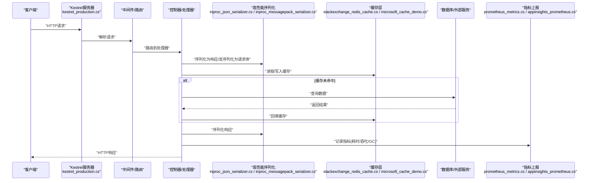
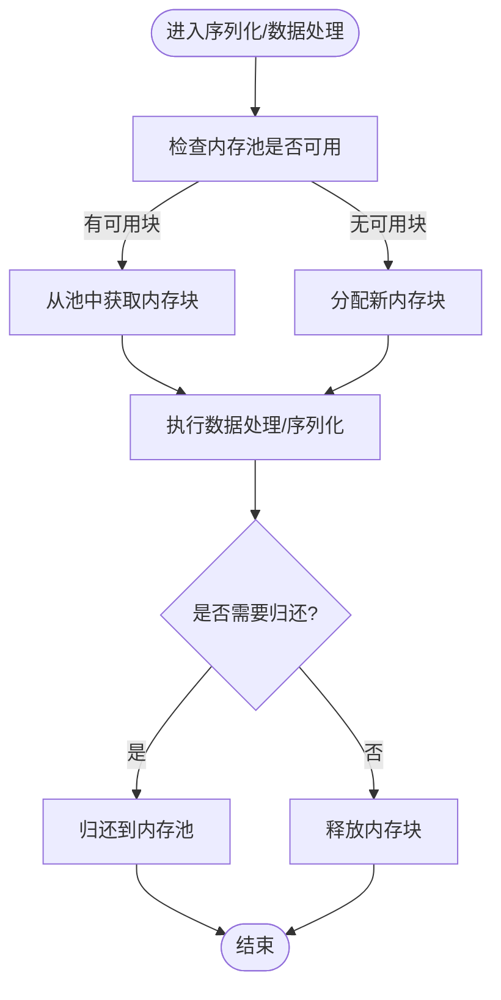
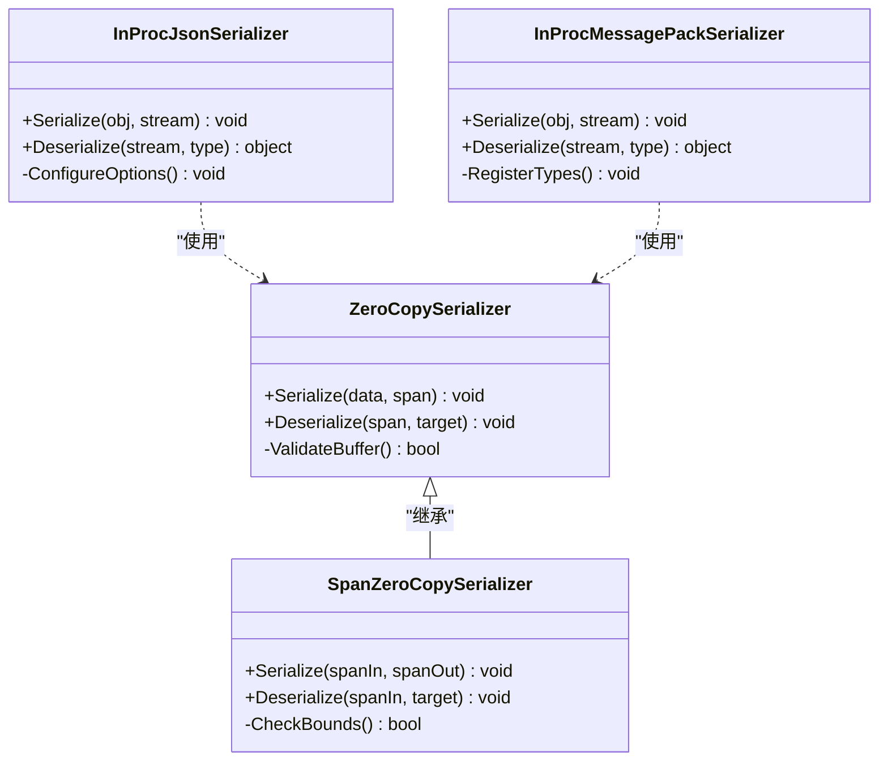
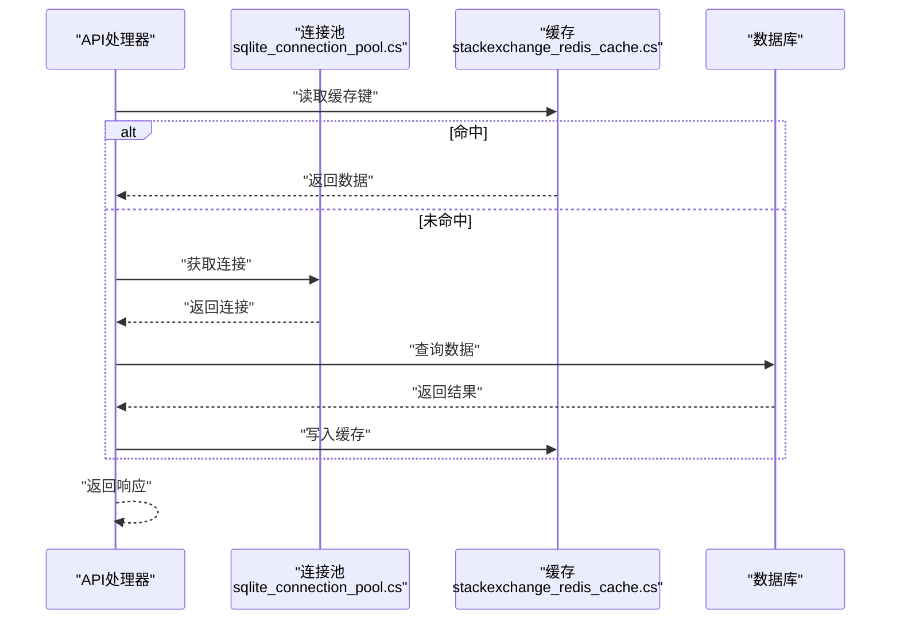
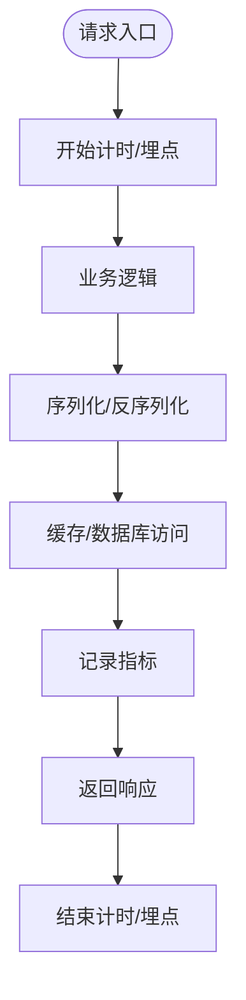
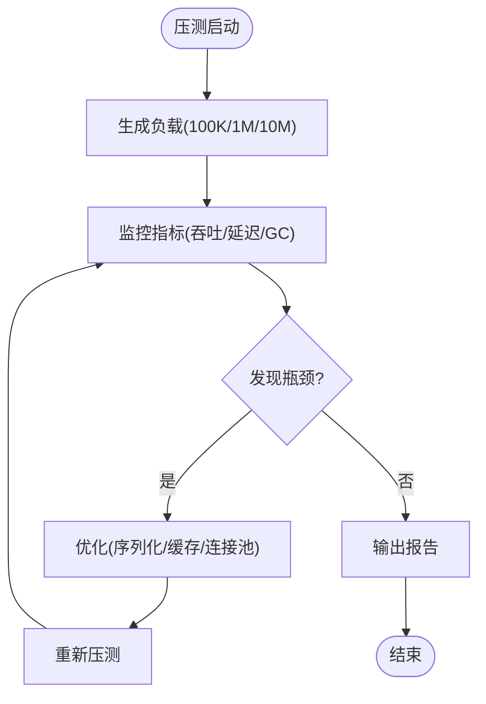
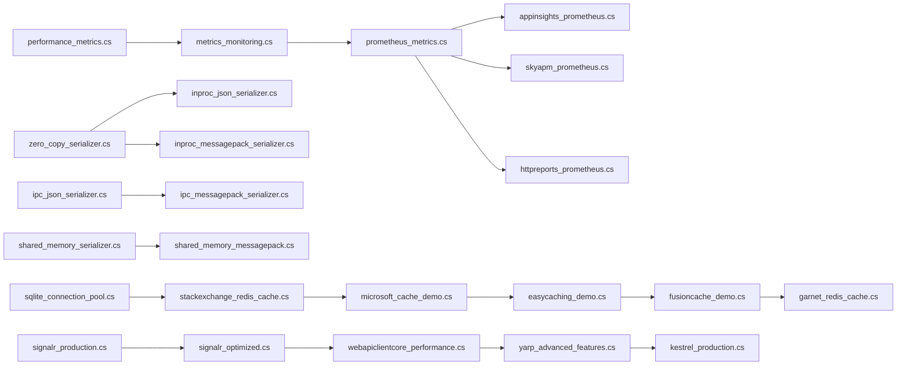

# 性能优化

<cite>
**本文引用的文件**   
- [performance_metrics.cs](file://performance_metrics.cs)
- [metrics_monitoring.cs](file://metrics_monitoring.cs)
- [prometheus_metrics.cs](file://prometheus_metrics.cs)
- [appinsights_prometheus.cs](file://appinsights_prometheus.cs)
- [skyapm_prometheus.cs](file://skyapm_prometheus.cs)
- [httpreports_prometheus.cs](file://httpreports_prometheus.cs)
- [memory_streaming.cs](file://memory_streaming.cs)
- [recyclable_memorystream_integration.cs](file://recyclable_memorystream_integration.cs)
- [threadsafe_memorypool_optimized.cs](file://threadsafe_memorypool_optimized.cs)
- [span_zero_copy_serializer.cs](file://span_zero_copy_serializer.cs)
- [zero_copy_serializer.cs](file://zero_copy_serializer.cs)
- [inproc_json_serializer.cs](file://inproc_json_serializer.cs)
- [inproc_messagepack_serializer.cs](file://inproc_messagepack_serializer.cs)
- [ipc_json_serializer.cs](file://ipc_json_serializer.cs)
- [ipc_messagepack_serializer.cs](file://ipc_messagepack_serializer.cs)
- [shared_memory_serializer.cs](file://shared_memory_serializer.cs)
- [shared_memory_messagepack.cs](file://shared_memory_messagepack.cs)
- [pipe_streaming_serializer.cs](file://pipe_streaming_serializer.cs)
- [tiered_json_processor.cs](file://tiered_json_processor.cs)
- [tiered_memory_integration.cs](file://tiered_memory_integration.cs)
- [tiered_memory_processor.cs](file://tiered_memory_processor.cs)
- [high_frequency_10m.cs](file://high_frequency_10m.cs)
- [high_frequency_1m.cs](file://high_frequency_1m.cs)
- [high_frequency_100k.cs](file://high_frequency_100k.cs)
- [tail_latency_optimizer.cs](file://tail_latency_optimizer.cs)
- [sqlite_connection_pool.cs](file://sqlite_connection_pool.cs)
- [stackexchange_redis_cache.cs](file://stackexchange_redis_cache.cs)
- [microsoft_cache_demo.cs](file://microsoft_cache_demo.cs)
- [easycaching_demo.cs](file://easycaching_demo.cs)
- [fusioncache_demo.cs](file://fusioncache_demo.cs)
- [garnet_redis_cache.cs](file://garnet_redis_cache.cs)
- [signalr_production.cs](file://signalr_production.cs)
- [signalr_optimized.cs](file://signalr_optimized.cs)
- [webapiclientcore_performance.cs](file://webapiclientcore_performance.cs)
- [yarp_advanced_features.cs](file://yarp_advanced_features.cs)
- [kestrel_production.cs](file://kestrel_production.cs)
</cite>

## 目录
1. [简介](#简介)
2. [项目结构](#项目结构)
3. [核心组件](#核心组件)
4. [架构总览](#架构总览)
5. [详细组件分析](#详细组件分析)
6. [依赖关系分析](#依赖关系分析)
7. [性能考量](#性能考量)
8. [故障排查指南](#故障排查指南)
9. [结论](#结论)
10. [附录](#附录)

## 简介
本文件面向Web API的高性能实现，聚焦内存优化、序列化调优与高并发处理策略。内容涵盖：
- 内存优化：可复用流、线程安全内存池、分层内存与零拷贝技术
- 序列化性能：进程内/跨进程高性能序列化、管道流式序列化、共享内存序列化
- 高并发策略：连接池、缓存、异步编程最佳实践
- 监控与指标：Prometheus、AppInsights、SkyAPM、HTTPReports等集成
- 瓶颈分析与优化指标收集：端到端延迟、吞吐、GC压力、锁竞争与I/O等待

## 项目结构
仓库包含大量“集成示例”与“优化实现”，与性能相关的核心文件集中在根目录的若干文件中，覆盖监控、内存、序列化、缓存、客户端与服务端优化等主题。下图给出与性能相关的关键模块概览（概念性）：

```mermaid
graph TB
subgraph "监控与指标"
PM["性能指标<br/>performance_metrics.cs"]
MM["指标监控<br/>metrics_monitoring.cs"]
PR["Prometheus集成<br/>prometheus_metrics.cs"]
AI["AppInsights+Prometheus<br/>appinsights_prometheus.cs"]
SA["SkyAPM+Prometheus<br/>skyapm_prometheus.cs"]
HR["HTTPReports+Prometheus<br/>httpreports_prometheus.cs"]
end
subgraph "内存与流"
MS["内存流式处理<br/>memory_streaming.cs"]
RMS["可回收MemoryStream<br/>recyclable_memorystream_integration.cs"]
TMP["线程安全内存池<br/>threadsafe_memorypool_optimized.cs"]
TMI["分层内存集成<br/>tiered_memory_integration.cs"]
TMPR["分层内存处理器<br/>tiered_memory_processor.cs"]
end
subgraph "序列化"
ZCS["零拷贝序列化<br/>zero_copy_serializer.cs"]
SZCS["Span零拷贝序列化<br/>span_zero_copy_serializer.cs"]
IJS["进程内JSON序列化<br/>inproc_json_serializer.cs"]
IMS["进程内MessagePack<br/>inproc_messagepack_serializer.cs"]
IJC["IPC JSON序列化<br/>ipc_json_serializer.cs"]
IMC["IPC MessagePack<br/>ipc_messagepack_serializer.cs"]
SMS["共享内存序列化<br/>shared_memory_serializer.cs"]
SMM["共享内存MessagePack<br/>shared_memory_messagepack.cs"]
PPS["管道流式序列化<br/>pipe_streaming_serializer.cs"]
TJP["分层JSON处理器<br/>tiered_json_processor.cs"]
end
subgraph "高并发与缓存"
HF10M["高频10M场景<br/>high_frequency_10m.cs"]
HF1M["高频1M场景<br/>high_frequency_1m.cs"]
HF100K["高频100K场景<br/>high_frequency_100k.cs"]
CCP["SQLite连接池<br/>sqlite_connection_pool.cs"]
SRC["StackExchange.Redis缓存<br/>stackexchange_redis_cache.cs"]
MCD["Microsoft.Extensions.Caching<br/>microsoft_cache_demo.cs"]
ECD["EasyCaching示例<br/>easycaching_demo.cs"]
FCD["FusionCache示例<br/>fusioncache_demo.cs"]
GRC["Garnet Redis缓存<br/>garnet_redis_cache.cs"]
end
subgraph "服务端与客户端"
SRP["SignalR生产模式<br/>signalr_production.cs"]
SRO["SignalR优化<br/>signalr_optimized.cs"]
WCP["WebApiClientCore性能<br/>webapiclientcore_performance.cs"]
YAF["YARP高级特性<br/>yarp_advanced_features.cs"]
KP["Kestrel生产配置<br/>kestrel_production.cs"]
end
PM --> MM --> PR
PR --> AI
PR --> SA
PR --> HR
MS --> RMS --> TMP
TMI --> TMPR
ZCS --> SZCS --> IJS
IJS --> IMS
IJC --> IMC
SMS --> SMM
PPS --> TJP
HF10M --> HF1M --> HF100K
CCP --> SRC
SRC --> MCD
MCD --> ECD
ECD --> FCD
FCD --> GRC
SRP --> SRO
SRO --> WCP
WCP --> YAF
YAF --> KP
```

[此图为概念性结构图，不直接映射具体代码文件，故无图表来源]

## 核心组件
本节对与性能密切相关的核心能力进行概述，并给出对应的源码路径以便深入查阅。

- 监控与指标
  - 性能指标封装与采集：performance_metrics.cs
  - 通用指标监控：metrics_monitoring.cs
  - Prometheus集成：prometheus_metrics.cs
  - AppInsights与Prometheus联动：appinsights_prometheus.cs
  - SkyAPM与Prometheus联动：skyapm_prometheus.cs
  - HTTPReports与Prometheus联动：httpreports_prometheus.cs

- 内存与流
  - 内存流式处理：memory_streaming.cs
  - 可回收MemoryStream：recyclable_memorystream_integration.cs
  - 线程安全内存池：threadsafe_memorypool_optimized.cs
  - 分层内存集成与处理器：tiered_memory_integration.cs、tiered_memory_processor.cs

- 序列化
  - 零拷贝序列化与Span优化：zero_copy_serializer.cs、span_zero_copy_serializer.cs
  - 进程内高性能序列化：inproc_json_serializer.cs、inproc_messagepack_serializer.cs
  - IPC序列化：ipc_json_serializer.cs、ipc_messagepack_serializer.cs
  - 共享内存序列化：shared_memory_serializer.cs、shared_memory_messagepack.cs
  - 管道流式序列化与分层JSON处理：pipe_streaming_serializer.cs、tiered_json_processor.cs

- 高并发与缓存
  - 高频场景基准：high_frequency_10m.cs、high_frequency_1m.cs、high_frequency_100k.cs
  - SQLite连接池：sqlite_connection_pool.cs
  - Redis/Memcached/分布式缓存：stackexchange_redis_cache.cs、microsoft_cache_demo.cs、easycaching_demo.cs、fusioncache_demo.cs、garnet_redis_cache.cs

- 服务端与客户端优化
  - SignalR生产模式与优化：signalr_production.cs、signalr_optimized.cs
  - WebApiClientCore性能：webapiclientcore_performance.cs
  - YARP高级特性：yarp_advanced_features.cs
  - Kestrel生产配置：kestrel_production.cs

**章节来源**
- [performance_metrics.cs](file://performance_metrics.cs)
- [metrics_monitoring.cs](file://metrics_monitoring.cs)
- [prometheus_metrics.cs](file://prometheus_metrics.cs)
- [appinsights_prometheus.cs](file://appinsights_prometheus.cs)
- [skyapm_prometheus.cs](file://skyapm_prometheus.cs)
- [httpreports_prometheus.cs](file://httpreports_prometheus.cs)
- [memory_streaming.cs](file://memory_streaming.cs)
- [recyclable_memorystream_integration.cs](file://recyclable_memorystream_integration.cs)
- [threadsafe_memorypool_optimized.cs](file://threadsafe_memorypool_optimized.cs)
- [tiered_memory_integration.cs](file://tiered_memory_integration.cs)
- [tiered_memory_processor.cs](file://tiered_memory_processor.cs)
- [zero_copy_serializer.cs](file://zero_copy_serializer.cs)
- [span_zero_copy_serializer.cs](file://span_zero_copy_serializer.cs)
- [inproc_json_serializer.cs](file://inproc_json_serializer.cs)
- [inproc_messagepack_serializer.cs](file://inproc_messagepack_serializer.cs)
- [ipc_json_serializer.cs](file://ipc_json_serializer.cs)
- [ipc_messagepack_serializer.cs](file://ipc_messagepack_serializer.cs)
- [shared_memory_serializer.cs](file://shared_memory_serializer.cs)
- [shared_memory_messagepack.cs](file://shared_memory_messagepack.cs)
- [pipe_streaming_serializer.cs](file://pipe_streaming_serializer.cs)
- [tiered_json_processor.cs](file://tiered_json_processor.cs)
- [high_frequency_10m.cs](file://high_frequency_10m.cs)
- [high_frequency_1m.cs](file://high_frequency_1m.cs)
- [high_frequency_100k.cs](file://high_frequency_100k.cs)
- [sqlite_connection_pool.cs](file://sqlite_connection_pool.cs)
- [stackexchange_redis_cache.cs](file://stackexchange_redis_cache.cs)
- [microsoft_cache_demo.cs](file://microsoft_cache_demo.cs)
- [easycaching_demo.cs](file://easycaching_demo.cs)
- [fusioncache_demo.cs](file://fusioncache_demo.cs)
- [garnet_redis_cache.cs](file://garnet_redis_cache.cs)
- [signalr_production.cs](file://signalr_production.cs)
- [signalr_optimized.cs](file://signalr_optimized.cs)
- [webapiclientcore_performance.cs](file://webapiclientcore_performance.cs)
- [yarp_advanced_features.cs](file://yarp_advanced_features.cs)
- [kestrel_production.cs](file://kestrel_production.cs)

## 架构总览
下图展示一个典型的高性能Web API请求路径，从Kestrel入口到控制器/中间件、序列化、缓存、数据库/外部服务、以及指标上报的全链路。

**图表来源**
- [kestrel_production.cs](file://kestrel_production.cs)
- [inproc_json_serializer.cs](file://inproc_json_serializer.cs)
- [inproc_messagepack_serializer.cs](file://inproc_messagepack_serializer.cs)
- [stackexchange_redis_cache.cs](file://stackexchange_redis_cache.cs)
- [microsoft_cache_demo.cs](file://microsoft_cache_demo.cs)
- [prometheus_metrics.cs](file://prometheus_metrics.cs)
- [appinsights_prometheus.cs](file://appinsights_prometheus.cs)

## 详细组件分析

### 内存优化：可回收流与线程安全内存池
- 可回收MemoryStream：通过对象池减少分配与GC压力，适用于频繁创建/销毁的流场景
- 线程安全内存池：提供线程安全的内存块获取与归还，避免锁竞争与碎片化
- 分层内存：将热数据置于更快存储（如内存），冷数据下沉至更慢存储（磁盘/对象池），提升整体吞吐

**图表来源**
- [recyclable_memorystream_integration.cs](file://recyclable_memorystream_integration.cs)
- [threadsafe_memorypool_optimized.cs](file://threadsafe_memorypool_optimized.cs)

**章节来源**
- [recyclable_memorystream_integration.cs](file://recyclable_memorystream_integration.cs)
- [threadsafe_memorypool_optimized.cs](file://threadsafe_memorypool_optimized.cs)
- [tiered_memory_integration.cs](file://tiered_memory_integration.cs)
- [tiered_memory_processor.cs](file://tiered_memory_processor.cs)

### 序列化性能调优：零拷贝与Span优化
- 零拷贝序列化：通过Span<T>和Memory<T>避免不必要的缓冲复制，降低CPU与内存开销
- 进程内高性能序列化：选择轻量级格式（如MessagePack）或优化的JSON序列化器
- 管道流式序列化：以流式方式处理大对象，避免一次性加载到内存

**图表来源**
- [zero_copy_serializer.cs](file://zero_copy_serializer.cs)
- [span_zero_copy_serializer.cs](file://span_zero_copy_serializer.cs)
- [inproc_json_serializer.cs](file://inproc_json_serializer.cs)
- [inproc_messagepack_serializer.cs](file://inproc_messagepack_serializer.cs)

**章节来源**
- [zero_copy_serializer.cs](file://zero_copy_serializer.cs)
- [span_zero_copy_serializer.cs](file://span_zero_copy_serializer.cs)
- [inproc_json_serializer.cs](file://inproc_json_serializer.cs)
- [inproc_messagepack_serializer.cs](file://inproc_messagepack_serializer.cs)
- [pipe_streaming_serializer.cs](file://pipe_streaming_serializer.cs)

### 高并发处理策略：连接池与缓存
- 连接池：为数据库/外部服务建立连接池，减少握手与资源分配开销
- 缓存：多级缓存（本地+分布式）降低热点数据的后端压力
- 异步编程：使用async/await与非阻塞I/O，提高并发吞吐

**图表来源**
- [sqlite_connection_pool.cs](file://sqlite_connection_pool.cs)
- [stackexchange_redis_cache.cs](file://stackexchange_redis_cache.cs)

**章节来源**
- [sqlite_connection_pool.cs](file://sqlite_connection_pool.cs)
- [stackexchange_redis_cache.cs](file://stackexchange_redis_cache.cs)
- [microsoft_cache_demo.cs](file://microsoft_cache_demo.cs)
- [easycaching_demo.cs](file://easycaching_demo.cs)
- [fusioncache_demo.cs](file://fusioncache_demo.cs)
- [garnet_redis_cache.cs](file://garnet_redis_cache.cs)

### 监控与指标：Prometheus/AppInsights/SkyAPM/HTTPReports
- 统一指标采集：在关键路径埋点，记录请求耗时、错误率、吞吐、GC、锁等待等
- 多系统对接：Prometheus用于时序指标，AppInsights用于应用洞察，SkyAPM用于分布式追踪，HTTPReports用于报表

**图表来源**
- [performance_metrics.cs](file://performance_metrics.cs)
- [metrics_monitoring.cs](file://metrics_monitoring.cs)
- [prometheus_metrics.cs](file://prometheus_metrics.cs)
- [appinsights_prometheus.cs](file://appinsights_prometheus.cs)
- [skyapm_prometheus.cs](file://skyapm_prometheus.cs)
- [httpreports_prometheus.cs](file://httpreports_prometheus.cs)

**章节来源**
- [performance_metrics.cs](file://performance_metrics.cs)
- [metrics_monitoring.cs](file://metrics_monitoring.cs)
- [prometheus_metrics.cs](file://prometheus_metrics.cs)
- [appinsights_prometheus.cs](file://appinsights_prometheus.cs)
- [skyapm_prometheus.cs](file://skyapm_prometheus.cs)
- [httpreports_prometheus.cs](file://httpreports_prometheus.cs)

### 高频场景与尾延迟优化
- 高频场景基准：针对100K/1M/10M级别吞吐进行压测与优化
- 尾延迟优化：识别长尾请求，采用限流、降级、快速失败与重试策略

**图表来源**
- [high_frequency_100k.cs](file://high_frequency_100k.cs)
- [high_frequency_1m.cs](file://high_frequency_1m.cs)
- [high_frequency_10m.cs](file://high_frequency_10m.cs)
- [tail_latency_optimizer.cs](file://tail_latency_optimizer.cs)

**章节来源**
- [high_frequency_100k.cs](file://high_frequency_100k.cs)
- [high_frequency_1m.cs](file://high_frequency_1m.cs)
- [high_frequency_10m.cs](file://high_frequency_10m.cs)
- [tail_latency_optimizer.cs](file://tail_latency_optimizer.cs)

## 依赖关系分析
- 监控与指标模块依赖统一的指标采集接口，便于扩展不同后端（Prometheus、AppInsights、SkyAPM、HTTPReports）
- 序列化模块依赖零拷贝与Span优化，进程内与IPC序列化分别适配不同场景
- 缓存模块支持多种后端（Redis、Memcached、本地缓存），并通过统一接口抽象
- 服务端优化（Kestrel、SignalR、YARP）与客户端优化（WebApiClientCore）共同构成端到端性能闭环

**图表来源**
- [performance_metrics.cs](file://performance_metrics.cs)
- [metrics_monitoring.cs](file://metrics_monitoring.cs)
- [prometheus_metrics.cs](file://prometheus_metrics.cs)
- [appinsights_prometheus.cs](file://appinsights_prometheus.cs)
- [skyapm_prometheus.cs](file://skyapm_prometheus.cs)
- [httpreports_prometheus.cs](file://httpreports_prometheus.cs)
- [zero_copy_serializer.cs](file://zero_copy_serializer.cs)
- [inproc_json_serializer.cs](file://inproc_json_serializer.cs)
- [inproc_messagepack_serializer.cs](file://inproc_messagepack_serializer.cs)
- [ipc_json_serializer.cs](file://ipc_json_serializer.cs)
- [ipc_messagepack_serializer.cs](file://ipc_messagepack_serializer.cs)
- [shared_memory_serializer.cs](file://shared_memory_serializer.cs)
- [shared_memory_messagepack.cs](file://shared_memory_messagepack.cs)
- [sqlite_connection_pool.cs](file://sqlite_connection_pool.cs)
- [stackexchange_redis_cache.cs](file://stackexchange_redis_cache.cs)
- [microsoft_cache_demo.cs](file://microsoft_cache_demo.cs)
- [easycaching_demo.cs](file://easycaching_demo.cs)
- [fusioncache_demo.cs](file://fusioncache_demo.cs)
- [garnet_redis_cache.cs](file://garnet_redis_cache.cs)
- [signalr_production.cs](file://signalr_production.cs)
- [signalr_optimized.cs](file://signalr_optimized.cs)
- [webapiclientcore_performance.cs](file://webapiclientcore_performance.cs)
- [yarp_advanced_features.cs](file://yarp_advanced_features.cs)
- [kestrel_production.cs](file://kestrel_production.cs)

## 性能考量
- 内存管理
  - 优先使用可回收流与内存池，减少分配与GC压力
  - 使用Span<T>/Memory<T>实现零拷贝，避免缓冲区复制
  - 分层内存策略：热数据常驻内存，冷数据下沉存储
- 序列化
  - 进程内优先使用MessagePack或优化JSON序列化器
  - IPC场景选择轻量协议，必要时使用共享内存
  - 大对象采用流式序列化，避免一次性加载
- 高并发
  - 合理配置连接池大小，避免过多连接导致上下文切换
  - 多级缓存降低热点数据后端压力
  - 全面使用异步非阻塞I/O，避免同步阻塞
- 监控与指标
  - 统一埋点，记录关键路径耗时、错误率、吞吐、GC、锁等待
  - 结合Prometheus、AppInsights、SkyAPM、HTTPReports进行多维观测
- 压测与优化
  - 针对高频场景进行压测，识别瓶颈并迭代优化
  - 关注尾延迟，采用限流、降级、快速失败与重试策略

## 故障排查指南
- 常见问题定位
  - GC压力过高：检查是否存在频繁分配与短生命周期对象，考虑使用对象池与零拷贝
  - 序列化瓶颈：评估序列化器性能，尝试MessagePack或优化JSON配置
  - 缓存穿透/雪崩：设置合理的过期时间与回退策略，增加布隆过滤器
  - 连接池耗尽：调整池大小与超时时间，避免长时间持有连接
- 指标与日志
  - 利用Prometheus与AppInsights查看请求耗时分布与错误率
  - 使用SkyAPM进行分布式追踪，定位跨服务调用瓶颈
  - 通过HTTPReports生成可视化报表，辅助问题定位
- 压测与回归
  - 使用高频场景基准脚本进行回归测试，确保优化效果稳定
  - 关注尾延迟变化，避免引入新的长尾问题

**章节来源**
- [performance_metrics.cs](file://performance_metrics.cs)
- [metrics_monitoring.cs](file://metrics_monitoring.cs)
- [prometheus_metrics.cs](file://prometheus_metrics.cs)
- [appinsights_prometheus.cs](file://appinsights_prometheus.cs)
- [skyapm_prometheus.cs](file://skyapm_prometheus.cs)
- [httpreports_prometheus.cs](file://httpreports_prometheus.cs)
- [high_frequency_100k.cs](file://high_frequency_100k.cs)
- [high_frequency_1m.cs](file://high_frequency_1m.cs)
- [high_frequency_10m.cs](file://high_frequency_10m.cs)
- [tail_latency_optimizer.cs](file://tail_latency_optimizer.cs)

## 结论
通过内存优化、序列化调优、高并发策略与完善的监控体系，可以显著提升Web API的性能与稳定性。建议在生产环境中逐步引入上述技术，并结合压测与指标持续优化，确保在高负载下保持低延迟与高吞吐。

## 附录
- 参考文件清单见“本文引用的文件”部分
- 各模块的具体实现细节请参考对应源码文件