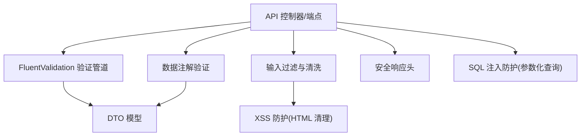
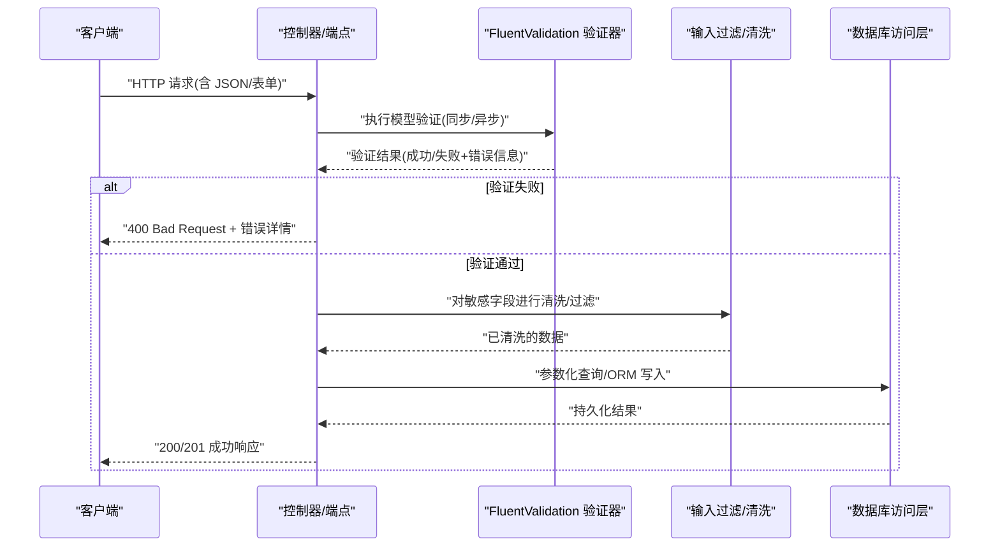
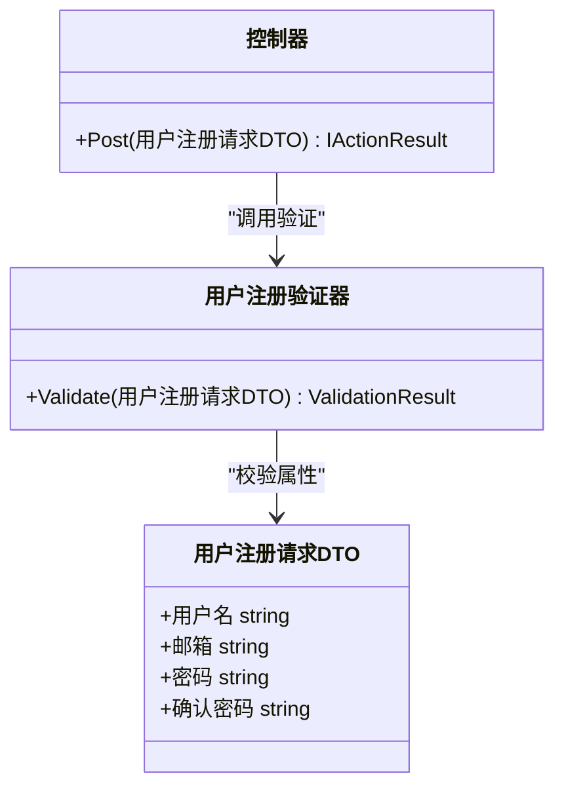
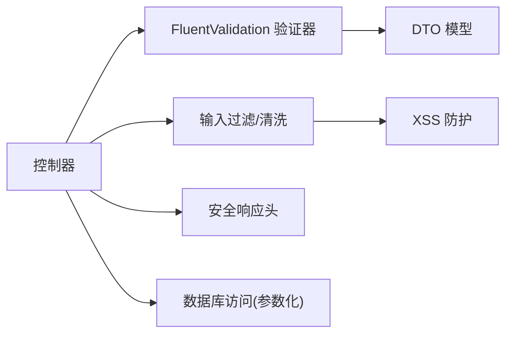

# 请求验证

<cite>
**本文引用的文件**   
- [fluentvalidation_integration.cs](file://fluentvalidation_integration.cs)
- [fv_fluent_validation.cs](file://fv_fluent_validation.cs)
- [DataValidationOptions.cs](file://DataValidationOptions.cs)
- [antixss_integration.cs](file://antixss_integration.cs)
- [htmlsanitizer_integration.cs](file://htmlsanitizer_integration.cs)
- [securityheaders_integration.cs](file://securityheaders_integration.cs)
</cite>

## 目录
1. [简介](#简介)
2. [项目结构](#项目结构)
3. [核心组件](#核心组件)
4. [架构总览](#架构总览)
5. [详细组件分析](#详细组件分析)
6. [依赖关系分析](#依赖关系分析)
7. [性能考量](#性能考量)
8. [故障排查指南](#故障排查指南)
9. [结论](#结论)
10. [附录](#附录)

## 简介
本文件面向“请求验证”主题，系统性梳理并沉淀以下能力：
- FluentValidation 框架使用与最佳实践
- 数据注解验证（Data Annotations）在 Web API 中的集成
- 自定义验证器实现模式
- DTO 设计模式与验证规则定义
- 错误消息本地化策略
- 复杂对象、异步验证与批量验证的实现思路
- 输入过滤、SQL 注入防护与 XSS 攻击防护措施

本仓库提供了多个与验证和安全相关的示例文件，可作为参考与落地依据。

## 项目结构
围绕“请求验证”，本项目中与验证直接相关的核心文件包括：
- FluentValidation 集成与示例
- 数据验证配置选项
- 安全相关（XSS/CSRF/安全头）的防护示例

[本图为概念性结构图，不映射具体源码文件]

## 核心组件
- FluentValidation 集成与扩展：用于集中式、可组合的验证规则定义，支持同步与异步校验、跨属性校验、集合验证等。
- 数据注解验证：通过标准特性声明约束，配合 ASP.NET Core 模型绑定自动触发验证。
- 自定义验证器：封装业务特定校验逻辑，便于复用与测试。
- 验证配置选项：集中管理验证行为（如是否启用、默认语言、全局规则开关）。
- 输入过滤与安全：对富文本进行清理、设置安全响应头、采用参数化查询防止 SQL 注入。

章节来源
- [fluentvalidation_integration.cs](file://fluentvalidation_integration.cs)
- [fv_fluent_validation.cs](file://fv_fluent_validation.cs)
- [DataValidationOptions.cs](file://DataValidationOptions.cs)
- [antixss_integration.cs](file://antixss_integration.cs)
- [htmlsanitizer_integration.cs](file://htmlsanitizer_integration.cs)
- [securityheaders_integration.cs](file://securityheaders_integration.cs)

## 架构总览
下图展示了从请求进入控制器到验证、清洗、落库的全链路流程，以及关键的安全控制点。

[本图为概念性流程图，不映射具体源码文件]

## 详细组件分析

### FluentValidation 集成与使用
- 适用场景：复杂对象、跨属性校验、集合元素校验、异步校验（如唯一性检查）。
- 典型用法要点：
  - 为每个 DTO 定义对应的验证器类，遵循单一职责。
  - 使用内置规则（必填、长度、格式、范围等）与自定义规则。
  - 通过 IValidator<T> 注入并在控制器或中间件中调用 ValidateAsync。
  - 统一处理验证失败返回，包含字段级错误信息。
- 与 ASP.NET Core 集成：
  - 注册验证服务与模型绑定。
  - 可选：全局异常处理将 ModelState 错误转换为统一错误体。

章节来源
- [fluentvalidation_integration.cs](file://fluentvalidation_integration.cs)
- [fv_fluent_validation.cs](file://fv_fluent_validation.cs)

#### 类关系示意（基于实际文件）

[本图为概念性类图，不映射具体源码文件]

### 数据注解验证
- 适用场景：简单字段约束、快速原型、与框架深度集成。
- 常用特性：Required、StringLength、RegularExpression、Range、Compare 等。
- 与 FluentValidation 的关系：两者可并存；建议以 FluentValidation 为主，数据注解作为补充或迁移过渡。

章节来源
- [fv_fluent_validation.cs](file://fv_fluent_validation.cs)

### 自定义验证器实现
- 目标：将业务规则封装成可复用的验证器，便于单元测试与多端复用。
- 设计建议：
  - 按领域划分验证器（如订单、账户、内容发布）。
  - 提供同步与异步两种实现接口，避免阻塞。
  - 对跨实体/远程资源的校验（如唯一性）采用异步验证器。

章节来源
- [fv_fluent_validation.cs](file://fv_fluent_validation.cs)

### DTO 设计与验证规则定义
- DTO 原则：
  - 仅暴露接口所需字段，避免泄露内部状态。
  - 字段命名清晰，类型明确，必要时使用强类型枚举。
  - 对集合型字段提供最小/最大长度限制。
- 规则定义：
  - 基础规则优先使用内置规则。
  - 复杂规则拆分为独立验证器，保持可读性与可测试性。

章节来源
- [fv_fluent_validation.cs](file://fv_fluent_validation.cs)

### 错误消息本地化
- 策略：
  - 使用资源文件或配置中心维护多语言错误文案。
  - 根据请求上下文（Accept-Language、Cookie、域名）选择语言。
  - 在验证失败时返回结构化错误对象（字段名、错误码、本地化消息）。
- 实施要点：
  - 将错误码与文案解耦，便于前端展示与日志追踪。
  - 对国际化键值进行版本化管理，避免破坏兼容。

章节来源
- [DataValidationOptions.cs](file://DataValidationOptions.cs)

### 复杂对象验证
- 嵌套对象：为子对象定义独立验证器，并在父对象中引用。
- 条件验证：根据其他字段值动态启用/禁用规则。
- 集合验证：对集合内元素逐一校验，并支持索引定位错误。

章节来源
- [fv_fluent_validation.cs](file://fv_fluent_validation.cs)

### 异步验证
- 适用场景：数据库唯一性检查、第三方服务校验、耗时计算。
- 注意事项：
  - 避免在验证阶段发起过多并发 IO。
  - 设置合理的超时与重试退避策略。
  - 统一捕获异常并转化为友好错误信息。

章节来源
- [fv_fluent_validation.cs](file://fv_fluent_validation.cs)

### 批量验证
- 适用场景：导入、批量更新、批量删除。
- 设计建议：
  - 对集合元素逐项验证，收集所有错误。
  - 提供部分成功的反馈机制（记录成功/失败明细）。
  - 结合事务保证一致性。

章节来源
- [fv_fluent_validation.cs](file://fv_fluent_validation.cs)

### 输入过滤与清洗
- 富文本清洗：使用 HTML 清理器去除危险标签与脚本。
- 白名单过滤：仅允许预期的字符集与格式。
- 长度与大小限制：防止超大负载与缓冲区溢出。

章节来源
- [antixss_integration.cs](file://antixss_integration.cs)
- [htmlsanitizer_integration.cs](file://htmlsanitizer_integration.cs)

### SQL 注入防护
- 核心原则：始终使用参数化查询或 ORM 的参数绑定，禁止拼接 SQL。
- 额外措施：
  - 最小权限原则（数据库账号只授予必要权限）。
  - 对存储过程与视图进行严格审查。
  - 审计与告警：对可疑查询模式进行监控。

章节来源
- [DataValidationOptions.cs](file://DataValidationOptions.cs)

### XSS 攻击防护
- 输出编码：对所有用户可控内容进行 HTML 编码。
- 输入清洗：对富文本输入进行白名单清理。
- 安全响应头：启用 CSP、X-Content-Type-Options、X-Frame-Options 等。

章节来源
- [antixss_integration.cs](file://antixss_integration.cs)
- [htmlsanitizer_integration.cs](file://htmlsanitizer_integration.cs)
- [securityheaders_integration.cs](file://securityheaders_integration.cs)

## 依赖关系分析
- 控制器依赖验证器与服务，验证器依赖 DTO 与外部资源（数据库、缓存、第三方服务）。
- 安全组件（XSS 清理、安全头）与输入过滤贯穿请求生命周期。
- 配置项集中管理验证行为与安全策略。

[本图为概念性依赖图，不映射具体源码文件]

## 性能考量
- 验证阶段尽量轻量，避免阻塞 IO；将耗时操作移至异步任务或后台作业。
- 合理使用缓存减少重复校验（如字典表、黑名单）。
- 批量验证时合并 IO 请求，降低往返次数。
- 对大型集合分片处理，避免一次性加载导致内存峰值。

[本节为通用指导，不直接分析具体文件]

## 故障排查指南
- 常见验证问题：
  - 未正确注册验证器或服务导致验证不生效。
  - 模型绑定失败导致 ModelState 无效。
  - 异步验证未正确处理异常或超时。
- 排查步骤：
  - 开启详细日志，记录验证失败的具体字段与原因。
  - 使用最小复现用例隔离问题。
  - 检查输入过滤与安全头配置是否正确。
- 常见问题定位：
  - 查看验证器的规则顺序与条件分支。
  - 核对 DTO 字段与前端提交字段的一致性。
  - 确认数据库连接与权限配置。

章节来源
- [DataValidationOptions.cs](file://DataValidationOptions.cs)
- [securityheaders_integration.cs](file://securityheaders_integration.cs)

## 结论
通过 FluentValidation 与数据注解的组合，结合输入过滤、XSS 防护与参数化查询，可以构建健壮且安全的请求验证体系。建议在项目中统一规范 DTO 设计、验证器组织与错误消息本地化策略，确保一致性与可维护性。

[本节为总结性内容，不直接分析具体文件]

## 附录
- 最佳实践清单：
  - 所有用户输入均需验证与清洗。
  - 使用参数化查询，禁止字符串拼接 SQL。
  - 对富文本进行白名单清理，输出时进行编码。
  - 设置安全响应头，启用必要的浏览器安全策略。
  - 对异步验证设置超时与重试策略。
  - 统一错误响应格式，便于前端处理与日志分析。

[本节为通用指导，不直接分析具体文件]