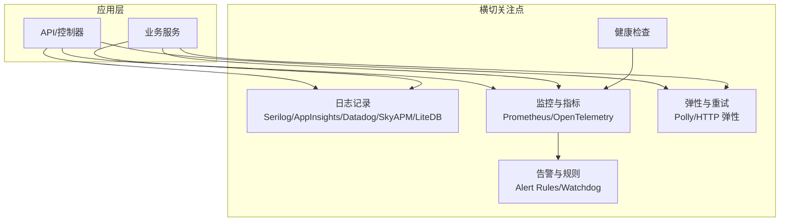
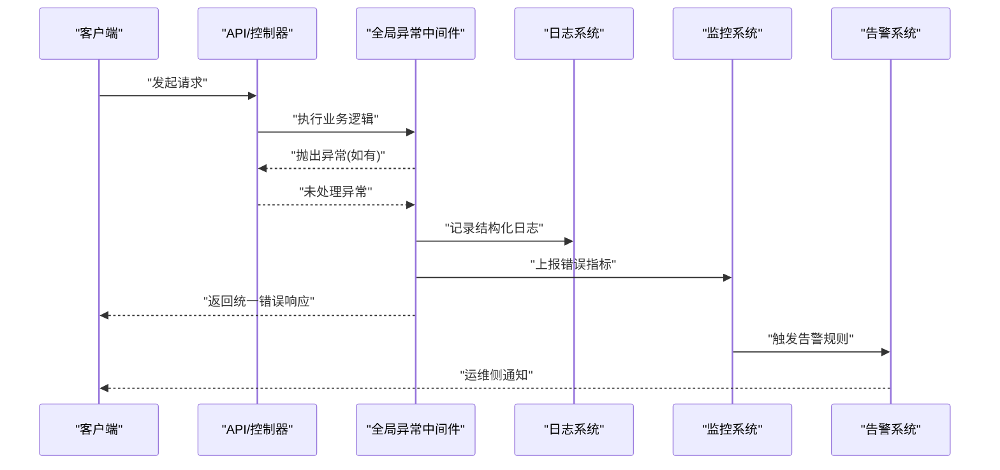
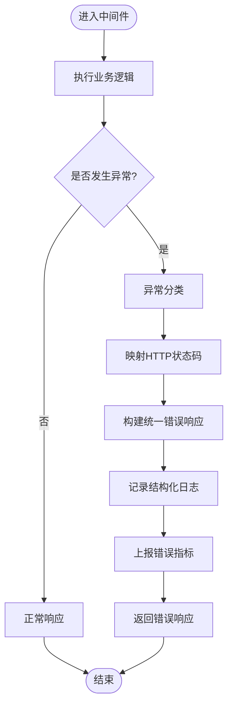
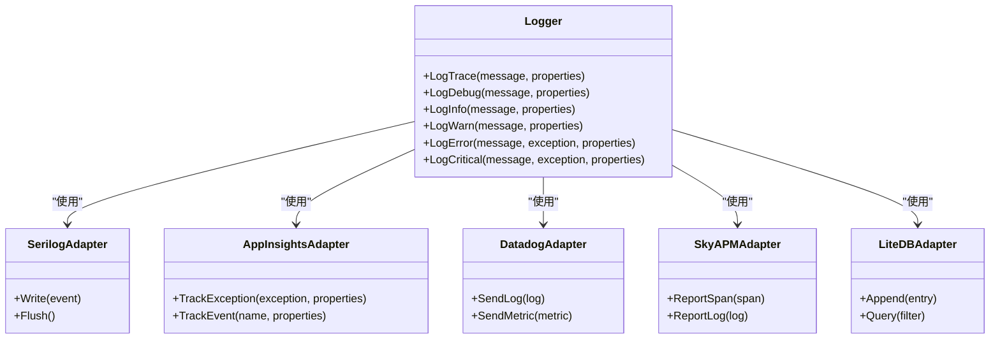
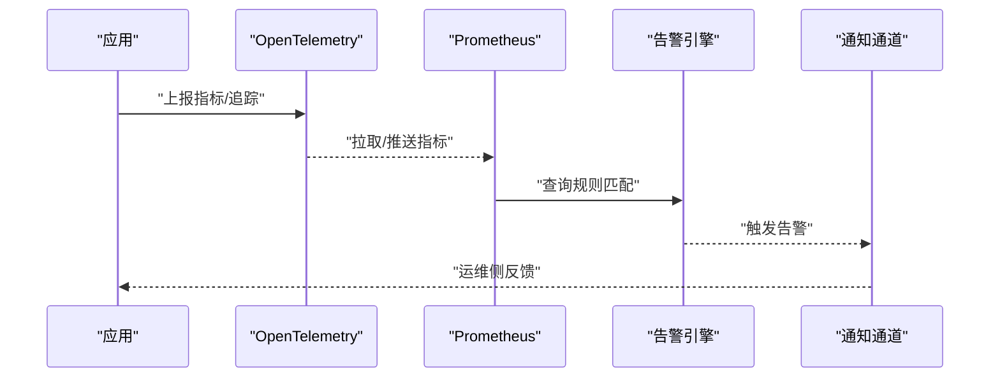
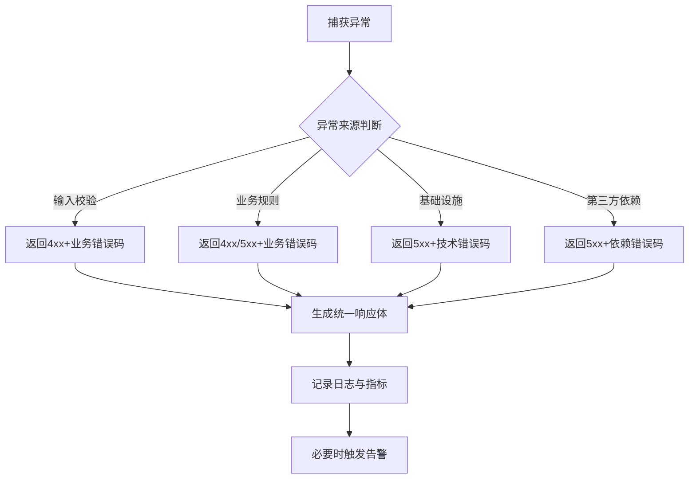
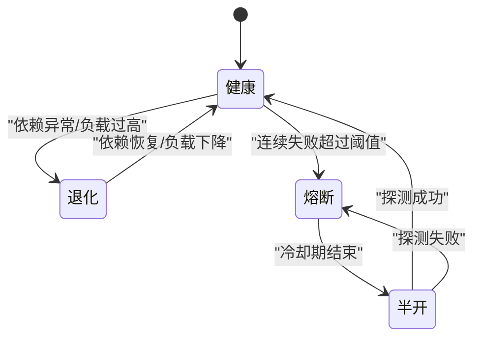
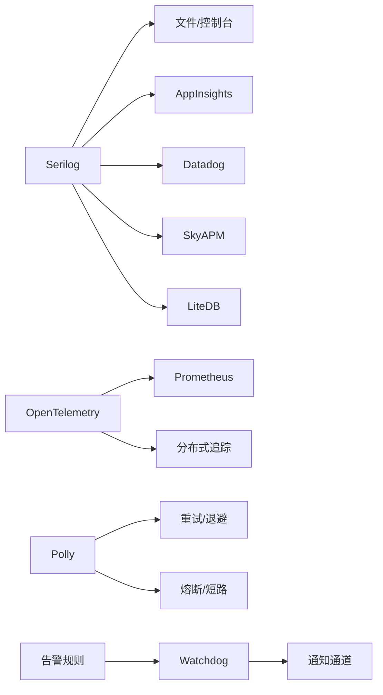

# 错误处理机制

<cite>
**本文引用的文件**   
- [appsettings.json](file://appsettings.json)
- [GlobalAnalyzerConfig.globalconfig](file://GlobalAnalyzerConfig.globalconfig)
- [Directory.Build.props](file://Directory.Build.props)
- [performance_metrics.cs](file://performance_metrics.cs)
- [metrics_monitoring.cs](file://metrics_monitoring.cs)
- [alert_rules.cs](file://alert_rules.cs)
- [watchdog_alert_rules.cs](file://watchdog_alert_rules.cs)
- [opentelemetry_integration.cs](file://opentelemetry_integration.cs)
- [prometheus_integration.cs](file://prometheus_integration.cs)
- [http_resilience_integration.cs](file://http_resilience_integration.cs)
- [resilient_polly_integration.cs](file://resilient_polly_integration.cs)
- [exceptionless_integration.cs](file://exceptionless_integration.cs)
- [serilog_integration.cs](file://serilog_integration.cs)
- [appinsights_logging.cs](file://appinsights_logging.cs)
- [datadog_logging.cs](file://datadog_logging.cs)
- [skyapm_logging.cs](file://skyapm_logging.cs)
- [litedb_logging.cs](file://litedb_logging.cs)
- [log_storage_processor.cs](file://log_storage_processor.cs)
- [health_check_example.cs](file://health_check_example.cs)
</cite>

## 目录
1. [简介](#简介)
2. [项目结构](#项目结构)
3. [核心组件](#核心组件)
4. [架构总览](#架构总览)
5. [详细组件分析](#详细组件分析)
6. [依赖关系分析](#依赖关系分析)
7. [性能考量](#性能考量)
8. [故障排查指南](#故障排查指南)
9. [结论](#结论)
10. [附录](#附录)

## 简介
本文件面向本仓库中的“错误处理机制”，聚焦以下目标：
- 全局异常处理与统一错误响应格式
- HTTP 状态码使用规范
- 日志记录策略（结构化、分级、异步）
- 错误监控与告警（指标、追踪、告警规则）
- 异常分类与错误消息标准化
- 用户友好错误提示
- 性能监控、健康检查与故障恢复策略

说明：本仓库为示例集合型代码库，未提供单一统一的 Web 框架入口。因此，本文以“可插拔集成”的方式组织内容，给出在各典型场景（Web API、后台服务、微服务）中落地错误处理的实践建议，并引用仓库中与日志、监控、遥测、弹性相关的实现作为参考。

## 项目结构
- 该仓库包含大量独立示例文件，涵盖日志、监控、遥测、弹性等主题。
- 错误处理相关能力通常由以下模块组合而成：
  - 日志子系统（Serilog、AppInsights、Datadog、SkyAPM、LiteDB 等）
  - 监控与指标（Prometheus、OpenTelemetry、自定义指标）
  - 弹性与重试（Polly、HTTP 弹性）
  - 告警与规则（Alert Rules、Watchdog）
  - 健康检查（示例文件）

[本图为概念性结构图，不直接映射具体源码文件]

## 核心组件
- 全局异常处理
  - 在 Web 框架中通过中间件或过滤器捕获未处理异常，统一转换为标准 JSON 响应，并设置合适的 HTTP 状态码。
  - 将异常分类（客户端错误、服务端错误、第三方调用失败、超时、限流等），便于后续分析与告警。
- 统一错误响应格式
  - 定义一致的响应体结构，包含错误码、消息、请求标识、时间戳、详情（可选）。
  - 对敏感信息脱敏，避免泄露堆栈细节给客户端。
- HTTP 状态码规范
  - 4xx 表示客户端问题（参数校验失败、权限不足、资源不存在等）。
  - 5xx 表示服务端问题（内部错误、依赖不可用、超时等）。
  - 特殊场景如限流返回 429，网关错误返回 502/503/504。
- 日志记录策略
  - 结构化日志，按级别（Trace/Debug/Info/Warn/Error/Critical）输出。
  - 关键路径打点，包含上下文（请求ID、租户、操作人、耗时等）。
  - 异步落盘与采样，避免阻塞主流程。
- 错误监控与告警
  - 指标：错误率、延迟分位、饱和度、外部依赖健康度。
  - 追踪：分布式链路追踪，定位跨服务异常。
  - 告警：基于阈值或规则触发通知（邮件、短信、IM）。
- 异常分类与消息标准化
  - 建立错误码字典，区分业务错误与技术错误。
  - 对外消息简洁明确，对内日志详尽可追溯。
- 用户友好错误提示
  - 前端根据错误码展示引导文案，支持重试、跳转、反馈渠道。
- 性能监控与健康检查
  - 暴露健康端点（存活、就绪、依赖健康）。
  - 采集关键性能指标，结合看板与告警。
- 故障恢复策略
  - 重试、退避、熔断、降级、隔离、快速失败。

**章节来源**
- [appsettings.json:1-200](file://appsettings.json#L1-L200)
- [performance_metrics.cs:1-200](file://performance_metrics.cs#L1-L200)
- [metrics_monitoring.cs:1-200](file://metrics_monitoring.cs#L1-L200)
- [alert_rules.cs:1-200](file://alert_rules.cs#L1-L200)
- [watchdog_alert_rules.cs:1-200](file://watchdog_alert_rules.cs#L1-L200)
- [opentelemetry_integration.cs:1-200](file://opentelemetry_integration.cs#L1-L200)
- [prometheus_integration.cs:1-200](file://prometheus_integration.cs#L1-L200)
- [http_resilience_integration.cs:1-200](file://http_resilience_integration.cs#L1-L200)
- [resilient_polly_integration.cs:1-200](file://resilient_polly_integration.cs#L1-L200)
- [exceptionless_integration.cs:1-200](file://exceptionless_integration.cs#L1-L200)
- [serilog_integration.cs:1-200](file://serilog_integration.cs#L1-L200)
- [appinsights_logging.cs:1-200](file://appinsights_logging.cs#L1-L200)
- [datadog_logging.cs:1-200](file://datadog_logging.cs#L1-L200)
- [skyapm_logging.cs:1-200](file://skyapm_logging.cs#L1-L200)
- [litedb_logging.cs:1-200](file://litedb_logging.cs#L1-L200)
- [log_storage_processor.cs:1-200](file://log_storage_processor.cs#L1-L200)
- [health_check_example.cs:1-200](file://health_check_example.cs#L1-L200)

## 架构总览
下图展示了从请求进入、异常捕获、日志记录、指标上报到告警触发的整体流程。

**图表来源**
- [opentelemetry_integration.cs:1-200](file://opentelemetry_integration.cs#L1-L200)
- [prometheus_integration.cs:1-200](file://prometheus_integration.cs#L1-L200)
- [alert_rules.cs:1-200](file://alert_rules.cs#L1-L200)
- [watchdog_alert_rules.cs:1-200](file://watchdog_alert_rules.cs#L1-L200)

## 详细组件分析

### 全局异常处理与统一错误响应
- 设计要点
  - 在请求管道最外层捕获所有未处理异常。
  - 将异常分类为：
    - 客户端错误（参数校验、权限、资源不存在）
    - 服务端错误（空引用、数据库异常、序列化失败）
    - 外部依赖错误（超时、连接失败、限流）
  - 生成统一错误响应体，包含：
    - 错误码（稳定、可枚举）
    - 人类可读消息（对外）
    - 请求标识（用于追踪）
    - 时间戳
    - 详情（仅内部日志，不出网）
  - 设置正确的 HTTP 状态码（4xx/5xx）。
- 与日志和监控的集成
  - 记录结构化日志（含上下文、堆栈摘要、请求元数据）。
  - 上报错误计数、错误类型分布、延迟分位等指标。
  - 对高频错误配置告警规则。

**图表来源**
- [appsettings.json:1-200](file://appsettings.json#L1-L200)
- [performance_metrics.cs:1-200](file://performance_metrics.cs#L1-L200)

**章节来源**
- [appsettings.json:1-200](file://appsettings.json#L1-L200)
- [performance_metrics.cs:1-200](file://performance_metrics.cs#L1-L200)

### 日志记录策略
- 多后端输出
  - 控制台、文件、远程收集器（AppInsights、Datadog、SkyAPM）、本地存储（LiteDB）。
- 结构化字段
  - 请求ID、租户ID、用户ID、操作名、耗时、结果码、错误码。
- 分级与采样
  - Trace/Debug 用于调试；Info 用于关键事件；Warn/Error/Critical 用于异常与严重问题。
  - 高吞吐场景下启用采样，降低 I/O 压力。
- 异步与缓冲
  - 使用异步写入与内存缓冲，避免阻塞主线程。
- 安全与合规
  - 敏感字段脱敏（密码、令牌、PII）。
  - 保留最小必要信息，满足审计要求。

**图表来源**
- [serilog_integration.cs:1-200](file://serilog_integration.cs#L1-L200)
- [appinsights_logging.cs:1-200](file://appinsights_logging.cs#L1-L200)
- [datadog_logging.cs:1-200](file://datadog_logging.cs#L1-L200)
- [skyapm_logging.cs:1-200](file://skyapm_logging.cs#L1-L200)
- [litedb_logging.cs:1-200](file://litedb_logging.cs#L1-L200)

**章节来源**
- [serilog_integration.cs:1-200](file://serilog_integration.cs#L1-L200)
- [appinsights_logging.cs:1-200](file://appinsights_logging.cs#L1-L200)
- [datadog_logging.cs:1-200](file://datadog_logging.cs#L1-L200)
- [skyapm_logging.cs:1-200](file://skyapm_logging.cs#L1-L200)
- [litedb_logging.cs:1-200](file://litedb_logging.cs#L1-L200)
- [log_storage_processor.cs:1-200](file://log_storage_processor.cs#L1-L200)

### 错误监控与告警机制
- 指标采集
  - 错误率、错误类型分布、请求延迟（P50/P95/P99）、饱和度（CPU/内存/线程池）。
  - 外部依赖健康度（连接池、缓存命中率、队列积压）。
- 分布式追踪
  - 使用 OpenTelemetry 注入 Span，串联上下游调用。
  - 在异常处附加关键上下文，便于根因分析。
- 告警规则
  - 基于阈值的静态规则（错误率>1%持续5分钟）。
  - 动态规则（同比/环比突增、SLO 违约）。
  - Watchdog 守护进程周期性评估规则并触发通知。
- 可视化与联动
  - Prometheus/Grafana 看板展示趋势与热点。
  - 与工单/IM 系统集成，自动创建任务。

**图表来源**
- [opentelemetry_integration.cs:1-200](file://opentelemetry_integration.cs#L1-L200)
- [prometheus_integration.cs:1-200](file://prometheus_integration.cs#L1-L200)
- [alert_rules.cs:1-200](file://alert_rules.cs#L1-L200)
- [watchdog_alert_rules.cs:1-200](file://watchdog_alert_rules.cs#L1-L200)

**章节来源**
- [opentelemetry_integration.cs:1-200](file://opentelemetry_integration.cs#L1-L200)
- [prometheus_integration.cs:1-200](file://prometheus_integration.cs#L1-L200)
- [alert_rules.cs:1-200](file://alert_rules.cs#L1-L200)
- [watchdog_alert_rules.cs:1-200](file://watchdog_alert_rules.cs#L1-L200)

### 异常分类与错误消息标准化
- 分类维度
  - 来源：输入校验、业务规则、基础设施、第三方依赖。
  - 影响：局部失败、级联失败、数据不一致。
  - 可恢复性：可重试、需降级、必须回滚。
- 错误码设计
  - 前缀区分模块/领域，中段描述类别，末段唯一编号。
  - 保持向后兼容，新增错误码不破坏既有语义。
- 消息模板
  - 对外：简洁、可操作（例如“请检查输入后重试”“稍后再试”）。
  - 对内：完整上下文（参数摘要、堆栈摘要、依赖状态）。
- 国际化与本地化
  - 错误消息支持多语言，按客户端语言偏好返回。

**图表来源**
- [performance_metrics.cs:1-200](file://performance_metrics.cs#L1-L200)
- [alert_rules.cs:1-200](file://alert_rules.cs#L1-L200)

**章节来源**
- [performance_metrics.cs:1-200](file://performance_metrics.cs#L1-L200)
- [alert_rules.cs:1-200](file://alert_rules.cs#L1-L200)

### 用户友好错误提示
- 前端交互
  - 根据错误码显示不同提示与操作按钮（重试、切换网络、联系客服）。
  - 对幂等操作提供自动重试，非幂等操作禁止自动重试。
- 用户体验保障
  - 避免频繁弹窗，合并同类错误。
  - 提供离线模式与缓存兜底。
- 反馈闭环
  - 允许用户提交问题报告，附带请求ID以便定位。

[本节为通用实践说明，不直接分析具体文件]

### 性能监控、健康检查与故障恢复
- 性能监控
  - 采集关键指标（QPS、延迟、错误率、资源使用率）。
  - 使用采样与聚合减少开销。
- 健康检查
  - 存活探针（进程存活）。
  - 就绪探针（依赖可用、负载可控）。
  - 依赖健康（数据库、缓存、消息队列、外部API）。
- 故障恢复
  - 重试与指数退避（适用于幂等请求）。
  - 熔断与短路（保护下游）。
  - 降级与快速失败（保证核心功能可用）。
  - 隔离与舱壁（限制故障扩散）。

**图表来源**
- [http_resilience_integration.cs:1-200](file://http_resilience_integration.cs#L1-L200)
- [resilient_polly_integration.cs:1-200](file://resilient_polly_integration.cs#L1-L200)
- [health_check_example.cs:1-200](file://health_check_example.cs#L1-L200)

**章节来源**
- [http_resilience_integration.cs:1-200](file://http_resilience_integration.cs#L1-L200)
- [resilient_polly_integration.cs:1-200](file://resilient_polly_integration.cs#L1-L200)
- [health_check_example.cs:1-200](file://health_check_example.cs#L1-L200)

## 依赖关系分析
- 日志子系统依赖
  - Serilog 作为核心管道，适配多种输出源（文件、控制台、远程收集器）。
  - AppInsights、Datadog、SkyAPM 分别负责云原生监控、企业级 APM、分布式追踪。
  - LiteDB 用于本地持久化日志，便于离线排查。
- 监控与遥测
  - OpenTelemetry 统一接入指标与追踪。
  - Prometheus 作为指标存储与查询后端。
- 弹性与告警
  - Polly 与 HTTP 弹性库提供重试、熔断、退避等策略。
  - Alert Rules 与 Watchdog 提供规则评估与告警触发。

**图表来源**
- [serilog_integration.cs:1-200](file://serilog_integration.cs#L1-L200)
- [appinsights_logging.cs:1-200](file://appinsights_logging.cs#L1-L200)
- [datadog_logging.cs:1-200](file://datadog_logging.cs#L1-L200)
- [skyapm_logging.cs:1-200](file://skyapm_logging.cs#L1-L200)
- [litedb_logging.cs:1-200](file://litedb_logging.cs#L1-L200)
- [opentelemetry_integration.cs:1-200](file://opentelemetry_integration.cs#L1-L200)
- [prometheus_integration.cs:1-200](file://prometheus_integration.cs#L1-L200)
- [resilient_polly_integration.cs:1-200](file://resilient_polly_integration.cs#L1-L200)
- [http_resilience_integration.cs:1-200](file://http_resilience_integration.cs#L1-L200)
- [alert_rules.cs:1-200](file://alert_rules.cs#L1-L200)
- [watchdog_alert_rules.cs:1-200](file://watchdog_alert_rules.cs#L1-L200)

**章节来源**
- [serilog_integration.cs:1-200](file://serilog_integration.cs#L1-L200)
- [appinsights_logging.cs:1-200](file://appinsights_logging.cs#L1-L200)
- [datadog_logging.cs:1-200](file://datadog_logging.cs#L1-L200)
- [skyapm_logging.cs:1-200](file://skyapm_logging.cs#L1-L200)
- [litedb_logging.cs:1-200](file://litedb_logging.cs#L1-L200)
- [opentelemetry_integration.cs:1-200](file://opentelemetry_integration.cs#L1-L200)
- [prometheus_integration.cs:1-200](file://prometheus_integration.cs#L1-L200)
- [resilient_polly_integration.cs:1-200](file://resilient_polly_integration.cs#L1-L200)
- [http_resilience_integration.cs:1-200](file://http_resilience_integration.cs#L1-L200)
- [alert_rules.cs:1-200](file://alert_rules.cs#L1-L200)
- [watchdog_alert_rules.cs:1-200](file://watchdog_alert_rules.cs#L1-L200)

## 性能考量
- 日志性能
  - 使用异步写入与批处理，控制缓冲区大小。
  - 在高并发场景开启采样，降低 I/O 压力。
  - 避免在热路径中执行昂贵操作（如全量堆栈序列化）。
- 指标与追踪
  - 指标聚合与降采样，避免高频上报。
  - 追踪采样率按环境调整（生产低采样，测试高采样）。
- 弹性策略
  - 合理设置重试次数与退避间隔，防止雪崩。
  - 熔断阈值与冷却期需结合历史数据调优。
- 健康检查
  - 轻量级检查项优先，避免健康检查本身成为瓶颈。
  - 就绪检查应覆盖关键依赖与资源水位。

[本节为通用指导，不直接分析具体文件]

## 故障排查指南
- 快速定位
  - 通过请求ID在日志系统中检索完整链路。
  - 查看错误码与错误类型分布，识别热点问题。
- 常见症状与对策
  - 错误率突增：检查依赖健康、容量与变更发布。
  - 延迟升高：分析慢查询、GC 停顿、锁竞争。
  - 间歇性失败：关注网络抖动、第三方限流、资源耗尽。
- 工具与平台
  - 使用 Prometheus/Grafana 观察指标趋势。
  - 使用 APM（AppInsights/SkyAPM/Datadog）进行链路追踪。
  - 使用本地 LiteDB 日志进行离线分析。
- 复盘与改进
  - 建立错误知识库，沉淀根因与解决方案。
  - 完善告警规则，减少误报与漏报。
  - 优化弹性策略与容量规划。

**章节来源**
- [log_storage_processor.cs:1-200](file://log_storage_processor.cs#L1-L200)
- [appinsights_logging.cs:1-200](file://appinsights_logging.cs#L1-L200)
- [skyapm_logging.cs:1-200](file://skyapm_logging.cs#L1-L200)
- [datadog_logging.cs:1-200](file://datadog_logging.cs#L1-L200)
- [litedb_logging.cs:1-200](file://litedb_logging.cs#L1-L200)

## 结论
本仓库提供了丰富的日志、监控、遥测与弹性集成示例。在实际工程中，应基于这些示例构建统一的全局异常处理与错误响应机制，配合结构化日志、指标与追踪、告警规则与健康检查，形成完整的错误处理与可观测性体系。通过合理的异常分类、消息标准化与用户友好提示，既能提升研发效率，也能改善用户体验与系统稳定性。

[本节为总结性内容，不直接分析具体文件]

## 附录
- 最佳实践清单
  - 始终返回统一错误响应格式。
  - 严格区分 4xx 与 5xx 的使用场景。
  - 日志脱敏与采样，避免泄露与过载。
  - 指标与追踪覆盖关键路径。
  - 告警规则可配置、可演进。
  - 健康检查覆盖存活、就绪与依赖。
  - 弹性策略按场景定制，定期演练。
- 参考文件
  - 日志：Serilog、AppInsights、Datadog、SkyAPM、LiteDB
  - 监控：OpenTelemetry、Prometheus
  - 弹性：Polly、HTTP 弹性
  - 告警：Alert Rules、Watchdog
  - 健康检查：示例文件

[本节为补充信息，不直接分析具体文件]