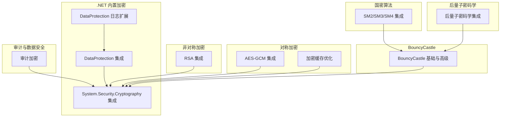
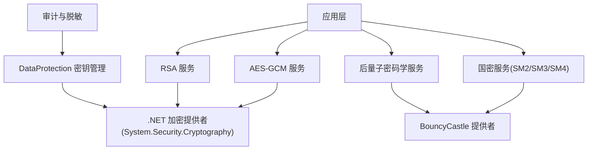
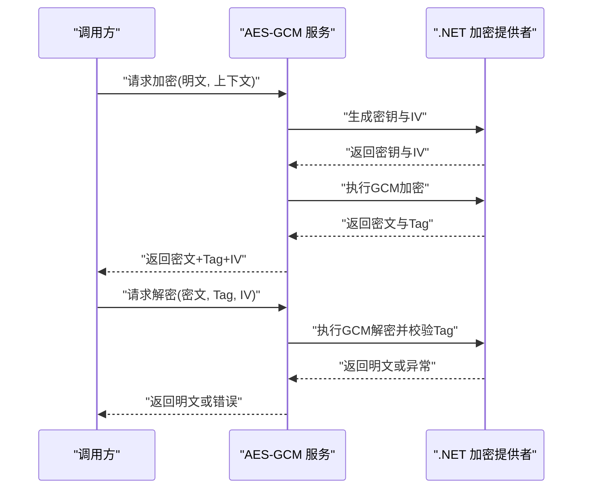
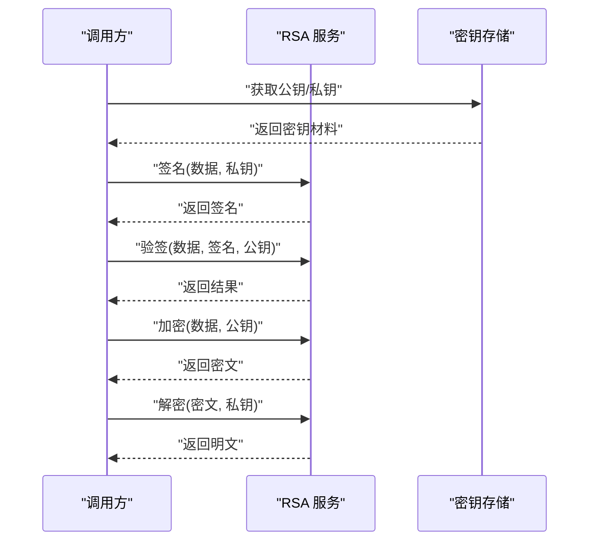
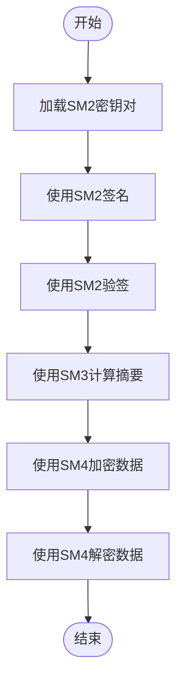
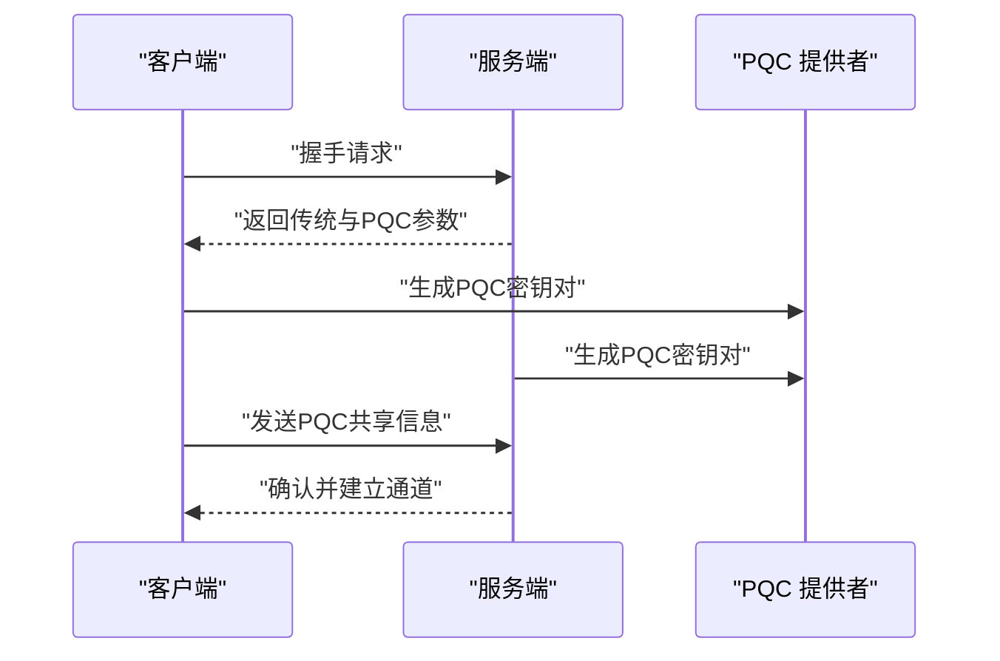
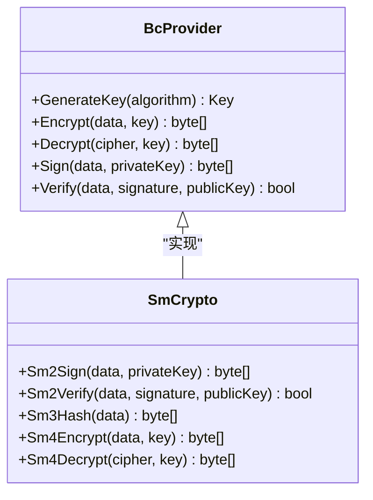
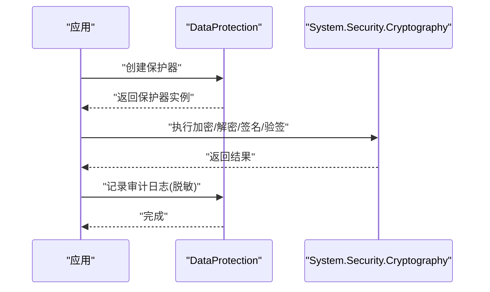
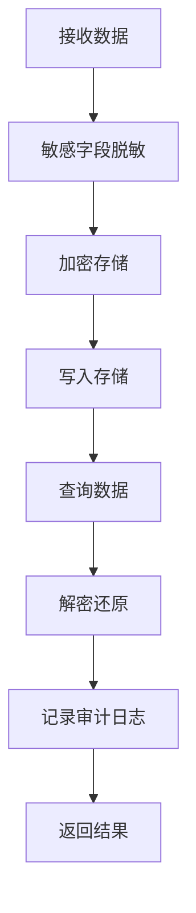
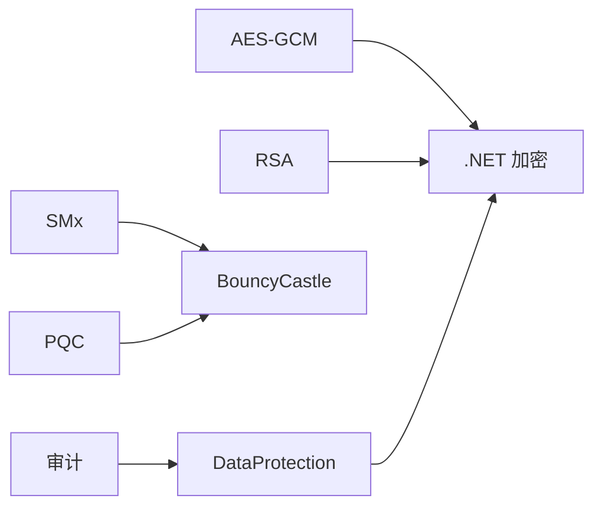

# 加密解密技术

<cite>
**本文引用的文件**   
- [aes_gcm_encryption_integration.cs](file://aes_gcm_encryption_integration.cs)
- [bouncycastle_advanced.cs](file://bouncycastle_advanced.cs)
- [bouncycastle_integration.cs](file://bouncycastle_integration.cs)
- [netcore_encrypt_advanced.cs](file://netcore_encrypt_advanced.cs)
- [netcore_encrypt_cache.cs](file://netcore_encrypt_cache.cs)
- [netcore_encrypt_integration.cs](file://netcore_encrypt_integration.cs)
- [rsa_encryption_integration.cs](file://rsa_encryption_integration.cs)
- [sm_crypto_integration.cs](file://sm_crypto_integration.cs)
- [quantum_crypto_integration.cs](file://quantum_crypto_integration.cs)
- [audit_encryption.cs](file://audit_encryption.cs)
- [dataprotection_integration.cs](file://dataprotection_integration.cs)
- [logging_dataprotection_extensions.cs](file://logging_dataprotection_extensions.cs)
</cite>

## 目录
1. [简介](#简介)
2. [项目结构](#项目结构)
3. [核心组件](#核心组件)
4. [架构总览](#架构总览)
5. [详细组件分析](#详细组件分析)
6. [依赖关系分析](#依赖关系分析)
7. [性能考虑](#性能考虑)
8. [故障排查指南](#故障排查指南)
9. [结论](#结论)
10. [附录](#附录)

## 简介
本文件面向在 .NET 生态中实现安全与合规的开发者，系统性梳理对称加密（AES-GCM）、非对称加密、国密算法（SM2/SM3/SM4）以及后量子密码学的应用实践。内容覆盖：
- BouncyCastle 库使用与高级特性
- .NET 内置加密 API（System.Security.Cryptography、DataProtection）
- 密钥管理与证书处理
- 数据加密存储、传输加密、数字签名与哈希算法
- 加密性能优化与安全最佳实践

## 项目结构
仓库中包含多个与加密相关的示例与集成文件，按主题划分如下：
- 对称加密与认证加密：AES-GCM 集成与缓存优化
- 非对称加密：RSA 集成与高级用法
- 国密算法：SM2/SM3/SM4 集成
- 后量子密码学：PQC 集成示例
- BouncyCastle：基础与高级用法
- .NET 内置加密：通用集成、缓存优化与高级场景
- 审计与数据安全：审计加密、DataProtection 与日志扩展

图表来源
- [aes_gcm_encryption_integration.cs:1-200](file://aes_gcm_encryption_integration.cs#L1-L200)
- [netcore_encrypt_cache.cs:1-200](file://netcore_encrypt_cache.cs#L1-L200)
- [rsa_encryption_integration.cs:1-200](file://rsa_encryption_integration.cs#L1-L200)
- [sm_crypto_integration.cs:1-200](file://sm_crypto_integration.cs#L1-L200)
- [quantum_crypto_integration.cs:1-200](file://quantum_crypto_integration.cs#L1-L200)
- [bouncycastle_integration.cs:1-200](file://bouncycastle_integration.cs#L1-L200)
- [bouncycastle_advanced.cs:1-200](file://bouncycastle_advanced.cs#L1-L200)
- [netcore_encrypt_integration.cs:1-200](file://netcore_encrypt_integration.cs#L1-L200)
- [dataprotection_integration.cs:1-200](file://dataprotection_integration.cs#L1-L200)
- [logging_dataprotection_extensions.cs:1-200](file://logging_dataprotection_extensions.cs#L1-L200)
- [audit_encryption.cs:1-200](file://audit_encryption.cs#L1-L200)

章节来源
- [aes_gcm_encryption_integration.cs:1-200](file://aes_gcm_encryption_integration.cs#L1-L200)
- [bouncycastle_advanced.cs:1-200](file://bouncycastle_advanced.cs#L1-L200)
- [bouncycastle_integration.cs:1-200](file://bouncycastle_integration.cs#L1-L200)
- [netcore_encrypt_advanced.cs:1-200](file://netcore_encrypt_advanced.cs#L1-L200)
- [netcore_encrypt_cache.cs:1-200](file://netcore_encrypt_cache.cs#L1-L200)
- [netcore_encrypt_integration.cs:1-200](file://netcore_encrypt_integration.cs#L1-L200)
- [rsa_encryption_integration.cs:1-200](file://rsa_encryption_integration.cs#L1-L200)
- [sm_crypto_integration.cs:1-200](file://sm_crypto_integration.cs#L1-L200)
- [quantum_crypto_integration.cs:1-200](file://quantum_crypto_integration.cs#L1-L200)
- [audit_encryption.cs:1-200](file://audit_encryption.cs#L1-L200)
- [dataprotection_integration.cs:1-200](file://dataprotection_integration.cs#L1-L200)
- [logging_dataprotection_extensions.cs:1-200](file://logging_dataprotection_extensions.cs#L1-L200)

## 核心组件
- AES-GCM 对称加密与认证：提供高吞吐、可验证完整性的数据加密能力，适用于数据静态存储与网络传输。
- RSA 非对称加密：用于密钥交换、小数据加密与数字签名，适合身份认证与消息完整性校验。
- 国密算法（SM2/SM3/SM4）：满足国内合规要求，SM2 为非对称公钥算法，SM3 为哈希算法，SM4 为对称分组密码。
- 后量子密码学（PQC）：面向抗量子攻击的新一代算法族，用于未来安全迁移与混合模式部署。
- BouncyCastle：广泛支持多种密码学算法与协议，便于跨平台与多标准兼容。
- .NET 内置加密：System.Security.Cryptography 提供高性能原生实现；DataProtection 提供应用级密钥管理与保护。
- 审计与数据安全：结合 DataProtection 与日志扩展，实现敏感数据的脱敏与审计追踪。

章节来源
- [aes_gcm_encryption_integration.cs:1-200](file://aes_gcm_encryption_integration.cs#L1-L200)
- [rsa_encryption_integration.cs:1-200](file://rsa_encryption_integration.cs#L1-L200)
- [sm_crypto_integration.cs:1-200](file://sm_crypto_integration.cs#L1-L200)
- [quantum_crypto_integration.cs:1-200](file://quantum_crypto_integration.cs#L1-L200)
- [bouncycastle_integration.cs:1-200](file://bouncycastle_integration.cs#L1-L200)
- [bouncycastle_advanced.cs:1-200](file://bouncycastle_advanced.cs#L1-L200)
- [netcore_encrypt_integration.cs:1-200](file://netcore_encrypt_integration.cs#L1-L200)
- [netcore_encrypt_advanced.cs:1-200](file://netcore_encrypt_advanced.cs#L1-L200)
- [dataprotection_integration.cs:1-200](file://dataprotection_integration.cs#L1-L200)
- [logging_dataprotection_extensions.cs:1-200](file://logging_dataprotection_extensions.cs#L1-L200)
- [audit_encryption.cs:1-200](file://audit_encryption.cs#L1-L200)

## 架构总览
下图展示各加密模块与 .NET 内置库、BouncyCastle 的关系及数据流向。

图表来源
- [aes_gcm_encryption_integration.cs:1-200](file://aes_gcm_encryption_integration.cs#L1-L200)
- [rsa_encryption_integration.cs:1-200](file://rsa_encryption_integration.cs#L1-L200)
- [sm_crypto_integration.cs:1-200](file://sm_crypto_integration.cs#L1-L200)
- [quantum_crypto_integration.cs:1-200](file://quantum_crypto_integration.cs#L1-L200)
- [bouncycastle_integration.cs:1-200](file://bouncycastle_integration.cs#L1-L200)
- [bouncycastle_advanced.cs:1-200](file://bouncycastle_advanced.cs#L1-L200)
- [netcore_encrypt_integration.cs:1-200](file://netcore_encrypt_integration.cs#L1-L200)
- [dataprotection_integration.cs:1-200](file://dataprotection_integration.cs#L1-L200)

## 详细组件分析

### AES-GCM 对称加密与认证
- 功能要点
  - 使用 GCM 模式进行认证加密，确保机密性与完整性。
  - 随机初始化向量（IV）与标签（Tag）生成与校验。
  - 流式读写以支持大文件与高吞吐场景。
- 典型流程
  - 生成密钥与 IV
  - 加密数据并输出密文与 Tag
  - 解密时校验 Tag，失败则拒绝
- 性能优化
  - 重用加密器实例（线程安全前提下）
  - 使用内存池减少分配
  - 批量处理与并行化

图表来源
- [aes_gcm_encryption_integration.cs:1-200](file://aes_gcm_encryption_integration.cs#L1-L200)

章节来源
- [aes_gcm_encryption_integration.cs:1-200](file://aes_gcm_encryption_integration.cs#L1-L200)

### RSA 非对称加密与签名
- 功能要点
  - 密钥对生成、导入导出（PEM/DER）
  - 小数据加密与数字签名/验签
  - 与 PKCS#1/PKCS#8 格式兼容
- 典型流程
  - 生成或加载密钥对
  - 使用私钥签名、公钥验签
  - 使用公钥加密、私钥解密（注意长度限制）
- 安全建议
  - 避免直接加密大数据，采用混合加密（RSA 加密会话密钥 + AES-GCM 加密数据）
  - 严格校验签名与证书链

图表来源
- [rsa_encryption_integration.cs:1-200](file://rsa_encryption_integration.cs#L1-L200)

章节来源
- [rsa_encryption_integration.cs:1-200](file://rsa_encryption_integration.cs#L1-L200)

### 国密算法（SM2/SM3/SM4）
- 功能要点
  - SM2：非对称公钥算法，用于签名、密钥交换与小数据加密
  - SM3：哈希算法，用于摘要与完整性校验
  - SM4：对称分组密码，用于数据加密
- 实现路径
  - 通过 BouncyCastle 提供 SMx 算法实现
  - 与 .NET 内置 API 解耦，便于替换与升级
- 合规与迁移
  - 优先选择国家密码管理局推荐的参数与模式
  - 逐步引入混合模式（传统算法 + 国密）平滑迁移

图表来源
- [sm_crypto_integration.cs:1-200](file://sm_crypto_integration.cs#L1-L200)
- [bouncycastle_integration.cs:1-200](file://bouncycastle_integration.cs#L1-L200)

章节来源
- [sm_crypto_integration.cs:1-200](file://sm_crypto_integration.cs#L1-L200)
- [bouncycastle_integration.cs:1-200](file://bouncycastle_integration.cs#L1-L200)

### 后量子密码学（PQC）
- 功能要点
  - 引入抗量子算法族（如基于格的 KEM/签名）
  - 与传统算法混合部署，保障向后兼容
- 实现路径
  - 借助 BouncyCastle 或专用 PQC 库
  - 设计密钥协商与签名流程，兼顾性能与安全
- 迁移策略
  - 先启用混合模式，再逐步切换至纯 PQC
  - 监控性能与兼容性指标

图表来源
- [quantum_crypto_integration.cs:1-200](file://quantum_crypto_integration.cs#L1-L200)
- [bouncycastle_advanced.cs:1-200](file://bouncycastle_advanced.cs#L1-L200)

章节来源
- [quantum_crypto_integration.cs:1-200](file://quantum_crypto_integration.cs#L1-L200)
- [bouncycastle_advanced.cs:1-200](file://bouncycastle_advanced.cs#L1-L200)

### BouncyCastle 使用与高级特性
- 功能要点
  - 广泛的算法支持与协议实现
  - 自定义 Provider 与工具类封装
  - 与 .NET 加密体系互操作
- 使用建议
  - 统一抽象接口，屏蔽底层差异
  - 关注版本更新与漏洞修复
  - 合理配置安全参数（如曲线、填充模式）

图表来源
- [bouncycastle_integration.cs:1-200](file://bouncycastle_integration.cs#L1-L200)
- [bouncycastle_advanced.cs:1-200](file://bouncycastle_advanced.cs#L1-L200)

章节来源
- [bouncycastle_integration.cs:1-200](file://bouncycastle_integration.cs#L1-L200)
- [bouncycastle_advanced.cs:1-200](file://bouncycastle_advanced.cs#L1-L200)

### .NET 内置加密 API 与 DataProtection
- System.Security.Cryptography
  - 高性能原生实现，推荐作为首选
  - 支持 AES-GCM、RSA、ECC、哈希等
- DataProtection
  - 应用级密钥管理与保护（Windows DPAPI、Linux Keyring、文件系统）
  - 与日志扩展集成，实现敏感数据脱敏与审计
- 使用建议
  - 优先使用内置 API，必要时通过 BouncyCastle 补充
  - 合理配置密钥轮换与持久化策略

图表来源
- [netcore_encrypt_integration.cs:1-200](file://netcore_encrypt_integration.cs#L1-L200)
- [dataprotection_integration.cs:1-200](file://dataprotection_integration.cs#L1-L200)
- [logging_dataprotection_extensions.cs:1-200](file://logging_dataprotection_extensions.cs#L1-L200)

章节来源
- [netcore_encrypt_integration.cs:1-200](file://netcore_encrypt_integration.cs#L1-L200)
- [dataprotection_integration.cs:1-200](file://dataprotection_integration.cs#L1-L200)
- [logging_dataprotection_extensions.cs:1-200](file://logging_dataprotection_extensions.cs#L1-L200)

### 审计加密与数据安全
- 功能要点
  - 对敏感字段进行加密存储与脱敏显示
  - 审计日志记录关键操作与状态
- 实现路径
  - 结合 DataProtection 与自定义脱敏逻辑
  - 在数据访问层统一处理加解密

图表来源
- [audit_encryption.cs:1-200](file://audit_encryption.cs#L1-L200)
- [dataprotection_integration.cs:1-200](file://dataprotection_integration.cs#L1-L200)

章节来源
- [audit_encryption.cs:1-200](file://audit_encryption.cs#L1-L200)
- [dataprotection_integration.cs:1-200](file://dataprotection_integration.cs#L1-L200)

## 依赖关系分析
- 组件耦合
  - AES-GCM、RSA、SMx、PQC 均依赖底层加密提供者（.NET 或 BouncyCastle）
  - DataProtection 负责密钥生命周期管理，降低密钥泄露风险
- 外部依赖
  - BouncyCastle：提供丰富算法与协议支持
  - .NET 内置：高性能与平台优化
- 潜在循环依赖
  - 通过抽象接口隔离实现，避免直接耦合

图表来源
- [aes_gcm_encryption_integration.cs:1-200](file://aes_gcm_encryption_integration.cs#L1-L200)
- [rsa_encryption_integration.cs:1-200](file://rsa_encryption_integration.cs#L1-L200)
- [sm_crypto_integration.cs:1-200](file://sm_crypto_integration.cs#L1-L200)
- [quantum_crypto_integration.cs:1-200](file://quantum_crypto_integration.cs#L1-L200)
- [bouncycastle_integration.cs:1-200](file://bouncycastle_integration.cs#L1-L200)
- [bouncycastle_advanced.cs:1-200](file://bouncycastle_advanced.cs#L1-L200)
- [netcore_encrypt_integration.cs:1-200](file://netcore_encrypt_integration.cs#L1-L200)
- [dataprotection_integration.cs:1-200](file://dataprotection_integration.cs#L1-L200)

章节来源
- [aes_gcm_encryption_integration.cs:1-200](file://aes_gcm_encryption_integration.cs#L1-L200)
- [bouncycastle_integration.cs:1-200](file://bouncycastle_integration.cs#L1-L200)
- [netcore_encrypt_integration.cs:1-200](file://netcore_encrypt_integration.cs#L1-L200)
- [dataprotection_integration.cs:1-200](file://dataprotection_integration.cs#L1-L200)

## 性能考虑
- 算法选择
  - 对称加密优先 AES-GCM，非对称仅用于密钥交换或小数据
  - 国密算法按需启用，评估性能与合规需求
- 资源管理
  - 复用加密器实例，避免频繁创建销毁
  - 使用内存池与流式处理，降低 GC 压力
- 并发与并行
  - 合理分块处理大文件，利用多线程提升吞吐
  - 注意线程安全与锁粒度控制
- 缓存策略
  - 对热点密钥与元数据进行安全缓存
  - 设置合理的过期与刷新策略

[本节为通用指导，不直接分析具体文件]

## 故障排查指南
- 常见错误
  - 密钥长度或格式不正确
  - IV/Nonce 重复使用导致安全漏洞
  - 签名或验签失败（时间戳、编码不一致）
- 诊断步骤
  - 检查输入数据与参数合法性
  - 验证密钥来源与权限
  - 查看加密/解密日志与异常堆栈
- 修复建议
  - 统一编码与序列化格式
  - 增加重试与降级机制
  - 定期轮换密钥并备份

章节来源
- [netcore_encrypt_advanced.cs:1-200](file://netcore_encrypt_advanced.cs#L1-L200)
- [bouncycastle_advanced.cs:1-200](file://bouncycastle_advanced.cs#L1-L200)
- [dataprotection_integration.cs:1-200](file://dataprotection_integration.cs#L1-L200)

## 结论
本仓库提供了全面的加密解密技术实现与集成示例，涵盖对称、非对称、国密与后量子密码学，并结合 .NET 内置 API 与 BouncyCastle 构建灵活、可扩展的安全方案。通过合理的密钥管理、性能优化与安全最佳实践，可在保证安全性的同时获得良好的系统性能与可维护性。

[本节为总结性内容，不直接分析具体文件]

## 附录
- 术语表
  - AES-GCM：高级加密标准-伽罗瓦/计数器模式
  - SM2/SM3/SM4：中国国家密码管理局发布的密码算法
  - PQC：后量子密码学
  - DataProtection：.NET 应用级数据保护框架
- 参考文件
  - 对称加密：[aes_gcm_encryption_integration.cs](file://aes_gcm_encryption_integration.cs)
  - 非对称加密：[rsa_encryption_integration.cs](file://rsa_encryption_integration.cs)
  - 国密算法：[sm_crypto_integration.cs](file://sm_crypto_integration.cs)
  - 后量子密码学：[quantum_crypto_integration.cs](file://quantum_crypto_integration.cs)
  - BouncyCastle：[bouncycastle_integration.cs](file://bouncycastle_integration.cs), [bouncycastle_advanced.cs](file://bouncycastle_advanced.cs)
  - .NET 内置加密：[netcore_encrypt_integration.cs](file://netcore_encrypt_integration.cs), [netcore_encrypt_advanced.cs](file://netcore_encrypt_advanced.cs), [netcore_encrypt_cache.cs](file://netcore_encrypt_cache.cs)
  - DataProtection：[dataprotection_integration.cs](file://dataprotection_integration.cs), [logging_dataprotection_extensions.cs](file://logging_dataprotection_extensions.cs)
  - 审计加密：[audit_encryption.cs](file://audit_encryption.cs)