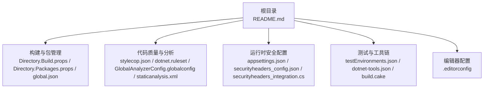
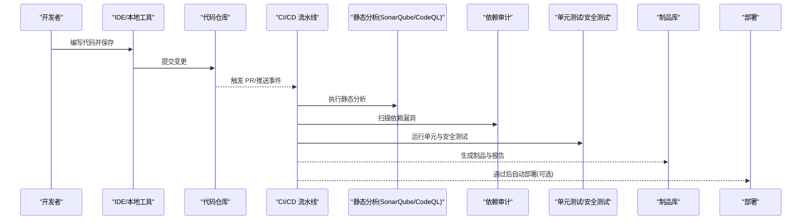
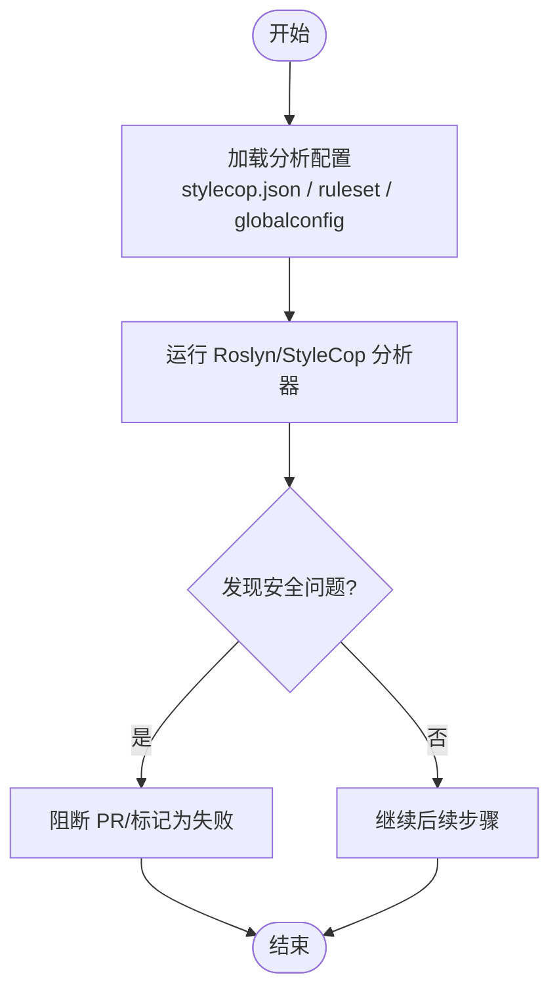
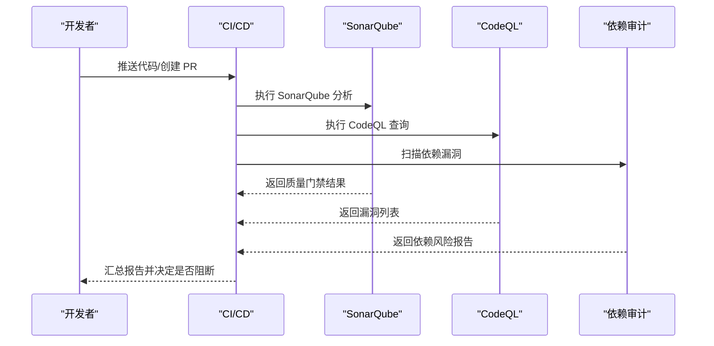
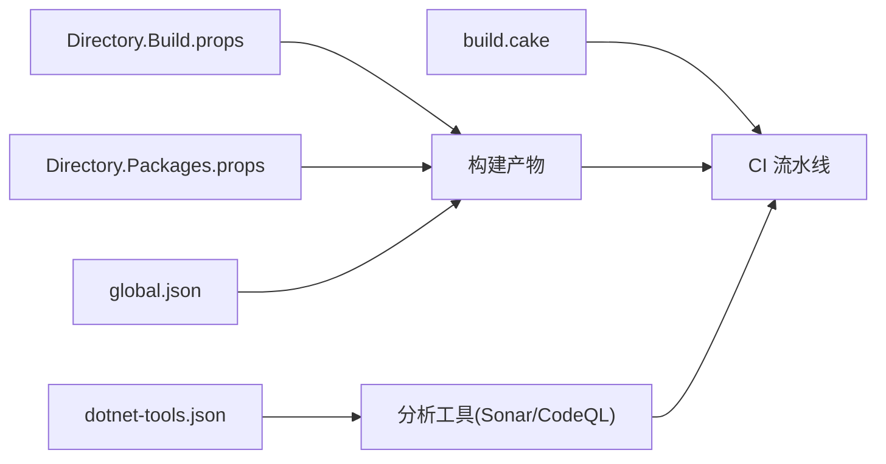

# 安全编码规范

<cite>
**本文引用的文件**   
- [README.md](file://README.md)
- [.editorconfig](file://.editorconfig)
- [Directory.Build.props](file://Directory.Build.props)
- [Directory.Packages.props](file://Directory.Packages.props)
- [global.json](file://global.json)
- [dotnet.ruleset](file://dotnet.ruleset)
- [stylecop.json](file://stylecop.json)
- [staticanalysis.xml](file://staticanalysis.xml)
- [appsettings.json](file://appsettings.json)
- [securityheaders_config.json](file://securityheaders_config.json)
- [securityheaders_integration.cs](file://securityheaders_integration.cs)
- [GlobalAnalyzerConfig.globalconfig](file://GlobalAnalyzerConfig.globalconfig)
- [testEnvironments.json](file://testEnvironments.json)
- [build.cake](file://build.cake)
- [dotnet-tools.json](file://dotnet-tools.json)
</cite>

## 目录
1. [引言](#引言)
2. [项目结构](#项目结构)
3. [核心组件](#核心组件)
4. [架构总览](#架构总览)
5. [详细组件分析](#详细组件分析)
6. [依赖分析](#依赖分析)
7. [性能考虑](#性能考虑)
8. [故障排查指南](#故障排查指南)
9. [结论](#结论)
10. [附录](#附录)

## 引言
本规范面向 .NET 工程，旨在建立统一的安全编码实践与质量门禁。内容覆盖：
- 安全编码最佳实践（敏感信息、内存安全、资源管理、异常处理）
- 静态代码分析与规则集配置（StyleCop、Roslyn Analyzers、Ruleset）
- 代码审查流程与自动化检查（PR 门禁、CI/CD 集成）
- 漏洞扫描与安全分析工具集成（SonarQube、CodeQL）
- 常见安全漏洞识别与修复方法
- 安全测试策略（SAST/DAST/依赖审计/模糊测试/渗透测试）

本规范适用于所有功能模块与示例集成代码，确保在快速迭代中保持高安全基线。

## 项目结构
仓库包含大量示例与集成代码，根目录提供构建、分析与质量相关的配置文件。与“安全编码规范”直接相关的关键文件包括：
- 构建与包管理：Directory.Build.props、Directory.Packages.props、global.json、dotnet-tools.json
- 代码风格与分析：stylecop.json、dotnet.ruleset、GlobalAnalyzerConfig.globalconfig、staticanalysis.xml
- 运行时配置：appsettings.json、securityheaders_config.json、securityheaders_integration.cs
- 测试环境：testEnvironments.json
- 构建脚本：build.cake
- 编辑器配置：.editorconfig
- 项目说明：README.md

图表来源
- [README.md](file://README.md)
- [Directory.Build.props](file://Directory.Build.props)
- [Directory.Packages.props](file://Directory.Packages.props)
- [global.json](file://global.json)
- [stylecop.json](file://stylecop.json)
- [dotnet.ruleset](file://dotnet.ruleset)
- [GlobalAnalyzerConfig.globalconfig](file://GlobalAnalyzerConfig.globalconfig)
- [staticanalysis.xml](file://staticanalysis.xml)
- [appsettings.json](file://appsettings.json)
- [securityheaders_config.json](file://securityheaders_config.json)
- [securityheaders_integration.cs](file://securityheaders_integration.cs)
- [testEnvironments.json](file://testEnvironments.json)
- [dotnet-tools.json](file://dotnet-tools.json)
- [build.cake](file://build.cake)
- [.editorconfig](file://.editorconfig)

章节来源
- [README.md](file://README.md)
- [Directory.Build.props](file://Directory.Build.props)
- [Directory.Packages.props](file://Directory.Packages.props)
- [global.json](file://global.json)
- [stylecop.json](file://stylecop.json)
- [dotnet.ruleset](file://dotnet.ruleset)
- [GlobalAnalyzerConfig.globalconfig](file://GlobalAnalyzerConfig.globalconfig)
- [staticanalysis.xml](file://staticanalysis.xml)
- [appsettings.json](file://appsettings.json)
- [securityheaders_config.json](file://securityheaders_config.json)
- [securityheaders_integration.cs](file://securityheaders_integration.cs)
- [testEnvironments.json](file://testEnvironments.json)
- [dotnet-tools.json](file://dotnet-tools.json)
- [build.cake](file://build.cake)
- [.editorconfig](file://.editorconfig)

## 核心组件
- 代码质量与规则
  - StyleCop：通过 stylecop.json 定义代码风格与部分安全相关规则（如避免硬编码敏感信息）。
  - Roslyn Analyzers + Ruleset：通过 dotnet.ruleset 集中启用/禁用分析器规则，建议开启安全类规则（如注入、XSS、路径遍历等）。
  - 全局分析器配置：GlobalAnalyzerConfig.globalconfig 用于统一分析行为。
- 构建与依赖治理
  - Directory.Build.props：统一编译选项、强命名、版本约束、分析器开关。
  - Directory.Packages.props：集中管理 NuGet 包版本，便于锁定已知安全版本。
  - global.json：固定 SDK/运行时版本，保证可重复构建。
- 运行时安全配置
  - appsettings.json：应用配置入口，建议分离生产配置并采用环境变量注入。
  - securityheaders_config.json + securityheaders_integration.cs：集中配置与注入安全响应头（CSP、HSTS、X-Frame-Options 等）。
- 测试与工具链
  - testEnvironments.json：定义测试环境与变量，避免将敏感值写入测试配置。
  - dotnet-tools.json：声明本地工具（如 SonarScanner、CodeQL CLI），便于 CI 使用。
  - build.cake：编排构建、分析、测试任务，可在 PR 阶段执行安全检查。

章节来源
- [stylecop.json](file://stylecop.json)
- [dotnet.ruleset](file://dotnet.ruleset)
- [GlobalAnalyzerConfig.globalconfig](file://GlobalAnalyzerConfig.globalconfig)
- [Directory.Build.props](file://Directory.Build.props)
- [Directory.Packages.props](file://Directory.Packages.props)
- [global.json](file://global.json)
- [appsettings.json](file://appsettings.json)
- [securityheaders_config.json](file://securityheaders_config.json)
- [securityheaders_integration.cs](file://securityheaders_integration.cs)
- [testEnvironments.json](file://testEnvironments.json)
- [dotnet-tools.json](file://dotnet-tools.json)
- [build.cake](file://build.cake)

## 架构总览
下图展示从开发到发布的安全流水线：开发者提交代码后，IDE 与本地工具进行静态检查；PR 触发 CI，运行 SAST、依赖审计、单元测试与覆盖率；通过后进入制品库与部署。

[此图为概念性流程图，不直接映射具体源码文件]

## 详细组件分析

### 安全编码最佳实践
- 敏感信息处理
  - 禁止在代码或配置中硬编码密钥、令牌、连接串；使用环境变量、密钥管理服务或受保护的配置源。
  - 对日志输出进行脱敏，避免记录密码、Token、PII。
  - 配置文件按环境拆分，生产配置不得入库。
- 内存安全与资源管理
  - 使用 using 语句或 IAsyncDisposable 确保流、连接、句柄及时释放。
  - 避免大对象频繁分配，合理使用 Memory/Span 减少拷贝。
  - 对第三方库的缓冲区操作进行边界校验，防止溢出。
- 输入验证与输出编码
  - 对所有外部输入进行白名单校验（类型、长度、格式、范围）。
  - 输出到 HTML/JS/CSS 时进行上下文编码，防范 XSS。
  - SQL/命令注入防护：参数化查询、最小权限原则。
- 异常处理
  - 捕获并分类异常，避免泄露堆栈细节给客户端。
  - 关键路径增加重试与熔断，提升韧性。
  - 记录结构化日志，包含必要上下文但不含敏感信息。

章节来源
- [appsettings.json](file://appsettings.json)
- [securityheaders_config.json](file://securityheaders_config.json)
- [securityheaders_integration.cs](file://securityheaders_integration.cs)
- [testEnvironments.json](file://testEnvironments.json)

### 静态代码分析配置
- StyleCop（stylecop.json）
  - 启用与敏感信息相关的规则（如禁止硬编码字符串常量）。
  - 自定义规则优先级，平衡可读性与安全性。
- Roslyn Analyzers + Ruleset（dotnet.ruleset）
  - 启用安全类规则（如 CA22xx、CA3xxx、SecurityRules）。
  - 针对项目特性选择性禁用误报规则，保留严格模式。
- 全局分析器（GlobalAnalyzerConfig.globalconfig）
  - 统一分析器版本与行为，确保团队一致。
- 静态分析清单（staticanalysis.xml）
  - 若使用第三方静态分析工具，可通过该清单定义扫描范围与阈值。

图表来源
- [stylecop.json](file://stylecop.json)
- [dotnet.ruleset](file://dotnet.ruleset)
- [GlobalAnalyzerConfig.globalconfig](file://GlobalAnalyzerConfig.globalconfig)
- [staticanalysis.xml](file://staticanalysis.xml)

章节来源
- [stylecop.json](file://stylecop.json)
- [dotnet.ruleset](file://dotnet.ruleset)
- [GlobalAnalyzerConfig.globalconfig](file://GlobalAnalyzerConfig.globalconfig)
- [staticanalysis.xml](file://staticanalysis.xml)

### 代码审查流程
- 强制 PR 模板包含安全自检项（输入校验、敏感信息、依赖更新）。
- 至少一名具备安全意识的 Reviewer 审批。
- 自动化检查未通过不得合并。
- 对高风险变更（认证、授权、加密、网络 IO）要求额外评审。

[本节为流程性描述，不直接分析具体文件]

### 漏洞扫描工具集成
- SonarQube
  - 在 CI 中调用 SonarScanner，上传分析结果至 SonarQube 平台。
  - 设置质量门禁（Quality Gate），阻断存在高危问题的分支。
- CodeQL
  - 使用 GitHub Actions 或 CI 中的 CodeQL CLI 执行查询集扫描。
  - 针对 .NET 查询集聚焦注入、XSS、路径遍历、不安全反序列化等。
- 依赖审计
  - 使用 dotnet audit 或第三方工具（如 Dependabot/Trivy）定期扫描 NuGet 依赖。
  - 对已知 CVE 的包立即升级或替换。

[此图为概念性序列图，不直接映射具体源码文件]

### 敏感信息与配置安全
- 使用环境变量或密钥管理服务注入敏感值，避免写入 appsettings.json。
- 对配置文件进行访问控制与审计，限制读取权限。
- 对请求头与响应头进行安全加固（参考 securityheaders_config.json 与 integration 实现）。

章节来源
- [appsettings.json](file://appsettings.json)
- [securityheaders_config.json](file://securityheaders_config.json)
- [securityheaders_integration.cs](file://securityheaders_integration.cs)

### 内存安全与资源管理
- 优先使用异步 API 与流式处理，降低内存峰值。
- 对非托管资源使用 SafeHandle 或封装释放逻辑。
- 避免在热路径中进行装箱与反射，必要时缓存元数据。

[本节为通用指导，不直接分析具体文件]

### 异常处理与韧性
- 区分业务异常与系统异常，对外仅暴露友好错误码。
- 对网络调用增加超时、重试、熔断与退避策略。
- 记录结构化日志，包含追踪 ID 以便问题定位。

[本节为通用指导，不直接分析具体文件]

## 依赖分析
- 构建与包管理
  - Directory.Build.props：统一编译标志与分析器开关，影响全仓安全基线。
  - Directory.Packages.props：集中锁定 NuGet 包版本，降低供应链风险。
  - global.json：固定 SDK/运行时，避免环境漂移。
- 工具链
  - dotnet-tools.json：声明 SonarScanner、CodeQL CLI 等工具，便于 CI 复用。
  - build.cake：编排构建、分析、测试任务，确保一致性。

图表来源
- [Directory.Build.props](file://Directory.Build.props)
- [Directory.Packages.props](file://Directory.Packages.props)
- [global.json](file://global.json)
- [dotnet-tools.json](file://dotnet-tools.json)
- [build.cake](file://build.cake)

章节来源
- [Directory.Build.props](file://Directory.Build.props)
- [Directory.Packages.props](file://Directory.Packages.props)
- [global.json](file://global.json)
- [dotnet-tools.json](file://dotnet-tools.json)
- [build.cake](file://build.cake)

## 性能考虑
- 静态分析应在增量模式下运行，缩短反馈时间。
- 依赖审计可离线执行，避免阻塞主流程。
- 对大型解决方案分模块执行分析，提高并行度。
- 合理设置分析阈值，避免误报过多导致忽略真实问题。

[本节为通用指导，不直接分析具体文件]

## 故障排查指南
- 分析器报错
  - 检查 ruleset 与 globalconfig 是否启用了冲突规则。
  - 确认 StyleCop 配置与项目目标框架兼容。
- SonarQube 门禁失败
  - 查看质量门禁条件（覆盖率、重复率、漏洞等级）。
  - 临时调整阈值或修复问题后再提交。
- CodeQL 告警
  - 根据查询集定位具体代码位置，评估是否为误报。
  - 使用排除机制或修正代码。
- 依赖漏洞
  - 使用 dotnet audit 或第三方工具定位 CVE 与受影响包。
  - 升级或替换为安全版本，必要时添加补丁说明。

章节来源
- [dotnet.ruleset](file://dotnet.ruleset)
- [GlobalAnalyzerConfig.globalconfig](file://GlobalAnalyzerConfig.globalconfig)
- [stylecop.json](file://stylecop.json)
- [staticanalysis.xml](file://staticanalysis.xml)
- [dotnet-tools.json](file://dotnet-tools.json)
- [build.cake](file://build.cake)

## 结论
通过统一的静态分析、依赖治理与 CI 门禁，结合严格的代码审查与安全测试，可将安全风险前移并持续收敛。建议在团队内推广本规范，并在每个项目中落地执行，形成可度量、可追溯的安全工程体系。

[本节为总结性内容，不直接分析具体文件]

## 附录
- 常用命令与脚本
  - 本地分析：dotnet build、dotnet format、dotnet tool run sonarscanner
  - 依赖审计：dotnet audit、trivy fs --severity HIGH,CRITICAL
  - CodeQL：codeql database create/analyze
- 推荐工具清单
  - SonarQube、CodeQL、dotnet audit、Trivy、Dependabot
- 参考标准
  - OWASP Top 10、CWE、NIST SP 800-53

[本节为补充信息，不直接分析具体文件]