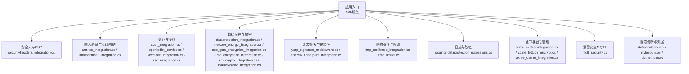
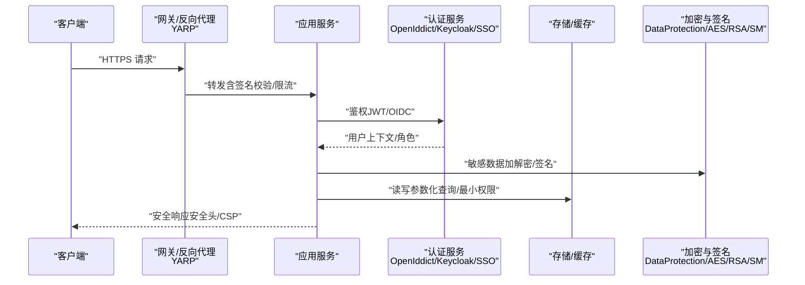
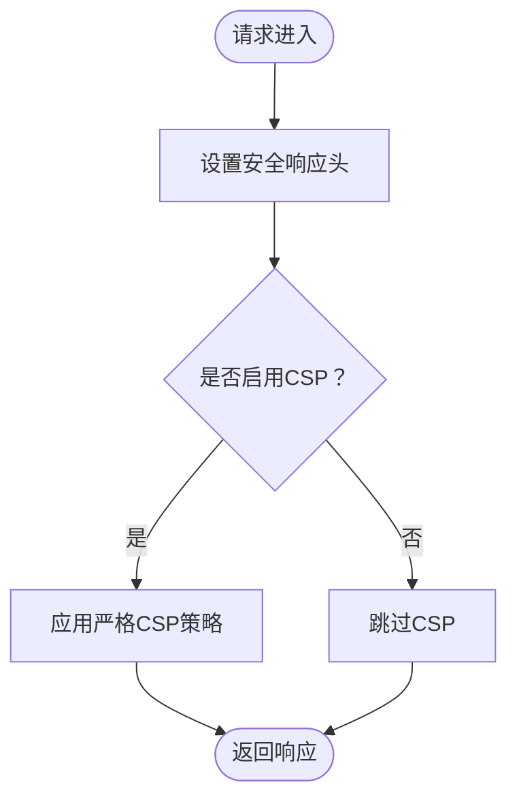
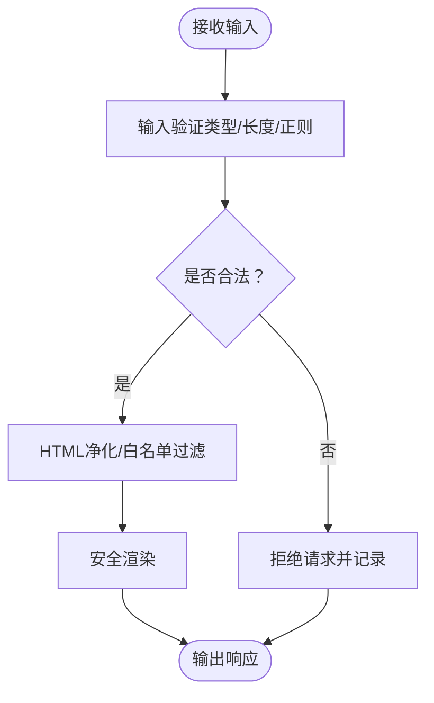
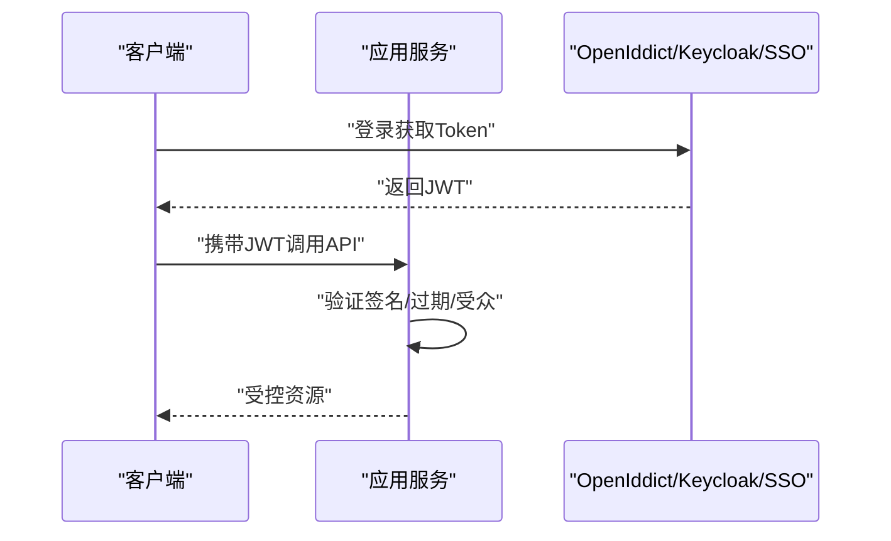
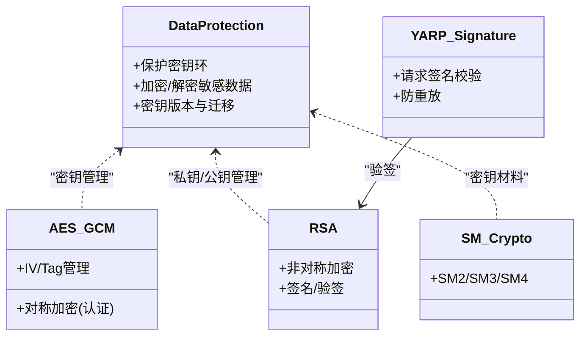
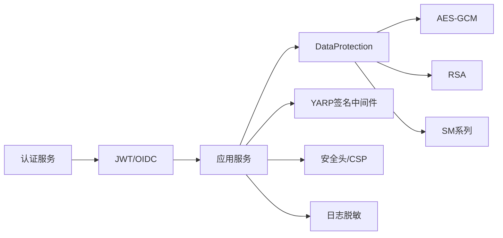

# 安全考虑

<cite>
**本文引用的文件**   
- [securityheaders_integration.cs](file://securityheaders_integration.cs)
- [securityheaders_config.json](file://securityheaders_config.json)
- [antixss_integration.cs](file://antixss_integration.cs)
- [htmlsanitizer_integration.cs](file://htmlsanitizer_integration.cs)
- [netcore_encrypt_integration.cs](file://netcore_encrypt_integration.cs)
- [aes_gcm_encryption_integration.cs](file://aes_gcm_encryption_integration.cs)
- [rsa_encryption_integration.cs](file://rsa_encryption_integration.cs)
- [sm_crypto_integration.cs](file://sm_crypto_integration.cs)
- [bouncycastle_integration.cs](file://bouncycastle_integration.cs)
- [dataprotection_integration.cs](file://dataprotection_integration.cs)
- [logging_dataprotection_extensions.cs](file://logging_dataprotection_extensions.cs)
- [appsettings.json](file://appsettings.json)
- [auth_integration.cs](file://auth_integration.cs)
- [openiddict_service.cs](file://openiddict_service.cs)
- [keycloak_integration.cs](file://keycloak_integration.cs)
- [sso_integration.cs](file://sso_integration.cs)
- [yarp_signature_middleware.cs](file://yarp_signature_middleware.cs)
- [http_resilience_integration.cs](file://http_resilience_integration.cs)
- [rate_limiter.cs](file://rate_limiter.cs)
- [staticanalysis.xml](file://staticanalysis.xml)
- [stylecop.json](file://stylecop.json)
- [dotnet.ruleset](file://dotnet.ruleset)
- [mqtt_security.cs](file://mqtt_security.cs)
- [acme_certes_integration.cs](file://acme_certes_integration.cs)
- [acme_lettuce_encrypt.cs](file://acme_lettuce_encrypt.cs)
- [acme_dotnet_integration.cs](file://acme_dotnet_integration.cs)
- [sha256_fingerprint_integration.cs](file://sha256_fingerprint_integration.cs)
</cite>

## 目录
1. [简介](#简介)
2. [项目结构](#项目结构)
3. [核心组件](#核心组件)
4. [架构总览](#架构总览)
5. [详细组件分析](#详细组件分析)
6. [依赖关系分析](#依赖关系分析)
7. [性能与安全权衡](#性能与安全权衡)
8. [故障排查指南](#故障排查指南)
9. [结论](#结论)
10. [附录](#附录)

## 简介
本文件面向代码库中的“安全考虑”主题，系统化梳理输入验证、SQL注入防护、XSS防护、网络安全与数据安全实践；覆盖加密算法选择、数字签名、证书管理与密钥轮换策略；并给出安全头配置、CORS策略、CSRF防护与会话安全的落地建议。同时提供安全编码规范、漏洞扫描与安全审计的最佳实践，帮助开发者在现有工程基础上构建可验证、可演进的安全体系。

## 项目结构
仓库包含大量集成示例与中间件实现，围绕Web API、认证授权、加密与签名、证书管理、消息安全等方向提供了丰富的参考实现。与安全相关的重点文件包括：
- Web安全头与CSP/安全头配置：securityheaders_integration.cs、securityheaders_config.json
- XSS防护：antixss_integration.cs、htmlsanitizer_integration.cs
- 数据加密与密码学：netcore_encrypt_integration.cs、aes_gcm_encryption_integration.cs、rsa_encryption_integration.cs、sm_crypto_integration.cs、bouncycastle_integration.cs
- 数据保护与敏感日志脱敏：dataprotection_integration.cs、logging_dataprotection_extensions.cs
- 认证与单点登录：auth_integration.cs、openiddict_service.cs、keycloak_integration.cs、sso_integration.cs
- 请求签名与完整性校验：yarp_signature_middleware.cs
- 网络弹性与限流：http_resilience_integration.cs、rate_limiter.cs
- 静态分析与代码规范：staticanalysis.xml、stylecop.json、dotnet.ruleset
- 消息通道安全（MQTT）：mqtt_security.cs
- 证书自动化与轮换：acme_certes_integration.cs、acme_lettuce_encrypt.cs、acme_dotnet_integration.cs
- 指纹与完整性校验：sha256_fingerprint_integration.cs

**图示来源** 
- [securityheaders_integration.cs](file://securityheaders_integration.cs)
- [antixss_integration.cs](file://antixss_integration.cs)
- [htmlsanitizer_integration.cs](file://htmlsanitizer_integration.cs)
- [auth_integration.cs](file://auth_integration.cs)
- [openiddict_service.cs](file://openiddict_service.cs)
- [keycloak_integration.cs](file://keycloak_integration.cs)
- [sso_integration.cs](file://sso_integration.cs)
- [dataprotection_integration.cs](file://dataprotection_integration.cs)
- [netcore_encrypt_integration.cs](file://netcore_encrypt_integration.cs)
- [aes_gcm_encryption_integration.cs](file://aes_gcm_encryption_integration.cs)
- [rsa_encryption_integration.cs](file://rsa_encryption_integration.cs)
- [sm_crypto_integration.cs](file://sm_crypto_integration.cs)
- [bouncycastle_integration.cs](file://bouncycastle_integration.cs)
- [yarp_signature_middleware.cs](file://yarp_signature_middleware.cs)
- [http_resilience_integration.cs](file://http_resilience_integration.cs)
- [rate_limiter.cs](file://rate_limiter.cs)
- [logging_dataprotection_extensions.cs](file://logging_dataprotection_extensions.cs)
- [acme_certes_integration.cs](file://acme_certes_integration.cs)
- [acme_lettuce_encrypt.cs](file://acme_lettuce_encrypt.cs)
- [acme_dotnet_integration.cs](file://acme_dotnet_integration.cs)
- [mqtt_security.cs](file://mqtt_security.cs)
- [staticanalysis.xml](file://staticanalysis.xml)
- [stylecop.json](file://stylecop.json)
- [dotnet.ruleset](file://dotnet.ruleset)

**章节来源**
- [securityheaders_integration.cs](file://securityheaders_integration.cs)
- [securityheaders_config.json](file://securityheaders_config.json)
- [antixss_integration.cs](file://antixss_integration.cs)
- [htmlsanitizer_integration.cs](file://htmlsanitizer_integration.cs)
- [netcore_encrypt_integration.cs](file://netcore_encrypt_integration.cs)
- [aes_gcm_encryption_integration.cs](file://aes_gcm_encryption_integration.cs)
- [rsa_encryption_integration.cs](file://rsa_encryption_integration.cs)
- [sm_crypto_integration.cs](file://sm_crypto_integration.cs)
- [bouncycastle_integration.cs](file://bouncycastle_integration.cs)
- [dataprotection_integration.cs](file://dataprotection_integration.cs)
- [logging_dataprotection_extensions.cs](file://logging_dataprotection_extensions.cs)
- [auth_integration.cs](file://auth_integration.cs)
- [openiddict_service.cs](file://openiddict_service.cs)
- [keycloak_integration.cs](file://keycloak_integration.cs)
- [sso_integration.cs](file://sso_integration.cs)
- [yarp_signature_middleware.cs](file://yarp_signature_middleware.cs)
- [http_resilience_integration.cs](file://http_resilience_integration.cs)
- [rate_limiter.cs](file://rate_limiter.cs)
- [staticanalysis.xml](file://staticanalysis.xml)
- [stylecop.json](file://stylecop.json)
- [dotnet.ruleset](file://dotnet.ruleset)
- [mqtt_security.cs](file://mqtt_security.cs)
- [acme_certes_integration.cs](file://acme_certes_integration.cs)
- [acme_lettuce_encrypt.cs](file://acme_lettuce_encrypt.cs)
- [acme_dotnet_integration.cs](file://acme_dotnet_integration.cs)
- [sha256_fingerprint_integration.cs](file://sha256_fingerprint_integration.cs)

## 核心组件
- 安全头与CSP：通过中间件统一设置响应头，强化浏览器安全策略，降低点击劫持、MIME嗅探、跨域风险等。
- XSS防护：使用内置或第三方HTML净化器对富文本进行白名单过滤与标签清理，避免脚本注入。
- 认证与授权：基于OpenIddict/Keycloak/SSO的统一身份管理，结合JWT/OIDC实现无状态鉴权与细粒度权限控制。
- 数据保护与加密：采用.NET DataProtection进行本地或分布式密钥管理；对称加密优先AES-GCM，非对称RSA用于密钥交换与签名；国密SM系列按需启用；BouncyCastle扩展算法族。
- 请求签名与完整性：网关层对请求体/头进行签名校验，防止篡改与重放。
- 网络弹性与限流：重试、熔断、退避与令牌桶/漏桶限流，抵御滥用与DDoS。
- 日志与脱敏：敏感字段自动脱敏，避免泄露凭证与PII。
- 证书与密钥管理：ACME自动化签发与续期，支持多CA与托管密钥。
- 消息安全：MQTT连接加密、客户端认证与ACL访问控制。
- 静态分析与规范：Roslyn规则、StyleCop与Ruleset保障代码质量与安全基线。

**章节来源**
- [securityheaders_integration.cs](file://securityheaders_integration.cs)
- [securityheaders_config.json](file://securityheaders_config.json)
- [antixss_integration.cs](file://antixss_integration.cs)
- [htmlsanitizer_integration.cs](file://htmlsanitizer_integration.cs)
- [auth_integration.cs](file://auth_integration.cs)
- [openiddict_service.cs](file://openiddict_service.cs)
- [keycloak_integration.cs](file://keycloak_integration.cs)
- [sso_integration.cs](file://sso_integration.cs)
- [dataprotection_integration.cs](file://dataprotection_integration.cs)
- [netcore_encrypt_integration.cs](file://netcore_encrypt_integration.cs)
- [aes_gcm_encryption_integration.cs](file://aes_gcm_encryption_integration.cs)
- [rsa_encryption_integration.cs](file://rsa_encryption_integration.cs)
- [sm_crypto_integration.cs](file://sm_crypto_integration.cs)
- [bouncycastle_integration.cs](file://bouncycastle_integration.cs)
- [yarp_signature_middleware.cs](file://yarp_signature_middleware.cs)
- [http_resilience_integration.cs](file://http_resilience_integration.cs)
- [rate_limiter.cs](file://rate_limiter.cs)
- [logging_dataprotection_extensions.cs](file://logging_dataprotection_extensions.cs)
- [acme_certes_integration.cs](file://acme_certes_integration.cs)
- [acme_lettuce_encrypt.cs](file://acme_lettuce_encrypt.cs)
- [acme_dotnet_integration.cs](file://acme_dotnet_integration.cs)
- [mqtt_security.cs](file://mqtt_security.cs)
- [staticanalysis.xml](file://staticanalysis.xml)
- [stylecop.json](file://stylecop.json)
- [dotnet.ruleset](file://dotnet.ruleset)

## 架构总览
下图展示从请求进入网关到业务处理、再到数据存储与外部集成的安全边界与控制点。

**图示来源** 
- [yarp_signature_middleware.cs](file://yarp_signature_middleware.cs)
- [auth_integration.cs](file://auth_integration.cs)
- [openiddict_service.cs](file://openiddict_service.cs)
- [keycloak_integration.cs](file://keycloak_integration.cs)
- [sso_integration.cs](file://sso_integration.cs)
- [dataprotection_integration.cs](file://dataprotection_integration.cs)
- [netcore_encrypt_integration.cs](file://netcore_encrypt_integration.cs)
- [aes_gcm_encryption_integration.cs](file://aes_gcm_encryption_integration.cs)
- [rsa_encryption_integration.cs](file://rsa_encryption_integration.cs)
- [sm_crypto_integration.cs](file://sm_crypto_integration.cs)
- [securityheaders_integration.cs](file://securityheaders_integration.cs)

## 详细组件分析

### 安全头与CSP配置
- 目标：防御点击劫持、MIME嗅探、跨站脚本、不安全的混合内容等。
- 关键要点：
  - 强制HTTPS、HSTS、X-Frame-Options、X-Content-Type-Options、Referrer-Policy、Permissions-Policy等。
  - 精细化的Content-Security-Policy，限制脚本、样式、字体、媒体与第三方资源来源。
  - 将策略集中配置，便于审计与变更。
- 参考实现位置：
  - 安全头中间件与配置：[securityheaders_integration.cs](file://securityheaders_integration.cs)、[securityheaders_config.json](file://securityheaders_config.json)

**图示来源** 
- [securityheaders_integration.cs](file://securityheaders_integration.cs)
- [securityheaders_config.json](file://securityheaders_config.json)

**章节来源**
- [securityheaders_integration.cs](file://securityheaders_integration.cs)
- [securityheaders_config.json](file://securityheaders_config.json)

### XSS防护与输入验证
- 目标：杜绝恶意脚本注入与富文本攻击。
- 关键要点：
  - 对所有用户输入进行类型、长度、格式与范围校验。
  - 富文本输出前使用HTML净化器进行白名单过滤。
  - 模板渲染默认转义，禁止直接拼接HTML。
- 参考实现位置：
  - XSS防护与HTML净化：[antixss_integration.cs](file://antixss_integration.cs)、[htmlsanitizer_integration.cs](file://htmlsanitizer_integration.cs)

**图示来源** 
- [antixss_integration.cs](file://antixss_integration.cs)
- [htmlsanitizer_integration.cs](file://htmlsanitizer_integration.cs)

**章节来源**
- [antixss_integration.cs](file://antixss_integration.cs)
- [htmlsanitizer_integration.cs](file://htmlsanitizer_integration.cs)

### 认证、授权与会话安全
- 目标：统一身份管理、最小权限与无状态会话。
- 关键要点：
  - 使用OIDC/JWT进行无状态鉴权，服务端仅验证签名与有效期。
  - 细粒度授权（RBAC/ABAC），接口级权限控制。
  - 会话Cookie安全属性（Secure/HttpOnly/SameSite），必要时禁用持久化。
- 参考实现位置：
  - 认证集成与OIDC服务：[auth_integration.cs](file://auth_integration.cs)、[openiddict_service.cs](file://openiddict_service.cs)
  - Keycloak集成与SSO：[keycloak_integration.cs](file://keycloak_integration.cs)、[sso_integration.cs](file://sso_integration.cs)

**图示来源** 
- [auth_integration.cs](file://auth_integration.cs)
- [openiddict_service.cs](file://openiddict_service.cs)
- [keycloak_integration.cs](file://keycloak_integration.cs)
- [sso_integration.cs](file://sso_integration.cs)

**章节来源**
- [auth_integration.cs](file://auth_integration.cs)
- [openiddict_service.cs](file://openiddict_service.cs)
- [keycloak_integration.cs](file://keycloak_integration.cs)
- [sso_integration.cs](file://sso_integration.cs)

### 数据加密、数字签名与密钥管理
- 目标：确保机密性、完整性与抗抵赖。
- 关键要点：
  - 对称加密优先AES-GCM（认证加密），非对称RSA用于密钥交换与签名。
  - 国密SM2/SM3/SM4按合规需求启用。
  - 使用.NET DataProtection统一管理密钥存储、版本与迁移。
  - 数字签名用于API请求/响应完整性校验与防重放。
- 参考实现位置：
  - 加密集成与AES-GCM：[netcore_encrypt_integration.cs](file://netcore_encrypt_integration.cs)、[aes_gcm_encryption_integration.cs](file://aes_gcm_encryption_integration.cs)
  - RSA签名与验签：[rsa_encryption_integration.cs](file://rsa_encryption_integration.cs)
  - 国密算法：[sm_crypto_integration.cs](file://sm_crypto_integration.cs)
  - 扩展算法库：[bouncycastle_integration.cs](file://bouncycastle_integration.cs)
  - 数据保护与密钥管理：[dataprotection_integration.cs](file://dataprotection_integration.cs)
  - 请求签名中间件：[yarp_signature_middleware.cs](file://yarp_signature_middleware.cs)
  - 指纹与完整性校验：[sha256_fingerprint_integration.cs](file://sha256_fingerprint_integration.cs)

**图示来源** 
- [dataprotection_integration.cs](file://dataprotection_integration.cs)
- [aes_gcm_encryption_integration.cs](file://aes_gcm_encryption_integration.cs)
- [rsa_encryption_integration.cs](file://rsa_encryption_integration.cs)
- [sm_crypto_integration.cs](file://sm_crypto_integration.cs)
- [yarp_signature_middleware.cs](file://yarp_signature_middleware.cs)

**章节来源**
- [netcore_encrypt_integration.cs](file://netcore_encrypt_integration.cs)
- [aes_gcm_encryption_integration.cs](file://aes_gcm_encryption_integration.cs)
- [rsa_encryption_integration.cs](file://rsa_encryption_integration.cs)
- [sm_crypto_integration.cs](file://sm_crypto_integration.cs)
- [bouncycastle_integration.cs](file://bouncycastle_integration.cs)
- [dataprotection_integration.cs](file://dataprotection_integration.cs)
- [yarp_signature_middleware.cs](file://yarp_signature_middleware.cs)
- [sha256_fingerprint_integration.cs](file://sha256_fingerprint_integration.cs)

### 网络安全与传输安全
- 目标：全链路TLS、最小协议版本、强密码套件与证书自动化。
- 关键要点：
  - 强制HTTPS，启用HSTS与OCSP Stapling。
  - 限制TLS版本与套件，禁用弱算法。
  - ACME自动化证书签发与续期，减少人工干预。
- 参考实现位置：
  - 网络弹性与重试/熔断：[http_resilience_integration.cs](file://http_resilience_integration.cs)
  - 证书自动化：[acme_certes_integration.cs](file://acme_certes_integration.cs)、[acme_lettuce_encrypt.cs](file://acme_lettuce_encrypt.cs)、[acme_dotnet_integration.cs](file://acme_dotnet_integration.cs)

**章节来源**
- [http_resilience_integration.cs](file://http_resilience_integration.cs)
- [acme_certes_integration.cs](file://acme_certes_integration.cs)
- [acme_lettuce_encrypt.cs](file://acme_lettuce_encrypt.cs)
- [acme_dotnet_integration.cs](file://acme_dotnet_integration.cs)

### CORS策略与CSRF防护
- 目标：限制跨域访问，防止跨站请求伪造。
- 关键要点：
  - CORS仅允许必要源与方法，禁用通配符。
  - SameSite Cookie策略配合CSRF Token双重防护。
  - 表单提交与AJAX均校验CSRF令牌。
- 说明：本项目未提供具体CORS/CSRF中间件实现文件，建议在网关或框架层统一配置，并与认证流程联动。

### 日志与敏感信息脱敏
- 目标：避免日志泄露凭证与PII。
- 关键要点：
  - 结构化日志，屏蔽敏感字段（密码、令牌、卡号）。
  - 使用DataProtection对日志中的敏感数据进行脱敏或哈希。
- 参考实现位置：
  - 日志数据保护扩展：[logging_dataprotection_extensions.cs](file://logging_dataprotection_extensions.cs)

**章节来源**
- [logging_dataprotection_extensions.cs](file://logging_dataprotection_extensions.cs)

### 消息通道安全（MQTT）
- 目标：确保设备与平台间通信的机密性与完整性。
- 关键要点：
  - TLS双向认证、客户端证书、ACL与最小权限。
  - 消息级别加密与签名可选。
- 参考实现位置：
  - MQTT安全：[mqtt_security.cs](file://mqtt_security.cs)

**章节来源**
- [mqtt_security.cs](file://mqtt_security.cs)

### 静态分析与代码规范
- 目标：在开发阶段发现潜在安全问题与代码异味。
- 关键要点：
  - Roslyn静态分析、StyleCop规则、Ruleset约束。
  - CI中集成安全扫描与质量门禁。
- 参考实现位置：
  - 静态分析配置：[staticanalysis.xml](file://staticanalysis.xml)、[stylecop.json](file://stylecop.json)、[dotnet.ruleset](file://dotnet.ruleset)

**章节来源**
- [staticanalysis.xml](file://staticanalysis.xml)
- [stylecop.json](file://stylecop.json)
- [dotnet.ruleset](file://dotnet.ruleset)

## 依赖关系分析
- 组件耦合：
  - 认证服务与网关签名中间件解耦，通过标准JWT/OIDC契约交互。
  - 加密模块依赖DataProtection进行密钥生命周期管理。
  - 安全头与CSP作为横切关注点，应在管道早期执行。
- 外部依赖：
  - OpenIddict/Keycloak/SSO提供身份与令牌服务。
  - ACME CA提供证书自动化。
  - BouncyCastle扩展密码学能力。
- 潜在循环依赖：应避免在认证与加密模块之间互相引用，通过接口抽象隔离。

**图示来源** 
- [auth_integration.cs](file://auth_integration.cs)
- [openiddict_service.cs](file://openiddict_service.cs)
- [keycloak_integration.cs](file://keycloak_integration.cs)
- [sso_integration.cs](file://sso_integration.cs)
- [dataprotection_integration.cs](file://dataprotection_integration.cs)
- [aes_gcm_encryption_integration.cs](file://aes_gcm_encryption_integration.cs)
- [rsa_encryption_integration.cs](file://rsa_encryption_integration.cs)
- [sm_crypto_integration.cs](file://sm_crypto_integration.cs)
- [yarp_signature_middleware.cs](file://yarp_signature_middleware.cs)
- [securityheaders_integration.cs](file://securityheaders_integration.cs)
- [logging_dataprotection_extensions.cs](file://logging_dataprotection_extensions.cs)

**章节来源**
- [auth_integration.cs](file://auth_integration.cs)
- [openiddict_service.cs](file://openiddict_service.cs)
- [keycloak_integration.cs](file://keycloak_integration.cs)
- [sso_integration.cs](file://sso_integration.cs)
- [dataprotection_integration.cs](file://dataprotection_integration.cs)
- [aes_gcm_encryption_integration.cs](file://aes_gcm_encryption_integration.cs)
- [rsa_encryption_integration.cs](file://rsa_encryption_integration.cs)
- [sm_crypto_integration.cs](file://sm_crypto_integration.cs)
- [yarp_signature_middleware.cs](file://yarp_signature_middleware.cs)
- [securityheaders_integration.cs](file://securityheaders_integration.cs)
- [logging_dataprotection_extensions.cs](file://logging_dataprotection_extensions.cs)

## 性能与安全权衡
- 加密开销：AES-GCM硬件加速优先；RSA签名仅在关键路径使用。
- 证书管理：ACME自动化减少停机与人工错误，但需监控续期失败告警。
- 限流与熔断：在高并发下保护后端，避免雪崩；合理设置阈值与退避策略。
- 日志脱敏：避免过度序列化敏感数据，采用按需脱敏与采样。

## 故障排查指南
- 常见症状与定位：
  - 401/403：检查JWT签名、过期时间、受众与权限策略。
  - 安全头缺失：确认中间件顺序与配置加载。
  - 证书错误：查看ACME续期日志与DNS解析。
  - 签名失败：核对签名算法、密钥版本与时间戳。
- 工具与建议：
  - 启用结构化日志与TraceId追踪。
  - 使用浏览器开发者工具检查CSP与安全头。
  - 使用在线工具校验TLS套件与证书链。

## 结论
通过中间件化安全头与CSP、严格的输入验证与XSS净化、统一的认证授权与无状态会话、完善的加密与签名体系、自动化证书管理以及静态分析与规范约束，可在现有工程中构建纵深防御体系。建议持续集成安全扫描与渗透测试，定期评审策略与密钥轮换，确保安全能力随业务演进而增强。

## 附录
- 安全编码规范要点：
  - 输入验证白名单优先，拒绝非法输入。
  - 参数化查询与ORM防注入。
  - 模板默认转义，禁止拼接HTML。
  - 最小权限原则与接口级鉴权。
  - 敏感数据不落盘或加密落盘。
- 漏洞扫描与安全审计：
  - CI集成SAST/DAST与依赖漏洞扫描。
  - 定期渗透测试与红蓝对抗演练。
  - 建立安全事件响应与复盘机制。