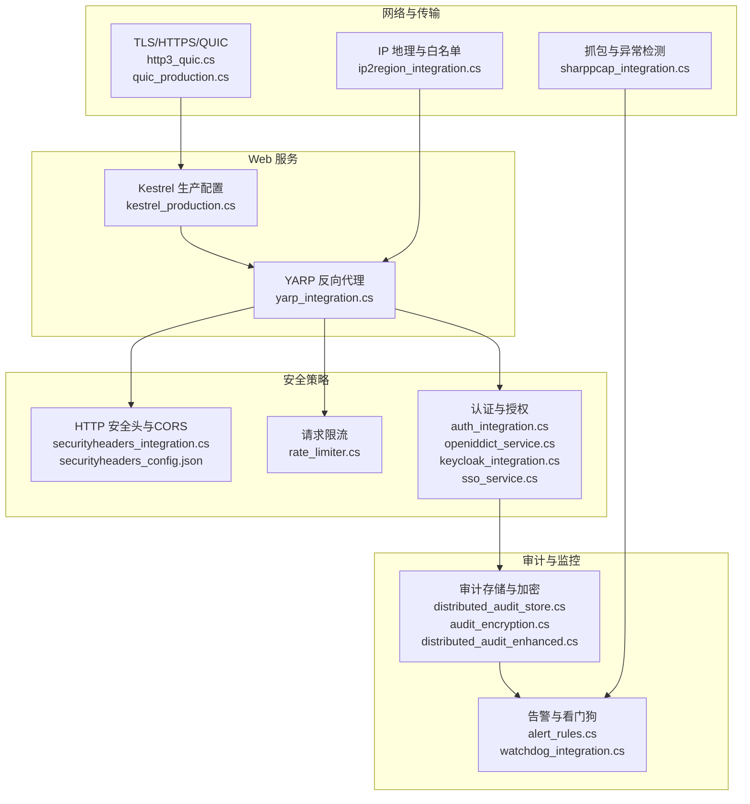
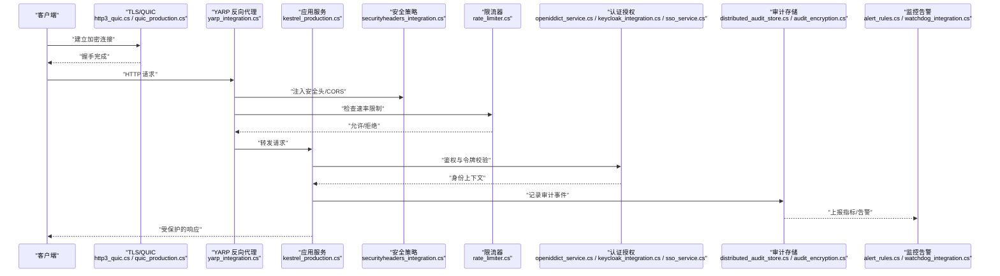
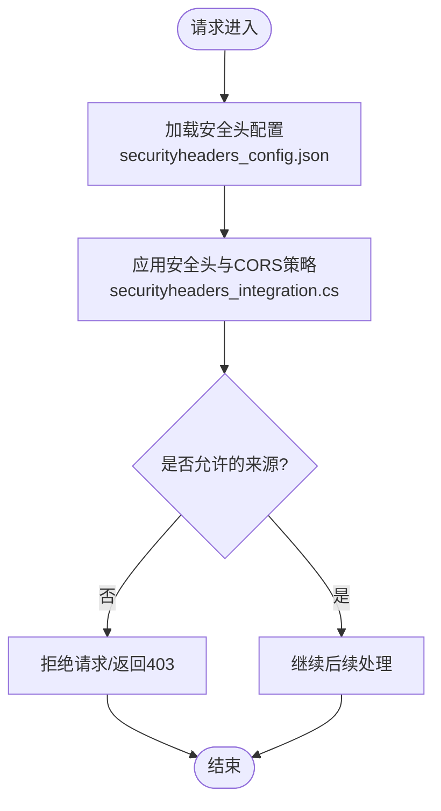
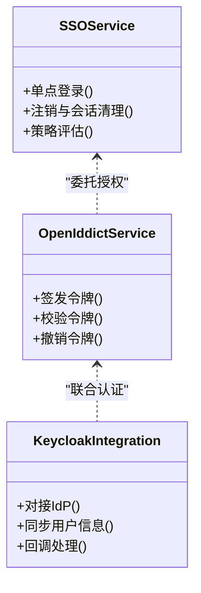
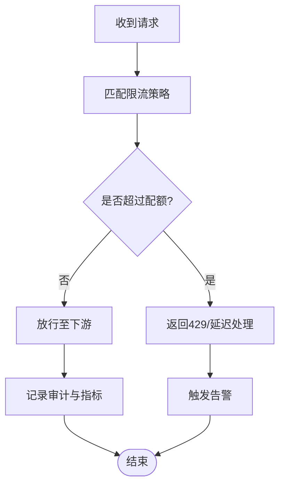
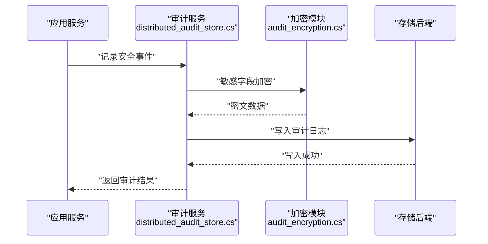
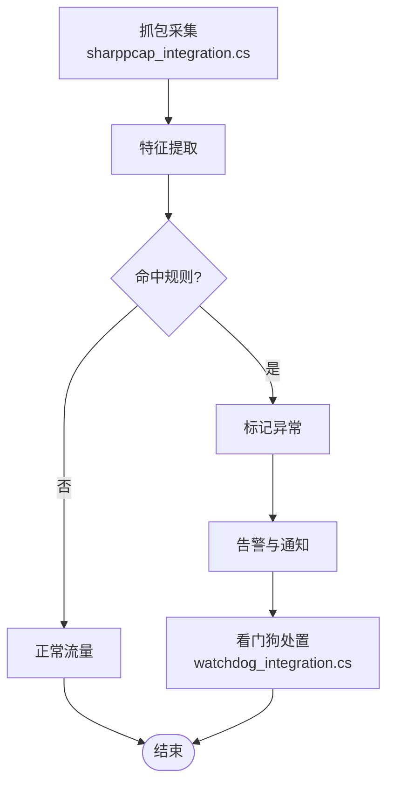
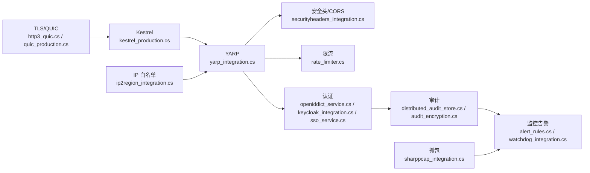

# 网络安全防护

<cite>
**本文引用的文件**   
- [securityheaders_config.json](file://securityheaders_config.json)
- [securityheaders_integration.cs](file://securityheaders_integration.cs)
- [rate_limiter.cs](file://rate_limiter.cs)
- [appsettings.json](file://appsettings.json)
- [kestrel_production.cs](file://kestrel_production.cs)
- [yarp_integration.cs](file://yarp_integration.cs)
- [yarp_circuit_breaker.cs](file://yarp_circuit_breaker.cs)
- [yarp_signature_middleware.cs](file://yarp_signature_middleware.cs)
- [auth_integration.cs](file://auth_integration.cs)
- [openiddict_service.cs](file://openiddict_service.cs)
- [keycloak_integration.cs](file://keycloak_integration.cs)
- [sso_service.cs](file://sso_service.cs)
- [audit_encryption.cs](file://audit_encryption.cs)
- [distributed_audit_store.cs](file://distributed_audit_store.cs)
- [distributed_audit_enhanced.cs](file://distributed_audit_enhanced.cs)
- [alert_rules.cs](file://alert_rules.cs)
- [watchdog_integration.cs](file://watchdog_integration.cs)
- [sharppcap_integration.cs](file://sharppcap_integration.cs)
- [ip2region_integration.cs](file://ip2region_integration.cs)
- [http3_quic.cs](file://http3_quic.cs)
- [quic_production.cs](file://quic_production.cs)
</cite>

## 目录
1. [简介](#简介)
2. [项目结构](#项目结构)
3. [核心组件](#核心组件)
4. [架构总览](#架构总览)
5. [详细组件分析](#详细组件分析)
6. [依赖关系分析](#依赖关系分析)
7. [性能考量](#性能考量)
8. [故障排查指南](#故障排查指南)
9. [结论](#结论)
10. [附录](#附录)

## 简介
本文件面向生产级网络安全防护，覆盖以下关键主题：
- HTTP 安全头配置、CORS 策略、CSRF 防护与会话安全管理
- HTTPS/TLS 配置、证书管理与中间人攻击防护
- 请求限流、IP 白名单、防火墙规则与安全审计日志
- 网络层安全防护与异常检测方案

文档以仓库中的实际实现为依据，提供架构图、流程图与调用序列图，帮助读者快速理解并落地安全能力。

## 项目结构
本项目将安全相关能力分散在多个示例/集成文件中，围绕 Web 服务器（Kestrel）、反向代理（YARP）、认证授权（OpenIddict/Keycloak/SSO）、安全头与 CORS、限流与审计等模块组织。下图给出与本主题相关的文件与职责概览。

图表来源
- [kestrel_production.cs](file://kestrel_production.cs)
- [yarp_integration.cs](file://yarp_integration.cs)
- [securityheaders_integration.cs](file://securityheaders_integration.cs)
- [securityheaders_config.json](file://securityheaders_config.json)
- [rate_limiter.cs](file://rate_limiter.cs)
- [auth_integration.cs](file://auth_integration.cs)
- [openiddict_service.cs](file://openiddict_service.cs)
- [keycloak_integration.cs](file://keycloak_integration.cs)
- [sso_service.cs](file://sso_service.cs)
- [distributed_audit_store.cs](file://distributed_audit_store.cs)
- [audit_encryption.cs](file://audit_encryption.cs)
- [distributed_audit_enhanced.cs](file://distributed_audit_enhanced.cs)
- [alert_rules.cs](file://alert_rules.cs)
- [watchdog_integration.cs](file://watchdog_integration.cs)
- [http3_quic.cs](file://http3_quic.cs)
- [quic_production.cs](file://quic_production.cs)
- [sharppcap_integration.cs](file://sharppcap_integration.cs)
- [ip2region_integration.cs](file://ip2region_integration.cs)

章节来源
- [securityheaders_config.json](file://securityheaders_config.json)
- [securityheaders_integration.cs](file://securityheaders_integration.cs)
- [rate_limiter.cs](file://rate_limiter.cs)
- [appsettings.json](file://appsettings.json)
- [kestrel_production.cs](file://kestrel_production.cs)
- [yarp_integration.cs](file://yarp_integration.cs)

## 核心组件
- HTTP 安全头与 CORS：通过配置文件集中管理响应头策略，并在应用启动时注入到管道中，确保 CSP、HSTS、X-Frame-Options 等生效。
- 请求限流：基于令牌桶或滑动窗口实现全局与按端点的速率限制，防止滥用与资源耗尽。
- 认证与授权：集成 OpenIddict/Keycloak/SSO，统一签发与校验 JWT/OIDC，支持多租户与细粒度权限。
- 审计与加密：对敏感操作进行不可抵赖的审计记录，结合加密存储与分布式持久化，满足合规要求。
- 网络与传输：启用 HTTPS/TLS 1.2+，可选 QUIC/HTTP3，强化证书链验证与抗中间人攻击。
- 异常检测与告警：基于流量特征与阈值规则触发告警，联动看门狗进行自愈或熔断。

章节来源
- [securityheaders_integration.cs](file://securityheaders_integration.cs)
- [rate_limiter.cs](file://rate_limiter.cs)
- [auth_integration.cs](file://auth_integration.cs)
- [openiddict_service.cs](file://openiddict_service.cs)
- [keycloak_integration.cs](file://keycloak_integration.cs)
- [sso_service.cs](file://sso_service.cs)
- [distributed_audit_store.cs](file://distributed_audit_store.cs)
- [audit_encryption.cs](file://audit_encryption.cs)
- [distributed_audit_enhanced.cs](file://distributed_audit_enhanced.cs)
- [http3_quic.cs](file://http3_quic.cs)
- [quic_production.cs](file://quic_production.cs)
- [sharppcap_integration.cs](file://sharppcap_integration.cs)
- [ip2region_integration.cs](file://ip2region_integration.cs)

## 架构总览
下图展示从客户端到后端服务的完整安全链路，包括传输加密、反向代理、安全头/CORS、限流、认证、审计与告警。

图表来源
- [http3_quic.cs](file://http3_quic.cs)
- [quic_production.cs](file://quic_production.cs)
- [yarp_integration.cs](file://yarp_integration.cs)
- [securityheaders_integration.cs](file://securityheaders_integration.cs)
- [rate_limiter.cs](file://rate_limiter.cs)
- [openiddict_service.cs](file://openiddict_service.cs)
- [keycloak_integration.cs](file://keycloak_integration.cs)
- [sso_service.cs](file://sso_service.cs)
- [distributed_audit_store.cs](file://distributed_audit_store.cs)
- [audit_encryption.cs](file://audit_encryption.cs)
- [alert_rules.cs](file://alert_rules.cs)
- [watchdog_integration.cs](file://watchdog_integration.cs)

## 详细组件分析

### HTTP 安全头与 CORS 策略
- 目标：通过响应头强制浏览器启用安全特性，限制跨域访问范围，降低 XSS、点击劫持等风险。
- 关键点：
  - 集中式配置：使用 JSON 定义默认安全头策略，便于环境差异化管理。
  - 管道注入：在应用启动时将安全头中间件注册到请求处理管线。
  - CORS 白名单：仅允许可信源与方法，避免任意站点跨域调用。
- 建议实践：
  - 开启 HSTS、CSP、X-Content-Type-Options、Referrer-Policy 等关键头。
  - 针对静态资源与 API 分别设置更严格的策略。
  - 定期审查与更新白名单，最小化暴露面。

图表来源
- [securityheaders_config.json](file://securityheaders_config.json)
- [securityheaders_integration.cs](file://securityheaders_integration.cs)

章节来源
- [securityheaders_config.json](file://securityheaders_config.json)
- [securityheaders_integration.cs](file://securityheaders_integration.cs)

### CSRF 防护机制
- 目标：防止跨站请求伪造攻击，确保状态变更请求来自合法页面。
- 关键点：
  - 双因子提交：表单中包含一次性 CSRF Token，服务端校验来源与令牌一致性。
  - SameSite Cookie：配合 SameSite=Lax/Strict 与 Secure 标志，阻断第三方站点携带 Cookie 发起的请求。
  - 自定义 Header：对 AJAX 请求要求携带自定义头部，服务端严格校验。
- 建议实践：
  - 所有写操作接口强制校验 CSRF。
  - 对无状态 API 优先采用无 Cookie 的令牌校验方式。
  - 对敏感操作增加二次确认或验证码。

章节来源
- [auth_integration.cs](file://auth_integration.cs)

### 会话安全管理
- 目标：保护用户会话不被窃取、篡改或重放。
- 关键点：
  - 会话标识：使用强随机 ID，设置 HttpOnly、Secure、SameSite 属性。
  - 超时与刷新：合理设置绝对过期与滑动过期，避免长期有效会话。
  - 绑定上下文：将会话与用户代理指纹、IP 段等进行弱绑定，提升安全性。
- 建议实践：
  - 登录成功后重新生成会话 ID。
  - 登出后立即失效并清理服务端会话数据。
  - 对高敏操作要求重新认证。

章节来源
- [auth_integration.cs](file://auth_integration.cs)
- [openiddict_service.cs](file://openiddict_service.cs)

### 认证与授权（OpenIddict/Keycloak/SSO）
- 目标：统一身份认证与授权，支持 OIDC/JWT、外部 IdP 集成与细粒度权限控制。
- 关键点：
  - 令牌签发：使用 OpenIddict 或 Keycloak 作为授权服务器，签发短期有效的 JWT。
  - 令牌校验：API 网关或服务内部校验签名、有效期与受众。
  - 权限模型：基于角色/属性的访问控制（ABAC/RBAC），结合声明式策略。
- 建议实践：
  - 最小权限原则，按需授予作用域。
  - 启用令牌绑定与设备指纹增强安全性。
  - 定期轮换密钥与证书。

图表来源
- [openiddict_service.cs](file://openiddict_service.cs)
- [keycloak_integration.cs](file://keycloak_integration.cs)
- [sso_service.cs](file://sso_service.cs)

章节来源
- [auth_integration.cs](file://auth_integration.cs)
- [openiddict_service.cs](file://openiddict_service.cs)
- [keycloak_integration.cs](file://keycloak_integration.cs)
- [sso_service.cs](file://sso_service.cs)

### 请求限流与防滥用
- 目标：保护后端免受突发流量与恶意扫描影响，保障稳定性。
- 关键点：
  - 算法选择：令牌桶/滑动窗口，支持全局与按端点维度限流。
  - 分级策略：区分匿名与已认证用户，设置不同配额。
  - 动态调整：根据系统负载与错误率动态收紧或放宽限制。
- 建议实践：
  - 对登录、支付等敏感接口设置更严格的限制。
  - 结合 IP 白名单与黑名单进行精细化控制。
  - 限流失败返回标准错误码，便于前端重试与降级。

图表来源
- [rate_limiter.cs](file://rate_limiter.cs)

章节来源
- [rate_limiter.cs](file://rate_limiter.cs)

### HTTPS/TLS 与证书管理
- 目标：确保传输层加密与完整性，防范窃听与中间人攻击。
- 关键点：
  - TLS 版本：禁用旧版本（如 TLS1.0/1.1），启用 TLS1.2/1.3。
  - 密码套件：优先使用 AEAD 套件，禁用弱算法。
  - 证书链：正确配置根证书与中间证书，启用 OCSP/CRL 检查。
  - HSTS：强制 HTTPS，设置合适的 Max-Age 与 includeSubDomains。
- 建议实践：
  - 使用自动化证书管理（如 ACME/Let’s Encrypt）。
  - 定期巡检证书有效期与链完整性。
  - 对内部服务启用双向 TLS（mTLS）。

章节来源
- [kestrel_production.cs](file://kestrel_production.cs)
- [http3_quic.cs](file://http3_quic.cs)
- [quic_production.cs](file://quic_production.cs)

### 中间件与反向代理安全（YARP）
- 目标：在入口层实施统一的安全策略与路由控制。
- 关键点：
  - 签名校验：对上游请求进行签名验证，防止篡改。
  - 熔断与重试：结合断路器模式提高可用性。
  - 请求过滤：拦截非法方法、路径与头部。
- 建议实践：
  - 将安全头、CORS、限流放在 YARP 层统一处理。
  - 对敏感接口启用额外校验（如时间戳、nonce）。

章节来源
- [yarp_integration.cs](file://yarp_integration.cs)
- [yarp_circuit_breaker.cs](file://yarp_circuit_breaker.cs)
- [yarp_signature_middleware.cs](file://yarp_signature_middleware.cs)

### 安全审计与加密存储
- 目标：记录关键安全事件，满足合规与可追溯性。
- 关键点：
  - 审计内容：登录、授权、数据访问、配置变更等。
  - 加密存储：对敏感字段进行加密，防止泄露。
  - 分布式持久化：保证高可用与一致性。
- 建议实践：
  - 审计日志脱敏，避免明文敏感信息。
  - 设置保留策略与归档机制。
  - 提供查询与分析接口，便于取证与排障。

图表来源
- [distributed_audit_store.cs](file://distributed_audit_store.cs)
- [audit_encryption.cs](file://audit_encryption.cs)
- [distributed_audit_enhanced.cs](file://distributed_audit_enhanced.cs)

章节来源
- [distributed_audit_store.cs](file://distributed_audit_store.cs)
- [audit_encryption.cs](file://audit_encryption.cs)
- [distributed_audit_enhanced.cs](file://distributed_audit_enhanced.cs)

### 网络层防护与异常检测
- 目标：在网络层识别与阻断异常流量，提前发现潜在攻击。
- 关键点：
  - 抓包分析：捕获网络报文，提取特征进行分析。
  - 规则引擎：基于阈值与模式匹配触发告警。
  - 看门狗：自动执行隔离、熔断或重启等恢复动作。
- 建议实践：
  - 结合 IP 地理信息与白名单进行访问控制。
  - 对异常行为进行画像与溯源。
  - 与 SIEM/SOAR 平台联动，形成闭环。

图表来源
- [sharppcap_integration.cs](file://sharppcap_integration.cs)
- [alert_rules.cs](file://alert_rules.cs)
- [watchdog_integration.cs](file://watchdog_integration.cs)

章节来源
- [sharppcap_integration.cs](file://sharppcap_integration.cs)
- [alert_rules.cs](file://alert_rules.cs)
- [watchdog_integration.cs](file://watchdog_integration.cs)

### IP 白名单与访问控制
- 目标：限制来源 IP，减少攻击面。
- 关键点：
  - 白名单维护：集中管理可信 IP 段，支持热更新。
  - 地理定位：结合 IP2Region 进行地域策略。
  - 动态封禁：对高频失败或异常行为临时封禁。
- 建议实践：
  - 对管理后台与敏感接口启用严格白名单。
  - 对外部合作伙伴提供受限访问通道。

章节来源
- [ip2region_integration.cs](file://ip2region_integration.cs)

## 依赖关系分析
下图展示各安全组件之间的依赖与交互关系，突出关键耦合点与扩展位置。

图表来源
- [kestrel_production.cs](file://kestrel_production.cs)
- [yarp_integration.cs](file://yarp_integration.cs)
- [securityheaders_integration.cs](file://securityheaders_integration.cs)
- [rate_limiter.cs](file://rate_limiter.cs)
- [openiddict_service.cs](file://openiddict_service.cs)
- [keycloak_integration.cs](file://keycloak_integration.cs)
- [sso_service.cs](file://sso_service.cs)
- [distributed_audit_store.cs](file://distributed_audit_store.cs)
- [audit_encryption.cs](file://audit_encryption.cs)
- [alert_rules.cs](file://alert_rules.cs)
- [watchdog_integration.cs](file://watchdog_integration.cs)
- [http3_quic.cs](file://http3_quic.cs)
- [quic_production.cs](file://quic_production.cs)
- [sharppcap_integration.cs](file://sharppcap_integration.cs)
- [ip2region_integration.cs](file://ip2region_integration.cs)

章节来源
- [yarp_integration.cs](file://yarp_integration.cs)
- [securityheaders_integration.cs](file://securityheaders_integration.cs)
- [rate_limiter.cs](file://rate_limiter.cs)
- [auth_integration.cs](file://auth_integration.cs)
- [openiddict_service.cs](file://openiddict_service.cs)
- [keycloak_integration.cs](file://keycloak_integration.cs)
- [sso_service.cs](file://sso_service.cs)
- [distributed_audit_store.cs](file://distributed_audit_store.cs)
- [audit_encryption.cs](file://audit_encryption.cs)
- [distributed_audit_enhanced.cs](file://distributed_audit_enhanced.cs)
- [alert_rules.cs](file://alert_rules.cs)
- [watchdog_integration.cs](file://watchdog_integration.cs)
- [http3_quic.cs](file://http3_quic.cs)
- [quic_production.cs](file://quic_production.cs)
- [sharppcap_integration.cs](file://sharppcap_integration.cs)
- [ip2region_integration.cs](file://ip2region_integration.cs)

## 性能考量
- 限流与熔断：在高并发场景下，优先在网关层限流与熔断，减轻后端压力。
- 异步审计：审计写入采用异步与批处理，避免阻塞主流程。
- 缓存策略：对频繁读取的配置（如安全头、CORS、白名单）进行内存缓存。
- TLS 优化：启用会话复用与 0-RTT（谨慎使用），减少握手开销。
- 资源隔离：对敏感接口与批量任务进行线程池与队列隔离。

## 故障排查指南
- 常见问题：
  - 安全头未生效：检查中间件注册顺序与配置加载。
  - CORS 被浏览器拦截：核对 Origin、方法与头部白名单。
  - 限流误伤：查看配额策略与用户维度区分。
  - 认证失败：检查令牌签名、有效期与受众。
  - 审计缺失：确认异步写入与存储连通性。
- 诊断步骤：
  - 启用详细日志与追踪，定位问题阶段。
  - 使用抓包工具验证 TLS 握手与报文完整性。
  - 检查告警规则与阈值，排除误报。
  - 回滚最近变更，逐步复现问题。

章节来源
- [alert_rules.cs](file://alert_rules.cs)
- [watchdog_integration.cs](file://watchdog_integration.cs)
- [sharppcap_integration.cs](file://sharppcap_integration.cs)

## 结论
通过在本项目中系统化地部署 HTTP 安全头、CORS、CSRF、会话管理、HTTPS/TLS、限流、审计与异常检测，可以显著提升整体网络安全水平。建议持续迭代策略、完善监控与演练，确保在真实威胁面前具备足够的韧性与可观测性。

## 附录
- 最佳实践清单：
  - 始终启用 HTTPS 与强密码套件。
  - 最小化跨域与外部依赖。
  - 对所有写操作进行 CSRF 校验。
  - 审计日志脱敏与加密存储。
  - 定期演练与渗透测试。