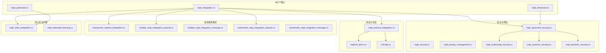
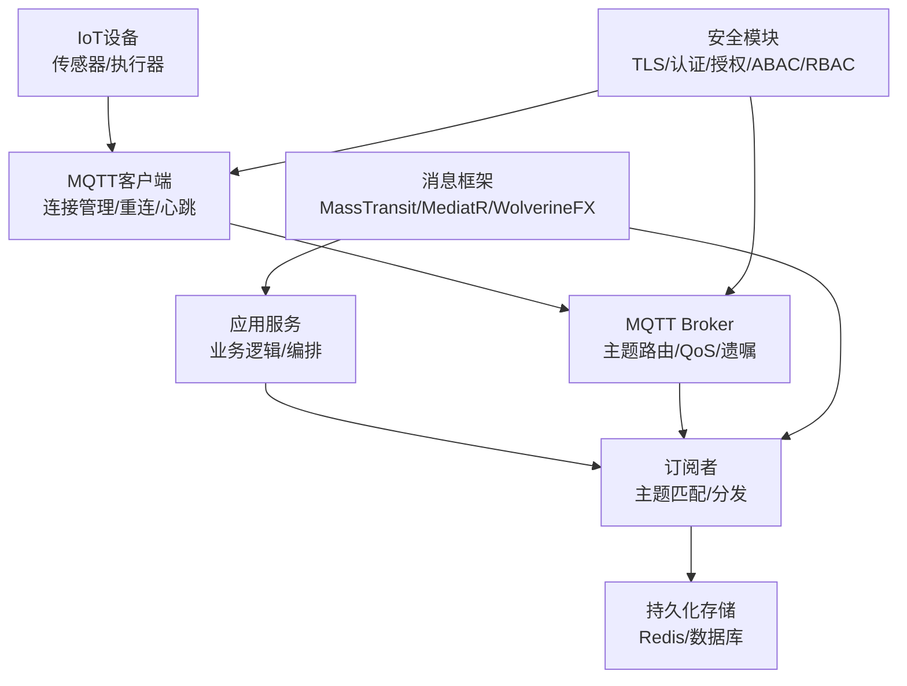
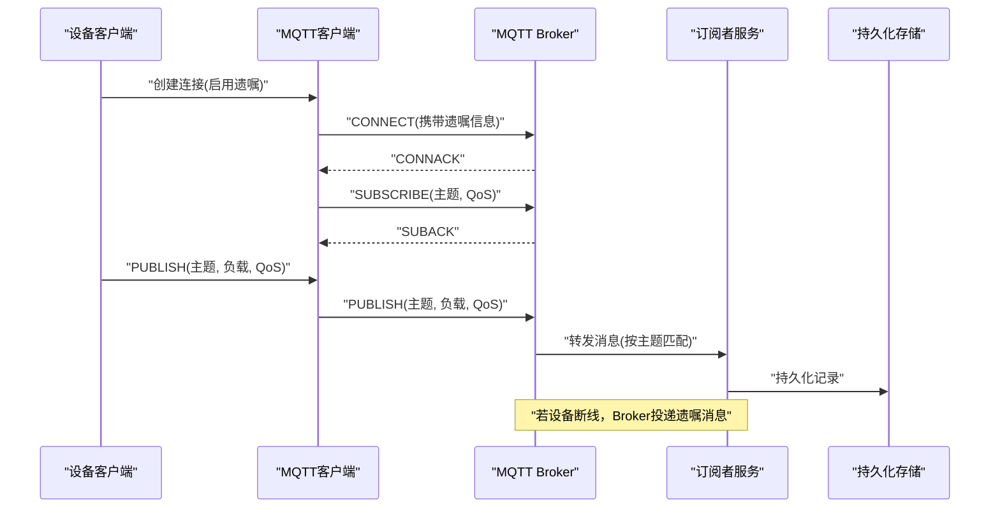
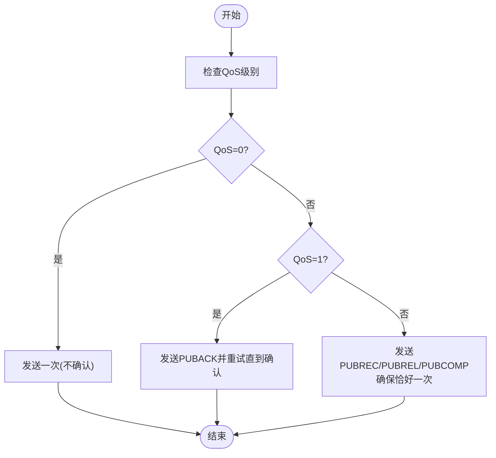
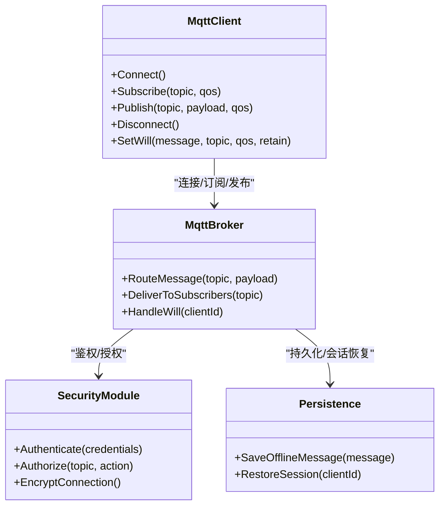
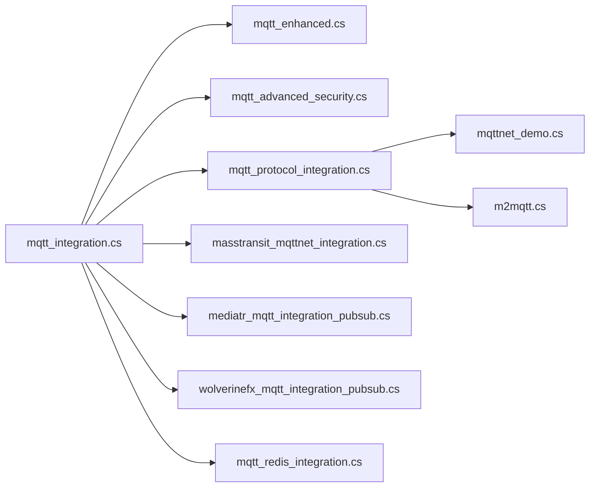

# MQTT消息协议

<cite>
**本文引用的文件**   
- [mqtt_integration.cs](file://mqtt_integration.cs)
- [mqtt_enhanced.cs](file://mqtt_enhanced.cs)
- [mqtt_optimized.cs](file://mqtt_optimized.cs)
- [mqtt_advanced_security.cs](file://mqtt_advanced_security.cs)
- [mqtt_security.cs](file://mqtt_security.cs)
- [mqttnet_demo.cs](file://mqttnet_demo.cs)
- [m2mqtt.cs](file://m2mqtt.cs)
- [masstransit_mqttnet_integration.cs](file://masstransit_mqttnet_integration.cs)
- [mediatr_mqtt_integration_pubsub.cs](file://mediatr_mqtt_integration_pubsub.cs)
- [mediatr_mqtt_integration_message.cs](file://mediatr_mqtt_integration_message.cs)
- [wolverinefx_mqtt_integration_pubsub.cs](file://wolverinefx_mqtt_integration_pubsub.cs)
- [wolverinefx_mqtt_integration_message.cs](file://wolverinefx_mqtt_integration_message.cs)
- [mqtt_redis_integration.cs](file://mqtt_redis_integration.cs)
- [mqtt_protocol_integration.cs](file://mqtt_protocol_integration.cs)
- [mqtt_privacy_management.cs](file://mqtt_privacy_management.cs)
- [mqtt_multimodal_security.cs](file://mqtt_multimodal_security.cs)
- [mqtt_quantum_security.cs](file://mqtt_quantum_security.cs)
- [mqtt_biometric_security.cs](file://mqtt_biometric_security.cs)
- [mqtt_federated_learning.cs](file://mqtt_federated_learning.cs)
</cite>

## 目录
1. [简介](#简介)
2. [项目结构](#项目结构)
3. [核心组件](#核心组件)
4. [架构总览](#架构总览)
5. [详细组件分析](#详细组件分析)
6. [依赖关系分析](#依赖关系分析)
7. [性能考量](#性能考量)
8. [故障排查指南](#故障排查指南)
9. [结论](#结论)
10. [附录](#附录)

## 简介
本文件面向MQTT消息协议的工程化落地，结合仓库中的MQTT相关实现，系统化阐述发布订阅模式、主题层次结构、QoS级别与遗嘱消息等核心概念；并覆盖Broker集成、客户端连接管理、消息路由与持久化存储；同时给出安全性配置（TLS加密、认证授权、访问控制）、IoT设备集成最佳实践（设备注册、状态同步）、以及集群部署（负载均衡与高可用）的参考方案。文档以“从概念到实现”的方式组织，便于不同技术背景的读者快速掌握与实践。

## 项目结构
仓库中包含大量MQTT相关的示例与集成代码，主要分布在根目录下的若干文件中，涵盖基础集成、增强能力、安全加固、协议对接、与消息总线/框架的集成（如MassTransit、MediatR、WolverineFX），以及与Redis等持久化组件的集成。整体结构以“按功能域划分”的方式组织：
- 基础与优化：mqtt_integration.cs、mqtt_enhanced.cs、mqtt_optimized.cs
- 安全与隐私：mqtt_advanced_security.cs、mqtt_security.cs、mqtt_privacy_management.cs、mqtt_multimodal_security.cs、mqtt_quantum_security.cs、mqtt_biometric_security.cs
- 协议与生态：mqtt_protocol_integration.cs、mqttnet_demo.cs、m2mqtt.cs
- 与消息框架集成：masstransit_mqttnet_integration.cs、mediatr_mqtt_integration_pubsub.cs、mediatr_mqtt_integration_message.cs、wolverinefx_mqtt_integration_pubsub.cs、wolverinefx_mqtt_integration_message.cs
- 持久化与扩展：mqtt_redis_integration.cs、mqtt_federated_learning.cs

图表来源
- [mqtt_integration.cs:1-200](file://mqtt_integration.cs#L1-L200)
- [mqtt_enhanced.cs:1-200](file://mqtt_enhanced.cs#L1-L200)
- [mqtt_optimized.cs:1-200](file://mqtt_optimized.cs#L1-L200)
- [mqtt_advanced_security.cs:1-200](file://mqtt_advanced_security.cs#L1-L200)
- [mqtt_security.cs:1-200](file://mqtt_security.cs#L1-L200)
- [mqtt_privacy_management.cs:1-200](file://mqtt_privacy_management.cs#L1-L200)
- [mqtt_multimodal_security.cs:1-200](file://mqtt_multimodal_security.cs#L1-L200)
- [mqtt_quantum_security.cs:1-200](file://mqtt_quantum_security.cs#L1-L200)
- [mqtt_biometric_security.cs:1-200](file://mqtt_biometric_security.cs#L1-L200)
- [mqtt_protocol_integration.cs:1-200](file://mqtt_protocol_integration.cs#L1-L200)
- [mqttnet_demo.cs:1-200](file://mqttnet_demo.cs#L1-L200)
- [m2mqtt.cs:1-200](file://m2mqtt.cs#L1-L200)
- [masstransit_mqttnet_integration.cs:1-200](file://masstransit_mqttnet_integration.cs#L1-L200)
- [mediatr_mqtt_integration_pubsub.cs:1-200](file://mediatr_mqtt_integration_pubsub.cs#L1-L200)
- [mediatr_mqtt_integration_message.cs:1-200](file://mediatr_mqtt_integration_message.cs#L1-L200)
- [wolverinefx_mqtt_integration_pubsub.cs:1-200](file://wolverinefx_mqtt_integration_pubsub.cs#L1-L200)
- [wolverinefx_mqtt_integration_message.cs:1-200](file://wolverinefx_mqtt_integration_message.cs#L1-L200)
- [mqtt_redis_integration.cs:1-200](file://mqtt_redis_integration.cs#L1-L200)
- [mqtt_federated_learning.cs:1-200](file://mqtt_federated_learning.cs#L1-L200)

章节来源
- [mqtt_integration.cs:1-200](file://mqtt_integration.cs#L1-L200)
- [mqtt_enhanced.cs:1-200](file://mqtt_enhanced.cs#L1-L200)
- [mqtt_optimized.cs:1-200](file://mqtt_optimized.cs#L1-L200)

## 核心组件
- 基础集成与增强
  - 提供MQTT客户端连接、订阅/发布、重连、心跳、会话管理等基础能力，并在增强版本中补充了批量处理、背压、重试策略与指标采集。
- 安全与隐私
  - 覆盖TLS配置、双向认证、基于角色的访问控制（RBAC）、属性基访问控制（ABAC）、隐私数据脱敏、多模态安全（文本/图像/音频等）、量子安全与生物特征识别等高级特性。
- 协议与生态对接
  - 对接MQTT.NET与M2Mqtt等主流库，统一抽象出协议层接口，屏蔽底层差异，便于替换与升级。
- 与消息框架集成
  - 通过MassTransit、MediatR、WolverineFX将MQTT事件纳入领域事件总线或工作流编排，提升可观测性与可维护性。
- 持久化与扩展
  - 与Redis等缓存/消息中间件集成，实现离线消息持久化、跨节点会话共享与水平扩展。

章节来源
- [mqtt_integration.cs:1-200](file://mqtt_integration.cs#L1-L200)
- [mqtt_enhanced.cs:1-200](file://mqtt_enhanced.cs#L1-L200)
- [mqtt_security.cs:1-200](file://mqtt_security.cs#L1-L200)
- [mqtt_advanced_security.cs:1-200](file://mqtt_advanced_security.cs#L1-L200)
- [mqtt_protocol_integration.cs:1-200](file://mqtt_protocol_integration.cs#L1-L200)
- [masstransit_mqttnet_integration.cs:1-200](file://masstransit_mqttnet_integration.cs#L1-L200)
- [mediatr_mqtt_integration_pubsub.cs:1-200](file://mediatr_mqtt_integration_pubsub.cs#L1-L200)
- [wolverinefx_mqtt_integration_pubsub.cs:1-200](file://wolverinefx_mqtt_integration_pubsub.cs#L1-L200)
- [mqtt_redis_integration.cs:1-200](file://mqtt_redis_integration.cs#L1-L200)

## 架构总览
下图展示了MQTT在系统中的总体架构：设备端通过MQTT客户端连接Broker，应用服务通过订阅主题消费消息，并通过持久化组件保证可靠性；安全模块贯穿连接建立、鉴权、授权与传输加密；消息框架用于将MQTT事件融入更广泛的分布式系统。

图表来源
- [mqtt_integration.cs:1-200](file://mqtt_integration.cs#L1-L200)
- [mqtt_enhanced.cs:1-200](file://mqtt_enhanced.cs#L1-L200)
- [mqtt_advanced_security.cs:1-200](file://mqtt_advanced_security.cs#L1-L200)
- [masstransit_mqttnet_integration.cs:1-200](file://masstransit_mqttnet_integration.cs#L1-L200)
- [mediatr_mqtt_integration_pubsub.cs:1-200](file://mediatr_mqtt_integration_pubsub.cs#L1-L200)
- [wolverinefx_mqtt_integration_pubsub.cs:1-200](file://wolverinefx_mqtt_integration_pubsub.cs#L1-L200)
- [mqtt_redis_integration.cs:1-200](file://mqtt_redis_integration.cs#L1-L200)

## 详细组件分析

### MQTT核心概念与实现要点
- 发布订阅模式
  - 发布者向主题发送消息，订阅者根据主题过滤接收；Broker负责主题匹配与分发。
- 主题层次结构
  - 使用“/”分隔层级，支持通配符“+”（单级）与“#”（多级）进行灵活订阅。
- QoS级别
  - QoS 0（最多一次）、QoS 1（至少一次）、QoS 2（恰好一次），需权衡可靠性与吞吐。
- 遗嘱消息（Last Will and Testament）
  - 客户端断开时由Broker自动投递预设消息，常用于设备在线状态广播。

章节来源
- [mqtt_integration.cs:1-200](file://mqtt_integration.cs#L1-L200)
- [mqtt_enhanced.cs:1-200](file://mqtt_enhanced.cs#L1-L200)

### 客户端连接管理与重连策略
- 连接生命周期
  - 建立连接、保持心跳、异常检测、自动重连、会话恢复。
- 重连与退避
  - 指数退避、抖动、最大重试次数、熔断保护。
- 会话与会话清理
  - CleanSession标志、离线消息队列、断线后重放。

章节来源
- [mqtt_integration.cs:1-200](file://mqtt_integration.cs#L1-L200)
- [mqtt_enhanced.cs:1-200](file://mqtt_enhanced.cs#L1-L200)

### 消息路由与主题匹配
- 主题匹配算法
  - 前缀匹配、通配符解析、索引优化（Trie/倒排）。
- 路由规则
  - 基于租户/设备类型/区域的多维路由，支持动态规则注入。
- 分流与聚合
  - 多订阅者并行处理、聚合响应、去重与幂等。

章节来源
- [mqtt_protocol_integration.cs:1-200](file://mqtt_protocol_integration.cs#L1-L200)
- [mqtt_enhanced.cs:1-200](file://mqtt_enhanced.cs#L1-L200)

### 持久化存储与离线消息
- 离线消息存储
  - 使用Redis或数据库缓存未消费消息，支持过期与清理策略。
- 会话持久化
  - 订阅关系、QoS状态、未确认消息列表持久化。
- 一致性保障
  - 事务边界、幂等写入、补偿机制。

章节来源
- [mqtt_redis_integration.cs:1-200](file://mqtt_redis_integration.cs#L1-L200)
- [mqtt_enhanced.cs:1-200](file://mqtt_enhanced.cs#L1-L200)

### 安全性配置：TLS、认证授权与访问控制
- TLS加密
  - 服务端证书、客户端证书、CA链校验、SNI支持。
- 认证
  - 用户名/密码、Token（JWT/OAuth2）、证书双向认证。
- 授权与访问控制
  - RBAC（角色）、ABAC（属性）、主题级ACL、IP白名单。
- 隐私与安全增强
  - 数据脱敏、多模态内容安全、量子安全算法、生物特征识别。

章节来源
- [mqtt_security.cs:1-200](file://mqtt_security.cs#L1-L200)
- [mqtt_advanced_security.cs:1-200](file://mqtt_advanced_security.cs#L1-L200)
- [mqtt_privacy_management.cs:1-200](file://mqtt_privacy_management.cs#L1-L200)
- [mqtt_multimodal_security.cs:1-200](file://mqtt_multimodal_security.cs#L1-L200)
- [mqtt_quantum_security.cs:1-200](file://mqtt_quantum_security.cs#L1-L200)
- [mqtt_biometric_security.cs:1-200](file://mqtt_biometric_security.cs#L1-L200)

### 与消息框架集成（MassTransit、MediatR、WolverineFX）
- MassTransit
  - 将MQTT作为传输通道，结合Endpoint、Consumer模型，简化异步通信。
- MediatR
  - 通过管道与中间件将MQTT事件映射为领域事件，统一处理流程。
- WolverineFX
  - 与工作流编排结合，实现复杂业务流程的状态机驱动。

章节来源
- [masstransit_mqttnet_integration.cs:1-200](file://masstransit_mqttnet_integration.cs#L1-L200)
- [mediatr_mqtt_integration_pubsub.cs:1-200](file://mediatr_mqtt_integration_pubsub.cs#L1-L200)
- [mediatr_mqtt_integration_message.cs:1-200](file://mediatr_mqtt_integration_message.cs#L1-L200)
- [wolverinefx_mqtt_integration_pubsub.cs:1-200](file://wolverinefx_mqtt_integration_pubsub.cs#L1-L200)
- [wolverinefx_mqtt_integration_message.cs:1-200](file://wolverinefx_mqtt_integration_message.cs#L1-L200)

### IoT设备集成最佳实践
- 设备注册与管理
  - 设备元数据、证书绑定、分组与标签、生命周期管理。
- 状态同步机制
  - 影子设备（Device Shadow）、增量更新、冲突解决。
- 边缘计算与本地缓存
  - 断网续传、本地决策、云端协同。

章节来源
- [mqtt_integration.cs:1-200](file://mqtt_integration.cs#L1-L200)
- [mqtt_enhanced.cs:1-200](file://mqtt_enhanced.cs#L1-L200)

### 集群部署、负载均衡与高可用
- Broker集群
  - 主从复制、分片、跨机房容灾。
- 负载均衡
  - 网关层LB、DNS轮询、客户端侧选择策略。
- 高可用配置
  - 健康检查、故障转移、限流与降级、监控告警。

章节来源
- [mqtt_protocol_integration.cs:1-200](file://mqtt_protocol_integration.cs#L1-L200)
- [mqtt_enhanced.cs:1-200](file://mqtt_enhanced.cs#L1-L200)

### 序列图：MQTT发布订阅流程（含QoS与遗嘱）

图表来源
- [mqtt_integration.cs:1-200](file://mqtt_integration.cs#L1-L200)
- [mqtt_enhanced.cs:1-200](file://mqtt_enhanced.cs#L1-L200)
- [mqtt_redis_integration.cs:1-200](file://mqtt_redis_integration.cs#L1-L200)

### 流程图：QoS处理与重试策略

图表来源
- [mqtt_integration.cs:1-200](file://mqtt_integration.cs#L1-L200)
- [mqtt_enhanced.cs:1-200](file://mqtt_enhanced.cs#L1-L200)

### 类图：MQTT客户端与服务交互

图表来源
- [mqtt_integration.cs:1-200](file://mqtt_integration.cs#L1-L200)
- [mqtt_advanced_security.cs:1-200](file://mqtt_advanced_security.cs#L1-L200)
- [mqtt_redis_integration.cs:1-200](file://mqtt_redis_integration.cs#L1-L200)

## 依赖关系分析
- 内部依赖
  - mqtt_integration.cs为基础入口，被增强与安全模块复用。
  - mqtt_protocol_integration.cs提供协议抽象，供mqttnet_demo.cs与m2mqtt.cs适配。
  - 消息框架集成文件依赖基础MQTT能力，向上暴露领域事件与工作流接口。
- 外部依赖
  - Redis用于持久化与会话共享。
  - MassTransit/MediatR/WolverineFX用于事件总线与工作流编排。
  - TLS/证书库用于加密与认证。

图表来源
- [mqtt_integration.cs:1-200](file://mqtt_integration.cs#L1-L200)
- [mqtt_enhanced.cs:1-200](file://mqtt_enhanced.cs#L1-L200)
- [mqtt_advanced_security.cs:1-200](file://mqtt_advanced_security.cs#L1-L200)
- [mqtt_protocol_integration.cs:1-200](file://mqtt_protocol_integration.cs#L1-L200)
- [mqttnet_demo.cs:1-200](file://mqttnet_demo.cs#L1-L200)
- [m2mqtt.cs:1-200](file://m2mqtt.cs#L1-L200)
- [masstransit_mqttnet_integration.cs:1-200](file://masstransit_mqttnet_integration.cs#L1-L200)
- [mediatr_mqtt_integration_pubsub.cs:1-200](file://mediatr_mqtt_integration_pubsub.cs#L1-L200)
- [wolverinefx_mqtt_integration_pubsub.cs:1-200](file://wolverinefx_mqtt_integration_pubsub.cs#L1-L200)
- [mqtt_redis_integration.cs:1-200](file://mqtt_redis_integration.cs#L1-L200)

章节来源
- [mqtt_integration.cs:1-200](file://mqtt_integration.cs#L1-L200)
- [mqtt_protocol_integration.cs:1-200](file://mqtt_protocol_integration.cs#L1-L200)
- [masstransit_mqttnet_integration.cs:1-200](file://masstransit_mqttnet_integration.cs#L1-L200)
- [mediatr_mqtt_integration_pubsub.cs:1-200](file://mediatr_mqtt_integration_pubsub.cs#L1-L200)
- [wolverinefx_mqtt_integration_pubsub.cs:1-200](file://wolverinefx_mqtt_integration_pubsub.cs#L1-L200)
- [mqtt_redis_integration.cs:1-200](file://mqtt_redis_integration.cs#L1-L200)

## 性能考量
- 连接池与并发
  - 合理设置连接池大小、线程池上限，避免资源争用。
- 批处理与背压
  - 批量发布、消费者限速、丢弃策略与死信队列。
- 序列化与压缩
  - 选择高效序列化格式（如MessagePack/Protobuf），必要时启用压缩。
- 缓存与索引
  - 主题索引优化、热点数据缓存、减少磁盘IO。
- 监控与可观测性
  - 指标采集（延迟、吞吐、错误率）、链路追踪、日志采样。

[本节为通用指导，无需特定文件引用]

## 故障排查指南
- 连接问题
  - 检查TLS证书、网络连通性、防火墙与代理设置。
- 订阅失败
  - 验证主题权限、通配符语法、订阅者是否存活。
- 消息丢失或重复
  - 核对QoS级别、幂等处理、持久化落盘与重试策略。
- 性能瓶颈
  - 定位慢消费者、CPU/内存占用、GC压力、磁盘IO。
- 安全事件
  - 审计认证失败、越权访问、异常流量与入侵检测。

章节来源
- [mqtt_security.cs:1-200](file://mqtt_security.cs#L1-L200)
- [mqtt_advanced_security.cs:1-200](file://mqtt_advanced_security.cs#L1-L200)
- [mqtt_enhanced.cs:1-200](file://mqtt_enhanced.cs#L1-L200)

## 结论
本文件基于仓库中的MQTT相关实现，系统梳理了MQTT协议的核心概念与工程化实践，涵盖发布订阅、主题与QoS、遗嘱消息、Broker集成、客户端管理、消息路由与持久化、安全与隐私、IoT设备集成与集群部署。建议在实际项目中结合业务场景选择合适的QoS与持久化策略，强化安全与可观测性，并通过消息框架提升系统的可维护性与扩展性。

[本节为总结性内容，无需特定文件引用]

## 附录
- 术语表
  - Broker：消息中心，负责主题路由与消息分发。
  - QoS：服务质量等级，决定消息传递的可靠性。
  - 遗嘱消息：客户端断线时由Broker自动投递的消息。
  - 主题：消息的命名空间，支持层级与通配符。
- 参考实现路径
  - 基础集成：[mqtt_integration.cs:1-200](file://mqtt_integration.cs#L1-L200)
  - 增强能力：[mqtt_enhanced.cs:1-200](file://mqtt_enhanced.cs#L1-L200)
  - 安全加固：[mqtt_advanced_security.cs:1-200](file://mqtt_advanced_security.cs#L1-L200)
  - 协议对接：[mqtt_protocol_integration.cs:1-200](file://mqtt_protocol_integration.cs#L1-L200)
  - 消息框架：[masstransit_mqttnet_integration.cs:1-200](file://masstransit_mqttnet_integration.cs#L1-L200)、[mediatr_mqtt_integration_pubsub.cs:1-200](file://mediatr_mqtt_integration_pubsub.cs#L1-L200)、[wolverinefx_mqtt_integration_pubsub.cs:1-200](file://wolverinefx_mqtt_integration_pubsub.cs#L1-L200)
  - 持久化：[mqtt_redis_integration.cs:1-200](file://mqtt_redis_integration.cs#L1-L200)

[本节为附录内容，无需特定文件引用]