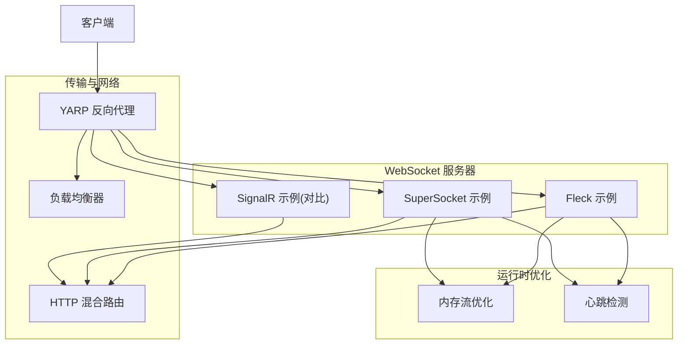
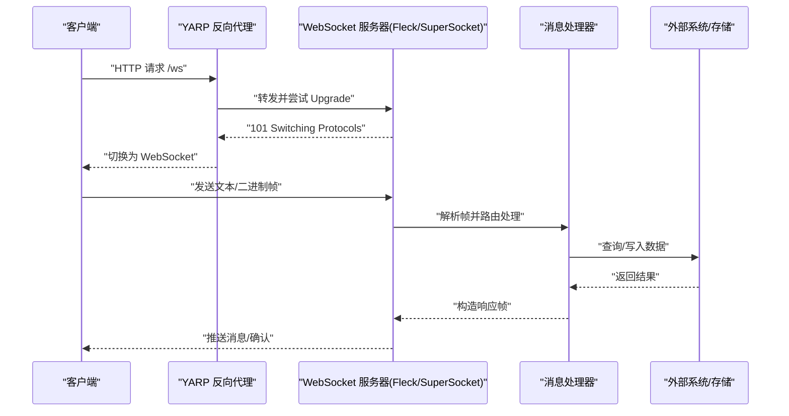
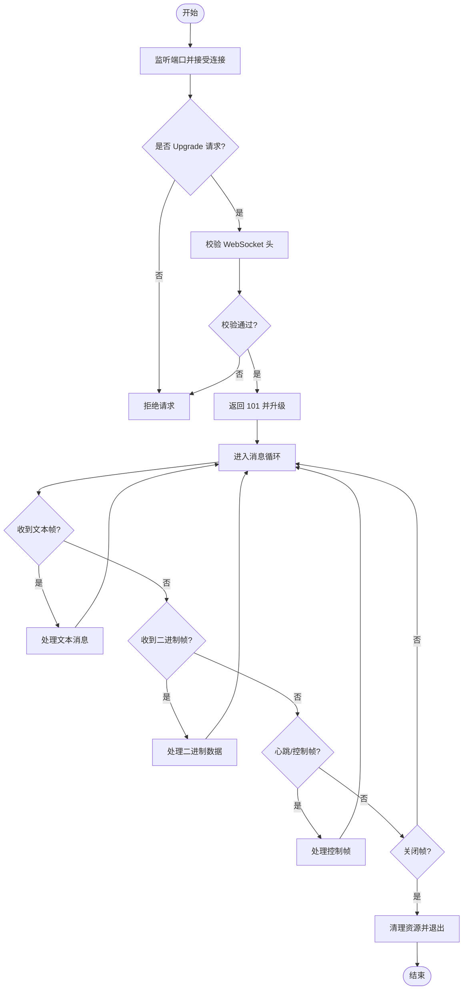
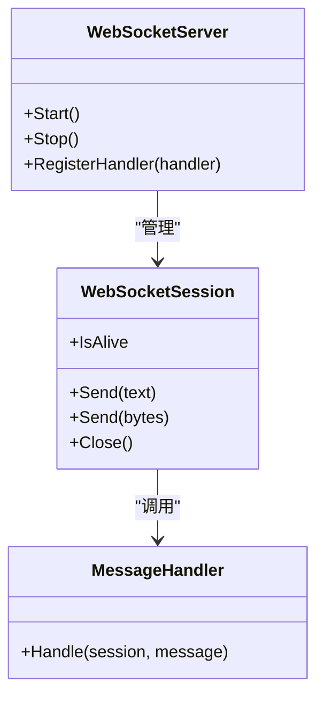
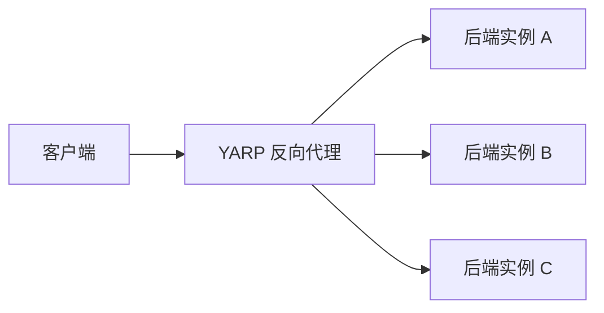
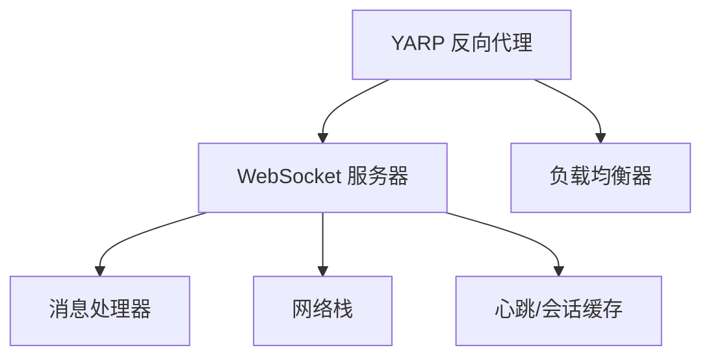

# WebSocket协议实现

<cite>
**本文档引用的文件**   
- [fleck_websocket.cs](file://fleck_websocket.cs)
- [supersocket_integration.cs](file://supersocket_integration.cs)
- [signalr_integration.cs](file://signalr_integration.cs)
- [yarp_integration.cs](file://yarp_integration.cs)
- [memory_streaming.cs](file://memory_streaming.cs)
- [recyclable_memorystream_integration.cs](file://recyclable_memorystream_integration.cs)
- [cache_heartbeat_integration.cs](file://cache_heartbeat_integration.cs)
- [load_balancer.cs](file://load_balancer.cs)
</cite>

## 目录
1. [简介](#简介)
2. [项目结构](#项目结构)
3. [核心组件](#核心组件)
4. [架构总览](#架构总览)
5. [详细组件分析](#详细组件分析)
6. [依赖关系分析](#依赖关系分析)
7. [性能考虑](#性能考虑)
8. [故障排查指南](#故障排查指南)
9. [结论](#结论)
10. [附录](#附录)

## 简介
本文件面向需要在 .NET 环境中搭建高性能、可扩展的 WebSocket 服务器的开发者，基于仓库中的示例与集成代码，系统阐述使用 Fleck 与 SuperSocket 构建 WebSocket 服务的关键要点：握手流程、帧解析、文本与二进制消息处理、连接池管理、心跳检测、断线重连、内存优化策略，以及与 HTTP API 的混合部署、代理配置和负载均衡方案。文档同时覆盖安全与跨域配置、HTTPS 支持等生产级关注点，帮助读者快速落地并稳定运行。

## 项目结构
仓库采用“按能力/主题”组织的大量独立示例文件，WebSocket 相关内容主要分布在以下文件：
- 基于 Fleck 的 WebSocket 服务器示例
- 基于 SuperSocket 的 Socket/WebSocket 集成示例
- 基于 SignalR 的实时通信示例（可作为对比或替代方案）
- YARP 反向代理与负载均衡示例
- 内存流与零拷贝优化示例
- 心跳与缓存集成示例
- 通用负载均衡器示例

[此图为概念性结构图，不直接映射具体源码文件]

## 核心组件
- Fleck WebSocket 服务器：提供轻量级 WebSocket 握手、连接生命周期事件与消息收发能力，适合快速原型与中小规模场景。
- SuperSocket WebSocket 服务器：在 SuperSocket 框架基础上扩展 WebSocket 协议，具备更强的可插拔管道、中间件与性能调优能力，适合高并发与复杂业务。
- SignalR 实时通信：作为对比参考，展示更高层抽象的 Hub/HubContext 模型与自动重连、组广播等特性。
- YARP 反向代理：用于统一入口、路径转发、TLS 终止、限流与鉴权前置。
- 内存流优化：通过可回收内存流与零拷贝技术降低 GC 压力，提升吞吐。
- 心跳检测：结合缓存或定时器实现连接健康检查与异常清理。
- 负载均衡：进程内或分布式负载分发，配合会话粘性与状态共享。

**章节来源**
- [fleck_websocket.cs](file://fleck_websocket.cs)
- [supersocket_integration.cs](file://supersocket_integration.cs)
- [signalr_integration.cs](file://signalr_integration.cs)
- [yarp_integration.cs](file://yarp_integration.cs)
- [memory_streaming.cs](file://memory_streaming.cs)
- [recyclable_memorystream_integration.cs](file://recyclable_memorystream_integration.cs)
- [cache_heartbeat_integration.cs](file://cache_heartbeat_integration.cs)
- [load_balancer.cs](file://load_balancer.cs)

## 架构总览
下图展示了从客户端到 WebSocket 服务器的典型请求路径，包括 TLS 终止、反向代理、握手升级、消息处理与响应回写。

**图表来源**
- [yarp_integration.cs](file://yarp_integration.cs)
- [fleck_websocket.cs](file://fleck_websocket.cs)
- [supersocket_integration.cs](file://supersocket_integration.cs)

**章节来源**
- [yarp_integration.cs](file://yarp_integration.cs)
- [fleck_websocket.cs](file://fleck_websocket.cs)
- [supersocket_integration.cs](file://supersocket_integration.cs)

## 详细组件分析

### Fleck WebSocket 服务器
- 功能要点
  - 启动监听与 Accept 循环
  - 握手阶段校验 Sec-WebSocket-* 头
  - 连接建立后注册 OnMessage、OnClose、OnError 回调
  - 支持文本与二进制消息发送
- 关键流程
  - 接收 HTTP 请求 -> 验证 Upgrade 头部 -> 生成 Sec-WebSocket-Accept -> 返回 101 -> 进入帧处理循环
- 连接管理
  - 维护连接集合，支持广播与定向发送
  - 关闭时清理资源与订阅
- 错误处理
  - 捕获网络异常与协议错误，记录日志并断开连接

**图表来源**
- [fleck_websocket.cs](file://fleck_websocket.cs)

**章节来源**
- [fleck_websocket.cs](file://fleck_websocket.cs)

### SuperSocket WebSocket 服务器
- 功能要点
  - 基于 SuperSocket 的 IWebSocketSession 与 WebSocketRequestFilter
  - 支持自定义中间件链路与协议扩展
  - 更好的线程模型与背压控制
- 关键流程
  - 初始化服务端 -> 注册过滤器与处理器 -> 接受连接 -> 解析帧 -> 调用业务逻辑 -> 回写响应
- 连接管理
  - Session 生命周期管理，支持分组与路由
  - 优雅关闭与资源释放
- 错误处理
  - 统一的异常拦截与降级策略

**图表来源**
- [supersocket_integration.cs](file://supersocket_integration.cs)

**章节来源**
- [supersocket_integration.cs](file://supersocket_integration.cs)

### SignalR 实时通信（对比参考）
- 特点
  - 高层抽象 Hub/HubContext，简化组广播与用户关联
  - 自动重连、协商协议（WebSockets、Server-Sent Events、Long Polling）
  - 内置序列化与压缩选项
- 适用场景
  - 需要快速实现聊天、通知、仪表盘等实时功能
  - 希望减少底层协议细节处理

**章节来源**
- [signalr_integration.cs](file://signalr_integration.cs)

### YARP 反向代理与负载均衡
- 功能要点
  - 统一入口、TLS 终止、路径重写与转发
  - 健康检查、重试、熔断与限流
  - 多后端实例的负载均衡策略
- 配置要点
  - 定义后端集群与路由规则
  - 设置超时、缓冲与压缩
  - 启用 CORS 与安全头

**图表来源**
- [yarp_integration.cs](file://yarp_integration.cs)

**章节来源**
- [yarp_integration.cs](file://yarp_integration.cs)

### 内存流与零拷贝优化
- 目标
  - 减少大对象分配与 GC 停顿
  - 提高高吞吐场景下的稳定性
- 手段
  - 使用可回收内存流与数组池
  - 避免不必要的字符串转换与复制
  - 合理设置缓冲区大小与阈值

**章节来源**
- [memory_streaming.cs](file://memory_streaming.cs)
- [recyclable_memorystream_integration.cs](file://recyclable_memorystream_integration.cs)

### 心跳检测与健康检查
- 目标
  - 及时发现死连接并清理资源
  - 保障长连接的可用性
- 手段
  - 定时发送 Ping/Pong 或应用层心跳
  - 结合缓存或内存表记录最后活跃时间
  - 超过阈值未响应则主动关闭

**章节来源**
- [cache_heartbeat_integration.cs](file://cache_heartbeat_integration.cs)

### 负载均衡与连接池
- 目标
  - 水平扩展服务能力
  - 避免单点过载
- 手段
  - 进程内轮询/加权随机策略
  - 会话粘性（基于 Cookie/Token）
  - 与外部负载均衡器（Nginx/HAProxy/K8s Ingress）协同

**章节来源**
- [load_balancer.cs](file://load_balancer.cs)

## 依赖关系分析
- 组件耦合
  - WebSocket 服务器与消息处理器松耦合，便于替换与扩展
  - 反向代理与后端实例解耦，支持动态扩缩容
- 外部依赖
  - Fleck/SuperSocket 库
  - YARP 反向代理
  - 可选：Redis/内存缓存用于心跳与会话状态
- 潜在环依赖
  - 确保消息处理器不反向依赖服务器基础设施，避免循环引用

**图表来源**
- [fleck_websocket.cs](file://fleck_websocket.cs)
- [supersocket_integration.cs](file://supersocket_integration.cs)
- [yarp_integration.cs](file://yarp_integration.cs)
- [cache_heartbeat_integration.cs](file://cache_heartbeat_integration.cs)
- [load_balancer.cs](file://load_balancer.cs)

**章节来源**
- [fleck_websocket.cs](file://fleck_websocket.cs)
- [supersocket_integration.cs](file://supersocket_integration.cs)
- [yarp_integration.cs](file://yarp_integration.cs)
- [cache_heartbeat_integration.cs](file://cache_heartbeat_integration.cs)
- [load_balancer.cs](file://load_balancer.cs)

## 性能考虑
- 握手与协议
  - 最小化握手阶段的 CPU 与内存开销
  - 合理设置最大帧大小与消息长度限制
- 内存管理
  - 使用数组池与可回收内存流
  - 避免频繁装箱与字符串拼接
- 并发与线程模型
  - 异步 I/O 与非阻塞处理
  - 背压与限流保护
- 监控与指标
  - 暴露连接数、吞吐、延迟、错误率等指标
  - 结合分布式追踪定位瓶颈

[本节为通用指导，不直接分析具体文件]

## 故障排查指南
- 常见问题
  - 握手失败：检查 Upgrade 头、Sec-WebSocket-Key/Accept 计算、跨域与证书
  - 连接中断：检查心跳间隔、防火墙/NAT 超时、代理超时
  - 内存泄漏：检查未释放的订阅、大对象未回收、缓冲区未归还
  - 性能抖动：检查 GC 压力、锁竞争、序列化开销
- 诊断步骤
  - 启用详细日志与指标采集
  - 使用抓包工具验证帧格式与顺序
  - 逐步隔离问题（直连 vs 代理、单机 vs 集群）
- 恢复策略
  - 自动重连与退避
  - 熔断与降级
  - 优雅关闭与资源清理

**章节来源**
- [fleck_websocket.cs](file://fleck_websocket.cs)
- [supersocket_integration.cs](file://supersocket_integration.cs)
- [yarp_integration.cs](file://yarp_integration.cs)
- [cache_heartbeat_integration.cs](file://cache_heartbeat_integration.cs)

## 结论
通过结合 Fleck 与 SuperSocket 的优势，可以在不同规模与复杂度场景下灵活选择 WebSocket 实现。配合 YARP 反向代理、内存优化与心跳机制，能够构建出高可用、高性能且易于运维的实时通信系统。建议在生产环境充分进行容量规划、压测与监控，确保安全与稳定性。

[本节为总结性内容，不直接分析具体文件]

## 附录
- 安全与跨域
  - 启用 HTTPS 与强密码套件
  - 配置 CORS 白名单与 SameSite/CSP 头
  - 对 WebSocket 路径做鉴权与速率限制
- 代理与负载均衡
  - Nginx/HAProxy 的 WebSocket 透传配置
  - K8s Ingress 的注解与超时设置
  - 会话粘性与状态外置（Redis）
- 最佳实践
  - 明确消息契约与版本兼容
  - 设计幂等与去重机制
  - 灰度发布与回滚预案

[本节为通用指导，不直接分析具体文件]