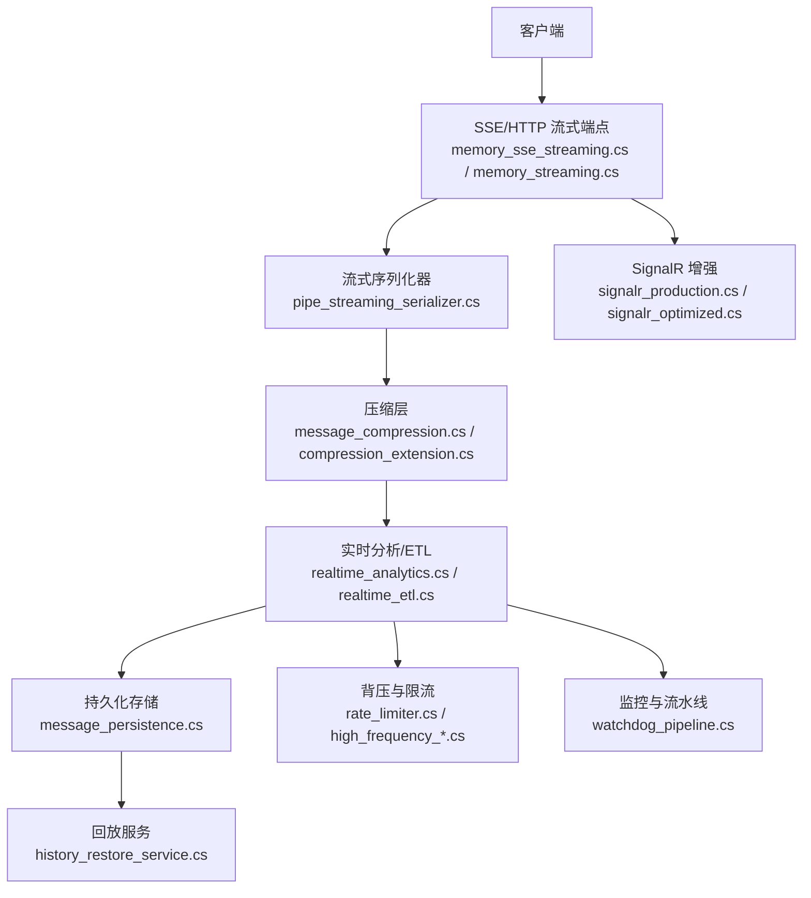
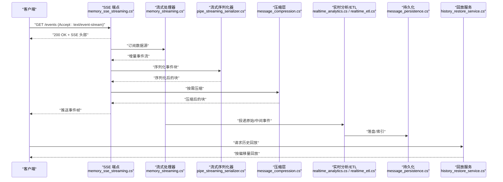
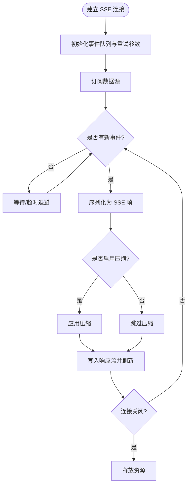
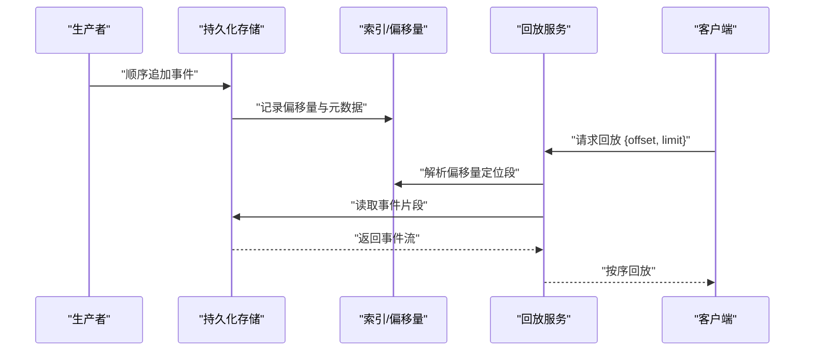
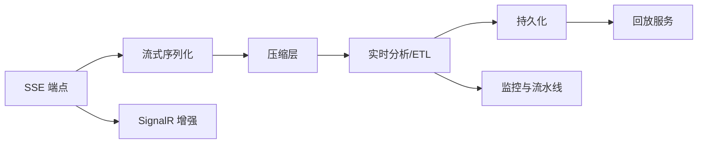

# 实时数据流处理

<cite>
**本文引用的文件**   
- [memory_sse_streaming.cs](file://memory_sse_streaming.cs)
- [memory_streaming.cs](file://memory_streaming.cs)
- [pipe_streaming_serializer.cs](file://pipe_streaming_serializer.cs)
- [message_compression.cs](file://message_compression.cs)
- [realtime_analytics.cs](file://realtime_analytics.cs)
- [realtime_etl.cs](file://realtime_etl.cs)
- [high_frequency_1m.cs](file://high_frequency_1m.cs)
- [high_frequency_10m.cs](file://high_frequency_10m.cs)
- [rate_limiter.cs](file://rate_limiter.cs)
- [message_persistence.cs](file://message_persistence.cs)
- [history_restore_service.cs](file://history_restore_service.cs)
- [compression_extension.cs](file://compression_extension.cs)
- [brotli_compression_integration.cs](file://brotli_compression_integration.cs)
- [zstd_compression_integration.cs](file://zstd_compression_integration.cs)
- [signalr_production.cs](file://signalr_production.cs)
- [signalr_optimized.cs](file://signalr_optimized.cs)
- [dataflow_pipeline.cs](file://dataflow_pipeline.cs)
- [watchdog_pipeline.cs](file://watchdog_pipeline.cs)
</cite>

## 目录
1. [简介](#简介)
2. [项目结构](#项目结构)
3. [核心组件](#核心组件)
4. [架构总览](#架构总览)
5. [详细组件分析](#详细组件分析)
6. [依赖关系分析](#依赖关系分析)
7. [性能考量](#性能考量)
8. [故障排查指南](#故障排查指南)
9. [结论](#结论)
10. [附录](#附录)

## 简介
本文件面向实时数据流处理，围绕 Server-Sent Events（SSE）实现、流式响应与异步推送机制展开，覆盖数据流序列化、压缩传输、增量更新策略，以及高性能流式管道、背压控制与流量整形。同时涵盖实时数据分析、流式聚合与窗口计算，并文档化流式数据的持久化、回放与故障恢复能力。

## 项目结构
本项目以“示例/集成”形式的单文件组织为主，围绕流式与实时场景提供多种可组合的组件：
- SSE 与流式输出：memory_sse_streaming.cs、memory_streaming.cs
- 流式序列化与管道：pipe_streaming_serializer.cs、dataflow_pipeline.cs
- 压缩与传输优化：message_compression.cs、compression_extension.cs、brotli_compression_integration.cs、zstd_compression_integration.cs
- 实时分析与聚合：realtime_analytics.cs、realtime_etl.cs
- 高吞吐与背压：high_frequency_1m.cs、high_frequency_10m.cs、rate_limiter.cs
- 持久化与回放：message_persistence.cs、history_restore_service.cs
- 实时通道增强：signalr_production.cs、signalr_optimized.cs
- 监控与流水线：watchdog_pipeline.cs

**图示来源** 
- [memory_sse_streaming.cs](file://memory_sse_streaming.cs)
- [memory_streaming.cs](file://memory_streaming.cs)
- [pipe_streaming_serializer.cs](file://pipe_streaming_serializer.cs)
- [message_compression.cs](file://message_compression.cs)
- [compression_extension.cs](file://compression_extension.cs)
- [realtime_analytics.cs](file://realtime_analytics.cs)
- [realtime_etl.cs](file://realtime_etl.cs)
- [message_persistence.cs](file://message_persistence.cs)
- [history_restore_service.cs](file://history_restore_service.cs)
- [rate_limiter.cs](file://rate_limiter.cs)
- [high_frequency_1m.cs](file://high_frequency_1m.cs)
- [high_frequency_10m.cs](file://high_frequency_10m.cs)
- [signalr_production.cs](file://signalr_production.cs)
- [signalr_optimized.cs](file://signalr_optimized.cs)
- [watchdog_pipeline.cs](file://watchdog_pipeline.cs)

**章节来源**
- [memory_sse_streaming.cs](file://memory_sse_streaming.cs)
- [memory_streaming.cs](file://memory_streaming.cs)
- [pipe_streaming_serializer.cs](file://pipe_streaming_serializer.cs)
- [message_compression.cs](file://message_compression.cs)
- [compression_extension.cs](file://compression_extension.cs)
- [realtime_analytics.cs](file://realtime_analytics.cs)
- [realtime_etl.cs](file://realtime_etl.cs)
- [message_persistence.cs](file://message_persistence.cs)
- [history_restore_service.cs](file://history_restore_service.cs)
- [rate_limiter.cs](file://rate_limiter.cs)
- [high_frequency_1m.cs](file://high_frequency_1m.cs)
- [high_frequency_10m.cs](file://high_frequency_10m.cs)
- [signalr_production.cs](file://signalr_production.cs)
- [signalr_optimized.cs](file://signalr_optimized.cs)
- [watchdog_pipeline.cs](file://watchdog_pipeline.cs)

## 核心组件
- SSE 与流式响应：基于内存缓冲与流式写入，支持事件类型、重试与增量更新。
- 流式序列化：零拷贝或低分配序列化，按块输出，减少 GC 压力。
- 压缩传输：可选 Brotli/Zstd 压缩，结合 HTTP 头协商，降低带宽占用。
- 实时分析/ETL：窗口聚合、滑动窗口、去重与过滤，支持多源合并。
- 背压与限流：令牌桶/漏桶算法，动态速率限制与降级策略。
- 持久化与回放：顺序追加写、索引与偏移量管理，支持断点续传与回放。
- 监控与流水线：指标采集、健康检查、流水线编排与错误隔离。

**章节来源**
- [memory_sse_streaming.cs](file://memory_sse_streaming.cs)
- [memory_streaming.cs](file://memory_streaming.cs)
- [pipe_streaming_serializer.cs](file://pipe_streaming_serializer.cs)
- [message_compression.cs](file://message_compression.cs)
- [compression_extension.cs](file://compression_extension.cs)
- [realtime_analytics.cs](file://realtime_analytics.cs)
- [realtime_etl.cs](file://realtime_etl.cs)
- [rate_limiter.cs](file://rate_limiter.cs)
- [message_persistence.cs](file://message_persistence.cs)
- [history_restore_service.cs](file://history_restore_service.cs)
- [watchdog_pipeline.cs](file://watchdog_pipeline.cs)

## 架构总览
下图展示从客户端到后端流式管道的端到端流程，包括 SSE 端点、序列化、压缩、实时分析、持久化与回放。

**图示来源** 
- [memory_sse_streaming.cs](file://memory_sse_streaming.cs)
- [memory_streaming.cs](file://memory_streaming.cs)
- [pipe_streaming_serializer.cs](file://pipe_streaming_serializer.cs)
- [message_compression.cs](file://message_compression.cs)
- [realtime_analytics.cs](file://realtime_analytics.cs)
- [realtime_etl.cs](file://realtime_etl.cs)
- [message_persistence.cs](file://message_persistence.cs)
- [history_restore_service.cs](file://history_restore_service.cs)

## 详细组件分析

### SSE 与流式响应（memory_sse_streaming.cs, memory_streaming.cs）
- 职责
  - 建立 SSE 连接，维护事件队列与重试策略
  - 将内存中的事件序列化为 SSE 帧并按需刷新
  - 支持事件类型、ID、重试间隔等标准字段
- 关键设计
  - 使用环形缓冲或无锁队列承载增量事件，避免阻塞写入
  - 通过异步迭代器/任务流驱动读取，降低线程切换开销
  - 客户端断开时自动清理资源与取消订阅
- 增量更新策略
  - 仅推送变更字段，附带版本号或时间戳，客户端做幂等合并
  - 支持批量合并与去重，减少网络抖动影响

**图示来源** 
- [memory_sse_streaming.cs](file://memory_sse_streaming.cs)
- [memory_streaming.cs](file://memory_streaming.cs)

**章节来源**
- [memory_sse_streaming.cs](file://memory_sse_streaming.cs)
- [memory_streaming.cs](file://memory_streaming.cs)

### 流式序列化（pipe_streaming_serializer.cs）
- 职责
  - 将对象/字节流分块序列化，支持零拷贝或低分配路径
  - 与压缩层解耦，便于替换不同编码格式
- 关键设计
  - 使用管道/缓冲区池，减少内存碎片
  - 支持流式校验和/哈希，便于完整性校验
- 复杂度
  - 时间 O(n)，空间取决于块大小与缓冲池命中率

**章节来源**
- [pipe_streaming_serializer.cs](file://pipe_streaming_serializer.cs)

### 压缩传输（message_compression.cs, compression_extension.cs, brotli_compression_integration.cs, zstd_compression_integration.cs）
- 职责
  - 在流式输出前对数据进行压缩，根据客户端能力协商算法
  - 提供扩展方法简化集成
- 关键设计
  - 支持 Brotli/Zstd，权衡 CPU 与带宽
  - 分层封装，透明地应用于流式写入
- 建议
  - 小消息优先 Brotli，大消息考虑 Zstd
  - 开启自适应压缩阈值，避免过度压缩

**章节来源**
- [message_compression.cs](file://message_compression.cs)
- [compression_extension.cs](file://compression_extension.cs)
- [brotli_compression_integration.cs](file://brotli_compression_integration.cs)
- [zstd_compression_integration.cs](file://zstd_compression_integration.cs)

### 实时分析与窗口计算（realtime_analytics.cs, realtime_etl.cs）
- 职责
  - 对流入事件进行过滤、映射、聚合与窗口计算
  - 支持滑动窗口、会话窗口、计数/求和/均值等算子
- 关键设计
  - 基于有界状态与定时器触发窗口结算
  - 支持多源合并与乱序容忍（水位线）
- 性能要点
  - 预分配聚合容器，避免频繁装箱
  - 使用增量统计，减少全量扫描

**章节来源**
- [realtime_analytics.cs](file://realtime_analytics.cs)
- [realtime_etl.cs](file://realtime_etl.cs)

### 背压与流量整形（rate_limiter.cs, high_frequency_1m.cs, high_frequency_10m.cs）
- 职责
  - 控制生产者/消费者速率，防止下游过载
  - 在高吞吐场景下维持稳定延迟与吞吐
- 关键设计
  - 令牌桶/漏桶算法，支持突发与平滑模式
  - 动态调整阈值，依据延迟/队列长度反馈
- 实践
  - 在 SSE 写入前进行限速，避免拥塞
  - 与窗口聚合配合，保证窗口内吞吐可控

**章节来源**
- [rate_limiter.cs](file://rate_limiter.cs)
- [high_frequency_1m.cs](file://high_frequency_1m.cs)
- [high_frequency_10m.cs](file://high_frequency_10m.cs)

### 持久化与回放（message_persistence.cs, history_restore_service.cs）
- 职责
  - 将流式事件顺序追加到存储，建立索引与偏移量
  - 提供按偏移量回放与断点续传能力
- 关键设计
  - 分段文件/分区表，滚动归档与清理策略
  - 幂等写入与事务边界，确保一致性
- 回放流程
  - 客户端携带起始偏移量，服务端定位段并逐条回放

**图示来源** 
- [message_persistence.cs](file://message_persistence.cs)
- [history_restore_service.cs](file://history_restore_service.cs)

**章节来源**
- [message_persistence.cs](file://message_persistence.cs)
- [history_restore_service.cs](file://history_restore_service.cs)

### 实时监控与流水线（watchdog_pipeline.cs, dataflow_pipeline.cs）
- 职责
  - 编排多个处理阶段，提供健康检查与指标上报
  - 异常隔离与重试，保障整体可用性
- 关键设计
  - 阶段间解耦，支持并行与批处理
  - 内置计数器、延迟分布与错误率监控

**章节来源**
- [watchdog_pipeline.cs](file://watchdog_pipeline.cs)
- [dataflow_pipeline.cs](file://dataflow_pipeline.cs)

### 实时通道增强（signalr_production.cs, signalr_optimized.cs）
- 职责
  - 在 SignalR 场景中提供生产级配置与优化
  - 与 SSE/流式管道互补，适用于双向通信需求
- 关键设计
  - 连接池、心跳与断线重连
  - 与背压/限流协同，避免雪崩

**章节来源**
- [signalr_production.cs](file://signalr_production.cs)
- [signalr_optimized.cs](file://signalr_optimized.cs)

## 依赖关系分析
- 松耦合分层
  - 端点层（SSE/SignalR）→ 序列化层 → 压缩层 → 分析/ETL → 持久化 → 回放
- 外部依赖
  - 压缩库（Brotli/Zstd）、存储后端（文件/数据库）、监控指标系统
- 潜在环依赖
  - 通过接口抽象与事件总线解耦，避免循环引用

**图示来源** 
- [memory_sse_streaming.cs](file://memory_sse_streaming.cs)
- [pipe_streaming_serializer.cs](file://pipe_streaming_serializer.cs)
- [message_compression.cs](file://message_compression.cs)
- [realtime_analytics.cs](file://realtime_analytics.cs)
- [realtime_etl.cs](file://realtime_etl.cs)
- [message_persistence.cs](file://message_persistence.cs)
- [history_restore_service.cs](file://history_restore_service.cs)
- [signalr_production.cs](file://signalr_production.cs)
- [signalr_optimized.cs](file://signalr_optimized.cs)
- [watchdog_pipeline.cs](file://watchdog_pipeline.cs)

**章节来源**
- [memory_sse_streaming.cs](file://memory_sse_streaming.cs)
- [pipe_streaming_serializer.cs](file://pipe_streaming_serializer.cs)
- [message_compression.cs](file://message_compression.cs)
- [realtime_analytics.cs](file://realtime_analytics.cs)
- [realtime_etl.cs](file://realtime_etl.cs)
- [message_persistence.cs](file://message_persistence.cs)
- [history_restore_service.cs](file://history_restore_service.cs)
- [signalr_production.cs](file://signalr_production.cs)
- [signalr_optimized.cs](file://signalr_optimized.cs)
- [watchdog_pipeline.cs](file://watchdog_pipeline.cs)

## 性能考量
- 序列化与内存
  - 使用管道与缓冲池，减少分配与拷贝；按块输出，控制峰值内存
- 压缩策略
  - 根据消息大小与 CPU 预算选择 Brotli/Zstd；设置阈值与并发度
- 背压与限流
  - 令牌桶/漏桶调节写入速率；结合队列长度与延迟反馈动态调参
- 窗口与聚合
  - 增量统计、预分配容器；合理窗口大小与水位线，避免长尾
- 持久化
  - 顺序写、批量提交；索引与段滚动，平衡查询与写入
- 监控
  - 采集吞吐、延迟、错误率与资源使用，指导容量规划

[本节为通用指导，不直接分析具体文件]

## 故障排查指南
- 常见问题
  - SSE 连接中断：检查重试参数、网络稳定性与客户端兼容性
  - 延迟升高：确认背压阈值、压缩开销与窗口大小
  - 数据丢失：验证幂等写入、偏移量一致性与回放起点
  - 内存泄漏：关注缓冲池回收、未取消订阅与未释放资源
- 诊断步骤
  - 查看监控指标与日志，定位瓶颈阶段
  - 回放测试：用已知偏移量复现问题，对比预期与真实输出
  - 压力测试：逐步提升负载，观察回压与降级行为

**章节来源**
- [memory_sse_streaming.cs](file://memory_sse_streaming.cs)
- [memory_streaming.cs](file://memory_streaming.cs)
- [rate_limiter.cs](file://rate_limiter.cs)
- [message_persistence.cs](file://message_persistence.cs)
- [history_restore_service.cs](file://history_restore_service.cs)

## 结论
该代码库提供了完整的实时数据流处理方案：从 SSE/流式端点到序列化、压缩、实时分析、持久化与回放，形成可组合的高性能管道。通过背压与限流、窗口聚合与监控，可在高吞吐与低延迟之间取得平衡。建议在生产环境中结合业务特征调优压缩阈值、窗口大小与限流参数，并完善监控与回放能力，确保可靠性与可观测性。

[本节为总结性内容，不直接分析具体文件]

## 附录
- 术语
  - SSE：Server-Sent Events，服务器向客户端单向推送文本事件
  - 背压：下游处理能力不足时，上游主动降速或丢弃的策略
  - 窗口计算：在固定或滑动时间范围内对事件进行聚合
- 最佳实践
  - 事件幂等与版本控制，避免重复处理
  - 小步快跑的分块序列化，降低内存峰值
  - 压缩与带宽权衡，按消息尺寸选择算法
  - 持久化顺序写与索引分离，提高回放效率

[本节为概念性内容，不直接分析具体文件]