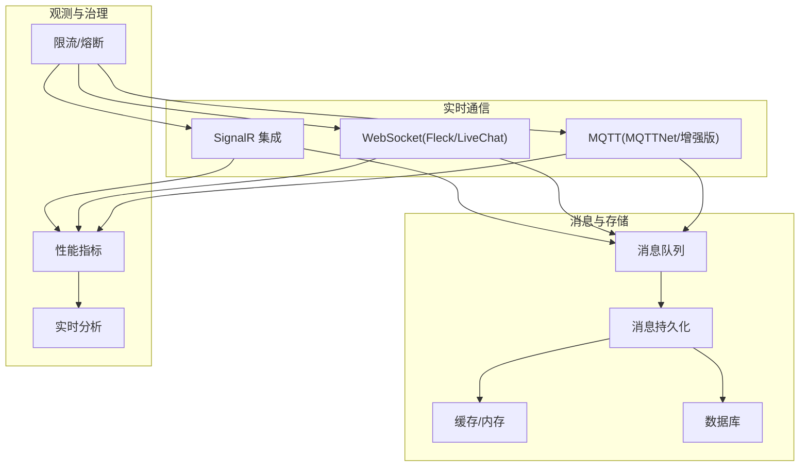
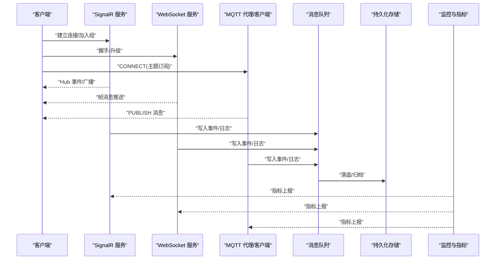
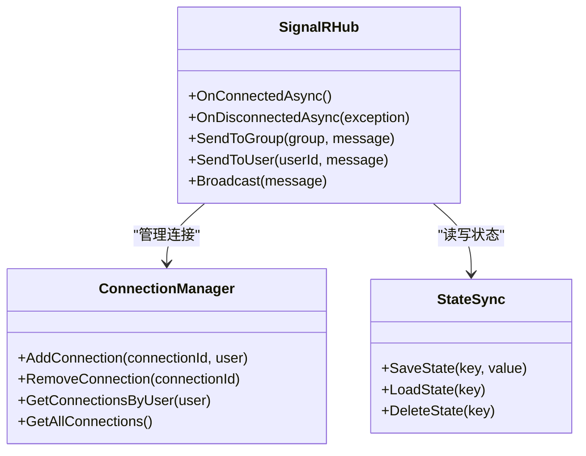
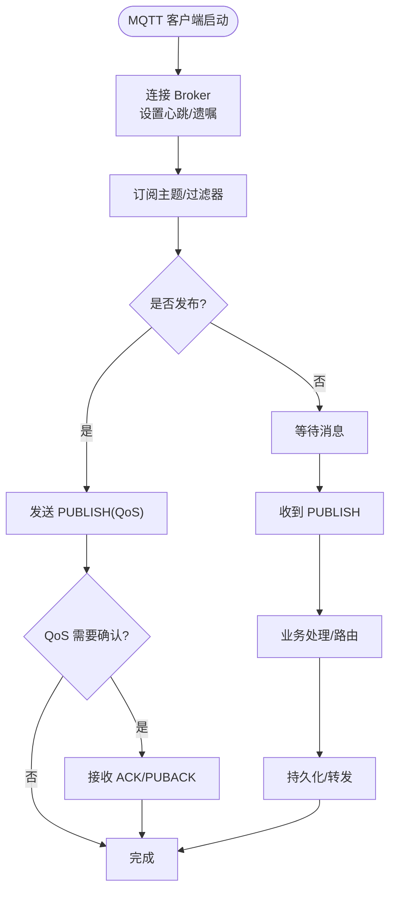
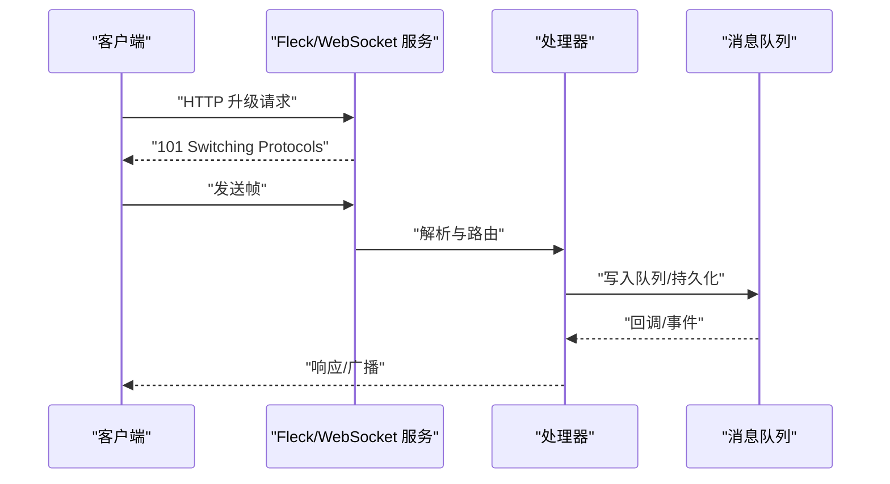
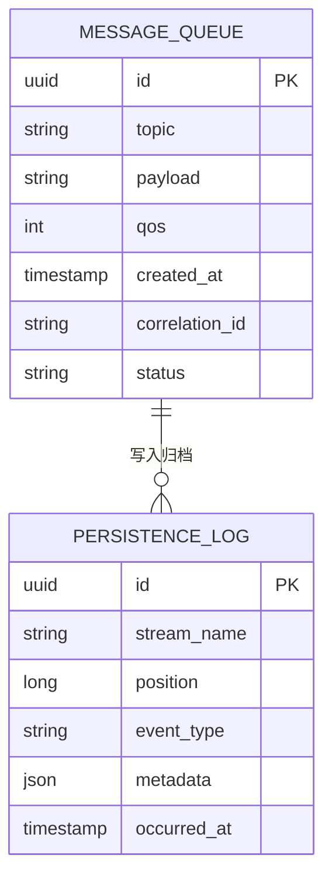
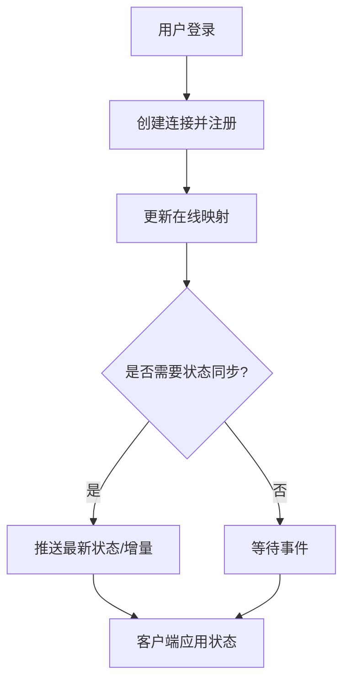
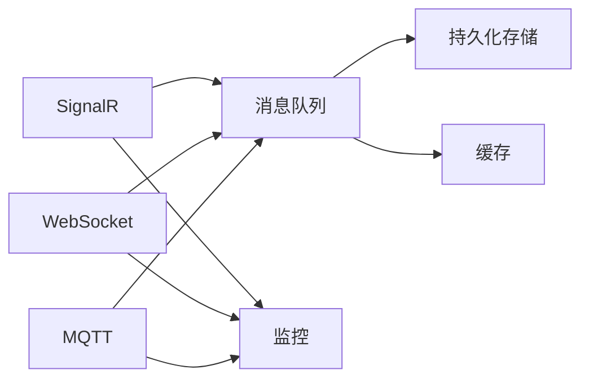

# 实时通信

<cite>
**本文引用的文件**   
- [signalr_integration.cs](file://signalr_integration.cs)
- [signalr_advanced.cs](file://signalr_advanced.cs)
- [signalr_production.cs](file://signalr_production.cs)
- [signalr_optimized.cs](file://signalr_optimized.cs)
- [signalr_monitoring.cs](file://signalr_monitoring.cs)
- [mqtt_integration.cs](file://mqtt_integration.cs)
- [mqttnet_demo.cs](file://mqttnet_demo.cs)
- [mqtt_enhanced.cs](file://mqtt_enhanced.cs)
- [mqtt_optimized.cs](file://mqtt_optimized.cs)
- [mqtt_advanced_optimization.cs](file://mqtt_advanced_optimization.cs)
- [mqtt_security.cs](file://mqtt_security.cs)
- [fleck_websocket.cs](file://fleck_websocket.cs)
- [livechat_integration.cs](file://livechat_integration.cs)
- [message_persistence.cs](file://message_persistence.cs)
- [message_queue.cs](file://message_queue.cs)
- [message_queue_enhanced.cs](file://message_queue_enhanced.cs)
- [realtime_analytics.cs](file://realtime_analytics.cs)
- [high_frequency_100k.cs](file://high_frequency_100k.cs)
- [high_frequency_1m.cs](file://high_frequency_1m.cs)
- [high_frequency_10m.cs](file://high_frequency_10m.cs)
- [performance_metrics.cs](file://performance_metrics.cs)
- [rate_limiter.cs](file://rate_limiter.cs)
</cite>

## 目录
1. [简介](#简介)
2. [项目结构](#项目结构)
3. [核心组件](#核心组件)
4. [架构总览](#架构总览)
5. [详细组件分析](#详细组件分析)
6. [依赖分析](#依赖分析)
7. [性能考量](#性能考量)
8. [故障排查指南](#故障排查指南)
9. [结论](#结论)
10. [附录](#附录)

## 简介
本文件面向构建高并发、低延迟的实时通信系统，围绕 SignalR、WebSocket、MQTT 三种协议在代码库中的实现与使用进行系统化说明。内容覆盖连接管理、消息推送、广播机制、状态同步、在线用户管理、消息持久化、实时数据流处理，以及在高并发场景下的性能优化、连接池管理与故障恢复策略。读者可据此快速搭建可扩展的实时通信服务，并在生产环境中稳定运行。

## 项目结构
仓库以“按功能/集成”组织大量示例与集成代码，其中与实时通信相关的核心文件集中在根目录及 code 子目录中：
- SignalR 相关：signalr_integration.cs、signalr_advanced.cs、signalr_production.cs、signalr_optimized.cs、signalr_monitoring.cs
- MQTT 相关：mqtt_integration.cs、mqttnet_demo.cs、mqtt_enhanced.cs、mqtt_optimized.cs、mqtt_advanced_optimization.cs、mqtt_security.cs
- WebSocket 相关：fleck_websocket.cs、livechat_integration.cs
- 消息与持久化：message_persistence.cs、message_queue.cs、message_queue_enhanced.cs
- 性能与监控：performance_metrics.cs、realtime_analytics.cs、high_frequency_*.cs、rate_limiter.cs

图表来源
- [signalr_integration.cs:1-200](file://signalr_integration.cs#L1-L200)
- [fleck_websocket.cs:1-200](file://fleck_websocket.cs#L1-L200)
- [mqtt_integration.cs:1-200](file://mqtt_integration.cs#L1-L200)
- [message_queue.cs:1-200](file://message_queue.cs#L1-L200)
- [message_persistence.cs:1-200](file://message_persistence.cs#L1-L200)
- [performance_metrics.cs:1-200](file://performance_metrics.cs#L1-L200)

章节来源
- [signalr_integration.cs:1-200](file://signalr_integration.cs#L1-L200)
- [fleck_websocket.cs:1-200](file://fleck_websocket.cs#L1-L200)
- [mqtt_integration.cs:1-200](file://mqtt_integration.cs#L1-L200)
- [message_queue.cs:1-200](file://message_queue.cs#L1-L200)
- [message_persistence.cs:1-200](file://message_persistence.cs#L1-L200)
- [performance_metrics.cs:1-200](file://performance_metrics.cs#L1-L200)

## 核心组件
- SignalR 服务端与客户端集成：提供 Hub 模型、组播/广播、在线用户管理、跨域与认证、生产级配置与监控。
- MQTT 发布订阅：基于 MQTTNet 的客户端/代理集成，支持主题路由、QoS、离线消息、安全与优化。
- WebSocket 直连：基于 Fleck 或 LiveChat 的轻量级长连接，适合自定义协议或极简场景。
- 消息中间件与持久化：统一消息队列与持久化层，解耦实时通道与存储，保障可靠性与顺序性。
- 性能与治理：指标采集、实时分析、限流与背压、高吞吐基准测试。

章节来源
- [signalr_production.cs:1-200](file://signalr_production.cs#L1-L200)
- [mqtt_optimized.cs:1-200](file://mqtt_optimized.cs#L1-L200)
- [fleck_websocket.cs:1-200](file://fleck_websocket.cs#L1-L200)
- [message_queue_enhanced.cs:1-200](file://message_queue_enhanced.cs#L1-L200)
- [performance_metrics.cs:1-200](file://performance_metrics.cs#L1-L200)

## 架构总览
下图展示从客户端到实时通道的接入层、消息分发与持久化的整体流程，并体现监控与治理能力。

图表来源
- [signalr_integration.cs:1-200](file://signalr_integration.cs#L1-L200)
- [fleck_websocket.cs:1-200](file://fleck_websocket.cs#L1-L200)
- [mqtt_integration.cs:1-200](file://mqtt_integration.cs#L1-L200)
- [message_queue.cs:1-200](file://message_queue.cs#L1-L200)
- [message_persistence.cs:1-200](file://message_persistence.cs#L1-L200)
- [performance_metrics.cs:1-200](file://performance_metrics.cs#L1-L200)

## 详细组件分析

### SignalR 组件分析
- 连接管理：基于 Hub 的生命周期（OnConnectedAsync/OnDisconnectedAsync），维护连接上下文与会话信息。
- 消息推送与广播：通过 Clients.Group/Clients.All 等 API 实现精准与全局广播；支持按用户/设备维度路由。
- 状态同步：结合内存/分布式缓存保存会话状态，保证断线重连后的状态一致性。
- 生产特性：启用压缩、缓冲、超时、重试、背压；集成认证与授权；接入监控与追踪。

图表来源
- [signalr_integration.cs:1-200](file://signalr_integration.cs#L1-L200)
- [signalr_advanced.cs:1-200](file://signalr_advanced.cs#L1-L200)
- [signalr_production.cs:1-200](file://signalr_production.cs#L1-L200)

章节来源
- [signalr_integration.cs:1-200](file://signalr_integration.cs#L1-L200)
- [signalr_advanced.cs:1-200](file://signalr_advanced.cs#L1-L200)
- [signalr_production.cs:1-200](file://signalr_production.cs#L1-L200)
- [signalr_optimized.cs:1-200](file://signalr_optimized.cs#L1-L200)
- [signalr_monitoring.cs:1-200](file://signalr_monitoring.cs#L1-L200)

### MQTT 组件分析
- 发布订阅：基于主题层级与过滤器，支持 QoS0/1/2 语义；结合保留消息实现状态同步。
- 连接管理：客户端生命周期、心跳保活、自动重连、遗嘱消息（Last Will）。
- 安全与优化：TLS、鉴权、ACL；消息压缩、批处理、连接池、线程池调优。
- 持久化与离线：Broker 侧持久化、客户端离线缓存、消费确认与去重。

图表来源
- [mqtt_integration.cs:1-200](file://mqtt_integration.cs#L1-L200)
- [mqttnet_demo.cs:1-200](file://mqttnet_demo.cs#L1-L200)
- [mqtt_enhanced.cs:1-200](file://mqtt_enhanced.cs#L1-L200)
- [mqtt_optimized.cs:1-200](file://mqtt_optimized.cs#L1-L200)
- [mqtt_advanced_optimization.cs:1-200](file://mqtt_advanced_optimization.cs#L1-L200)
- [mqtt_security.cs:1-200](file://mqtt_security.cs#L1-L200)

章节来源
- [mqtt_integration.cs:1-200](file://mqtt_integration.cs#L1-L200)
- [mqttnet_demo.cs:1-200](file://mqttnet_demo.cs#L1-L200)
- [mqtt_enhanced.cs:1-200](file://mqtt_enhanced.cs#L1-L200)
- [mqtt_optimized.cs:1-200](file://mqtt_optimized.cs#L1-L200)
- [mqtt_advanced_optimization.cs:1-200](file://mqtt_advanced_optimization.cs#L1-L200)
- [mqtt_security.cs:1-200](file://mqtt_security.cs#L1-L200)

### WebSocket 组件分析
- 轻量长连接：基于 Fleck 或 LiveChat 的 HTTP 升级，适合简单聊天、指令下发、低开销场景。
- 消息格式：文本/二进制帧，支持分片与压缩；可按连接维度路由。
- 扩展点：中间件式鉴权、限流、审计、指标上报。

图表来源
- [fleck_websocket.cs:1-200](file://fleck_websocket.cs#L1-L200)
- [livechat_integration.cs:1-200](file://livechat_integration.cs#L1-L200)
- [message_queue.cs:1-200](file://message_queue.cs#L1-L200)

章节来源
- [fleck_websocket.cs:1-200](file://fleck_websocket.cs#L1-L200)
- [livechat_integration.cs:1-200](file://livechat_integration.cs#L1-L200)

### 消息与持久化
- 消息队列：作为统一总线，承载实时事件、命令与日志，解耦生产者与消费者。
- 持久化：按主题/分区落盘，支持索引、归档、回放与补偿消费。
- 顺序与幂等：基于序列号与去重表，确保至少一次/恰好一次语义。

图表来源
- [message_queue.cs:1-200](file://message_queue.cs#L1-L200)
- [message_queue_enhanced.cs:1-200](file://message_queue_enhanced.cs#L1-L200)
- [message_persistence.cs:1-200](file://message_persistence.cs#L1-L200)

章节来源
- [message_queue.cs:1-200](file://message_queue.cs#L1-L200)
- [message_queue_enhanced.cs:1-200](file://message_queue_enhanced.cs#L1-L200)
- [message_persistence.cs:1-200](file://message_persistence.cs#L1-L200)

### 在线用户管理与状态同步
- 在线用户：维护连接映射（userId -> connections），支持踢人、迁移、统计。
- 状态同步：通过保留消息（MQTT）或广播（SignalR）同步关键状态；断线重连后增量拉取。
- 一致性：结合分布式锁与版本号，避免并发冲突。

章节来源
- [signalr_production.cs:1-200](file://signalr_production.cs#L1-L200)
- [mqtt_enhanced.cs:1-200](file://mqtt_enhanced.cs#L1-L200)

## 依赖分析
- 组件耦合：实时通道（SignalR/MQTT/WebSocket）通过消息队列解耦，降低直接依赖。
- 外部依赖：Broker（MQTT）、存储（DB/对象存储）、缓存（Redis/内存）、监控（Prometheus/OpenTelemetry）。
- 潜在循环：应避免在 Hub/Handler 中直接调用持久化，改为通过队列/事件驱动。

图表来源
- [signalr_integration.cs:1-200](file://signalr_integration.cs#L1-L200)
- [fleck_websocket.cs:1-200](file://fleck_websocket.cs#L1-L200)
- [mqtt_integration.cs:1-200](file://mqtt_integration.cs#L1-L200)
- [message_queue.cs:1-200](file://message_queue.cs#L1-L200)
- [performance_metrics.cs:1-200](file://performance_metrics.cs#L1-L200)

章节来源
- [signalr_integration.cs:1-200](file://signalr_integration.cs#L1-L200)
- [fleck_websocket.cs:1-200](file://fleck_websocket.cs#L1-L200)
- [mqtt_integration.cs:1-200](file://mqtt_integration.cs#L1-L200)
- [message_queue.cs:1-200](file://message_queue.cs#L1-L200)
- [performance_metrics.cs:1-200](file://performance_metrics.cs#L1-L200)

## 性能考量
- 连接池与线程池：合理设置最大连接数、I/O 线程与工作线程，避免阻塞。
- 序列化与压缩：选择高效序列化器（如 MessagePack/Protobuf），开启传输压缩。
- 背压与限流：令牌桶/漏桶限流，丢弃非关键消息，保护下游。
- 批量与合并：聚合小消息，减少网络往返与锁竞争。
- 高吞吐基准：参考 high_frequency_*.cs 的压测模式，定位瓶颈。

章节来源
- [performance_metrics.cs:1-200](file://performance_metrics.cs#L1-L200)
- [high_frequency_100k.cs:1-200](file://high_frequency_100k.cs#L1-L200)
- [high_frequency_1m.cs:1-200](file://high_frequency_1m.cs#L1-L200)
- [high_frequency_10m.cs:1-200](file://high_frequency_10m.cs#L1-L200)
- [rate_limiter.cs:1-200](file://rate_limiter.cs#L1-L200)

## 故障排查指南
- 连接问题：检查心跳、超时、防火墙/NAT；查看 Broker/网关日志与证书有效性。
- 消息丢失：核对 QoS、ACK、持久化位点；对账与回放。
- 性能抖动：观察 CPU/内存/GC、线程池饱和、锁争用；启用采样与火焰图。
- 监控告警：基于 performance_metrics.cs 与 realtime_analytics.cs 定义阈值与告警规则。

章节来源
- [performance_metrics.cs:1-200](file://performance_metrics.cs#L1-L200)
- [realtime_analytics.cs:1-200](file://realtime_analytics.cs#L1-L200)
- [signalr_monitoring.cs:1-200](file://signalr_monitoring.cs#L1-L200)

## 结论
本仓库提供了 SignalR、WebSocket、MQTT 三类实时通信协议的完整实践路径，配合消息队列与持久化层，形成高可用、可扩展的实时系统基座。通过连接管理、广播与状态同步、在线用户管理、限流与监控等手段，可在高并发场景下保持稳定与高性能。建议在生产环境优先采用 SignalR（Web 场景）与 MQTT（IoT/移动场景）的组合，并以消息队列为统一总线，逐步完善可观测性与治理能力。

## 附录
- 最佳实践清单
  - 明确 QoS 与持久化策略，区分关键与非关键消息。
  - 使用分组/主题路由，避免全量广播造成拥塞。
  - 启用压缩与高效序列化，控制消息体积。
  - 设计幂等与去重，保障重复投递不影响结果。
  - 全链路埋点与指标，持续优化尾延迟与吞吐。
- 参考实现路径
  - SignalR：[signalr_production.cs](file://signalr_production.cs)、[signalr_optimized.cs](file://signalr_optimized.cs)
  - MQTT：[mqtt_optimized.cs](file://mqtt_optimized.cs)、[mqtt_advanced_optimization.cs](file://mqtt_advanced_optimization.cs)
  - WebSocket：[fleck_websocket.cs](file://fleck_websocket.cs)、[livechat_integration.cs](file://livechat_integration.cs)
  - 消息与持久化：[message_queue_enhanced.cs](file://message_queue_enhanced.cs)、[message_persistence.cs](file://message_persistence.cs)
  - 性能与治理：[performance_metrics.cs](file://performance_metrics.cs)、[rate_limiter.cs](file://rate_limiter.cs)