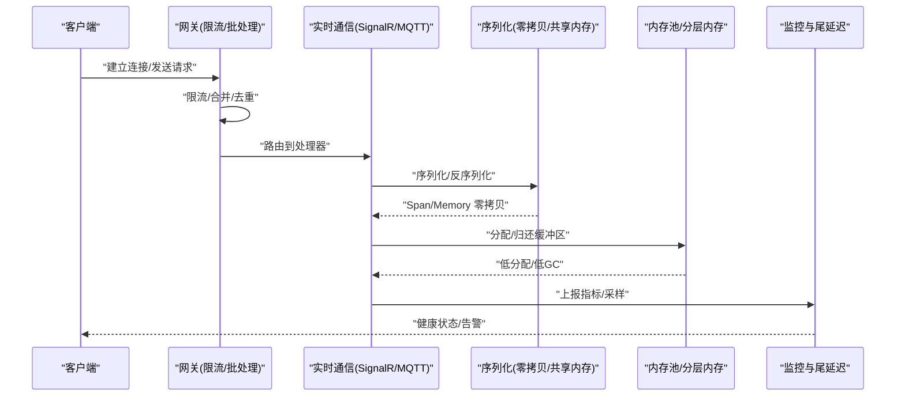
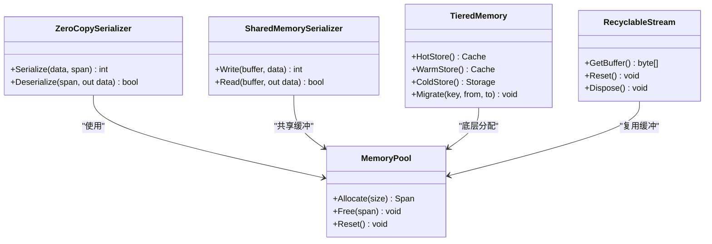
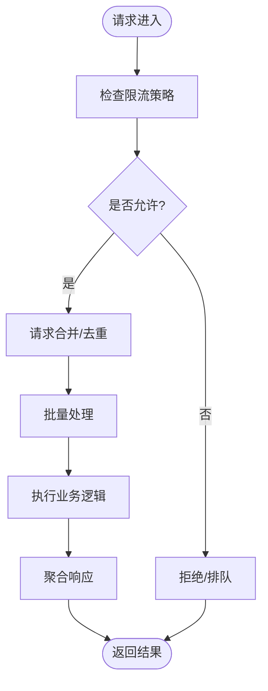
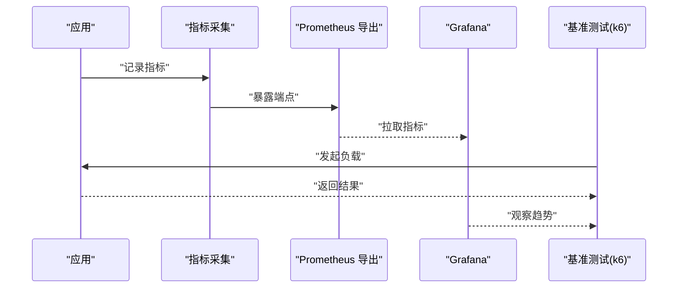
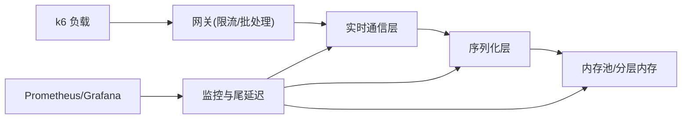

# 性能优化与监控

<cite>
**本文引用的文件**   
- [high_frequency_10m.cs](file://high_frequency_10m.cs)
- [high_frequency_1m.cs](file://high_frequency_1m.cs)
- [high_frequency_100k.cs](file://high_frequency_100k.cs)
- [signalr_optimized.cs](file://signalr_optimized.cs)
- [signalr_production.cs](file://signalr_production.cs)
- [signalr_advanced_monitoring.cs](file://signalr_advanced_monitoring.cs)
- [mqtt_optimized.cs](file://mqtt_optimized.cs)
- [mqtt_advanced_optimization.cs](file://mqtt_advanced_optimization.cs)
- [zero_copy_serializer.cs](file://zero_copy_serializer.cs)
- [span_zero_copy_serializer.cs](file://span_zero_copy_serializer.cs)
- [zero_copy_messagepack.cs](file://zero_copy_messagepack.cs)
- [shared_memory_serializer.cs](file://shared_memory_serializer.cs)
- [shared_memory_messagepack.cs](file://shared_memory_messagepack.cs)
- [recyclable_memorystream.cs](file://recyclable_memorystream.cs)
- [threadsafememorypool_optimized.cs](file://threadsafememorypool_optimized.cs)
- [tiered_memory_integration.cs](file://tiered_memory_integration.cs)
- [tiered_memory_processor.cs](file://tiered_memory_processor.cs)
- [litedb_cacheline.cs](file://litedb_cacheline.cs)
- [rate_limiter.cs](file://rate_limiter.cs)
- [yarp_batch_middleware.cs](file://yarp_batch_middleware.cs)
- [metrics_enhanced.cs](file://metrics_enhanced.cs)
- [prometheus_metrics.cs](file://prometheus_metrics.cs)
- [performance_metrics.cs](file://performance_metrics.cs)
- [tail_latency_optimizer.cs](file://tail_latency_optimizer.cs)
- [watchdog_tail_latency.cs](file://watchdog_tail_latency.cs)
- [benchmark_demo.cs](file://benchmark_demo.cs)
- [k6_todo_benchmark.js](file://k6_todo_benchmark.js)
</cite>

## 目录
1. [简介](#简介)
2. [项目结构](#项目结构)
3. [核心组件](#核心组件)
4. [架构总览](#架构总览)
5. [详细组件分析](#详细组件分析)
6. [依赖关系分析](#依赖关系分析)
7. [性能考量](#性能考量)
8. [故障排查指南](#故障排查指南)
9. [结论](#结论)
10. [附录](#附录)

## 简介
本文件面向实时通信系统的高并发场景，聚焦以下关键优化方向：
- 高并发连接优化：连接池、线程亲和、NUMA感知、CPU缓存友好设计
- 内存管理：内存池、可回收流、分层内存、零拷贝序列化
- 请求合并与批量处理：网关批处理、消息聚合、去重策略
- 连接限流：令牌桶/漏桶、滑动窗口、自适应限流
- 性能监控与调优：指标采集、尾延迟优化、基准测试与评估方法

本仓库包含大量与高性能网络、序列化、内存和监控相关的示例实现，可作为构建生产级实时通信系统的参考。

## 项目结构
本项目采用按能力/主题划分的扁平化组织方式，每个文件通常对应一个具体能力或集成方案。与实时通信性能相关的关键文件包括：
- 高频压测与基准：high_frequency_*.cs、benchmark_demo.cs、k6_todo_benchmark.js
- 实时通信栈优化：signalr_*、mqtt_*
- 零拷贝与共享内存序列化：zero_copy_*、shared_memory_*
- 内存池与可回收流：recyclable_memorystream.cs、threadsafememorypool_optimized.cs、tiered_memory_*
- 缓存友好与局部性：litedb_cacheline.cs
- 限流与批处理：rate_limiter.cs、yarp_batch_middleware.cs
- 监控与尾延迟：metrics_enhanced.cs、prometheus_metrics.cs、performance_metrics.cs、tail_latency_optimizer.cs、watchdog_tail_latency.cs

```mermaid
graph TB
subgraph "压测与基准"
H1["high_frequency_10m.cs"]
H2["high_frequency_1m.cs"]
H3["high_frequency_100k.cs"]
B["benchmark_demo.cs"]
K6["k6_todo_benchmark.js"]
end
subgraph "实时通信"
S1["signalr_optimized.cs"]
S2["signalr_production.cs"]
S3["signalr_advanced_monitoring.cs"]
M1["mqtt_optimized.cs"]
M2["mqtt_advanced_optimization.cs"]
end
subgraph "序列化与内存"
Z1["zero_copy_serializer.cs"]
Z2["span_zero_copy_serializer.cs"]
Z3["zero_copy_messagepack.cs"]
SM1["shared_memory_serializer.cs"]
SM2["shared_memory_messagepack.cs"]
R["recyclable_memorystream.cs"]
P["threadsafememorypool_optimized.cs"]
T1["tiered_memory_integration.cs"]
T2["tiered_memory_processor.cs"]
C["litedb_cacheline.cs"]
end
subgraph "限流与批处理"
RL["rate_limiter.cs"]
YB["yarp_batch_middleware.cs"]
end
subgraph "监控与尾延迟"
ME["metrics_enhanced.cs"]
PM["prometheus_metrics.cs"]
PERM["performance_metrics.cs"]
TL["tail_latency_optimizer.cs"]
WTL["watchdog_tail_latency.cs"]
end
H1 --> S1
H2 --> S1
H3 --> S1
B --> S1
K6 --> S1
S1 --> Z1
S1 --> SM1
S1 --> R
S1 --> P
S1 --> T1
S1 --> C
M1 --> Z1
M1 --> SM1
M1 --> R
M1 --> P
M1 --> T1
M1 --> C
S1 --> RL
S1 --> YB
S1 --> ME
S1 --> PM
S1 --> PERM
S1 --> TL
S1 --> WTL
```

图表来源
- [high_frequency_10m.cs](file://high_frequency_10m.cs)
- [high_frequency_1m.cs](file://high_frequency_1m.cs)
- [high_frequency_100k.cs](file://high_frequency_100k.cs)
- [signalr_optimized.cs](file://signalr_optimized.cs)
- [signalr_production.cs](file://signalr_production.cs)
- [signalr_advanced_monitoring.cs](file://signalr_advanced_monitoring.cs)
- [mqtt_optimized.cs](file://mqtt_optimized.cs)
- [mqtt_advanced_optimization.cs](file://mqtt_advanced_optimization.cs)
- [zero_copy_serializer.cs](file://zero_copy_serializer.cs)
- [span_zero_copy_serializer.cs](file://span_zero_copy_serializer.cs)
- [zero_copy_messagepack.cs](file://zero_copy_messagepack.cs)
- [shared_memory_serializer.cs](file://shared_memory_serializer.cs)
- [shared_memory_messagepack.cs](file://shared_memory_messagepack.cs)
- [recyclable_memorystream.cs](file://recyclable_memorystream.cs)
- [threadsafememorypool_optimized.cs](file://threadsafememorypool_optimized.cs)
- [tiered_memory_integration.cs](file://tiered_memory_integration.cs)
- [tiered_memory_processor.cs](file://tiered_memory_processor.cs)
- [litedb_cacheline.cs](file://litedb_cacheline.cs)
- [rate_limiter.cs](file://rate_limiter.cs)
- [yarp_batch_middleware.cs](file://yarp_batch_middleware.cs)
- [metrics_enhanced.cs](file://metrics_enhanced.cs)
- [prometheus_metrics.cs](file://prometheus_metrics.cs)
- [performance_metrics.cs](file://performance_metrics.cs)
- [tail_latency_optimizer.cs](file://tail_latency_optimizer.cs)
- [watchdog_tail_latency.cs](file://watchdog_tail_latency.cs)

章节来源
- [high_frequency_10m.cs](file://high_frequency_10m.cs)
- [high_frequency_1m.cs](file://high_frequency_1m.cs)
- [high_frequency_100k.cs](file://high_frequency_100k.cs)
- [signalr_optimized.cs](file://signalr_optimized.cs)
- [signalr_production.cs](file://signalr_production.cs)
- [signalr_advanced_monitoring.cs](file://signalr_advanced_monitoring.cs)
- [mqtt_optimized.cs](file://mqtt_optimized.cs)
- [mqtt_advanced_optimization.cs](file://mqtt_advanced_optimization.cs)
- [zero_copy_serializer.cs](file://zero_copy_serializer.cs)
- [span_zero_copy_serializer.cs](file://span_zero_copy_serializer.cs)
- [zero_copy_messagepack.cs](file://zero_copy_messagepack.cs)
- [shared_memory_serializer.cs](file://shared_memory_serializer.cs)
- [shared_memory_messagepack.cs](file://shared_memory_messagepack.cs)
- [recyclable_memorystream.cs](file://recyclable_memorystream.cs)
- [threadsafememorypool_optimized.cs](file://threadsafememorypool_optimized.cs)
- [tiered_memory_integration.cs](file://tiered_memory_integration.cs)
- [tiered_memory_processor.cs](file://tiered_memory_processor.cs)
- [litedb_cacheline.cs](file://litedb_cacheline.cs)
- [rate_limiter.cs](file://rate_limiter.cs)
- [yarp_batch_middleware.cs](file://yarp_batch_middleware.cs)
- [metrics_enhanced.cs](file://metrics_enhanced.cs)
- [prometheus_metrics.cs](file://prometheus_metrics.cs)
- [performance_metrics.cs](file://performance_metrics.cs)
- [tail_latency_optimizer.cs](file://tail_latency_optimizer.cs)
- [watchdog_tail_latency.cs](file://watchdog_tail_latency.cs)

## 核心组件
- 高频压测与基准
  - high_frequency_10m.cs、high_frequency_1m.cs、high_frequency_100k.cs：覆盖不同量级的吞吐压测场景，用于验证连接、序列化、I/O 的极限能力
  - benchmark_demo.cs：通用基准框架入口，便于对比不同实现的性能差异
  - k6_todo_benchmark.js：外部负载生成器脚本，模拟真实客户端行为

- 实时通信栈优化
  - signalr_optimized.cs、signalr_production.cs：SignalR 在高并发下的连接管理、缓冲、序列化与传输优化
  - signalr_advanced_monitoring.cs：接入高级监控指标，支撑运行时诊断
  - mqtt_optimized.cs、mqtt_advanced_optimization.cs：MQTT 连接复用、发布订阅路径优化、QoS 与持久化权衡

- 零拷贝与共享内存序列化
  - zero_copy_serializer.cs、span_zero_copy_serializer.cs、zero_copy_messagepack.cs：基于 Span/Memory 的零拷贝序列化，减少分配与拷贝
  - shared_memory_serializer.cs、shared_memory_messagepack.cs：跨进程/线程共享内存序列化，降低 IPC 成本

- 内存池与可回收流
  - recyclable_memorystream.cs：可重用 Stream 对象，避免频繁 GC
  - threadsafememorypool_optimized.cs：线程安全内存池，适配高并发分配模式
  - tiered_memory_integration.cs、tiered_memory_processor.cs：分层内存（热/温/冷）策略，提升命中率与吞吐

- CPU 缓存友好设计
  - litedb_cacheline.cs：按缓存行对齐的数据布局与访问模式，减少伪共享与缓存抖动

- 连接限流与请求合并
  - rate_limiter.cs：令牌桶/漏桶等限流算法实现，保护后端资源
  - yarp_batch_middleware.cs：网关层请求合并与批处理，降低下游压力

- 监控与尾延迟优化
  - metrics_enhanced.cs、prometheus_metrics.cs、performance_metrics.cs：统一指标采集与导出
  - tail_latency_optimizer.cs、watchdog_tail_latency.cs：尾延迟识别、采样与优化策略

章节来源
- [high_frequency_10m.cs](file://high_frequency_10m.cs)
- [high_frequency_1m.cs](file://high_frequency_1m.cs)
- [high_frequency_100k.cs](file://high_frequency_100k.cs)
- [benchmark_demo.cs](file://benchmark_demo.cs)
- [k6_todo_benchmark.js](file://k6_todo_benchmark.js)
- [signalr_optimized.cs](file://signalr_optimized.cs)
- [signalr_production.cs](file://signalr_production.cs)
- [signalr_advanced_monitoring.cs](file://signalr_advanced_monitoring.cs)
- [mqtt_optimized.cs](file://mqtt_optimized.cs)
- [mqtt_advanced_optimization.cs](file://mqtt_advanced_optimization.cs)
- [zero_copy_serializer.cs](file://zero_copy_serializer.cs)
- [span_zero_copy_serializer.cs](file://span_zero_copy_serializer.cs)
- [zero_copy_messagepack.cs](file://zero_copy_messagepack.cs)
- [shared_memory_serializer.cs](file://shared_memory_serializer.cs)
- [shared_memory_messagepack.cs](file://shared_memory_messagepack.cs)
- [recyclable_memorystream.cs](file://recyclable_memorystream.cs)
- [threadsafememorypool_optimized.cs](file://threadsafememorypool_optimized.cs)
- [tiered_memory_integration.cs](file://tiered_memory_integration.cs)
- [tiered_memory_processor.cs](file://tiered_memory_processor.cs)
- [litedb_cacheline.cs](file://litedb_cacheline.cs)
- [rate_limiter.cs](file://rate_limiter.cs)
- [yarp_batch_middleware.cs](file://yarp_batch_middleware.cs)
- [metrics_enhanced.cs](file://metrics_enhanced.cs)
- [prometheus_metrics.cs](file://prometheus_metrics.cs)
- [performance_metrics.cs](file://performance_metrics.cs)
- [tail_latency_optimizer.cs](file://tail_latency_optimizer.cs)
- [watchdog_tail_latency.cs](file://watchdog_tail_latency.cs)

## 架构总览
下图展示从客户端到服务端的核心数据流与优化点：客户端通过 SignalR/MQTT 建立连接，进入网关层进行限流与批处理；业务层使用零拷贝序列化与共享内存进行高效处理；内存池与分层内存贯穿全链路；监控与尾延迟优化提供运行时洞察与自动调优。

图表来源
- [signalr_optimized.cs](file://signalr_optimized.cs)
- [mqtt_optimized.cs](file://mqtt_optimized.cs)
- [zero_copy_serializer.cs](file://zero_copy_serializer.cs)
- [shared_memory_serializer.cs](file://shared_memory_serializer.cs)
- [recyclable_memorystream.cs](file://recyclable_memorystream.cs)
- [threadsafememorypool_optimized.cs](file://threadsafememorypool_optimized.cs)
- [tiered_memory_integration.cs](file://tiered_memory_integration.cs)
- [metrics_enhanced.cs](file://metrics_enhanced.cs)
- [tail_latency_optimizer.cs](file://tail_latency_optimizer.cs)

## 详细组件分析

### 高并发连接优化
- 连接复用与线程亲和
  - 在 SignalR/MQTT 中，优先复用长连接，减少握手开销
  - 将工作线程绑定到特定 CPU 核，降低上下文切换与缓存失效
  - 针对 NUMA 架构，确保本地内存分配与访问，避免跨节点访问

- CPU 缓存友好设计
  - 数据结构按缓存行对齐，减少伪共享
  - 热点路径避免大对象分配，尽量使用值类型与 Span
  - 批量处理时保持顺序访问，提高预取命中率

章节来源
- [signalr_optimized.cs](file://signalr_optimized.cs)
- [mqtt_optimized.cs](file://mqtt_optimized.cs)
- [litedb_cacheline.cs](file://litedb_cacheline.cs)

### 内存池管理与零拷贝序列化
- 内存池
  - 使用线程安全的内存池，为高频分配场景提供低延迟分配
  - 结合可回收 Stream，避免重复创建与 GC 压力

- 零拷贝序列化
  - 基于 Span/Memory 的序列化，避免中间缓冲与拷贝
  - 共享内存序列化用于跨进程/线程传递，降低 IPC 成本

- 分层内存
  - 热数据驻留高速内存，温冷数据下沉至低成本存储
  - 根据访问频率动态迁移，提升整体命中率

图表来源
- [threadsafememorypool_optimized.cs](file://threadsafememorypool_optimized.cs)
- [zero_copy_serializer.cs](file://zero_copy_serializer.cs)
- [span_zero_copy_serializer.cs](file://span_zero_copy_serializer.cs)
- [zero_copy_messagepack.cs](file://zero_copy_messagepack.cs)
- [shared_memory_serializer.cs](file://shared_memory_serializer.cs)
- [shared_memory_messagepack.cs](file://shared_memory_messagepack.cs)
- [recyclable_memorystream.cs](file://recyclable_memorystream.cs)
- [tiered_memory_integration.cs](file://tiered_memory_integration.cs)
- [tiered_memory_processor.cs](file://tiered_memory_processor.cs)

章节来源
- [threadsafememorypool_optimized.cs](file://threadsafememorypool_optimized.cs)
- [zero_copy_serializer.cs](file://zero_copy_serializer.cs)
- [span_zero_copy_serializer.cs](file://span_zero_copy_serializer.cs)
- [zero_copy_messagepack.cs](file://zero_copy_messagepack.cs)
- [shared_memory_serializer.cs](file://shared_memory_serializer.cs)
- [shared_memory_messagepack.cs](file://shared_memory_messagepack.cs)
- [recyclable_memorystream.cs](file://recyclable_memorystream.cs)
- [tiered_memory_integration.cs](file://tiered_memory_integration.cs)
- [tiered_memory_processor.cs](file://tiered_memory_processor.cs)

### 连接限流、请求合并与批量处理
- 连接限流
  - 令牌桶/漏桶算法控制入站速率，防止雪崩
  - 滑动窗口统计，支持细粒度限流与自适应调整

- 请求合并与批处理
  - 网关层对相似请求进行合并，减少下游调用次数
  - 批量写入与聚合响应，提高吞吐并降低锁竞争

图表来源
- [rate_limiter.cs](file://rate_limiter.cs)
- [yarp_batch_middleware.cs](file://yarp_batch_middleware.cs)

章节来源
- [rate_limiter.cs](file://rate_limiter.cs)
- [yarp_batch_middleware.cs](file://yarp_batch_middleware.cs)

### 性能监控指标、瓶颈分析与调优工具
- 指标采集
  - 统一指标模型，涵盖吞吐、延迟、错误率、内存与 GC
  - Prometheus 导出，支持 Grafana 可视化

- 尾延迟优化
  - 采样长尾请求，定位热点路径与锁竞争
  - 自适应降级与熔断，保障稳定性

- 基准测试
  - 内部基准框架与外部 k6 脚本配合，覆盖多场景负载

图表来源
- [metrics_enhanced.cs](file://metrics_enhanced.cs)
- [prometheus_metrics.cs](file://prometheus_metrics.cs)
- [performance_metrics.cs](file://performance_metrics.cs)
- [tail_latency_optimizer.cs](file://tail_latency_optimizer.cs)
- [watchdog_tail_latency.cs](file://watchdog_tail_latency.cs)
- [k6_todo_benchmark.js](file://k6_todo_benchmark.js)

章节来源
- [metrics_enhanced.cs](file://metrics_enhanced.cs)
- [prometheus_metrics.cs](file://prometheus_metrics.cs)
- [performance_metrics.cs](file://performance_metrics.cs)
- [tail_latency_optimizer.cs](file://tail_latency_optimizer.cs)
- [watchdog_tail_latency.cs](file://watchdog_tail_latency.cs)
- [k6_todo_benchmark.js](file://k6_todo_benchmark.js)

## 依赖关系分析
- 组件耦合
  - 实时通信层依赖序列化与内存池，形成“传输-序列化-内存”三层
  - 监控模块横向贯穿各层，提供观测与告警
  - 限流与批处理位于网关层，影响上游流量与下游压力

- 外部依赖
  - Prometheus/Grafana 用于指标与可视化
  - k6 作为外部负载生成器
  - 可选的共享内存后端（如 OS 共享内存）

图表来源
- [signalr_optimized.cs](file://signalr_optimized.cs)
- [mqtt_optimized.cs](file://mqtt_optimized.cs)
- [zero_copy_serializer.cs](file://zero_copy_serializer.cs)
- [shared_memory_serializer.cs](file://shared_memory_serializer.cs)
- [threadsafememorypool_optimized.cs](file://threadsafememorypool_optimized.cs)
- [tiered_memory_integration.cs](file://tiered_memory_integration.cs)
- [metrics_enhanced.cs](file://metrics_enhanced.cs)
- [prometheus_metrics.cs](file://prometheus_metrics.cs)
- [k6_todo_benchmark.js](file://k6_todo_benchmark.js)

章节来源
- [signalr_optimized.cs](file://signalr_optimized.cs)
- [mqtt_optimized.cs](file://mqtt_optimized.cs)
- [zero_copy_serializer.cs](file://zero_copy_serializer.cs)
- [shared_memory_serializer.cs](file://shared_memory_serializer.cs)
- [threadsafememorypool_optimized.cs](file://threadsafememorypool_optimized.cs)
- [tiered_memory_integration.cs](file://tiered_memory_integration.cs)
- [metrics_enhanced.cs](file://metrics_enhanced.cs)
- [prometheus_metrics.cs](file://prometheus_metrics.cs)
- [k6_todo_benchmark.js](file://k6_todo_benchmark.js)

## 性能考量
- 高并发连接
  - 连接复用、线程亲和、NUMA 本地分配
  - 减少锁粒度，使用无锁队列或分区锁

- 内存与序列化
  - 优先零拷贝与共享内存，避免中间缓冲
  - 使用内存池与可回收流，降低 GC 压力
  - 分层内存策略提升命中率

- 限流与批处理
  - 合理设置限流阈值与批大小，平衡吞吐与延迟
  - 请求合并需考虑幂等性与一致性

- 监控与调优
  - 采集关键指标，关注 p95/p99 延迟与错误率
  - 使用基准测试对比优化前后效果

[本节为通用指导，不直接分析具体文件]

## 故障排查指南
- 常见问题
  - 内存泄漏：检查未归还的缓冲区与 Stream
  - 高 GC：减少临时分配，启用零拷贝序列化
  - 尾延迟：定位热点路径与锁竞争，启用采样与降级

- 诊断工具
  - 指标看板：Prometheus/Grafana
  - 基准测试：internal benchmark + k6
  - 日志与追踪：结合分布式追踪定位问题

章节来源
- [metrics_enhanced.cs](file://metrics_enhanced.cs)
- [prometheus_metrics.cs](file://prometheus_metrics.cs)
- [performance_metrics.cs](file://performance_metrics.cs)
- [tail_latency_optimizer.cs](file://tail_latency_optimizer.cs)
- [watchdog_tail_latency.cs](file://watchdog_tail_latency.cs)
- [benchmark_demo.cs](file://benchmark_demo.cs)
- [k6_todo_benchmark.js](file://k6_todo_benchmark.js)

## 结论
通过连接优化、内存池与零拷贝序列化、限流与批处理、以及完善的监控与尾延迟优化，可在高并发实时通信场景中显著提升吞吐与稳定性。建议在生产环境持续进行基准测试与指标监控，结合负载特征迭代调优。

[本节为总结，不直接分析具体文件]

## 附录
- 基准测试建议
  - 覆盖不同负载模式：突发、平稳、长尾
  - 对比不同序列化与内存策略的效果
  - 使用 k6 模拟真实客户端行为，结合内部基准验证

- 调优清单
  - 连接池大小、线程数、CPU 亲和配置
  - 序列化格式选择（JSON/MessagePack/自定义）
  - 内存池容量与回收策略
  - 限流阈值与批大小参数

[本节为补充信息，不直接分析具体文件]