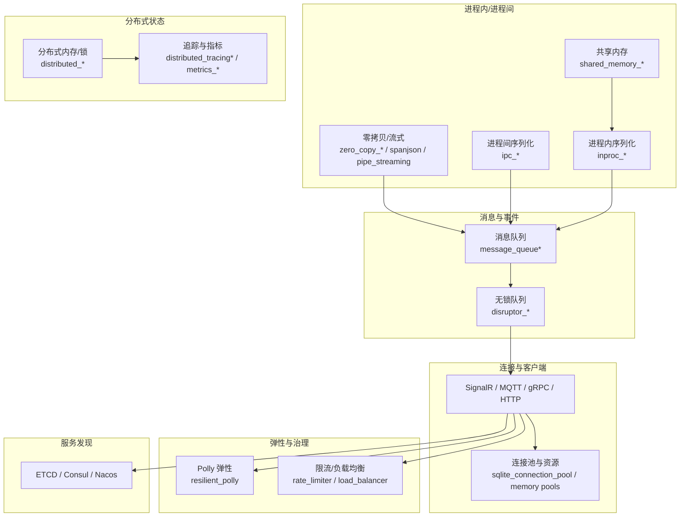
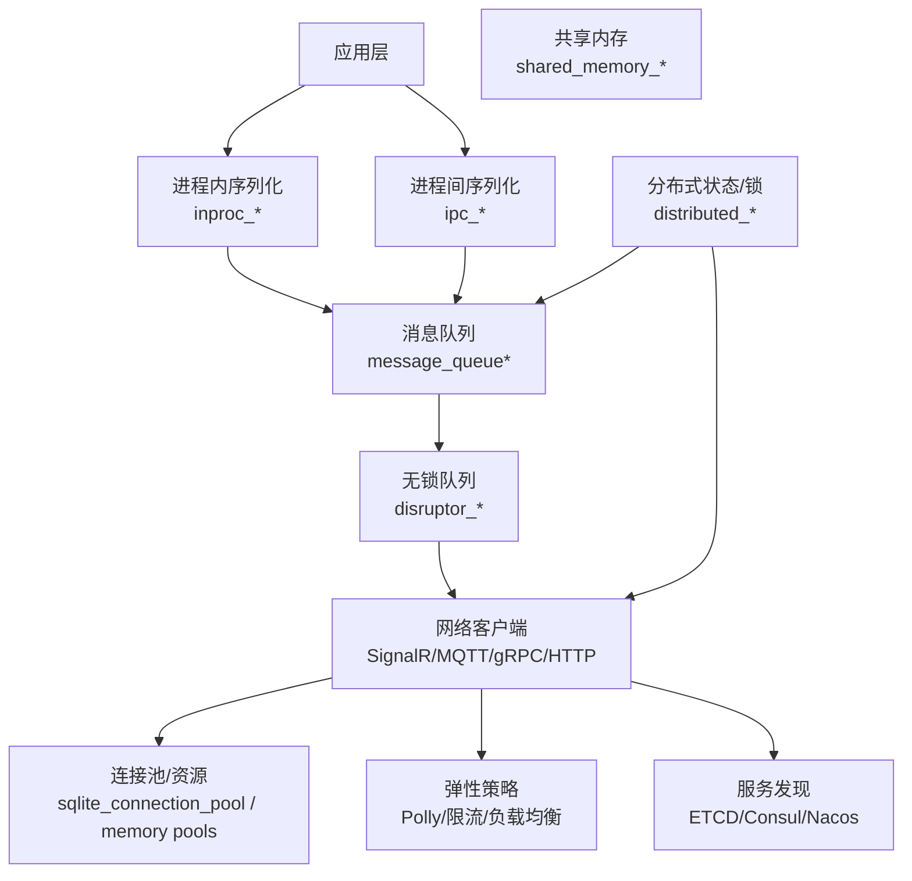
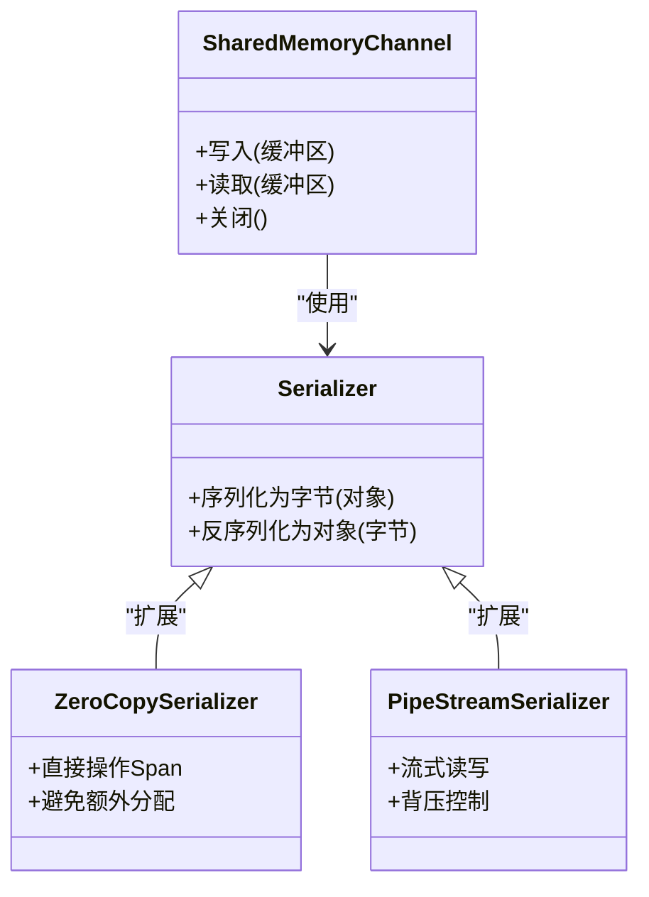
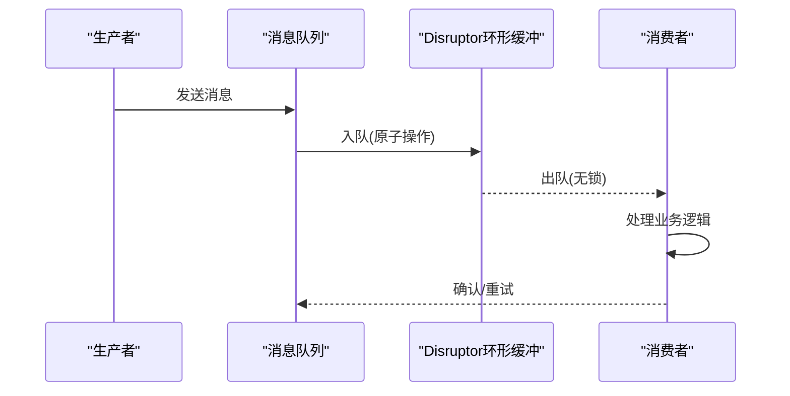
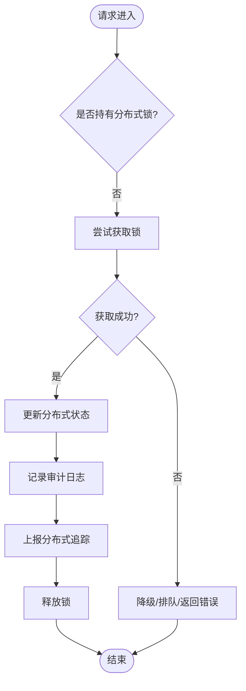
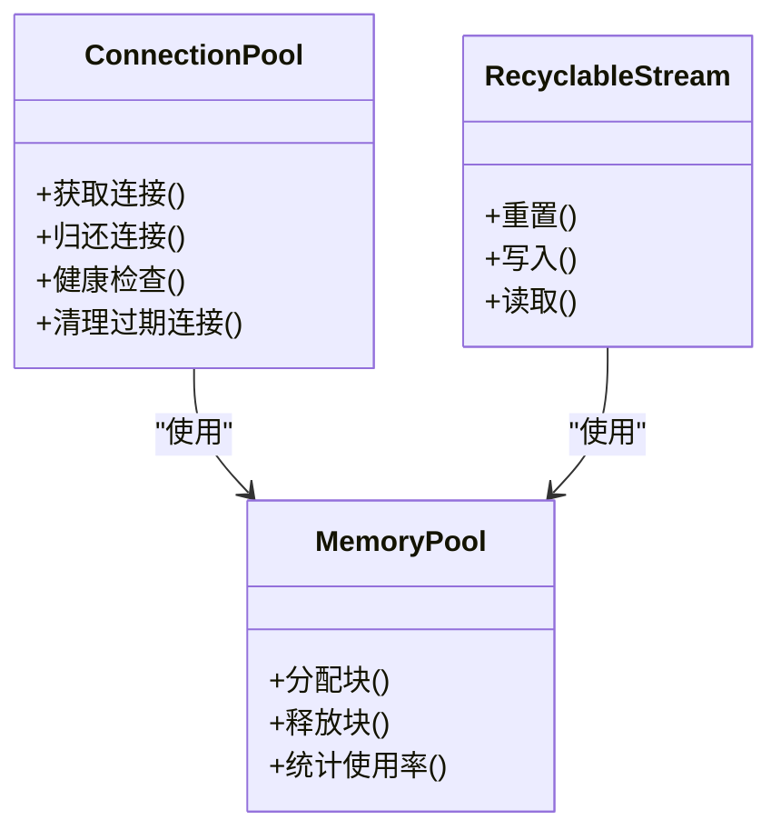
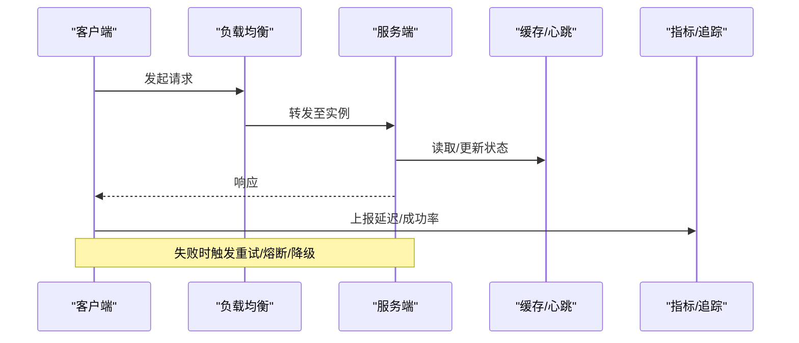
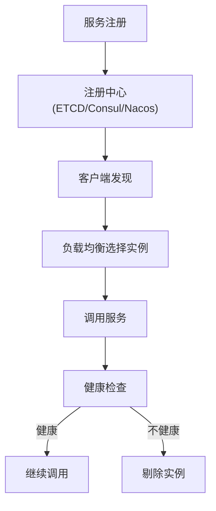
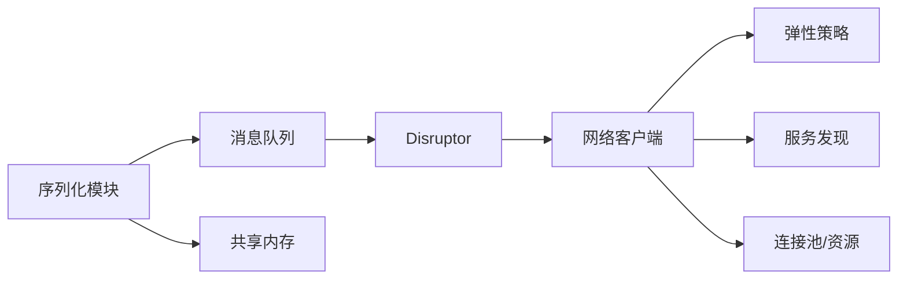

# 连接管理与状态同步

<cite>
**本文引用的文件**   
- [shared_memory_messagepack.cs](file://shared_memory_messagepack.cs)
- [shared_memory_serializer.cs](file://shared_memory_serializer.cs)
- [inproc_json_serializer.cs](file://inproc_json_serializer.cs)
- [inproc_messagepack_serializer.cs](file://inproc_messagepack_serializer.cs)
- [ipc_json_serializer.cs](file://ipc_json_serializer.cs)
- [ipc_messagepack_serializer.cs](file://ipc_messagepack_serializer.cs)
- [message_queue.cs](file://message_queue.cs)
- [message_queue_enhanced.cs](file://message_queue_enhanced.cs)
- [distributed_memory.cs](file://distributed_memory.cs)
- [distributed_file_lock.cs](file://distributed_file_lock.cs)
- [distributed_audit_store.cs](file://distributed_audit_store.cs)
- [distributed_tracing.cs](file://distributed_tracing.cs)
- [distributed_tracing_enhanced.cs](file://distributed_tracing_enhanced.cs)
- [sqlite_connection_pool.cs](file://sqlite_connection_pool.cs)
- [threadsafememorypool_optimized.cs](file://threadsafememorypool_optimized.cs)
- [threadsafememorypool_serializer.cs](file://threadsafememorypool_serializer.cs)
- [recyclable_memorystream.cs](file://recyclable_memorystream.cs)
- [zero_copy_serializer.cs](file://zero_copy_serializer.cs)
- [zero_copy_messagepack.cs](file://zero_copy_messagepack.cs)
- [spanjson_serializer.cs](file://spanjson_serializer.cs)
- [pipe_streaming_serializer.cs](file://pipe_streaming_serializer.cs)
- [high_frequency_1m.cs](file://high_frequency_1m.cs)
- [high_frequency_10m.cs](file://high_frequency_10m.cs)
- [high_frequency_100k.cs](file://high_frequency_100k.cs)
- [disruptor_integration.cs](file://disruptor_integration.cs)
- [disruptor_processor.cs](file://disruptor_processor.cs)
- [disruptor_production_integration.cs](file://disruptor_production_integration.cs)
- [signalr_integration.cs](file://signalr_integration.cs)
- [signalr_advanced.cs](file://signalr_advanced.cs)
- [signalr_monitoring.cs](file://signalr_monitoring.cs)
- [signalr_optimized.cs](file://signalr_optimized.cs)
- [signalr_production.cs](file://signalr_production.cs)
- [mqtt_integration.cs](file://mqtt_integration.cs)
- [mqtt_enhanced.cs](file://mqtt_enhanced.cs)
- [mqtt_optimized.cs](file://mqtt_optimized.cs)
- [grpc_integration.cs](file://grpc_integration.cs)
- [restsharp_integration.cs](file://restsharp_integration.cs)
- [refit_integration.cs](file://refit_integration.cs)
- [webapiclientcore_integration.cs](file://webapiclientcore_integration.cs)
- [resilient_polly_integration.cs](file://resilient_polly_integration.cs)
- [cache_heartbeat_integration.cs](file://cache_heartbeat_integration.cs)
- [cache_hybrid_integration.cs](file://cache_hybrid_integration.cs)
- [etcd_integration.cs](file://etcd_integration.cs)
- [consul_integration.cs](file://consul_integration.cs)
- [nacos_integration.cs](file://nacos_integration.cs)
- [service_discovery_integration.cs](file://service_discovery_integration.cs)
- [service_discovery_advanced_integration.cs](file://service_discovery_advanced_integration.cs)
- [load_balancer.cs](file://load_balancer.cs)
- [rate_limiter.cs](file://rate_limiter.cs)
- [tail_latency_optimizer.cs](file://tail_latency_optimizer.cs)
- [performance_metrics.cs](file://performance_metrics.cs)
- [metrics_influxdb.cs](file://metrics_influxdb.cs)
- [metrics_monitoring.cs](file://metrics_monitoring.cs)
</cite>

## 目录
1. [简介](#简介)
2. [项目结构](#项目结构)
3. [核心组件](#核心组件)
4. [架构总览](#架构总览)
5. [详细组件分析](#详细组件分析)
6. [依赖关系分析](#依赖关系分析)
7. [性能考量](#性能考量)
8. [故障排查指南](#故障排查指南)
9. [结论](#结论)
10. [附录](#附录)

## 简介
本文件围绕“连接管理与状态同步”展开，聚焦多进程间通信、共享内存管理、进程内消息传递机制；同时覆盖连接池设计、连接复用与资源清理策略；分布式状态同步、冲突解决与数据一致性保证；连接健康检查、自动重连与优雅降级；以及不同通信模式的性能对比与适用场景选择。文档以仓库中的相关实现为依据，提供可操作的指导与可视化图示，帮助读者快速理解并落地高可靠、高性能的连接与状态方案。

## 项目结构
本项目采用按能力域组织文件的风格，将连接与状态相关的实现分散在多个文件中：
- 进程内/进程间序列化与传输：inproc_*、ipc_*、shared_memory_*、zero_copy_*、spanjson、pipe_streaming
- 消息队列与事件总线：message_queue*、disruptor_*
- 分布式状态与锁：distributed_memory、distributed_file_lock、distributed_audit_store
- 分布式追踪与指标：distributed_tracing*、metrics_*、performance_metrics
- 连接池与资源管理：sqlite_connection_pool、threadsafe memory pool、recyclable memorystream
- 网络通信与客户端：signalr、mqtt、grpc、restsharp、refit、webapiclientcore
- 弹性与治理：resilient_polly、rate_limiter、load_balancer、tail_latency_optimizer
- 服务发现与配置中心：etcd、consul、nacos、service_discovery*

**图表来源** 
- [shared_memory_messagepack.cs](file://shared_memory_messagepack.cs)
- [shared_memory_serializer.cs](file://shared_memory_serializer.cs)
- [inproc_json_serializer.cs](file://inproc_json_serializer.cs)
- [inproc_messagepack_serializer.cs](file://inproc_messagepack_serializer.cs)
- [ipc_json_serializer.cs](file://ipc_json_serializer.cs)
- [ipc_messagepack_serializer.cs](file://ipc_messagepack_serializer.cs)
- [message_queue.cs](file://message_queue.cs)
- [message_queue_enhanced.cs](file://message_queue_enhanced.cs)
- [disruptor_integration.cs](file://disruptor_integration.cs)
- [disruptor_processor.cs](file://disruptor_processor.cs)
- [signalr_integration.cs](file://signalr_integration.cs)
- [mqtt_integration.cs](file://mqtt_integration.cs)
- [grpc_integration.cs](file://grpc_integration.cs)
- [restsharp_integration.cs](file://restsharp_integration.cs)
- [refit_integration.cs](file://refit_integration.cs)
- [webapiclientcore_integration.cs](file://webapiclientcore_integration.cs)
- [sqlite_connection_pool.cs](file://sqlite_connection_pool.cs)
- [threadsafememorypool_optimized.cs](file://threadsafememorypool_optimized.cs)
- [threadsafememorypool_serializer.cs](file://threadsafememorypool_serializer.cs)
- [recyclable_memorystream.cs](file://recyclable_memorystream.cs)
- [zero_copy_serializer.cs](file://zero_copy_serializer.cs)
- [zero_copy_messagepack.cs](file://zero_copy_messagepack.cs)
- [spanjson_serializer.cs](file://spanjson_serializer.cs)
- [pipe_streaming_serializer.cs](file://pipe_streaming_serializer.cs)
- [distributed_memory.cs](file://distributed_memory.cs)
- [distributed_file_lock.cs](file://distributed_file_lock.cs)
- [distributed_tracing.cs](file://distributed_tracing.cs)
- [distributed_tracing_enhanced.cs](file://distributed_tracing_enhanced.cs)
- [resilient_polly_integration.cs](file://resilient_polly_integration.cs)
- [rate_limiter.cs](file://rate_limiter.cs)
- [load_balancer.cs](file://load_balancer.cs)
- [etcd_integration.cs](file://etcd_integration.cs)
- [consul_integration.cs](file://consul_integration.cs)
- [nacos_integration.cs](file://nacos_integration.cs)
- [service_discovery_integration.cs](file://service_discovery_integration.cs)
- [service_discovery_advanced_integration.cs](file://service_discovery_advanced_integration.cs)

**章节来源**
- [shared_memory_messagepack.cs](file://shared_memory_messagepack.cs)
- [shared_memory_serializer.cs](file://shared_memory_serializer.cs)
- [inproc_json_serializer.cs](file://inproc_json_serializer.cs)
- [inproc_messagepack_serializer.cs](file://inproc_messagepack_serializer.cs)
- [ipc_json_serializer.cs](file://ipc_json_serializer.cs)
- [ipc_messagepack_serializer.cs](file://ipc_messagepack_serializer.cs)
- [message_queue.cs](file://message_queue.cs)
- [message_queue_enhanced.cs](file://message_queue_enhanced.cs)
- [disruptor_integration.cs](file://disruptor_integration.cs)
- [disruptor_processor.cs](file://disruptor_processor.cs)
- [signalr_integration.cs](file://signalr_integration.cs)
- [mqtt_integration.cs](file://mqtt_integration.cs)
- [grpc_integration.cs](file://grpc_integration.cs)
- [restsharp_integration.cs](file://restsharp_integration.cs)
- [refit_integration.cs](file://refit_integration.cs)
- [webapiclientcore_integration.cs](file://webapiclientcore_integration.cs)
- [sqlite_connection_pool.cs](file://sqlite_connection_pool.cs)
- [threadsafememorypool_optimized.cs](file://threadsafememorypool_optimized.cs)
- [threadsafememorypool_serializer.cs](file://threadsafemmemorypool_serializer.cs)
- [recyclable_memorystream.cs](file://recyclable_memorystream.cs)
- [zero_copy_serializer.cs](file://zero_copy_serializer.cs)
- [zero_copy_messagepack.cs](file://zero_copy_messagepack.cs)
- [spanjson_serializer.cs](file://spanjson_serializer.cs)
- [pipe_streaming_serializer.cs](file://pipe_streaming_serializer.cs)
- [distributed_memory.cs](file://distributed_memory.cs)
- [distributed_file_lock.cs](file://distributed_file_lock.cs)
- [distributed_tracing.cs](file://distributed_tracing.cs)
- [distributed_tracing_enhanced.cs](file://distributed_tracing_enhanced.cs)
- [resilient_polly_integration.cs](file://resilient_polly_integration.cs)
- [rate_limiter.cs](file://rate_limiter.cs)
- [load_balancer.cs](file://load_balancer.cs)
- [etcd_integration.cs](file://etcd_integration.cs)
- [consul_integration.cs](file://consul_integration.cs)
- [nacos_integration.cs](file://nacos_integration.cs)
- [service_discovery_integration.cs](file://service_discovery_integration.cs)
- [service_discovery_advanced_integration.cs](file://service_discovery_advanced_integration.cs)

## 核心组件
- 共享内存与序列化
  - 共享内存通道用于跨进程低延迟数据传输，配合高效序列化器（MessagePack/JSON）降低CPU开销。
  - 零拷贝与Span优化减少GC压力，提升吞吐。
- 进程内/进程间消息队列
  - 基于环形缓冲的无锁队列（Disruptor）实现高吞吐、低延迟的消息分发。
  - 通用消息队列封装统一的生产/消费接口，支持持久化与重试。
- 分布式状态与锁
  - 分布式内存存储与文件锁用于跨进程/节点的状态协调与互斥。
  - 审计日志与追踪为状态变更提供可观测性。
- 连接池与资源管理
  - SQLite连接池、线程安全内存池、可回收内存流等组件保障资源复用与释放。
- 网络通信与客户端
  - SignalR/MQTT/gRPC/HTTP 等多协议适配，结合弹性策略（重试、熔断、退避）提升稳定性。
- 服务发现与负载均衡
  - 通过ETCD/Consul/Nacos进行服务注册与发现，结合负载均衡与限流策略保障系统弹性。

**章节来源**
- [shared_memory_messagepack.cs](file://shared_memory_messagepack.cs)
- [shared_memory_serializer.cs](file://shared_memory_serializer.cs)
- [inproc_json_serializer.cs](file://inproc_json_serializer.cs)
- [inproc_messagepack_serializer.cs](file://inproc_messagepack_serializer.cs)
- [ipc_json_serializer.cs](file://ipc_json_serializer.cs)
- [ipc_messagepack_serializer.cs](file://ipc_messagepack_serializer.cs)
- [message_queue.cs](file://message_queue.cs)
- [message_queue_enhanced.cs](file://message_queue_enhanced.cs)
- [disruptor_integration.cs](file://disruptor_integration.cs)
- [disruptor_processor.cs](file://disruptor_processor.cs)
- [distributed_memory.cs](file://distributed_memory.cs)
- [distributed_file_lock.cs](file://distributed_file_lock.cs)
- [distributed_audit_store.cs](file://distributed_audit_store.cs)
- [distributed_tracing.cs](file://distributed_tracing.cs)
- [distributed_tracing_enhanced.cs](file://distributed_tracing_enhanced.cs)
- [sqlite_connection_pool.cs](file://sqlite_connection_pool.cs)
- [threadsafememorypool_optimized.cs](file://threadsafememorypool_optimized.cs)
- [threadsafememorypool_serializer.cs](file://threadsafememorypool_serializer.cs)
- [recyclable_memorystream.cs](file://recyclable_memorystream.cs)
- [zero_copy_serializer.cs](file://zero_copy_serializer.cs)
- [zero_copy_messagepack.cs](file://zero_copy_messagepack.cs)
- [spanjson_serializer.cs](file://spanjson_serializer.cs)
- [pipe_streaming_serializer.cs](file://pipe_streaming_serializer.cs)
- [signalr_integration.cs](file://signalr_integration.cs)
- [mqtt_integration.cs](file://mqtt_integration.cs)
- [grpc_integration.cs](file://grpc_integration.cs)
- [restsharp_integration.cs](file://restsharp_integration.cs)
- [refit_integration.cs](file://refit_integration.cs)
- [webapiclientcore_integration.cs](file://webapiclientcore_integration.cs)
- [resilient_polly_integration.cs](file://resilient_polly_integration.cs)
- [rate_limiter.cs](file://rate_limiter.cs)
- [load_balancer.cs](file://load_balancer.cs)
- [etcd_integration.cs](file://etcd_integration.cs)
- [consul_integration.cs](file://consul_integration.cs)
- [nacos_integration.cs](file://nacos_integration.cs)
- [service_discovery_integration.cs](file://service_discovery_integration.cs)
- [service_discovery_advanced_integration.cs](file://service_discovery_advanced_integration.cs)

## 架构总览
下图展示从应用层到传输层的整体架构，包括共享内存、消息队列、分布式状态、连接池与网络客户端之间的交互。

**图表来源**
- [inproc_json_serializer.cs](file://inproc_json_serializer.cs)
- [inproc_messagepack_serializer.cs](file://inproc_messagepack_serializer.cs)
- [ipc_json_serializer.cs](file://ipc_json_serializer.cs)
- [ipc_messagepack_serializer.cs](file://ipc_messagepack_serializer.cs)
- [shared_memory_messagepack.cs](file://shared_memory_messagepack.cs)
- [shared_memory_serializer.cs](file://shared_memory_serializer.cs)
- [message_queue.cs](file://message_queue.cs)
- [message_queue_enhanced.cs](file://message_queue_enhanced.cs)
- [disruptor_integration.cs](file://disruptor_integration.cs)
- [disruptor_processor.cs](file://disruptor_processor.cs)
- [distributed_memory.cs](file://distributed_memory.cs)
- [distributed_file_lock.cs](file://distributed_file_lock.cs)
- [sqlite_connection_pool.cs](file://sqlite_connection_pool.cs)
- [signalr_integration.cs](file://signalr_integration.cs)
- [mqtt_integration.cs](file://mqtt_integration.cs)
- [grpc_integration.cs](file://grpc_integration.cs)
- [restsharp_integration.cs](file://restsharp_integration.cs)
- [refit_integration.cs](file://refit_integration.cs)
- [webapiclientcore_integration.cs](file://webapiclientcore_integration.cs)
- [resilient_polly_integration.cs](file://resilient_polly_integration.cs)
- [rate_limiter.cs](file://rate_limiter.cs)
- [load_balancer.cs](file://load_balancer.cs)
- [etcd_integration.cs](file://etcd_integration.cs)
- [consul_integration.cs](file://consul_integration.cs)
- [nacos_integration.cs](file://nacos_integration.cs)
- [service_discovery_integration.cs](file://service_discovery_integration.cs)
- [service_discovery_advanced_integration.cs](file://service_discovery_advanced_integration.cs)

## 详细组件分析

### 共享内存与进程内/进程间序列化
- 目标
  - 提供跨进程的低延迟、高吞吐数据通道，最小化序列化与内存分配开销。
- 关键实现
  - 共享内存通道与高效序列化器（MessagePack/JSON）。
  - Span/零拷贝序列化减少GC压力。
  - 管道流式序列化用于大数据量传输。
- 适用场景
  - 同机多进程高频通信（如采集/处理流水线）。
  - 大对象或流式数据的跨进程传输。

**图表来源**
- [shared_memory_messagepack.cs](file://shared_memory_messagepack.cs)
- [shared_memory_serializer.cs](file://shared_memory_serializer.cs)
- [inproc_json_serializer.cs](file://inproc_json_serializer.cs)
- [inproc_messagepack_serializer.cs](file://inproc_messagepack_serializer.cs)
- [ipc_json_serializer.cs](file://ipc_json_serializer.cs)
- [ipc_messagepack_serializer.cs](file://ipc_messagepack_serializer.cs)
- [zero_copy_serializer.cs](file://zero_copy_serializer.cs)
- [zero_copy_messagepack.cs](file://zero_copy_messagepack.cs)
- [spanjson_serializer.cs](file://spanjson_serializer.cs)
- [pipe_streaming_serializer.cs](file://pipe_streaming_serializer.cs)

**章节来源**
- [shared_memory_messagepack.cs](file://shared_memory_messagepack.cs)
- [shared_memory_serializer.cs](file://shared_memory_serializer.cs)
- [inproc_json_serializer.cs](file://inproc_json_serializer.cs)
- [inproc_messagepack_serializer.cs](file://inproc_messagepack_serializer.cs)
- [ipc_json_serializer.cs](file://ipc_json_serializer.cs)
- [ipc_messagepack_serializer.cs](file://ipc_messagepack_serializer.cs)
- [zero_copy_serializer.cs](file://zero_copy_serializer.cs)
- [zero_copy_messagepack.cs](file://zero_copy_messagepack.cs)
- [spanjson_serializer.cs](file://spanjson_serializer.cs)
- [pipe_streaming_serializer.cs](file://pipe_streaming_serializer.cs)

### 消息队列与无锁队列（Disruptor）
- 目标
  - 提供高吞吐、低延迟的消息分发与缓冲，解耦生产与消费。
- 关键实现
  - 通用消息队列封装生产/消费接口，支持持久化与重试。
  - Disruptor环形缓冲实现无锁队列，最大化吞吐。
- 适用场景
  - 高频事件处理、实时数据处理、背压场景。

**图表来源**
- [message_queue.cs](file://message_queue.cs)
- [message_queue_enhanced.cs](file://message_queue_enhanced.cs)
- [disruptor_integration.cs](file://disruptor_integration.cs)
- [disruptor_processor.cs](file://disruptor_processor.cs)

**章节来源**
- [message_queue.cs](file://message_queue.cs)
- [message_queue_enhanced.cs](file://message_queue_enhanced.cs)
- [disruptor_integration.cs](file://disruptor_integration.cs)
- [disruptor_processor.cs](file://disruptor_processor.cs)

### 分布式状态与锁
- 目标
  - 在多进程/多节点环境下维护一致的状态与互斥访问。
- 关键实现
  - 分布式内存存储与文件锁用于协调状态。
  - 审计日志与分布式追踪记录状态变更与调用链。
- 适用场景
  - 分布式任务调度、分布式锁、全局配置与状态同步。

**图表来源**
- [distributed_memory.cs](file://distributed_memory.cs)
- [distributed_file_lock.cs](file://distributed_file_lock.cs)
- [distributed_audit_store.cs](file://distributed_audit_store.cs)
- [distributed_tracing.cs](file://distributed_tracing.cs)
- [distributed_tracing_enhanced.cs](file://distributed_tracing_enhanced.cs)

**章节来源**
- [distributed_memory.cs](file://distributed_memory.cs)
- [distributed_file_lock.cs](file://distributed_file_lock.cs)
- [distributed_audit_store.cs](file://distributed_audit_store.cs)
- [distributed_tracing.cs](file://distributed_tracing.cs)
- [distributed_tracing_enhanced.cs](file://distributed_tracing_enhanced.cs)

### 连接池与资源管理
- 目标
  - 复用连接与内存资源，降低创建/销毁成本，防止资源泄漏。
- 关键实现
  - SQLite连接池管理数据库连接生命周期。
  - 线程安全内存池与可回收内存流减少分配与GC。
- 适用场景
  - 高并发I/O、频繁短连接、大数据处理。

**图表来源**
- [sqlite_connection_pool.cs](file://sqlite_connection_pool.cs)
- [threadsafememorypool_optimized.cs](file://threadsafememorypool_optimized.cs)
- [threadsafememorypool_serializer.cs](file://threadsafememorypool_serializer.cs)
- [recyclable_memorystream.cs](file://recyclable_memorystream.cs)

**章节来源**
- [sqlite_connection_pool.cs](file://sqlite_connection_pool.cs)
- [threadsafememorypool_optimized.cs](file://threadsafememorypool_optimized.cs)
- [threadsafememorypool_serializer.cs](file://threadsafememorypool_serializer.cs)
- [recyclable_memorystream.cs](file://recyclable_memorystream.cs)

### 网络通信与客户端（SignalR/MQTT/gRPC/HTTP）
- 目标
  - 提供统一的客户端接入与弹性治理能力，确保稳定可靠的远程调用。
- 关键实现
  - SignalR用于实时双向通信；MQTT用于设备/物联网场景；gRPC用于高性能RPC；HTTP用于REST服务。
  - 集成Polly实现重试、熔断、超时与退避策略。
- 适用场景
  - 实时推送、设备接入、微服务间调用、外部API网关。

**图表来源**
- [signalr_integration.cs](file://signalr_integration.cs)
- [signalr_advanced.cs](file://signalr_advanced.cs)
- [signalr_monitoring.cs](file://signalr_monitoring.cs)
- [signalr_optimized.cs](file://signalr_optimized.cs)
- [signalr_production.cs](file://signalr_production.cs)
- [mqtt_integration.cs](file://mqtt_integration.cs)
- [mqtt_enhanced.cs](file://mqtt_enhanced.cs)
- [mqtt_optimized.cs](file://mqtt_optimized.cs)
- [grpc_integration.cs](file://grpc_integration.cs)
- [restsharp_integration.cs](file://restsharp_integration.cs)
- [refit_integration.cs](file://refit_integration.cs)
- [webapiclientcore_integration.cs](file://webapiclientcore_integration.cs)
- [resilient_polly_integration.cs](file://resilient_polly_integration.cs)
- [cache_heartbeat_integration.cs](file://cache_heartbeat_integration.cs)
- [cache_hybrid_integration.cs](file://cache_hybrid_integration.cs)

**章节来源**
- [signalr_integration.cs](file://signalr_integration.cs)
- [signalr_advanced.cs](file://signalr_advanced.cs)
- [signalr_monitoring.cs](file://signalr_monitoring.cs)
- [signalr_optimized.cs](file://signalr_optimized.cs)
- [signalr_production.cs](file://signalr_production.cs)
- [mqtt_integration.cs](file://mqtt_integration.cs)
- [mqtt_enhanced.cs](file://mqtt_enhanced.cs)
- [mqtt_optimized.cs](file://mqtt_optimized.cs)
- [grpc_integration.cs](file://grpc_integration.cs)
- [restsharp_integration.cs](file://restsharp_integration.cs)
- [refit_integration.cs](file://refit_integration.cs)
- [webapiclientcore_integration.cs](file://webapiclientcore_integration.cs)
- [resilient_polly_integration.cs](file://resilient_polly_integration.cs)
- [cache_heartbeat_integration.cs](file://cache_heartbeat_integration.cs)
- [cache_hybrid_integration.cs](file://cache_hybrid_integration.cs)

### 服务发现与负载均衡
- 目标
  - 动态发现可用服务实例，合理分配流量，提高可用性。
- 关键实现
  - 通过ETCD/Consul/Nacos注册与发现服务。
  - 结合负载均衡与限流策略，避免单点过载。
- 适用场景
  - 微服务架构、容器化部署、动态扩缩容。

**图表来源**
- [etcd_integration.cs](file://etcd_integration.cs)
- [consul_integration.cs](file://consul_integration.cs)
- [nacos_integration.cs](file://nacos_integration.cs)
- [service_discovery_integration.cs](file://service_discovery_integration.cs)
- [service_discovery_advanced_integration.cs](file://service_discovery_advanced_integration.cs)
- [load_balancer.cs](file://load_balancer.cs)
- [rate_limiter.cs](file://rate_limiter.cs)

**章节来源**
- [etcd_integration.cs](file://etcd_integration.cs)
- [consul_integration.cs](file://consul_integration.cs)
- [nacos_integration.cs](file://nacos_integration.cs)
- [service_discovery_integration.cs](file://service_discovery_integration.cs)
- [service_discovery_advanced_integration.cs](file://service_discovery_advanced_integration.cs)
- [load_balancer.cs](file://load_balancer.cs)
- [rate_limiter.cs](file://rate_limiter.cs)

## 依赖关系分析
- 组件耦合
  - 序列化模块被共享内存与消息队列共同依赖，需保持兼容性与版本一致性。
  - 网络客户端依赖弹性策略与服务发现，形成稳定的调用链路。
- 外部依赖
  - 注册中心（ETCD/Consul/Nacos）、消息中间件（可选）、数据库（SQLite）等。
- 潜在循环依赖
  - 通过抽象接口与依赖注入避免循环引用，确保模块边界清晰。

**图表来源**
- [inproc_json_serializer.cs](file://inproc_json_serializer.cs)
- [inproc_messagepack_serializer.cs](file://inproc_messagepack_serializer.cs)
- [ipc_json_serializer.cs](file://ipc_json_serializer.cs)
- [ipc_messagepack_serializer.cs](file://ipc_messagepack_serializer.cs)
- [shared_memory_messagepack.cs](file://shared_memory_messagepack.cs)
- [message_queue.cs](file://message_queue.cs)
- [disruptor_integration.cs](file://disruptor_integration.cs)
- [signalr_integration.cs](file://signalr_integration.cs)
- [mqtt_integration.cs](file://mqtt_integration.cs)
- [grpc_integration.cs](file://grpc_integration.cs)
- [restsharp_integration.cs](file://restsharp_integration.cs)
- [refit_integration.cs](file://refit_integration.cs)
- [webapiclientcore_integration.cs](file://webapiclientcore_integration.cs)
- [resilient_polly_integration.cs](file://resilient_polly_integration.cs)
- [service_discovery_integration.cs](file://service_discovery_integration.cs)
- [sqlite_connection_pool.cs](file://sqlite_connection_pool.cs)

**章节来源**
- [inproc_json_serializer.cs](file://inproc_json_serializer.cs)
- [inproc_messagepack_serializer.cs](file://inproc_messagepack_serializer.cs)
- [ipc_json_serializer.cs](file://ipc_json_serializer.cs)
- [ipc_messagepack_serializer.cs](file://ipc_messagepack_serializer.cs)
- [shared_memory_messagepack.cs](file://shared_memory_messagepack.cs)
- [message_queue.cs](file://message_queue.cs)
- [disruptor_integration.cs](file://disruptor_integration.cs)
- [signalr_integration.cs](file://signalr_integration.cs)
- [mqtt_integration.cs](file://mqtt_integration.cs)
- [grpc_integration.cs](file://grpc_integration.cs)
- [restsharp_integration.cs](file://restsharp_integration.cs)
- [refit_integration.cs](file://refit_integration.cs)
- [webapiclientcore_integration.cs](file://webapiclientcore_integration.cs)
- [resilient_polly_integration.cs](file://resilient_polly_integration.cs)
- [service_discovery_integration.cs](file://service_discovery_integration.cs)
- [sqlite_connection_pool.cs](file://sqlite_connection_pool.cs)

## 性能考量
- 通信模式对比
  - 共享内存+零拷贝：极低延迟、极高吞吐，适合同机多进程高频通信。
  - 进程内序列化（MessagePack/JSON）：平衡易用性与性能，适合进程内消息传递。
  - 进程间序列化（IPC）：跨进程隔离，适合模块化与独立部署。
  - 网络客户端（SignalR/MQTT/gRPC/HTTP）：跨主机通信，gRPC与MQTT在高吞吐场景表现更佳。
- 适用场景选择
  - 同机高频：优先共享内存+零拷贝+Disruptor。
  - 跨进程：IPC序列化+消息队列。
  - 跨主机：gRPC/MQTT/SignalR根据实时性与协议需求选择。
- 资源与内存
  - 使用内存池与可回收流减少分配与GC。
  - 连接池复用数据库与网络连接，避免频繁创建销毁。
- 监控与调优
  - 通过指标与追踪定位瓶颈，调整队列长度、批大小、超时与重试策略。

[本节为通用指导，不直接分析具体文件]

## 故障排查指南
- 常见问题
  - 连接池耗尽：检查连接获取/归还路径，增加池大小或优化使用时长。
  - 序列化异常：核对协议版本与字段兼容性，启用校验与回滚。
  - 消息堆积：扩大队列容量或提升消费者并行度，启用背压。
  - 分布式锁竞争：评估锁粒度与持有时间，必要时引入多级锁或队列化。
  - 网络抖动：配置合理的超时、重试与熔断阈值，启用降级策略。
- 诊断手段
  - 启用分布式追踪与指标上报，观察延迟分布与错误率。
  - 使用健康检查与探针识别不稳定实例。
  - 审计日志记录关键状态变更，便于回溯问题。

**章节来源**
- [distributed_tracing.cs](file://distributed_tracing.cs)
- [distributed_tracing_enhanced.cs](file://distributed_tracing_enhanced.cs)
- [performance_metrics.cs](file://performance_metrics.cs)
- [metrics_influxdb.cs](file://metrics_influxdb.cs)
- [metrics_monitoring.cs](file://metrics_monitoring.cs)
- [cache_heartbeat_integration.cs](file://cache_heartbeat_integration.cs)
- [sqlite_connection_pool.cs](file://sqlite_connection_pool.cs)
- [message_queue.cs](file://message_queue.cs)
- [distributed_file_lock.cs](file://distributed_file_lock.cs)

## 结论
通过共享内存与高效序列化、无锁队列、分布式状态与锁、连接池与资源管理、网络客户端与弹性策略、服务发现与负载均衡的综合运用，可实现高可靠、高性能的连接管理与状态同步体系。建议根据实际场景选择合适的通信模式与参数配置，并通过指标与追踪持续优化系统性能与稳定性。

[本节为总结性内容，不直接分析具体文件]

## 附录
- 基准测试参考
  - 高频场景基准：high_frequency_1m、high_frequency_10m、high_frequency_100k
  - 尾延迟优化：tail_latency_optimizer
- 最佳实践清单
  - 明确边界：进程内/进程间/跨主机的职责划分。
  - 资源复用：连接池、内存池、流式序列化。
  - 弹性治理：重试、熔断、退避、限流、负载均衡。
  - 可观测性：追踪、指标、审计日志与健康检查。
  - 一致性：分布式锁、状态快照、冲突解决策略。

**章节来源**
- [high_frequency_1m.cs](file://high_frequency_1m.cs)
- [high_frequency_10m.cs](file://high_frequency_10m.cs)
- [high_frequency_100k.cs](file://high_frequency_100k.cs)
- [tail_latency_optimizer.cs](file://tail_latency_optimizer.cs)