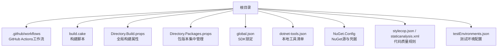
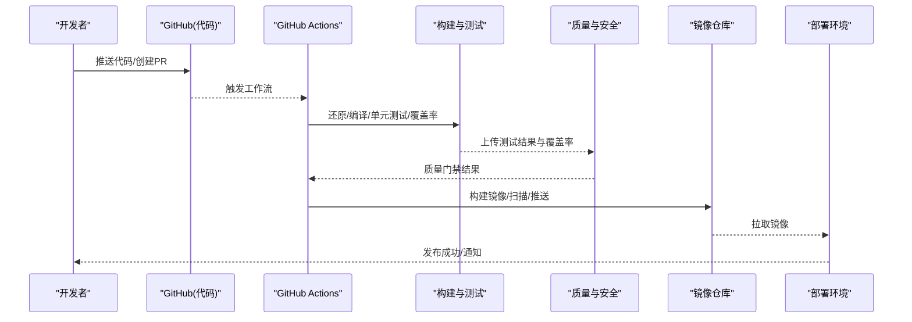
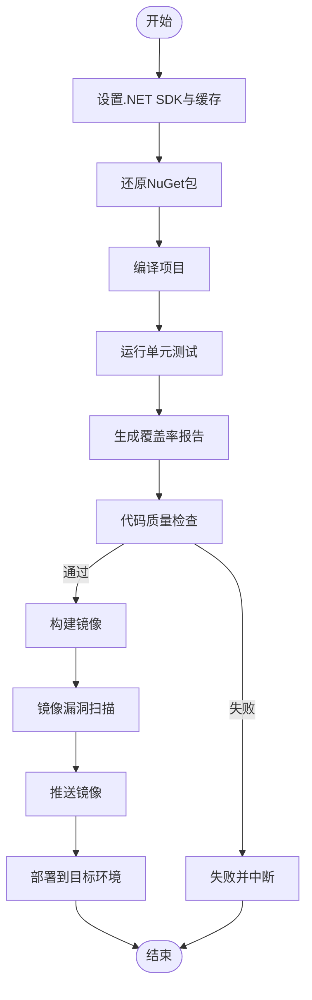
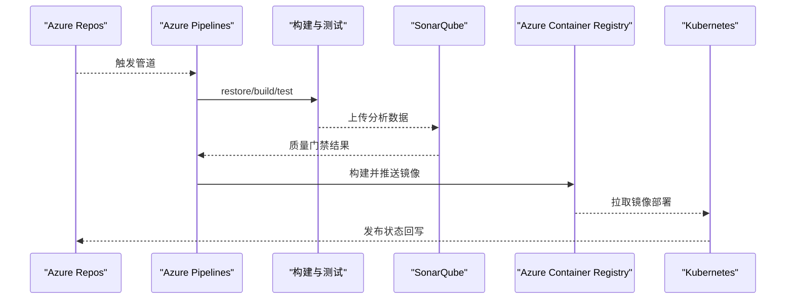
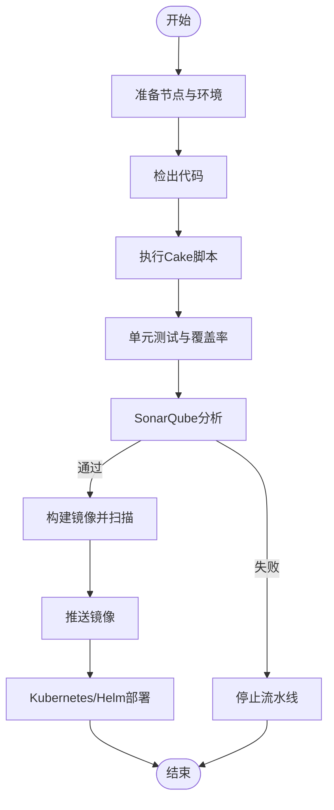
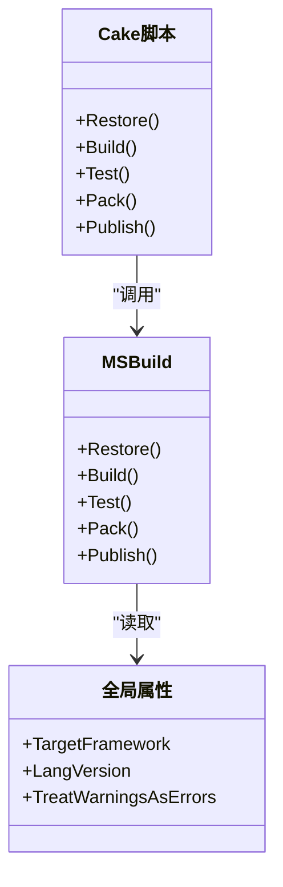
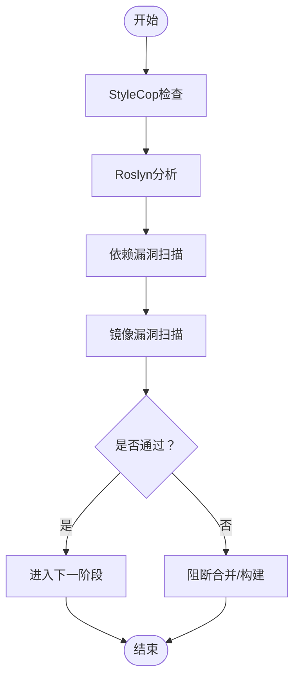
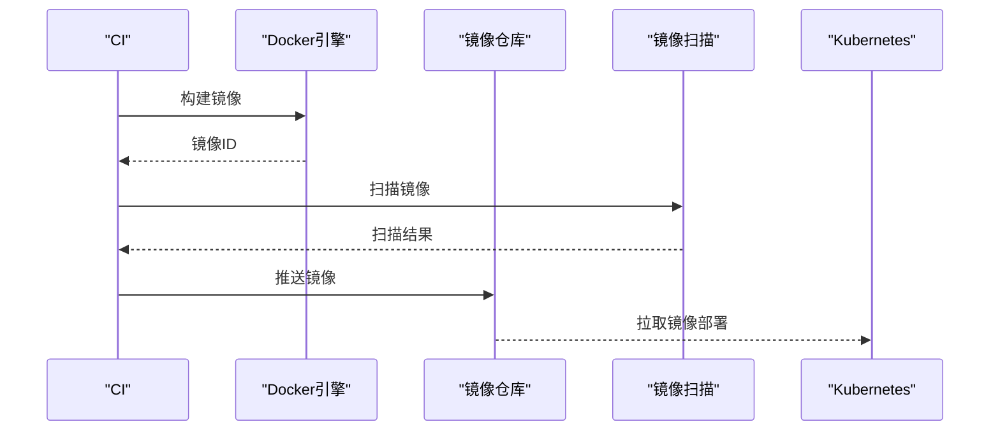
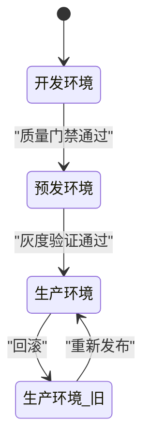
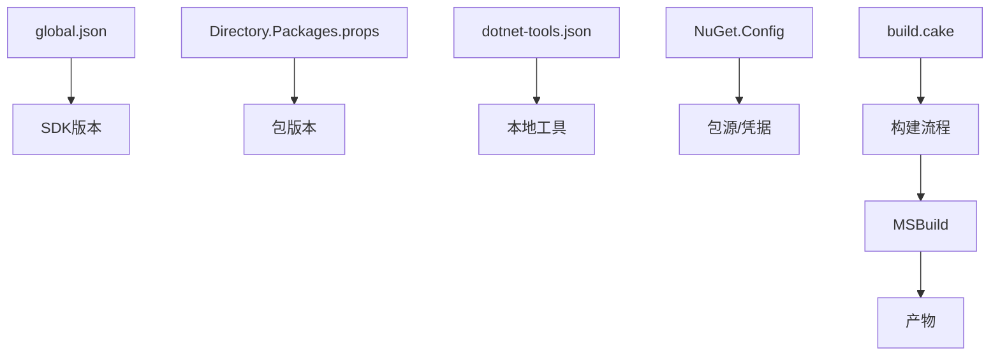

# CI/CD流水线

<cite>
**本文档引用的文件**   
- [README.md](file://README.md)
- [.github/workflows](file://.github/workflows)
- [build.cake](file://build.cake)
- [Directory.Build.props](file://Directory.Build.props)
- [Directory.Packages.props](file://Directory.Packages.props)
- [global.json](file://global.json)
- [dotnet-tools.json](file://dotnet-tools.json)
- [NuGet.Config](file://NuGet.Config)
- [stylecop.json](file://stylecop.json)
- [staticanalysis.xml](file://staticanalysis.xml)
- [testEnvironments.json](file://testEnvironments.json)
</cite>

## 目录
1. [简介](#简介)
2. [项目结构](#项目结构)
3. [核心组件](#核心组件)
4. [架构总览](#架构总览)
5. [详细组件分析](#详细组件分析)
6. [依赖关系分析](#依赖关系分析)
7. [性能与优化](#性能与优化)
8. [故障排查指南](#故障排查指南)
9. [结论](#结论)
10. [附录](#附录)

## 简介
本文件面向CI/CD工程师与开发者，提供针对该代码库的端到端流水线设计与实践指南。内容覆盖：
- 主流平台配置：GitHub Actions、Azure DevOps、Jenkins
- 自动化构建、单元测试、代码质量检查、安全扫描与镜像构建
- 多环境部署、蓝绿发布、金丝雀发布与回滚策略
- 流水线优化：缓存、并行执行、失败重试等最佳实践

本仓库为.NET生态（含多个示例与集成），建议以“解决方案+包管理+静态分析”的统一基线进行CI/CD编排。

## 项目结构
从根目录可见以下与CI/CD强相关的要素：
- .github/workflows：GitHub Actions工作流存放位置（当前为空目录）
- build.cake：Cake脚本，可用于统一构建、测试、打包、发布
- Directory.Build.props/targets：全局MSBuild属性与目标，集中控制编译行为
- Directory.Packages.props：中央包版本管理
- global.json：SDK/工具链锁定
- dotnet-tools.json：本地工具清单（如dotnet-format、coverlet等）
- NuGet.Config：NuGet源与凭据配置
- stylecop.json、staticanalysis.xml：代码风格与静态分析规则
- testEnvironments.json：xUnit测试运行环境配置

**图示来源** 
- [build.cake](file://build.cake)
- [Directory.Build.props](file://Directory.Build.props)
- [Directory.Packages.props](file://Directory.Packages.props)
- [global.json](file://global.json)
- [dotnet-tools.json](file://dotnet-tools.json)
- [NuGet.Config](file://NuGet.Config)
- [stylecop.json](file://stylecop.json)
- [staticanalysis.xml](file://staticanalysis.xml)
- [testEnvironments.json](file://testEnvironments.json)

**章节来源**
- [README.md](file://README.md)
- [build.cake](file://build.cake)
- [Directory.Build.props](file://Directory.Build.props)
- [Directory.Packages.props](file://Directory.Packages.props)
- [global.json](file://global.json)
- [dotnet-tools.json](file://dotnet-tools.json)
- [NuGet.Config](file://NuGet.Config)
- [stylecop.json](file://stylecop.json)
- [staticanalysis.xml](file://staticanalysis.xml)
- [testEnvironments.json](file://testEnvironments.json)

## 核心组件
- 构建系统
  - MSBuild通过Directory.Build.props统一编译选项（如TargetFramework、LangVersion、TreatWarningsAsErrors等）
  - Cake脚本作为入口，串联restore/build/test/pack/publish等阶段
- 包管理与工具
  - Directory.Packages.props集中管理包版本，避免漂移
  - dotnet-tools.json声明格式化、覆盖率、静态分析等本地工具
  - NuGet.Config配置私有源或代理
- 质量与安全
  - stylecop.json定义C#编码规范
  - staticanalysis.xml用于Roslyn分析器规则
  - 可选SonarQube/SonarCloud集成进行更全面的代码质量门禁
- 测试
  - xUnit测试框架，testEnvironments.json可指定运行时与并行度
  - 覆盖率报告由coverlet生成并上传至平台制品库
- 容器化
  - Dockerfile（建议在应用层添加）配合多阶段构建，输出最小镜像
  - 镜像签名与漏洞扫描（Trivy/Grype）纳入流水线

**章节来源**
- [Directory.Build.props](file://Directory.Build.props)
- [build.cake](file://build.cake)
- [Directory.Packages.props](file://Directory.Packages.props)
- [dotnet-tools.json](file://dotnet-tools.json)
- [NuGet.Config](file://NuGet.Config)
- [stylecop.json](file://stylecop.json)
- [staticanalysis.xml](file://staticanalysis.xml)
- [testEnvironments.json](file://testEnvironments.json)

## 架构总览
下图展示从代码提交到发布的端到端流水线，涵盖构建、测试、质量门禁、镜像构建与部署。

**图示来源** 
- [build.cake](file://build.cake)
- [Directory.Build.props](file://Directory.Build.props)
- [Directory.Packages.props](file://Directory.Packages.props)
- [global.json](file://global.json)
- [dotnet-tools.json](file://dotnet-tools.json)
- [NuGet.Config](file://NuGet.Config)
- [stylecop.json](file://stylecop.json)
- [staticanalysis.xml](file://staticanalysis.xml)
- [testEnvironments.json](file://testEnvironments.json)

## 详细组件分析

### GitHub Actions流水线
- 触发条件
  - push至main/release分支；PR事件；手动触发
- 关键步骤
  - 设置.NET SDK（基于global.json）
  - 还原NuGet包（使用NuGet.Config）
  - 构建与测试（Cake驱动）
  - 代码质量检查（StyleCop/Roslyn分析）
  - 单元测试与覆盖率（xUnit + coverlet）
  - 构建Docker镜像（多阶段构建）
  - 镜像扫描（Trivy/Grype）
  - 推送镜像到Acr/GitHub Container Registry
  - 部署到K8s/Azure App Service（按需）
- 缓存策略
  - ~/.nuget/packages与~/.dotnet/sdk缓存
  - 并行作业：构建、测试、质量检查并行执行
- 失败重试
  - 对网络相关步骤启用最多2次重试

**图示来源** 
- [build.cake](file://build.cake)
- [Directory.Build.props](file://Directory.Build.props)
- [Directory.Packages.props](file://Directory.Packages.props)
- [global.json](file://global.json)
- [dotnet-tools.json](file://dotnet-tools.json)
- [NuGet.Config](file://NuGet.Config)
- [stylecop.json](file://stylecop.json)
- [staticanalysis.xml](file://staticanalysis.xml)
- [testEnvironments.json](file://testEnvironments.json)

**章节来源**
- [build.cake](file://build.cake)
- [Directory.Build.props](file://Directory.Build.props)
- [Directory.Packages.props](file://Directory.Packages.props)
- [global.json](file://global.json)
- [dotnet-tools.json](file://dotnet-tools.json)
- [NuGet.Config](file://NuGet.Config)
- [stylecop.json](file://stylecop.json)
- [staticanalysis.xml](file://staticanalysis.xml)
- [testEnvironments.json](file://testEnvironments.json)

### Azure DevOps流水线
- 触发条件
  - 分支策略：main/release自动触发；PR触发质量门禁
- 关键任务
  - UseDotNet@2安装SDK
  - DotNetCoreCLI@2执行restore/build/test/publish
  - SonarQubePrepare/SonarQubeAnalyze进行质量门禁
  - Docker@2构建镜像并推送至ACR
  - Trivy@0 进行镜像扫描
  - Kubernetes@1 或 App Service@1 部署
- 缓存与并行
  - 使用Cache@2缓存NuGet与dotnet包
  - 多作业并行：构建、测试、质量、镜像构建
- 环境变量与密钥
  - 使用变量组管理连接字符串、证书、令牌

**图示来源** 
- [build.cake](file://build.cake)
- [Directory.Build.props](file://Directory.Build.props)
- [Directory.Packages.props](file://Directory.Packages.props)
- [global.json](file://global.json)
- [dotnet-tools.json](file://dotnet-tools.json)
- [NuGet.Config](file://NuGet.Config)
- [stylecop.json](file://stylecop.json)
- [staticanalysis.xml](file://staticanalysis.xml)
- [testEnvironments.json](file://testEnvironments.json)

**章节来源**
- [build.cake](file://build.cake)
- [Directory.Build.props](file://Directory.Build.props)
- [Directory.Packages.props](file://Directory.Packages.props)
- [global.json](file://global.json)
- [dotnet-tools.json](file://dotnet-tools.json)
- [NuGet.Config](file://NuGet.Config)
- [stylecop.json](file://stylecop.json)
- [staticanalysis.xml](file://staticanalysis.xml)
- [testEnvironments.json](file://testEnvironments.json)

### Jenkins流水线
- 触发方式
  - Webhook监听Git变更；定时构建；手动触发
- 关键阶段
  - 节点准备：安装.NET SDK、Docker、kubectl
  - 构建：调用Cake脚本执行restore/build/test
  - 质量：集成SonarQube插件
  - 镜像：Docker构建、Trivy扫描、推送镜像仓库
  - 部署：kubectl apply或Helm升级
- 缓存与并行
  - 使用workspace缓存NuGet与dotnet包
  - 多阶段并行执行（stage并行）

**图示来源** 
- [build.cake](file://build.cake)
- [Directory.Build.props](file://Directory.Build.props)
- [Directory.Packages.props](file://Directory.Packages.props)
- [global.json](file://global.json)
- [dotnet-tools.json](file://dotnet-tools.json)
- [NuGet.Config](file://NuGet.Config)
- [stylecop.json](file://stylecop.json)
- [staticanalysis.xml](file://staticanalysis.xml)
- [testEnvironments.json](file://testEnvironments.json)

**章节来源**
- [build.cake](file://build.cake)
- [Directory.Build.props](file://Directory.Build.props)
- [Directory.Packages.props](file://Directory.Packages.props)
- [global.json](file://global.json)
- [dotnet-tools.json](file://dotnet-tools.json)
- [NuGet.Config](file://NuGet.Config)
- [stylecop.json](file://stylecop.json)
- [staticanalysis.xml](file://staticanalysis.xml)
- [testEnvironments.json](file://testEnvironments.json)

### 构建与测试（Cake与MSBuild）
- Cake脚本职责
  - 统一入口：restore/build/test/pack/publish
  - 参数化：配置目标框架、发布模式、测试过滤
  - 产物：二进制、测试报告、覆盖率、包文件
- MSBuild全局属性
  - 通过Directory.Build.props集中控制编译选项
  - 确保跨平台一致性与警告级别统一

**图示来源** 
- [build.cake](file://build.cake)
- [Directory.Build.props](file://Directory.Build.props)
- [Directory.Packages.props](file://Directory.Packages.props)
- [global.json](file://global.json)
- [dotnet-tools.json](file://dotnet-tools.json)
- [NuGet.Config](file://NuGet.Config)
- [stylecop.json](file://stylecop.json)
- [staticanalysis.xml](file://staticanalysis.xml)
- [testEnvironments.json](file://testEnvironments.json)

**章节来源**
- [build.cake](file://build.cake)
- [Directory.Build.props](file://Directory.Build.props)
- [Directory.Packages.props](file://Directory.Packages.props)
- [global.json](file://global.json)
- [dotnet-tools.json](file://dotnet-tools.json)
- [NuGet.Config](file://NuGet.Config)
- [stylecop.json](file://stylecop.json)
- [staticanalysis.xml](file://staticanalysis.xml)
- [testEnvironments.json](file://testEnvironments.json)

### 代码质量与安全
- 代码风格
  - StyleCop规则（stylecop.json）
  - Roslyn分析器（staticanalysis.xml）
- 安全扫描
  - 源码级：SonarQube/SonarCloud
  - 依赖级：NuGet Audit、OWASP Dependency-Check
  - 镜像级：Trivy/Grype
- 门禁策略
  - 严重问题阻断合并
  - 覆盖率阈值要求
  - 漏洞等级阈值

**图示来源** 
- [stylecop.json](file://stylecop.json)
- [staticanalysis.xml](file://staticanalysis.xml)
- [Directory.Packages.props](file://Directory.Packages.props)
- [dotnet-tools.json](file://dotnet-tools.json)

**章节来源**
- [stylecop.json](file://stylecop.json)
- [staticanalysis.xml](file://staticanalysis.xml)
- [Directory.Packages.props](file://Directory.Packages.props)
- [dotnet-tools.json](file://dotnet-tools.json)

### 镜像构建与推送
- 多阶段构建
  - 第一阶段：还原与编译
  - 第二阶段：运行时镜像（alpine/musl）
- 标签策略
  - commit SHA、语义化版本、latest
- 扫描与签名
  - Trivy/Grype扫描
  - Cosign签名（可选）
- 推送与拉取
  - 推送到ACR/GitHub Container Registry/Docker Hub
  - 部署时固定镜像标签

**图示来源** 
- [build.cake](file://build.cake)
- [Directory.Build.props](file://Directory.Build.props)
- [Directory.Packages.props](file://Directory.Packages.props)
- [global.json](file://global.json)
- [dotnet-tools.json](file://dotnet-tools.json)
- [NuGet.Config](file://NuGet.Config)
- [stylecop.json](file://stylecop.json)
- [staticanalysis.xml](file://staticanalysis.xml)
- [testEnvironments.json](file://testEnvironments.json)

**章节来源**
- [build.cake](file://build.cake)
- [Directory.Build.props](file://Directory.Build.props)
- [Directory.Packages.props](file://Directory.Packages.props)
- [global.json](file://global.json)
- [dotnet-tools.json](file://dotnet-tools.json)
- [NuGet.Config](file://NuGet.Config)
- [stylecop.json](file://stylecop.json)
- [staticanalysis.xml](file://staticanalysis.xml)
- [testEnvironments.json](file://testEnvironments.json)

### 多环境部署与发布策略
- 环境划分
  - dev/staging/prod，对应不同配置与资源
- 蓝绿发布
  - 同时维护两套环境，切换流量实现零停机发布
- 金丝雀发布
  - 小比例流量灰度验证，逐步放量
- 回滚策略
  - 快速回退到上一稳定版本镜像标签
  - 数据库迁移需具备向下兼容或回滚脚本

**图示来源** 
- [build.cake](file://build.cake)
- [Directory.Build.props](file://Directory.Build.props)
- [Directory.Packages.props](file://Directory.Packages.props)
- [global.json](file://global.json)
- [dotnet-tools.json](file://dotnet-tools.json)
- [NuGet.Config](file://NuGet.Config)
- [stylecop.json](file://stylecop.json)
- [staticanalysis.xml](file://staticanalysis.xml)
- [testEnvironments.json](file://testEnvironments.json)

**章节来源**
- [build.cake](file://build.cake)
- [Directory.Build.props](file://Directory.Build.props)
- [Directory.Packages.props](file://Directory.Packages.props)
- [global.json](file://global.json)
- [dotnet-tools.json](file://dotnet-tools.json)
- [NuGet.Config](file://NuGet.Config)
- [stylecop.json](file://stylecop.json)
- [staticanalysis.xml](file://staticanalysis.xml)
- [testEnvironments.json](file://testEnvironments.json)

## 依赖关系分析
- 构建依赖
  - global.json锁定SDK版本，保证一致性
  - Directory.Packages.props集中包版本，减少冲突
- 工具依赖
  - dotnet-tools.json声明本地工具（format、coverlet、analyzers）
- 外部服务
  - NuGet.Config指向私有源或代理
  - 镜像仓库与K8s集群凭据通过平台密钥管理

**图示来源** 
- [global.json](file://global.json)
- [Directory.Packages.props](file://Directory.Packages.props)
- [dotnet-tools.json](file://dotnet-tools.json)
- [NuGet.Config](file://NuGet.Config)
- [build.cake](file://build.cake)

**章节来源**
- [global.json](file://global.json)
- [Directory.Packages.props](file://Directory.Packages.props)
- [dotnet-tools.json](file://dotnet-tools.json)
- [NuGet.Config](file://NuGet.Config)
- [build.cake](file://build.cake)

## 性能与优化
- 缓存策略
  - NuGet包缓存（~/.nuget/packages）
  - dotnet SDK缓存（~/.dotnet/sdk）
  - 增量构建（利用obj/bin缓存）
- 并行执行
  - 测试用例并行（xUnit默认支持）
  - 多作业并行（构建、测试、质量、镜像）
- 失败重试
  - 网络相关步骤（restore、push）增加重试
- 构建加速
  - 使用远程缓存（GitHub Actions cache、Azure Cache、Jenkins workspace）
  - 多阶段Docker构建减小镜像体积
- 资源隔离
  - 每个作业使用独立容器/VM，避免污染

[本节为通用指导，不直接分析具体文件]

## 故障排查指南
- 常见问题
  - NuGet还原失败：检查NuGet.Config与网络连通性
  - 测试失败：查看xUnit输出与覆盖率报告
  - 质量门禁失败：定位StyleCop/Roslyn错误与SonarQube问题
  - 镜像构建失败：检查Dockerfile与依赖
  - 部署失败：确认凭据、命名空间、资源配额
- 日志与制品
  - 保存测试报告、覆盖率、构建日志、镜像扫描报告
  - 在平台中归档制品以便回溯

**章节来源**
- [testEnvironments.json](file://testEnvironments.json)
- [stylecop.json](file://stylecop.json)
- [staticanalysis.xml](file://staticanalysis.xml)
- [dotnet-tools.json](file://dotnet-tools.json)
- [NuGet.Config](file://NuGet.Config)

## 结论
通过统一的构建脚本（Cake）、全局MSBuild属性、集中包管理与质量规则，结合主流CI/CD平台（GitHub Actions、Azure DevOps、Jenkins），可实现稳定高效的流水线。建议优先落地缓存与并行、质量门禁与镜像扫描，再逐步完善蓝绿/金丝雀发布与回滚策略，持续提升交付效率与质量。

[本节为总结，不直接分析具体文件]

## 附录
- 推荐工具
  - 构建：Cake、MSBuild
  - 测试：xUnit、coverlet
  - 质量：StyleCop、Roslyn、SonarQube
  - 安全：NuGet Audit、Trivy/Grype
  - 容器：Docker、kubectl、Helm
- 参考配置
  - global.json、Directory.Packages.props、dotnet-tools.json、NuGet.Config、stylecop.json、staticanalysis.xml、testEnvironments.json

[本节为补充信息，不直接分析具体文件]