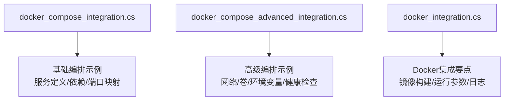
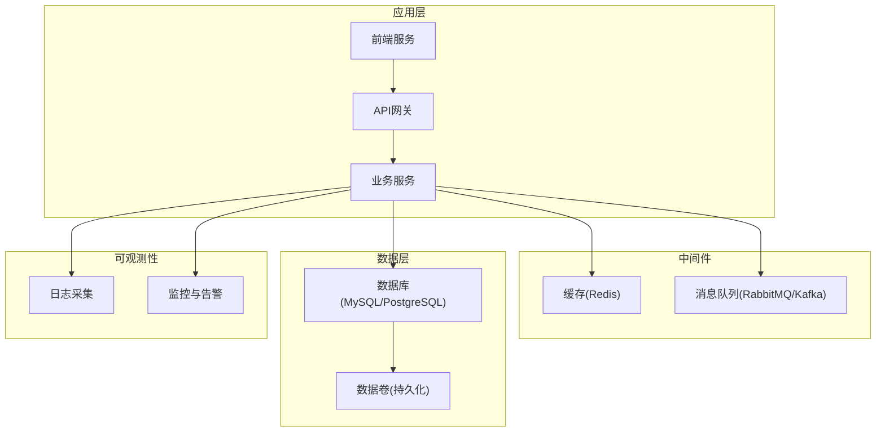
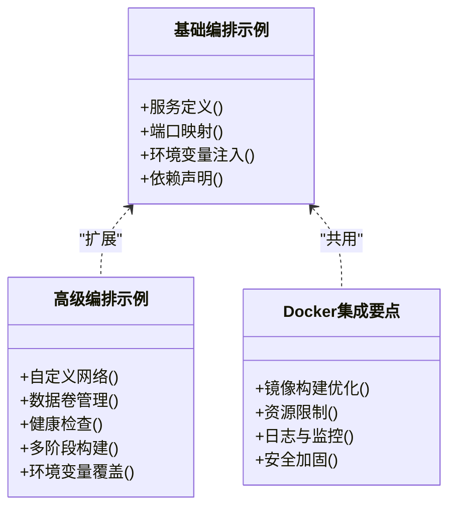
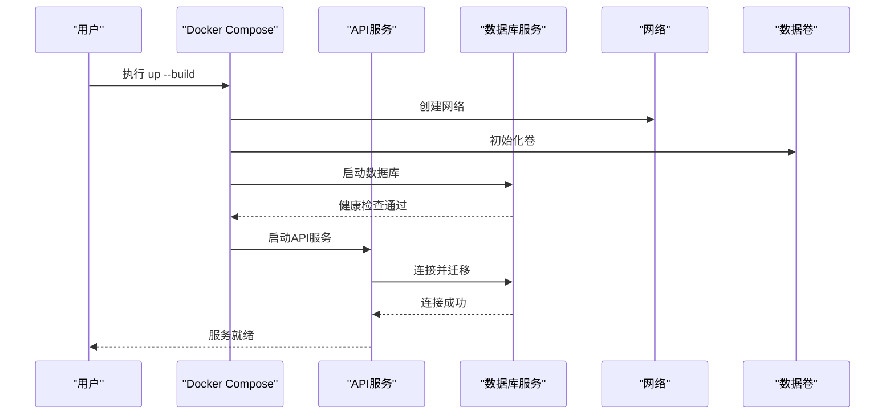
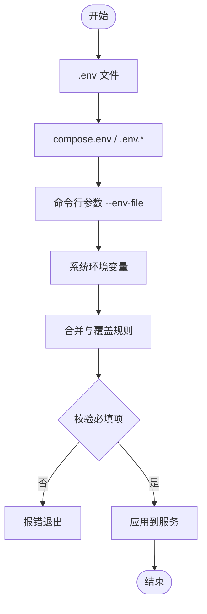
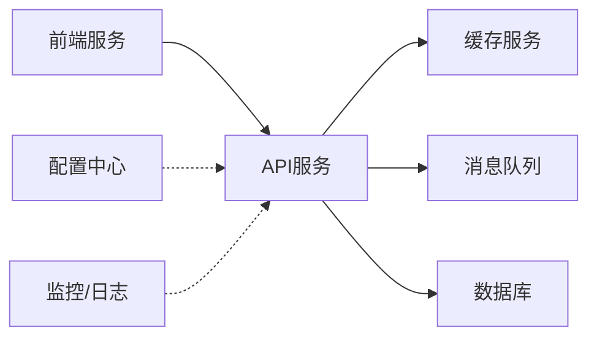

# Docker Compose编排

<cite>
**本文引用的文件**   
- [docker_compose_integration.cs](file://docker_compose_integration.cs)
- [docker_compose_advanced_integration.cs](file://docker_compose_advanced_integration.cs)
- [docker_integration.cs](file://docker_integration.cs)
</cite>

## 目录
1. [简介](#简介)
2. [项目结构](#项目结构)
3. [核心组件](#核心组件)
4. [架构总览](#架构总览)
5. [详细组件分析](#详细组件分析)
6. [依赖关系分析](#依赖关系分析)
7. [性能考虑](#性能考虑)
8. [故障排查指南](#故障排查指南)
9. [结论](#结论)
10. [附录](#附录)

## 简介
本文件面向使用Docker Compose进行多服务编排的开发者与运维人员，围绕以下目标提供系统化指导：
- docker-compose.yml编写规范与服务依赖管理
- 网络配置、数据卷共享与环境变量管理
- 开发/测试/生产环境的差异化配置策略
- 健康检查与重启策略的最佳实践
- 配置中心集成、服务发现与本地调试技巧

为便于落地，文档结合仓库中与Docker Compose相关的示例代码进行分析，给出可操作的流程与图示。

## 项目结构
仓库中包含多个与容器化与编排相关的示例实现，重点涉及：
- 基础Compose编排示例
- 高级编排模式（含依赖、网络、卷、环境变量等）
- Docker集成相关能力说明

图表来源 
- [docker_compose_integration.cs](file://docker_compose_integration.cs)
- [docker_compose_advanced_integration.cs](file://docker_compose_advanced_integration.cs)
- [docker_integration.cs](file://docker_integration.cs)

章节来源
- [docker_compose_integration.cs](file://docker_compose_integration.cs)
- [docker_compose_advanced_integration.cs](file://docker_compose_advanced_integration.cs)
- [docker_integration.cs](file://docker_integration.cs)

## 核心组件
- 服务定义与依赖管理
  - 通过服务名与depends_on声明启动顺序与依赖关系
  - 使用条件依赖或脚本等待机制确保上游服务就绪
- 网络配置
  - 默认桥接网络隔离服务间通信
  - 自定义网络提升可观测性与访问控制
- 数据卷共享
  - 命名卷持久化数据库与中间件数据
  - 绑定挂载用于开发时热更新与日志收集
- 环境变量与配置
  - 使用.env或外部配置文件注入敏感信息
  - 结合配置中心动态拉取运行时配置
- 健康检查与重启策略
  - 基于HTTP/TCP/命令的健康探针
  - 根据失败次数与延迟设置自动重启策略

章节来源
- [docker_compose_integration.cs](file://docker_compose_integration.cs)
- [docker_compose_advanced_integration.cs](file://docker_compose_advanced_integration.cs)
- [docker_integration.cs](file://docker_integration.cs)

## 架构总览
下图展示典型的多服务编排架构：前端、API网关、业务服务、缓存、消息队列、数据库与监控组件之间的交互关系，以及Compose如何组织这些服务。

[本图为概念性架构图，不直接映射具体源码文件]

## 详细组件分析

### 基础编排示例（docker_compose_integration.cs）
- 关注点
  - 服务清单与端口映射
  - 基础依赖声明（如数据库、缓存）
  - 常用环境变量注入
- 适用场景
  - 本地快速启动最小可用环境
  - 演示Compose基本语法与用法

章节来源
- [docker_compose_integration.cs](file://docker_compose_integration.cs)

### 高级编排示例（docker_compose_advanced_integration.cs）
- 关注点
  - 自定义网络与子网规划
  - 数据卷命名与权限
  - 健康检查探针与重试策略
  - 多阶段构建与镜像优化
  - 环境变量优先级与覆盖
- 适用场景
  - 复杂微服务组合
  - 需要强一致性与高可用的中间件集群

章节来源
- [docker_compose_advanced_integration.cs](file://docker_compose_advanced_integration.cs)

### Docker集成要点（docker_integration.cs）
- 关注点
  - 镜像构建参数与缓存优化
  - 运行时资源限制（CPU/内存）
  - 日志输出格式与轮转
  - 安全加固（非root用户、只读根文件系统）
- 适用场景
  - 统一容器化标准
  - 跨环境一致性保障

章节来源
- [docker_integration.cs](file://docker_integration.cs)

#### 类图（概念映射到示例文件）

图表来源 
- [docker_compose_integration.cs](file://docker_compose_integration.cs)
- [docker_compose_advanced_integration.cs](file://docker_compose_advanced_integration.cs)
- [docker_integration.cs](file://docker_integration.cs)

#### 序列图（健康检查与依赖启动流程）

图表来源 
- [docker_compose_advanced_integration.cs](file://docker_compose_advanced_integration.cs)
- [docker_compose_integration.cs](file://docker_compose_integration.cs)

#### 流程图（环境变量加载与覆盖）

[本图为概念性流程图，不直接映射具体源码文件]

## 依赖关系分析
- 服务间耦合
  - 通过服务名解析进行通信，避免硬编码IP
  - 使用depends_on控制启动顺序，配合健康检查保证可用性
- 外部依赖
  - 中间件（Redis、MQ、DB）建议独立部署或使用托管服务
  - 配置中心（如Consul/Nacos/Etcd）可通过侧车或SDK接入
- 网络拓扑
  - 将对外暴露的服务置于公共网络，内部服务置于私有网络
  - 使用反向代理统一入口与TLS终止

[本图为概念性依赖图，不直接映射具体源码文件]

章节来源
- [docker_compose_advanced_integration.cs](file://docker_compose_advanced_integration.cs)
- [docker_compose_integration.cs](file://docker_compose_integration.cs)

## 性能考虑
- 镜像体积与构建时间
  - 多阶段构建、精简基础镜像、利用缓存层
- 资源限制
  - 合理设置CPU/内存上限与请求阈值
- I/O与存储
  - 使用命名卷而非绑定挂载提升I/O性能
  - 对热点数据启用SSD或专用磁盘
- 网络与并发
  - 减少跨网段调用，使用本地回环或同节点部署
  - 调整连接池与超时参数

[本节为通用指导，不直接分析具体文件]

## 故障排查指南
- 常见问题定位
  - 启动顺序错误：检查depends_on与健康检查
  - 端口冲突：查看端口映射与宿主占用
  - 权限问题：确认卷权限与非root用户
  - 环境变量缺失：核对.env与覆盖顺序
- 诊断手段
  - 查看服务日志与事件
  - 进入容器执行命令排查
  - 使用网络连通性测试工具
- 恢复策略
  - 滚动重启与回滚
  - 清理无效卷与网络
  - 降级与熔断保护

章节来源
- [docker_compose_advanced_integration.cs](file://docker_compose_advanced_integration.cs)
- [docker_integration.cs](file://docker_integration.cs)

## 结论
通过规范的docker-compose.yml设计与严格的依赖、网络、卷与环境变量管理，可以在不同环境下快速搭建稳定可靠的编排体系。结合健康检查、重启策略与配置中心，能够显著提升系统的可维护性与弹性。建议在团队内统一模板与最佳实践，持续迭代优化。

[本节为总结性内容，不直接分析具体文件]

## 附录
- 多环境配置管理
  - 使用.env.{env}区分环境，CI/CD中注入密钥
  - 采用配置中心集中管理，运行时动态刷新
- 服务发现
  - 在Compose中使用DNS名称；在Kubernetes中使用Service
  - 结合Sidecar或Agent实现动态注册
- 本地开发调试
  - 使用绑定挂载源码与热重载
  - 开启调试端口与远程附加调试
- 安全加固
  - 最小权限原则、只读文件系统、定期扫描镜像漏洞
  - 使用Secrets管理敏感信息

[本节为通用指导，不直接分析具体文件]