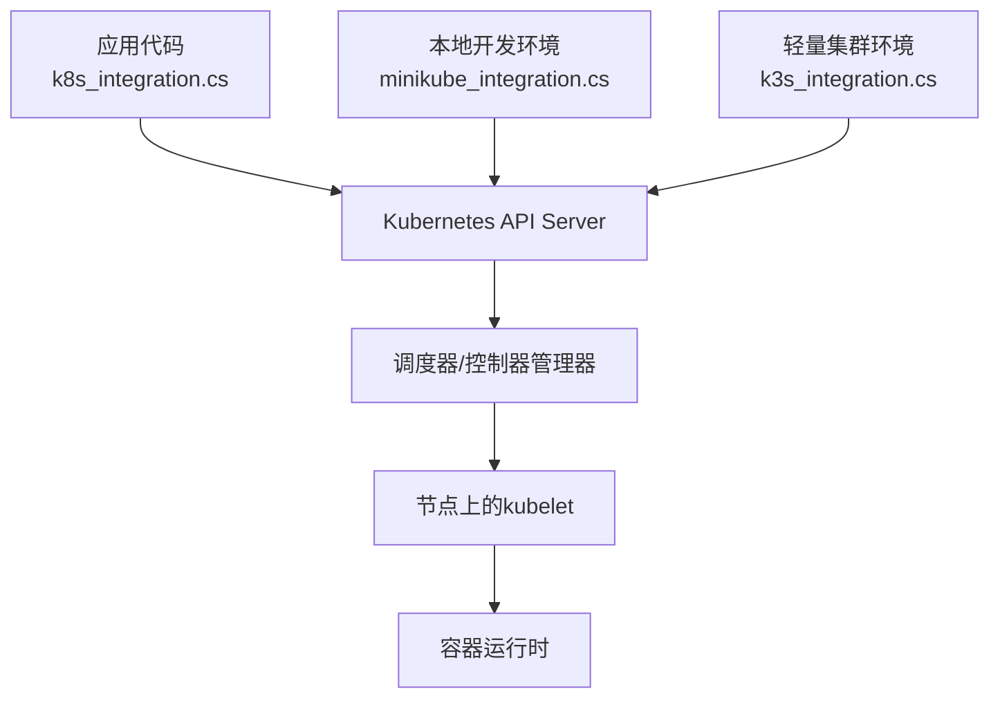
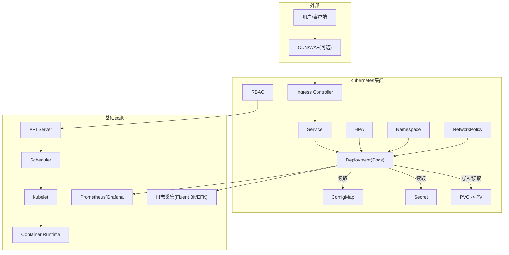
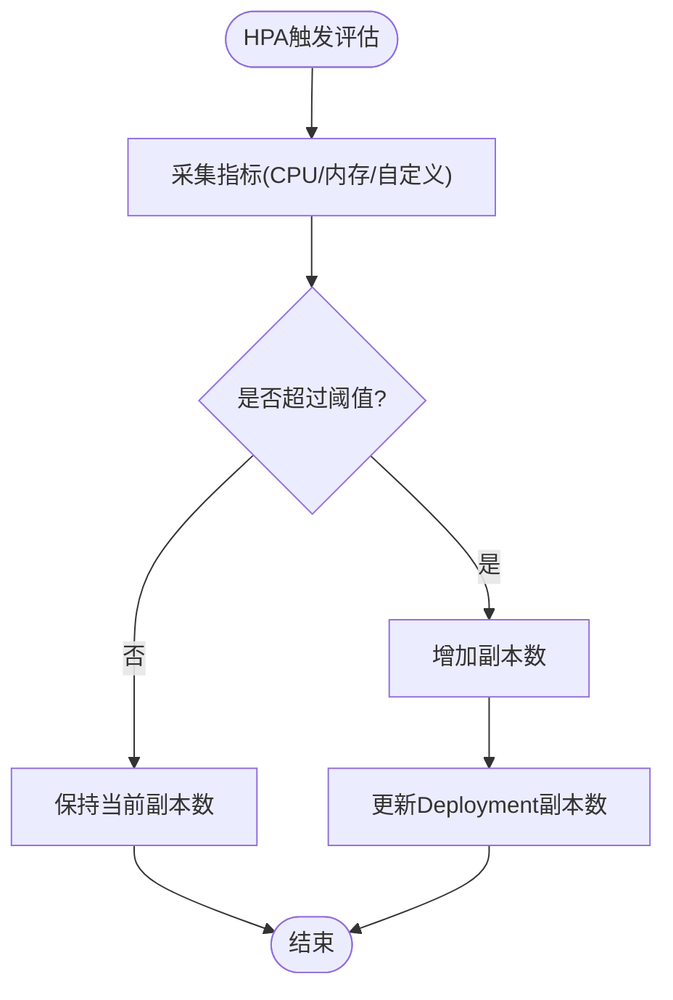
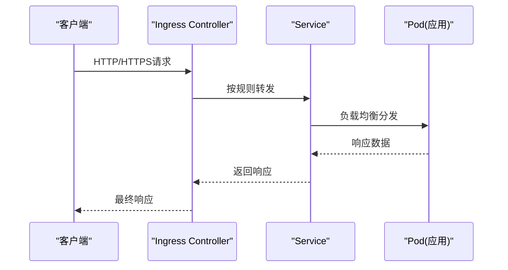
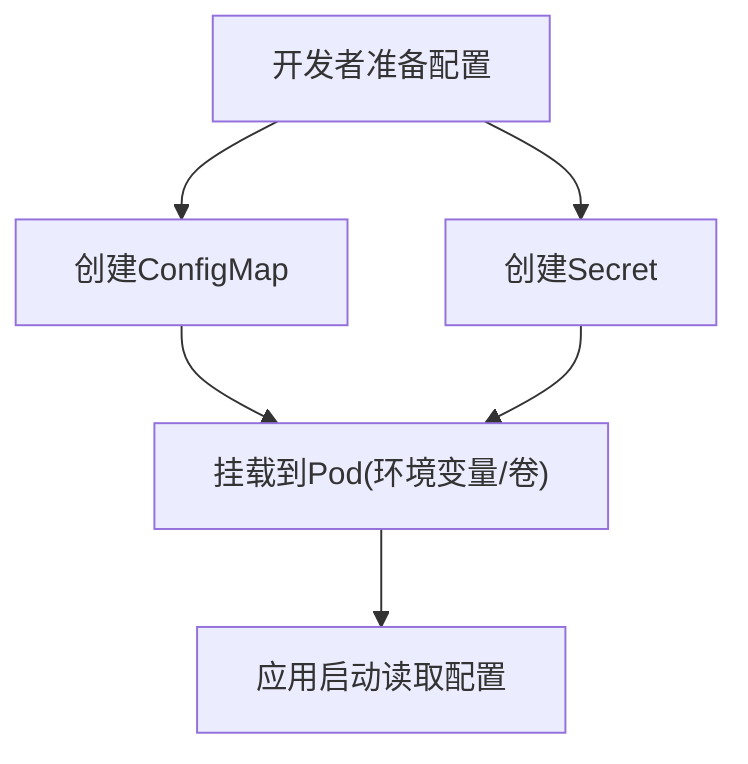
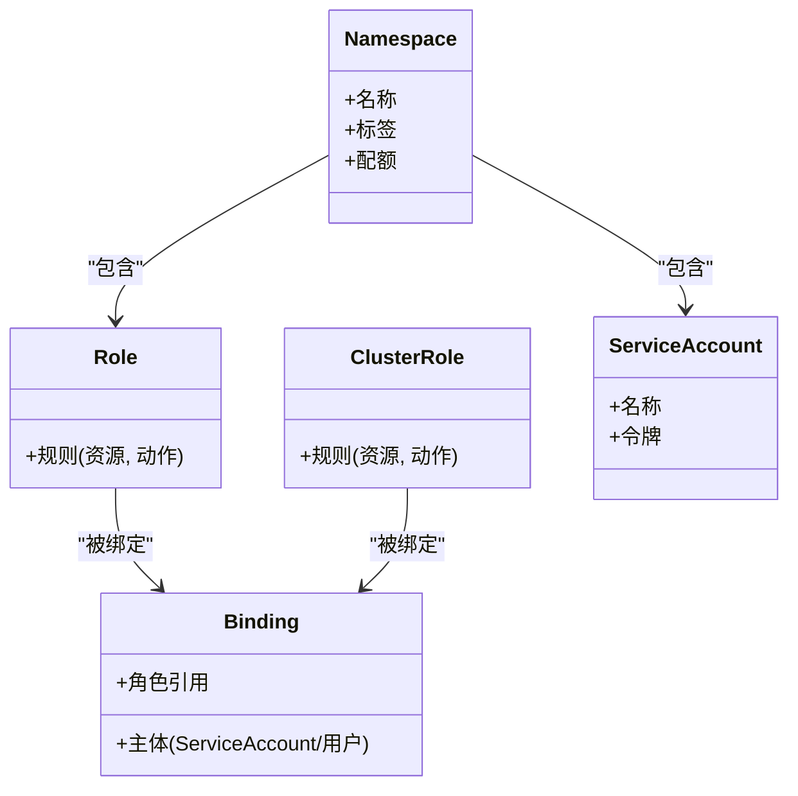
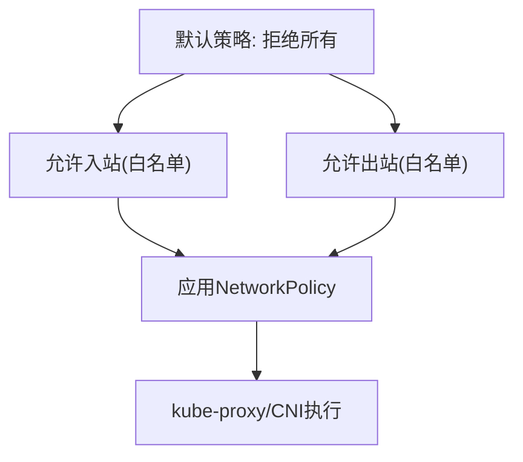
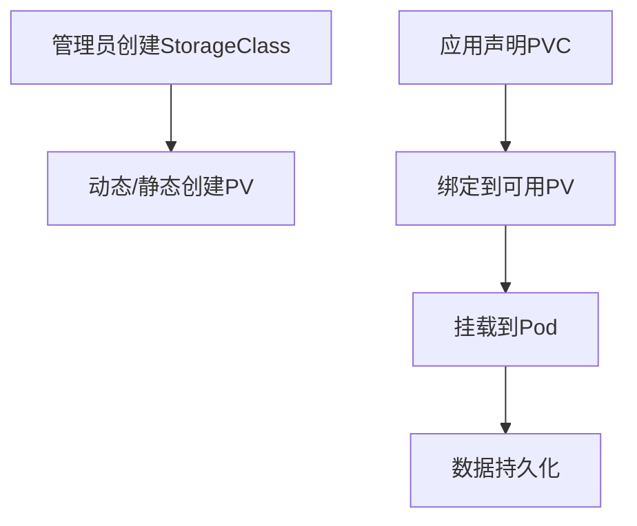
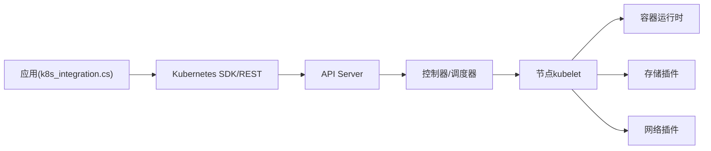

# Kubernetes编排

<cite>
**本文档引用的文件**   
- [k8s_integration.cs](file://k8s_integration.cs)
- [minikube_integration.cs](file://minikube_integration.cs)
- [k3s_integration.cs](file://k3s_integration.cs)
</cite>

## 目录
1. [简介](#简介)
2. [项目结构](#项目结构)
3. [核心组件](#核心组件)
4. [架构总览](#架构总览)
5. [详细组件分析](#详细组件分析)
6. [依赖关系分析](#依赖关系分析)
7. [性能考虑](#性能考虑)
8. [故障排查指南](#故障排查指南)
9. [结论](#结论)
10. [附录](#附录)

## 简介
本文件面向在Kubernetes上编排与运行应用的工程师，提供从资源对象配置到运维实践的系统性指导。内容覆盖Deployment、Service、ConfigMap、Secret等核心资源的编写与管理；Helm Chart的编写规范；命名空间隔离与RBAC权限控制；网络策略与安全；HPA水平自动伸缩；PV/PVC存储管理；Ingress路由与负载均衡；以及日志收集、监控告警与弹性扩缩容的最佳实践。同时结合仓库中与Kubernetes相关的集成示例，帮助快速落地生产级方案。

## 项目结构
仓库包含多个与Kubernetes相关的集成示例文件，用于演示如何在C#应用中与Kubernetes交互或进行本地/轻量集群开发。关键文件包括：
- k8s_integration.cs：展示应用层与Kubernetes API的集成思路（如动态发现、配置注入、健康检查等）
- minikube_integration.cs：演示在Minikube环境中的部署与调试流程
- k3s_integration.cs：演示在K3s轻量集群中的部署与运维要点

图表来源
- [k8s_integration.cs](file://k8s_integration.cs)
- [minikube_integration.cs](file://minikube_integration.cs)
- [k3s_integration.cs](file://k3s_integration.cs)

章节来源
- [k8s_integration.cs](file://k8s_integration.cs)
- [minikube_integration.cs](file://minikube_integration.cs)
- [k3s_integration.cs](file://k3s_integration.cs)

## 核心组件
- Deployment：声明式地管理无状态工作负载，支持滚动更新、回滚、副本数调整
- Service：为Pod提供稳定的网络访问入口（ClusterIP、NodePort、LoadBalancer）
- ConfigMap：将非敏感配置以键值形式注入到Pod中（环境变量、卷挂载、命令行参数）
- Secret：安全地管理敏感信息（密钥、证书、令牌），通过环境变量或卷挂载使用
- Namespace：逻辑隔离多租户或多环境资源
- RBAC：基于角色的访问控制，限制对API资源的读写能力
- NetworkPolicy：定义Pod间通信的网络策略，实现微服务细粒度隔离
- HPA：根据CPU、内存或自定义指标自动扩缩Pod副本数
- PV/PVC：持久化存储抽象，解耦存储供给与使用
- Ingress：HTTP/HTTPS路由与TLS终止，统一对外暴露服务

章节来源
- [k8s_integration.cs](file://k8s_integration.cs)
- [minikube_integration.cs](file://minikube_integration.cs)
- [k3s_integration.cs](file://k3s_integration.cs)

## 架构总览
下图展示了典型Kubernetes编排架构，涵盖外部流量入口、服务发现、工作负载、存储与监控告警链路。

图表来源
- [k8s_integration.cs](file://k8s_integration.cs)
- [minikube_integration.cs](file://minikube_integration.cs)
- [k3s_integration.cs](file://k3s_integration.cs)

## 详细组件分析

### Deployment与HPA协同
- Deployment负责定义Pod模板、副本数、滚动更新策略与健康探针
- HPA依据CPU、内存或自定义指标（如QPS、延迟分位）自动调整副本数
- 建议配合就绪探针与资源请求/限制，确保扩缩容稳定

章节来源
- [k8s_integration.cs](file://k8s_integration.cs)
- [minikube_integration.cs](file://minikube_integration.cs)
- [k3s_integration.cs](file://k3s_integration.cs)

### Service与Ingress路由
- Service提供稳定的内部访问端点，支持多种类型（ClusterIP、NodePort、LoadBalancer）
- Ingress作为七层网关，按域名/路径规则转发到不同Service，并支持TLS终止
- 建议结合外部DNS与证书管理工具（如cert-manager）自动化证书签发

章节来源
- [k8s_integration.cs](file://k8s_integration.cs)
- [minikube_integration.cs](file://minikube_integration.cs)
- [k3s_integration.cs](file://k3s_integration.cs)

### ConfigMap与Secret注入
- ConfigMap用于注入非敏感配置，可通过环境变量、卷挂载、命令行参数等方式使用
- Secret用于管理敏感信息，推荐以只读卷挂载方式避免泄露
- 建议在CI/CD阶段生成并推送至集群，避免硬编码

章节来源
- [k8s_integration.cs](file://k8s_integration.cs)
- [minikube_integration.cs](file://minikube_integration.cs)
- [k3s_integration.cs](file://k3s_integration.cs)

### 命名空间隔离与RBAC
- 命名空间用于隔离不同环境或租户的资源，避免冲突
- RBAC通过Role/ClusterRole与Binding控制用户对API资源的访问权限
- 建议最小权限原则，为每个服务分配独立ServiceAccount

章节来源
- [k8s_integration.cs](file://k8s_integration.cs)
- [minikube_integration.cs](file://minikube_integration.cs)
- [k3s_integration.cs](file://k3s_integration.cs)

### 网络策略(NetworkPolicy)
- 通过入站/出站规则限制Pod间通信，实现微服务细粒度隔离
- 建议默认拒绝所有流量，再按需放行

章节来源
- [k8s_integration.cs](file://k8s_integration.cs)
- [minikube_integration.cs](file://minikube_integration.cs)
- [k3s_integration.cs](file://k3s_integration.cs)

### PV/PVC存储管理
- PV由管理员预置或动态供给，PVC由应用申请
- 建议根据业务选择合适存储类（SSD/HDD/对象存储网关）

章节来源
- [k8s_integration.cs](file://k8s_integration.cs)
- [minikube_integration.cs](file://minikube_integration.cs)
- [k3s_integration.cs](file://k3s_integration.cs)

### Helm Chart编写最佳实践
- 使用values.yaml管理环境差异，避免重复模板
- 合理拆分模板（deployment、service、configmap、ingress等）
- 使用内置函数与条件渲染提升可维护性
- 在CI中执行helm lint与dry-run验证

章节来源
- [k8s_integration.cs](file://k8s_integration.cs)
- [minikube_integration.cs](file://minikube_integration.cs)
- [k3s_integration.cs](file://k3s_integration.cs)

## 依赖关系分析
Kubernetes编排涉及多层依赖：应用代码通过SDK或REST调用API Server；控制器协调资源状态；节点上的kubelet管理容器生命周期；存储与网络插件提供扩展能力。

图表来源
- [k8s_integration.cs](file://k8s_integration.cs)
- [minikube_integration.cs](file://minikube_integration.cs)
- [k3s_integration.cs](file://k3s_integration.cs)

章节来源
- [k8s_integration.cs](file://k8s_integration.cs)
- [minikube_integration.cs](file://minikube_integration.cs)
- [k3s_integration.cs](file://k3s_integration.cs)

## 性能考虑
- 设置合理的资源请求与限制，避免资源争用
- 使用就绪探针与存活探针保障健康流量
- 启用水平自动伸缩（HPA）应对流量峰值
- 优化镜像体积与启动时间，减少冷启动开销
- 合理划分命名空间与配额，防止单租户占用过多资源

## 故障排查指南
- 查看Pod事件与日志定位启动失败原因
- 检查Service与Ingress规则是否正确转发
- 验证ConfigMap/Secret是否挂载成功且内容正确
- 确认RBAC权限是否足够访问所需资源
- 使用kubectl describe/logs/exec进行交互式诊断
- 结合Prometheus与Grafana观察指标异常

章节来源
- [k8s_integration.cs](file://k8s_integration.cs)
- [minikube_integration.cs](file://minikube_integration.cs)
- [k3s_integration.cs](file://k3s_integration.cs)

## 结论
通过系统化的Kubernetes编排实践，可以实现高可用、可扩展、易运维的云原生应用。建议从基础资源入手，逐步引入HPA、Ingress、RBAC、NetworkPolicy与存储管理，并结合监控告警与日志体系形成闭环。结合仓库中的集成示例，可在本地或轻量集群快速验证与迭代。

## 附录
- 常用命令参考（kubectl、helm、crictl等）
- 资源清单模板与校验工具（kubeval、kubeconform）
- 安全基线（PodSecurity、OPA/Gatekeeper）
- 备份与恢复策略（Velero）