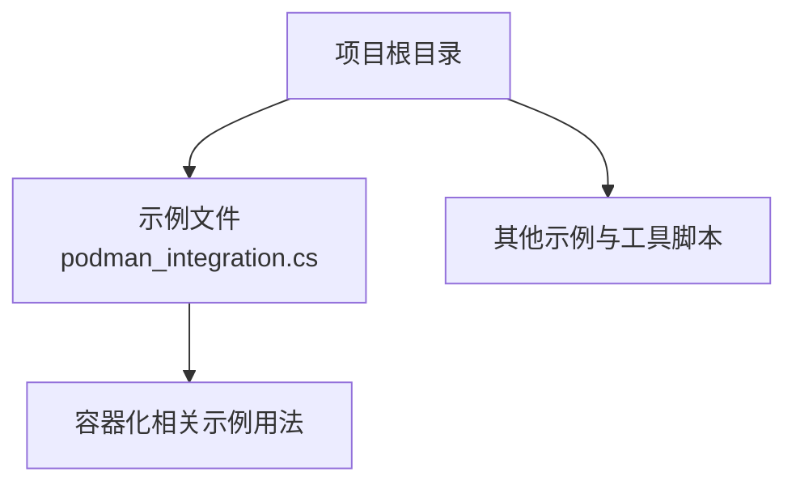
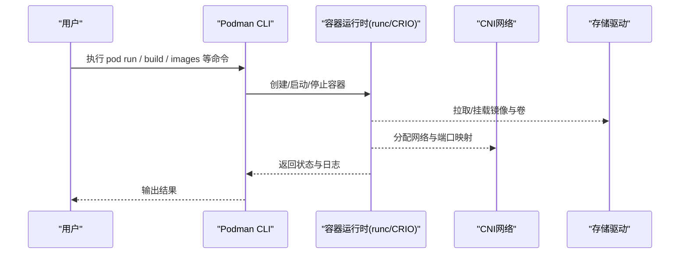
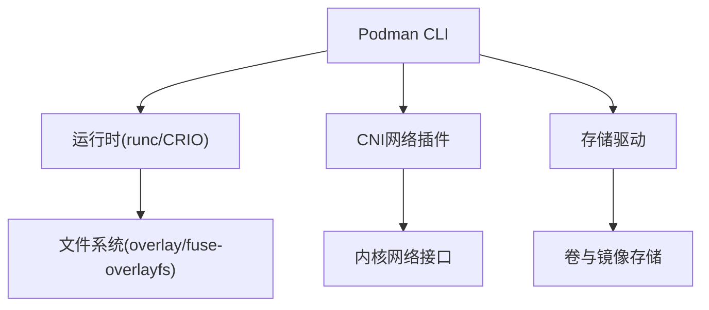

# Podman容器运行时

<cite>
**本文引用的文件**   
- [podman_integration.cs](file://podman_integration.cs)
</cite>

## 目录
1. [简介](#简介)
2. [项目结构](#项目结构)
3. [核心组件](#核心组件)
4. [架构总览](#架构总览)
5. [详细组件分析](#详细组件分析)
6. [依赖分析](#依赖分析)
7. [性能考量](#性能考量)
8. [故障排查指南](#故障排查指南)
9. [结论](#结论)
10. [附录](#附录)

## 简介
本文件面向希望从Docker迁移到Podman或在新环境中采用Podman作为容器运行时的团队与个人，提供从概念到实践的系统性说明。内容涵盖：
- Podman与Docker的差异、无守护进程架构优势与安全性特性
- Podman常用命令、镜像管理、容器生命周期管理与网络配置
- Pod概念、卷管理与系统服务集成
- Rootless模式配置要点
- 从Docker迁移到Podman的步骤、兼容性处理与性能对比建议

本仓库中与Podman相关的参考实现位于单一集成示例文件中，用于展示在应用层如何与容器编排/镜像构建等流程协作的常见思路。

## 项目结构
本项目为多语言示例集合，其中与容器化相关的内容以独立示例文件形式存在。与Podman直接相关的参考代码位于根目录下的单个集成示例文件，便于快速定位与学习。

图表来源 
- [podman_integration.cs](file://podman_integration.cs)

章节来源
- [podman_integration.cs](file://podman_integration.cs)

## 核心组件
- 容器运行时与CLI：Podman提供与Docker兼容的命令集（如run、build、images、ps等），但采用无守护进程模型，每个命令以用户态进程执行，降低特权面。
- 镜像与注册表：支持OCI镜像标准，可直接使用Docker Hub、私有Registry等；可通过别名将docker命令映射到podman。
- 容器与Pod：Podman原生支持Pod概念，便于模拟Kubernetes工作负载形态。
- 存储与卷：默认使用本地存储驱动，支持绑定挂载与命名卷，路径权限由Rootless机制控制。
- 网络：内置CNI网络栈，支持bridge、portmap等插件，可创建隔离网络并暴露端口。
- 安全与Rootless：通过用户命名空间、rootlesskit等技术实现非root运行，减少提权风险。

章节来源
- [podman_integration.cs](file://podman_integration.cs)

## 架构总览
Podman的无守护进程架构意味着每次容器操作都是独立的进程调用，避免了中心化守护进程的单点故障与权限集中问题。下图展示了典型的工作流：用户在命令行发起容器操作，Podman解析参数后直接调用底层运行时能力（runc/CRIO等）完成容器生命周期管理。

图表来源 
- [podman_integration.cs](file://podman_integration.cs)

## 详细组件分析

### 命令与生命周期
- 常用命令：镜像拉取与查看、容器创建与运行、日志查看、进入交互式终端、删除镜像与容器等。
- 生命周期：创建→启动→运行→停止→删除；Podman提供与Docker相近的命令语义，便于迁移。
- 后台任务：Podman支持systemd单元生成与管理，适合将容器作为系统服务运行。

章节来源
- [podman_integration.cs](file://podman_integration.cs)

### 镜像管理
- 镜像来源：支持OCI镜像格式，可从公共或私有仓库拉取。
- 构建：可使用podman build基于Dockerfile构建镜像，兼容多数Docker指令。
- 标签与推送：支持镜像打标签、签名与推送到Registry。

章节来源
- [podman_integration.cs](file://podman_integration.cs)

### 容器与Pod
- 容器：单进程隔离的运行环境，适合微服务与工具类应用。
- Pod：一组共享网络和存储的容器集合，便于模拟Kubernetes部署形态，简化多容器协作。

章节来源
- [podman_integration.cs](file://podman_integration.cs)

### 卷与存储
- 绑定挂载：将宿主机目录映射到容器内路径，适用于配置文件与数据持久化。
- 命名卷：由Podman管理的命名存储空间，便于跨容器共享与备份。
- Rootless权限：在非root模式下，需确保宿主目录对当前用户可读/写。

章节来源
- [podman_integration.cs](file://podman_integration.cs)

### 网络配置
- 网络类型：bridge、host、macvlan等，结合CNI插件实现灵活的网络拓扑。
- 端口映射：将容器端口映射到宿主机端口，便于外部访问。
- 防火墙与安全组：结合系统防火墙策略限制入站流量。

章节来源
- [podman_integration.cs](file://podman_integration.cs)

### 系统服务与Rootless
- 系统服务：通过systemd单元管理容器生命周期，开机自启与崩溃恢复。
- Rootless模式：无需root权限运行容器，降低安全风险；需要正确配置用户命名空间与资源限制。

章节来源
- [podman_integration.cs](file://podman_integration.cs)

### 从Docker迁移到Podman
- 命令替换：将docker替换为podman，或通过别名实现无缝切换。
- 镜像与仓库：确认镜像遵循OCI标准，必要时调整仓库认证方式。
- 网络与卷：检查端口映射与卷路径权限，尤其在Rootless模式下。
- 服务编排：将docker-compose转换为podman compose或使用systemd单元。
- 兼容性测试：在预生产环境验证功能与性能，逐步灰度上线。

章节来源
- [podman_integration.cs](file://podman_integration.cs)

### 性能对比与建议
- 启动速度：无守护进程减少了中间层开销，通常启动更快。
- 资源占用：无常驻守护进程，内存与CPU占用更低。
- I/O与网络：合理选择存储驱动与网络插件，避免不必要的拷贝与转发。
- 监控与度量：结合Prometheus、cAdvisor等工具采集指标，持续优化。

章节来源
- [podman_integration.cs](file://podman_integration.cs)

## 依赖分析
Podman依赖底层运行时（如runc）、CNI网络插件与存储驱动。应用层通过CLI与这些组件交互，形成松耦合的模块化架构。下图展示主要依赖关系：

图表来源 
- [podman_integration.cs](file://podman_integration.cs)

章节来源
- [podman_integration.cs](file://podman_integration.cs)

## 性能考量
- 镜像分层与缓存：合理使用基础镜像与多阶段构建，减少镜像体积与构建时间。
- 资源限制：为容器设置CPU与内存上限，避免争用影响整体稳定性。
- 网络优化：选择合适的网络模式与插件，减少延迟与丢包。
- 存储I/O：优先使用本地高性能存储，避免远程挂载带来的额外开销。
- 监控告警：建立完善的指标采集与告警机制，及时发现性能瓶颈。

[本节为通用指导，不直接分析具体文件]

## 故障排查指南
- 权限问题：在Rootless模式下，检查目录权限与SELinux/AppArmor策略。
- 网络不通：确认CNI插件安装与配置，检查端口冲突与防火墙规则。
- 镜像拉取失败：核对仓库地址、认证信息与网络连通性。
- 容器无法启动：查看容器日志与系统日志，定位错误原因。
- 性能异常：使用top、htop、iostat、netstat等工具分析资源使用情况。

章节来源
- [podman_integration.cs](file://podman_integration.cs)

## 结论
Podman以其无守护进程架构、强安全性与良好的Docker兼容性，成为替代Docker的优秀选择。通过合理的命令使用、镜像与网络配置、以及Rootless模式部署，可以在保证安全的前提下提升系统的稳定性与性能。从Docker迁移到Podman的关键在于理解差异、做好兼容性测试与渐进式替换。

[本节为总结性内容，不直接分析具体文件]

## 附录
- 常用命令速查：run、build、images、ps、logs、exec、stop、rm、network、volume等。
- 最佳实践：最小化镜像、非root运行、资源限制、健康检查、日志轮转。
- 参考资源：官方文档、社区论坛、开源镜像仓库与CI/CD集成示例。

[本节为补充信息，不直接分析具体文件]