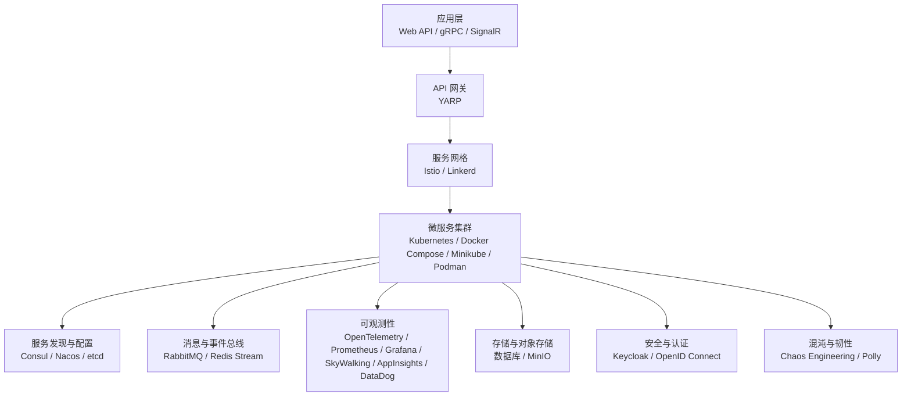
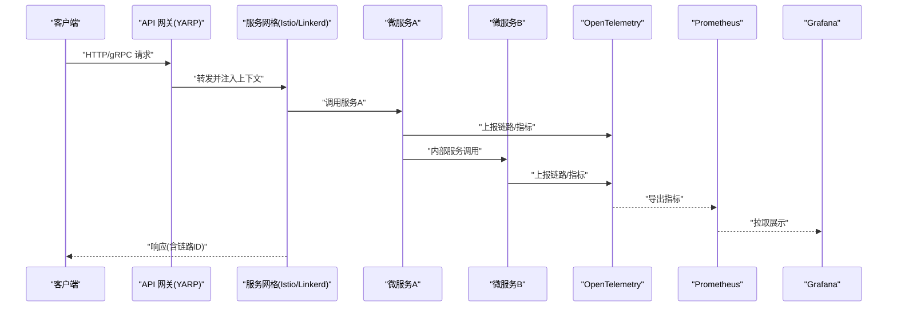
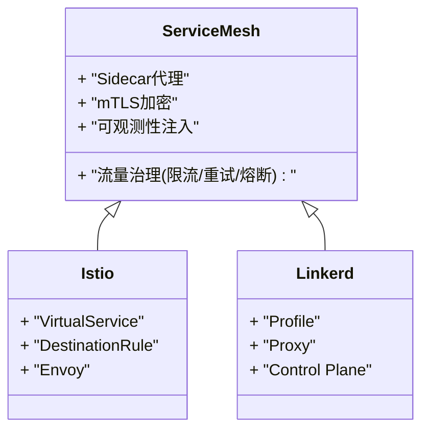
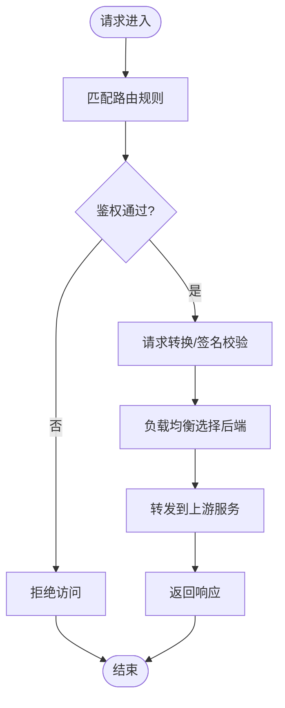
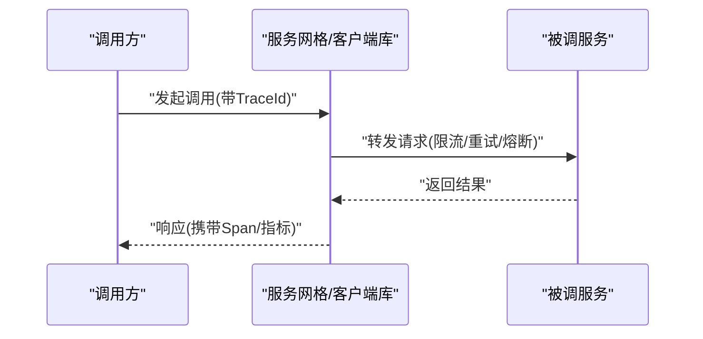
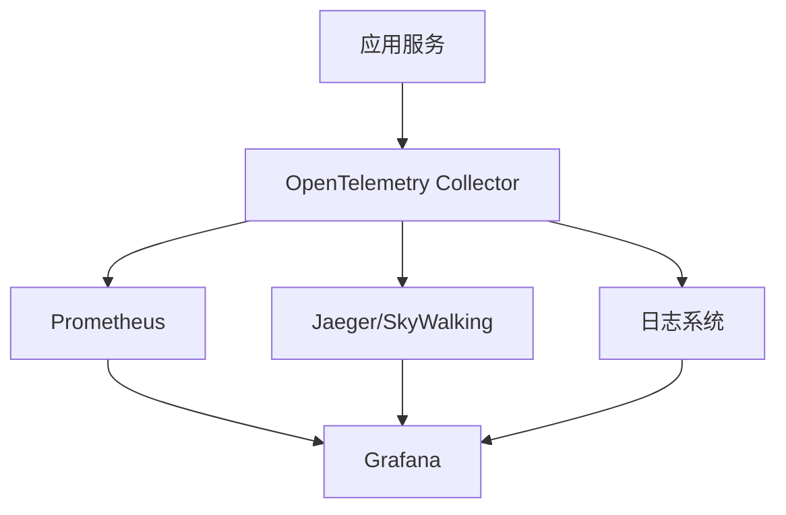
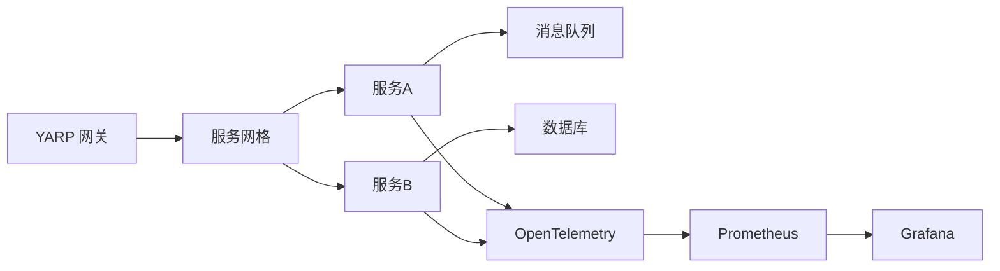

# 云原生部署

<cite>
**本文引用的文件**   
- [README.md](file://README.md)
- [k8s_integration.cs](file://k8s_integration.cs)
- [docker_compose_integration.cs](file://docker_compose_integration.cs)
- [minikube_integration.cs](file://minikube_integration.cs)
- [podman_integration.cs](file://podman_integration.cs)
- [service_mesh_enhanced.cs](file://service_mesh_enhanced.cs)
- [linkers_mesh_integration.cs](file://linkers_mesh_integration.cs)
- [restsharp_mesh.cs](file://restsharp_mesh.cs)
- [webapiclientcore_mesh.cs](file://webapiclientcore_mesh.cs)
- [yarp_integration.cs](file://yarp_integration.cs)
- [yarp_advanced_features.cs](file://yarp_advanced_features.cs)
- [opentelemetry_integration.cs](file://opentelemetry_integration.cs)
- [distributed_tracing.cs](file://distributed_tracing.cs)
- [prometheus_metrics.cs](file://prometheus_metrics.cs)
- [grafana_integration.cs](file://grafana_integration.cs)
- [appinsights_prometheus.cs](file://appinsights_prometheus.cs)
- [skyapm_prometheus.cs](file://skyapm_prometheus.cs)
- [datadog_prometheus.cs](file://datadog_prometheus.cs)
- [consul_integration.cs](file://consul_integration.cs)
- [nacos_integration.cs](file://nacos_integration.cs)
- [etcd_integration.cs](file://etcd_integration.cs)
- [rabbitmq_production_integration.cs](file://rabbitmq_production_integration.cs)
- [redis_stream_integration.cs](file://redis_stream_integration.cs)
- [chaos_integration.cs](file://chaos_integration.cs)
- [database_backup_service.cs](file://database_backup_service.cs)
- [history_restore_service.cs](file://history_restore_service.cs)
- [incremental_backup.cs](file://incremental_backup.cs)
</cite>

## 目录
1. [简介](#简介)
2. [项目结构](#项目结构)
3. [核心组件](#核心组件)
4. [架构总览](#架构总览)
5. [详细组件分析](#详细组件分析)
6. [依赖关系分析](#依赖关系分析)
7. [性能考量](#性能考量)
8. [故障排查指南](#故障排查指南)
9. [结论](#结论)
10. [附录](#附录)

## 简介
本文件面向云原生部署与运维，围绕微服务架构模式、分布式系统挑战与服务网格（Istio、Linkerd）集成、API 网关配置、服务间通信、可观测性（分布式追踪、日志聚合、指标监控）、多云/混合云部署、灾难恢复与业务连续性等主题，提供系统化、可落地的实践指南。文档基于仓库中的示例与集成代码进行归纳总结，帮助读者快速构建高可用、可观测、弹性伸缩的云原生平台。

## 项目结构
该仓库包含大量“集成示例”与“能力演示”文件，覆盖容器编排、服务网格、API 网关、可观测性、服务发现、消息总线、混沌工程与备份恢复等关键领域。整体组织以“能力/技术栈 + 集成实现”的方式命名，便于按需查阅与组合使用。

[无图表来源：该图为概念性结构示意]

**章节来源**
- [README.md](file://README.md)

## 核心组件
- 容器与编排
  - Kubernetes、Docker Compose、Minikube、Podman 的集成示例，用于本地开发、测试与生产编排。
- 服务网格
  - Istio、Linkerd 的集成与增强示例，提供流量治理、安全、可观测性注入。
- API 网关
  - YARP 作为反向代理与路由中心，支持负载均衡、熔断、重试、签名校验等高级特性。
- 服务发现与配置中心
  - Consul、Nacos、etcd 的集成，支撑动态服务注册、健康检查与配置下发。
- 消息与事件驱动
  - RabbitMQ、Redis Stream 的生产级集成，支撑异步解耦与流式处理。
- 可观测性
  - OpenTelemetry 统一采集，Prometheus 指标收集，Grafana 可视化；SkyWalking、App Insights、DataDog 多后端接入。
- 混沌工程与韧性
  - Chaos 注入与 Polly 策略，提升系统在异常场景下的自愈能力。
- 备份与恢复
  - 数据库备份、增量备份与历史恢复服务，保障数据一致性与 RTO/RPO。

**章节来源**
- [k8s_integration.cs](file://k8s_integration.cs)
- [docker_compose_integration.cs](file://docker_compose_integration.cs)
- [minikube_integration.cs](file://minikube_integration.cs)
- [podman_integration.cs](file://podman_integration.cs)
- [service_mesh_enhanced.cs](file://service_mesh_enhanced.cs)
- [linkers_mesh_integration.cs](file://linkers_mesh_integration.cs)
- [yarp_integration.cs](file://yarp_integration.cs)
- [yarp_advanced_features.cs](file://yarp_advanced_features.cs)
- [consul_integration.cs](file://consul_integration.cs)
- [nacos_integration.cs](file://nacos_integration.cs)
- [etcd_integration.cs](file://etcd_integration.cs)
- [rabbitmq_production_integration.cs](file://rabbitmq_production_integration.cs)
- [redis_stream_integration.cs](file://redis_stream_integration.cs)
- [opentelemetry_integration.cs](file://opentelemetry_integration.cs)
- [prometheus_metrics.cs](file://prometheus_metrics.cs)
- [grafana_integration.cs](file://grafana_integration.cs)
- [skyapm_prometheus.cs](file://skyapm_prometheus.cs)
- [appinsights_prometheus.cs](file://appinsights_prometheus.cs)
- [datadog_prometheus.cs](file://datadog_prometheus.cs)
- [chaos_integration.cs](file://chaos_integration.cs)
- [database_backup_service.cs](file://database_backup_service.cs)
- [history_restore_service.cs](file://history_restore_service.cs)
- [incremental_backup.cs](file://incremental_backup.cs)

## 架构总览
下图展示从客户端到微服务的典型请求路径，以及服务网格、API 网关与可观测性组件的协作方式。

**图表来源**
- [yarp_integration.cs](file://yarp_integration.cs)
- [service_mesh_enhanced.cs](file://service_mesh_enhanced.cs)
- [opentelemetry_integration.cs](file://opentelemetry_integration.cs)
- [prometheus_metrics.cs](file://prometheus_metrics.cs)
- [grafana_integration.cs](file://grafana_integration.cs)

**章节来源**
- [yarp_integration.cs](file://yarp_integration.cs)
- [service_mesh_enhanced.cs](file://service_mesh_enhanced.cs)
- [opentelemetry_integration.cs](file://opentelemetry_integration.cs)
- [prometheus_metrics.cs](file://prometheus_metrics.cs)
- [grafana_integration.cs](file://grafana_integration.cs)

## 详细组件分析

### 容器与编排（Kubernetes、Docker Compose、Minikube、Podman）
- 目标：提供一致的本地开发与生产环境，支持滚动升级、扩缩容、资源隔离。
- 关键点：
  - K8s 资源清单与控制器管理 Deployment、Service、Ingress、ConfigMap、Secret。
  - Docker Compose 用于单机多容器编排与快速验证。
  - Minikube 提供本地 K8s 集群体验。
  - Podman 替代 Docker 的无守护进程容器运行时。
- 建议：
  - 使用 Helm 模板化部署，结合 GitOps（ArgoCD/Flux）持续交付。
  - 通过 HPA/VPA 自动扩缩容与资源调优。
  - 将敏感信息放入 Secret，避免硬编码。

**章节来源**
- [k8s_integration.cs](file://k8s_integration.cs)
- [docker_compose_integration.cs](file://docker_compose_integration.cs)
- [minikube_integration.cs](file://minikube_integration.cs)
- [podman_integration.cs](file://podman_integration.cs)

### 服务网格（Istio、Linkerd）
- 目标：将横切关注点（流量治理、安全、可观测性）下沉至基础设施层，降低业务侵入。
- 关键点：
  - Sidecar 代理拦截入出站流量，实现 mTLS、限流、重试、熔断、灰度发布。
  - 与 OpenTelemetry 集成，自动注入 Trace Context。
  - 通过 VirtualService/DestinationRule 或 Linkerd 的 Profile 声明式控制。
- 建议：
  - 在命名空间级别启用 mTLS 与访问控制。
  - 使用 Canary/Blue-Green 策略渐进式发布。
  - 对关键路径开启延迟预算与超时保护。

**图表来源**
- [service_mesh_enhanced.cs](file://service_mesh_enhanced.cs)
- [linkers_mesh_integration.cs](file://linkers_mesh_integration.cs)

**章节来源**
- [service_mesh_enhanced.cs](file://service_mesh_enhanced.cs)
- [linkers_mesh_integration.cs](file://linkers_mesh_integration.cs)

### API 网关（YARP）
- 目标：统一入口、跨域、鉴权、路由、负载均衡、协议转换、缓存与压缩。
- 关键点：
  - 反向代理与路由规则定义，支持按路径/域名/头字段路由。
  - 中间件链集成签名校验、限流、CORS、压缩、批处理。
  - 与上游服务发现联动，动态更新后端节点。
- 建议：
  - 将外部暴露面最小化，仅开放必要接口。
  - 对上游调用设置超时、重试与熔断策略。
  - 结合 WAF/防火墙做威胁防护。

**图表来源**
- [yarp_integration.cs](file://yarp_integration.cs)
- [yarp_advanced_features.cs](file://yarp_advanced_features.cs)

**章节来源**
- [yarp_integration.cs](file://yarp_integration.cs)
- [yarp_advanced_features.cs](file://yarp_advanced_features.cs)

### 服务间通信（REST/gRPC/WebSocket/MQTT）
- 目标：在高并发与弱网环境下保证可靠、低延迟的服务通信。
- 关键点：
  - REST 使用 Refit/HttpClientFactory 封装，配合 Polly 实现重试、熔断、退避。
  - gRPC 使用 Protobuf 序列化，适合高性能 RPC。
  - WebSocket/MQTT 用于实时双向通信与设备接入。
  - 通过服务网格或客户端库注入链路追踪与指标。
- 建议：
  - 为所有远程调用设置超时、重试与降级策略。
  - 使用连接池与 HTTP/2 提升吞吐。
  - 对热点接口实施缓存与幂等设计。

**图表来源**
- [restsharp_mesh.cs](file://restsharp_mesh.cs)
- [webapiclientcore_mesh.cs](file://webapiclientcore_mesh.cs)
- [distributed_tracing.cs](file://distributed_tracing.cs)

**章节来源**
- [restsharp_mesh.cs](file://restsharp_mesh.cs)
- [webapiclientcore_mesh.cs](file://webapiclientcore_mesh.cs)
- [distributed_tracing.cs](file://distributed_tracing.cs)

### 服务发现与配置中心（Consul、Nacos、etcd）
- 目标：动态注册/注销服务实例，集中管理配置，支持热更新。
- 关键点：
  - 健康检查与心跳机制确保流量只路由到健康实例。
  - 配置变更推送与版本回滚。
  - 与 K8s Service/Ingress 或服务网格联动。
- 建议：
  - 配置分环境隔离（dev/staging/prod）。
  - 敏感配置加密存储与审计。
  - 定期演练配置回滚流程。

**章节来源**
- [consul_integration.cs](file://consul_integration.cs)
- [nacos_integration.cs](file://nacos_integration.cs)
- [etcd_integration.cs](file://etcd_integration.cs)

### 消息与事件驱动（RabbitMQ、Redis Stream）
- 目标：解耦服务、削峰填谷、异步处理与最终一致性。
- 关键点：
  - 生产者/消费者模型，死信队列与重试策略。
  - 流式处理与窗口聚合。
  - 与事务或补偿机制结合保证可靠性。
- 建议：
  - 合理分区与消费组设计，避免热点。
  - 监控堆积与消费延迟。
  - 幂等消费与去重。

**章节来源**
- [rabbitmq_production_integration.cs](file://rabbitmq_production_integration.cs)
- [redis_stream_integration.cs](file://redis_stream_integration.cs)

### 可观测性（OpenTelemetry、Prometheus、Grafana、SkyWalking、App Insights、DataDog）
- 目标：全链路可观测，统一采集指标、日志、追踪，快速定位问题。
- 关键点：
  - OpenTelemetry SDK 自动/手动埋点，标准化 Span/Trace。
  - Prometheus 抓取 .NET 指标，Grafana 可视化。
  - SkyWalking/App Insights/DataDog 作为多后端汇聚与告警。
- 建议：
  - 定义关键业务指标（SLO/SLI），建立告警规则。
  - 日志结构化输出，关联 TraceId。
  - 采样策略平衡成本与可观测性。

**图表来源**
- [opentelemetry_integration.cs](file://opentelemetry_integration.cs)
- [prometheus_metrics.cs](file://prometheus_metrics.cs)
- [grafana_integration.cs](file://grafana_integration.cs)
- [skyapm_prometheus.cs](file://skyapm_prometheus.cs)
- [appinsights_prometheus.cs](file://appinsights_prometheus.cs)
- [datadog_prometheus.cs](file://datadog_prometheus.cs)

**章节来源**
- [opentelemetry_integration.cs](file://opentelemetry_integration.cs)
- [distributed_tracing.cs](file://distributed_tracing.cs)
- [prometheus_metrics.cs](file://prometheus_metrics.cs)
- [grafana_integration.cs](file://grafana_integration.cs)
- [skyapm_prometheus.cs](file://skyapm_prometheus.cs)
- [appinsights_prometheus.cs](file://appinsights_prometheus.cs)
- [datadog_prometheus.cs](file://datadog_prometheus.cs)

### 混沌工程与韧性（Chaos、Polly）
- 目标：主动注入故障，验证系统韧性，完善应急预案。
- 关键点：
  - 网络延迟/丢包、CPU/内存压力、依赖服务宕机模拟。
  - 重试、熔断、舱壁、超时、降级策略组合。
- 建议：
  - 在预发/生产灰度环境逐步推进。
  - 建立故障演练剧本与复盘机制。

**章节来源**
- [chaos_integration.cs](file://chaos_integration.cs)

### 备份与恢复（数据库备份、增量备份、历史恢复）
- 目标：保障数据安全与业务连续性，满足 RTO/RPO 要求。
- 关键点：
  - 全量/增量备份策略与保留周期。
  - 自动化恢复流程与演练。
  - 跨地域复制与异地灾备。
- 建议：
  - 备份数据加密与完整性校验。
  - 监控备份成功率与耗时。
  - 制定分级恢复预案（部分恢复/全量恢复）。

**章节来源**
- [database_backup_service.cs](file://database_backup_service.cs)
- [history_restore_service.cs](file://history_restore_service.cs)
- [incremental_backup.cs](file://incremental_backup.cs)

## 依赖关系分析
- 组件耦合
  - API 网关与上游服务松耦合，通过服务发现与网格治理。
  - 可观测性通过标准协议（OTLP/Prometheus）解耦后端。
- 外部依赖
  - 容器运行时、编排平台、消息中间件、存储与对象存储。
- 潜在循环依赖
  - 通过事件驱动与异步解耦避免同步强依赖。
- 接口契约
  - OpenAPI/gRPC Proto 定义稳定契约，配合契约测试。

**图表来源**
- [yarp_integration.cs](file://yarp_integration.cs)
- [service_mesh_enhanced.cs](file://service_mesh_enhanced.cs)
- [opentelemetry_integration.cs](file://opentelemetry_integration.cs)
- [prometheus_metrics.cs](file://prometheus_metrics.cs)
- [grafana_integration.cs](file://grafana_integration.cs)

**章节来源**
- [yarp_integration.cs](file://yarp_integration.cs)
- [service_mesh_enhanced.cs](file://service_mesh_enhanced.cs)
- [opentelemetry_integration.cs](file://opentelemetry_integration.cs)
- [prometheus_metrics.cs](file://prometheus_metrics.cs)
- [grafana_integration.cs](file://grafana_integration.cs)

## 性能考量
- 网络与序列化
  - 优先使用 HTTP/2 与 gRPC，Protobuf 减少体积与解析开销。
- 连接与线程
  - 合理设置连接池大小、线程池上限，避免阻塞 IO。
- 缓存与幂等
  - 多级缓存（本地/分布式）与幂等键设计，降低重复计算与写放大。
- 背压与限流
  - 令牌桶/漏桶算法，保护下游与自身稳定性。
- 采样与降级
  - 追踪采样率动态调整，热点接口降级与熔断。

[本节为通用指导，不直接分析具体文件]

## 故障排查指南
- 常见问题
  - 服务不可达：检查服务发现与健康检查、DNS/网络策略。
  - 高延迟：查看链路追踪，定位慢依赖与锁竞争。
  - 指标异常：核对采集端点、标签维度与告警阈值。
  - 消息堆积：检查消费者处理能力与重试风暴。
  - 备份失败：确认权限、存储空间与网络连通性。
- 排查步骤
  - 通过 TraceId 串联日志与指标，定位根因。
  - 使用混沌演练复现问题，验证修复有效性。
  - 建立 Runbook 与自动化恢复脚本。

**章节来源**
- [distributed_tracing.cs](file://distributed_tracing.cs)
- [prometheus_metrics.cs](file://prometheus_metrics.cs)
- [chaos_integration.cs](file://chaos_integration.cs)
- [database_backup_service.cs](file://database_backup_service.cs)

## 结论
通过容器化编排、服务网格、API 网关、可观测性与韧性工程的体系化建设，可在多云/混合云环境中实现高可用、可扩展、易运维的云原生平台。建议以 OpenTelemetry 为核心统一可观测性，以 YARP+网格构建弹性边界，以事件驱动与备份恢复保障业务连续性，并以混沌工程持续验证与改进系统韧性。

[本节为总结性内容，不直接分析具体文件]

## 附录
- 最佳实践清单
  - 安全：mTLS、最小权限、密钥轮换、审计日志。
  - 发布：蓝绿/金丝雀发布、回滚策略、变更审批。
  - 容量：压测基线、弹性策略、容量规划。
  - 合规：数据脱敏、跨境传输、隐私保护。
- 参考实现路径
  - 容器编排：[k8s_integration.cs](file://k8s_integration.cs)、[docker_compose_integration.cs](file://docker_compose_integration.cs)、[minikube_integration.cs](file://minikube_integration.cs)、[podman_integration.cs](file://podman_integration.cs)
  - 服务网格：[service_mesh_enhanced.cs](file://service_mesh_enhanced.cs)、[linkers_mesh_integration.cs](file://linkers_mesh_integration.cs)
  - API 网关：[yarp_integration.cs](file://yarp_integration.cs)、[yarp_advanced_features.cs](file://yarp_advanced_features.cs)
  - 服务通信：[restsharp_mesh.cs](file://restsharp_mesh.cs)、[webapiclientcore_mesh.cs](file://webapiclientcore_mesh.cs)、[distributed_tracing.cs](file://distributed_tracing.cs)
  - 服务发现：[consul_integration.cs](file://consul_integration.cs)、[nacos_integration.cs](file://nacos_integration.cs)、[etcd_integration.cs](file://etcd_integration.cs)
  - 消息总线：[rabbitmq_production_integration.cs](file://rabbitmq_production_integration.cs)、[redis_stream_integration.cs](file://redis_stream_integration.cs)
  - 可观测性：[opentelemetry_integration.cs](file://opentelemetry_integration.cs)、[prometheus_metrics.cs](file://prometheus_metrics.cs)、[grafana_integration.cs](file://grafana_integration.cs)、[skyapm_prometheus.cs](file://skyapm_prometheus.cs)、[appinsights_prometheus.cs](file://appinsights_prometheus.cs)、[datadog_prometheus.cs](file://datadog_prometheus.cs)
  - 混沌工程：[chaos_integration.cs](file://chaos_integration.cs)
  - 备份恢复：[database_backup_service.cs](file://database_backup_service.cs)、[history_restore_service.cs](file://history_restore_service.cs)、[incremental_backup.cs](file://incremental_backup.cs)

[本节为参考索引，不直接分析具体文件]