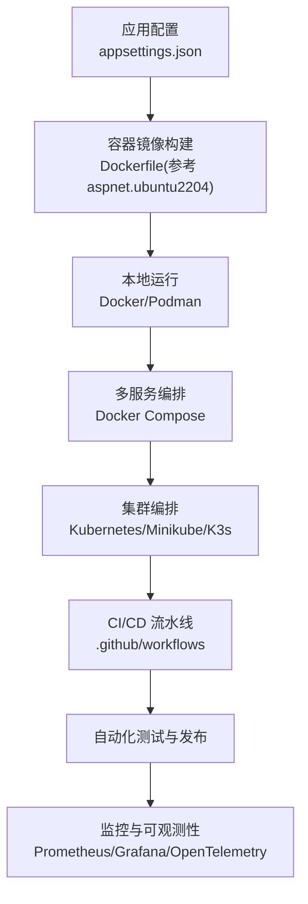
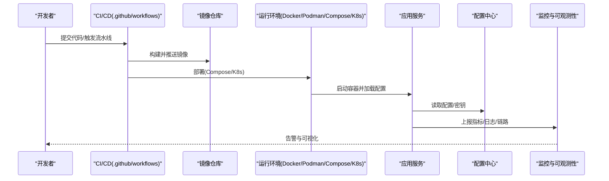
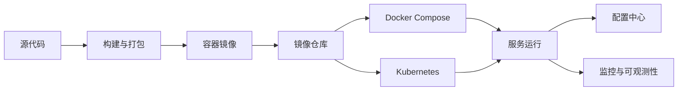

# 容器化与部署

<cite>
**本文引用的文件**   
- [docker_integration.cs](file://docker_integration.cs)
- [docker_compose_integration.cs](file://docker_compose_integration.cs)
- [docker_compose_advanced_integration.cs](file://docker_compose_advanced_integration.cs)
- [podman_integration.cs](file://podman_integration.cs)
- [k8s_integration.cs](file://k8s_integration.cs)
- [minikube_integration.cs](file://minikube_integration.cs)
- [k3s_integration.cs](file://k3s_integration.cs)
- [aspnet.ubuntu2204](file://aspnet.ubuntu2204)
- [appsettings.json](file://appsettings.json)
- [build.cake](file://build.cake)
- [.github/workflows/](file://.github/workflows/)
</cite>

## 目录
1. [简介](#简介)
2. [项目结构](#项目结构)
3. [核心组件](#核心组件)
4. [架构总览](#架构总览)
5. [详细组件分析](#详细组件分析)
6. [依赖关系分析](#依赖关系分析)
7. [性能考量](#性能考量)
8. [故障排查指南](#故障排查指南)
9. [结论](#结论)
10. [附录](#附录)

## 简介
本文件面向容器化与部署，覆盖 Docker 镜像构建、Kubernetes 编排、Docker Compose 编排与 Podman 运行时；并给出环境变量管理、配置中心集成、灰度发布与滚动更新策略、CI/CD 流水线、自动化测试与部署监控、云原生最佳实践、服务网格集成以及弹性伸缩配置的指导。内容基于仓库中已有的示例与集成代码进行提炼与组织，帮助读者快速落地生产级容器化方案。

## 项目结构
仓库包含大量“集成”示例文件，其中与容器化与部署直接相关的包括：
- Docker 与镜像构建相关示例
- Docker Compose 多服务编排示例
- Podman 运行时示例
- Kubernetes（含 Minikube、K3s）集成示例
- 应用配置与环境变量入口
- 构建脚本与 GitHub Actions 工作流目录

图表来源
- [aspnet.ubuntu2204](file://aspnet.ubuntu2204)
- [appsettings.json](file://appsettings.json)
- [.github/workflows/](file://.github/workflows/)

章节来源
- [aspnet.ubuntu2204](file://aspnet.ubuntu2204)
- [appsettings.json](file://appsettings.json)
- [build.cake](file://build.cake)
- [.github/workflows/](file://.github/workflows/)

## 核心组件
- Docker 镜像构建与运行：通过示例了解如何为 .NET 应用构建最小化镜像、暴露端口、设置健康检查与日志输出。
- Docker Compose 编排：定义多服务拓扑（如 Web/API、数据库、缓存、消息队列），统一启动与网络隔离。
- Podman 运行时：无守护进程容器运行时，适合安全敏感环境或 Rootless 场景。
- Kubernetes 编排：使用 Deployment、Service、ConfigMap、Secret、HPA、Ingress 等对象实现高可用与弹性伸缩。
- CI/CD 流水线：在 GitHub Actions 中完成构建、测试、镜像推送与部署。
- 配置与环境变量：集中管理应用配置与密钥，支持动态刷新与多环境差异化。
- 可观测性与监控：指标、日志、链路追踪一体化采集与告警。

章节来源
- [docker_integration.cs](file://docker_integration.cs)
- [docker_compose_integration.cs](file://docker_compose_integration.cs)
- [docker_compose_advanced_integration.cs](file://docker_compose_advanced_integration.cs)
- [podman_integration.cs](file://podman_integration.cs)
- [k8s_integration.cs](file://k8s_integration.cs)
- [minikube_integration.cs](file://minikube_integration.cs)
- [k3s_integration.cs](file://k3s_integration.cs)
- [appsettings.json](file://appsettings.json)
- [build.cake](file://build.cake)
- [.github/workflows/](file://.github/workflows/)

## 架构总览
下图展示从代码到生产环境的端到端流程：代码提交触发 CI/CD，构建镜像并推送到镜像仓库；随后由编排系统（Compose 或 K8s）拉取镜像并部署；应用通过配置中心注入配置，并通过监控体系上报指标与日志。

图表来源
- [.github/workflows/](file://.github/workflows/)
- [docker_compose_integration.cs](file://docker_compose_integration.cs)
- [k8s_integration.cs](file://k8s_integration.cs)
- [appsettings.json](file://appsettings.json)

## 详细组件分析

### Docker 镜像构建与运行
- 目标：以最小镜像体积与安全基线构建可移植镜像，暴露必要端口，提供健康检查与结构化日志。
- 关键点：
  - 选择合适的基础镜像（如 ASP.NET 运行时）。
  - 多阶段构建减少最终镜像大小。
  - 非 root 用户运行，限制权限。
  - 健康检查与优雅关闭。
  - 环境变量与配置文件挂载分离。

章节来源
- [docker_integration.cs](file://docker_integration.cs)
- [aspnet.ubuntu2204](file://aspnet.ubuntu2204)

### Docker Compose 多服务编排
- 目标：一键拉起 API、数据库、缓存、消息中间件等依赖服务，统一网络与卷管理。
- 关键点：
  - 服务间通信通过内部网络与服务名解析。
  - 数据持久化通过卷映射。
  - 环境变量集中管理，支持不同环境覆盖。
  - 健康检查与依赖启动顺序控制。

章节来源
- [docker_compose_integration.cs](file://docker_compose_integration.cs)
- [docker_compose_advanced_integration.cs](file://docker_compose_advanced_integration.cs)

### Podman 容器运行时
- 目标：在无守护进程环境下运行容器，提升安全性与合规性。
- 关键点：
  - 支持 Rootless 模式。
  - 兼容 Docker CLI 命令，便于迁移。
  - 与 CI/CD 集成时注意权限与存储驱动。

章节来源
- [podman_integration.cs](file://podman_integration.cs)

### Kubernetes 编排与弹性伸缩
- 目标：在生产集群中实现高可用、滚动更新、自动扩缩容与流量治理。
- 关键点：
  - Deployment 管理副本与滚动更新策略。
  - Service 暴露服务，Ingress 管理外部访问。
  - ConfigMap/Secret 管理配置与密钥。
  - HPA 基于 CPU/内存或自定义指标自动扩缩容。
  - 探针（Liveness/Readiness）保障健康。

章节来源
- [k8s_integration.cs](file://k8s_integration.cs)
- [minikube_integration.cs](file://minikube_integration.cs)
- [k3s_integration.cs](file://k3s_integration.cs)

### 环境变量管理与配置中心集成
- 目标：将配置与代码解耦，支持多环境与动态刷新。
- 关键点：
  - 环境变量优先级高于配置文件。
  - 使用 Secret 管理敏感信息。
  - 接入配置中心（如 Nacos/Consul/Etcd）实现热更新。
  - 应用内按环境加载 appsettings.*.json。

章节来源
- [appsettings.json](file://appsettings.json)
- [docker_compose_advanced_integration.cs](file://docker_compose_advanced_integration.cs)
- [k8s_integration.cs](file://k8s_integration.cs)

### 灰度发布与滚动更新策略
- 目标：降低变更风险，逐步放量验证。
- 关键点：
  - 滚动更新：分批替换旧版本实例，保持服务可用。
  - 灰度发布：按权重或标签分流部分流量至新版本。
  - 结合 Ingress/网关实现路由规则切换。
  - 回滚策略：快速恢复到上一个稳定版本。

章节来源
- [k8s_integration.cs](file://k8s_integration.cs)

### CI/CD 流水线与自动化测试
- 目标：从代码到部署的全自动化，保证质量与一致性。
- 关键点：
  - 构建、单元测试、集成测试、静态检查。
  - 镜像构建与推送至镜像仓库。
  - 部署到开发/预发/生产环境，执行冒烟测试。
  - 失败回滚与通知机制。

章节来源
- [.github/workflows/](file://.github/workflows/)
- [build.cake](file://build.cake)

### 监控与可观测性
- 目标：全面掌握系统健康与性能，快速定位问题。
- 关键点：
  - 指标采集（Prometheus）、日志收集（ELK/Seq）、链路追踪（OpenTelemetry/Jaeger）。
  - 告警规则与阈值管理。
  - 仪表盘与报表可视化。

章节来源
- [k8s_integration.cs](file://k8s_integration.cs)
- [docker_compose_advanced_integration.cs](file://docker_compose_advanced_integration.cs)

### 云原生最佳实践
- 不可变基础设施：镜像即制品，禁止运行时修改。
- 声明式配置：YAML 描述期望状态，Git 管理版本。
- 安全基线：最小权限、镜像扫描、漏洞修复。
- 可观测性优先：埋点与指标先行。
- 弹性设计：无状态服务、水平扩展、重试与熔断。

章节来源
- [k8s_integration.cs](file://k8s_integration.cs)
- [docker_compose_advanced_integration.cs](file://docker_compose_advanced_integration.cs)

### 服务网格集成
- 目标：通过 Sidecar 代理实现流量治理、安全与可观测性。
- 关键点：
  - 引入 Istio/Linkerd，自动注入 Sidecar。
  - 流量切片、熔断、重试、超时、限流。
  - mTLS 加密与证书管理。
  - 与 K8s 资源无缝集成。

章节来源
- [k8s_integration.cs](file://k8s_integration.cs)

### 弹性伸缩配置
- 目标：根据负载自动调整副本数，平衡成本与性能。
- 关键点：
  - HPA 基于 CPU/内存或自定义指标（QPS、延迟、队列长度）。
  - VPA 优化资源请求与限制。
  - Cluster Autoscaler 自动扩容节点池。
  - 预热与冷启动优化。

章节来源
- [k8s_integration.cs](file://k8s_integration.cs)

## 依赖关系分析
容器化与部署的关键依赖关系如下：
- 应用依赖基础镜像与运行时环境。
- Compose 依赖服务间的网络与卷。
- K8s 依赖集群资源（API Server、调度器、存储、网络插件）。
- CI/CD 依赖代码仓库、镜像仓库与目标集群。
- 配置中心与监控系统作为外部依赖被应用消费。

图表来源
- [.github/workflows/](file://.github/workflows/)
- [docker_compose_integration.cs](file://docker_compose_integration.cs)
- [k8s_integration.cs](file://k8s_integration.cs)

章节来源
- [.github/workflows/](file://.github/workflows/)
- [docker_compose_integration.cs](file://docker_compose_integration.cs)
- [k8s_integration.cs](file://k8s_integration.cs)

## 性能考量
- 镜像体积：多阶段构建、精简依赖、避免调试符号。
- 启动时间：懒加载、连接池预热、异步初始化。
- 资源限制：合理设置 CPU/内存请求与限制，避免争用。
- I/O 优化：使用本地 SSD、共享卷与缓存层。
- 网络优化：服务就近调用、避免跨域与长链 RTT。
- 监控指标：关注 P95/P99 延迟、错误率、吞吐与资源利用率。

[本节为通用指导，不直接分析具体文件]

## 故障排查指南
- 镜像构建失败：检查基础镜像版本、依赖安装、权限与缓存。
- 容器无法启动：查看健康检查、环境变量、配置文件挂载与端口冲突。
- 服务间通信异常：确认网络策略、DNS 解析、防火墙与负载均衡。
- K8s 部署失败：检查 YAML 语法、资源配额、RBAC 与事件日志。
- 配置未生效：确认优先级、密钥格式、配置中心连通性与刷新策略。
- 性能退化：定位热点接口、慢查询、GC 压力与锁竞争。

章节来源
- [docker_compose_advanced_integration.cs](file://docker_compose_advanced_integration.cs)
- [k8s_integration.cs](file://k8s_integration.cs)

## 结论
通过 Docker、Podman、Docker Compose 与 Kubernetes 的组合，可以实现从本地开发到生产集群的完整容器化路径。配合 CI/CD、配置中心、监控与弹性伸缩，能够构建高可用、可观测、易运维的云原生系统。建议遵循最小权限、不可变镜像与声明式配置等最佳实践，持续优化性能与稳定性。

[本节为总结性内容，不直接分析具体文件]

## 附录
- 常用命令速查：
  - Docker：构建、运行、查看日志与健康检查。
  - Podman：Rootless 运行、权限与存储驱动配置。
  - Compose：up/down/logs 与多环境覆盖。
  - K8s：kubectl get/describe/logs/events，滚动更新与回滚。
- 推荐工具：
  - 镜像扫描与安全加固。
  - 配置中心（Nacos/Consul/Etcd）。
  - 监控（Prometheus/Grafana）、日志（ELK/Seq）、链路（OpenTelemetry/Jaeger）。
  - 服务网格（Istio/Linkerd）。

[本节为补充信息，不直接分析具体文件]