# API网关设计

<cite>
**本文引用的文件**   
- [yarp_advanced_features.cs](file://yarp_advanced_features.cs)
- [yarp_batch_middleware.cs](file://yarp_batch_middleware.cs)
- [yarp_circuit_breaker.cs](file://yarp_circuit_breaker.cs)
- [yarp_compression_middleware.cs](file://yarp_compression_middleware.cs)
- [yarp_integration.cs](file://yarp_integration.cs)
- [yarp_service_discovery.cs](file://yarp_service_discovery.cs)
- [yarp_signature_middleware.cs](file://yarp_signature_middleware.cs)
- [reverse_proxy_demo.cs](file://reverse_proxy_demo.cs)
- [rate_limiter.cs](file://rate_limiter.cs)
- [resilient_polly_integration.cs](file://resilient_polly_integration.cs)
- [multitenant_integration.cs](file://multitenant_integration.cs)
- [version_control_manager.cs](file://version_control_manager.cs)
- [openapi_integration.cs](file://openapi_integration.cs)
- [prometheus_metrics.cs](file://prometheus_metrics.cs)
- [opentelemetry_integration.cs](file://opentelemetry_integration.cs)
- [appsettings.json](file://appsettings.json)
</cite>

## 目录
1. [简介](#简介)
2. [项目结构](#项目结构)
3. [核心组件](#核心组件)
4. [架构总览](#架构总览)
5. [详细组件分析](#详细组件分析)
6. [依赖关系分析](#依赖关系分析)
7. [性能考量](#性能考量)
8. [故障排查指南](#故障排查指南)
9. [结论](#结论)
10. [附录](#附录)

## 简介
本文件面向API网关设计与实现，围绕YARP反向代理、请求路由、认证授权、限流熔断、中间件开发、请求/响应转换、配置管理、监控告警与日志记录等主题展开。同时覆盖多租户支持、API版本管理与灰度发布策略，帮助读者从零搭建一个高可用、可观测、可扩展的企业级API网关。

## 项目结构
仓库中包含多个与YARP网关相关的示例与集成文件，涵盖基础集成、高级特性、批处理、压缩、服务发现、签名校验、熔断限流、OpenAPI文档、指标与分布式追踪等。这些文件共同构成一个完整的网关能力集合，便于按需组合与扩展。

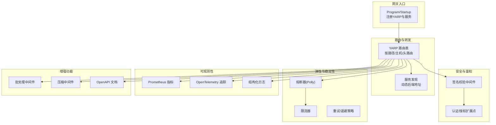

**图表来源** 
- [yarp_integration.cs](file://yarp_integration.cs)
- [yarp_service_discovery.cs](file://yarp_service_discovery.cs)
- [yarp_signature_middleware.cs](file://yarp_signature_middleware.cs)
- [yarp_circuit_breaker.cs](file://yarp_circuit_breaker.cs)
- [rate_limiter.cs](file://rate_limiter.cs)
- [prometheus_metrics.cs](file://prometheus_metrics.cs)
- [opentelemetry_integration.cs](file://opentelemetry_integration.cs)
- [yarp_batch_middleware.cs](file://yarp_batch_middleware.cs)
- [yarp_compression_middleware.cs](file://yarp_compression_middleware.cs)
- [openapi_integration.cs](file://openapi_integration.cs)

**章节来源**
- [yarp_integration.cs](file://yarp_integration.cs)
- [yarp_service_discovery.cs](file://yarp_service_discovery.cs)
- [yarp_signature_middleware.cs](file://yarp_signature_middleware.cs)
- [yarp_circuit_breaker.cs](file://yarp_circuit_breaker.cs)
- [rate_limiter.cs](file://rate_limiter.cs)
- [prometheus_metrics.cs](file://prometheus_metrics.cs)
- [opentelemetry_integration.cs](file://opentelemetry_integration.cs)
- [yarp_batch_middleware.cs](file://yarp_batch_middleware.cs)
- [yarp_compression_middleware.cs](file://yarp_compression_middleware.cs)
- [openapi_integration.cs](file://openapi_integration.cs)

## 核心组件
- YARP反向代理：统一接入、协议适配、负载均衡、请求/响应改写、头部注入与过滤。
- 路由系统：基于路径、主机、查询参数或自定义规则进行精细化路由。
- 认证与授权：结合JWT/OAuth2/OpenID Connect与自定义鉴权策略，支持细粒度权限控制。
- 限流与熔断：令牌桶/滑动窗口限流；Polly驱动的熔断、重试、超时与降级。
- 中间件生态：批处理、压缩、签名校验、审计、缓存、CORS与安全头等。
- 可观测性：Metrics（Prometheus）、Tracing（OpenTelemetry）、结构化日志与告警。
- 配置管理：集中化配置、热更新、环境隔离与密钥管理。
- 多租户与版本管理：租户隔离、配额与计费、API版本路由与兼容策略。
- 灰度发布：按权重、用户维度或Header路由到不同后端版本。

**章节来源**
- [yarp_advanced_features.cs](file://yarp_advanced_features.cs)
- [yarp_integration.cs](file://yarp_integration.cs)
- [yarp_circuit_breaker.cs](file://yarp_circuit_breaker.cs)
- [rate_limiter.cs](file://rate_limiter.cs)
- [yarp_batch_middleware.cs](file://yarp_batch_middleware.cs)
- [yarp_compression_middleware.cs](file://yarp_compression_middleware.cs)
- [yarp_signature_middleware.cs](file://yarp_signature_middleware.cs)
- [prometheus_metrics.cs](file://prometheus_metrics.cs)
- [opentelemetry_integration.cs](file://opentelemetry_integration.cs)
- [multitenant_integration.cs](file://multitenant_integration.cs)
- [version_control_manager.cs](file://version_control_manager.cs)
- [openapi_integration.cs](file://openapi_integration.cs)

## 架构总览
下图展示从客户端请求进入网关，经过认证、限流、路由、转发、熔断与可观测性处理的完整链路。

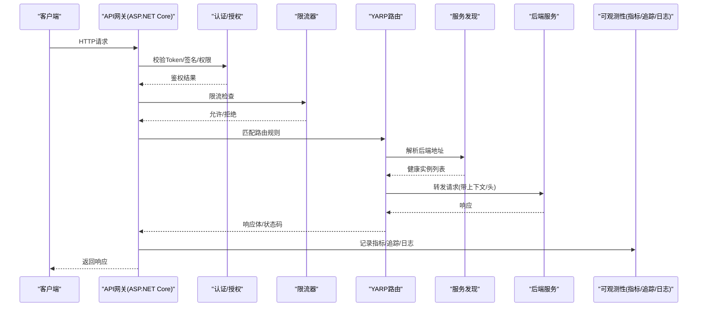

**图表来源** 
- [yarp_integration.cs](file://yarp_integration.cs)
- [yarp_service_discovery.cs](file://yarp_service_discovery.cs)
- [yarp_signature_middleware.cs](file://yarp_signature_middleware.cs)
- [rate_limiter.cs](file://rate_limiter.cs)
- [prometheus_metrics.cs](file://prometheus_metrics.cs)
- [opentelemetry_integration.cs](file://opentelemetry_integration.cs)

## 详细组件分析

### YARP反向代理与路由
- 功能要点
  - 基于配置文件或代码定义的路由表，支持路径前缀、主机名、查询参数与自定义条件。
  - 负载均衡与健康检查，自动剔除不健康实例。
  - 请求/响应改写：头部增删改、URL重写、Body序列化/反序列化。
  - 与Kestrel集成，提供高性能HTTP/HTTPS端点。
- 关键实践
  - 使用服务发现动态更新后端地址，避免硬编码。
  - 通过上下文传递租户、追踪ID、审计信息。
  - 将OpenAPI文档暴露于网关层，统一对外契约。

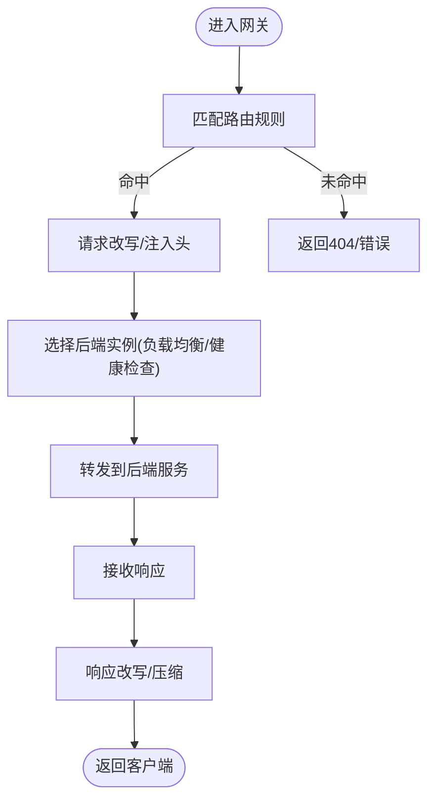

**图表来源** 
- [yarp_integration.cs](file://yarp_integration.cs)
- [yarp_service_discovery.cs](file://yarp_service_discovery.cs)

**章节来源**
- [yarp_integration.cs](file://yarp_integration.cs)
- [yarp_service_discovery.cs](file://yarp_service_discovery.cs)
- [reverse_proxy_demo.cs](file://reverse_proxy_demo.cs)

### 认证与授权
- 认证流程
  - 校验JWT/OAuth2 Token、API Key或请求签名。
  - 支持多认证源与联合身份（如Keycloak）。
- 授权策略
  - 基于角色/资源/属性的访问控制（ABAC/RBAC）。
  - 网关层拦截非法请求，减少下游压力。
- 最佳实践
  - 在中间件中完成鉴权，失败快速返回。
  - 将用户上下文注入到下游请求头中。

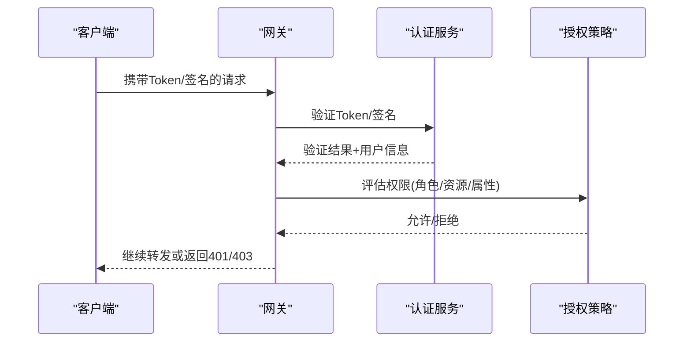

**图表来源** 
- [yarp_signature_middleware.cs](file://yarp_signature_middleware.cs)

**章节来源**
- [yarp_signature_middleware.cs](file://yarp_signature_middleware.cs)

### 限流与熔断
- 限流策略
  - 令牌桶/滑动窗口，支持全局与租户维度限流。
  - 结合Redis或内存计数器实现分布式限流。
- 熔断与重试
  - 基于Polly的熔断、重试、超时与降级。
  - 根据错误率/延迟阈值动态切换状态。
- 降级与兜底
  - 返回缓存数据、默认值或友好错误提示。

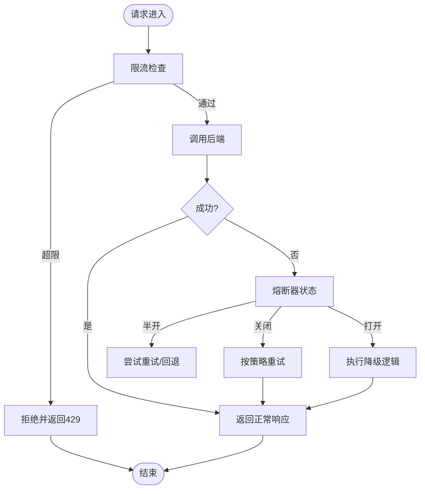

**图表来源** 
- [rate_limiter.cs](file://rate_limiter.cs)
- [yarp_circuit_breaker.cs](file://yarp_circuit_breaker.cs)
- [resilient_polly_integration.cs](file://resilient_polly_integration.cs)

**章节来源**
- [rate_limiter.cs](file://rate_limiter.cs)
- [yarp_circuit_breaker.cs](file://yarp_circuit_breaker.cs)
- [resilient_polly_integration.cs](file://resilient_polly_integration.cs)

### 中间件开发：批处理与压缩
- 批处理中间件
  - 聚合多个小请求为批量操作，降低下游负载。
  - 支持幂等键、去重与异步编排。
- 压缩中间件
  - 对响应体进行Gzip/Brotli压缩，提升带宽利用率。
  - 根据Accept-Encoding协商压缩算法。

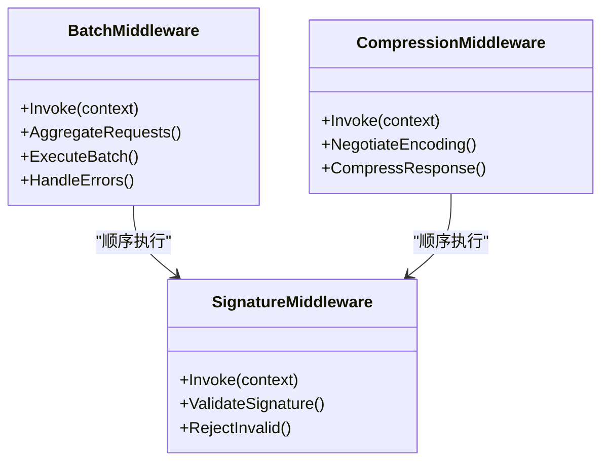

**图表来源** 
- [yarp_batch_middleware.cs](file://yarp_batch_middleware.cs)
- [yarp_compression_middleware.cs](file://yarp_compression_middleware.cs)
- [yarp_signature_middleware.cs](file://yarp_signature_middleware.cs)

**章节来源**
- [yarp_batch_middleware.cs](file://yarp_batch_middleware.cs)
- [yarp_compression_middleware.cs](file://yarp_compression_middleware.cs)
- [yarp_signature_middleware.cs](file://yarp_signature_middleware.cs)

### 服务发现与动态路由
- 服务发现
  - 对接Consul/Nacos/Etcd/Kubernetes等，获取健康实例。
  - 定时刷新与事件驱动更新。
- 动态路由
  - 根据租户、域名、路径或Header动态选择后端。
  - 支持权重路由与灰度发布。

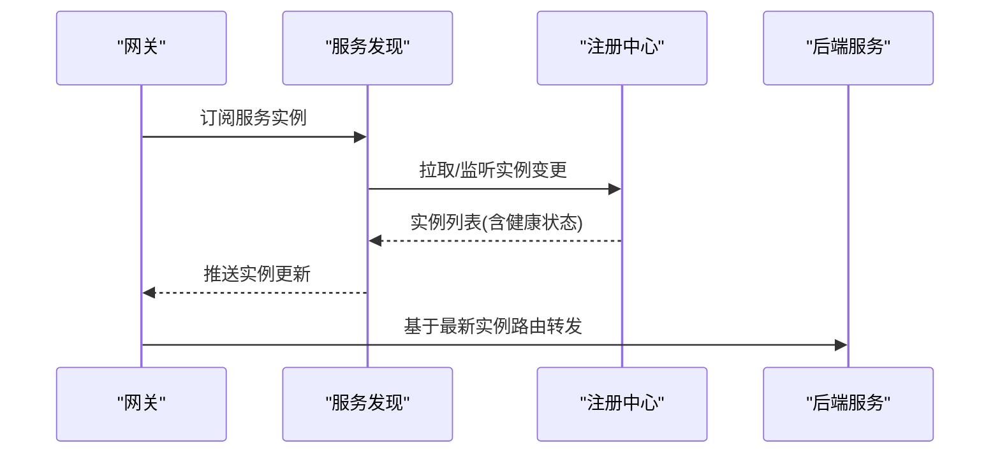

**图表来源** 
- [yarp_service_discovery.cs](file://yarp_service_discovery.cs)

**章节来源**
- [yarp_service_discovery.cs](file://yarp_service_discovery.cs)

### 多租户支持与API版本管理
- 多租户
  - 通过Host/Header/Path识别租户，隔离配置与配额。
  - 租户级限流、缓存与审计。
- 版本管理
  - URL路径或Header指定API版本，保持向后兼容。
  - 版本路由与弃用策略。

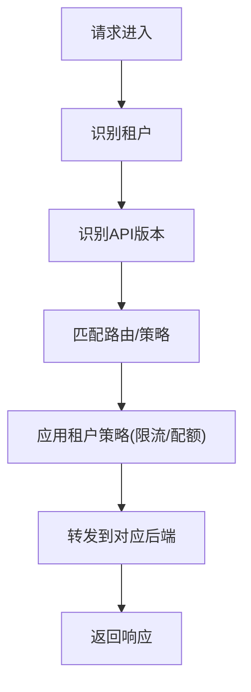

**图表来源** 
- [multitenant_integration.cs](file://multitenant_integration.cs)
- [version_control_manager.cs](file://version_control_manager.cs)

**章节来源**
- [multitenant_integration.cs](file://multitenant_integration.cs)
- [version_control_manager.cs](file://version_control_manager.cs)

### 灰度发布策略
- 按权重分流
  - 将部分流量导向新版本，逐步放量。
- 按用户/Header分流
  - 针对特定用户或测试账号定向路由。
- 回滚机制
  - 快速切回稳定版本，保障业务连续性。

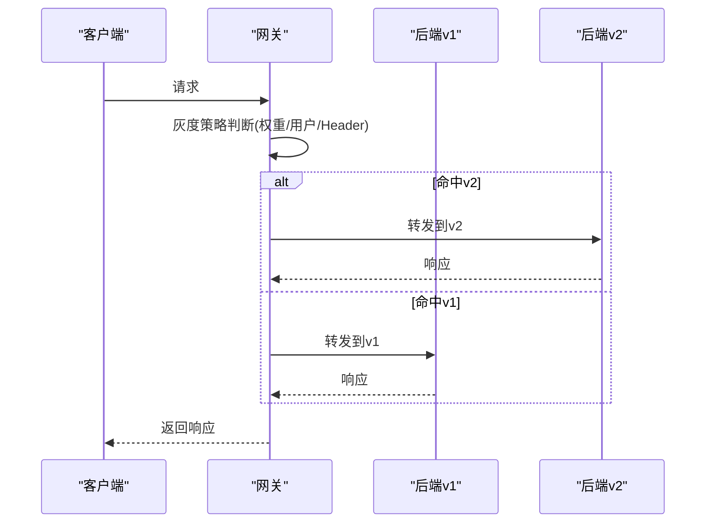

**图表来源** 
- [yarp_advanced_features.cs](file://yarp_advanced_features.cs)

**章节来源**
- [yarp_advanced_features.cs](file://yarp_advanced_features.cs)

### 可观测性：指标、追踪与日志
- 指标采集
  - 暴露Prometheus端点，统计QPS、延迟、错误率、熔断状态等。
- 分布式追踪
  - OpenTelemetry贯穿网关与后端，定位慢请求与异常。
- 日志记录
  - 结构化日志，包含租户、追踪ID、路由信息与耗时。

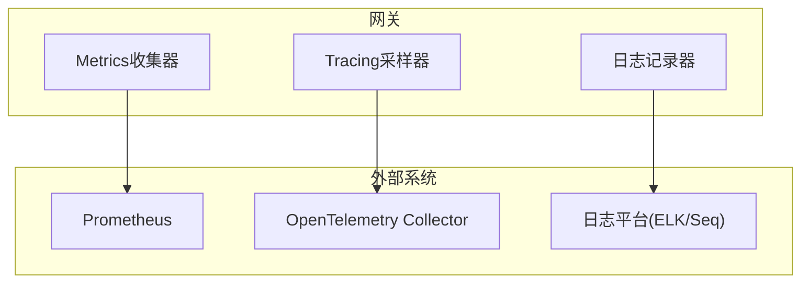

**图表来源** 
- [prometheus_metrics.cs](file://prometheus_metrics.cs)
- [opentelemetry_integration.cs](file://opentelemetry_integration.cs)

**章节来源**
- [prometheus_metrics.cs](file://prometheus_metrics.cs)
- [opentelemetry_integration.cs](file://opentelemetry_integration.cs)

### 配置管理
- 配置来源
  - appsettings.json、环境变量、配置中心（Consul/Nacos）。
- 热更新
  - 运行时刷新路由、限流与熔断策略。
- 密钥管理
  - 敏感信息加密存储与轮换。

**章节来源**
- [appsettings.json](file://appsettings.json)

## 依赖关系分析
- 组件耦合
  - YARP为核心转发引擎，依赖服务发现、限流、熔断、中间件链。
  - 可观测性组件独立解耦，通过管道钩子注入。
- 外部依赖
  - 服务注册中心、消息总线、缓存与数据库用于持久化与协调。
- 潜在循环依赖
  - 中间件之间应保持单向依赖，避免环状引用。

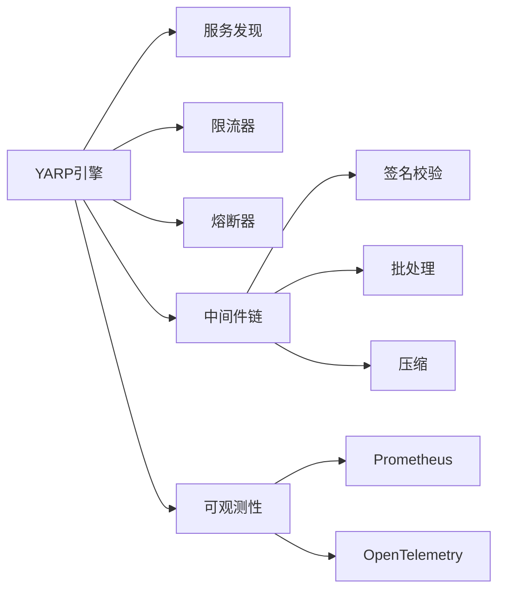

**图表来源** 
- [yarp_integration.cs](file://yarp_integration.cs)
- [yarp_service_discovery.cs](file://yarp_service_discovery.cs)
- [rate_limiter.cs](file://rate_limiter.cs)
- [yarp_circuit_breaker.cs](file://yarp_circuit_breaker.cs)
- [yarp_batch_middleware.cs](file://yarp_batch_middleware.cs)
- [yarp_compression_middleware.cs](file://yarp_compression_middleware.cs)
- [yarp_signature_middleware.cs](file://yarp_signature_middleware.cs)
- [prometheus_metrics.cs](file://prometheus_metrics.cs)
- [opentelemetry_integration.cs](file://opentelemetry_integration.cs)

**章节来源**
- [yarp_integration.cs](file://yarp_integration.cs)
- [yarp_service_discovery.cs](file://yarp_service_discovery.cs)
- [rate_limiter.cs](file://rate_limiter.cs)
- [yarp_circuit_breaker.cs](file://yarp_circuit_breaker.cs)
- [yarp_batch_middleware.cs](file://yarp_batch_middleware.cs)
- [yarp_compression_middleware.cs](file://yarp_compression_middleware.cs)
- [yarp_signature_middleware.cs](file://yarp_signature_middleware.cs)
- [prometheus_metrics.cs](file://prometheus_metrics.cs)
- [opentelemetry_integration.cs](file://opentelemetry_integration.cs)

## 性能考量
- 连接池与并发
  - 合理设置HttpClient连接池大小与超时，避免连接耗尽。
- 序列化优化
  - 使用高效序列化库，减少CPU与GC压力。
- 缓存策略
  - 热点数据缓存、响应缓存与CDN加速。
- 压缩与传输
  - 启用Gzip/Brotli，减少带宽占用。
- 背压与削峰
  - 队列缓冲与异步处理，防止雪崩。

[本节为通用指导，无需具体文件引用]

## 故障排查指南
- 常见问题
  - 路由不生效：检查路由表与优先级、服务实例健康状态。
  - 鉴权失败：确认Token有效期、签名算法与密钥配置。
  - 限流过严：调整阈值与租户配额，观察指标变化。
  - 熔断频繁：检查后端错误率与延迟，优化重试策略。
- 诊断手段
  - 查看Prometheus指标与OpenTelemetry链路。
  - 检索结构化日志中的租户、追踪ID与错误堆栈。
  - 使用健康检查端点与探针工具验证后端可用性。

**章节来源**
- [prometheus_metrics.cs](file://prometheus_metrics.cs)
- [opentelemetry_integration.cs](file://opentelemetry_integration.cs)

## 结论
通过YARP反向代理与丰富的中间件生态，可以构建出具备高可用、强安全、易扩展的API网关。结合服务发现、限流熔断、可观测性与多租户/版本管理，能够满足企业级场景下的复杂需求。建议在生产环境中持续优化配置与策略，建立完善的监控与告警体系，确保网关稳定运行。

[本节为总结性内容，无需具体文件引用]

## 附录
- 参考文件
  - YARP集成与高级特性：[yarp_integration.cs](file://yarp_integration.cs)、[yarp_advanced_features.cs](file://yarp_advanced_features.cs)
  - 中间件：批处理、压缩、签名校验：[yarp_batch_middleware.cs](file://yarp_batch_middleware.cs)、[yarp_compression_middleware.cs](file://yarp_compression_middleware.cs)、[yarp_signature_middleware.cs](file://yarp_signature_middleware.cs)
  - 弹性与稳定性：熔断、限流、Polly：[yarp_circuit_breaker.cs](file://yarp_circuit_breaker.cs)、[rate_limiter.cs](file://rate_limiter.cs)、[resilient_polly_integration.cs](file://resilient_polly_integration.cs)
  - 服务发现与反向代理示例：[yarp_service_discovery.cs](file://yarp_service_discovery.cs)、[reverse_proxy_demo.cs](file://reverse_proxy_demo.cs)
  - 多租户与版本管理：[multitenant_integration.cs](file://multitenant_integration.cs)、[version_control_manager.cs](file://version_control_manager.cs)
  - 可观测性：指标与追踪：[prometheus_metrics.cs](file://prometheus_metrics.cs)、[opentelemetry_integration.cs](file://opentelemetry_integration.cs)
  - 配置与OpenAPI：[appsettings.json](file://appsettings.json)、[openapi_integration.cs](file://openapi_integration.cs)

[本节为附录说明，无需具体文件引用]