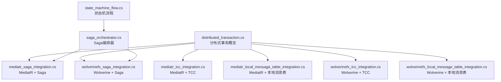
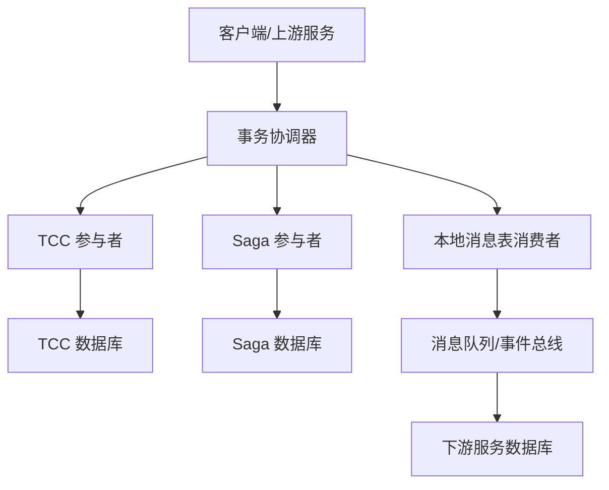
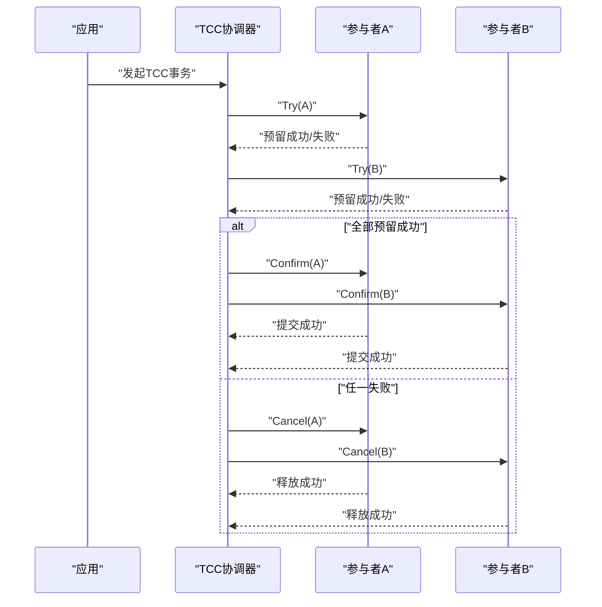
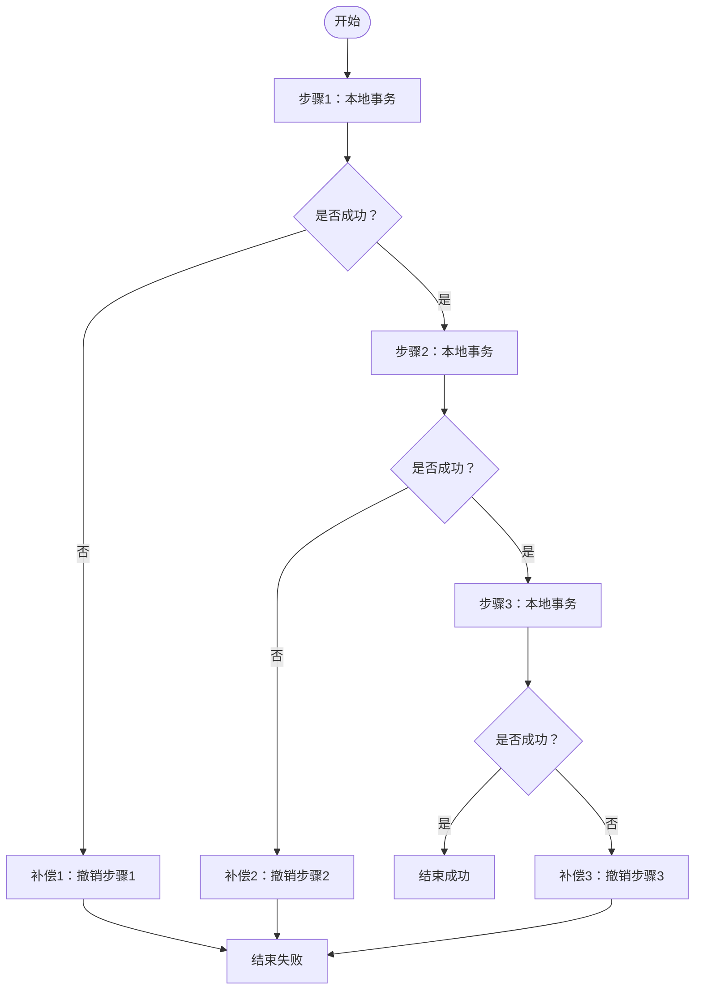
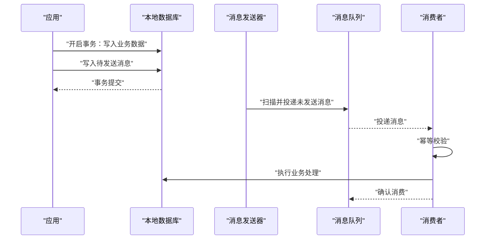
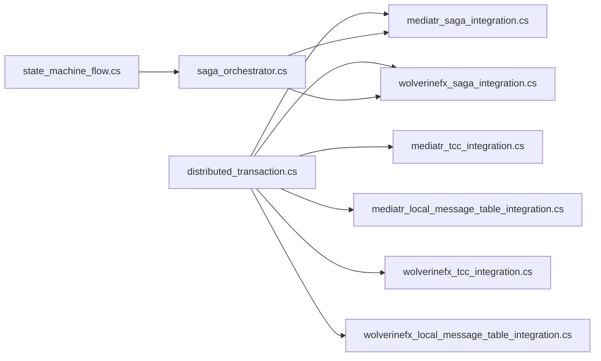

# 分布式事务

<cite>
**本文引用的文件**   
- [distributed_transaction.cs](file://distributed_transaction.cs)
- [mediatr_tcc_integration.cs](file://mediatr_tcc_integration.cs)
- [mediatr_saga_integration.cs](file://mediatr_saga_integration.cs)
- [mediatr_local_message_table_integration.cs](file://mediatr_local_message_table_integration.cs)
- [wolverinefx_tcc_integration.cs](file://wolverinefx_tcc_integration.cs)
- [wolverinefx_saga_integration.cs](file://wolverinefx_saga_integration.cs)
- [wolverinefx_local_message_table_integration.cs](file://wolverinefx_local_message_table_integration.cs)
- [saga_orchestrator.cs](file://saga_orchestrator.cs)
- [state_machine_flow.cs](file://state_machine_flow.cs)
</cite>

## 目录
1. [简介](#简介)
2. [项目结构](#项目结构)
3. [核心组件](#核心组件)
4. [架构总览](#架构总览)
5. [详细组件分析](#详细组件分析)
6. [依赖关系分析](#依赖关系分析)
7. [性能考量](#性能考量)
8. [故障排查指南](#故障排查指南)
9. [结论](#结论)
10. [附录](#附录)

## 简介
本文件面向需要在微服务与分布式系统中实现可靠数据一致性的工程师，系统梳理并落地三种主流分布式事务方案：TCC（Try-Confirm-Cancel）、Saga、本地消息表。文档围绕CAP定理的应用、最终一致性保证与补偿机制展开，并结合仓库中的示例代码，给出协调器设计、幂等性处理与异常恢复策略的实操指导。读者可据此快速选型与集成，确保跨服务调用在失败场景下仍能达到业务可接受的一致性。

## 项目结构
仓库中包含多个与分布式事务相关的示例与集成文件，覆盖MediatR与Wolverine两种编排方式，以及TCC、Saga、本地消息表三种模式的具体实现思路。下图展示了与本主题直接相关的文件组织与职责划分。

**图表来源** 
- [distributed_transaction.cs](file://distributed_transaction.cs)
- [mediatr_tcc_integration.cs](file://mediatr_tcc_integration.cs)
- [mediatr_saga_integration.cs](file://mediatr_saga_integration.cs)
- [mediatr_local_message_table_integration.cs](file://mediatr_local_message_table_integration.cs)
- [wolverinefx_tcc_integration.cs](file://wolverinefx_tcc_integration.cs)
- [wolverinefx_saga_integration.cs](file://wolverinefx_saga_integration.cs)
- [wolverinefx_local_message_table_integration.cs](file://wolverinefx_local_message_table_integration.cs)
- [saga_orchestrator.cs](file://saga_orchestrator.cs)
- [state_machine_flow.cs](file://state_machine_flow.cs)

**章节来源**
- [distributed_transaction.cs](file://distributed_transaction.cs)
- [mediatr_tcc_integration.cs](file://mediatr_tcc_integration.cs)
- [mediatr_saga_integration.cs](file://mediatr_saga_integration.cs)
- [mediatr_local_message_table_integration.cs](file://mediatr_local_message_table_integration.cs)
- [wolverinefx_tcc_integration.cs](file://wolverinefx_tcc_integration.cs)
- [wolverinefx_saga_integration.cs](file://wolverinefx_saga_integration.cs)
- [wolverinefx_local_message_table_integration.cs](file://wolverinefx_local_message_table_integration.cs)
- [saga_orchestrator.cs](file://saga_orchestrator.cs)
- [state_machine_flow.cs](file://state_machine_flow.cs)

## 核心组件
- 分布式事务协调器
  - 负责跨服务调用的生命周期管理、重试、超时与补偿触发。
  - 在TCC中承担Try/Confirm/Cancel三阶段调度；在Saga中负责步骤编排与反向补偿；在本地消息表中负责消息持久化与投递确认。
- 幂等处理器
  - 通过唯一请求ID、去重表或幂等键避免重复执行导致的状态不一致。
- 补偿执行器
  - 针对每个正向操作提供对应的反向动作，确保失败时回滚到一致状态。
- 状态机与编排器
  - 使用状态机驱动Saga步骤流转，记录每一步状态，支持断点续跑与人工干预。

**章节来源**
- [saga_orchestrator.cs](file://saga_orchestrator.cs)
- [state_machine_flow.cs](file://state_machine_flow.cs)

## 架构总览
下图展示基于仓库示例的整体架构：应用层发起分布式事务请求，协调器根据所选模式（TCC/Saga/本地消息表）进行编排，各参与服务以幂等方式执行业务逻辑，并通过消息或回调完成最终一致性。

**图表来源** 
- [mediatr_tcc_integration.cs](file://mediatr_tcc_integration.cs)
- [mediatr_saga_integration.cs](file://mediatr_saga_integration.cs)
- [mediatr_local_message_table_integration.cs](file://mediatr_local_message_table_integration.cs)
- [wolverinefx_tcc_integration.cs](file://wolverinefx_tcc_integration.cs)
- [wolverinefx_saga_integration.cs](file://wolverinefx_saga_integration.cs)
- [wolverinefx_local_message_table_integration.cs](file://wolverinefx_local_message_table_integration.cs)
- [saga_orchestrator.cs](file://saga_orchestrator.cs)

## 详细组件分析

### TCC（Try-Confirm-Cancel）
- 适用场景
  - 强一致性要求较高、网络延迟可控、参与者支持预留资源与回滚的场景。
- 关键要点
  - Try阶段预留资源（如冻结额度），Confirm提交预留，Cancel释放预留。
  - 幂等性必须保障，防止重复Confirm/Cancel造成副作用。
  - 协调器需处理超时与重试，必要时进入人工干预流程。
- 仓库示例
  - MediatR集成：[mediatr_tcc_integration.cs](file://mediatr_tcc_integration.cs)
  - Wolverine集成：[wolverinefx_tcc_integration.cs](file://wolverinefx_tcc_integration.cs)

**图表来源** 
- [mediatr_tcc_integration.cs](file://mediatr_tcc_integration.cs)
- [wolverinefx_tcc_integration.cs](file://wolverinefx_tcc_integration.cs)

**章节来源**
- [mediatr_tcc_integration.cs](file://mediatr_tcc_integration.cs)
- [wolverinefx_tcc_integration.cs](file://wolverinefx_tcc_integration.cs)

### Saga（长事务编排）
- 适用场景
  - 跨服务长事务、异步解耦、允许短暂不一致但最终一致的场景。
- 关键要点
  - 将大事务拆分为多步本地事务，每步成功后继续下一步。
  - 定义补偿动作，失败时按逆序执行补偿，直至恢复到一致状态。
  - 使用状态机记录Saga实例状态，支持中断恢复与重试。
- 仓库示例
  - MediatR集成：[mediatr_saga_integration.cs](file://mediatr_saga_integration.cs)
  - Wolverine集成：[wolverinefx_saga_integration.cs](file://wolverinefx_saga_integration.cs)
  - 编排器与状态机：[saga_orchestrator.cs](file://saga_orchestrator.cs)、[state_machine_flow.cs](file://state_machine_flow.cs)

**图表来源** 
- [mediatr_saga_integration.cs](file://mediatr_saga_integration.cs)
- [wolverinefx_saga_integration.cs](file://wolverinefx_saga_integration.cs)
- [saga_orchestrator.cs](file://saga_orchestrator.cs)
- [state_machine_flow.cs](file://state_machine_flow.cs)

**章节来源**
- [mediatr_saga_integration.cs](file://mediatr_saga_integration.cs)
- [wolverinefx_saga_integration.cs](file://wolverinefx_saga_integration.cs)
- [saga_orchestrator.cs](file://saga_orchestrator.cs)
- [state_machine_flow.cs](file://state_machine_flow.cs)

### 本地消息表（Local Message Table）
- 适用场景
  - 需要高可靠的消息投递与最终一致性，且希望降低对中间件强一致性的依赖。
- 关键要点
  - 将业务更新与消息写入同一本地事务，确保“写库+写消息”原子性。
  - 独立投递进程/任务扫描未发送消息并投递至消息队列，失败重试直至成功。
  - 消费者侧需幂等处理，避免重复消费导致数据错误。
- 仓库示例
  - MediatR集成：[mediatr_local_message_table_integration.cs](file://mediatr_local_message_table_integration.cs)
  - Wolverine集成：[wolverinefx_local_message_table_integration.cs](file://wolverinefx_local_message_table_integration.cs)

**图表来源** 
- [mediatr_local_message_table_integration.cs](file://mediatr_local_message_table_integration.cs)
- [wolverinefx_local_message_table_integration.cs](file://wolverinefx_local_message_table_integration.cs)

**章节来源**
- [mediatr_local_message_table_integration.cs](file://mediatr_local_message_table_integration.cs)
- [wolverinefx_local_message_table_integration.cs](file://wolverinefx_local_message_table_integration.cs)

### CAP定理与最终一致性
- 分区容忍性（P）为必选项，需在AP与CP之间权衡：
  - AP优先：采用Saga与本地消息表，牺牲强一致换取可用性，通过重试与补偿达成最终一致。
  - CP优先：在TCC中尽量缩短两阶段耗时，减少分区影响，必要时降级为只读或限流。
- 最终一致性保障
  - 幂等性：所有参与方接口需支持幂等，避免重复执行。
  - 补偿机制：为每个正向操作定义可逆补偿，失败时自动回滚。
  - 监控与告警：记录Saga状态、消息投递结果与重试次数，及时人工介入。

**章节来源**
- [saga_orchestrator.cs](file://saga_orchestrator.cs)
- [state_machine_flow.cs](file://state_machine_flow.cs)

## 依赖关系分析
下图展示三种模式在仓库中的依赖与协作关系，帮助理解不同模式的边界与扩展点。

**图表来源** 
- [distributed_transaction.cs](file://distributed_transaction.cs)
- [mediatr_tcc_integration.cs](file://mediatr_tcc_integration.cs)
- [mediatr_saga_integration.cs](file://mediatr_saga_integration.cs)
- [mediatr_local_message_table_integration.cs](file://mediatr_local_message_table_integration.cs)
- [wolverinefx_tcc_integration.cs](file://wolverinefx_tcc_integration.cs)
- [wolverinefx_saga_integration.cs](file://wolverinefx_saga_integration.cs)
- [wolverinefx_local_message_table_integration.cs](file://wolverinefx_local_message_table_integration.cs)
- [saga_orchestrator.cs](file://saga_orchestrator.cs)
- [state_machine_flow.cs](file://state_machine_flow.cs)

**章节来源**
- [distributed_transaction.cs](file://distributed_transaction.cs)
- [mediatr_tcc_integration.cs](file://mediatr_tcc_integration.cs)
- [mediatr_saga_integration.cs](file://mediatr_saga_integration.cs)
- [mediatr_local_message_table_integration.cs](file://mediatr_local_message_table_integration.cs)
- [wolverinefx_tcc_integration.cs](file://wolverinefx_tcc_integration.cs)
- [wolverinefx_saga_integration.cs](file://wolverinefx_saga_integration.cs)
- [wolverinefx_local_message_table_integration.cs](file://wolverinefx_local_message_table_integration.cs)
- [saga_orchestrator.cs](file://saga_orchestrator.cs)
- [state_machine_flow.cs](file://state_machine_flow.cs)

## 性能考量
- TCC
  - 优点：接近强一致，适合短事务。
  - 缺点：参与者需实现预留与回滚，开发成本高；网络往返多，延迟敏感。
  - 优化建议：限制Try阶段锁粒度，缩短Confirm/Cancel路径，结合缓存减少热点竞争。
- Saga
  - 优点：解耦性强，适合长事务与异步场景。
  - 缺点：补偿逻辑复杂，可能出现补偿失败需人工干预。
  - 优化建议：合理拆分步骤，避免单步过大；引入死信队列与重试上限。
- 本地消息表
  - 优点：可靠性高，实现简单，对中间件依赖低。
  - 缺点：存在投递延迟，需独立投递任务。
  - 优化建议：批量扫描与投递，分页拉取，消费者侧并行处理但保持幂等。

[本节为通用指导，不直接分析具体文件]

## 故障排查指南
- 常见问题
  - 幂等缺失导致重复执行：检查幂等键与去重表，确保所有参与方接口幂等。
  - 补偿失败：记录补偿日志与上下文，设置重试上限与人工干预入口。
  - 消息堆积：监控投递成功率与延迟，扩容消费者与优化批处理。
- 定位手段
  - 使用状态机追踪Saga实例状态与步骤进度。
  - 查看本地消息表未发送消息与投递失败原因。
  - 收集TCC各阶段响应时间与失败原因，定位瓶颈。
- 恢复策略
  - 自动重试：指数退避与抖动，避免雪崩。
  - 人工干预：提供补偿执行界面与回滚工具。
  - 降级策略：在极端情况下关闭非核心功能，保障主链路可用。

**章节来源**
- [saga_orchestrator.cs](file://saga_orchestrator.cs)
- [state_machine_flow.cs](file://state_machine_flow.cs)

## 结论
在本仓库中，TCC、Saga与本地消息表三种分布式事务模式均有清晰的示例与集成路径。选择时需结合业务一致性要求、性能与复杂度权衡：
- 若追求强一致且参与者可控，优先考虑TCC；
- 若强调解耦与可扩展性，Saga更合适；
- 若重视可靠性与实现简洁，本地消息表是稳妥之选。
无论哪种模式，都应落实幂等性、补偿机制与完善的监控告警，确保系统在异常情况下仍能达成最终一致性。

[本节为总结性内容，不直接分析具体文件]

## 附录
- 实践清单
  - 明确事务边界与参与方接口契约。
  - 设计幂等键与去重策略。
  - 编写补偿动作并验证其可逆性。
  - 建立状态机与审计日志。
  - 配置重试、超时与熔断策略。
  - 完善监控指标与告警规则。

[本节为补充信息，不直接分析具体文件]