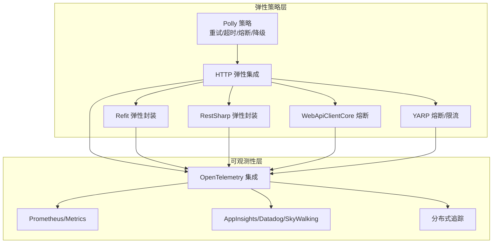
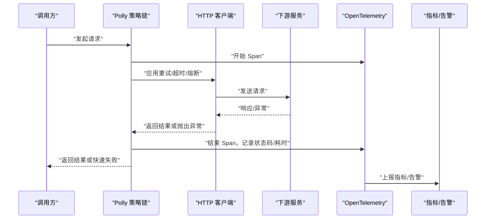
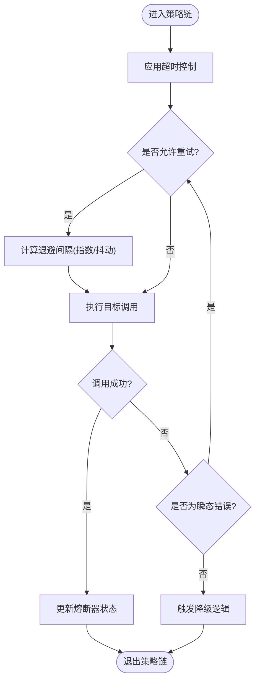
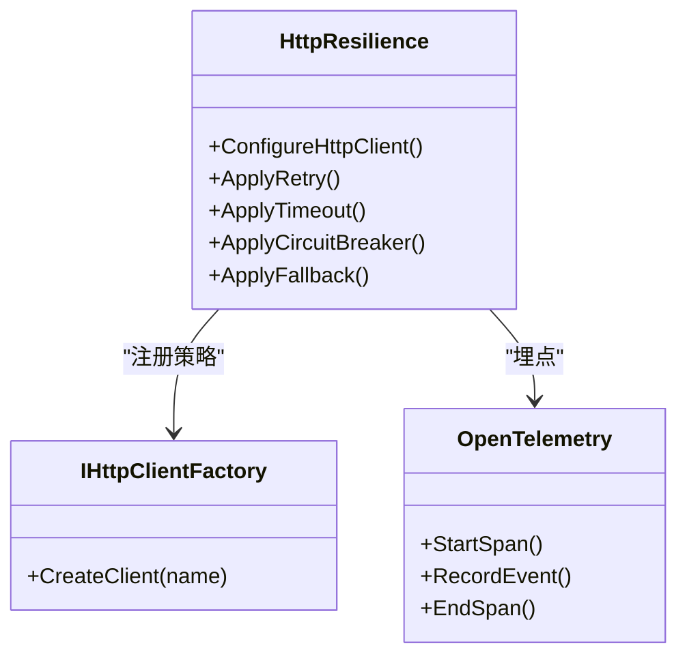
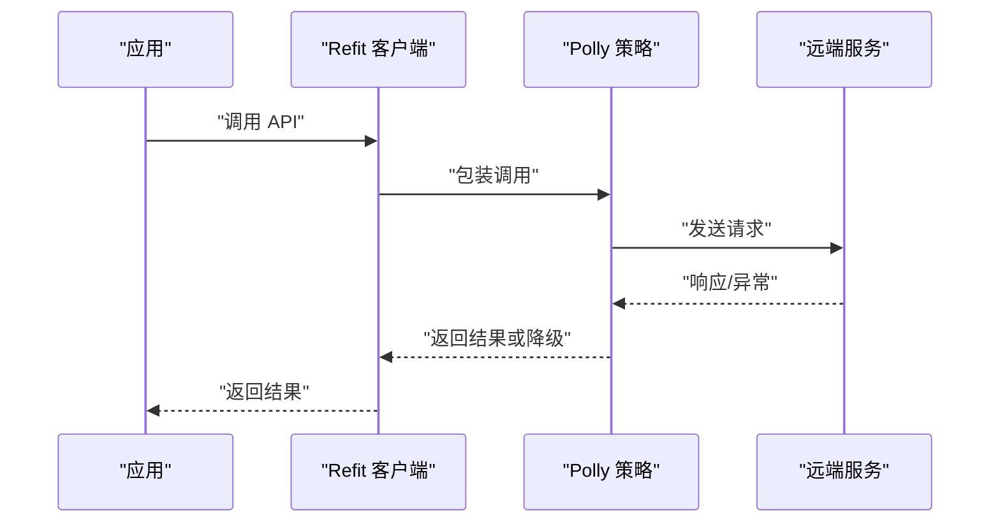
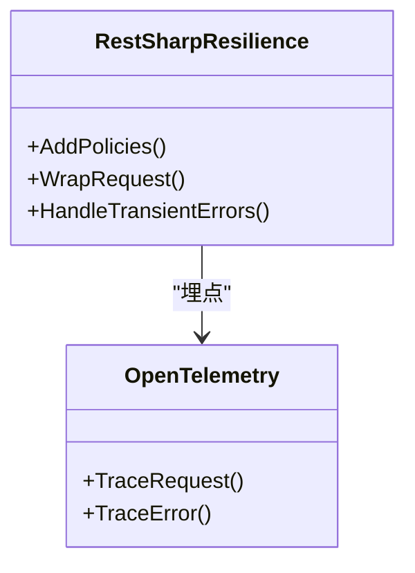
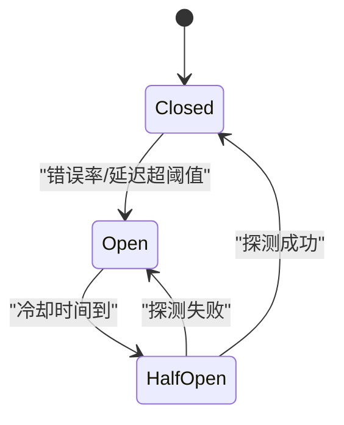
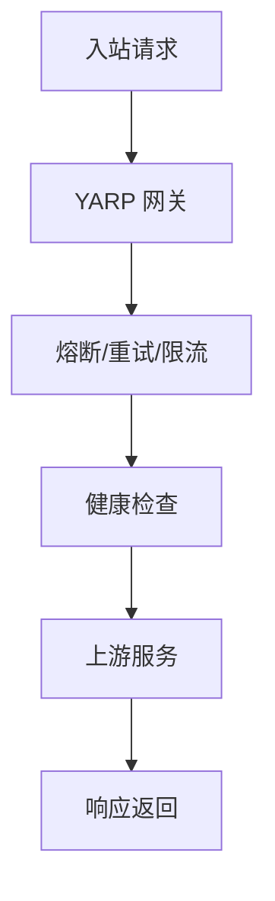
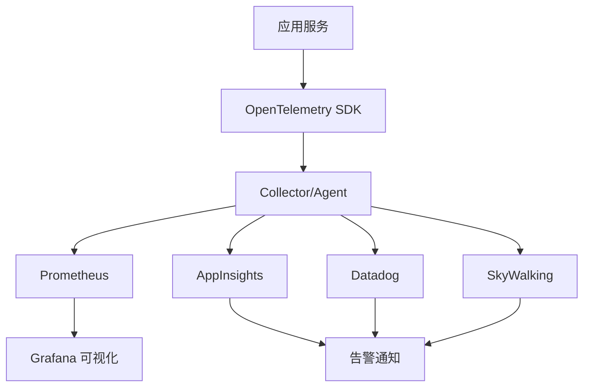
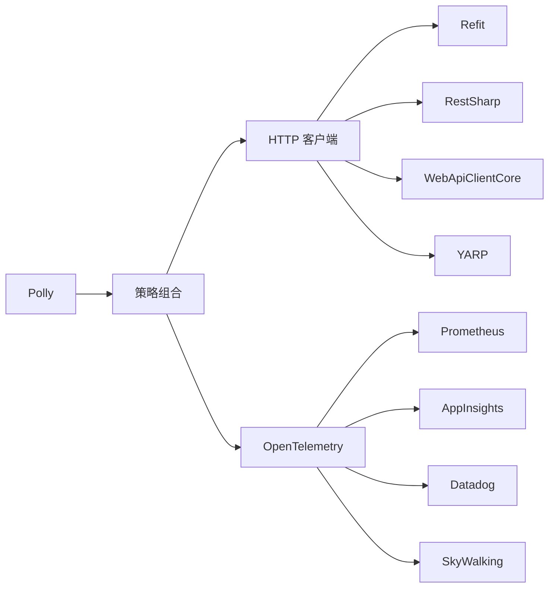

# 弹性模式与容错

<cite>
**本文引用的文件**   
- [resilient_polly_integration.cs](file://resilient_polly_integration.cs)
- [http_resilience_integration.cs](file://http_resilience_integration.cs)
- [http_resilience_advanced_integration.cs](file://http_resilience_advanced_integration.cs)
- [refit_resiliency.cs](file://refit_resiliency.cs)
- [restsharp_resiliency.cs](file://restsharp_resiliency.cs)
- [webapiclientcore_circuitbreaker.cs](file://webapiclientcore_circuitbreaker.cs)
- [webapiclientcore_circuitbreaker_enhanced.cs](file://webapiclientcore_circuitbreaker_enhanced.cs)
- [yarp_circuit_breaker.cs](file://yarp_circuit_breaker.cs)
- [distributed_tracing.cs](file://distributed_tracing.cs)
- [distributed_tracing_enhanced.cs](file://distributed_tracing_enhanced.cs)
- [opentelemetry_integration.cs](file://opentelemetry_integration.cs)
- [prometheus_metrics.cs](file://prometheus_metrics.cs)
- [metrics_monitoring.cs](file://metrics_monitoring.cs)
- [appinsights_alerting.cs](file://appinsights_alerting.cs)
- [datadog_alerting.cs](file://datadog_alerting.cs)
- [skyapm_alerting.cs](file://skyapm_alerting.cs)
- [opentelemetry_alerting.cs](file://opentelemetry_alerting.cs)
</cite>

## 目录
1. [引言](#引言)
2. [项目结构](#项目结构)
3. [核心组件](#核心组件)
4. [架构总览](#架构总览)
5. [详细组件分析](#详细组件分析)
6. [依赖关系分析](#依赖关系分析)
7. [性能考量](#性能考量)
8. [故障排查指南](#故障排查指南)
9. [结论](#结论)
10. [附录](#附录)

## 引言
本文件聚焦于弹性模式与容错设计，围绕 Polly 框架的超时、重试、熔断、降级等策略展开，结合仓库中的实际实现示例，给出可操作的配置思路与扩展方法。同时覆盖故障隔离、快速失败机制、链路追踪、指标收集与告警通知，帮助读者在分布式与高并发场景下构建健壮系统。

## 项目结构
仓库中包含多个与弹性与可观测性相关的示例文件，涵盖：
- Polly 基础与高级用法（HTTP 客户端集成）
- 面向 Refit/RestSharp/WebApiClientCore 的弹性封装
- YARP 网关层的熔断与限流
- 分布式追踪与 OpenTelemetry 集成
- Prometheus/Metrics/AppInsights/Datadog/SkyWalking 等指标与告警

**图表来源** 
- [http_resilience_integration.cs](file://http_resilience_integration.cs)
- [refit_resiliency.cs](file://refit_resiliency.cs)
- [restsharp_resiliency.cs](file://restsharp_resiliency.cs)
- [webapiclientcore_circuitbreaker.cs](file://webapiclientcore_circuitbreaker.cs)
- [yarp_circuit_breaker.cs](file://yarp_circuit_breaker.cs)
- [opentelemetry_integration.cs](file://opentelemetry_integration.cs)
- [prometheus_metrics.cs](file://prometheus_metrics.cs)
- [appinsights_alerting.cs](file://appinsights_alerting.cs)
- [datadog_alerting.cs](file://datadog_alerting.cs)
- [skyapm_alerting.cs](file://skyapm_alerting.cs)
- [distributed_tracing.cs](file://distributed_tracing.cs)

**章节来源**
- [resilient_polly_integration.cs](file://resilient_polly_integration.cs)
- [http_resilience_integration.cs](file://http_resilience_integration.cs)
- [http_resilience_advanced_integration.cs](file://http_resilience_advanced_integration.cs)

## 核心组件
- 策略定义与组合：通过 Polly 构建重试、超时、熔断、退避、隔离舱等策略，并以管道方式组合执行。
- HTTP 客户端集成：将策略注入 HttpClient 生命周期或调用点，确保网络请求具备弹性能力。
- 第三方库适配：为 Refit、RestSharp、WebApiClientCore 提供统一的弹性封装。
- 网关级弹性：在 YARP 中启用熔断、重试、限流等中间件，保护上游服务。
- 可观测性：基于 OpenTelemetry 采集 Span/Metrics/Logs，并对接 Prometheus、AppInsights、Datadog、SkyWalking 等后端。

**章节来源**
- [resilient_polly_integration.cs](file://resilient_polly_integration.cs)
- [http_resilience_integration.cs](file://http_resilience_integration.cs)
- [http_resilience_advanced_integration.cs](file://http_resilience_advanced_integration.cs)
- [refit_resiliency.cs](file://refit_resiliency.cs)
- [restsharp_resiliency.cs](file://restsharp_resiliency.cs)
- [webapiclientcore_circuitbreaker.cs](file://webapiclientcore_circuitbreaker.cs)
- [yarp_circuit_breaker.cs](file://yarp_circuit_breaker.cs)
- [opentelemetry_integration.cs](file://opentelemetry_integration.cs)
- [prometheus_metrics.cs](file://prometheus_metrics.cs)
- [metrics_monitoring.cs](file://metrics_monitoring.cs)

## 架构总览
下图展示从业务调用到下游依赖的弹性与可观测性路径，强调“快速失败”和“故障隔离”。

**图表来源** 
- [http_resilience_integration.cs](file://http_resilience_integration.cs)
- [opentelemetry_integration.cs](file://opentelemetry_integration.cs)
- [prometheus_metrics.cs](file://prometheus_metrics.cs)

## 详细组件分析

### Polly 策略与组合
- 超时策略：为每次调用设置最大等待时间，避免线程阻塞。
- 重试策略：针对瞬态错误进行指数退避或抖动重试，减少雪崩风险。
- 熔断策略：当错误率或延迟超过阈值时快速失败，给下游恢复时间。
- 降级策略：在不可用或过载时返回默认值或缓存数据，保障用户体验。
- 隔离舱：限制并发与队列长度，防止资源耗尽。

**图表来源** 
- [resilient_polly_integration.cs](file://resilient_polly_integration.cs)
- [http_resilience_integration.cs](file://http_resilience_integration.cs)

**章节来源**
- [resilient_polly_integration.cs](file://resilient_polly_integration.cs)
- [http_resilience_integration.cs](file://http_resilience_integration.cs)
- [http_resilience_advanced_integration.cs](file://http_resilience_advanced_integration.cs)

### HTTP 客户端弹性集成
- 将 Polly 策略注入 HttpClient 工厂或 IHttpClientFactory，统一管控所有出站请求。
- 按服务或端点维度配置不同策略，支持细粒度治理。
- 结合 OpenTelemetry 自动埋点，输出请求耗时、状态码、错误类型等指标。

**图表来源** 
- [http_resilience_integration.cs](file://http_resilience_integration.cs)
- [opentelemetry_integration.cs](file://opentelemetry_integration.cs)

**章节来源**
- [http_resilience_integration.cs](file://http_resilience_integration.cs)
- [http_resilience_advanced_integration.cs](file://http_resilience_advanced_integration.cs)

### Refit 弹性封装
- 在 Refit 客户端创建阶段注入 Polly 策略，使 API 调用具备重试、熔断与降级能力。
- 支持按接口或方法级别定制策略，便于精细化治理。

**图表来源** 
- [refit_resiliency.cs](file://refit_resiliency.cs)

**章节来源**
- [refit_resiliency.cs](file://refit_resiliency.cs)

### RestSharp 弹性封装
- 通过 RestSharp 的请求拦截器或工厂方法嵌入策略，实现统一的弹性行为。
- 与 OpenTelemetry 集成，记录请求上下文与错误信息。

**图表来源** 
- [restsharp_resiliency.cs](file://restsharp_resiliency.cs)
- [opentelemetry_integration.cs](file://opentelemetry_integration.cs)

**章节来源**
- [restsharp_resiliency.cs](file://restsharp_resiliency.cs)

### WebApiClientCore 熔断增强
- 在 WebApiClientCore 中启用熔断器，根据错误比例与延迟阈值切换状态。
- 支持自定义判定条件与恢复策略，提升稳定性。

**图表来源** 
- [webapiclientcore_circuitbreaker.cs](file://webapiclientcore_circuitbreaker.cs)
- [webapiclientcore_circuitbreaker_enhanced.cs](file://webapiclientcore_circuitbreaker_enhanced.cs)

**章节来源**
- [webapiclientcore_circuitbreaker.cs](file://webapiclientcore_circuitbreaker.cs)
- [webapiclientcore_circuitbreaker_enhanced.cs](file://webapiclientcore_circuitbreaker_enhanced.cs)

### YARP 网关级弹性
- 在反向代理层启用熔断、重试、限流等中间件，保护上游服务免受突发流量冲击。
- 结合健康检查与动态路由，实现更精细的流量治理。

**图表来源** 
- [yarp_circuit_breaker.cs](file://yarp_circuit_breaker.cs)

**章节来源**
- [yarp_circuit_breaker.cs](file://yarp_circuit_breaker.cs)

### 分布式追踪与指标告警
- 使用 OpenTelemetry 采集 Span、Metrics、Logs，统一上报至后端。
- 对接 Prometheus/Grafana 可视化，配置告警规则；或接入 AppInsights/Datadog/SkyWalking 进行集中式监控与告警。

**图表来源** 
- [opentelemetry_integration.cs](file://opentelemetry_integration.cs)
- [prometheus_metrics.cs](file://prometheus_metrics.cs)
- [appinsights_alerting.cs](file://appinsights_alerting.cs)
- [datadog_alerting.cs](file://datadog_alerting.cs)
- [skyapm_alerting.cs](file://skyapm_alerting.cs)
- [distributed_tracing.cs](file://distributed_tracing.cs)
- [distributed_tracing_enhanced.cs](file://distributed_tracing_enhanced.cs)

**章节来源**
- [opentelemetry_integration.cs](file://opentelemetry_integration.cs)
- [prometheus_metrics.cs](file://prometheus_metrics.cs)
- [metrics_monitoring.cs](file://metrics_monitoring.cs)
- [appinsights_alerting.cs](file://appinsights_alerting.cs)
- [datadog_alerting.cs](file://datadog_alerting.cs)
- [skyapm_alerting.cs](file://skyapm_alerting.cs)
- [distributed_tracing.cs](file://distributed_tracing.cs)
- [distributed_tracing_enhanced.cs](file://distributed_tracing_enhanced.cs)

## 依赖关系分析
- 策略层依赖 Polly 核心库，HTTP 客户端依赖 IHttpClientFactory。
- 第三方库适配层依赖各自 SDK（Refit、RestSharp、WebApiClientCore）。
- 可观测性层依赖 OpenTelemetry SDK 与各后端 SDK（Prometheus、AppInsights、Datadog、SkyWalking）。

**图表来源** 
- [resilient_polly_integration.cs](file://resilient_polly_integration.cs)
- [http_resilience_integration.cs](file://http_resilience_integration.cs)
- [refit_resiliency.cs](file://refit_resiliency.cs)
- [restsharp_resiliency.cs](file://restsharp_resiliency.cs)
- [webapiclientcore_circuitbreaker.cs](file://webapiclientcore_circuitbreaker.cs)
- [yarp_circuit_breaker.cs](file://yarp_circuit_breaker.cs)
- [opentelemetry_integration.cs](file://opentelemetry_integration.cs)
- [prometheus_metrics.cs](file://prometheus_metrics.cs)
- [appinsights_alerting.cs](file://appinsights_alerting.cs)
- [datadog_alerting.cs](file://datadog_alerting.cs)
- [skyapm_alerting.cs](file://skyapm_alerting.cs)

**章节来源**
- [resilient_polly_integration.cs](file://resilient_polly_integration.cs)
- [http_resilience_integration.cs](file://http_resilience_integration.cs)
- [refit_resiliency.cs](file://refit_resiliency.cs)
- [restsharp_resiliency.cs](file://restsharp_resiliency.cs)
- [webapiclientcore_circuitbreaker.cs](file://webapiclientcore_circuitbreaker.cs)
- [yarp_circuit_breaker.cs](file://yarp_circuit_breaker.cs)
- [opentelemetry_integration.cs](file://opentelemetry_integration.cs)
- [prometheus_metrics.cs](file://prometheus_metrics.cs)
- [appinsights_alerting.cs](file://appinsights_alerting.cs)
- [datadog_alerting.cs](file://datadog_alerting.cs)
- [skyapm_alerting.cs](file://skyapm_alerting.cs)

## 性能考量
- 合理设置超时与重试次数，避免放大下游压力。
- 使用指数退避与抖动降低重试风暴风险。
- 熔断阈值需结合业务 SLA 与历史指标调优。
- 隔离舱容量与队列长度应匹配资源池大小，防止内存溢出。
- 指标采样与日志级别在生产环境需谨慎配置，减少开销。

[本节为通用指导，不直接分析具体文件]

## 故障排查指南
- 查看 OpenTelemetry Span 详情，定位慢调用与异常点。
- 检查熔断器状态变化与触发原因（错误率、延迟阈值）。
- 核对重试策略是否导致雪崩，必要时调整退避参数。
- 确认降级逻辑是否生效，验证回退数据一致性。
- 通过 Prometheus/Grafana 或 APM 平台观察趋势与告警事件。

**章节来源**
- [distributed_tracing.cs](file://distributed_tracing.cs)
- [distributed_tracing_enhanced.cs](file://distributed_tracing_enhanced.cs)
- [opentelemetry_integration.cs](file://opentelemetry_integration.cs)
- [prometheus_metrics.cs](file://prometheus_metrics.cs)
- [appinsights_alerting.cs](file://appinsights_alerting.cs)
- [datadog_alerting.cs](file://datadog_alerting.cs)
- [skyapm_alerting.cs](file://skyapm_alerting.cs)

## 结论
通过在调用链各层引入 Polly 策略与可观测性能力，可实现“快速失败、故障隔离、渐进恢复”的弹性体系。结合网关级治理与完善的指标告警，能够显著提升系统在复杂环境下的稳定性与可维护性。建议以业务 SLA 为导向持续优化策略参数，并通过演练与压测验证效果。

[本节为总结性内容，不直接分析具体文件]

## 附录
- 弹性设计原则
  - 快速失败：尽早拒绝不可用请求，释放资源。
  - 故障隔离：限制影响范围，避免级联故障。
  - 渐进恢复：逐步恢复流量，观察系统反应。
  - 最小化影响：优先保证核心路径可用。
- 常见策略配置要点
  - 超时：按接口/依赖类型设定合理上限。
  - 重试：仅对幂等且瞬态错误启用，配合退避与抖动。
  - 熔断：依据错误率与延迟阈值动态开关。
  - 降级：提供兜底数据或简化流程。
- 扩展方法建议
  - 封装统一策略装配入口，便于复用与审计。
  - 提供按服务/端点的策略模板与覆盖机制。
  - 与配置中心联动，实现动态调整。

[本节为概念性内容，不直接分析具体文件]