# 微服务架构

<cite>
**本文引用的文件**   
- [README.md](file://README.md)
- [global.json](file://global.json)
- [Directory.Build.props](file://Directory.Build.props)
- [Directory.Packages.props](file://Directory.Packages.props)
- [appsettings.json](file://appsettings.json)
- [distributed_transaction.cs](file://distributed_transaction.cs)
- [service_discovery_integration.cs](file://service_discovery_integration.cs)
- [service_discovery_advanced_integration.cs](file://service_discovery_advanced_integration.cs)
- [yarp_integration.cs](file://yarp_integration.cs)
- [yarp_circuit_breaker.cs](file://yarp_circuit_breaker.cs)
- [yarp_service_discovery.cs](file://yarp_service_discovery.cs)
- [message_queue.cs](file://message_queue.cs)
- [message_queue_enhanced.cs](file://message_queue_enhanced.cs)
- [masstransit_production_integration.cs](file://masstransit_production_integration.cs)
- [rabbitmq_production_integration.cs](file://rabbitmq_production_integration.cs)
- [opentelemetry_integration.cs](file://opentelemetry_integration.cs)
- [prometheus_metrics.cs](file://prometheus_metrics.cs)
- [grafana_integration.cs](file://grafana_integration.cs)
- [docker_compose_integration.cs](file://docker_compose_integration.cs)
- [k8s_integration.cs](file://k8s_integration.cs)
- [minikube_integration.cs](file://minikube_integration.cs)
- [podman_integration.cs](file://podman_integration.cs)
- [load_balancer.cs](file://load_balancer.cs)
- [rate_limiter.cs](file://rate_limiter.cs)
- [resilient_polly_integration.cs](file://resilient_polly_integration.cs)
- [http_resilience_integration.cs](file://http_resilience_integration.cs)
- [webapiclientcore_circuitbreaker.cs](file://webapiclientcore_circuitbreaker.cs)
- [webapiclientcore_mesh.cs](file://webapicclientcore_mesh.cs)
- [service_mesh_enhanced.cs](file://service_mesh_enhanced.cs)
- [tracing_extension.cs](file://tracing_extension.cs)
- [distributed_tracing.cs](file://distributed_tracing.cs)
- [distributed_tracing_enhanced.cs](file://distributed_tracing_enhanced.cs)
- [distributed_tracing_profiler.cs](file://distributed_tracing_profiler.cs)
- [alert_rules.cs](file://alert_rules.cs)
- [watchdog_integration.cs](file://watchdog_integration.cs)
- [performance_metrics.cs](file://performance_metrics.cs)
</cite>

## 目录
1. [简介](#简介)
2. [项目结构](#项目结构)
3. [核心组件](#核心组件)
4. [架构总览](#架构总览)
5. [详细组件分析](#详细组件分析)
6. [依赖关系分析](#依赖关系分析)
7. [性能考量](#性能考量)
8. [故障排查指南](#故障排查指南)
9. [结论](#结论)
10. [附录](#附录)

## 简介
本仓库围绕微服务架构提供了一套从服务拆分、通信到治理与可观测性的完整实践。内容涵盖：
- 服务拆分原则与边界划分
- 服务间通信模式（同步/异步、事件驱动）
- 分布式事务与一致性保证（TCC/Saga/补偿）
- 服务发现、负载均衡、熔断降级与重试
- API 网关设计（反向代理、路由、鉴权）
- 消息队列集成与事件总线
- 容器化与编排（Docker/Kubernetes/Minikube/Podman）
- 服务网格、链路追踪与性能监控
- 告警规则与运维最佳实践

## 项目结构
该仓库采用“示例/集成”式组织，每个能力以独立文件呈现，便于快速查阅与按需组合。根级配置文件定义全局构建与包管理策略；应用配置集中存放；各子系统通过独立的集成文件实现具体能力。

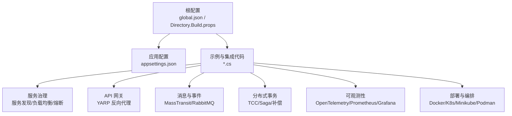

图表来源
- [global.json](file://global.json)
- [Directory.Build.props](file://Directory.Build.props)
- [appsettings.json](file://appsettings.json)

章节来源
- [README.md](file://README.md)
- [global.json](file://global.json)
- [Directory.Build.props](file://Directory.Build.props)
- [Directory.Packages.props](file://Directory.Packages.props)
- [appsettings.json](file://appsettings.json)

## 核心组件
- 服务发现与注册中心：Consul/Nacos/Etcd 等，支持健康检查与动态上下线。
- API 网关：基于 YARP 的反向代理，统一入口、路由、鉴权、限流与聚合。
- 负载均衡：客户端/服务端 LB，轮询、加权、最少连接等策略。
- 熔断与降级：Polly/ResiliencePipeline，短路、退避、隔离与回退。
- 消息与事件：MassTransit/RabbitMQ 等，支持可靠投递、死信与重试。
- 分布式事务：TCC、Saga、本地消息表、补偿事务，保障最终一致性。
- 可观测性：OpenTelemetry 采集、Prometheus 指标、Grafana 可视化。
- 部署与编排：Docker 镜像、Kubernetes 资源、Minikube 本地集群、Podman 替代方案。
- 服务网格：Sidecar 模式，流量治理与零侵入可观测。

章节来源
- [service_discovery_integration.cs](file://service_discovery_integration.cs)
- [service_discovery_advanced_integration.cs](file://service_discovery_advanced_integration.cs)
- [yarp_integration.cs](file://yarp_integration.cs)
- [load_balancer.cs](file://load_balancer.cs)
- [resilient_polly_integration.cs](file://resilient_polly_integration.cs)
- [http_resilience_integration.cs](file://http_resilience_integration.cs)
- [webapiclientcore_circuitbreaker.cs](file://webapiclientcore_circuitbreaker.cs)
- [message_queue.cs](file://message_queue.cs)
- [message_queue_enhanced.cs](file://message_queue_enhanced.cs)
- [masstransit_production_integration.cs](file://masstransit_production_integration.cs)
- [rabbitmq_production_integration.cs](file://rabbitmq_production_integration.cs)
- [distributed_transaction.cs](file://distributed_transaction.cs)
- [opentelemetry_integration.cs](file://opentelemetry_integration.cs)
- [prometheus_metrics.cs](file://prometheus_metrics.cs)
- [grafana_integration.cs](file://grafana_integration.cs)
- [docker_compose_integration.cs](file://docker_compose_integration.cs)
- [k8s_integration.cs](file://k8s_integration.cs)
- [minikube_integration.cs](file://minikube_integration.cs)
- [podman_integration.cs](file://podman_integration.cs)
- [service_mesh_enhanced.cs](file://service_mesh_enhanced.cs)

## 架构总览
下图展示典型微服务调用链：客户端请求经 API 网关进入业务服务，服务间通过同步 RPC/HTTP 或异步消息交互，所有关键路径均接入可观测性与治理体系。

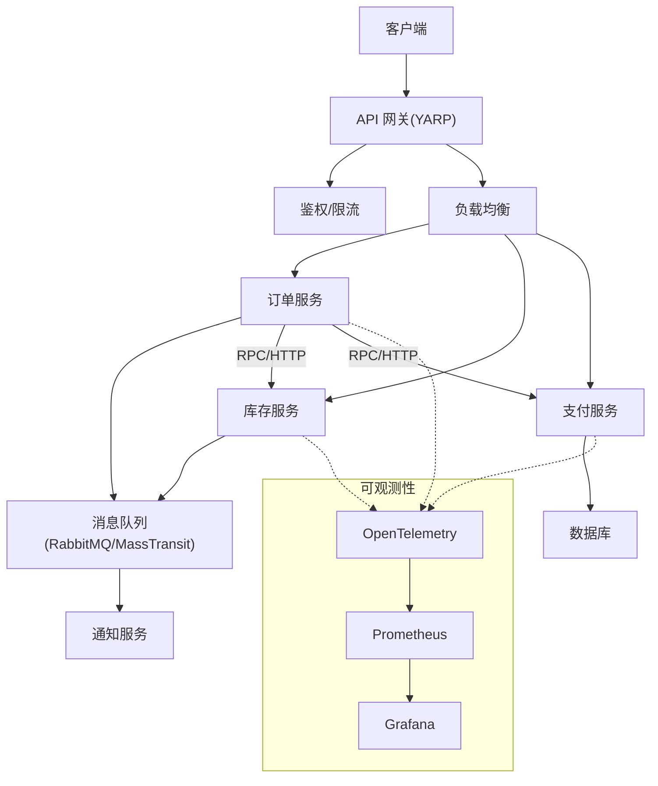

图表来源
- [yarp_integration.cs](file://yarp_integration.cs)
- [load_balancer.cs](file://load_balancer.cs)
- [message_queue.cs](file://message_queue.cs)
- [masstransit_production_integration.cs](file://masstransit_production_integration.cs)
- [opentelemetry_integration.cs](file://opentelemetry_integration.cs)
- [prometheus_metrics.cs](file://prometheus_metrics.cs)
- [grafana_integration.cs](file://grafana_integration.cs)

## 详细组件分析

### API 网关（YARP）
- 功能要点
  - 统一入口、路由转发、协议转换
  - 鉴权、签名校验、跨域、压缩
  - 熔断、重试、超时、缓存、批处理
  - 服务发现集成，动态后端更新
- 关键流程
  - 请求进入网关 -> 鉴权/限流 -> 选择后端 -> 转发并处理响应 -> 埋点与指标上报

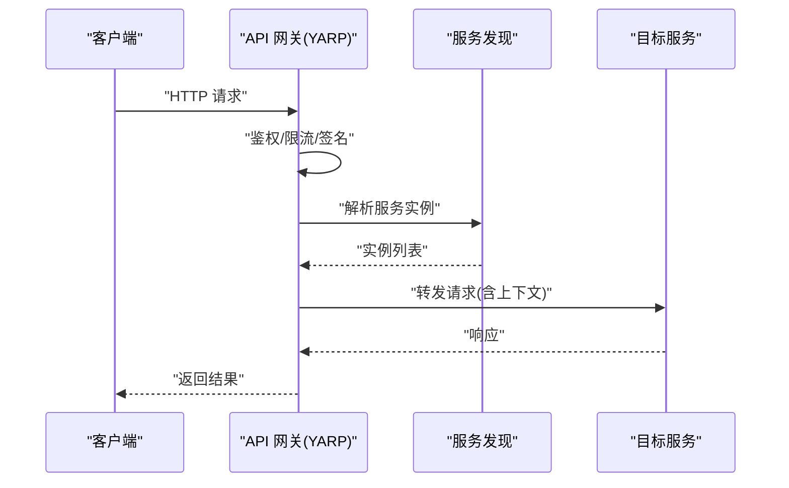

图表来源
- [yarp_integration.cs](file://yarp_integration.cs)
- [yarp_service_discovery.cs](file://yarp_service_discovery.cs)
- [yarp_circuit_breaker.cs](file://yarp_circuit_breaker.cs)

章节来源
- [yarp_integration.cs](file://yarp_integration.cs)
- [yarp_service_discovery.cs](file://yarp_service_discovery.cs)
- [yarp_circuit_breaker.cs](file://yarp_circuit_breaker.cs)

### 服务发现与负载均衡
- 服务发现
  - 支持 Consul/Nacos/Etcd 等注册中心，心跳与健康检查
  - 客户端侧缓存与增量更新，避免频繁拉取
- 负载均衡
  - 轮询、加权、最少连接、一致性哈希等策略
  - 结合健康状态与权重动态调整流量

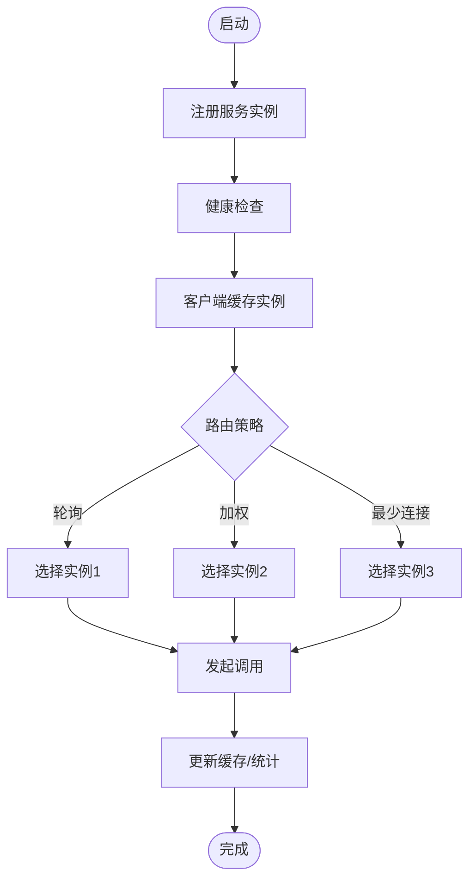

图表来源
- [service_discovery_integration.cs](file://service_discovery_integration.cs)
- [service_discovery_advanced_integration.cs](file://service_discovery_advanced_integration.cs)
- [load_balancer.cs](file://load_balancer.cs)

章节来源
- [service_discovery_integration.cs](file://service_discovery_integration.cs)
- [service_discovery_advanced_integration.cs](file://service_discovery_advanced_integration.cs)
- [load_balancer.cs](file://load_balancer.cs)

### 熔断、降级与重试
- 熔断器
  - 失败率/慢调用阈值触发短路，半开探测恢复
  - 隔离舱防止雪崩，快速失败与回退
- 重试与退避
  - 指数退避、抖动、幂等控制
- 适用场景
  - 下游不稳定、网络抖动、热点保护

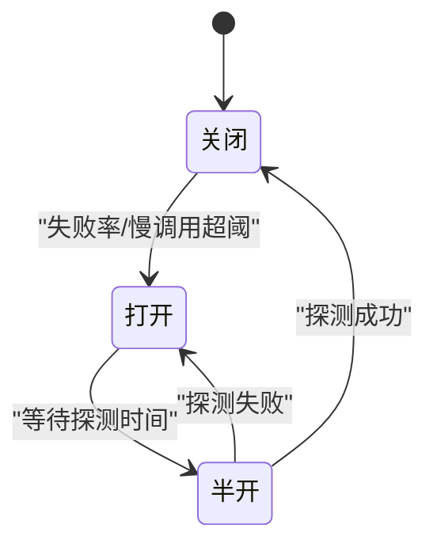

图表来源
- [resilient_polly_integration.cs](file://resilient_polly_integration.cs)
- [http_resilience_integration.cs](file://http_resilience_integration.cs)
- [webapiclientcore_circuitbreaker.cs](file://webapiclientcore_circuitbreaker.cs)

章节来源
- [resilient_polly_integration.cs](file://resilient_polly_integration.cs)
- [http_resilience_integration.cs](file://http_resilience_integration.cs)
- [webapiclientcore_circuitbreaker.cs](file://webapiclientcore_circuitbreaker.cs)

### 消息队列与事件驱动
- 能力要点
  - 可靠投递、顺序性、重试与死信
  - 发布订阅、点对点、延迟与优先级
  - 消费端幂等与去重
- 集成方案
  - MassTransit + RabbitMQ，支持持久化与事务消息
  - 本地消息表与出队任务，保障最终一致

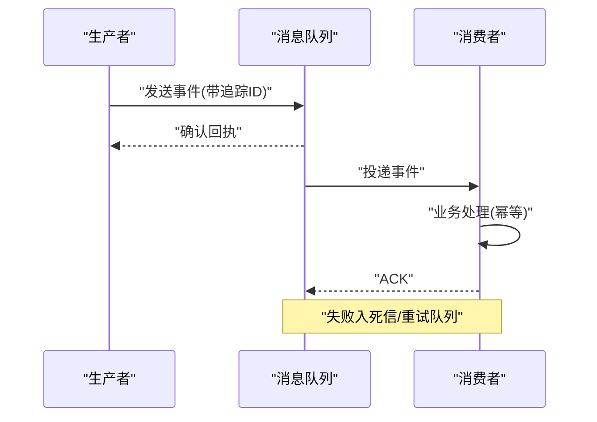

图表来源
- [message_queue.cs](file://message_queue.cs)
- [message_queue_enhanced.cs](file://message_queue_enhanced.cs)
- [masstransit_production_integration.cs](file://masstransit_production_integration.cs)
- [rabbitmq_production_integration.cs](file://rabbitmq_production_integration.cs)

章节来源
- [message_queue.cs](file://message_queue.cs)
- [message_queue_enhanced.cs](file://message_queue_enhanced.cs)
- [masstransit_production_integration.cs](file://masstransit_production_integration.cs)
- [rabbitmq_production_integration.cs](file://rabbitmq_production_integration.cs)

### 分布式事务与一致性
- 模式选择
  - TCC：Try-Confirm-Cancel，强一致但复杂
  - Saga：长事务拆分为多步，配合补偿
  - 本地消息表/事务消息：最终一致性
- 关键点
  - 幂等、补偿、回滚、审计与对账
  - 超时与重试的边界条件处理

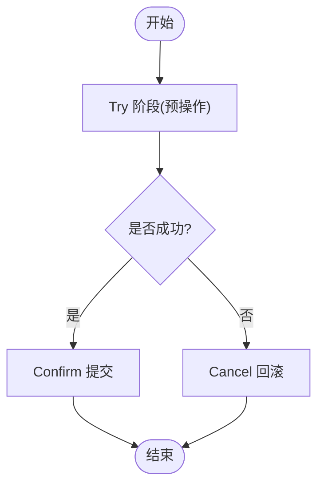

图表来源
- [distributed_transaction.cs](file://distributed_transaction.cs)

章节来源
- [distributed_transaction.cs](file://distributed_transaction.cs)

### 可观测性：链路追踪与指标
- 链路追踪
  - OpenTelemetry 注入，跨进程传播 TraceId/SpanId
  - 采样策略与导出至 Jaeger/Zipkin
- 指标与日志
  - Prometheus 暴露指标，Grafana 可视化
  - 结构化日志与错误分级

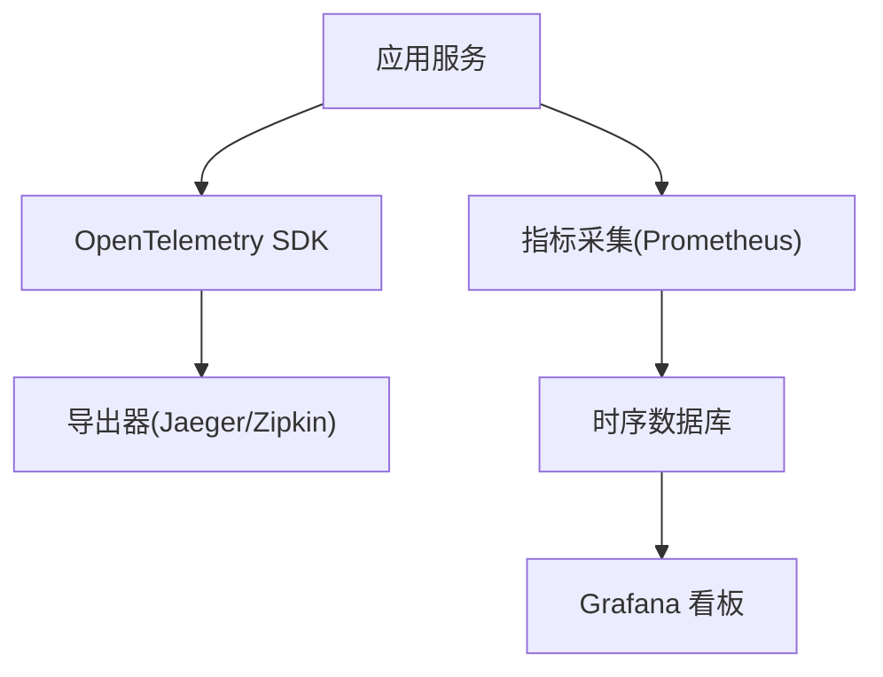

图表来源
- [opentelemetry_integration.cs](file://opentelemetry_integration.cs)
- [prometheus_metrics.cs](file://prometheus_metrics.cs)
- [grafana_integration.cs](file://grafana_integration.cs)
- [tracing_extension.cs](file://tracing_extension.cs)
- [distributed_tracing.cs](file://distributed_tracing.cs)
- [distributed_tracing_enhanced.cs](file://distributed_tracing_enhanced.cs)
- [distributed_tracing_profiler.cs](file://distributed_tracing_profiler.cs)

章节来源
- [opentelemetry_integration.cs](file://opentelemetry_integration.cs)
- [prometheus_metrics.cs](file://prometheus_metrics.cs)
- [grafana_integration.cs](file://grafana_integration.cs)
- [tracing_extension.cs](file://tracing_extension.cs)
- [distributed_tracing.cs](file://distributed_tracing.cs)
- [distributed_tracing_enhanced.cs](file://distributed_tracing_enhanced.cs)
- [distributed_tracing_profiler.cs](file://distributed_tracing_profiler.cs)

### 部署与编排
- Docker 容器化
  - 多阶段构建、镜像瘦身、安全基线
- Kubernetes 编排
  - Deployment/Service/Ingress/ConfigMap/Secret/HPA
  - 滚动升级、探针、资源限制
- 本地与轻量环境
  - Minikube 快速搭建
  - Podman 无守护进程容器引擎

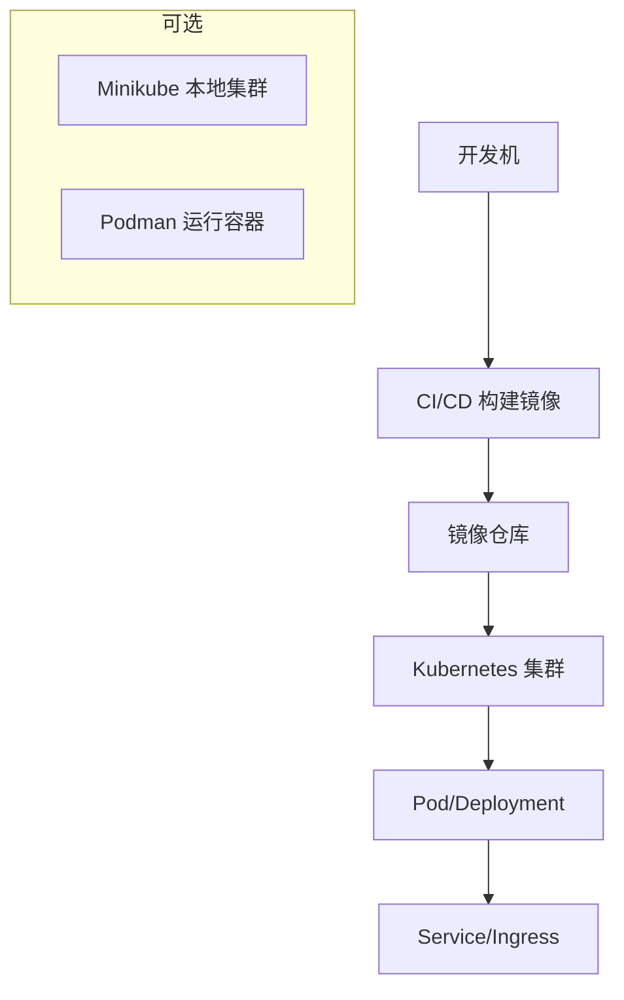

图表来源
- [docker_compose_integration.cs](file://docker_compose_integration.cs)
- [k8s_integration.cs](file://k8s_integration.cs)
- [minikube_integration.cs](file://minikube_integration.cs)
- [podman_integration.cs](file://podman_integration.cs)

章节来源
- [docker_compose_integration.cs](file://docker_compose_integration.cs)
- [k8s_integration.cs](file://k8s_integration.cs)
- [minikube_integration.cs](file://minikube_integration.cs)
- [podman_integration.cs](file://podman_integration.cs)

### 服务网格与 Sidecar
- 能力
  - 流量治理（灰度、蓝绿、熔断、重试）
  - 零侵入可观测与安全（mTLS）
- 部署
  - Sidecar 注入，控制面统一管理

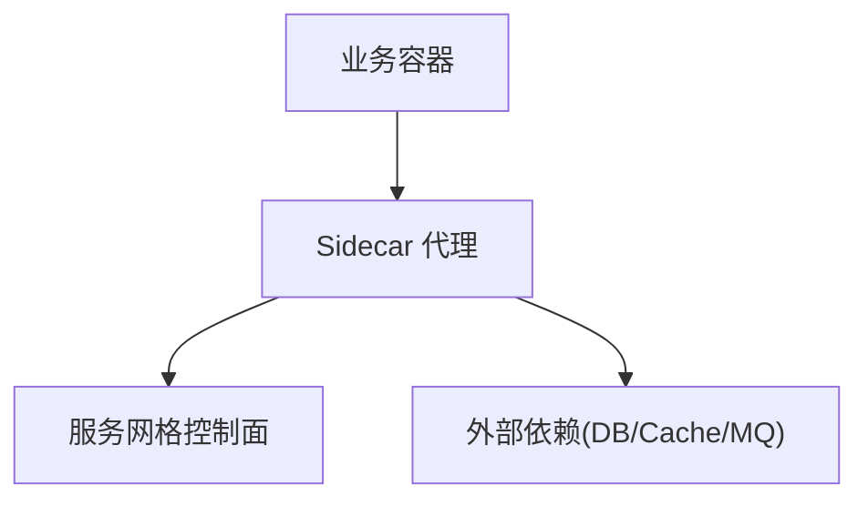

图表来源
- [service_mesh_enhanced.cs](file://service_mesh_enhanced.cs)

章节来源
- [service_mesh_enhanced.cs](file://service_mesh_enhanced.cs)

## 依赖关系分析
- 组件耦合
  - 网关依赖服务发现与负载均衡
  - 业务服务依赖消息中间件与存储
  - 可观测性贯穿全链路
- 外部依赖
  - 注册中心、消息队列、时序数据库、可视化平台

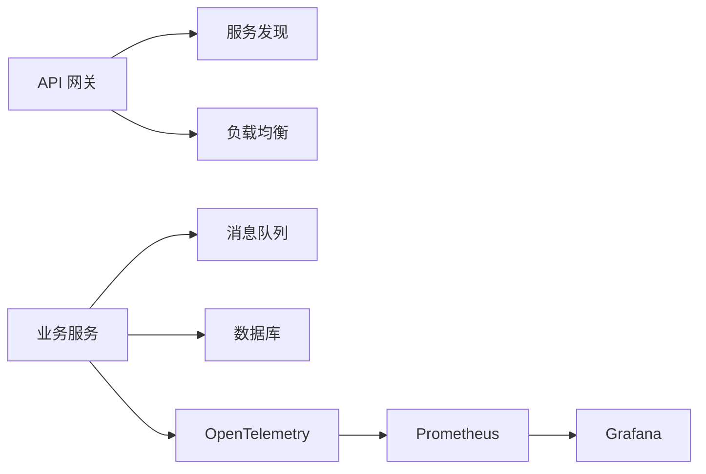

图表来源
- [yarp_integration.cs](file://yarp_integration.cs)
- [service_discovery_integration.cs](file://service_discovery_integration.cs)
- [load_balancer.cs](file://load_balancer.cs)
- [message_queue.cs](file://message_queue.cs)
- [opentelemetry_integration.cs](file://opentelemetry_integration.cs)
- [prometheus_metrics.cs](file://prometheus_metrics.cs)
- [grafana_integration.cs](file://grafana_integration.cs)

章节来源
- [yarp_integration.cs](file://yarp_integration.cs)
- [service_discovery_integration.cs](file://service_discovery_integration.cs)
- [load_balancer.cs](file://load_balancer.cs)
- [message_queue.cs](file://message_queue.cs)
- [opentelemetry_integration.cs](file://opentelemetry_integration.cs)
- [prometheus_metrics.cs](file://prometheus_metrics.cs)
- [grafana_integration.cs](file://grafana_integration.cs)

## 性能考量
- 连接池与序列化
  - HTTP/gRPC 连接复用，Protobuf/MessagePack 高效序列化
- 缓存与读写分离
  - 多级缓存（内存/Redis）、读多写少场景优化
- 并发与背压
  - 线程池/协程、限流与背压控制
- 采样与降采样
  - 高吞吐下合理采样，降低开销
- 容量规划
  - CPU/内存/IO 瓶颈定位与扩容策略

[本节为通用指导，不直接分析具体文件]

## 故障排查指南
- 常见问题
  - 服务不可用：检查健康检查、注册中心、网络与端口
  - 高延迟：查看链路追踪、GC 停顿、锁竞争与慢查询
  - 消息堆积：检查消费者处理能力、重试与死信
  - 熔断触发：关注错误率、慢调用比例与阈值
- 工具与手段
  - 链路追踪定位调用链
  - 指标看板观察趋势与异常峰值
  - 日志聚合与告警规则联动

章节来源
- [alert_rules.cs](file://alert_rules.cs)
- [watchdog_integration.cs](file://watchdog_integration.cs)
- [performance_metrics.cs](file://performance_metrics.cs)

## 结论
本仓库提供了面向生产环境的微服务实践蓝图：以网关为入口，服务发现与负载均衡为基础，消息与事件驱动解耦，分布式事务保障一致性，全面可观测与治理提升稳定性与可维护性。建议按模块渐进引入，结合团队规模与复杂度选择合适的技术栈与治理强度。

[本节为总结，不直接分析具体文件]

## 附录
- 术语
  - 服务发现、负载均衡、熔断、降级、重试、幂等、最终一致性、服务网格、Sidecar、链路追踪、指标、告警
- 参考实践
  - 分层与领域边界划分
  - 接口契约与版本兼容
  - 安全与合规（鉴权、加密、审计）

[本节为补充信息，不直接分析具体文件]