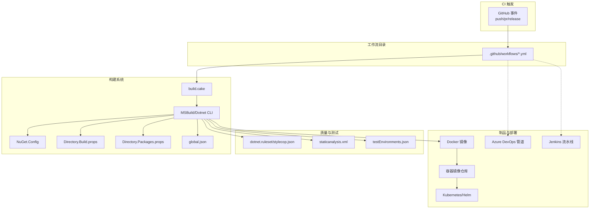
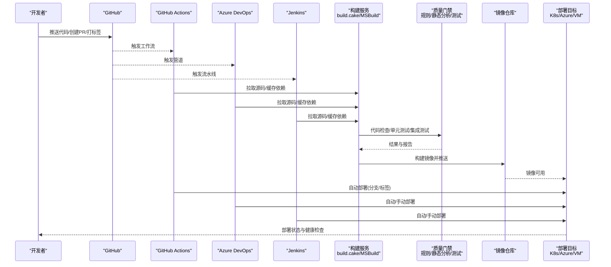
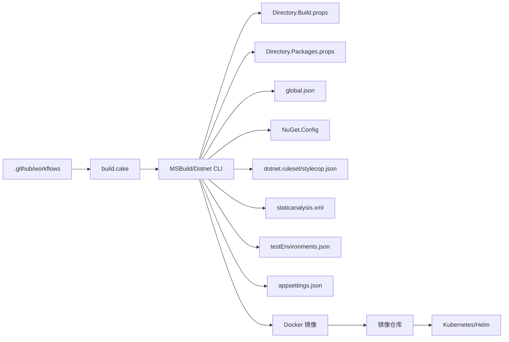

# CI/CD流水线

<cite>
**本文档引用的文件**   
- [.github/workflows](file://.github/workflows)
- [build.cake](file://build.cake)
- [Directory.Build.props](file://Directory.Build.props)
- [Directory.Packages.props](file://Directory.Packages.props)
- [global.json](file://global.json)
- [NuGet.Config](file://NuGet.Config)
- [dotnet.ruleset](file://dotnet.ruleset)
- [stylecop.json](file://stylecop.json)
- [staticanalysis.xml](file://staticanalysis.xml)
- [testEnvironments.json](file://testEnvironments.json)
- [appsettings.json](file://appsettings.json)
</cite>

## 目录
1. [简介](#简介)
2. [项目结构](#项目结构)
3. [核心组件](#核心组件)
4. [架构总览](#架构总览)
5. [详细组件分析](#详细组件分析)
6. [依赖分析](#依赖分析)
7. [性能考虑](#性能考虑)
8. [故障排查指南](#故障排查指南)
9. [结论](#结论)
10. [附录](#附录)

## 简介
本文件面向团队与个人开发者，提供覆盖 GitHub Actions、Azure DevOps、Jenkins 的端到端 CI/CD 流水线设计文档。内容包含代码检查、单元测试、集成测试、自动化构建、镜像推送、自动部署、多环境策略、配置与密钥管理、回滚机制、部署验证、质量门禁与发布审批流程，以及流水线优化（并行执行、缓存策略、故障恢复）等最佳实践。

## 项目结构
仓库为 .NET 解决方案，根目录包含全局构建与质量配置文件，.github/workflows 用于 GitHub Actions 流水线定义。关键目录与文件：
- .github/workflows：GitHub Actions 工作流定义目录
- build.cake：跨平台构建脚本入口（Cake）
- Directory.Build.props/targets：全局 MSBuild 属性与目标
- Directory.Packages.props：集中式包版本管理
- global.json：SDK/工具链约束
- NuGet.Config：NuGet 源与凭据
- dotnet.ruleset/stylecop.json/staticanalysis.xml：代码风格与静态分析规则
- testEnvironments.json：测试运行环境配置
- appsettings.json：应用运行时配置（示例）

**图表来源** 
- [.github/workflows](file://.github/workflows)
- [build.cake:1-200](file://build.cake#L1-L200)
- [Directory.Build.props:1-200](file://Directory.Build.props#L1-L200)
- [Directory.Packages.props:1-200](file://Directory.Packages.props#L1-L200)
- [global.json:1-200](file://global.json#L1-L200)
- [NuGet.Config:1-200](file://NuGet.Config#L1-L200)
- [dotnet.ruleset:1-200](file://dotnet.ruleset#L1-L200)
- [stylecop.json:1-200](file://stylecop.json#L1-L200)
- [staticanalysis.xml:1-200](file://staticanalysis.xml#L1-L200)
- [testEnvironments.json:1-200](file://testEnvironments.json#L1-L200)

**章节来源**
- [.github/workflows](file://.github/workflows)
- [build.cake:1-200](file://build.cake#L1-L200)
- [Directory.Build.props:1-200](file://Directory.Build.props#L1-L200)
- [Directory.Packages.props:1-200](file://Directory.Packages.props#L1-L200)
- [global.json:1-200](file://global.json#L1-L200)
- [NuGet.Config:1-200](file://NuGet.Config#L1-L200)
- [dotnet.ruleset:1-200](file://dotnet.ruleset#L1-L200)
- [stylecop.json:1-200](file://stylecop.json#L1-L200)
- [staticanalysis.xml:1-200](file://staticanalysis.xml#L1-L200)
- [testEnvironments.json:1-200](file://testEnvironments.json#L1-L200)

## 核心组件
- 工作流编排：.github/workflows 下的 YAML 文件定义触发条件、阶段、作业与任务。
- 构建脚本：build.cake 统一封装构建、测试、打包、发布等步骤，便于跨平台与复用。
- 全局构建属性：Directory.Build.props/targets 集中设置编译选项、签名、输出路径等。
- 包管理：Directory.Packages.props 集中管理 NuGet 包版本；NuGet.Config 配置源与凭据。
- 工具链约束：global.json 锁定 SDK/工具版本，保证一致性。
- 质量门禁：dotnet.ruleset、stylecop.json、staticanalysis.xml 控制代码规范与静态分析。
- 测试环境：testEnvironments.json 指定测试运行器与环境变量。
- 应用配置：appsettings.json 作为运行时配置样例（生产通过密钥管理与环境变量注入）。

**章节来源**
- [build.cake:1-200](file://build.cake#L1-L200)
- [Directory.Build.props:1-200](file://Directory.Build.props#L1-L200)
- [Directory.Packages.props:1-200](file://Directory.Packages.props#L1-L200)
- [global.json:1-200](file://global.json#L1-L200)
- [NuGet.Config:1-200](file://NuGet.Config#L1-L200)
- [dotnet.ruleset:1-200](file://dotnet.ruleset#L1-L200)
- [stylecop.json:1-200](file://stylecop.json#L1-L200)
- [staticanalysis.xml:1-200](file://staticanalysis.xml#L1-L200)
- [testEnvironments.json:1-200](file://testEnvironments.json#L1-L200)
- [appsettings.json:1-200](file://appsettings.json#L1-L200)

## 架构总览
下图展示从代码提交到部署上线的整体流水线，涵盖三大平台（GitHub Actions、Azure DevOps、Jenkins）的统一能力模型。

**图表来源** 
- [.github/workflows](file://.github/workflows)
- [build.cake:1-200](file://build.cake#L1-L200)

## 详细组件分析

### GitHub Actions 流水线
- 触发条件：push、pull_request、release 等事件
- 阶段划分：
  - 初始化与缓存：安装 .NET SDK、缓存 NuGet 包与构建产物
  - 代码检查：StyleCop/Roslyn 规则集校验
  - 单元测试：并行执行测试项目，生成覆盖率与报告
  - 集成测试：启动依赖（如数据库/消息队列），执行端到端用例
  - 构建与打包：调用 build.cake 或 dotnet 命令生成可执行/库
  - 镜像构建与推送：docker build/push，标记版本与latest
  - 部署：按分支/标签策略部署至开发/预发/生产
  - 通知：失败/成功通知（邮件/聊天机器人）
- 关键要点：
  - 使用矩阵策略并行构建不同框架/平台
  - 使用缓存加速依赖下载与还原
  - 使用环境变量与机密管理敏感信息
  - 使用 artifacts 保留测试报告与产物

**章节来源**
- [.github/workflows](file://.github/workflows)
- [build.cake:1-200](file://build.cake#L1-L200)

### Azure DevOps 流水线
- 触发方式：YAML 管道或经典编辑器
- 阶段划分：
  - 准备：获取源码、安装工具、缓存
  - 构建：dotnet build/publish，调用 build.cake
  - 测试：单元测试与集成测试，收集报告
  - 安全扫描：依赖漏洞扫描与二进制扫描
  - 打包：生成 NuGet 包与 Docker 镜像
  - 发布：推送到制品库与镜像仓库
  - 部署：Kubernetes/Helm 或 VM 部署，支持审批门
- 关键要点：
  - 使用变量组与密钥库管理配置
  - 使用模板与多阶段管道提升复用性
  - 使用发布管道进行环境隔离与审批

**章节来源**
- [build.cake:1-200](file://build.cake#L1-L200)
- [Directory.Build.props:1-200](file://Directory.Build.props#L1-L200)

### Jenkins 流水线
- 触发方式：Webhook、定时任务、参数化构建
- 阶段划分：
  - 拉取源码与缓存
  - 构建与测试（JUnit/NUnit 报告）
  - 静态分析与质量门禁
  - 镜像构建与推送
  - 部署与回滚
- 关键要点：
  - 使用 Pipeline DSL 实现复杂逻辑
  - 使用共享库提高复用
  - 使用凭据插件管理密钥
  - 使用节点池与代理扩展并发

**章节来源**
- [build.cake:1-200](file://build.cake#L1-L200)

### 构建与打包（build.cake）
- 职责：统一封装构建、测试、打包、发布等步骤，屏蔽平台差异
- 典型任务：
  - Restore：还原 NuGet 包
  - Build：编译解决方案，输出制品
  - Test：执行单元与集成测试，生成报告
  - Package：生成 NuGet 包与 Docker 镜像
  - Publish：推送制品到仓库
- 优化点：
  - 增量构建与缓存
  - 并行执行测试
  - 分阶段构建减少冷启动

**章节来源**
- [build.cake:1-200](file://build.cake#L1-L200)

### 全局构建属性（Directory.Build.props）
- 作用：集中设置编译选项、目标框架、输出路径、签名、强命名等
- 建议：
  - 区分 Debug/Release 配置
  - 启用 Analyzers 与 Code Analysis
  - 统一版本号与产品元数据

**章节来源**
- [Directory.Build.props:1-200](file://Directory.Build.props#L1-L200)

### 包版本管理（Directory.Packages.props）
- 作用：集中管理 NuGet 包版本，避免冲突
- 建议：
  - 使用中央版本管理
  - 定期更新与安全补丁
  - 锁定关键依赖版本

**章节来源**
- [Directory.Packages.props:1-200](file://Directory.Packages.props#L1-L200)

### 工具链约束（global.json）
- 作用：锁定 .NET SDK 版本与工具链，确保一致构建
- 建议：
  - 固定 SDK 版本
  - 启用滚动更新策略时谨慎升级

**章节来源**
- [global.json:1-200](file://global.json#L1-L200)

### NuGet 源与凭据（NuGet.Config）
- 作用：配置私有源、访问令牌、代理设置
- 建议：
  - 使用加密凭据
  - 限制源访问范围

**章节来源**
- [NuGet.Config:1-200](file://NuGet.Config#L1-L200)

### 代码质量与静态分析
- 规则集：dotnet.ruleset、stylecop.json、staticanalysis.xml
- 建议：
  - 在 CI 中强制失败
  - 本地 IDE 集成提示
  - 定期清理规则

**章节来源**
- [dotnet.ruleset:1-200](file://dotnet.ruleset#L1-L200)
- [stylecop.json:1-200](file://stylecop.json#L1-L200)
- [staticanalysis.xml:1-200](file://staticanalysis.xml#L1-L200)

### 测试环境（testEnvironments.json）
- 作用：指定测试运行器、环境变量、并行度
- 建议：
  - 隔离测试数据
  - 使用容器化依赖

**章节来源**
- [testEnvironments.json:1-200](file://testEnvironments.json#L1-L200)

### 应用配置（appsettings.json）
- 作用：运行时配置样例
- 建议：
  - 不提交敏感配置
  - 使用环境变量与密钥管理服务

**章节来源**
- [appsettings.json:1-200](file://appsettings.json#L1-L200)

## 依赖分析
- 组件耦合：
  - 工作流依赖 build.cake 与 MSBuild
  - 构建依赖 Directory.Build.props 与 Directory.Packages.props
  - 测试依赖 testEnvironments.json 与外部依赖（数据库/消息队列）
- 外部依赖：
  - NuGet 源与包
  - 容器镜像仓库
  - Kubernetes/Helm 或云平台 API

**图表来源** 
- [.github/workflows](file://.github/workflows)
- [build.cake:1-200](file://build.cake#L1-L200)
- [Directory.Build.props:1-200](file://Directory.Build.props#L1-L200)
- [Directory.Packages.props:1-200](file://Directory.Packages.props#L1-L200)
- [global.json:1-200](file://global.json#L1-L200)
- [NuGet.Config:1-200](file://NuGet.Config#L1-L200)
- [dotnet.ruleset:1-200](file://dotnet.ruleset#L1-L200)
- [stylecop.json:1-200](file://stylecop.json#L1-L200)
- [staticanalysis.xml:1-200](file://staticanalysis.xml#L1-L200)
- [testEnvironments.json:1-200](file://testEnvironments.json#L1-L200)
- [appsettings.json:1-200](file://appsettings.json#L1-L200)

**章节来源**
- [.github/workflows](file://.github/workflows)
- [build.cake:1-200](file://build.cake#L1-L200)
- [Directory.Build.props:1-200](file://Directory.Build.props#L1-L200)
- [Directory.Packages.props:1-200](file://Directory.Packages.props#L1-L200)
- [global.json:1-200](file://global.json#L1-L200)
- [NuGet.Config:1-200](file://NuGet.Config#L1-L200)
- [dotnet.ruleset:1-200](file://dotnet.ruleset#L1-L200)
- [stylecop.json:1-200](file://stylecop.json#L1-L200)
- [staticanalysis.xml:1-200](file://staticanalysis.xml#L1-L200)
- [testEnvironments.json:1-200](file://testEnvironments.json#L1-L200)
- [appsettings.json:1-200](file://appsettings.json#L1-L200)

## 性能考虑
- 并行执行：
  - 测试项目并行运行
  - 多框架/平台矩阵构建
- 缓存策略：
  - NuGet 包缓存
  - 构建输出缓存
  - Docker 层缓存
- 增量构建：
  - 仅重建变更项目
  - 跳过未变更测试
- 资源优化：
  - 使用专用构建节点
  - 限制并发度避免资源争用

[本节为通用指导，无需特定文件引用]

## 故障排查指南
- 常见问题：
  - 依赖还原失败：检查 NuGet.Config 与网络
  - 测试失败：查看测试报告与日志
  - 镜像构建失败：检查 Dockerfile 与上下文
  - 部署失败：检查权限与配置
- 诊断方法：
  - 启用详细日志
  - 使用本地复现
  - 逐步缩小问题范围
- 恢复策略：
  - 回滚到上一个稳定版本
  - 使用蓝绿/金丝雀发布降低风险

**章节来源**
- [testEnvironments.json:1-200](file://testEnvironments.json#L1-L200)
- [appsettings.json:1-200](file://appsettings.json#L1-L200)

## 结论
通过统一的构建脚本与全局配置，结合三大平台的流水线能力，可实现高效、稳定、可观测的 CI/CD 流程。建议持续优化缓存与并行策略，完善质量门禁与审批流程，确保交付质量与速度。

[本节为总结，无需特定文件引用]

## 附录
- 多环境部署策略：
  - 开发：自动部署，快速反馈
  - 预发：人工审批，模拟生产
  - 生产：灰度发布，监控告警
- 配置与密钥管理：
  - 使用环境变量与密钥服务
  - 禁止硬编码敏感信息
- 回滚机制：
  - 镜像版本回滚
  - 数据库迁移回滚脚本
- 部署验证：
  - 健康检查与冒烟测试
  - 指标与日志采集
- 质量门禁：
  - 代码覆盖率阈值
  - 静态分析零容忍
- 发布审批：
  - 分支保护与 PR 审查
  - 发布窗口与回退计划

[本节为补充说明，无需特定文件引用]