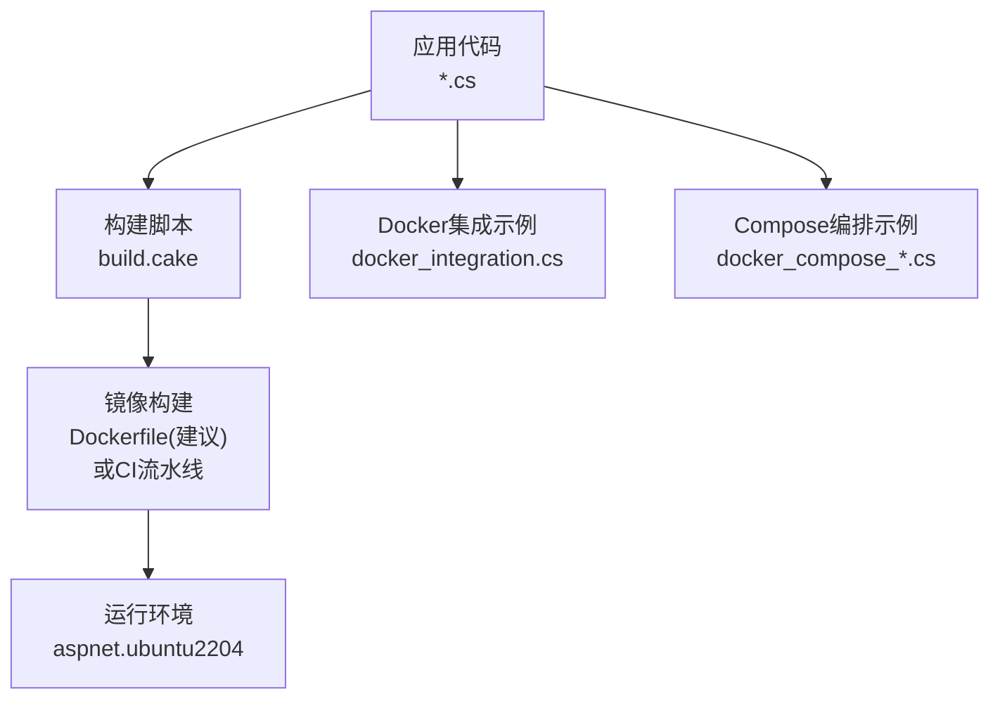
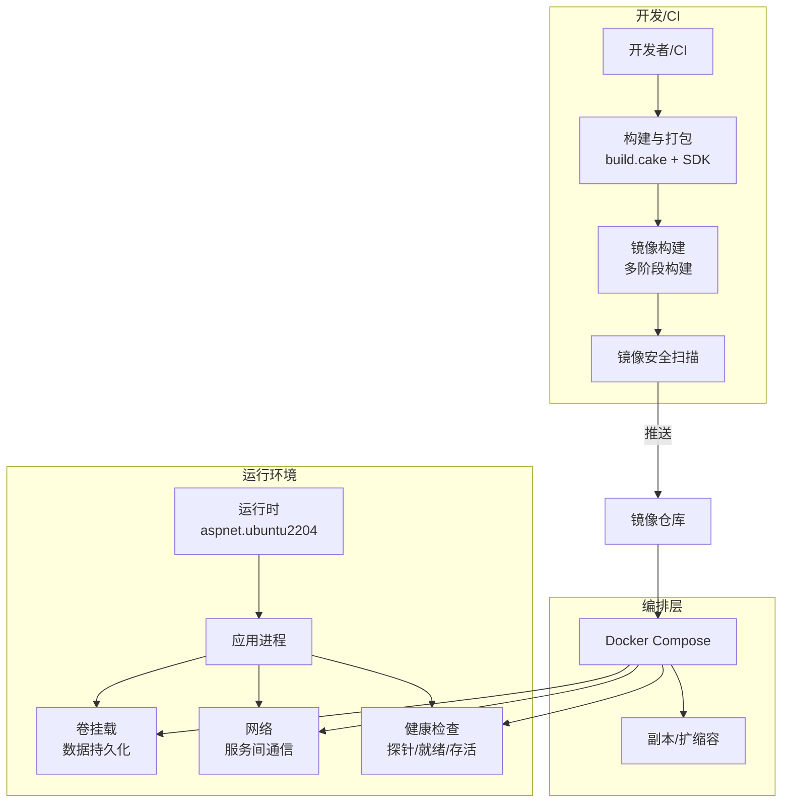
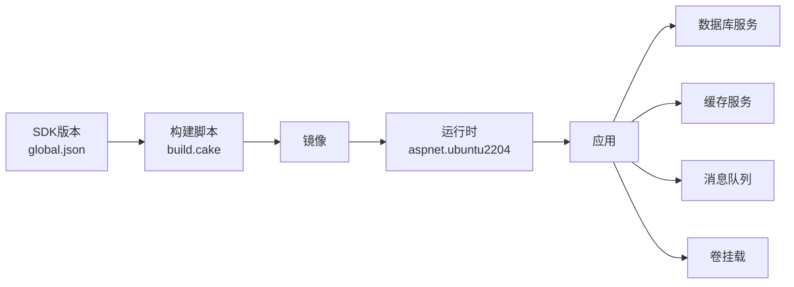

# Docker容器化

<cite>
**本文档引用的文件**   
- [docker_integration.cs](file://docker_integration.cs)
- [docker_compose_integration.cs](file://docker_compose_integration.cs)
- [docker_compose_advanced_integration.cs](file://docker_compose_advanced_integration.cs)
- [aspnet.ubuntu2204](file://aspnet.ubuntu2204)
- [build.cake](file://build.cake)
- [global.json](file://global.json)
- [Directory.Build.props](file://Directory.Build.props)
</cite>

## 目录
1. [简介](#简介)
2. [项目结构](#项目结构)
3. [核心组件](#核心组件)
4. [架构总览](#架构总览)
5. [详细组件分析](#详细组件分析)
6. [依赖关系分析](#依赖关系分析)
7. [性能考虑](#性能考虑)
8. [故障排查指南](#故障排查指南)
9. [结论](#结论)
10. [附录](#附录)

## 简介
本文件面向在本仓库中实现Docker容器化的工程实践，聚焦以下目标：
- Docker镜像构建最佳实践与多阶段构建优化
- 镜像安全扫描与最小化镜像大小策略
- Dockerfile编写规范、环境变量管理与卷挂载/数据持久化配置
- Docker Compose编排示例：多服务依赖、网络配置与服务发现
- 容器资源限制、健康检查与故障恢复机制

本仓库包含多个与Docker相关的集成示例与配置文件，可作为构建生产级容器的参考。

## 项目结构
仓库中与容器化直接相关的核心文件包括：
- docker_integration.cs：展示在应用内集成Docker能力（如容器操作、信息获取等）的示例代码
- docker_compose_integration.cs / docker_compose_advanced_integration.cs：演示Compose编排与高级用法
- aspnet.ubuntu2204：基于Ubuntu 22.04的ASP.NET运行时基础镜像选择参考
- build.cake：构建脚本，可用于驱动镜像构建流程
- global.json：SDK版本锁定，确保构建可重现
- Directory.Build.props：全局构建属性，影响发布产物与裁剪行为

图表来源
- [build.cake](file://build.cake)
- [aspnet.ubuntu2204](file://aspnet.ubuntu2204)
- [docker_integration.cs](file://docker_integration.cs)
- [docker_compose_integration.cs](file://docker_compose_integration.cs)
- [docker_compose_advanced_integration.cs](file://docker_compose_advanced_integration.cs)

章节来源
- [build.cake](file://build.cake)
- [aspnet.ubuntu2204](file://aspnet.ubuntu2204)
- [docker_integration.cs](file://docker_integration.cs)
- [docker_compose_integration.cs](file://docker_compose_integration.cs)
- [docker_compose_advanced_integration.cs](file://docker_compose_advanced_integration.cs)

## 核心组件
- 应用内Docker集成：通过C#代码调用Docker API或执行容器相关任务，便于在业务中动态管理容器生命周期、收集运行时信息等
- Compose编排：以声明式方式定义多服务拓扑、网络、卷与健康检查，简化本地与测试环境的部署
- 构建与发布：使用Cake脚本统一构建、打包与镜像生成步骤，结合SDK锁定保证一致性

章节来源
- [docker_integration.cs](file://docker_integration.cs)
- [docker_compose_integration.cs](file://docker_compose_integration.cs)
- [docker_compose_advanced_integration.cs](file://docker_compose_advanced_integration.cs)
- [build.cake](file://build.cake)

## 架构总览
下图展示了从源码到运行时的典型容器化路径，以及Compose编排的多服务交互关系。

图表来源
- [aspnet.ubuntu2204](file://aspnet.ubuntu2204)
- [build.cake](file://build.cake)
- [docker_compose_integration.cs](file://docker_compose_integration.cs)
- [docker_compose_advanced_integration.cs](file://docker_compose_advanced_integration.cs)

## 详细组件分析

### 应用内Docker集成（docker_integration.cs）
- 职责：在应用中封装Docker客户端能力，提供容器信息查询、日志采集、事件监听等便捷方法
- 设计要点：
  - 将Docker客户端初始化与连接池管理抽象为独立模块，避免重复创建连接
  - 对Docker API调用进行重试与超时控制，提升健壮性
  - 通过配置项控制是否启用Docker集成，便于在不同环境开关功能
- 复杂度与性能：
  - 高频调用场景建议使用连接复用与批量接口
  - 日志拉取采用流式读取，避免内存峰值过高

章节来源
- [docker_integration.cs](file://docker_integration.cs)

### Compose编排（docker_compose_integration.cs / docker_compose_advanced_integration.cs）
- 职责：以代码形式描述服务、网络、卷、环境变量、健康检查与依赖关系
- 关键能力：
  - 多服务依赖：通过depends_on与条件启动顺序控制
  - 网络隔离：自定义桥接网络，服务间通过服务名解析
  - 数据持久化：命名卷或绑定挂载，保障数据跨重启不丢失
  - 健康检查：为每个服务定义健康探针，编排器根据状态调度
  - 服务发现：基于Compose内置DNS的服务名解析
- 高级特性：
  - 扩展片段与模板复用，减少重复配置
  - 环境变量分层注入（默认值、覆盖值、密钥管理）
  - 滚动更新与回滚策略（配合外部编排平台）

章节来源
- [docker_compose_integration.cs](file://docker_compose_integration.cs)
- [docker_compose_advanced_integration.cs](file://docker_compose_advanced_integration.cs)

### 构建脚本与发布（build.cake）
- 职责：统一构建、测试、打包与镜像生成流程
- 关键点：
  - 固定SDK版本（global.json），确保构建可重现
  - 支持Debug/Release与AOT发布模式，按需裁剪体积
  - 集成镜像构建命令，输出带标签的镜像并推送到仓库

章节来源
- [build.cake](file://build.cake)
- [global.json](file://global.json)

### 运行时基础镜像（aspnet.ubuntu2204）
- 职责：提供ASP.NET Core运行时与系统依赖的基础镜像
- 选型建议：
  - 优先使用官方精简镜像（如slim或alpine变体，视依赖而定）
  - 固定基础镜像标签，避免上游变更导致的不兼容

章节来源
- [aspnet.ubuntu2204](file://aspnet.ubuntu2204)

### 全局构建属性（Directory.Build.props）
- 职责：集中定义编译选项、发布参数、符号包与裁剪策略
- 优化点：
  - 启用Trimming与ReadyToRun，减小镜像体积并提升冷启动速度
  - 禁用不必要的调试信息，降低镜像大小

章节来源
- [Directory.Build.props](file://Directory.Build.props)

## 依赖关系分析
- 构建期依赖：
  - .NET SDK版本由global.json锁定
  - 构建脚本通过build.cake协调各阶段任务
- 运行期依赖：
  - 应用进程运行在aspnet.ubuntu2204基础镜像上
  - 通过Compose网络访问其他服务（数据库、缓存、消息队列等）
  - 卷挂载用于持久化数据与共享配置

图表来源
- [global.json](file://global.json)
- [build.cake](file://build.cake)
- [aspnet.ubuntu2204](file://aspnet.ubuntu2204)

章节来源
- [global.json](file://global.json)
- [build.cake](file://build.cake)
- [aspnet.ubuntu2204](file://aspnet.ubuntu2204)

## 性能考虑
- 多阶段构建：
  - 构建阶段安装SDK与依赖，运行阶段仅保留运行时与必要库
  - 使用只读根文件系统，避免写入开销
- 镜像最小化：
  - 合并RUN指令，减少层数
  - 清理缓存与临时文件，移除包管理器元数据
  - 使用非root用户运行应用，提升安全性与稳定性
- 资源限制：
  - 设置CPU与内存上限，防止单实例占用过多资源
  - 合理设置请求超时与连接池大小，避免雪崩
- 启动优化：
  - 启用AOT与ReadyToRun，缩短冷启动时间
  - 预热常用依赖与连接池

[本节为通用指导，无需特定文件引用]

## 故障排查指南
- 常见构建问题：
  - SDK版本不一致：核对global.json与本地SDK版本
  - 依赖缺失：确认nuget源与离线包缓存
  - 权限问题：确保构建上下文权限正确
- 运行期问题：
  - 端口冲突：检查宿主机端口映射与服务端口
  - 卷挂载失败：验证路径存在与读写权限
  - 健康检查失败：查看探针端点返回码与日志
- 网络问题：
  - 服务不可达：检查Compose网络与防火墙规则
  - DNS解析失败：确认服务名与网络别名配置
- 日志与诊断：
  - 使用容器日志与结构化日志聚合
  - 开启分布式追踪与指标上报，定位瓶颈

章节来源
- [build.cake](file://build.cake)
- [docker_compose_integration.cs](file://docker_compose_integration.cs)
- [docker_compose_advanced_integration.cs](file://docker_compose_advanced_integration.cs)

## 结论
通过本仓库中的Docker集成示例与构建脚本，可以建立一套完整的容器化体系：从源码构建、镜像优化与安全扫描，到Compose编排与运行治理。建议在生产环境中引入镜像仓库、CI/CD流水线与监控告警，进一步提升交付质量与运维效率。

[本节为总结性内容，无需特定文件引用]

## 附录

### Docker镜像构建最佳实践清单
- 使用多阶段构建分离构建与运行环境
- 固定基础镜像与SDK版本，确保可重现
- 合并指令、清理缓存，最小化镜像层数
- 使用非root用户运行应用
- 仅暴露必要端口，关闭调试与遥测
- 定期扫描镜像漏洞并修复

### Dockerfile编写规范
- 明确FROM基础镜像与标签
- 设置工作目录与用户
- 按依赖→源码→构建→运行的顺序组织指令
- 使用.dockerignore排除无关文件
- 定义健康检查与健康探针端点

### 环境变量管理
- 使用.env或密钥管理服务注入敏感信息
- 区分开发、测试、生产环境配置
- 提供默认值与必填校验

### 卷挂载与数据持久化
- 使用命名卷管理数据库与日志
- 绑定挂载配置文件与证书
- 定期备份与快照策略

### Docker Compose编排要点
- 明确服务依赖与启动顺序
- 自定义网络与端口映射
- 定义健康检查与重启策略
- 使用扩展片段提高复用性

### 容器资源限制与健康检查
- 设置CPU/内存限制与OOM策略
- 配置存活探针与就绪探针
- 实现优雅停机与限流降级

### 镜像安全扫描
- 集成Trivy/Clair等工具进行漏洞扫描
- 阻断高危漏洞进入制品库
- 定期更新基础镜像与依赖

[本节为通用指导，无需特定文件引用]