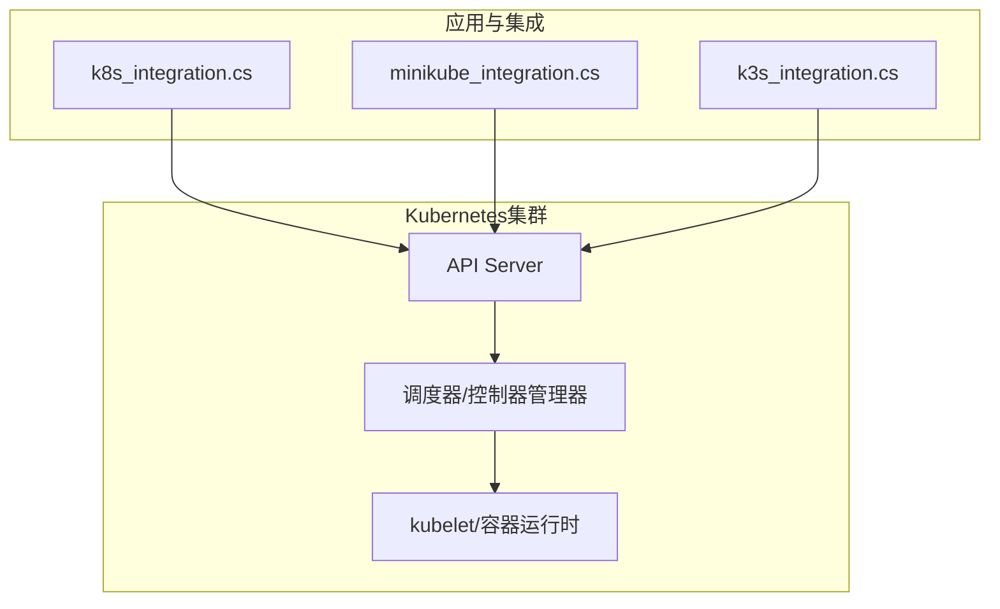
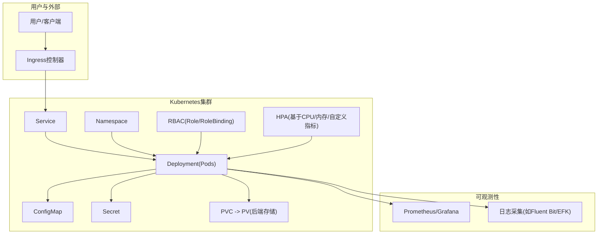
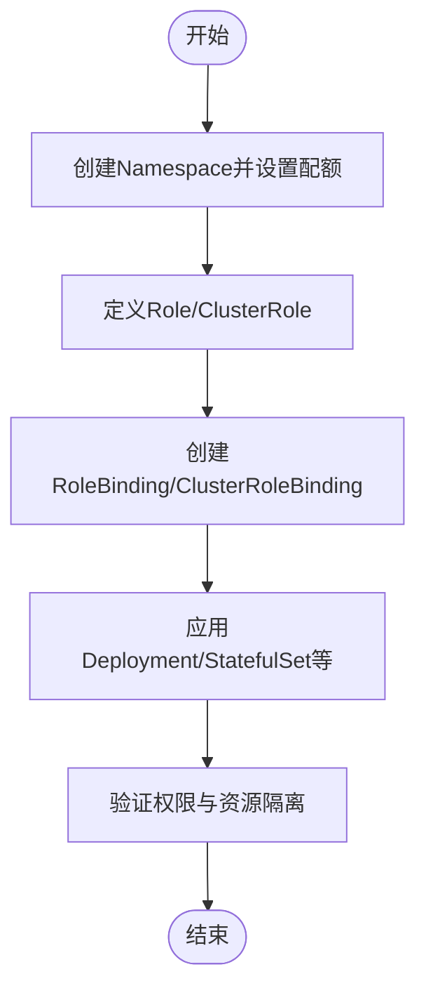
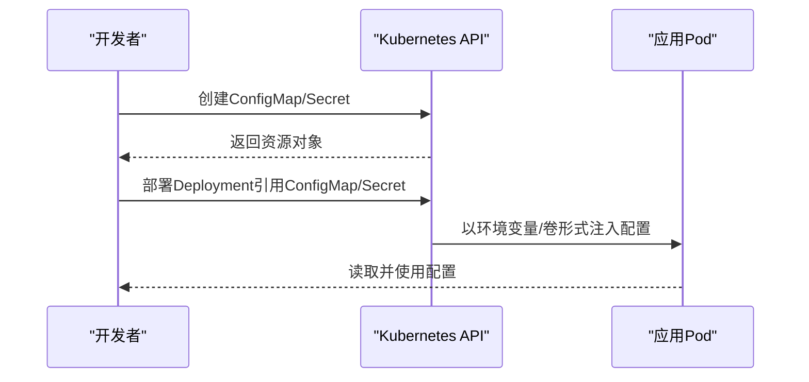
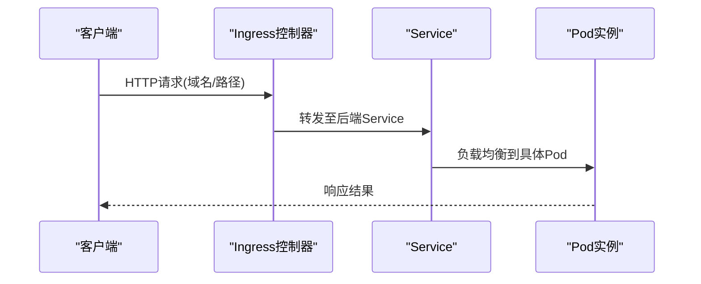
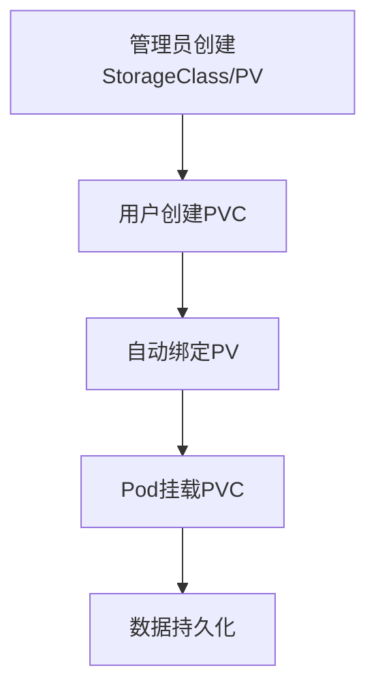
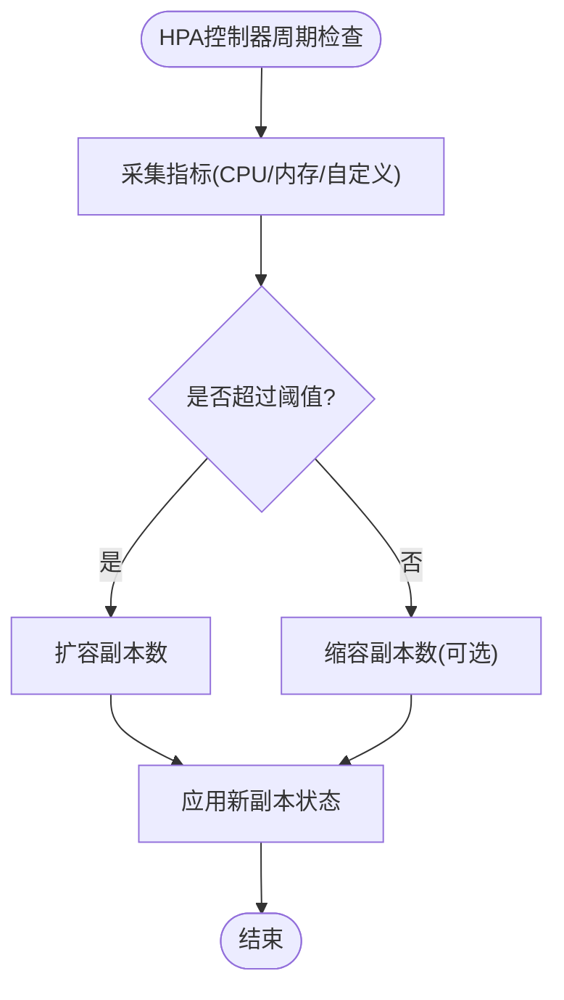
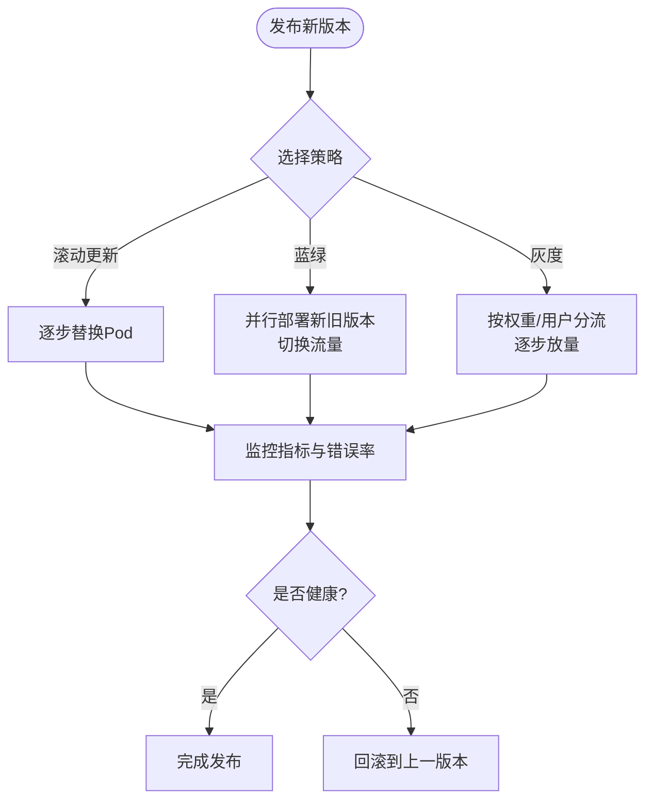
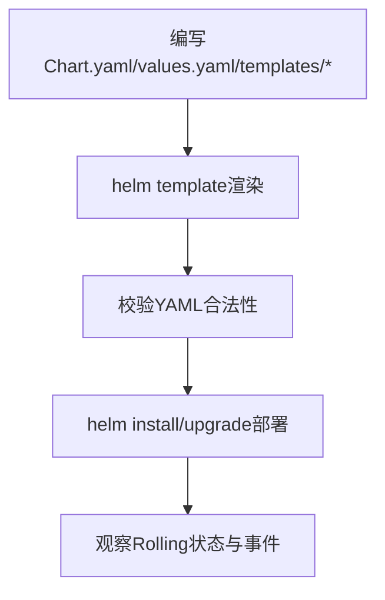
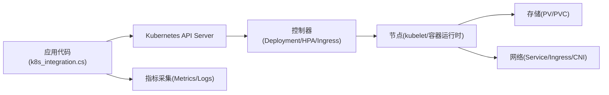

# Kubernetes编排

<cite>
**本文引用的文件**   
- [k8s_integration.cs](file://k8s_integration.cs)
- [minikube_integration.cs](file://minikube_integration.cs)
- [k3s_integration.cs](file://k3s_integration.cs)
</cite>

## 目录
1. [简介](#简介)
2. [项目结构](#项目结构)
3. [核心组件](#核心组件)
4. [架构总览](#架构总览)
5. [详细组件分析](#详细组件分析)
6. [依赖关系分析](#依赖关系分析)
7. [性能考虑](#性能考虑)
8. [故障排查指南](#故障排查指南)
9. [结论](#结论)
10. [附录](#附录)

## 简介
本文件面向需要在Kubernetes上编排应用的工程师与运维人员，提供从基础资源到高级部署策略的系统化指导。内容覆盖：
- Pod、Deployment、Service、ConfigMap、Secret等核心资源的YAML配置要点
- Helm Chart模板开发方法与最佳实践
- 命名空间隔离与RBAC权限控制
- 滚动更新、蓝绿部署、灰度发布等高级策略
- HPA水平扩缩容、PV/PVC存储管理、Ingress路由配置
- 集群监控、日志收集、故障排查与性能调优

说明：当前仓库未包含可直接运行的Kubernetes YAML或Helm Chart示例，本文基于通用Kubernetes实践进行系统化整理，并结合仓库中与Kubernetes相关的集成代码文件作为参考来源。

## 项目结构
仓库为多语言示例集合，其中与Kubernetes编排直接相关的参考实现位于以下文件：
- k8s_integration.cs：Kubernetes客户端/集成相关示例
- minikube_integration.cs：本地Minikube环境集成示例
- k3s_integration.cs：轻量K3s集群集成示例

这些文件可作为理解如何在应用侧与Kubernetes API交互的参考，但不包含YAML/Helm模板本身。

图表来源
- [k8s_integration.cs](file://k8s_integration.cs)
- [minikube_integration.cs](file://minikube_integration.cs)
- [k3s_integration.cs](file://k3s_integration.cs)

章节来源
- [k8s_integration.cs](file://k8s_integration.cs)
- [minikube_integration.cs](file://minikube_integration.cs)
- [k3s_integration.cs](file://k3s_integration.cs)

## 核心组件
本节概述Kubernetes编排中常用的核心资源及其职责：
- Pod：最小可部署单元，封装容器及运行参数
- Deployment：声明式副本集管理，支持滚动更新
- Service：稳定网络访问入口，提供负载均衡与服务发现
- ConfigMap：非敏感配置注入
- Secret：敏感信息（密钥、证书）安全注入
- Namespace：逻辑隔离与资源配额
- RBAC：基于角色的访问控制
- HPA：基于指标的水平自动扩缩容
- PV/PVC：持久化存储抽象
- Ingress：HTTP/HTTPS外部访问路由

章节来源
- [k8s_integration.cs](file://k8s_integration.cs)
- [minikube_integration.cs](file://minikube_integration.cs)
- [k3s_integration.cs](file://k3s_integration.cs)

## 架构总览
下图展示典型Kubernetes应用编排的整体架构，包括应用、服务暴露、配置与存储、以及监控日志体系。

图表来源
- [k8s_integration.cs](file://k8s_integration.cs)
- [minikube_integration.cs](file://minikube_integration.cs)
- [k3s_integration.cs](file://k3s_integration.cs)

## 详细组件分析

### 命名空间与RBAC权限控制
- 命名空间隔离：通过Namespace将不同环境或租户的资源隔离，配合ResourceQuota和LimitRange限制资源使用。
- RBAC模型：使用Role/ClusterRole定义权限，RoleBinding/ClusterRoleBinding绑定到用户、组或服务账号。
- 最佳实践：最小权限原则；为每个应用创建独立SA；避免在默认命名空间部署生产工作负载。

章节来源
- [k8s_integration.cs](file://k8s_integration.cs)
- [minikube_integration.cs](file://minikube_integration.cs)
- [k3s_integration.cs](file://k3s_integration.cs)

### 配置与密钥管理（ConfigMap与Secret）
- ConfigMap：用于存放环境变量、配置文件、启动脚本等非敏感数据。
- Secret：用于存放密码、令牌、TLS证书等敏感数据，建议加密存储并在挂载时按需解密。
- 注入方式：环境变量、卷挂载、命令行参数；注意敏感数据的访问审计与轮换策略。

章节来源
- [k8s_integration.cs](file://k8s_integration.cs)
- [minikube_integration.cs](file://minikube_integration.cs)
- [k3s_integration.cs](file://k3s_integration.cs)

### 服务暴露与路由（Service与Ingress）
- Service：ClusterIP/NodePort/LoadBalancer类型，提供稳定的内部或外部访问入口。
- Ingress：基于域名与路径规则进行HTTP/HTTPS路由，结合TLS终止与认证插件。
- 最佳实践：统一入口、按环境划分域名、启用健康检查与限流。

章节来源
- [k8s_integration.cs](file://k8s_integration.cs)
- [minikube_integration.cs](file://minikube_integration.cs)
- [k3s_integration.cs](file://k3s_integration.cs)

### 存储管理（PV与PVC）
- PV：由管理员预置或动态供给的持久卷，描述存储类、容量、访问模式等。
- PVC：应用侧声明的存储需求，自动绑定合适的PV。
- 最佳实践：选择合适的StorageClass；明确读写模式与回收策略；备份与快照策略。

章节来源
- [k8s_integration.cs](file://k8s_integration.cs)
- [minikube_integration.cs](file://minikube_integration.cs)
- [k3s_integration.cs](file://k3s_integration.cs)

### 水平扩缩容（HPA）
- 指标来源：CPU/内存、自定义Prometheus指标、事件驱动。
- 触发条件：目标利用率阈值、队列长度、延迟等。
- 最佳实践：合理设置requests/limits；避免抖动；结合PodDisruptionBudget保障可用性。

章节来源
- [k8s_integration.cs](file://k8s_integration.cs)
- [minikube_integration.cs](file://minikube_integration.cs)
- [k3s_integration.cs](file://k3s_integration.cs)

### 滚动更新与高级部署策略
- 滚动更新：逐步替换旧Pod，保证零停机；可配置最大不可用与最大增量。
- 蓝绿部署：同时维护两套环境，切换流量指向新版本；回滚快速。
- 灰度发布：按权重或用户维度分流，逐步放量；结合Ingress或ServiceMesh实现。

章节来源
- [k8s_integration.cs](file://k8s_integration.cs)
- [minikube_integration.cs](file://minikube_integration.cs)
- [k3s_integration.cs](file://k3s_integration.cs)

### Helm Chart模板开发
- 目录结构：Chart.yaml、values.yaml、templates/下按资源拆分模板。
- 参数化：通过values.yaml注入变量，使用Go模板语法渲染YAML。
- 版本与依赖：管理Chart版本与子Chart依赖；使用Hooks处理生命周期任务。
- 最佳实践：严格分离环境与值；使用命名空间前缀；对模板进行单元测试。

章节来源
- [k8s_integration.cs](file://k8s_integration.cs)
- [minikube_integration.cs](file://minikube_integration.cs)
- [k3s_integration.cs](file://k3s_integration.cs)

## 依赖关系分析
- 应用与Kubernetes API：通过客户端库调用API Server，管理资源生命周期。
- 控制器与调度：Deployment/HPA/Ingress控制器协调期望状态与实际状态。
- 存储与网络：PV/PVC对接底层存储；Service/Ingress对接CNI与LB。
- 可观测性：Metrics/Logs/Traces汇聚到监控系统。

图表来源
- [k8s_integration.cs](file://k8s_integration.cs)
- [minikube_integration.cs](file://minikube_integration.cs)
- [k3s_integration.cs](file://k3s_integration.cs)

章节来源
- [k8s_integration.cs](file://k8s_integration.cs)
- [minikube_integration.cs](file://minikube_integration.cs)
- [k3s_integration.cs](file://k3s_integration.cs)

## 性能考虑
- 资源规划：合理设置requests/limits，避免过度分配与抢占。
- 扩缩容策略：HPA阈值与冷却时间调优，避免频繁伸缩。
- 存储I/O：选择合适StorageClass与块大小，避免热点盘。
- 网络吞吐：Service与Ingress参数调优，启用连接复用与缓存。
- 可观测性：采集关键指标（CPU/内存/延迟/错误率），建立告警基线。

[本节为通用指导，不直接分析具体文件]

## 故障排查指南
- 常见问题：
  - Pod无法启动：检查镜像拉取、配置挂载、资源不足、健康探针失败。
  - 服务不可达：确认Service端口、Endpoint、Ingress规则与DNS解析。
  - 存储挂载失败：核对PVC状态、StorageClass、权限与后端存储连通性。
  - 扩缩容异常：查看HPA指标源、阈值设置与节点容量。
- 诊断步骤：
  - 使用kubectl describe/logs/events定位问题。
  - 检查控制器日志与API Server审计日志。
  - 验证RBAC权限与命名空间隔离。
  - 使用网络工具（curl/nslookup）与存储工具（df/fio）辅助定位。

章节来源
- [k8s_integration.cs](file://k8s_integration.cs)
- [minikube_integration.cs](file://minikube_integration.cs)
- [k3s_integration.cs](file://k3s_integration.cs)

## 结论
本文系统梳理了Kubernetes编排的核心资源、部署策略与可观测性方案，结合仓库中的Kubernetes集成代码作为参考，帮助读者在实际项目中落地标准化、可维护、可扩展的云原生编排实践。建议在CI/CD流水线中集成Helm模板测试与自动化发布流程，确保变更可控与回滚快速。

[本节为总结性内容，不直接分析具体文件]

## 附录
- 常用命令速查：kubectl get/describe/logs/exec/port-forward/top
- 推荐工具链：Helm、Kustomize、Prometheus、Grafana、EFK/ELK、Jaeger
- 安全加固：启用PodSecurityPolicy/PSA、网络策略、镜像签名与漏洞扫描

[本节为补充信息，不直接分析具体文件]