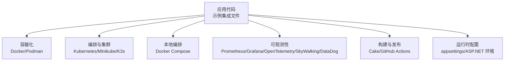
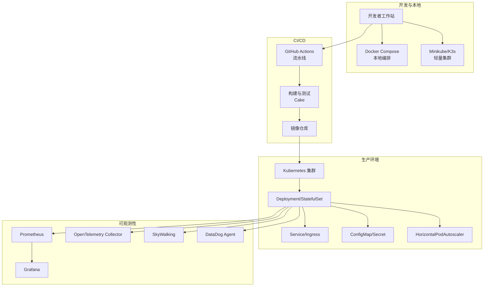
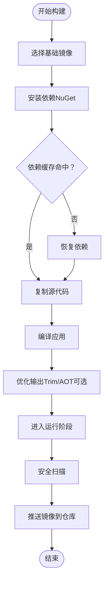
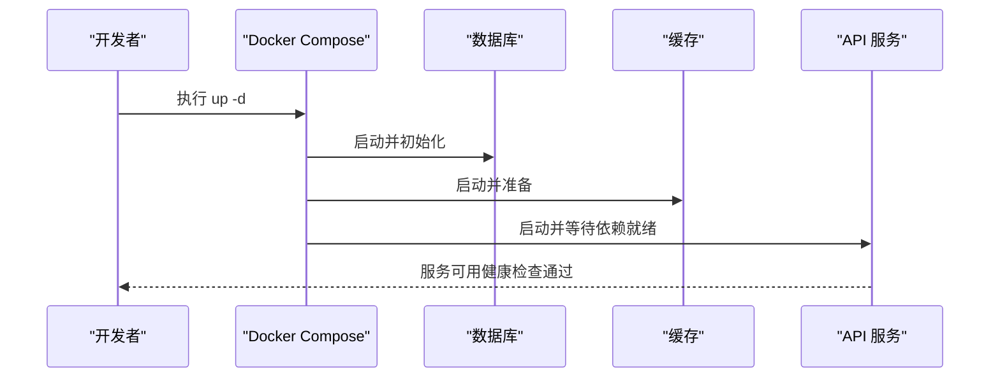
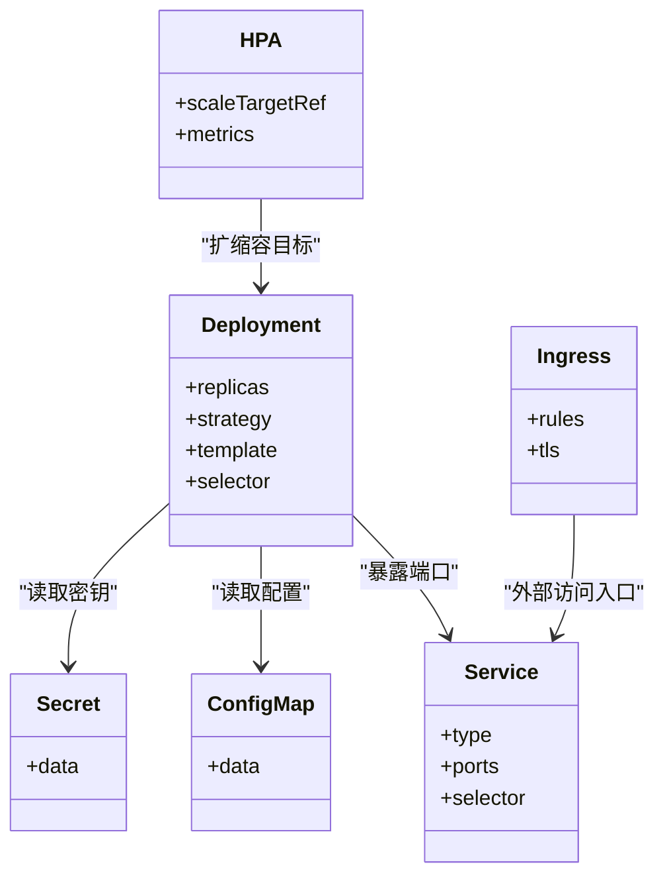
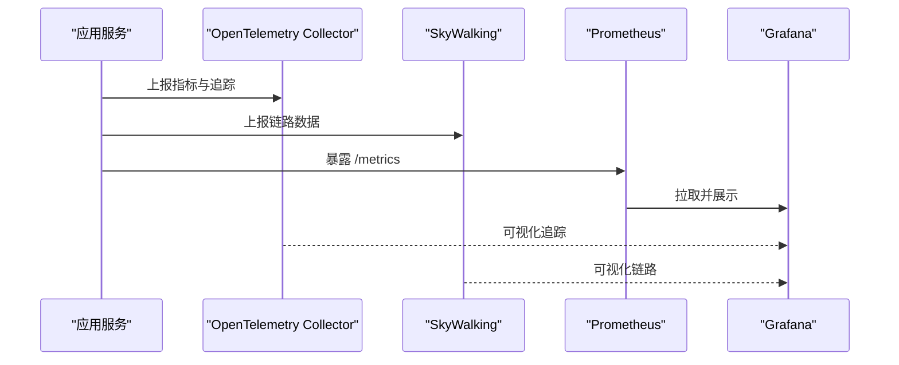
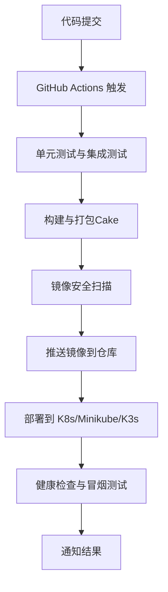
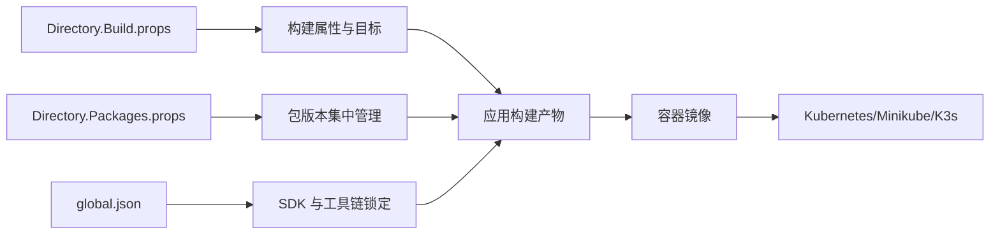

# 微服务部署与运维

<cite>
**本文引用的文件**   
- [README.md](file://README.md)
- [docker_compose_integration.cs](file://docker_compose_integration.cs)
- [docker_compose_advanced_integration.cs](file://docker_compose_advanced_integration.cs)
- [docker_integration.cs](file://docker_integration.cs)
- [k8s_integration.cs](file://k8s_integration.cs)
- [minikube_integration.cs](file://minikube_integration.cs)
- [k3s_integration.cs](file://k3s_integration.cs)
- [podman_integration.cs](file://podman_integration.cs)
- [aspnet.ubuntu2204](file://aspnet.ubuntu2204)
- [appsettings.json](file://appsettings.json)
- [Directory.Build.props](file://Directory.Build.props)
- [Directory.Packages.props](file://Directory.Packages.props)
- [global.json](file://global.json)
- [.github/workflows/](file://.github/workflows/)
- [prometheus_metrics.cs](file://prometheus_metrics.cs)
- [opentelemetry_integration.cs](file://opentelemetry_integration.cs)
- [opentelemetry_production.cs](file://opentelemetry_production.cs)
- [grafana_integration.cs](file://grafana_integration.cs)
- [datadog_logging.cs](file://datadog_logging.cs)
- [datadog_prometheus.cs](file://datadog_prometheus.cs)
- [skyapm_integration.cs](file://skyapm_integration.cs)
- [skyapm_logging.cs](file://skyapm_logging.cs)
- [skyapm_prometheus.cs](file://skyapm_prometheus.cs)
- [httpreports_prometheus.cs](file://httpreports_prometheus.cs)
- [metrics_monitoring.cs](file://metrics_monitoring.cs)
- [performance_metrics.cs](file://performance_metrics.cs)
- [alert_rules.cs](file://alert_rules.cs)
- [watchdog_alert_rules.cs](file://watchdog_alert_rules.cs)
- [build.cake](file://build.cake)
</cite>

## 目录
1. [简介](#简介)
2. [项目结构](#项目结构)
3. [核心组件](#核心组件)
4. [架构总览](#架构总览)
5. [详细组件分析](#详细组件分析)
6. [依赖关系分析](#依赖关系分析)
7. [性能考虑](#性能考虑)
8. [故障排查指南](#故障排查指南)
9. [结论](#结论)
10. [附录](#附录)

## 简介
本文件面向微服务的部署与运维，覆盖容器化（Docker）、编排（Kubernetes、Minikube、K3s）、本地开发环境（Docker Compose），以及镜像构建优化、资源配置管理、滚动更新与回滚策略。同时提供监控告警、日志收集、性能调优与故障排查指南，并给出CI/CD流水线设计与自动化部署建议。内容基于仓库中的集成示例与配置文件进行归纳总结，便于不同技术背景的读者快速上手与实践。

## 项目结构
该仓库包含大量“集成示例”文件，涵盖容器化、编排、可观测性与性能等主题。与部署运维直接相关的重点包括：
- 容器与编排：Docker、Docker Compose、Kubernetes、Minikube、K3s、Podman
- 运行时配置：ASP.NET 运行环境与 appsettings
- 可观测性：Prometheus、Grafana、OpenTelemetry、SkyWalking、DataDog
- 构建与发布：Cake 构建脚本、GitHub Actions（工作流目录）
- 全局构建属性与包管理：Directory.Build.props、Directory.Packages.props、global.json

**章节来源**
- [README.md](file://README.md)
- [.github/workflows/](file://.github/workflows/)

## 核心组件
- 容器化与镜像构建
  - Docker 集成示例用于演示如何打包 .NET 应用与依赖，支持多阶段构建与基础镜像选择。
  - Podman 集成示例展示无守护进程容器引擎的替代方案。
- 编排与集群
  - Kubernetes 集成示例说明 Deployment、Service、ConfigMap、Secret、HPA、Ingress 等关键资源的使用方式。
  - Minikube 与 K3s 示例提供本地或轻量级集群的快速部署路径。
- 本地开发环境
  - Docker Compose 集成示例定义多服务编排（如 API、数据库、缓存、消息队列等），便于在本地一键拉起。
- 可观测性
  - Prometheus 指标采集、Grafana 可视化、OpenTelemetry 分布式追踪、SkyWalking 链路追踪、DataDog 日志与指标。
- 构建与发布
  - Cake 脚本用于统一构建、测试、打包流程；GitHub Actions 目录用于 CI/CD 流水线编排。
- 运行时配置
  - ASP.NET 运行环境（Ubuntu 22.04）与 appsettings 配置管理，支持环境变量注入与多环境切换。

**章节来源**
- [docker_integration.cs](file://docker_integration.cs)
- [podman_integration.cs](file://podman_integration.cs)
- [k8s_integration.cs](file://k8s_integration.cs)
- [minikube_integration.cs](file://minikube_integration.cs)
- [k3s_integration.cs](file://k3s_integration.cs)
- [docker_compose_integration.cs](file://docker_compose_integration.cs)
- [docker_compose_advanced_integration.cs](file://docker_compose_advanced_integration.cs)
- [prometheus_metrics.cs](file://prometheus_metrics.cs)
- [grafana_integration.cs](file://grafana_integration.cs)
- [opentelemetry_integration.cs](file://opentelemetry_integration.cs)
- [skyapm_integration.cs](file://skyapm_integration.cs)
- [datadog_logging.cs](file://datadog_logging.cs)
- [build.cake](file://build.cake)
- [aspnet.ubuntu2204](file://aspnet.ubuntu2204)
- [appsettings.json](file://appsettings.json)

## 架构总览
下图展示了从代码到生产环境的典型部署与运维架构，涵盖容器化、编排、可观测性与 CI/CD 的关键环节。

**图表来源**
- [k8s_integration.cs](file://k8s_integration.cs)
- [docker_compose_integration.cs](file://docker_compose_integration.cs)
- [minikube_integration.cs](file://minikube_integration.cs)
- [k3s_integration.cs](file://k3s_integration.cs)
- [prometheus_metrics.cs](file://prometheus_metrics.cs)
- [grafana_integration.cs](file://grafana_integration.cs)
- [opentelemetry_integration.cs](file://opentelemetry_integration.cs)
- [skyapm_integration.cs](file://skyapm_integration.cs)
- [datadog_logging.cs](file://datadog_logging.cs)
- [build.cake](file://build.cake)
- [.github/workflows/](file://.github/workflows/)

## 详细组件分析

### 容器化与镜像构建优化
- 多阶段构建
  - 使用独立构建阶段与运行阶段，分离编译依赖与运行时依赖，显著减小镜像体积。
- 基础镜像选择
  - 优先选用精简运行时镜像（如 .NET SDK/Runtime 的 alpine 或 slim 变体），减少攻击面与下载时间。
- 层缓存优化
  - 将频繁变更的文件（如源代码）放在构建后期，稳定依赖（如 NuGet 包）前置，提升缓存命中率。
- 安全扫描与签名
  - 在 CI 中集成镜像漏洞扫描与签名校验，确保交付物安全可信。
- 非 root 运行
  - 以非特权用户运行容器，降低权限风险。

**章节来源**
- [docker_integration.cs](file://docker_integration.cs)
- [podman_integration.cs](file://podman_integration.cs)

### Docker Compose 本地开发环境搭建
- 服务编排
  - 通过 docker-compose.yml 定义 API、数据库、缓存、消息队列等服务的网络、卷、环境变量与依赖关系。
- 热重载与调试
  - 挂载源码目录，启用热重载，配合 IDE 调试体验更佳。
- 数据持久化
  - 为数据库与中间件配置数据卷，避免重启丢失。
- 健康检查与启动顺序
  - 使用 healthcheck 与 depends_on 控制服务就绪顺序。

**章节来源**
- [docker_compose_integration.cs](file://docker_compose_integration.cs)
- [docker_compose_advanced_integration.cs](file://docker_compose_advanced_integration.cs)

### Kubernetes 编排与资源配置
- 资源对象
  - Deployment：声明式副本管理与滚动更新。
  - Service：内部负载均衡与访问暴露。
  - ConfigMap/Secret：配置与敏感信息解耦。
  - HPA：基于 CPU/内存或自定义指标自动扩缩容。
  - Ingress：外部流量入口与路由规则。
- 滚动更新与回滚
  - 使用 rollingUpdate 策略实现零停机升级；失败时自动或手动回滚。
- 资源限制与请求
  - 设置 requests/limits 保障调度与稳定性。
- 存储与网络
  - PersistentVolumeClaim 持久化数据；NetworkPolicy 控制网络访问。

**图表来源**
- [k8s_integration.cs](file://k8s_integration.cs)

**章节来源**
- [k8s_integration.cs](file://k8s_integration.cs)

### 本地与轻量级集群（Minikube/K3s）
- Minikube
  - 适合单机快速验证 K8s 特性，内置 ingress、dashboard、metrics-server 等插件。
- K3s
  - 轻量级发行版，适用于边缘计算或小型集群，资源占用低。
- 常用命令与工作流
  - 创建集群、部署应用、查看日志、扩容与回滚。

**章节来源**
- [minikube_integration.cs](file://minikube_integration.cs)
- [k3s_integration.cs](file://k3s_integration.cs)

### 可观测性：监控、日志与追踪
- 指标采集
  - Prometheus 抓取应用指标（HTTP、业务指标、系统指标）。
- 可视化
  - Grafana 仪表盘展示关键指标与趋势。
- 分布式追踪
  - OpenTelemetry 与 SkyWalking 采集链路数据，定位慢调用与异常。
- 日志聚合
  - DataDog 或 ELK/EFK 体系集中收集与应用日志关联上下文。
- 告警规则
  - 基于阈值与事件触发告警，联动通知渠道。

**图表来源**
- [prometheus_metrics.cs](file://prometheus_metrics.cs)
- [grafana_integration.cs](file://grafana_integration.cs)
- [opentelemetry_integration.cs](file://opentelemetry_integration.cs)
- [skyapm_integration.cs](file://skyapm_integration.cs)
- [datadog_logging.cs](file://datadog_logging.cs)

**章节来源**
- [prometheus_metrics.cs](file://prometheus_metrics.cs)
- [grafana_integration.cs](file://grafana_integration.cs)
- [opentelemetry_integration.cs](file://opentelemetry_integration.cs)
- [opentelemetry_production.cs](file://opentelemetry_production.cs)
- [skyapm_integration.cs](file://skyapm_integration.cs)
- [skyapm_logging.cs](file://skyapm_logging.cs)
- [skyapm_prometheus.cs](file://skyapm_prometheus.cs)
- [httpreports_prometheus.cs](file://httpreports_prometheus.cs)
- [metrics_monitoring.cs](file://metrics_monitoring.cs)
- [performance_metrics.cs](file://performance_metrics.cs)
- [alert_rules.cs](file://alert_rules.cs)
- [watchdog_alert_rules.cs](file://watchdog_alert_rules.cs)

### 构建与发布（Cake + GitHub Actions）
- Cake 构建脚本
  - 统一构建、测试、打包、发布步骤，支持多目标平台与环境变量注入。
- GitHub Actions 流水线
  - 代码提交触发 CI，执行静态检查、单元测试、构建镜像、推送仓库、部署到测试/生产环境。
- 版本与制品管理
  - 语义化版本号、制品归档、镜像标签策略（commit hash、tag、latest）。

**章节来源**
- [build.cake](file://build.cake)
- [.github/workflows/](file://.github/workflows/)

### 运行时配置与环境管理
- ASP.NET 运行环境
  - 使用 Ubuntu 22.04 作为基础镜像，确保兼容性与稳定性。
- appsettings 配置
  - 按环境拆分配置（开发、测试、生产），通过环境变量或 ConfigMap/Secret 注入。
- 配置优先级
  - 默认值 < appsettings.<env>.json < 环境变量 < 运行时参数。

**章节来源**
- [aspnet.ubuntu2204](file://aspnet.ubuntu2204)
- [appsettings.json](file://appsettings.json)

## 依赖关系分析
- 构建与包管理
  - Directory.Build.props 与 Directory.Packages.props 统一管理构建属性与包版本，保证一致性。
  - global.json 指定 SDK 版本与工具链，避免环境差异。
- 运行时依赖
  - .NET 运行时库、第三方库（如 HTTP 客户端、序列化器、消息总线等）通过 NuGet 管理。
- 外部依赖
  - 数据库、缓存、消息队列、对象存储、监控系统等通过容器或集群服务提供。

**图表来源**
- [Directory.Build.props](file://Directory.Build.props)
- [Directory.Packages.props](file://Directory.Packages.props)
- [global.json](file://global.json)

**章节来源**
- [Directory.Build.props](file://Directory.Build.props)
- [Directory.Packages.props](file://Directory.Packages.props)
- [global.json](file://global.json)

## 性能考虑
- 镜像优化
  - 多阶段构建、精简基础镜像、按需裁剪依赖、启用 AOT/Trim。
- 运行时优化
  - 调整 GC 模式与线程池参数，合理设置连接池大小与超时。
- 资源限制
  - 设置合理的 requests/limits，避免资源争用与 OOM。
- 缓存与异步
  - 引入多级缓存（内存/Redis），异步处理耗时任务。
- 监控与调优
  - 基于 Prometheus/Grafana 与 OpenTelemetry 持续观察指标与链路，定位瓶颈。

[本节为通用指导，不直接分析具体文件]

## 故障排查指南
- 常见问题定位
  - 启动失败：检查健康检查、环境变量、依赖服务可用性。
  - 性能问题：查看 CPU/内存指标、GC 行为、慢调用链路。
  - 网络问题：确认 Service/Ingress 配置、DNS 解析、防火墙规则。
- 日志与追踪
  - 使用结构化日志与 TraceId 关联上下游调用。
  - 结合 DataDog/SkyWalking/OpenTelemetry 快速定位根因。
- 告警与自愈
  - 配置告警规则（CPU、错误率、延迟），自动触发扩容或回滚。
- 回滚策略
  - 保留历史版本镜像与配置，使用 kubectl rollout undo 快速回滚。

**章节来源**
- [alert_rules.cs](file://alert_rules.cs)
- [watchdog_alert_rules.cs](file://watchdog_alert_rules.cs)
- [datadog_logging.cs](file://datadog_logging.cs)
- [skyapm_logging.cs](file://skyapm_logging.cs)
- [opentelemetry_integration.cs](file://opentelemetry_integration.cs)

## 结论
本仓库提供了从容器化、编排到可观测性与 CI/CD 的完整实践路径。通过多阶段镜像构建、Kubernetes 编排、Docker Compose 本地开发、以及完善的监控告警体系，团队可以实现高效、稳定、可追溯的微服务部署与运维。建议在 CI/CD 中固化最佳实践，持续优化镜像与资源配置，建立完善的告警与回滚机制，确保生产环境的可靠性与可维护性。

## 附录
- 参考文件清单
  - 容器化与编排：docker_integration.cs、docker_compose_integration.cs、docker_compose_advanced_integration.cs、k8s_integration.cs、minikube_integration.cs、k3s_integration.cs、podman_integration.cs
  - 可观测性：prometheus_metrics.cs、grafana_integration.cs、opentelemetry_integration.cs、opentelemetry_production.cs、skyapm_integration.cs、skyapm_logging.cs、skyapm_prometheus.cs、httpreports_prometheus.cs、metrics_monitoring.cs、performance_metrics.cs、alert_rules.cs、watchdog_alert_rules.cs、datadog_logging.cs、datadog_prometheus.cs
  - 构建与发布：build.cake、.github/workflows/
  - 运行时配置：aspnet.ubuntu2204、appsettings.json
  - 构建与包管理：Directory.Build.props、Directory.Packages.props、global.json

[本节为汇总信息，不直接分析具体文件]