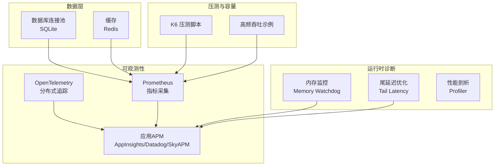
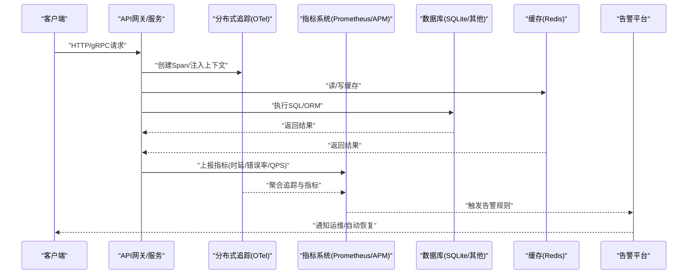
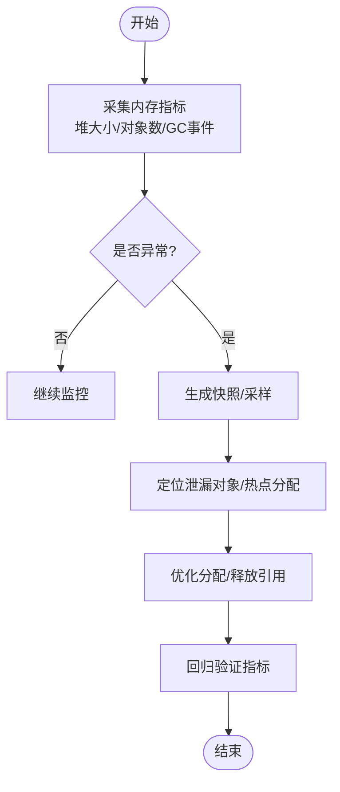
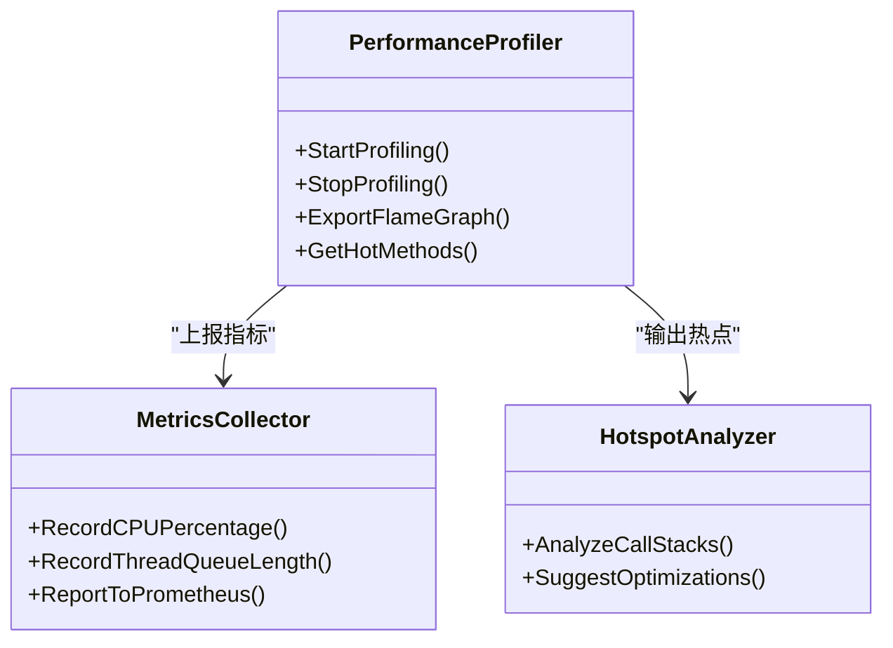
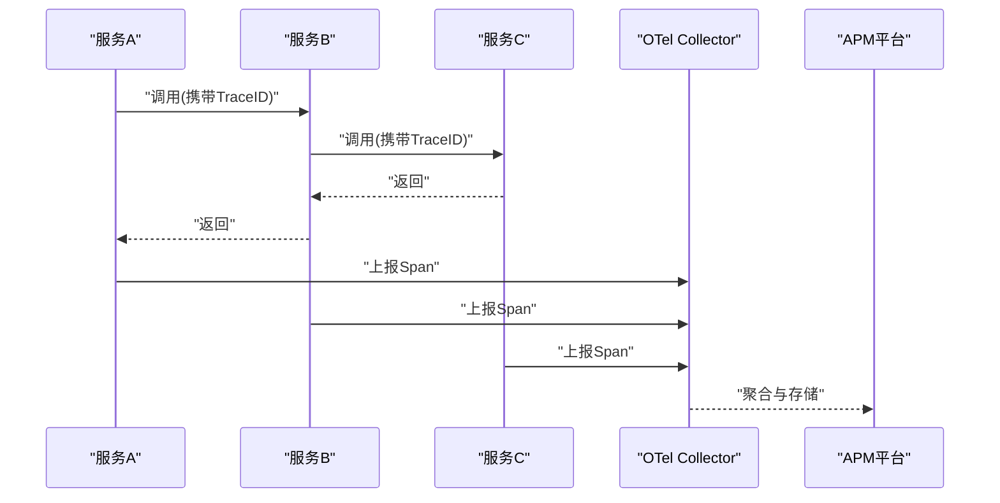
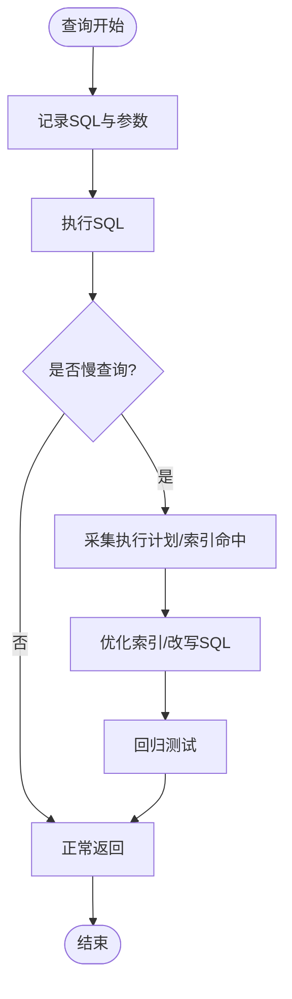
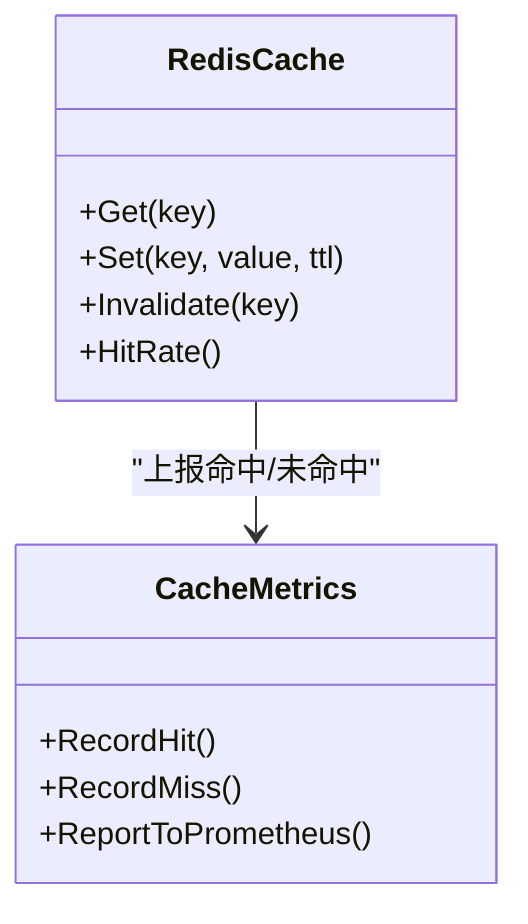
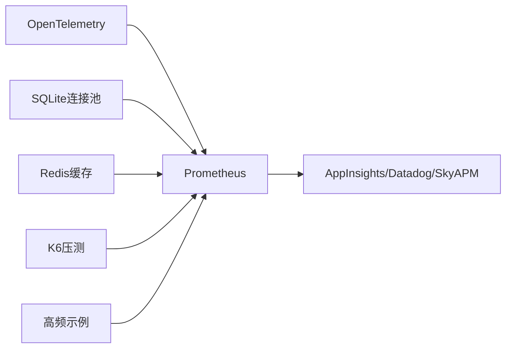

# 故障排查与性能调优

<cite>
**本文档引用的文件**   
- [memory_leak_detection.cs](file://memory_leak_detection.cs)
- [performance_metrics.cs](file://performance_metrics.cs)
- [metrics_monitoring.cs](file://metrics_monitoring.cs)
- [prometheus_integration.cs](file://prometheus_integration.cs)
- [opentelemetry_integration.cs](file://opentelemetry_integration.cs)
- [distributed_tracing.cs](file://distributed_tracing.cs)
- [watchdog_memory.cs](file://watchdog_memory.cs)
- [watchdog_tail_latency.cs](file://watchdog_tail_latency.cs)
- [sqlite_connection_pool.cs](file://sqlite_connection_pool.cs)
- [stackexchange_redis_cache.cs](file://stackexchange_redis_cache.cs)
- [signalr_advanced_monitoring.cs](file://signalr_advanced_monitoring.cs)
- [appinsights_prometheus.cs](file://appinsights_prometheus.cs)
- [datadog_prometheus.cs](file://datadog_prometheus.cs)
- [skyapm_prometheus.cs](file://skyapm_prometheus.cs)
- [httpreports_prometheus.cs](file://httpreports_prometheus.cs)
- [kiota_metrics.cs](file://kiota_metrics.cs)
- [refit_metrics.cs](file://refit_metrics.cs)
- [restsharp_metrics.cs](file://restsharp_metrics.cs)
- [alert_rules.cs](file://alert_rules.cs)
- [watchdog_alert_rules.cs](file://watchdog_alert_rules.cs)
- [performance_profiler_integration.cs](file://performance_profiler_integration.cs)
- [custom_storage_profiler.cs](file://custom_storage_profiler.cs)
- [tail_latency_optimizer.cs](file://tail_latency_optimizer.cs)
- [threadsafe_memorypool_optimized.cs](file://threadsafe_memorypool_optimized.cs)
- [recyclable_memorystream_integration.cs](file://recyclable_memorystream_integration.cs)
- [tiered_memory_integration.cs](file://tiered_memory_integration.cs)
- [high_frequency_100k.cs](file://high_frequency_100k.cs)
- [high_frequency_1m.cs](file://high_frequency_1m.cs)
- [high_frequency_10m.cs](file://high_frequency_10m.cs)
- [k6_todo_benchmark.js](file://k6_todo_benchmark.js)
</cite>

## 目录
1. [简介](#简介)
2. [项目结构](#项目结构)
3. [核心组件](#核心组件)
4. [架构总览](#架构总览)
5. [详细组件分析](#详细组件分析)
6. [依赖关系分析](#依赖关系分析)
7. [性能考量](#性能考量)
8. [故障排查指南](#故障排查指南)
9. [结论](#结论)
10. [附录](#附录)

## 简介
本文件面向微服务在运行期的稳定性与性能问题，提供从内存泄漏检测、CPU使用率分析、GC调优、线程池优化，到分布式链路追踪、慢查询定位、数据库连接池与缓存命中率优化的系统化方法。同时覆盖压力测试、容量规划、弹性伸缩策略，以及监控告警配置、应急预案与故障复盘流程。文档以仓库中的可观测性、性能与诊断相关实现为依据，给出可操作的实践建议与可视化图示。

## 项目结构
该仓库包含大量“集成示例”和“能力片段”，围绕可观测性与性能主题的关键文件分布在根目录的多个 .cs 文件中，涵盖：
- 指标采集与导出（Prometheus、App Insights、Datadog、SkyAPM）
- 分布式追踪（OpenTelemetry、Jaeger/Zipkin 风格）
- 内存与延迟监控（Watchdog、Tail Latency）
- 数据库连接池与缓存（SQLite 连接池、Redis 缓存）
- 性能剖析与基准（Profiler、K6 压测脚本）

[本图为概念性结构示意，不直接映射具体源码文件]

## 核心组件
- 内存泄漏检测与回收监控：通过内存监控与Watchdog机制，持续跟踪对象分配、堆增长与GC行为，辅助定位泄漏点与过度分配。
- CPU与GC调优：结合指标与剖析工具，识别热点路径与频繁GC，调整GC模式、线程池参数与锁粒度。
- 分布式链路追踪：基于OpenTelemetry等标准，跨进程/跨服务串联调用链，定位慢节点与异常分支。
- 慢查询与数据库连接池：通过SQL耗时统计与连接池指标，优化查询与连接复用策略。
- 缓存命中率优化：通过缓存命中/未命中比率、过期与淘汰策略，降低后端压力并提升响应时延。
- 压测与容量规划：使用K6与高频示例进行压测，评估容量与弹性伸缩阈值。
- 监控告警与应急：定义规则与阈值，联动告警平台，形成闭环处置流程。

**章节来源**
- [memory_leak_detection.cs](file://memory_leak_detection.cs)
- [watchdog_memory.cs](file://watchdog_memory.cs)
- [opentelemetry_integration.cs](file://opentelemetry_integration.cs)
- [sqlite_connection_pool.cs](file://sqlite_connection_pool.cs)
- [stackexchange_redis_cache.cs](file://stackexchange_redis_cache.cs)
- [k6_todo_benchmark.js](file://k6_todo_benchmark.js)
- [alert_rules.cs](file://alert_rules.cs)

## 架构总览
下图展示从请求入口到数据层的可观测性数据流，包括指标上报、链路追踪与告警联动。

**图表来源**
- [opentelemetry_integration.cs](file://opentelemetry_integration.cs)
- [prometheus_integration.cs](file://prometheus_integration.cs)
- [appinsights_prometheus.cs](file://appinsights_prometheus.cs)
- [datadog_prometheus.cs](file://datadog_prometheus.cs)
- [skyapm_prometheus.cs](file://skyapm_prometheus.cs)
- [httpreports_prometheus.cs](file://httpreports_prometheus.cs)
- [kiota_metrics.cs](file://kiota_metrics.cs)
- [refit_metrics.cs](file://refit_metrics.cs)
- [restsharp_metrics.cs](file://restsharp_metrics.cs)

**章节来源**
- [opentelemetry_integration.cs](file://opentelemetry_integration.cs)
- [prometheus_integration.cs](file://prometheus_integration.cs)

## 详细组件分析

### 内存泄漏检测与GC调优
- 目标：发现对象长期存活、堆持续增长、频繁Full GC等问题；定位泄漏源并优化分配。
- 关键手段：
  - 持续采集堆大小、对象计数、GC次数与耗时、Gen0/Gen1/Gen2分布。
  - 结合Watchdog内存模块设置阈值告警，自动采样快照或触发降级。
  - 针对热点路径减少临时对象分配，优先使用内存池与零拷贝序列化。
- 优化建议：
  - 调整GC模式（Server/GC服务器模式）、最大托管堆大小、后台GC开关。
  - 避免大对象频繁分配，使用数组池、字符串池、Span/ReadOnlySpan。
  - 对长生命周期集合定期清理，避免隐式引用导致无法回收。

**图表来源**
- [memory_leak_detection.cs](file://memory_leak_detection.cs)
- [watchdog_memory.cs](file://watchdog_memory.cs)
- [threadsafe_memorypool_optimized.cs](file://threadsafe_memorypool_optimized.cs)
- [recyclable_memorystream_integration.cs](file://recyclable_memorystream_integration.cs)
- [tiered_memory_integration.cs](file://tiered_memory_integration.cs)

**章节来源**
- [memory_leak_detection.cs](file://memory_leak_detection.cs)
- [watchdog_memory.cs](file://watchdog_memory.cs)
- [threadsafe_memorypool_optimized.cs](file://threadsafe_memorypool_optimized.cs)
- [recyclable_memorystream_integration.cs](file://recyclable_memorystream_integration.cs)
- [tiered_memory_integration.cs](file://tiered_memory_integration.cs)

### CPU使用率分析与热点定位
- 目标：识别CPU热点、锁竞争、阻塞I/O与频繁GC导致的抖动。
- 关键手段：
  - 使用性能剖析器采集CPU火焰图、方法耗时与调用栈。
  - 结合指标系统观察CPU使用率、上下文切换、线程池队列长度。
  - 对热点方法进行算法优化、并行化或异步化改造。
- 优化建议：
  - 减少同步阻塞调用，改用异步IO与背压控制。
  - 合理设置线程池最小/最大线程数，避免过多上下文切换。
  - 避免热路径上的装箱、反射与正则表达式重复编译。

**图表来源**
- [performance_profiler_integration.cs](file://performance_profiler_integration.cs)
- [custom_storage_profiler.cs](file://custom_storage_profiler.cs)
- [metrics_monitoring.cs](file://metrics_monitoring.cs)

**章节来源**
- [performance_profiler_integration.cs](file://performance_profiler_integration.cs)
- [custom_storage_profiler.cs](file://custom_storage_profiler.cs)
- [metrics_monitoring.cs](file://metrics_monitoring.cs)

### 分布式链路追踪与慢调用定位
- 目标：跨服务追踪请求链路，快速定位慢节点与异常分支。
- 关键手段：
  - 基于OpenTelemetry标准化Span与上下文传播。
  - 将TraceID注入日志与指标，便于关联分析。
  - 结合APM平台（AppInsights/Datadog/SkyAPM）进行可视化与检索。
- 优化建议：
  - 为关键接口添加Span边界，记录输入输出摘要与错误信息。
  - 对下游调用增加超时与重试策略，避免级联失败。
  - 对慢查询与外部依赖进行熔断与降级。

**图表来源**
- [opentelemetry_integration.cs](file://opentelemetry_integration.cs)
- [distributed_tracing.cs](file://distributed_tracing.cs)
- [appinsights_prometheus.cs](file://appinsights_prometheus.cs)
- [datadog_prometheus.cs](file://datadog_prometheus.cs)
- [skyapm_prometheus.cs](file://skyapm_prometheus.cs)

**章节来源**
- [opentelemetry_integration.cs](file://opentelemetry_integration.cs)
- [distributed_tracing.cs](file://distributed_tracing.cs)

### 慢查询分析与数据库连接池调优
- 目标：识别慢查询、连接耗尽与锁等待，优化SQL与连接池配置。
- 关键手段：
  - 采集SQL执行时间、语句频率、连接池活跃/空闲连接数。
  - 对慢查询进行EXPLAIN与索引优化，减少全表扫描。
  - 调整连接池大小、超时与最大重试次数。
- 优化建议：
  - 使用读写分离与分库分表，降低单库压力。
  - 引入批量操作与事务合并，减少往返次数。
  - 对热点键加缓存，降低数据库负载。

**图表来源**
- [sqlite_connection_pool.cs](file://sqlite_connection_pool.cs)

**章节来源**
- [sqlite_connection_pool.cs](file://sqlite_connection_pool.cs)

### 缓存命中率优化
- 目标：提升缓存命中率，降低后端压力与时延抖动。
- 关键手段：
  - 采集缓存命中/未命中、过期、淘汰、扩容事件。
  - 设计合理的TTL与淘汰策略，避免雪崩与穿透。
  - 对热点数据进行预加载与本地缓存。
- 优化建议：
  - 使用多级缓存（本地+分布式），平衡一致性与性能。
  - 对缓存键进行规范化，避免碎片化。
  - 对高并发场景采用分区与分片，减少热点冲突。

**图表来源**
- [stackexchange_redis_cache.cs](file://stackexchange_redis_cache.cs)
- [metrics_monitoring.cs](file://metrics_monitoring.cs)

**章节来源**
- [stackexchange_redis_cache.cs](file://stackexchange_redis_cache.cs)

### 信号与实时通信监控
- 目标：保障WebSocket/SignalR连接的稳定性与低时延。
- 关键手段：
  - 监控连接数、消息吞吐、重连率与错误码分布。
  - 对服务端资源占用与队列长度进行告警。
- 优化建议：
  - 合理设置心跳与超时，及时清理僵尸连接。
  - 对广播消息进行批处理与限流。

**章节来源**
- [signalr_advanced_monitoring.cs](file://signalr_advanced_monitoring.cs)

### 尾延迟优化
- 目标：降低P95/P99延迟，提升用户体验。
- 关键手段：
  - 采集请求时延分布，识别长尾原因（锁、GC、外部依赖）。
  - 对慢路径进行异步化、并行化与降级。
- 优化建议：
  - 使用超时与熔断保护，避免级联放大。
  - 对热点接口进行缓存与幂等设计。

**章节来源**
- [watchdog_tail_latency.cs](file://watchdog_tail_latency.cs)
- [tail_latency_optimizer.cs](file://tail_latency_optimizer.cs)

## 依赖关系分析
- 指标与APM：Prometheus作为统一指标出口，对接AppInsights、Datadog、SkyAPM等平台，形成多视图监控。
- 追踪与指标：OpenTelemetry负责Span采集，指标由Prometheus收集，APM平台进行聚合与可视化。
- 数据层与缓存：SQLite连接池与Redis缓存共同支撑数据访问，指标反映连接与命中率。
- 压测与容量：K6脚本与高频示例用于容量评估与弹性策略验证。

**图表来源**
- [prometheus_integration.cs](file://prometheus_integration.cs)
- [appinsights_prometheus.cs](file://appinsights_prometheus.cs)
- [datadog_prometheus.cs](file://datadog_prometheus.cs)
- [skyapm_prometheus.cs](file://skyapm_prometheus.cs)
- [httpreports_prometheus.cs](file://httpreports_prometheus.cs)
- [kiota_metrics.cs](file://kiota_metrics.cs)
- [refit_metrics.cs](file://refit_metrics.cs)
- [restsharp_metrics.cs](file://restsharp_metrics.cs)
- [sqlite_connection_pool.cs](file://sqlite_connection_pool.cs)
- [stackexchange_redis_cache.cs](file://stackexchange_redis_cache.cs)
- [k6_todo_benchmark.js](file://k6_todo_benchmark.js)

**章节来源**
- [prometheus_integration.cs](file://prometheus_integration.cs)
- [k6_todo_benchmark.js](file://k6_todo_benchmark.js)

## 性能考量
- GC与内存：
  - 关注Gen0/Gen1/Gen2比例与停顿时间，避免大对象频繁分配。
  - 使用内存池与零拷贝序列化减少分配与拷贝。
- CPU与线程：
  - 合理设置线程池最小/最大线程数，避免饥饿与抖动。
  - 对CPU密集型任务使用专用线程池或隔离进程。
- I/O与网络：
  - 使用异步IO与连接复用，减少阻塞与握手开销。
  - 对慢依赖进行超时、重试与熔断。
- 缓存与数据库：
  - 提高缓存命中率，降低数据库压力。
  - 优化SQL与索引，避免全表扫描与锁竞争。

[本节为通用指导，不直接分析具体文件]

## 故障排查指南
- 常见故障模式：
  - 内存泄漏：堆持续增长、Full GC频繁、OOM。
  - CPU飙升：热点方法、锁竞争、死循环。
  - 连接耗尽：数据库连接池满、Redis连接不足。
  - 慢查询：无索引、复杂JOIN、锁等待。
  - 缓存雪崩：TTL集中过期、热点键失效。
  - 尾延迟：GC停顿、外部依赖慢、锁争用。
- 日志分析方法：
  - 统一TraceID贯穿日志，便于关联分析。
  - 结构化日志记录关键上下文与错误堆栈。
  - 对敏感信息进行脱敏，避免泄露。
- 性能瓶颈定位技巧：
  - 使用火焰图与方法耗时排序定位热点。
  - 对比基线与变更版本，缩小范围。
  - 逐步隔离依赖，确认瓶颈位置。
- 压力测试与容量规划：
  - 使用K6模拟真实流量，评估QPS、时延与错误率。
  - 根据压测结果设定扩缩容阈值与弹性策略。
- 监控告警配置：
  - 定义关键指标阈值（CPU、内存、错误率、时延、连接池）。
  - 联动告警平台，形成分级告警与自动恢复。
- 应急预案与复盘：
  - 制定回滚、降级、熔断与隔离预案。
  - 故障后复盘，完善监控与演练。

**章节来源**
- [alert_rules.cs](file://alert_rules.cs)
- [watchdog_alert_rules.cs](file://watchdog_alert_rules.cs)
- [metrics_monitoring.cs](file://metrics_monitoring.cs)
- [k6_todo_benchmark.js](file://k6_todo_benchmark.js)

## 结论
通过体系化的可观测性与性能调优实践，可以在微服务环境中快速定位与解决内存、CPU、GC、线程、数据库与缓存等关键问题。结合分布式追踪、指标与告警，形成从发现问题到解决问题的闭环。持续进行压测与容量规划，确保系统在高峰期的稳定与弹性。

[本节为总结性内容，不直接分析具体文件]

## 附录
- 常用指标与阈值建议：
  - CPU使用率：>80%告警，>90%紧急。
  - 内存使用率：>85%告警，>95%紧急。
  - 错误率：>1%告警，>5%紧急。
  - P95/P99时延：按业务SLA设定阈值。
  - 连接池：活跃连接>80%告警，>95%紧急。
  - 缓存命中率：<90%告警，<80%紧急。
- 压测脚本与用例：
  - 使用K6编写场景，覆盖登录、查询、写入与并发。
  - 逐步增加并发，观察指标变化与瓶颈。
- 弹性伸缩策略：
  - 基于CPU/内存/请求量阈值自动扩缩容。
  - 预热与冷启动优化，避免抖动。

[本节为补充信息，不直接分析具体文件]