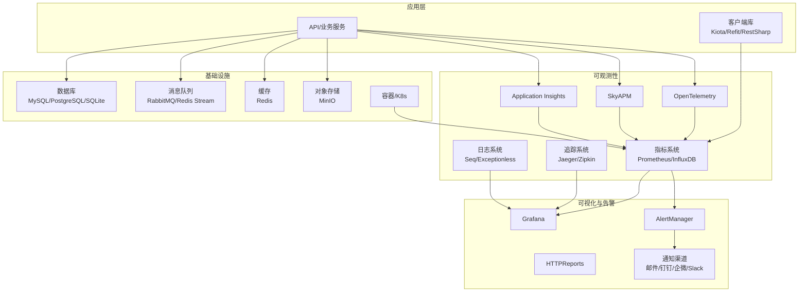
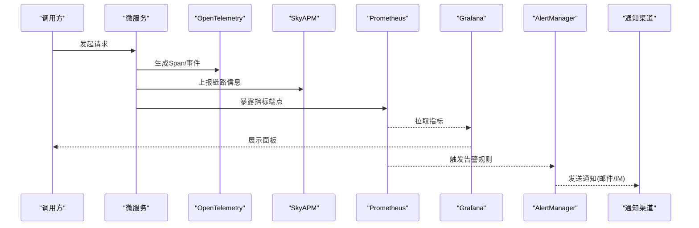
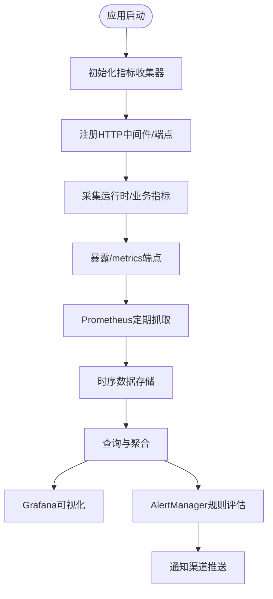
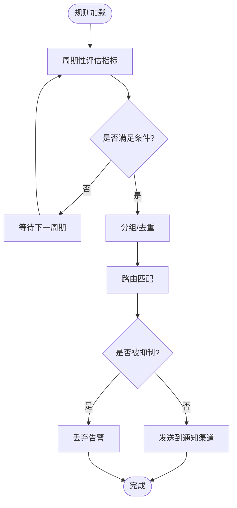
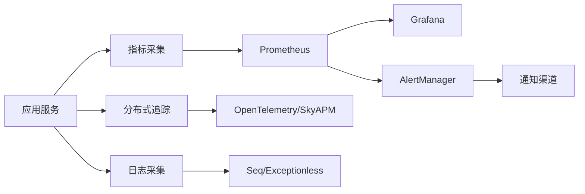

# 监控与告警

<cite>
**本文引用的文件**   
- [prometheus_integration.cs](file://prometheus_integration.cs)
- [prometheus_metrics.cs](file://prometheus_metrics.cs)
- [grafana_integration.cs](file://grafana_integration.cs)
- [opentelemetry_prometheus.cs](file://opentelemetry_prometheus.cs)
- [skyapm_prometheus.cs](file://skyapm_prometheus.cs)
- [datadog_prometheus.cs](file://datadog_prometheus.cs)
- [httpreports_prometheus.cs](file://httpreports_prometheus.cs)
- [metrics_monitoring.cs](file://metrics_monitoring.cs)
- [metrics_enhanced.cs](file://metrics_enhanced.cs)
- [metrics_influxdb.cs](file://metrics_influxdb.cs)
- [distributed_tracing.cs](file://distributed_tracing.cs)
- [distributed_tracing_enhanced.cs](file://distributed_tracing_enhanced.cs)
- [distributed_tracing_profiler.cs](file://distributed_tracing_profiler.cs)
- [opentelemetry_integration.cs](file://opentelemetry_integration.cs)
- [opentelemetry_production.cs](file://opentelemetry_production.cs)
- [opentelemetry_logging.cs](file://opentelemetry_logging.cs)
- [appinsights_prometheus.cs](file://appinsights_prometheus.cs)
- [alert_rules.cs](file://alert_rules.cs)
- [watchdog_alert_rules.cs](file://watchdog_alert_rules.cs)
- [opentelemetry_alerting.cs](file://opentelemetry_alerting.cs)
- [skyapm_alerting.cs](file://skyapm_alerting.cs)
- [datadog_alerting.cs](file://datadog_alerting.cs)
- [httpreports_alerts.cs](file://httpreports_alerts.cs)
- [signalr_advanced_monitoring.cs](file://signalr_advanced_monitoring.cs)
- [kiota_metrics.cs](file://kiota_metrics.cs)
- [refit_metrics.cs](file://refit_metrics.cs)
- [restsharp_metrics.cs](file://restsharp_metrics.cs)
- [performance_metrics.cs](file://performance_metrics.cs)
- [log_storage_processor.cs](file://log_storage_processor.cs)
- [seq_integration.cs](file://seq_integration.cs)
- [exceptionless_integration.cs](file://exceptionless_integration.cs)
- [serilog_integration.cs](file://serilog_integration.cs)
- [influxdb_integration.cs](file://influxdb_integration.cs)
- [rabbitmq_production_integration.cs](file://rabbitmq_production_integration.cs)
- [redis_eventbus_integration.cs](file://redis_eventbus_integration.cs)
- [redis_stream_integration.cs](file://redis_stream_integration.cs)
- [clickhouse_integration.cs](file://clickhouse_integration.cs)
- [minio_vsa.cs](file://minio_vsa.cs)
</cite>

## 目录
1. [简介](#简介)
2. [项目结构](#项目结构)
3. [核心组件](#核心组件)
4. [架构总览](#架构总览)
5. [详细组件分析](#详细组件分析)
6. [依赖关系分析](#依赖关系分析)
7. [性能考量](#性能考量)
8. [故障排查指南](#故障排查指南)
9. [结论](#结论)
10. [附录](#附录)

## 简介
本文件面向微服务监控与告警体系，围绕 Prometheus 指标采集、Grafana 可视化面板配置、AlertManager 告警规则设置展开，同时覆盖应用性能监控（APM）、分布式追踪、日志聚合分析。文档提供关键指标定义、阈值建议、告警通知渠道集成方案，并给出容器、数据库、消息队列等基础设施监控实践。此外，包含告警降噪、故障自愈与应急响应流程，帮助团队建立稳定、可观测、可恢复的运维体系。

## 项目结构
仓库中包含大量与监控、追踪、日志和告警相关的示例与集成代码，按主题可分为：
- 指标采集与导出：Prometheus、OpenTelemetry、SkyAPM、App Insights、InfluxDB、Kiota/Refit/RestSharp 客户端指标等
- 可视化与报表：Grafana、HTTPReports
- 分布式追踪：OpenTelemetry、SkyAPM、自定义追踪扩展
- 日志聚合：Seq、Exceptionless、Serilog
- 告警与规则：AlertManager 规则、Watchdog 告警、OpenTelemetry/SkyAPM/App Insights/Datadog 告警集成
- 基础设施监控：RabbitMQ、Redis、ClickHouse、MinIO、容器/Kubernetes 相关

图表来源
- [prometheus_integration.cs:1-200](file://prometheus_integration.cs#L1-L200)
- [opentelemetry_prometheus.cs:1-200](file://opentelemetry_prometheus.cs#L1-L200)
- [skyapm_prometheus.cs:1-200](file://skyapm_prometheus.cs#L1-L200)
- [grafana_integration.cs:1-200](file://grafana_integration.cs#L1-L200)
- [alert_rules.cs:1-200](file://alert_rules.cs#L1-L200)

章节来源
- [prometheus_integration.cs:1-200](file://prometheus_integration.cs#L1-L200)
- [grafana_integration.cs:1-200](file://grafana_integration.cs#L1-L200)
- [opentelemetry_prometheus.cs:1-200](file://opentelemetry_prometheus.cs#L1-L200)
- [skyapm_prometheus.cs:1-200](file://skyapm_prometheus.cs#L1-L200)
- [alert_rules.cs:1-200](file://alert_rules.cs#L1-L200)

## 核心组件
- 指标采集与导出
  - Prometheus 直接集成与中间件导出
  - OpenTelemetry 指标管道与 Prometheus 导出器
  - SkyAPM/App Insights 指标桥接至 Prometheus
  - 客户端库（Kiota/Refit/RestSharp）请求级指标
- 可视化面板
  - Grafana 数据源对接 Prometheus/OpenTelemetry/日志
  - HTTPReports 内置报表与指标展示
- 分布式追踪
  - OpenTelemetry SDK/SDK 扩展
  - SkyAPM 全链路追踪
  - 自定义追踪扩展与 Profiler
- 日志聚合与分析
  - Serilog + Seq/Exceptionless
  - 结构化日志与上下文关联
- 告警与规则
  - AlertManager 规则与抑制/静默
  - Watchdog 告警规则引擎
  - APM/日志平台告警通道集成

章节来源
- [prometheus_metrics.cs:1-200](file://prometheus_metrics.cs#L1-L200)
- [metrics_monitoring.cs:1-200](file://metrics_monitoring.cs#L1-L200)
- [metrics_enhanced.cs:1-200](file://metrics_enhanced.cs#L1-L200)
- [opentelemetry_prometheus.cs:1-200](file://opentelemetry_prometheus.cs#L1-L200)
- [skyapm_prometheus.cs:1-200](file://skyapm_prometheus.cs#L1-L200)
- [grafana_integration.cs:1-200](file://grafana_integration.cs#L1-L200)
- [httpreports_prometheus.cs:1-200](file://httpreports_prometheus.cs#L1-L200)
- [distributed_tracing.cs:1-200](file://distributed_tracing.cs#L1-L200)
- [distributed_tracing_enhanced.cs:1-200](file://distributed_tracing_enhanced.cs#L1-L200)
- [distributed_tracing_profiler.cs:1-200](file://distributed_tracing_profiler.cs#L1-L200)
- [opentelemetry_integration.cs:1-200](file://opentelemetry_integration.cs#L1-L200)
- [opentelemetry_production.cs:1-200](file://opentelemetry_production.cs#L1-L200)
- [opentelemetry_logging.cs:1-200](file://opentelemetry_logging.cs#L1-L200)
- [alert_rules.cs:1-200](file://alert_rules.cs#L1-L200)
- [watchdog_alert_rules.cs:1-200](file://watchdog_alert_rules.cs#L1-L200)
- [opentelemetry_alerting.cs:1-200](file://opentelemetry_alerting.cs#L1-L200)
- [skyapm_alerting.cs:1-200](file://skyapm_alerting.cs#L1-L200)
- [datadog_alerting.cs:1-200](file://datadog_alerting.cs#L1-L200)
- [httpreports_alerts.cs:1-200](file://httpreports_alerts.cs#L1-L200)
- [kiota_metrics.cs:1-200](file://kiota_metrics.cs#L1-L200)
- [refit_metrics.cs:1-200](file://refit_metrics.cs#L1-L200)
- [restsharp_metrics.cs:1-200](file://restsharp_metrics.cs#L1-L200)
- [performance_metrics.cs:1-200](file://performance_metrics.cs#L1-L200)
- [log_storage_processor.cs:1-200](file://log_storage_processor.cs#L1-L200)
- [seq_integration.cs:1-200](file://seq_integration.cs#L1-L200)
- [exceptionless_integration.cs:1-200](file://exceptionless_integration.cs#L1-L200)
- [serilog_integration.cs:1-200](file://serilog_integration.cs#L1-L200)

## 架构总览
下图展示了从应用到指标、追踪、日志再到可视化与告警的整体数据流，以及基础设施监控的接入点。

图表来源
- [prometheus_integration.cs:1-200](file://prometheus_integration.cs#L1-L200)
- [opentelemetry_prometheus.cs:1-200](file://opentelemetry_prometheus.cs#L1-L200)
- [skyapm_prometheus.cs:1-200](file://skyapm_prometheus.cs#L1-L200)
- [grafana_integration.cs:1-200](file://grafana_integration.cs#L1-L200)
- [alert_rules.cs:1-200](file://alert_rules.cs#L1-L200)

## 详细组件分析

### Prometheus 指标采集与导出
- 目标
  - 在应用中采集运行时、业务与请求级指标，并通过 /metrics 暴露给 Prometheus 抓取
  - 支持直出与通过 OpenTelemetry/SkyAPM 桥接导出
- 关键点
  - 指标类型选择（Counter/Gauge/Histogram/Summary）
  - 标签维度设计（服务名、实例、路由、方法、状态码）
  - 采样与批量导出优化
  - 与中间件/客户端库集成（如 Refit/RestSharp/Kiota）
- 典型实现路径参考
  - [prometheus_integration.cs:1-200](file://prometheus_integration.cs#L1-L200)
  - [prometheus_metrics.cs:1-200](file://prometheus_metrics.cs#L1-L200)
  - [metrics_monitoring.cs:1-200](file://metrics_monitoring.cs#L1-L200)
  - [metrics_enhanced.cs:1-200](file://metrics_enhanced.cs#L1-L200)
  - [httpreports_prometheus.cs:1-200](file://httpreports_prometheus.cs#L1-L200)
  - [opentelemetry_prometheus.cs:1-200](file://opentelemetry_prometheus.cs#L1-L200)
  - [skyapm_prometheus.cs:1-200](file://skyapm_prometheus.cs#L1-L200)
  - [datadog_prometheus.cs:1-200](file://datadog_prometheus.cs#L1-L200)
  - [appinsights_prometheus.cs:1-200](file://appinsights_prometheus.cs#L1-L200)
  - [kiota_metrics.cs:1-200](file://kiota_metrics.cs#L1-L200)
  - [refit_metrics.cs:1-200](file://refit_metrics.cs#L1-L200)
  - [restsharp_metrics.cs:1-200](file://restsharp_metrics.cs#L1-L200)

图表来源
- [prometheus_integration.cs:1-200](file://prometheus_integration.cs#L1-L200)
- [prometheus_metrics.cs:1-200](file://prometheus_metrics.cs#L1-L200)
- [metrics_monitoring.cs:1-200](file://metrics_monitoring.cs#L1-L200)

章节来源
- [prometheus_integration.cs:1-200](file://prometheus_integration.cs#L1-L200)
- [prometheus_metrics.cs:1-200](file://prometheus_metrics.cs#L1-L200)
- [metrics_monitoring.cs:1-200](file://metrics_monitoring.cs#L1-L200)
- [metrics_enhanced.cs:1-200](file://metrics_enhanced.cs#L1-L200)
- [httpreports_prometheus.cs:1-200](file://httpreports_prometheus.cs#L1-L200)
- [opentelemetry_prometheus.cs:1-200](file://opentelemetry_prometheus.cs#L1-L200)
- [skyapm_prometheus.cs:1-200](file://skyapm_prometheus.cs#L1-L200)
- [datadog_prometheus.cs:1-200](file://datadog_prometheus.cs#L1-L200)
- [appinsights_prometheus.cs:1-200](file://appinsights_prometheus.cs#L1-L200)
- [kiota_metrics.cs:1-200](file://kiota_metrics.cs#L1-L200)
- [refit_metrics.cs:1-200](file://refit_metrics.cs#L1-L200)
- [restsharp_metrics.cs:1-200](file://restsharp_metrics.cs#L1-L200)

### Grafana 可视化面板配置
- 目标
  - 将 Prometheus/OpenTelemetry/日志等多数据源统一接入 Grafana
  - 构建业务、系统、基础设施多维面板
- 关键点
  - 数据源配置（Prometheus、OpenTelemetry、Seq/Exceptionless、InfluxDB）
  - 变量与模板（服务、实例、环境、租户）
  - 常用面板（QPS、延迟分布、错误率、资源使用、GC、线程池）
  - 权限与共享策略
- 典型实现路径参考
  - [grafana_integration.cs:1-200](file://grafana_integration.cs#L1-L200)
  - [httpreports_prometheus.cs:1-200](file://httpreports_prometheus.cs#L1-L200)

章节来源
- [grafana_integration.cs:1-200](file://grafana_integration.cs#L1-L200)
- [httpreports_prometheus.cs:1-200](file://httpreports_prometheus.cs#L1-L200)

### AlertManager 告警规则设置
- 目标
  - 基于 Prometheus 规则或平台原生规则进行告警
  - 实现抑制、静默、分组、路由与多通道通知
- 关键点
  - 规则组织（按服务/环境/级别）
  - 阈值与持续时间（避免抖动）
  - 抑制与静默（维护窗口、依赖故障）
  - 路由策略（按标签分发到不同渠道）
- 典型实现路径参考
  - [alert_rules.cs:1-200](file://alert_rules.cs#L1-L200)
  - [watchdog_alert_rules.cs:1-200](file://watchdog_alert_rules.cs#L1-L200)
  - [opentelemetry_alerting.cs:1-200](file://opentelemetry_alerting.cs#L1-L200)
  - [skyapm_alerting.cs:1-200](file://skyapm_alerting.cs#L1-L200)
  - [datadog_alerting.cs:1-200](file://datadog_alerting.cs#L1-L200)
  - [httpreports_alerts.cs:1-200](file://httpreports_alerts.cs#L1-L200)

图表来源
- [alert_rules.cs:1-200](file://alert_rules.cs#L1-L200)
- [watchdog_alert_rules.cs:1-200](file://watchdog_alert_rules.cs#L1-L200)

章节来源
- [alert_rules.cs:1-200](file://alert_rules.cs#L1-L200)
- [watchdog_alert_rules.cs:1-200](file://watchdog_alert_rules.cs#L1-L200)
- [opentelemetry_alerting.cs:1-200](file://opentelemetry_alerting.cs#L1-L200)
- [skyapm_alerting.cs:1-200](file://skyapm_alerting.cs#L1-L200)
- [datadog_alerting.cs:1-200](file://datadog_alerting.cs#L1-L200)
- [httpreports_alerts.cs:1-200](file://httpreports_alerts.cs#L1-L200)

### 应用性能监控（APM）与分布式追踪
- 目标
  - 通过 OpenTelemetry/SkyAPM 采集端到端链路，定位慢调用与异常
  - 与指标、日志关联，形成“三遥”联动
- 关键点
  - 采样策略（头部/尾部采样）
  - Span 语义化（操作名、属性、错误标记）
  - 与 Prometheus/日志系统关联（trace_id/span_id）
- 典型实现路径参考
  - [distributed_tracing.cs:1-200](file://distributed_tracing.cs#L1-L200)
  - [distributed_tracing_enhanced.cs:1-200](file://distributed_tracing_enhanced.cs#L1-L200)
  - [distributed_tracing_profiler.cs:1-200](file://distributed_tracing_profiler.cs#L1-L200)
  - [opentelemetry_integration.cs:1-200](file://opentelemetry_integration.cs#L1-L200)
  - [opentelemetry_production.cs:1-200](file://opentelemetry_production.cs#L1-L200)
  - [opentelemetry_logging.cs:1-200](file://opentelemetry_logging.cs#L1-L200)
  - [skyapm_prometheus.cs:1-200](file://skyapm_prometheus.cs#L1-L200)

章节来源
- [distributed_tracing.cs:1-200](file://distributed_tracing.cs#L1-L200)
- [distributed_tracing_enhanced.cs:1-200](file://distributed_tracing_enhanced.cs#L1-L200)
- [distributed_tracing_profiler.cs:1-200](file://distributed_tracing_profiler.cs#L1-L200)
- [opentelemetry_integration.cs:1-200](file://opentelemetry_integration.cs#L1-L200)
- [opentelemetry_production.cs:1-200](file://opentelemetry_production.cs#L1-L200)
- [opentelemetry_logging.cs:1-200](file://opentelemetry_logging.cs#L1-L200)
- [skyapm_prometheus.cs:1-200](file://skyapm_prometheus.cs#L1-L200)

### 日志聚合分析
- 目标
  - 集中式结构化日志采集、检索与关联分析
  - 与追踪 ID 关联，快速定位问题根因
- 关键点
  - 日志级别与字段规范
  - 异步写入与背压控制
  - 索引与保留策略
- 典型实现路径参考
  - [log_storage_processor.cs:1-200](file://log_storage_processor.cs#L1-L200)
  - [seq_integration.cs:1-200](file://seq_integration.cs#L1-L200)
  - [exceptionless_integration.cs:1-200](file://exceptionless_integration.cs#L1-L200)
  - [serilog_integration.cs:1-200](file://serilog_integration.cs#L1-L200)

章节来源
- [log_storage_processor.cs:1-200](file://log_storage_processor.cs#L1-L200)
- [seq_integration.cs:1-200](file://seq_integration.cs#L1-L200)
- [exceptionless_integration.cs:1-200](file://exceptionless_integration.cs#L1-L200)
- [serilog_integration.cs:1-200](file://serilog_integration.cs#L1-L200)

### 基础设施监控（容器、数据库、消息队列）
- 容器/Kubernetes
  - cAdvisor/Kubelet 指标接入 Prometheus
  - Pod/Node 健康与资源水位监控
- 数据库
  - 连接池、慢查询、锁等待、复制延迟
  - ClickHouse/MySQL/PostgreSQL 指标采集
- 消息队列
  - RabbitMQ/Redis Stream 队列堆积、消费速率、失败重试
- 对象存储
  - MinIO 容量、吞吐、错误率
- 典型实现路径参考
  - [influxdb_integration.cs:1-200](file://influxdb_integration.cs#L1-L200)
  - [rabbitmq_production_integration.cs:1-200](file://rabbitmq_production_integration.cs#L1-L200)
  - [redis_eventbus_integration.cs:1-200](file://redis_eventbus_integration.cs#L1-L200)
  - [redis_stream_integration.cs:1-200](file://redis_stream_integration.cs#L1-L200)
  - [clickhouse_integration.cs:1-200](file://clickhouse_integration.cs#L1-L200)
  - [minio_vsa.cs:1-200](file://minio_vsa.cs#L1-L200)

章节来源
- [influxdb_integration.cs:1-200](file://influxdb_integration.cs#L1-L200)
- [rabbitmq_production_integration.cs:1-200](file://rabbitmq_production_integration.cs#L1-L200)
- [redis_eventbus_integration.cs:1-200](file://redis_eventbus_integration.cs#L1-L200)
- [redis_stream_integration.cs:1-200](file://redis_stream_integration.cs#L1-L200)
- [clickhouse_integration.cs:1-200](file://clickhouse_integration.cs#L1-L200)
- [minio_vsa.cs:1-200](file://minio_vsa.cs#L1-L200)

### 实时通信与服务网格监控
- SignalR 监控
  - 连接数、消息吞吐、延迟、错误率
- 服务网格/网关
  - 入站/出站流量、熔断、重试、超时
- 典型实现路径参考
  - [signalr_advanced_monitoring.cs:1-200](file://signalr_advanced_monitoring.cs#L1-L200)

章节来源
- [signalr_advanced_monitoring.cs:1-200](file://signalr_advanced_monitoring.cs#L1-L200)

## 依赖关系分析
- 组件耦合与内聚
  - 指标采集模块与 HTTP 中间件低耦合，便于替换导出器
  - 追踪与日志通过 trace_id/span_id 解耦关联
  - 告警规则与通知渠道通过路由表解耦
- 外部依赖
  - Prometheus/AlertManager、Grafana、OpenTelemetry Collector、SkyAPM、Seq/Exceptionless、RabbitMQ/Redis/ClickHouse/MinIO
- 潜在循环依赖
  - 确保指标/追踪/日志不反向依赖告警或可视化组件

图表来源
- [prometheus_integration.cs:1-200](file://prometheus_integration.cs#L1-L200)
- [opentelemetry_prometheus.cs:1-200](file://opentelemetry_prometheus.cs#L1-L200)
- [skyapm_prometheus.cs:1-200](file://skyapm_prometheus.cs#L1-L200)
- [grafana_integration.cs:1-200](file://grafana_integration.cs#L1-L200)
- [alert_rules.cs:1-200](file://alert_rules.cs#L1-L200)

## 性能考量
- 指标采集
  - 使用 Histogram/Summary 时注意分桶与采样；避免高基数标签
  - 批量导出与缓冲，降低 GC 压力
- 追踪
  - 合理采样比例；减少 Span 数量与属性大小
  - 异步上报，避免阻塞主流程
- 日志
  - 异步写入与限流；按需采样；避免敏感信息泄露
- 告警
  - 规则评估频率与窗口长度平衡；抑制与静默减少风暴
- 可视化
  - 面板查询优化（预聚合、降采样、缓存）

[本节为通用指导，无需特定文件引用]

## 故障排查指南
- 常见问题
  - 指标缺失：检查 /metrics 端点、抓取间隔、标签维度
  - 追踪断链：确认传播头、采样策略、跨进程/跨语言边界
  - 日志丢失：检查写入通道、磁盘空间、索引限制
  - 告警风暴：启用抑制/静默、合并规则、调整阈值
- 诊断步骤
  - 从 Grafana 面板定位异常时间窗
  - 通过 TraceID 串联日志与链路
  - 查看 AlertManager 路由与抑制历史
  - 检查基础设施资源水位（CPU/内存/IO/网络）
- 参考实现
  - [performance_metrics.cs:1-200](file://performance_metrics.cs#L1-L200)
  - [log_storage_processor.cs:1-200](file://log_storage_processor.cs#L1-L200)
  - [alert_rules.cs:1-200](file://alert_rules.cs#L1-L200)

章节来源
- [performance_metrics.cs:1-200](file://performance_metrics.cs#L1-L200)
- [log_storage_processor.cs:1-200](file://log_storage_processor.cs#L1-L200)
- [alert_rules.cs:1-200](file://alert_rules.cs#L1-L200)

## 结论
通过统一的指标、追踪、日志与告警体系，结合可视化与自动化响应，可实现对微服务的全面可观测性与稳定性保障。建议在工程实践中坚持“指标先行、追踪贯穿、日志关联、告警闭环”的原则，持续优化阈值与规则，完善自愈与应急流程，提升整体系统的可靠性与可维护性。

[本节为总结性内容，无需特定文件引用]

## 附录
- 关键指标定义建议
  - 业务：请求量、成功率、P95/P99 延迟、错误码分布、用户行为转化
  - 系统：CPU/内存/磁盘/网络、GC 次数与耗时、线程池/连接池使用率
  - 基础设施：数据库慢查询、锁等待、复制延迟；消息队列堆积、消费速率、重试失败；对象存储容量与吞吐
- 阈值与告警策略
  - 基于历史基线与 SLO 设定阈值；采用多窗口与趋势检测
  - 分级告警（提示/警告/严重），配合抑制与静默
- 通知渠道集成
  - 邮件、企业微信、钉钉、Slack、Webhook；按路由与优先级分发
- 故障自愈与应急响应
  - 自动扩缩容、熔断降级、重试与退避、断路器恢复
  - 应急预案演练与复盘机制

[本节为通用指导，无需特定文件引用]