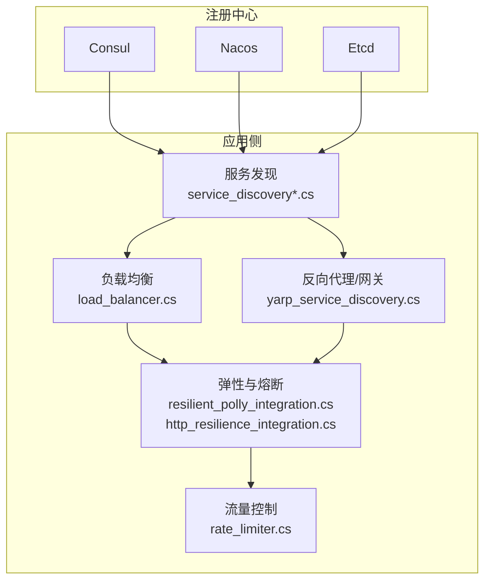
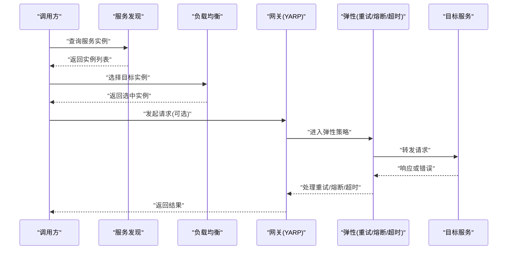
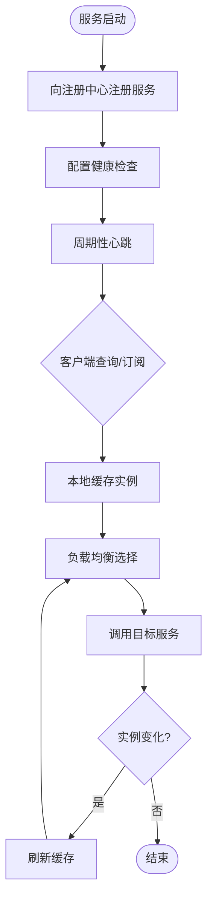
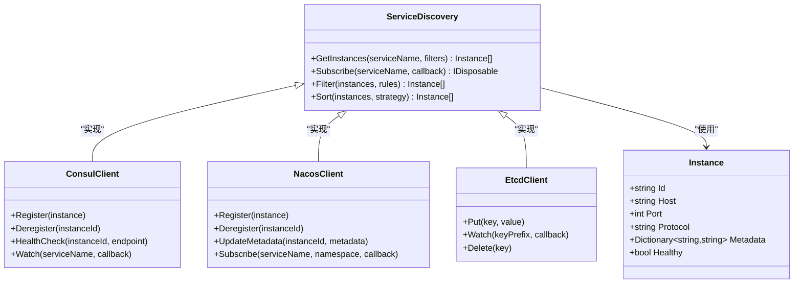
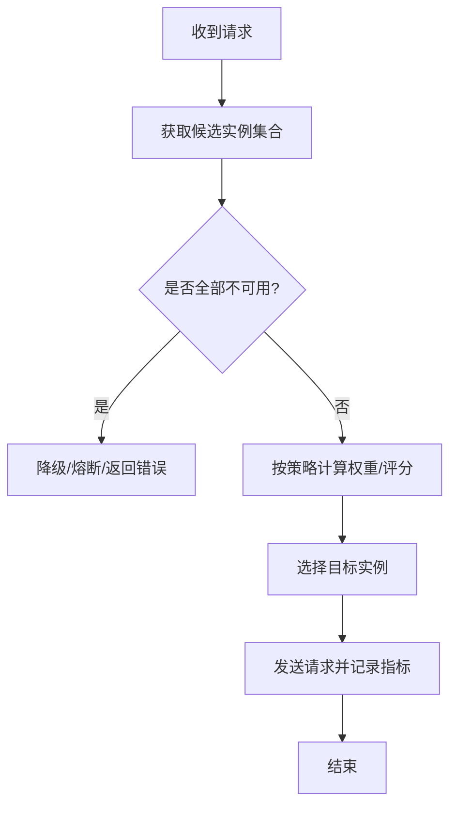
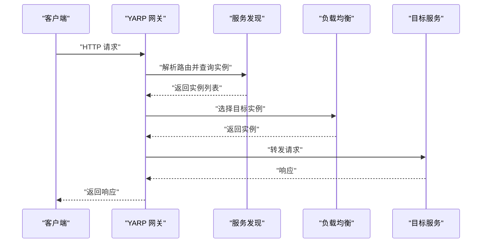
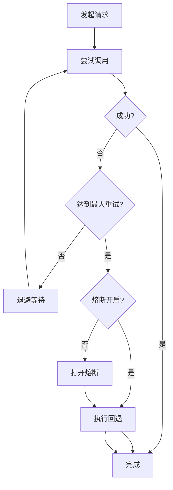
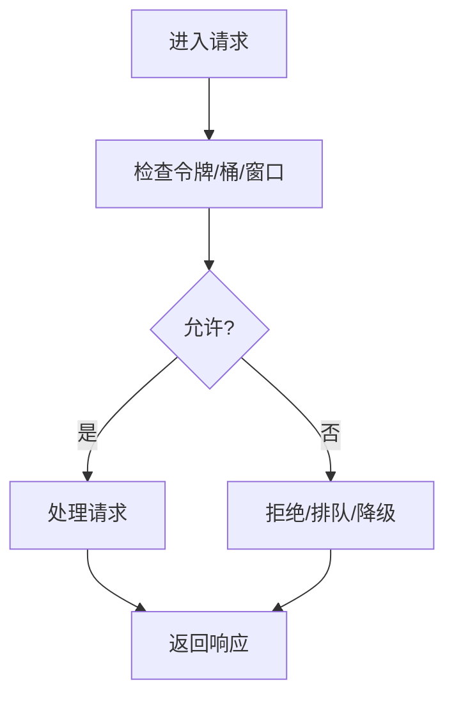
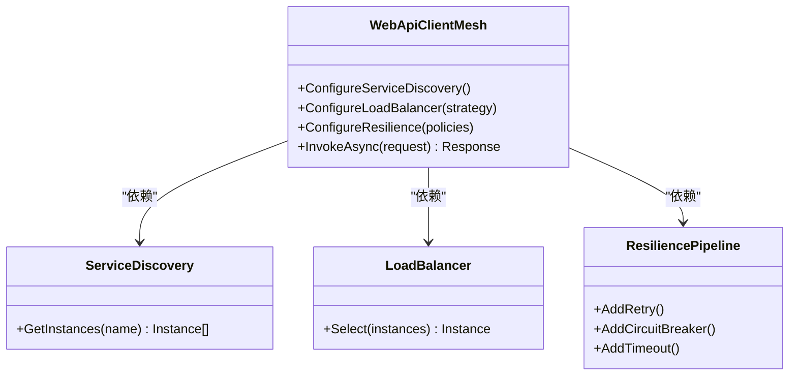
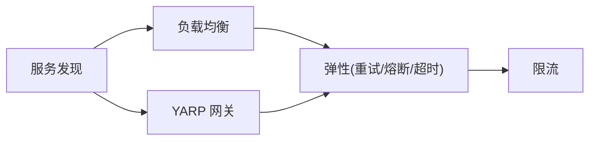

# 服务发现与负载均衡

<cite>
**本文引用的文件**   
- [consul_integration.cs](file://consul_integration.cs)
- [nacos_integration.cs](file://nacos_integration.cs)
- [etcd_integration.cs](file://etcd_integration.cs)
- [service_discovery_integration.cs](file://service_discovery_integration.cs)
- [service_discovery_advanced_integration.cs](file://service_discovery_advanced_integration.cs)
- [load_balancer.cs](file://load_balancer.cs)
- [rate_limiter.cs](file://rate_limiter.cs)
- [yarp_service_discovery.cs](file://yarp_service_discovery.cs)
- [webapiclientcore_mesh_enhanced.cs](file://webapiclientcore_mesh_enhanced.cs)
- [resilient_polly_integration.cs](file://resilient_polly_integration.cs)
- [http_resilience_integration.cs](file://http_resilience_integration.cs)
</cite>

## 目录
1. [简介](#简介)
2. [项目结构](#项目结构)
3. [核心组件](#核心组件)
4. [架构总览](#架构总览)
5. [详细组件分析](#详细组件分析)
6. [依赖关系分析](#依赖关系分析)
7. [性能考量](#性能考量)
8. [故障排查指南](#故障排查指南)
9. [结论](#结论)
10. [附录](#附录)

## 简介
本文件围绕“服务发现与负载均衡”主题，系统化梳理仓库中与注册中心集成、服务发现、负载均衡、健康检查、熔断降级、流量控制与动态路由相关的实现与示例。内容覆盖 Consul、Nacos、Etcd 等主流注册中心的集成方式，以及基于 YARP、自定义负载均衡器、Polly/ResiliencePipeline 的弹性与治理实践，帮助读者快速理解并落地高可用、可伸缩的微服务通信方案。

## 项目结构
与“服务发现与负载均衡”直接相关的代码主要分布在根目录下的若干示例文件中，按职责可分为：
- 注册中心集成：Consul、Nacos、Etcd
- 服务发现抽象与高级用法
- 负载均衡策略与选择
- 网关与服务网格（YARP）
- 弹性与熔断（Polly、HTTP Resilience）
- 流量控制（限流）

图表来源
- [consul_integration.cs](file://consul_integration.cs)
- [nacos_integration.cs](file://nacos_integration.cs)
- [etcd_integration.cs](file://etcd_integration.cs)
- [service_discovery_integration.cs](file://service_discovery_integration.cs)
- [service_discovery_advanced_integration.cs](file://service_discovery_advanced_integration.cs)
- [load_balancer.cs](file://load_balancer.cs)
- [yarp_service_discovery.cs](file://yarp_service_discovery.cs)
- [resilient_polly_integration.cs](file://resilient_polly_integration.cs)
- [http_resilience_integration.cs](file://http_resilience_integration.cs)
- [rate_limiter.cs](file://rate_limiter.cs)

章节来源
- [consul_integration.cs](file://consul_integration.cs)
- [nacos_integration.cs](file://nacos_integration.cs)
- [etcd_integration.cs](file://etcd_integration.cs)
- [service_discovery_integration.cs](file://service_discovery_integration.cs)
- [service_discovery_advanced_integration.cs](file://service_discovery_advanced_integration.cs)
- [load_balancer.cs](file://load_balancer.cs)
- [yarp_service_discovery.cs](file://yarp_service_discovery.cs)
- [resilient_polly_integration.cs](file://resilient_polly_integration.cs)
- [http_resilience_integration.cs](file://http_resilience_integration.cs)
- [rate_limiter.cs](file://rate_limiter.cs)

## 核心组件
- 注册中心集成
  - Consul：服务注册、健康检查、KV 配置、服务发现客户端封装
  - Nacos：服务注册、元数据管理、配置中心联动、命名空间隔离
  - Etcd：键值存储驱动的服务发现、分布式锁与事件监听
- 服务发现抽象
  - 统一接口：获取服务实例列表、过滤与排序、订阅变更
  - 高级能力：多注册中心、缓存与本地优先、元数据路由
- 负载均衡
  - 策略：轮询、加权轮询、最少连接、一致性哈希、随机
  - 选择器：结合权重、健康状态、延迟、地域等维度
- 网关与反向代理
  - YARP：基于服务发现的动态路由、请求转发、中间件扩展
- 弹性与熔断
  - Polly：重试、熔断、超时、退避
  - HTTP Resilience：基于 ResiliencePipeline 的声明式弹性策略
- 流量控制
  - 令牌桶/漏桶/滑动窗口限流，保护下游与自身

章节来源
- [service_discovery_integration.cs](file://service_discovery_integration.cs)
- [service_discovery_advanced_integration.cs](file://service_discovery_advanced_integration.cs)
- [load_balancer.cs](file://load_balancer.cs)
- [yarp_service_discovery.cs](file://yarp_service_discovery.cs)
- [resilient_polly_integration.cs](file://resilient_polly_integration.cs)
- [http_resilience_integration.cs](file://http_resilience_integration.cs)
- [rate_limiter.cs](file://rate_limiter.cs)

## 架构总览
下图展示从调用方到服务实例的整体流程：调用方通过服务发现获取实例，经负载均衡选择目标，再经由弹性层（重试/熔断/超时）与限流后访问目标服务；YARP 作为网关聚合路由与治理能力。

图表来源
- [service_discovery_integration.cs](file://service_discovery_integration.cs)
- [load_balancer.cs](file://load_balancer.cs)
- [yarp_service_discovery.cs](file://yarp_service_discovery.cs)
- [resilient_polly_integration.cs](file://resilient_polly_integration.cs)
- [http_resilience_integration.cs](file://http_resilience_integration.cs)

## 详细组件分析

### 注册中心集成（Consul/Nacos/Etcd）
- 功能要点
  - 服务注册：端口、协议、版本、标签、权重、健康端点
  - 健康检查：TCP/HTTP 探针、失败阈值、恢复阈值
  - 服务发现：按名称/标签/版本筛选，支持订阅增量更新
  - 元数据：环境、租户、区域、容量等扩展字段
- 典型流程
  - 启动时向注册中心注册，定期心跳
  - 客户端拉取或订阅实例列表，缓存本地
  - 实例上下线触发回调，刷新本地缓存

图表来源
- [consul_integration.cs](file://consul_integration.cs)
- [nacos_integration.cs](file://nacos_integration.cs)
- [etcd_integration.cs](file://etcd_integration.cs)

章节来源
- [consul_integration.cs](file://consul_integration.cs)
- [nacos_integration.cs](file://nacos_integration.cs)
- [etcd_integration.cs](file://etcd_integration.cs)

### 服务发现抽象与高级用法
- 统一抽象
  - 提供跨注册中心的统一 API：GetInstances、Subscribe、Filter、Sort
  - 支持多注册中心并存与优先级
- 高级特性
  - 元数据路由：按标签/版本/区域进行灰度与分片
  - 本地优先与缓存失效策略
  - 订阅事件：新增、删除、健康状态变更

图表来源
- [service_discovery_integration.cs](file://service_discovery_integration.cs)
- [service_discovery_advanced_integration.cs](file://service_discovery_advanced_integration.cs)

章节来源
- [service_discovery_integration.cs](file://service_discovery_integration.cs)
- [service_discovery_advanced_integration.cs](file://service_discovery_advanced_integration.cs)

### 负载均衡策略与选择
- 策略类型
  - 轮询/加权轮询：适合均匀负载场景
  - 最少连接：适合长连接或差异大的后端
  - 一致性哈希：会话保持、分片路由
  - 随机：简单快速，抖动较小
- 选择维度
  - 健康状态、权重、延迟、地域、版本、标签
- 选择流程
  - 过滤不可用实例 -> 计算权重/评分 -> 选择目标 -> 记录指标

图表来源
- [load_balancer.cs](file://load_balancer.cs)

章节来源
- [load_balancer.cs](file://load_balancer.cs)

### 网关与服务网格（YARP）
- 能力
  - 基于服务发现的动态路由表
  - 请求转发、鉴权、压缩、日志、追踪
  - 与负载均衡、熔断、限流组合
- 典型用法
  - 启动时加载服务实例，构建路由规则
  - 根据路径/域名/头信息路由到不同服务
  - 中间件链中注入弹性与治理逻辑

图表来源
- [yarp_service_discovery.cs](file://yarp_service_discovery.cs)

章节来源
- [yarp_service_discovery.cs](file://yarp_service_discovery.cs)

### 弹性与熔断（Polly / HTTP Resilience）
- 策略
  - 重试：指数退避、抖动、条件重试
  - 熔断：快速失败、半开探测、恢复阈值
  - 超时：请求级/整体超时
  - 回退：默认值、缓存、降级逻辑
- 集成点
  - HttpClient 管道、YARP 中间件、自定义调用封装
- 最佳实践
  - 区分幂等与非幂等重试
  - 设置合理的熔断阈值与冷却时间
  - 结合监控与告警

图表来源
- [resilient_polly_integration.cs](file://resilient_polly_integration.cs)
- [http_resilience_integration.cs](file://http_resilience_integration.cs)

章节来源
- [resilient_polly_integration.cs](file://resilient_polly_integration.cs)
- [http_resilience_integration.cs](file://http_resilience_integration.cs)

### 流量控制（限流）
- 算法
  - 令牌桶：平滑突发
  - 漏桶：匀速处理
  - 滑动窗口：精确统计
- 应用场景
  - 保护下游服务、防止雪崩、配额与计费
- 配置项
  - 速率、窗口大小、拒绝策略、采样率

图表来源
- [rate_limiter.cs](file://rate_limiter.cs)

章节来源
- [rate_limiter.cs](file://rate_limiter.cs)

### 服务网格增强（WebApiClientCore Mesh）
- 能力
  - 在 HTTP 客户端层面集成服务发现、负载均衡、弹性与链路追踪
  - 面向接口的声明式调用，简化微服务间通信
- 适用场景
  - 轻量级服务网格替代、API 网关下游调用、SDK 化封装

图表来源
- [webapiclientcore_mesh_enhanced.cs](file://webapiclientcore_mesh_enhanced.cs)

章节来源
- [webapiclientcore_mesh_enhanced.cs](file://webapiclientcore_mesh_enhanced.cs)

## 依赖关系分析
- 组件耦合
  - 服务发现为负载均衡与网关的基础依赖
  - 弹性与限流位于调用链关键节点，对上游透明
- 外部依赖
  - Consul/Nacos/Etcd 客户端 SDK
  - YARP 反向代理库
  - Polly 与 ResiliencePipeline
- 潜在循环
  - 避免在发现/选择逻辑中引入网络 I/O 阻塞
  - 将订阅回调与选择解耦，使用线程安全缓存

图表来源
- [service_discovery_integration.cs](file://service_discovery_integration.cs)
- [load_balancer.cs](file://load_balancer.cs)
- [yarp_service_discovery.cs](file://yarp_service_discovery.cs)
- [resilient_polly_integration.cs](file://resilient_polly_integration.cs)
- [http_resilience_integration.cs](file://http_resilience_integration.cs)
- [rate_limiter.cs](file://rate_limiter.cs)

章节来源
- [service_discovery_integration.cs](file://service_discovery_integration.cs)
- [load_balancer.cs](file://load_balancer.cs)
- [yarp_service_discovery.cs](file://yarp_service_discovery.cs)
- [resilient_polly_integration.cs](file://resilient_polly_integration.cs)
- [http_resilience_integration.cs](file://http_resilience_integration.cs)
- [rate_limiter.cs](file://rate_limiter.cs)

## 性能考量
- 服务发现
  - 本地缓存与批量订阅，减少频繁查询
  - 合理设置 TTL、心跳间隔与健康检查频率
- 负载均衡
  - 选择算法 O(1)/O(log n) 复杂度优先
  - 避免热点实例，结合延迟与连接数反馈
- 弹性与限流
  - 重试需幂等且带退避，避免放大风暴
  - 熔断阈值与冷却时间按业务 QPS/延迟调优
  - 限流粒度按接口/租户/地域细分
- 网关
  - 路由表热更新，避免重启
  - 连接池与缓冲参数优化

[本节为通用指导，不直接分析具体文件]

## 故障排查指南
- 常见问题
  - 服务未注册或注册失败：检查注册中心连通性、端口、协议、健康端点
  - 实例不健康：查看健康检查日志、探针返回码、资源占用
  - 负载均衡不均：检查权重、连接数、延迟采集准确性
  - 熔断频繁：评估重试次数、超时阈值、下游稳定性
  - 限流过严：调整速率、窗口大小、拒绝策略
- 定位手段
  - 启用分布式追踪与指标上报
  - 打印服务发现变更事件与选择决策
  - 导出 Prometheus/Grafana 面板观察趋势

章节来源
- [resilient_polly_integration.cs](file://resilient_polly_integration.cs)
- [http_resilience_integration.cs](file://http_resilience_integration.cs)
- [rate_limiter.cs](file://rate_limiter.cs)

## 结论
通过统一的“服务发现 + 负载均衡 + 弹性治理 + 流量控制”体系，可在多注册中心环境下实现稳定、高效、可观测的微服务通信。建议在生产环境中结合监控告警与压测持续调优，确保在高并发与异常场景下仍具备强韧性与可扩展性。

[本节为总结，不直接分析具体文件]

## 附录
- 配置清单（示例项）
  - 注册中心：地址、命名空间、认证、心跳间隔、健康检查端点
  - 服务发现：缓存过期、订阅模式、多注册中心优先级
  - 负载均衡：策略、权重、健康过滤、延迟/连接数权重
  - 弹性：重试次数、退避策略、熔断阈值、超时时间
  - 限流：算法、速率、窗口、拒绝策略
- 最佳实践
  - 元数据驱动路由与灰度发布
  - 全链路追踪与指标埋点
  - 演练故障与混沌工程验证韧性

[本节为补充说明，不直接分析具体文件]