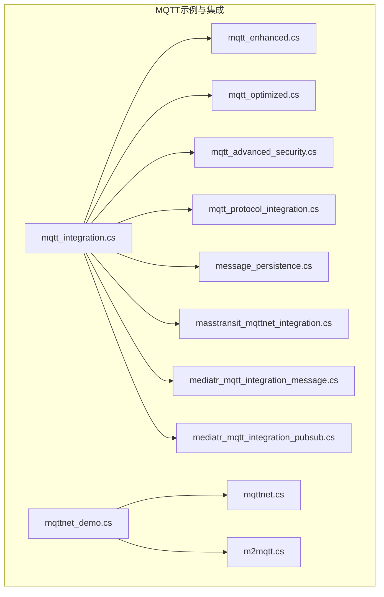
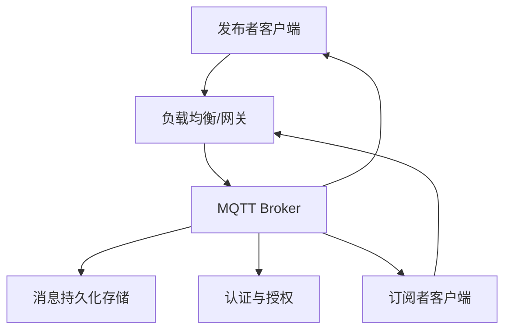
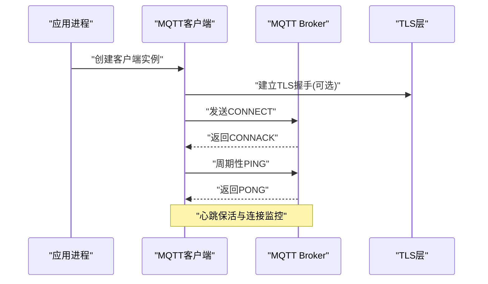
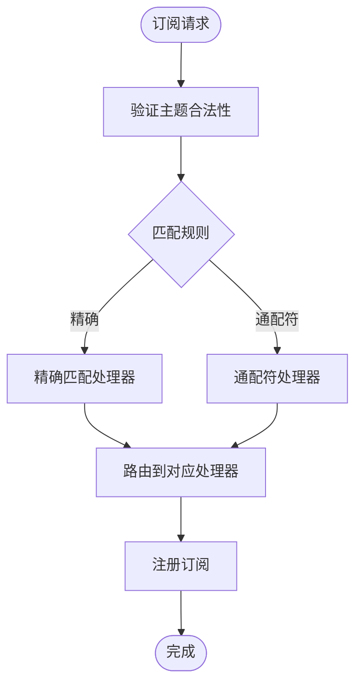
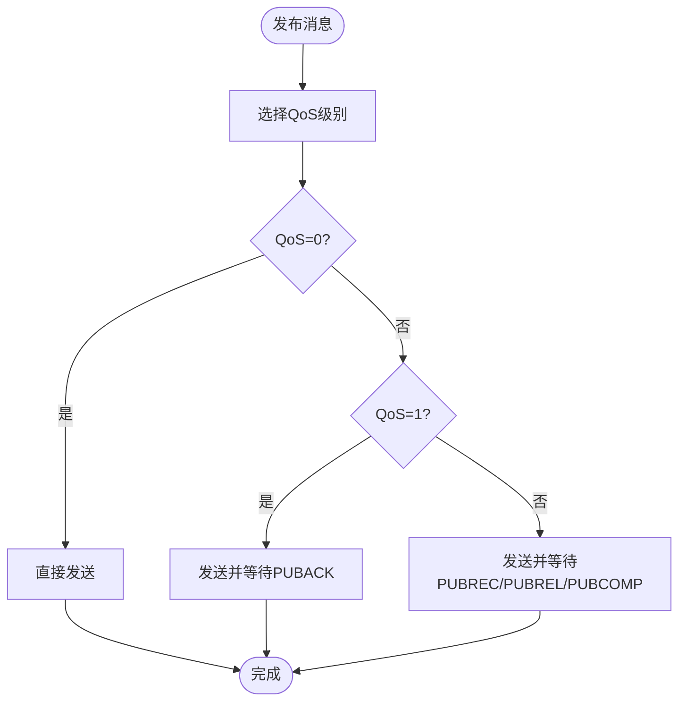
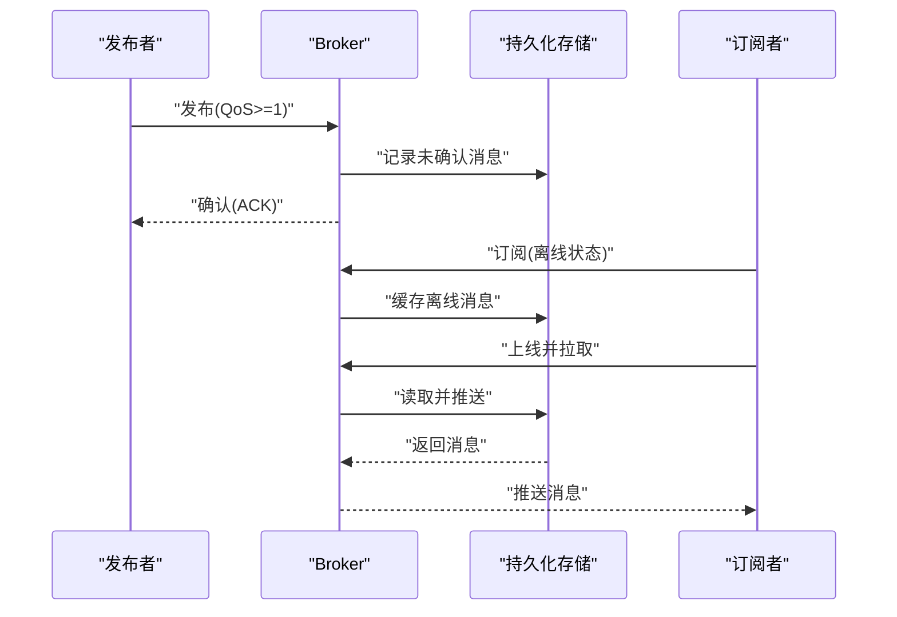
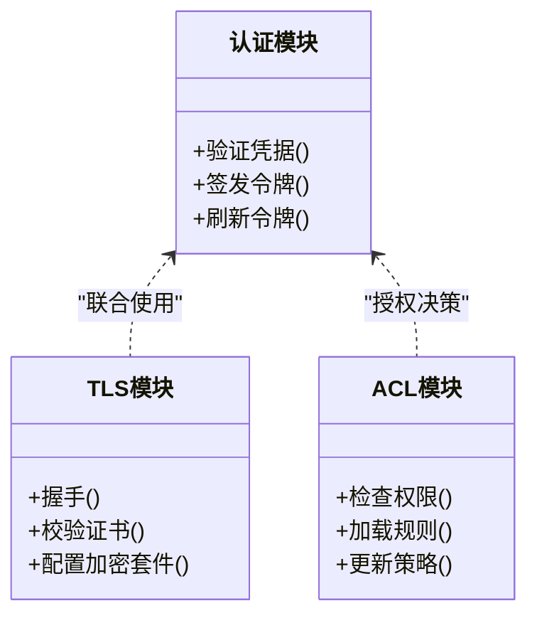
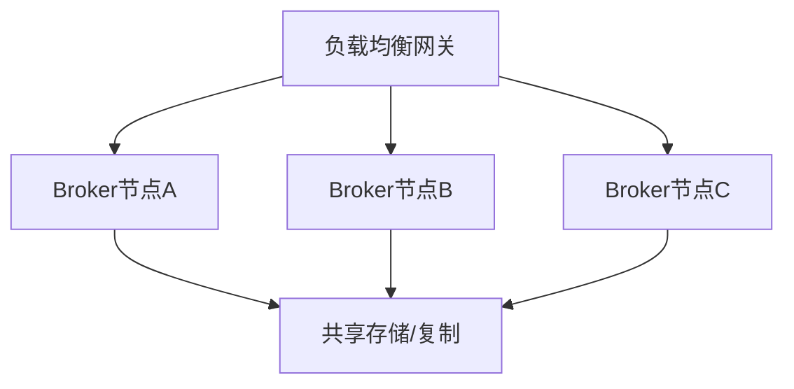
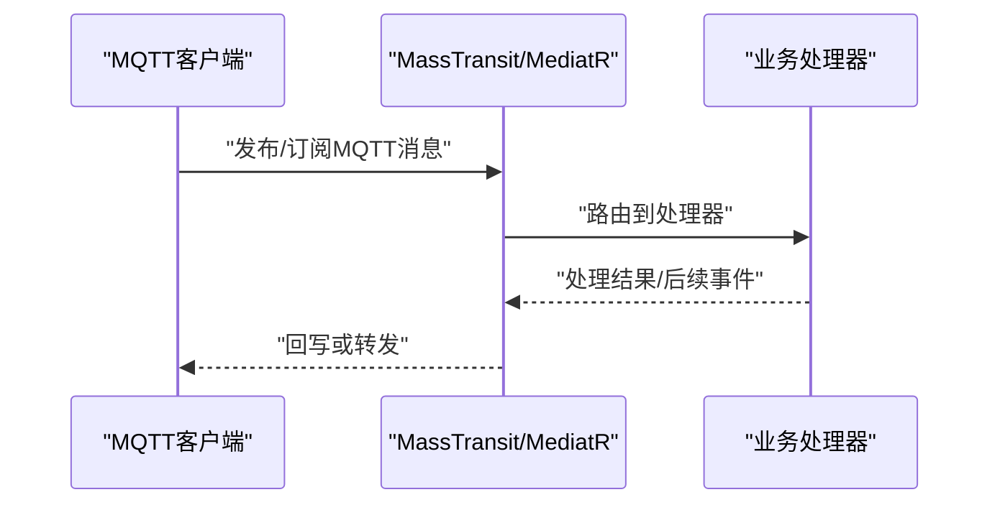
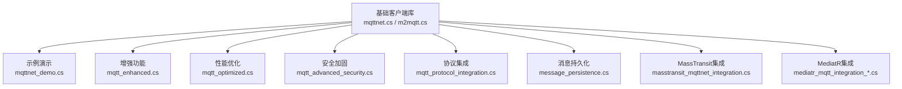

# MQTT协议通信

<cite>
**本文引用的文件**   
- [mqtt_integration.cs](file://mqtt_integration.cs)
- [mqttnet_demo.cs](file://mqttnet_demo.cs)
- [mqttnet.cs](file://mqttnet.cs)
- [m2mqtt.cs](file://m2mqtt.cs)
- [mqtt_enhanced.cs](file://mqtt_enhanced.cs)
- [mqtt_optimized.cs](file://mqtt_optimized.cs)
- [mqtt_advanced_security.cs](file://mqtt_advanced_security.cs)
- [mqtt_protocol_integration.cs](file://mqtt_protocol_integration.cs)
- [message_persistence.cs](file://message_persistence.cs)
- [masstransit_mqttnet_integration.cs](file://masstransit_mqttnet_integration.cs)
- [mediatr_mqtt_integration_message.cs](file://mediatr_mqtt_integration_message.cs)
- [mediatr_mqtt_integration_pubsub.cs](file://mediatr_mqtt_integration_pubsub.cs)
</cite>

## 目录
1. [简介](#简介)
2. [项目结构](#项目结构)
3. [核心组件](#核心组件)
4. [架构总览](#架构总览)
5. [详细组件分析](#详细组件分析)
6. [依赖关系分析](#依赖关系分析)
7. [性能考虑](#性能考虑)
8. [故障诊断指南](#故障诊断指南)
9. [结论](#结论)
10. [附录](#附录)

## 简介
本文件面向MQTT协议在工程中的落地实践，围绕发布/订阅模型、QoS语义、客户端连接管理、主题订阅、消息持久化与离线消息处理、集群部署与高可用、安全认证与TLS加密、访问控制、性能调优与故障诊断等主题进行系统化说明。文档内容基于仓库中现有MQTT相关示例与集成代码进行分析与归纳，帮助读者快速理解并正确应用MQTT于生产环境。

## 项目结构
仓库中包含大量与MQTT相关的示例与集成文件，涵盖基础连接、高级优化、安全加固、协议集成、消息持久化以及与消息总线（MassTransit、MediatR）的集成等。这些文件为构建完整的MQTT解决方案提供了丰富的参考实现。

图表来源 
- [mqtt_integration.cs](file://mqtt_integration.cs)
- [mqttnet_demo.cs](file://mqttnet_demo.cs)
- [mqttnet.cs](file://mqttnet.cs)
- [m2mqtt.cs](file://m2mqtt.cs)
- [mqtt_enhanced.cs](file://mqtt_enhanced.cs)
- [mqtt_optimized.cs](file://mqtt_optimized.cs)
- [mqtt_advanced_security.cs](file://mqtt_advanced_security.cs)
- [mqtt_protocol_integration.cs](file://mqtt_protocol_integration.cs)
- [message_persistence.cs](file://message_persistence.cs)
- [masstransit_mqttnet_integration.cs](file://masstransit_mqttnet_integration.cs)
- [mediatr_mqtt_integration_message.cs](file://mediatr_mqtt_integration_message.cs)
- [mediatr_mqtt_integration_pubsub.cs](file://mediatr_mqtt_integration_pubsub.cs)

章节来源
- [mqtt_integration.cs](file://mqtt_integration.cs)
- [mqttnet_demo.cs](file://mqttnet_demo.cs)
- [mqttnet.cs](file://mqttnet.cs)
- [m2mqtt.cs](file://m2mqtt.cs)
- [mqtt_enhanced.cs](file://mqtt_enhanced.cs)
- [mqtt_optimized.cs](file://mqtt_optimized.cs)
- [mqtt_advanced_security.cs](file://mqtt_advanced_security.cs)
- [mqtt_protocol_integration.cs](file://mqtt_protocol_integration.cs)
- [message_persistence.cs](file://message_persistence.cs)
- [masstransit_mqttnet_integration.cs](file://masstransit_mqttnet_integration.cs)
- [mediatr_mqtt_integration_message.cs](file://mediatr_mqtt_integration_message.cs)
- [mediatr_mqtt_integration_pubsub.cs](file://mediatr_mqtt_integration_pubsub.cs)

## 核心组件
- 客户端连接与会话管理：负责建立与Broker的连接、心跳保活、断线重连、会话状态维护（CleanSession/Last Will）。
- 主题订阅与路由：支持通配符订阅、动态订阅/退订、按主题路由到处理器。
- QoS与可靠性：实现QoS 0/1/2语义，确保至少一次或恰好一次投递，配合去重与幂等处理。
- 消息持久化与离线队列：对未确认消息、离线订阅者消息进行持久化存储与恢复。
- 安全与访问控制：用户名/密码、TLS加密、证书校验、ACL策略。
- 集群与高可用：多节点Broker集群、负载均衡、跨域同步、故障转移。
- 与消息总线集成：通过MassTransit或MediatR将MQTT事件接入领域服务或工作流。

章节来源
- [mqtt_integration.cs](file://mqtt_integration.cs)
- [mqtt_enhanced.cs](file://mqtt_enhanced.cs)
- [mqtt_optimized.cs](file://mqtt_optimized.cs)
- [mqtt_advanced_security.cs](file://mqtt_advanced_security.cs)
- [message_persistence.cs](file://message_persistence.cs)
- [masstransit_mqttnet_integration.cs](file://masstransit_mqttnet_integration.cs)
- [mediatr_mqtt_integration_message.cs](file://mediatr_mqtt_integration_message.cs)
- [mediatr_mqtt_integration_pubsub.cs](file://mediatr_mqtt_integration_pubsub.cs)

## 架构总览
下图展示典型的MQTT发布/订阅架构，包括客户端、Broker、持久化存储与安全模块的交互关系。

图表来源 
- [mqtt_protocol_integration.cs](file://mqtt_protocol_integration.cs)
- [message_persistence.cs](file://message_persistence.cs)
- [mqtt_advanced_security.cs](file://mqtt_advanced_security.cs)

章节来源
- [mqtt_protocol_integration.cs](file://mqtt_protocol_integration.cs)
- [message_persistence.cs](file://message_persistence.cs)
- [mqtt_advanced_security.cs](file://mqtt_advanced_security.cs)

## 详细组件分析

### 客户端连接管理与会话
- 连接生命周期：初始化连接参数（服务器地址、端口、KeepAlive）、建立TCP/TLS连接、发送CONNECT、接收CONNACK、维持心跳PING/PONG。
- 会话状态：根据CleanSession决定会话是否持久；Last Will用于异常断开时通知订阅者。
- 断线重连：指数退避重试、最大重试次数、失败回调。
- 资源管理：连接池、并发限制、内存与句柄释放。

图表来源 
- [mqttnet_demo.cs](file://mqttnet_demo.cs)
- [mqttnet.cs](file://mqttnet.cs)
- [m2mqtt.cs](file://m2mqtt.cs)

章节来源
- [mqttnet_demo.cs](file://mqttnet_demo.cs)
- [mqttnet.cs](file://mqttnet.cs)
- [m2mqtt.cs](file://m2mqtt.cs)

### 主题订阅与消息路由
- 订阅模式：精确匹配、多级通配符“+”、顶层通配符“#”。
- 动态订阅：运行时订阅/退订、按业务上下文切换主题。
- 路由策略：按主题前缀分流、按设备ID路由、按租户隔离。
- 处理器编排：订阅回调、批量处理、背压控制。

图表来源 
- [mqtt_integration.cs](file://mqtt_integration.cs)
- [mqtt_enhanced.cs](file://mqtt_enhanced.cs)

章节来源
- [mqtt_integration.cs](file://mqtt_integration.cs)
- [mqtt_enhanced.cs](file://mqtt_enhanced.cs)

### QoS级别与可靠性
- QoS 0：最多一次，不保证送达。
- QoS 1：至少一次，可能重复，需去重。
- QoS 2：恰好一次，开销最大，适合关键数据。
- 幂等性：结合消息ID与去重表确保最终一致性。

图表来源 
- [mqtt_protocol_integration.cs](file://mqtt_protocol_integration.cs)
- [mqtt_optimized.cs](file://mqtt_optimized.cs)

章节来源
- [mqtt_protocol_integration.cs](file://mqtt_protocol_integration.cs)
- [mqtt_optimized.cs](file://mqtt_optimized.cs)

### 消息持久化与离线消息处理
- 未确认消息持久化：对QoS 1/2的未确认消息落盘，重启后恢复。
- 离线订阅者队列：当订阅者离线时缓存消息，在线后推送。
- 存储选型：内存/磁盘混合、分片与压缩、过期清理。
- 恢复流程：启动时扫描未确认与离线队列，重放或丢弃。

图表来源 
- [message_persistence.cs](file://message_persistence.cs)
- [mqtt_integration.cs](file://mqtt_integration.cs)

章节来源
- [message_persistence.cs](file://message_persistence.cs)
- [mqtt_integration.cs](file://mqtt_integration.cs)

### 安全认证、TLS加密与访问控制
- 认证：用户名/密码、客户端证书、外部身份源集成。
- 传输加密：TLS握手、证书链校验、最小协议版本。
- 访问控制：ACL规则、按主题/设备/租户授权、黑名单。
- 审计与合规：日志记录、敏感字段脱敏、合规检查。

图表来源 
- [mqtt_advanced_security.cs](file://mqtt_advanced_security.cs)
- [mqtt_protocol_integration.cs](file://mqtt_protocol_integration.cs)

章节来源
- [mqtt_advanced_security.cs](file://mqtt_advanced_security.cs)
- [mqtt_protocol_integration.cs](file://mqtt_protocol_integration.cs)

### 集群部署、负载均衡与高可用
- 多Broker集群：共享存储或复制机制，跨节点路由。
- 负载均衡：前端网关分发、按设备哈希或负载权重。
- 故障转移：主从切换、健康检查、自动重定向。
- 水平扩展：分区与分片、容量规划与弹性伸缩。

图表来源 
- [mqtt_protocol_integration.cs](file://mqtt_protocol_integration.cs)
- [mqtt_optimized.cs](file://mqtt_optimized.cs)

章节来源
- [mqtt_protocol_integration.cs](file://mqtt_protocol_integration.cs)
- [mqtt_optimized.cs](file://mqtt_optimized.cs)

### 与消息总线集成（MassTransit/MediatR）
- MassTransit：将MQTT主题映射为总线通道，统一编排与重试。
- MediatR：以命令/事件驱动方式处理MQTT消息，解耦业务逻辑。
- 事务与补偿：结合分布式事务或Saga模式保障一致性。

图表来源 
- [masstransit_mqttnet_integration.cs](file://masstransit_mqttnet_integration.cs)
- [mediatr_mqtt_integration_message.cs](file://mediatr_mqtt_integration_message.cs)
- [mediatr_mqtt_integration_pubsub.cs](file://mediatr_mqtt_integration_pubsub.cs)

章节来源
- [masstransit_mqttnet_integration.cs](file://masstransit_mqttnet_integration.cs)
- [mediatr_mqtt_integration_message.cs](file://mediatr_mqtt_integration_message.cs)
- [mediatr_mqtt_integration_pubsub.cs](file://mediatr_mqtt_integration_pubsub.cs)

## 依赖关系分析
MQTT相关组件之间的依赖关系如下：基础客户端库（如MQTTnet、M2MQTT）提供连接与协议能力；增强与优化模块在此基础上封装连接池、重试、背压等；安全模块提供认证与TLS；持久化模块提供离线与未确认消息存储；集成模块对接消息总线与业务系统。

图表来源 
- [mqttnet.cs](file://mqttnet.cs)
- [m2mqtt.cs](file://m2mqtt.cs)
- [mqttnet_demo.cs](file://mqttnet_demo.cs)
- [mqtt_enhanced.cs](file://mqtt_enhanced.cs)
- [mqtt_optimized.cs](file://mqtt_optimized.cs)
- [mqtt_advanced_security.cs](file://mqtt_advanced_security.cs)
- [mqtt_protocol_integration.cs](file://mqtt_protocol_integration.cs)
- [message_persistence.cs](file://message_persistence.cs)
- [masstransit_mqttnet_integration.cs](file://masstransit_mqttnet_integration.cs)
- [mediatr_mqtt_integration_message.cs](file://mediatr_mqtt_integration_message.cs)
- [mediatr_mqtt_integration_pubsub.cs](file://mediatr_mqtt_integration_pubsub.cs)

章节来源
- [mqttnet.cs](file://mqttnet.cs)
- [m2mqtt.cs](file://m2mqtt.cs)
- [mqttnet_demo.cs](file://mqttnet_demo.cs)
- [mqtt_enhanced.cs](file://mqtt_enhanced.cs)
- [mqtt_optimized.cs](file://mqtt_optimized.cs)
- [mqtt_advanced_security.cs](file://mqtt_advanced_security.cs)
- [mqtt_protocol_integration.cs](file://mqtt_protocol_integration.cs)
- [message_persistence.cs](file://message_persistence.cs)
- [masstransit_mqttnet_integration.cs](file://masstransit_mqttnet_integration.cs)
- [mediatr_mqtt_integration_message.cs](file://mediatr_mqtt_integration_message.cs)
- [mediatr_mqtt_integration_pubsub.cs](file://mediatr_mqtt_integration_pubsub.cs)

## 性能考虑
- 连接池与复用：减少握手开销，合理设置最大连接数与空闲超时。
- 批处理与合并：批量发布/订阅，降低网络与序列化成本。
- 背压与限流：防止下游过载，采用令牌桶或滑动窗口限流。
- 序列化优化：使用高效二进制格式（如MessagePack/Protobuf），避免GC压力。
- 异步与非阻塞：全链路异步IO，避免线程阻塞。
- 监控与指标：采集延迟、吞吐、错误率、连接数等关键指标。

[本节为通用指导，不直接分析具体文件]

## 故障诊断指南
- 连接问题：检查DNS解析、防火墙、TLS证书、端口可达性与Broker状态。
- 订阅异常：核对主题匹配规则、通配符语法、权限与ACL。
- QoS不一致：确认客户端与Broker的QoS协商、去重表与幂等处理。
- 消息丢失：核查未确认消息持久化、离线队列、存储可用性。
- 性能瓶颈：定位CPU/内存/IO热点，分析序列化与网络带宽。
- 日志与追踪：启用结构化日志与分布式追踪，关联请求链路。

章节来源
- [mqtt_integration.cs](file://mqtt_integration.cs)
- [mqtt_enhanced.cs](file://mqtt_enhanced.cs)
- [mqtt_optimized.cs](file://mqtt_optimized.cs)
- [message_persistence.cs](file://message_persistence.cs)

## 结论
通过对仓库中MQTT相关文件的分析与归纳，可以构建一个高可靠、高性能、安全的MQTT通信体系。关键在于合理的连接与会话管理、严格的QoS与幂等设计、完善的持久化与离线处理、健壮的安全与访问控制、以及可扩展的集群与高可用架构。结合消息总线集成，可将MQTT事件无缝融入业务系统，提升整体架构的可维护性与可观测性。

[本节为总结性内容，不直接分析具体文件]

## 附录
- 术语表：Broker、Client、Topic、QoS、Connect、Publish、Subscribe、Ping、Disconnect等。
- 最佳实践清单：最小权限原则、强密码与证书管理、定期轮换密钥、灰度发布与回滚策略。
- 参考实现路径：参见各MQTT相关文件，获取更详细的实现细节与配置示例。

[本节为补充信息，不直接分析具体文件]