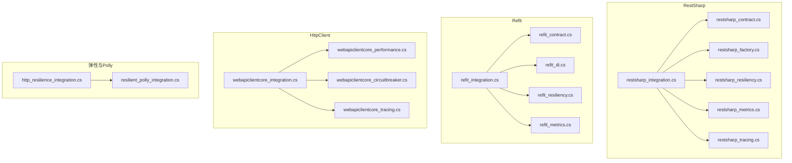
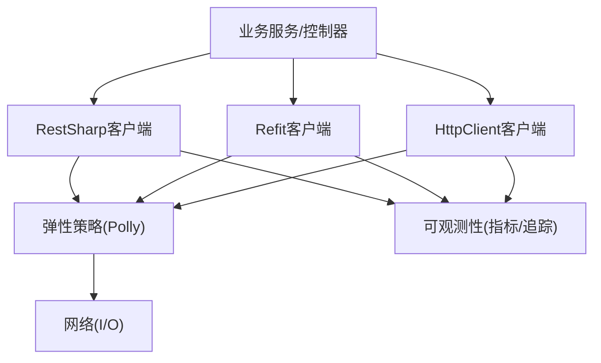
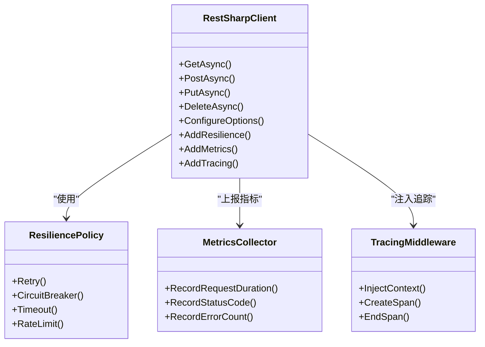
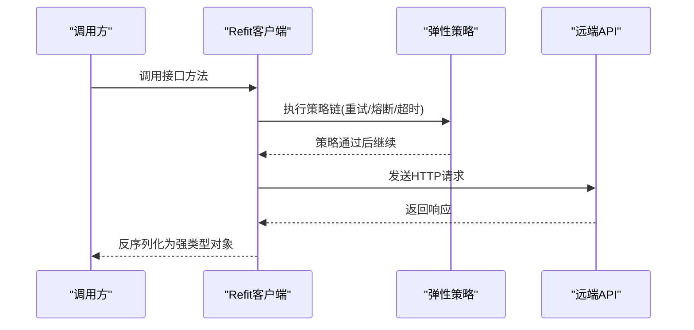
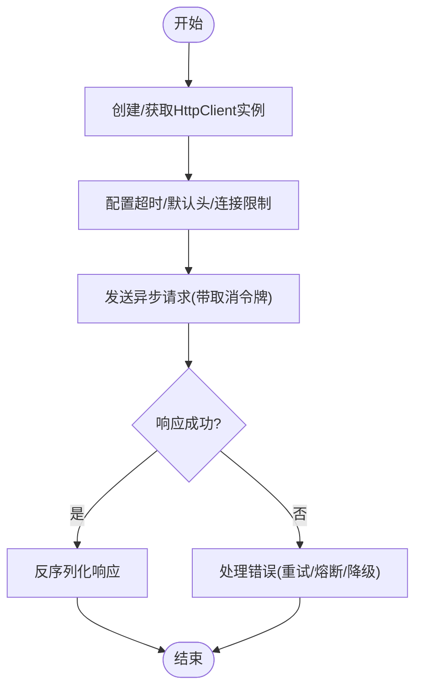
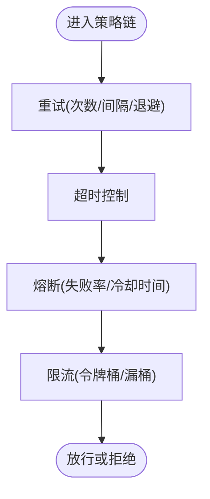
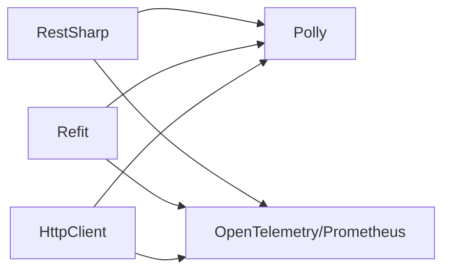

# REST API通信

<cite>
**本文引用的文件**   
- [restsharp_integration.cs](file://restsharp_integration.cs)
- [restsharp_contract.cs](file://restsharp_contract.cs)
- [restsharp_factory.cs](file://restsharp_factory.cs)
- [restsharp_resiliency.cs](file://restsharp_resiliency.cs)
- [restsharp_metrics.cs](file://restsharp_metrics.cs)
- [restsharp_tracing.cs](file://restsharp_tracing.cs)
- [refit_integration.cs](file://refit_integration.cs)
- [refit_contract.cs](file://refit_contract.cs)
- [refit_di.cs](file://refit_di.cs)
- [refit_resiliency.cs](file://refit_resiliency.cs)
- [refit_metrics.cs](file://refit_metrics.cs)
- [webapiclientcore_integration.cs](file://webapiclientcore_integration.cs)
- [webapiclientcore_performance.cs](file://webapiclientcore_performance.cs)
- [webapiclientcore_circuitbreaker.cs](file://webapiclientcore_circuitbreaker.cs)
- [webapiclientcore_tracing.cs](file://webapiclientcore_tracing.cs)
- [http_resilience_integration.cs](file://http_resilience_integration.cs)
- [resilient_polly_integration.cs](file://resilient_polly_integration.cs)
</cite>

## 目录
1. [简介](#简介)
2. [项目结构](#项目结构)
3. [核心组件](#核心组件)
4. [架构总览](#架构总览)
5. [详细组件分析](#详细组件分析)
6. [依赖关系分析](#依赖关系分析)
7. [性能考量](#性能考量)
8. [故障排查指南](#故障排查指南)
9. [结论](#结论)
10. [附录](#附录)

## 简介
本文件面向需要在.NET应用中实现REST API通信的开发者，系统性地梳理并对比RestSharp、Refit与HttpClient三大客户端库的最佳实践。内容涵盖：
- 请求重试机制、超时配置与连接池管理
- API版本控制策略与错误处理规范
- 日志记录与可观测性（指标、追踪）
- 异步编程模式、取消令牌使用
- 实际调用示例与常见问题排查

本仓库提供了丰富的集成示例，便于快速上手与生产落地。

## 项目结构
围绕HTTP客户端的示例代码主要分布在以下文件中：
- RestSharp系列：契约定义、工厂封装、弹性策略、指标与追踪
- Refit系列：契约定义、DI注册、弹性策略与指标
- HttpClient系列：基础用法、性能优化、熔断与追踪
- 通用弹性与Polly集成：跨客户端的统一弹性策略

图表来源
- [restsharp_integration.cs](file://restsharp_integration.cs)
- [restsharp_contract.cs](file://restsharp_contract.cs)
- [restsharp_factory.cs](file://restsharp_factory.cs)
- [restsharp_resiliency.cs](file://restsharp_resiliency.cs)
- [restsharp_metrics.cs](file://restsharp_metrics.cs)
- [restsharp_tracing.cs](file://restsharp_tracing.cs)
- [refit_integration.cs](file://refit_integration.cs)
- [refit_contract.cs](file://refit_contract.cs)
- [refit_di.cs](file://refit_di.cs)
- [refit_resiliency.cs](file://refit_resiliency.cs)
- [refit_metrics.cs](file://refit_metrics.cs)
- [webapiclientcore_integration.cs](file://webapiclientcore_integration.cs)
- [webapiclientcore_performance.cs](file://webapiclientcore_performance.cs)
- [webapiclientcore_circuitbreaker.cs](file://webapiclientcore_circuitbreaker.cs)
- [webapiclientcore_tracing.cs](file://webapiclientcore_tracing.cs)
- [http_resilience_integration.cs](file://http_resilience_integration.cs)
- [resilient_polly_integration.cs](file://resilient_polly_integration.cs)

章节来源
- [restsharp_integration.cs](file://restsharp_integration.cs)
- [refit_integration.cs](file://refit_integration.cs)
- [webapiclientcore_integration.cs](file://webapiclientcore_integration.cs)
- [http_resilience_integration.cs](file://http_resilience_integration.cs)

## 核心组件
- RestSharp
  - 契约接口定义：通过特性标注端点、方法、参数与序列化选项
  - 工厂封装：集中配置BaseAddress、默认头、超时、连接限制等
  - 弹性策略：重试、退避、熔断、限流等
  - 指标与追踪：请求耗时、状态码分布、分布式追踪上下文透传
- Refit
  - 契约接口：以C#接口描述API，自动序列化和反序列化
  - DI注册：在容器中注册接口到具体实现
  - 弹性与指标：结合Polly与OpenTelemetry/Prometheus
- HttpClient
  - 基础用法：创建实例、设置超时、发送异步请求
  - 性能优化：连接池、Keep-Alive、缓冲策略
  - 熔断与追踪：结合Polly与OpenTelemetry

章节来源
- [restsharp_contract.cs](file://restsharp_contract.cs)
- [restsharp_factory.cs](file://restsharp_factory.cs)
- [restsharp_resiliency.cs](file://restsharp_resiliency.cs)
- [restsharp_metrics.cs](file://restsharp_metrics.cs)
- [restsharp_tracing.cs](file://restsharp_tracing.cs)
- [refit_contract.cs](file://refit_contract.cs)
- [refit_di.cs](file://refit_di.cs)
- [refit_resiliency.cs](file://refit_resiliency.cs)
- [refit_metrics.cs](file://refit_metrics.cs)
- [webapiclientcore_integration.cs](file://webapiclientcore_integration.cs)
- [webapiclientcore_performance.cs](file://webapiclientcore_performance.cs)
- [webapiclientcore_circuitbreaker.cs](file://webapiclientcore_circuitbreaker.cs)
- [webapiclientcore_tracing.cs](file://webapiclientcore_tracing.cs)

## 架构总览
下图展示了三种客户端在应用中的角色与交互关系，以及统一的弹性与可观测性层。

图表来源
- [restsharp_integration.cs](file://restsharp_integration.cs)
- [refit_integration.cs](file://refit_integration.cs)
- [webapiclientcore_integration.cs](file://webapiclientcore_integration.cs)
- [http_resilience_integration.cs](file://http_resilience_integration.cs)

## 详细组件分析

### RestSharp组件分析
- 契约定义：通过特性声明HTTP方法与路径，支持查询参数、路径参数与请求体
- 工厂封装：集中配置BaseAddress、默认Header、超时、连接数限制、代理等
- 弹性策略：基于Polly实现重试、退避、熔断、降级
- 指标与追踪：记录请求耗时、状态码、异常；注入TraceId/SpanId

图表来源
- [restsharp_integration.cs](file://restsharp_integration.cs)
- [restsharp_resiliency.cs](file://restsharp_resiliency.cs)
- [restsharp_metrics.cs](file://restsharp_metrics.cs)
- [restsharp_tracing.cs](file://restsharp_tracing.cs)

章节来源
- [restsharp_contract.cs](file://restsharp_contract.cs)
- [restsharp_factory.cs](file://restsharp_factory.cs)
- [restsharp_resiliency.cs](file://restsharp_resiliency.cs)
- [restsharp_metrics.cs](file://restsharp_metrics.cs)
- [restsharp_tracing.cs](file://restsharp_tracing.cs)

### Refit组件分析
- 契约接口：以C#接口描述API，自动映射为HTTP请求
- DI注册：在容器中以接口方式注册，便于测试替换
- 弹性与指标：结合Polly与OpenTelemetry/Prometheus进行监控

图表来源
- [refit_integration.cs](file://refit_integration.cs)
- [refit_contract.cs](file://refit_contract.cs)
- [refit_resiliency.cs](file://refit_resiliency.cs)
- [refit_metrics.cs](file://refit_metrics.cs)

章节来源
- [refit_contract.cs](file://refit_contract.cs)
- [refit_di.cs](file://refit_di.cs)
- [refit_resiliency.cs](file://refit_resiliency.cs)
- [refit_metrics.cs](file://refit_metrics.cs)

### HttpClient组件分析
- 基础用法：创建HttpClient实例，设置超时、默认头、压缩等
- 性能优化：合理配置连接池、Keep-Alive、缓冲大小
- 熔断与追踪：结合Polly与OpenTelemetry

图表来源
- [webapiclientcore_integration.cs](file://webapiclientcore_integration.cs)
- [webapiclientcore_performance.cs](file://webapiclientcore_performance.cs)
- [webapiclientcore_circuitbreaker.cs](file://webapiclientcore_circuitbreaker.cs)
- [webapiclientcore_tracing.cs](file://webapiclientcore_tracing.cs)

章节来源
- [webapiclientcore_integration.cs](file://webapiclientcore_integration.cs)
- [webapiclientcore_performance.cs](file://webapiclientcore_performance.cs)
- [webapiclientcore_circuitbreaker.cs](file://webapiclientcore_circuitbreaker.cs)
- [webapiclientcore_tracing.cs](file://webapiclientcore_tracing.cs)

### 弹性与Polly集成
- 统一策略：重试、指数退避、熔断、限流、超时
- 适用场景：网络抖动、服务端过载、临时不可用

图表来源
- [http_resilience_integration.cs](file://http_resilience_integration.cs)
- [resilient_polly_integration.cs](file://resilient_polly_integration.cs)

章节来源
- [http_resilience_integration.cs](file://http_resilience_integration.cs)
- [resilient_polly_integration.cs](file://resilient_polly_integration.cs)

## 依赖关系分析
- RestSharp与Refit均依赖Polly进行弹性控制，并通过OpenTelemetry/Prometheus上报指标与追踪
- HttpClient作为底层I/O抽象，被上层客户端封装复用
- 各客户端共享统一的弹性策略与可观测性中间件

图表来源
- [restsharp_resiliency.cs](file://restsharp_resiliency.cs)
- [refit_resiliency.cs](file://refit_resiliency.cs)
- [webapiclientcore_circuitbreaker.cs](file://webapiclientcore_circuitbreaker.cs)
- [http_resilience_integration.cs](file://http_resilience_integration.cs)

章节来源
- [restsharp_resiliency.cs](file://restsharp_resiliency.cs)
- [refit_resiliency.cs](file://refit_resiliency.cs)
- [webapiclientcore_circuitbreaker.cs](file://webapiclientcore_circuitbreaker.cs)
- [http_resilience_integration.cs](file://http_resilience_integration.cs)

## 性能考量
- 连接池管理
  - 合理设置最大空闲连接数与DNS缓存
  - 启用Keep-Alive以减少握手开销
- 超时配置
  - 区分连接超时、请求超时与读取超时
  - 根据业务SLA设定合理的超时阈值
- 异步与取消
  - 全程使用异步API，避免阻塞线程
  - 传递取消令牌，及时释放资源
- 序列化与缓冲
  - 选择高性能序列化器（如System.Text.Json）
  - 合理使用缓冲大小，避免频繁GC
- 指标与追踪
  - 采集请求耗时、吞吐、错误率
  - 链路追踪定位瓶颈与异常

章节来源
- [webapiclientcore_performance.cs](file://webapiclientcore_performance.cs)
- [restsharp_metrics.cs](file://restsharp_metrics.cs)
- [refit_metrics.cs](file://refit_metrics.cs)

## 故障排查指南
- 常见错误分类
  - 网络错误：连接失败、DNS解析失败、TLS握手失败
  - 服务端错误：5xx、4xx、超时、限流
  - 客户端错误：参数校验失败、序列化异常、内存不足
- 诊断步骤
  - 检查日志：请求/响应摘要、异常堆栈、策略执行轨迹
  - 查看指标：QPS、延迟分布、错误率、熔断状态
  - 追踪链路：跨服务调用链定位问题节点
- 恢复策略
  - 重试与退避：针对瞬时错误
  - 熔断与降级：保护下游与服务自身
  - 限流与背压：防止雪崩

章节来源
- [restsharp_resiliency.cs](file://restsharp_resiliency.cs)
- [refit_resiliency.cs](file://refit_resiliency.cs)
- [webapiclientcore_circuitbreaker.cs](file://webapiclientcore_circuitbreaker.cs)
- [http_resilience_integration.cs](file://http_resilience_integration.cs)

## 结论
- 选型建议
  - RestSharp：灵活强大，适合复杂场景与细粒度控制
  - Refit：契约驱动，开发效率高，适合强类型API
  - HttpClient：轻量高效，适合底层定制与极致性能
- 最佳实践
  - 统一弹性策略与可观测性
  - 严格超时与取消令牌管理
  - 完善的日志、指标与追踪
  - 持续压测与容量规划

## 附录
- 版本控制策略
  - URL路径版本化：/api/v1/...
  - Header版本化：Accept-Version
  - 查询参数版本化：?api-version=1
- 错误处理规范
  - 统一错误模型与状态码映射
  - 区分可重试与不可重试错误
- 日志记录策略
  - 结构化日志，包含TraceId、SpanId、请求ID
  - 敏感信息脱敏与采样策略

章节来源
- [restsharp_integration.cs](file://restsharp_integration.cs)
- [refit_integration.cs](file://refit_integration.cs)
- [webapiclientcore_integration.cs](file://webapiclientcore_integration.cs)