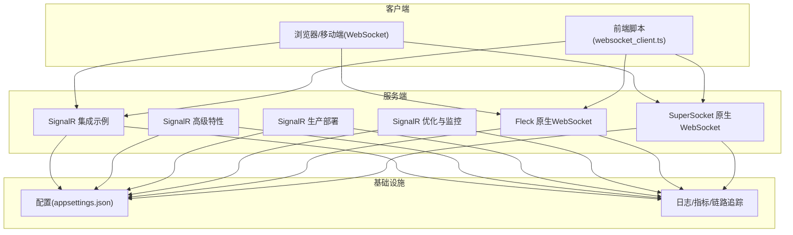
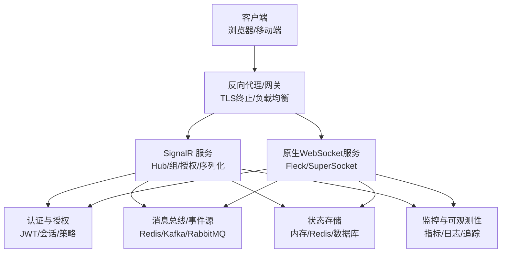
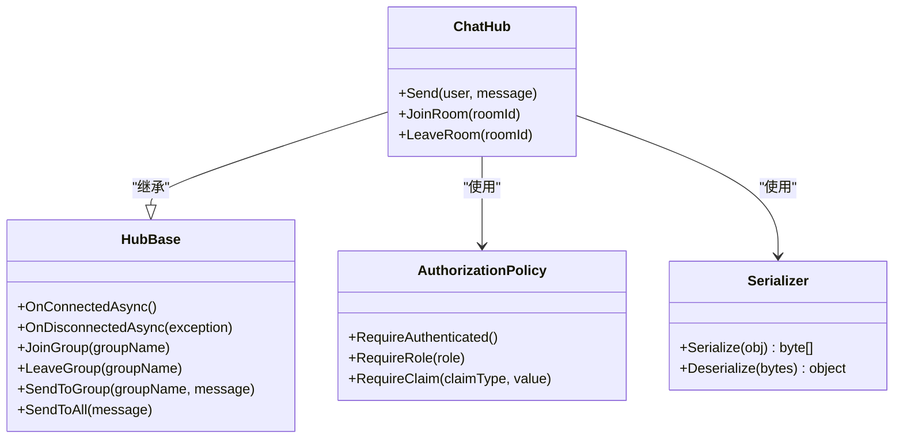
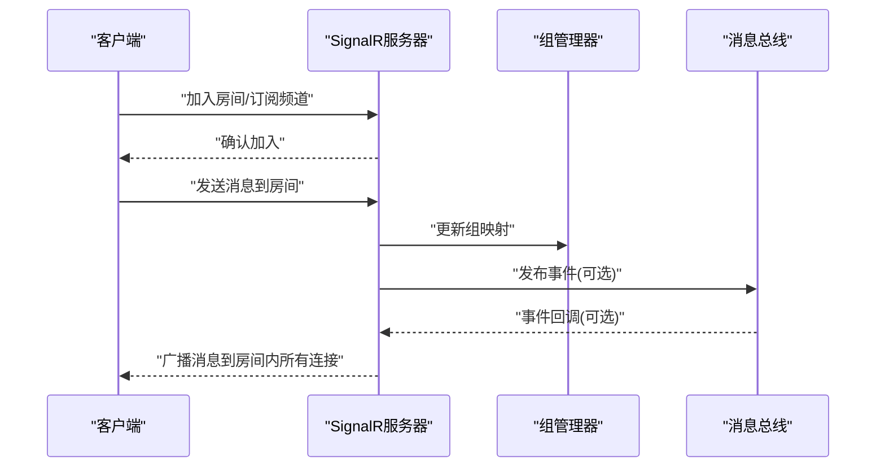
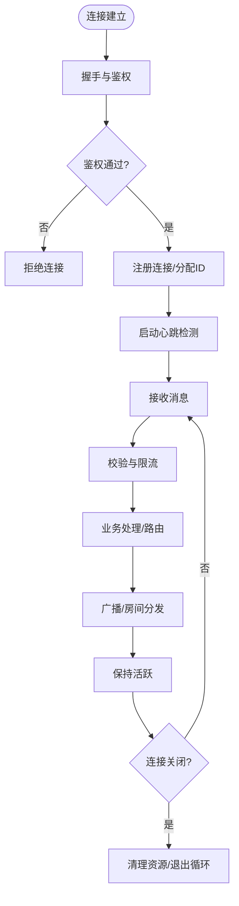
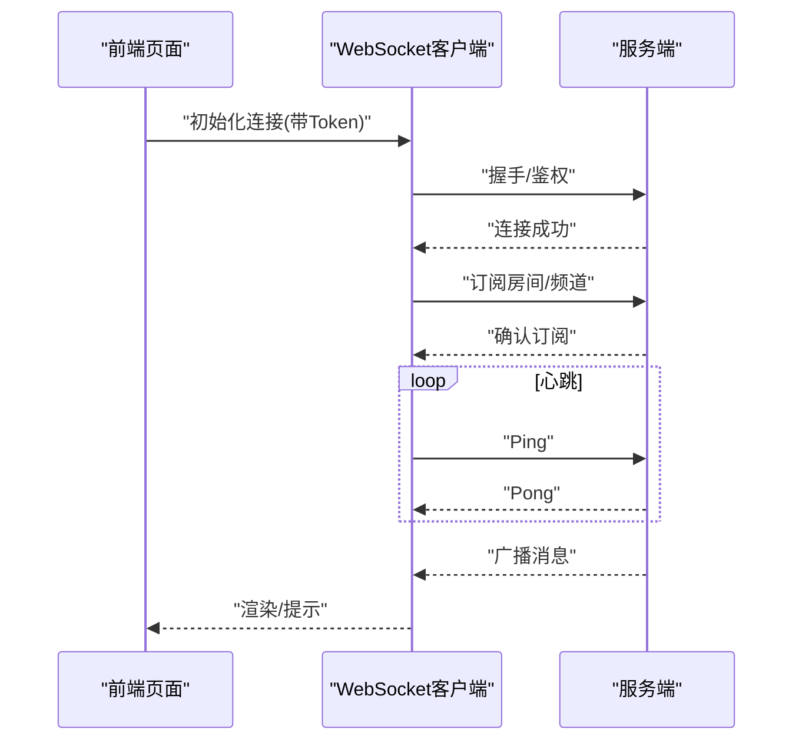
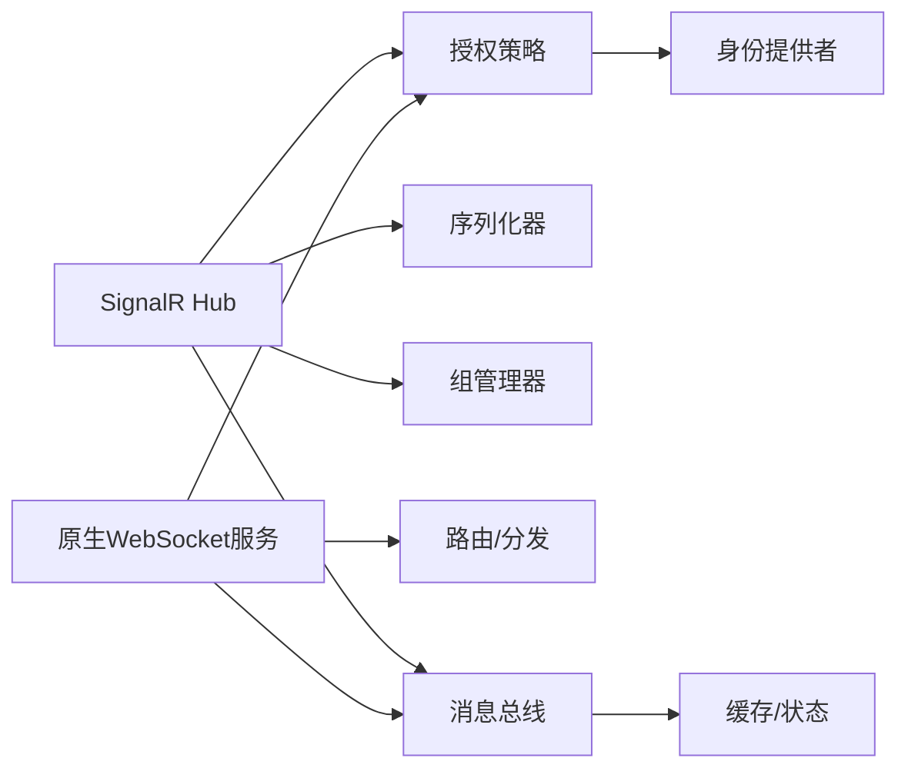

# WebSocket实时通信

<cite>
**本文引用的文件**   
- [signalr_integration.cs](file://signalr_integration.cs)
- [signalr_advanced.cs](file://signalr_advanced.cs)
- [signalr_production.cs](file://signalr_production.cs)
- [signalr_optimized.cs](file://signalr_optimized.cs)
- [signalr_monitoring.cs](file://signalr_monitoring.cs)
- [fleck_websocket.cs](file://fleck_websocket.cs)
- [supersocket_integration.cs](file://supersocket_integration.cs)
- [websocket_client.ts](file://wwwroot/js/websocket_client.ts)
- [appsettings.json](file://appsettings.json)
</cite>

## 目录
1. [简介](#简介)
2. [项目结构](#项目结构)
3. [核心组件](#核心组件)
4. [架构总览](#架构总览)
5. [详细组件分析](#详细组件分析)
6. [依赖关系分析](#依赖关系分析)
7. [性能考量](#性能考量)
8. [故障排查指南](#故障排查指南)
9. [结论](#结论)
10. [附录](#附录)

## 简介
本文件面向需要在系统中实现WebSocket实时通信的开发者，覆盖SignalR与原生WebSocket两种实现路径。内容涵盖连接管理、消息广播、房间分组、状态同步、心跳检测、断线重连、错误恢复、安全认证、权限控制、流量控制，以及大规模连接场景下的性能优化与最佳实践。文档以仓库中的示例代码为依据，提供可落地的设计思路与工程化建议。

## 项目结构
本项目在根目录下提供了多种实时通信的实现样例：
- SignalR相关：集成、高级用法、生产配置、优化与监控等
- 原生WebSocket：基于Fleck或SuperSocket的轻量级实现
- 前端示例：用于演示客户端连接与交互
- 配置：应用设置与运行时参数

图表来源 
- [signalr_integration.cs](file://signalr_integration.cs)
- [signalr_advanced.cs](file://signalr_advanced.cs)
- [signalr_production.cs](file://signalr_production.cs)
- [signalr_optimized.cs](file://signalr_optimized.cs)
- [fleck_websocket.cs](file://fleck_websocket.cs)
- [supersocket_integration.cs](file://supersocket_integration.cs)
- [websocket_client.ts](file://wwwroot/js/websocket_client.ts)
- [appsettings.json](file://appsettings.json)

章节来源
- [signalr_integration.cs](file://signalr_integration.cs)
- [signalr_production.cs](file://signalr_production.cs)
- [fleck_websocket.cs](file://fleck_websocket.cs)
- [supersocket_integration.cs](file://supersocket_integration.cs)
- [websocket_client.ts](file://wwwroot/js/websocket_client.ts)
- [appsettings.json](file://appsettings.json)

## 核心组件
- SignalR服务层
  - 集成的Hub定义、连接生命周期处理、组（房间）管理、强类型消息、授权策略
  - 生产环境配置：传输协议、缓冲、压缩、扩展中间件、分布式回退
  - 优化与监控：性能调优、指标采集、分布式跟踪
- 原生WebSocket服务层
  - 基于Fleck/SuperSocket的自定义握手、鉴权、路由、广播与房间管理
  - 心跳与保活、断线重连、背压与限流
- 客户端
  - 浏览器端使用原生WebSocket或SignalR JS SDK进行连接、订阅、重连与错误处理
- 配置与可观测性
  - appsettings.json中关于端口、证书、超时、限流、日志级别等
  - 指标、日志、链路追踪接入

章节来源
- [signalr_integration.cs](file://signalr_integration.cs)
- [signalr_advanced.cs](file://signalr_advanced.cs)
- [signalr_production.cs](file://signalr_production.cs)
- [signalr_optimized.cs](file://signalr_optimized.cs)
- [fleck_websocket.cs](file://fleck_websocket.cs)
- [supersocket_integration.cs](file://supersocket_integration.cs)
- [websocket_client.ts](file://wwwroot/js/websocket_client.ts)
- [appsettings.json](file://appsettings.json)

## 架构总览
下图展示典型的双通道架构：SignalR作为高内聚的实时通信框架，原生WebSocket用于轻量或定制化场景；两者均可通过网关/反向代理暴露给客户端，并共享认证与权限体系。

图表来源 
- [signalr_production.cs](file://signalr_production.cs)
- [signalr_optimized.cs](file://signalr_optimized.cs)
- [fleck_websocket.cs](file://fleck_websocket.cs)
- [supersocket_integration.cs](file://supersocket_integration.cs)
- [appsettings.json](file://appsettings.json)

## 详细组件分析

### SignalR 组件分析
- Hub与连接管理
  - 连接建立/断开事件处理，用户标识绑定，连接上下文维护
  - 组（房间）加入/离开，按组广播与定向发送
- 消息模型与序列化
  - 强类型消息定义，跨语言兼容的序列化策略
  - 大消息分片与压缩选项
- 授权与安全
  - 基于策略的访问控制，角色/资源维度校验
  - 与身份提供者集成（如JWT）
- 生产配置
  - 传输协议选择（WebSockets优先）、KeepAlive、缓冲上限、压缩
  - 分布式扩展（Redis/内存缓存）与粘性会话
- 监控与优化
  - 指标采集（连接数、消息吞吐、延迟）
  - 性能调优（线程池、GC、序列化器）

图表来源 
- [signalr_integration.cs](file://signalr_integration.cs)
- [signalr_advanced.cs](file://signalr_advanced.cs)
- [signalr_production.cs](file://signalr_production.cs)
- [signalr_optimized.cs](file://signalr_optimized.cs)

章节来源
- [signalr_integration.cs](file://signalr_integration.cs)
- [signalr_advanced.cs](file://signalr_advanced.cs)
- [signalr_production.cs](file://signalr_production.cs)
- [signalr_optimized.cs](file://signalr_optimized.cs)

#### SignalR 请求-响应时序（消息广播）

图表来源 
- [signalr_integration.cs](file://signalr_integration.cs)
- [signalr_production.cs](file://signalr_production.cs)

### 原生WebSocket组件分析（Fleck/SuperSocket）
- 连接生命周期
  - OnOpen/OnMessage/OnClose钩子，连接上下文与会话状态
- 认证与权限
  - 握手阶段解析Token/签名，建立连接前完成鉴权
  - 基于用户/租户的访问控制
- 房间与广播
  - 自定义房间数据结构，支持按标签/主题分发
- 心跳与保活
  - Ping/Pong机制，空闲超时清理
- 背压与限流
  - 队列长度限制、丢弃策略、速率限制
- 断线重连
  - 指数退避、幂等恢复、状态同步

图表来源 
- [fleck_websocket.cs](file://fleck_websocket.cs)
- [supersocket_integration.cs](file://supersocket_integration.cs)

章节来源
- [fleck_websocket.cs](file://fleck_websocket.cs)
- [supersocket_integration.cs](file://supersocket_integration.cs)

### 客户端实现（WebSocket/SignalR）
- 连接建立与认证
  - 携带Token或Cookie，处理握手失败与重试
- 消息收发与事件处理
  - 订阅频道/房间，处理广播与点对点消息
- 心跳与重连
  - 定时Ping，异常捕获后指数退避重连
- 状态同步
  - 连接恢复后拉取增量状态或全量快照

图表来源 
- [websocket_client.ts](file://wwwroot/js/websocket_client.ts)
- [signalr_integration.cs](file://signalr_integration.cs)

章节来源
- [websocket_client.ts](file://wwwroot/js/websocket_client.ts)
- [signalr_integration.cs](file://signalr_integration.cs)

## 依赖关系分析
- 组件耦合
  - SignalR Hub与授权策略、序列化器、组管理器松耦合
  - 原生WebSocket服务与认证模块、消息总线解耦
- 外部依赖
  - 配置中心、日志/指标、分布式缓存/消息队列
- 潜在循环依赖
  - 避免Hub直接依赖持久化层，通过接口或事件总线抽象

图表来源 
- [signalr_production.cs](file://signalr_production.cs)
- [fleck_websocket.cs](file://fleck_websocket.cs)
- [supersocket_integration.cs](file://supersocket_integration.cs)

章节来源
- [signalr_production.cs](file://signalr_production.cs)
- [fleck_websocket.cs](file://fleck_websocket.cs)
- [supersocket_integration.cs](file://supersocket_integration.cs)

## 性能考量
- 传输与序列化
  - 启用二进制序列化与压缩，减少带宽占用
  - 合理设置KeepAlive与缓冲上限
- 并发与内存
  - 使用对象池与零拷贝序列化，降低GC压力
  - 控制单连接消息大小与频率，避免阻塞
- 可扩展性
  - 水平扩展时采用粘性会话或分布式组广播
  - 使用消息总线进行跨节点广播
- 监控与容量规划
  - 采集连接数、消息吞吐、延迟分布、错误率
  - 设定告警阈值与自动扩容策略

[本节为通用指导，不直接分析具体文件]

## 故障排查指南
- 连接问题
  - 检查TLS证书、反向代理配置、防火墙与负载均衡健康检查
  - 查看握手失败原因（鉴权失败、协议不匹配）
- 消息丢失与乱序
  - 确认序列号/时间戳，必要时引入ACK与重放保护
  - 检查消息总线消费顺序与分区策略
- 心跳与重连
  - 调整心跳间隔与超时阈值，观察网络抖动
  - 记录重连次数与失败原因，定位不稳定节点
- 性能瓶颈
  - 分析CPU/内存/IO指标，识别热点路径
  - 检查序列化开销、锁竞争与队列堆积

章节来源
- [signalr_monitoring.cs](file://signalr_monitoring.cs)
- [signalr_optimized.cs](file://signalr_optimized.cs)
- [appsettings.json](file://appsettings.json)

## 结论
SignalR适合快速构建高可用、易扩展的实时通信系统，具备完善的组、授权与生态；原生WebSocket适用于轻量定制与极致控制场景。无论选择哪种方案，都应重视认证授权、心跳保活、断线重连、限流背压与可观测性，结合分布式能力实现大规模连接下的稳定与高性能。

[本节为总结性内容，不直接分析具体文件]

## 附录
- 配置要点
  - 端口与TLS、KeepAlive、缓冲上限、压缩开关、日志级别
  - 限流策略、心跳间隔、重连退避参数
- 最佳实践清单
  - 统一消息模型与版本控制
  - 端到端加密与最小权限原则
  - 灰度发布与回滚预案
  - 压测与容量评估常态化

[本节为补充信息，不直接分析具体文件]