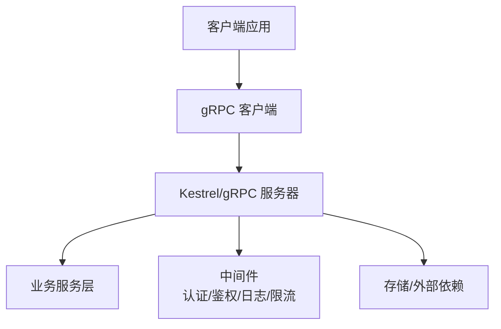
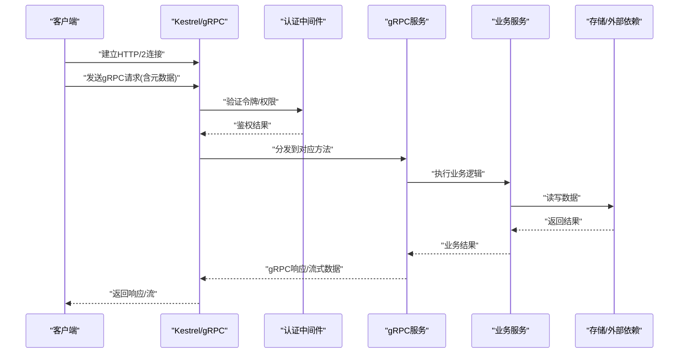
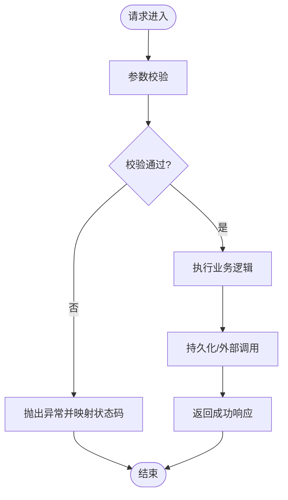
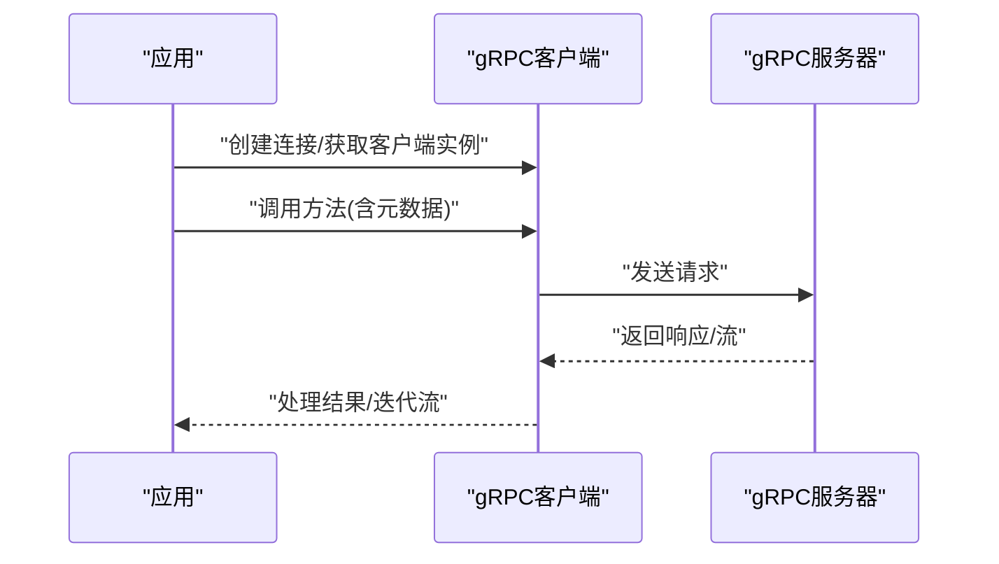
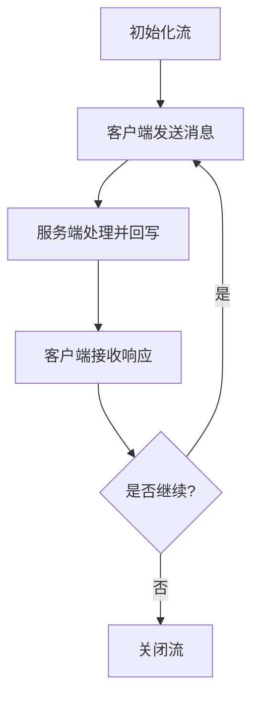
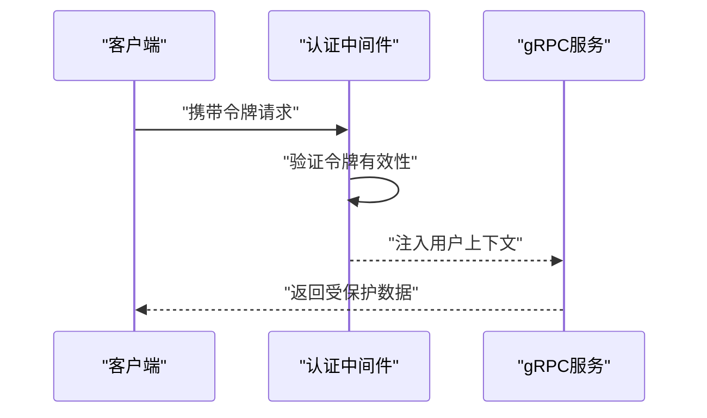
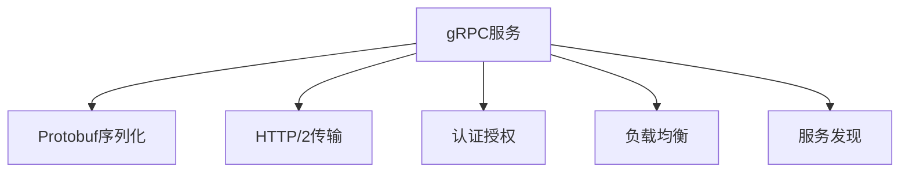

# gRPC通信

<cite>
**本文引用的文件**   
- [grpc_integration.cs](file://grpc_integration.cs)
- [grpc_protobufnet.cs](file://grpc_protobufnet.cs)
- [wolverinefx_grpc_integration.cs](file://wolverinefx_grpc_integration.cs)
- [mediatr_grpc_integration.cs](file://mediatr_grpc_integration.cs)
</cite>

## 目录
1. [简介](#简介)
2. [项目结构](#项目结构)
3. [核心组件](#核心组件)
4. [架构总览](#架构总览)
5. [详细组件分析](#详细组件分析)
6. [依赖关系分析](#依赖关系分析)
7. [性能考虑](#性能考虑)
8. [故障排查指南](#故障排查指南)
9. [结论](#结论)
10. [附录](#附录)

## 简介
本文件面向需要在ASP.NET Core中集成gRPC的开发者，围绕服务定义、Protobuf消息格式、客户端与服务端实现、双向流式通信、元数据传递、认证授权集成、性能优化、错误处理与调试、负载均衡与服务发现等主题进行系统化说明。文档以仓库中的gRPC相关示例为基础，结合通用最佳实践，帮助读者快速落地生产级gRPC方案。

## 项目结构
仓库中包含多个与gRPC相关的示例与集成文件，涵盖：
- 基础gRPC服务端/客户端集成
- 基于ProtobufNet的序列化适配
- 与Wolverine框架集成的gRPC示例
- 与MediatR集成的gRPC示例



[本图为概念性架构图，不直接映射具体源文件]

## 核心组件
- gRPC服务定义与Protobuf消息：通过.proto文件定义服务接口与消息类型，生成跨语言客户端/服务端代码。
- ASP.NET Core集成：使用内置gRPC支持，注册服务、配置端点、启用中间件。
- 客户端调用：使用生成的客户端或Channel创建连接，发起单向/流式调用。
- 双向流式通信：利用ServerStreamingClientResponse与ClientStreamingAsync等方法实现实时数据推送。
- 元数据传递：在请求头/响应头中携带上下文信息（如租户ID、追踪ID）。
- 认证授权：结合JWT/OAuth2、自定义认证中间件，对gRPC方法进行访问控制。
- 错误处理：统一异常映射、状态码约定、重试与熔断策略。
- 可观测性：分布式追踪、指标采集、结构化日志。

**章节来源**
- [grpc_integration.cs:1-200](file://grpc_integration.cs#L1-L200)
- [grpc_protobufnet.cs:1-200](file://grpc_protobufnet.cs#L1-L200)
- [wolverinefx_grpc_integration.cs:1-200](file://wolverinefx_grpc_integration.cs#L1-L200)
- [mediatr_grpc_integration.cs:1-200](file://mediatr_grpc_integration.cs#L1-L200)

## 架构总览
下图展示典型的gRPC在ASP.NET Core中的分层与交互：客户端通过HTTP/2与Kestrel建立连接，路由到gRPC服务，再进入业务层；认证、日志、限流等横切关注点通过中间件注入。



**图表来源**
- [grpc_integration.cs:1-200](file://grpc_integration.cs#L1-L200)
- [grpc_protobufnet.cs:1-200](file://grpc_protobufnet.cs#L1-L200)

**章节来源**
- [grpc_integration.cs:1-200](file://grpc_integration.cs#L1-L200)
- [grpc_protobufnet.cs:1-200](file://grpc_protobufnet.cs#L1-L200)

## 详细组件分析

### Protobuf消息与服务定义
- 建议将服务接口与消息类型拆分到独立.proto文件，便于多语言共享与版本管理。
- 字段编号稳定化，避免破坏性变更；新增字段采用可选语义。
- 使用枚举与嵌套消息组织复杂数据结构，提升可读性与扩展性。
- 为关键消息添加注释，辅助自动生成文档与校验规则。

```mermaid
classDiagram
class 用户 {
+字符串 id
+字符串 姓名
+字符串 邮箱
+时间戳 创建时间
}
class 订单 {
+字符串 id
+字符串 用户_id
+列表~商品~ 商品列表
+金额 总金额
+状态 订单状态
}
class 商品 {
+字符串 id
+字符串 名称
+数量 数量
+单价 单价
}
用户 ||--o{ 订单 : "拥有"
订单 ||--o{ 商品 : "包含"
```

[本图为概念性数据模型图，不直接映射具体源文件]

**章节来源**
- [grpc_integration.cs:1-200](file://grpc_integration.cs#L1-L200)
- [grpc_protobufnet.cs:1-200](file://grpc_protobufnet.cs#L1-L200)

### 服务端实现与ASP.NET Core集成
- 在服务启动时注册gRPC服务、配置端点与中间件管道。
- 使用依赖注入注入业务服务，保持服务层职责单一。
- 针对高吞吐场景启用连接池、线程池调优与内存池。
- 统一异常处理与状态码映射，确保客户端可正确解析错误。



**图表来源**
- [grpc_integration.cs:1-200](file://grpc_integration.cs#L1-L200)

**章节来源**
- [grpc_integration.cs:1-200](file://grpc_integration.cs#L1-L200)

### 客户端实现与调用模式
- 使用生成的客户端类或Channel创建连接，设置超时与重试策略。
- 对于流式调用，使用异步迭代器或事件驱动方式处理数据。
- 合理管理连接生命周期，避免频繁创建销毁导致资源抖动。
- 在客户端侧缓存DNS与服务发现结果，降低网络开销。



**图表来源**
- [grpc_integration.cs:1-200](file://grpc_integration.cs#L1-L200)

**章节来源**
- [grpc_integration.cs:1-200](file://grpc_integration.cs#L1-L200)

### 双向流式通信
- 适用于实时数据推送、聊天、监控等场景。
- 服务端按流式写入，客户端按流式读取，注意背压与缓冲控制。
- 使用取消令牌优雅关闭流，避免资源泄漏。
- 在流中传递元数据，如会话ID、追踪ID等。



**图表来源**
- [grpc_integration.cs:1-200](file://grpc_integration.cs#L1-L200)

**章节来源**
- [grpc_integration.cs:1-200](file://grpc_integration.cs#L1-L200)

### 元数据传递
- 在请求头中携带租户ID、用户ID、追踪ID等上下文信息。
- 服务端通过元数据提取上下文，用于日志记录与权限判断。
- 注意敏感信息的加密与脱敏，避免泄露。
- 客户端与服务端需保持一致的键名与编码规范。

**章节来源**
- [grpc_integration.cs:1-200](file://grpc_integration.cs#L1-L200)

### 认证授权集成
- 使用JWT或OAuth2对gRPC方法进行身份验证。
- 基于角色的访问控制（RBAC）或属性基访问控制（ABAC）限制方法访问。
- 在中间件中解析令牌并注入用户上下文。
- 对未认证请求返回明确的错误码与消息。



**图表来源**
- [grpc_integration.cs:1-200](file://grpc_integration.cs#L1-L200)

**章节来源**
- [grpc_integration.cs:1-200](file://grpc_integration.cs#L1-L200)

### 与Wolverine和MediatR集成
- Wolverine提供消息总线与编排能力，可与gRPC结合实现异步处理。
- MediatR简化命令/查询模式，便于在gRPC服务中解耦业务逻辑。
- 通过管道行为统一处理日志、事务、异常等横切关注点。

**章节来源**
- [wolverinefx_grpc_integration.cs:1-200](file://wolverinefx_grpc_integration.cs#L1-L200)
- [mediatr_grpc_integration.cs:1-200](file://mediatr_grpc_integration.cs#L1-L200)

## 依赖关系分析
- gRPC依赖于HTTP/2传输协议，需在ASP.NET Core中启用相应功能。
- Protobuf序列化库（如Google.Protobuf或ProtobufNet）用于消息编解码。
- 认证授权通常依赖Identity或第三方库（如OpenIddict）。
- 服务发现与负载均衡可通过Consul、Nacos或YARP实现。



**图表来源**
- [grpc_integration.cs:1-200](file://grpc_integration.cs#L1-L200)
- [grpc_protobufnet.cs:1-200](file://grpc_protobufnet.cs#L1-L200)

**章节来源**
- [grpc_integration.cs:1-200](file://grpc_integration.cs#L1-L200)
- [grpc_protobufnet.cs:1-200](file://grpc_protobufnet.cs#L1-L200)

## 性能考虑
- 连接复用：使用HttpClient或gRPC Channel池化连接，减少握手开销。
- 序列化优化：选择高效的Protobuf实现，避免不必要的字段复制。
- 流式处理：对大数据集采用流式传输，降低内存占用。
- 并发控制：合理设置线程池大小与I/O线程数，避免阻塞。
- 压缩：启用gzip压缩以减少带宽消耗，权衡CPU开销。
- 缓存：对热点数据进行本地或分布式缓存，减轻后端压力。

[本节为通用性能指导，不直接分析具体文件]

## 故障排查指南
- 日志记录：在中间件与服务层添加结构化日志，记录请求上下文与异常堆栈。
- 分布式追踪：集成OpenTelemetry或SkyAPM，跟踪跨服务调用链。
- 指标采集：暴露Prometheus指标，监控QPS、延迟、错误率等关键指标。
- 调试工具：使用gRPCurl或gRPC-Web测试工具验证接口连通性。
- 常见问题：连接超时、证书错误、序列化失败、权限拒绝等。

**章节来源**
- [grpc_integration.cs:1-200](file://grpc_integration.cs#L1-L200)

## 结论
通过在ASP.NET Core中集成gRPC，可实现高性能、跨语言的微服务通信。结合Protobuf、认证授权、流式通信与可观测性，能够构建健壮的生产级系统。建议遵循本文的最佳实践，持续优化性能与可维护性。

[本节为总结性内容，不直接分析具体文件]

## 附录
- 参考链接：gRPC官方文档、ASP.NET Core gRPC指南、Protobuf规范。
- 示例代码路径：见“本文引用的文件”部分。
- 部署建议：容器化部署、健康检查、滚动更新、灰度发布。

[本节为补充信息，不直接分析具体文件]