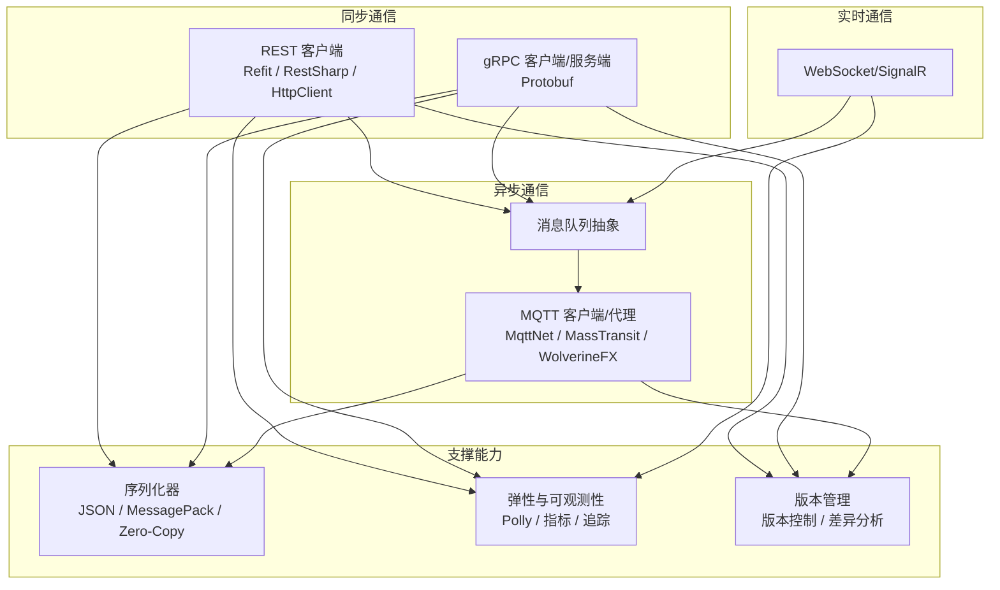
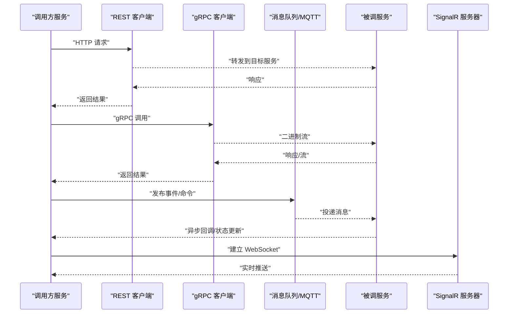
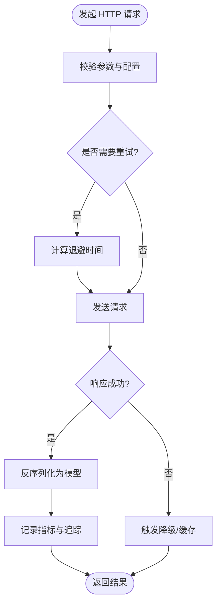
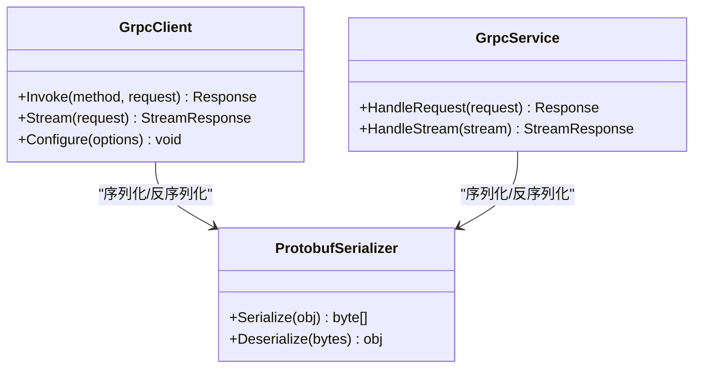
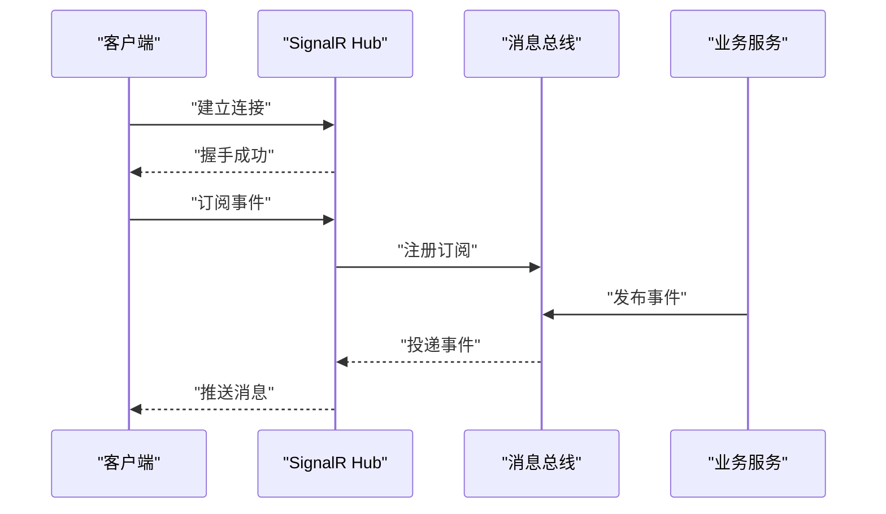
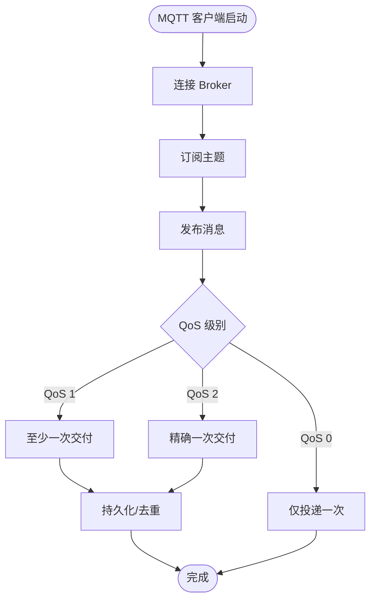
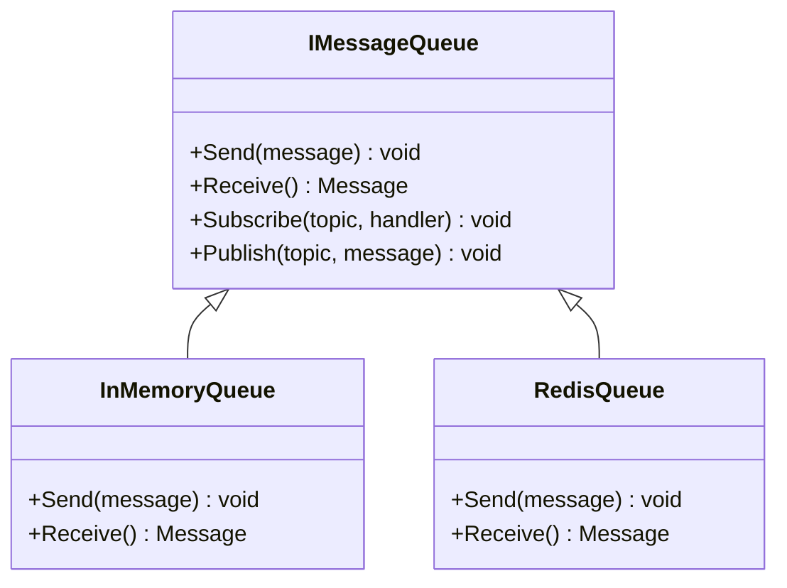
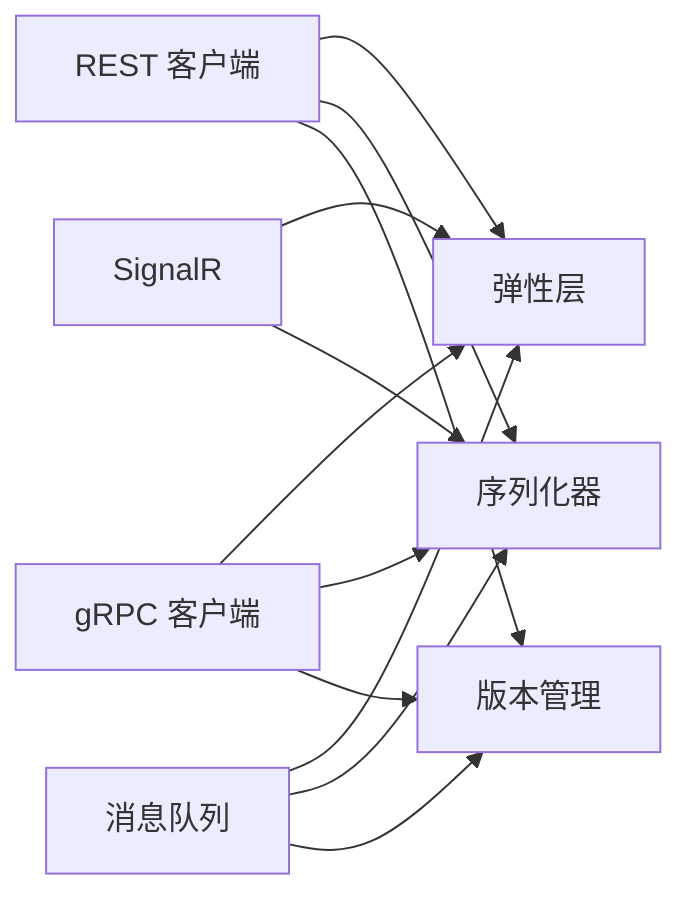
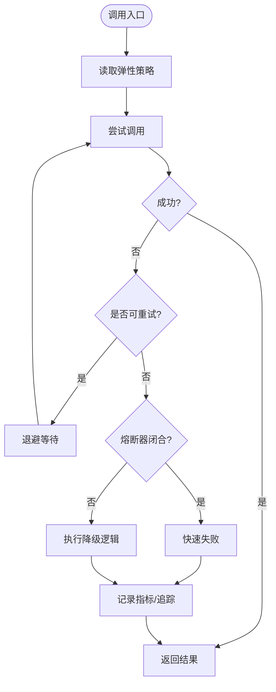
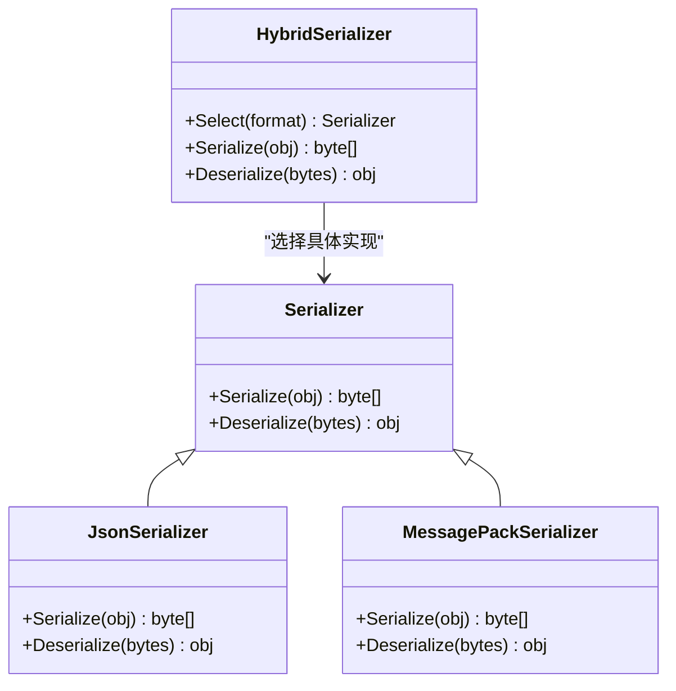

# 服务间通信

<cite>
**本文引用的文件**   
- [grpc_integration.cs](file://grpc_integration.cs)
- [grpc_protobufnet.cs](file://grpc_protobufnet.cs)
- [refit_integration.cs](file://refit_integration.cs)
- [restsharp_integration.cs](file://restsharp_integration.cs)
- [webapiclientcore_integration.cs](file://webapiclientcore_integration.cs)
- [signalr_integration.cs](file://signalr_integration.cs)
- [mqtt_integration.cs](file://mqtt_integration.cs)
- [mqttnet_demo.cs](file://mqttnet_demo.cs)
- [masstransit_mqttnet_integration.cs](file://masstransit_mqttnet_integration.cs)
- [wolverinefx_mqtt_integration_pubsub.cs](file://wolverinefx_mqtt_integration_pubsub.cs)
- [message_queue.cs](file://message_queue.cs)
- [message_queue_enhanced.cs](file://message_queue_enhanced.cs)
- [http_resilience_integration.cs](file://http_resilience_integration.cs)
- [http_resilience_advanced_integration.cs](file://http_resilience_advanced_integration.cs)
- [refit_resiliency.cs](file://refit_resiliency.cs)
- [restsharp_resiliency.cs](file://restsharp_resiliency.cs)
- [webapiclientcore_circuitbreaker.cs](file://webapiclientcore_circuitbreaker.cs)
- [webapiclientcore_circuitbreaker_enhanced.cs](file://webapiclientcore_circuitbreaker_enhanced.cs)
- [version_control_manager.cs](file://version_control_manager.cs)
- [version_diff_analyzer.cs](file://version_diff_analyzer.cs)
- [version_metadata_service.cs](file://version_metadata_service.cs)
- [inproc_json_serializer.cs](file://inproc_json_serializer.cs)
- [inproc_messagepack_serializer.cs](file://inproc_messagepack_serializer.cs)
- [hybrid_serializer.cs](file://hybrid_serializer.cs)
- [spanjson_serializer.cs](file://spanjson_serializer.cs)
- [zero_copy_serializer.cs](file://zero_copy_serializer.cs)
</cite>

## 目录
1. [简介](#简介)
2. [项目结构](#项目结构)
3. [核心组件](#核心组件)
4. [架构总览](#架构总览)
5. [详细组件分析](#详细组件分析)
6. [依赖关系分析](#依赖关系分析)
7. [性能考量](#性能考量)
8. [故障处理与弹性策略](#故障处理与弹性策略)
9. [序列化与协议版本管理](#序列化与协议版本管理)
10. [结论](#结论)

## 简介
本文件面向服务间通信机制，系统性梳理同步通信（gRPC、REST API）与异步通信（MQTT、消息队列）的实现方式，并结合仓库中的示例代码给出最佳实践。内容涵盖：
- HTTP 客户端最佳实践（连接复用、超时、重试、熔断、限流、指标与追踪）
- gRPC 服务定义与调用（Protobuf、双向流、错误码）
- WebSocket/SignalR 实时通信（长连接、广播、订阅）
- MQTT 协议集成（发布/订阅、QoS、主题路由、桥接）
- 性能对比、适用场景分析与故障处理策略
- 序列化格式选择、协议版本管理与兼容性保证

## 项目结构
仓库以“按能力/集成”组织示例文件，围绕通信相关的关键实现包括：
- 同步 REST：Refit、RestSharp、HttpClient 封装
- 同步 gRPC：gRPC 集成与 ProtobufNet
- 实时通信：SignalR（WebSocket）
- 异步消息：MQTT（原生、MqttNet、MassTransit、WolverineFX）、通用消息队列抽象
- 弹性与可观测性：Polly 集成、Resilience、指标与追踪
- 序列化与版本控制：JSON/MessagePack/Zero-Copy 序列化器，版本管理与差异分析

**图表来源**
- [refit_integration.cs](file://refit_integration.cs)
- [restsharp_integration.cs](file://restsharp_integration.cs)
- [webapiclientcore_integration.cs](file://webapiclientcore_integration.cs)
- [grpc_integration.cs](file://grpc_integration.cs)
- [signalr_integration.cs](file://signalr_integration.cs)
- [mqtt_integration.cs](file://mqtt_integration.cs)
- [mqttnet_demo.cs](file://mqttnet_demo.cs)
- [masstransit_mqttnet_integration.cs](file://masstransit_mqttnet_integration.cs)
- [wolverinefx_mqtt_integration_pubsub.cs](file://wolverinefx_mqtt_integration_pubsub.cs)
- [message_queue.cs](file://message_queue.cs)
- [inproc_json_serializer.cs](file://inproc_json_serializer.cs)
- [inproc_messagepack_serializer.cs](file://inproc_messagepack_serializer.cs)
- [hybrid_serializer.cs](file://hybrid_serializer.cs)
- [spanjson_serializer.cs](file://spanjson_serializer.cs)
- [zero_copy_serializer.cs](file://zero_copy_serializer.cs)
- [http_resilience_integration.cs](file://http_resilience_integration.cs)
- [http_resilience_advanced_integration.cs](file://http_resilience_advanced_integration.cs)
- [version_control_manager.cs](file://version_control_manager.cs)
- [version_diff_analyzer.cs](file://version_diff_analyzer.cs)
- [version_metadata_service.cs](file://version_metadata_service.cs)

**章节来源**
- [refit_integration.cs](file://refit_integration.cs)
- [restsharp_integration.cs](file://restsharp_integration.cs)
- [webapiclientcore_integration.cs](file://webapiclientcore_integration.cs)
- [grpc_integration.cs](file://grpc_integration.cs)
- [signalr_integration.cs](file://signalr_integration.cs)
- [mqtt_integration.cs](file://mqtt_integration.cs)
- [mqttnet_demo.cs](file://mqttnet_demo.cs)
- [masstransit_mqttnet_integration.cs](file://masstransit_mqttnet_integration.cs)
- [wolverinefx_mqtt_integration_pubsub.cs](file://wolverinefx_mqtt_integration_pubsub.cs)
- [message_queue.cs](file://message_queue.cs)

## 核心组件
- REST 客户端
  - Refit：类型安全的 HTTP 客户端，适合强契约的 REST 调用
  - RestSharp：灵活易用的 HTTP 客户端，支持自定义序列化与管道
  - HttpClient：底层高性能 HTTP 客户端，配合 Polly 实现弹性
- gRPC
  - 基于 Protobuf 的二进制序列化，高效、强类型、跨语言
  - 支持单向、双向流式传输
- 实时通信
  - SignalR：基于 WebSocket 的实时双向通信，适合推送与事件驱动 UI
- 异步消息
  - MQTT：轻量级发布/订阅协议，适合 IoT、边缘设备与高吞吐场景
  - 通用消息队列抽象：统一消息发送/接收接口，便于替换后端实现
- 序列化
  - JSON、MessagePack、SpanJson、Zero-Copy 等，兼顾兼容性与性能
- 弹性与可观测性
  - 重试、熔断、降级、限流、指标、分布式追踪
- 版本管理
  - 版本控制、差异分析、元数据服务，保障向后兼容

**章节来源**
- [refit_integration.cs](file://refit_integration.cs)
- [restsharp_integration.cs](file://restsharp_integration.cs)
- [webapiclientcore_integration.cs](file://webapiclientcore_integration.cs)
- [grpc_integration.cs](file://grpc_integration.cs)
- [signalr_integration.cs](file://signalr_integration.cs)
- [mqtt_integration.cs](file://mqtt_integration.cs)
- [message_queue.cs](file://message_queue.cs)
- [inproc_json_serializer.cs](file://inproc_json_serializer.cs)
- [inproc_messagepack_serializer.cs](file://inproc_messagepack_serializer.cs)
- [hybrid_serializer.cs](file://hybrid_serializer.cs)
- [spanjson_serializer.cs](file://spanjson_serializer.cs)
- [zero_copy_serializer.cs](file://zero_copy_serializer.cs)
- [http_resilience_integration.cs](file://http_resilience_integration.cs)
- [http_resilience_advanced_integration.cs](file://http_resilience_advanced_integration.cs)
- [version_control_manager.cs](file://version_control_manager.cs)
- [version_diff_analyzer.cs](file://version_diff_analyzer.cs)
- [version_metadata_service.cs](file://version_metadata_service.cs)

## 架构总览
下图展示典型的服务间通信架构：调用方通过 REST/gRPC 进行同步交互，通过 MQTT/消息队列进行异步解耦；SignalR 提供实时通道；所有通道均接入弹性与可观测性层，并由统一的序列化与版本管理策略保障兼容与性能。

**图表来源**
- [refit_integration.cs](file://refit_integration.cs)
- [restsharp_integration.cs](file://restsharp_integration.cs)
- [webapiclientcore_integration.cs](file://webapiclientcore_integration.cs)
- [grpc_integration.cs](file://grpc_integration.cs)
- [signalr_integration.cs](file://signalr_integration.cs)
- [mqtt_integration.cs](file://mqtt_integration.cs)
- [message_queue.cs](file://message_queue.cs)

## 详细组件分析

### REST 客户端最佳实践（Refit / RestSharp / HttpClient）
- 连接与生命周期
  - 使用单例 HttpClient 避免端口耗尽
  - 合理设置超时、连接池大小、Keep-Alive
- 弹性与容错
  - 重试（指数退避、抖动）、熔断（快速失败）、限流（令牌桶/漏桶）
  - 降级策略（缓存、默认值、空对象）
- 可观测性
  - 指标（延迟、吞吐、错误率）、分布式追踪（TraceId/SpanId）
- 序列化与压缩
  - 根据负载选择 JSON/MessagePack，必要时启用 gzip/brotli

**图表来源**
- [refit_integration.cs](file://refit_integration.cs)
- [restsharp_integration.cs](file://restsharp_integration.cs)
- [webapiclientcore_integration.cs](file://webapiclientcore_integration.cs)
- [http_resilience_integration.cs](file://http_resilience_integration.cs)
- [http_resilience_advanced_integration.cs](file://http_resilience_advanced_integration.cs)
- [refit_resiliency.cs](file://refit_resiliency.cs)
- [restsharp_resiliency.cs](file://restsharp_resiliency.cs)
- [webapiclientcore_circuitbreaker.cs](file://webapiclientcore_circuitbreaker.cs)
- [webapiclientcore_circuitbreaker_enhanced.cs](file://webapiclientcore_circuitbreaker_enhanced.cs)

**章节来源**
- [refit_integration.cs](file://refit_integration.cs)
- [restsharp_integration.cs](file://restsharp_integration.cs)
- [webapiclientcore_integration.cs](file://webapiclientcore_integration.cs)
- [http_resilience_integration.cs](file://http_resilience_integration.cs)
- [http_resilience_advanced_integration.cs](file://http_resilience_advanced_integration.cs)
- [refit_resiliency.cs](file://refit_resiliency.cs)
- [restsharp_resiliency.cs](file://restsharp_resiliency.cs)
- [webapiclientcore_circuitbreaker.cs](file://webapiclientcore_circuitbreaker.cs)
- [webapiclientcore_circuitbreaker_enhanced.cs](file://webapiclientcore_circuitbreaker_enhanced.cs)

### gRPC 服务定义与调用（Protobuf）
- 服务契约
  - 使用 .proto 定义服务方法与消息类型，确保跨语言一致性
- 调用模式
  - 单向 RPC、服务端流、客户端流、双向流
- 错误处理
  - 使用标准 gRPC 状态码与详情信息
- 性能优化
  - 二进制序列化、零拷贝、连接复用、批处理

**图表来源**
- [grpc_integration.cs](file://grpc_integration.cs)
- [grpc_protobufnet.cs](file://grpc_protobufnet.cs)

**章节来源**
- [grpc_integration.cs](file://grpc_integration.cs)
- [grpc_protobufnet.cs](file://grpc_protobufnet.cs)

### WebSocket 实时通信（SignalR）
- 连接管理
  - 自动重连、心跳检测、连接状态监控
- 消息模型
  - 强类型方法、事件总线、分组/用户/房间广播
- 扩展能力
  - 与消息队列集成（事件驱动）、持久化、鉴权

**图表来源**
- [signalr_integration.cs](file://signalr_integration.cs)

**章节来源**
- [signalr_integration.cs](file://signalr_integration.cs)

### MQTT 协议集成（发布/订阅）
- 连接与会话
  - 客户端连接、遗嘱消息、保留消息、会话持久化
- QoS 与可靠性
  - QoS 0/1/2 的选择与权衡
- 主题路由
  - 层级主题、通配符、过滤与路由规则
- 集成框架
  - MqttNet、MassTransit、WolverineFX 等

**图表来源**
- [mqtt_integration.cs](file://mqtt_integration.cs)
- [mqttnet_demo.cs](file://mqttnet_demo.cs)
- [masstransit_mqttnet_integration.cs](file://masstransit_mqttnet_integration.cs)
- [wolverinefx_mqtt_integration_pubsub.cs](file://wolverinefx_mqtt_integration_pubsub.cs)

**章节来源**
- [mqtt_integration.cs](file://mqtt_integration.cs)
- [mqttnet_demo.cs](file://mqttnet_demo.cs)
- [masstransit_mqttnet_integration.cs](file://masstransit_mqttnet_integration.cs)
- [wolverinefx_mqtt_integration_pubsub.cs](file://wolverinefx_mqtt_integration_pubsub.cs)

### 消息队列抽象（通用）
- 设计目标
  - 统一发送/接收接口，屏蔽不同后端实现细节
- 功能特性
  - 可靠投递、顺序性、死信队列、重试与补偿
- 扩展点
  - 插件化后端（内存、Redis、Kafka、RabbitMQ 等）

**图表来源**
- [message_queue.cs](file://message_queue.cs)
- [message_queue_enhanced.cs](file://message_queue_enhanced.cs)

**章节来源**
- [message_queue.cs](file://message_queue.cs)
- [message_queue_enhanced.cs](file://message_queue_enhanced.cs)

## 依赖关系分析
- 低耦合
  - 各通信组件通过接口或抽象类解耦，便于替换与测试
- 横向能力
  - 弹性、可观测性、序列化、版本管理作为横切关注点，贯穿所有通信路径
- 外部依赖
  - HTTP 库、gRPC 运行时、SignalR、MQTT 客户端、消息中间件

**图表来源**
- [refit_integration.cs](file://refit_integration.cs)
- [restsharp_integration.cs](file://restsharp_integration.cs)
- [webapiclientcore_integration.cs](file://webapiclientcore_integration.cs)
- [grpc_integration.cs](file://grpc_integration.cs)
- [signalr_integration.cs](file://signalr_integration.cs)
- [mqtt_integration.cs](file://mqtt_integration.cs)
- [message_queue.cs](file://message_queue.cs)
- [http_resilience_integration.cs](file://http_resilience_integration.cs)
- [http_resilience_advanced_integration.cs](file://http_resilience_advanced_integration.cs)
- [inproc_json_serializer.cs](file://inproc_json_serializer.cs)
- [inproc_messagepack_serializer.cs](file://inproc_messagepack_serializer.cs)
- [hybrid_serializer.cs](file://hybrid_serializer.cs)
- [spanjson_serializer.cs](file://spanjson_serializer.cs)
- [zero_copy_serializer.cs](file://zero_copy_serializer.cs)
- [version_control_manager.cs](file://version_control_manager.cs)
- [version_diff_analyzer.cs](file://version_diff_analyzer.cs)
- [version_metadata_service.cs](file://version_metadata_service.cs)

**章节来源**
- [refit_integration.cs](file://refit_integration.cs)
- [restsharp_integration.cs](file://restsharp_integration.cs)
- [webapiclientcore_integration.cs](file://webapiclientcore_integration.cs)
- [grpc_integration.cs](file://grpc_integration.cs)
- [signalr_integration.cs](file://signalr_integration.cs)
- [mqtt_integration.cs](file://mqtt_integration.cs)
- [message_queue.cs](file://message_queue.cs)
- [http_resilience_integration.cs](file://http_resilience_integration.cs)
- [http_resilience_advanced_integration.cs](file://http_resilience_advanced_integration.cs)
- [inproc_json_serializer.cs](file://inproc_json_serializer.cs)
- [inproc_messagepack_serializer.cs](file://inproc_messagepack_serializer.cs)
- [hybrid_serializer.cs](file://hybrid_serializer.cs)
- [spanjson_serializer.cs](file://spanjson_serializer.cs)
- [zero_copy_serializer.cs](file://zero_copy_serializer.cs)
- [version_control_manager.cs](file://version_control_manager.cs)
- [version_diff_analyzer.cs](file://version_diff_analyzer.cs)
- [version_metadata_service.cs](file://version_metadata_service.cs)

## 性能考量
- 序列化开销
  - JSON：通用性强，解析开销中等
  - MessagePack：二进制紧凑，解析更快
  - SpanJson/Zero-Copy：极致性能，适合热点路径
- 网络传输
  - gRPC：二进制、HTTP/2 多路复用，低延迟高吞吐
  - REST：广泛兼容，易于调试与网关集成
  - MQTT：轻量协议，适合高并发与弱网环境
- 连接与缓冲
  - 连接池、缓冲区复用、批量发送、背压控制
- 资源与监控
  - CPU/内存占用、GC 压力、线程池饱和、端到端延迟分布

[本节为通用指导，不直接分析具体文件]

## 故障处理与弹性策略
- 重试与退避
  - 幂等性检查、指数退避、抖动、最大重试次数
- 熔断与降级
  - 快速失败、隔离舱、默认响应、缓存回退
- 限流与削峰
  - 令牌桶/漏桶、滑动窗口、队列长度限制
- 死信与补偿
  - 不可恢复消息入死信队列、人工干预、补偿事务
- 可观测性
  - 指标（成功率、延迟、错误码分布）、分布式追踪、日志关联

**图表来源**
- [http_resilience_integration.cs](file://http_resilience_integration.cs)
- [http_resilience_advanced_integration.cs](file://http_resilience_advanced_integration.cs)
- [refit_resiliency.cs](file://refit_resiliency.cs)
- [restsharp_resiliency.cs](file://restsharp_resiliency.cs)
- [webapiclientcore_circuitbreaker.cs](file://webapiclientcore_circuitbreaker.cs)
- [webapiclientcore_circuitbreaker_enhanced.cs](file://webapiclientcore_circuitbreaker_enhanced.cs)

**章节来源**
- [http_resilience_integration.cs](file://http_resilience_integration.cs)
- [http_resilience_advanced_integration.cs](file://http_resilience_advanced_integration.cs)
- [refit_resiliency.cs](file://refit_resiliency.cs)
- [restsharp_resiliency.cs](file://restsharp_resiliency.cs)
- [webapiclientcore_circuitbreaker.cs](file://webapiclientcore_circuitbreaker.cs)
- [webapiclientcore_circuitbreaker_enhanced.cs](file://webapiclientcore_circuitbreaker_enhanced.cs)

## 序列化与协议版本管理
- 序列化选型
  - JSON：生态完善、人类可读
  - MessagePack：二进制高效、跨语言
  - SpanJson/Zero-Copy：极致性能、零分配
  - 混合策略：根据场景动态选择
- 版本管理
  - 版本字段、兼容性矩阵、向后兼容原则
  - 差异分析工具、元数据服务、灰度发布
- 兼容性保证
  - 弃用字段标记、默认值策略、迁移脚本

**图表来源**
- [inproc_json_serializer.cs](file://inproc_json_serializer.cs)
- [inproc_messagepack_serializer.cs](file://inproc_messagepack_serializer.cs)
- [hybrid_serializer.cs](file://hybrid_serializer.cs)
- [spanjson_serializer.cs](file://spanjson_serializer.cs)
- [zero_copy_serializer.cs](file://zero_copy_serializer.cs)
- [version_control_manager.cs](file://version_control_manager.cs)
- [version_diff_analyzer.cs](file://version_diff_analyzer.cs)
- [version_metadata_service.cs](file://version_metadata_service.cs)

**章节来源**
- [inproc_json_serializer.cs](file://inproc_json_serializer.cs)
- [inproc_messagepack_serializer.cs](file://inproc_messagepack_serializer.cs)
- [hybrid_serializer.cs](file://hybrid_serializer.cs)
- [spanjson_serializer.cs](file://spanjson_serializer.cs)
- [zero_copy_serializer.cs](file://zero_copy_serializer.cs)
- [version_control_manager.cs](file://version_control_manager.cs)
- [version_diff_analyzer.cs](file://version_diff_analyzer.cs)
- [version_metadata_service.cs](file://version_metadata_service.cs)

## 结论
- 同步通信（REST/gRPC）适用于强一致、低延迟的调用场景；REST 更通用，gRPC 更高效
- 异步通信（MQTT/消息队列）适用于解耦、削峰、最终一致与高吞吐场景
- 实时通信（SignalR）适合需要双向、低延迟推送的场景
- 弹性与可观测性是系统稳定性的关键，应贯穿所有通信路径
- 序列化与版本管理直接影响性能与兼容性，需结合场景选择并持续演进

[本节为总结性内容，不直接分析具体文件]