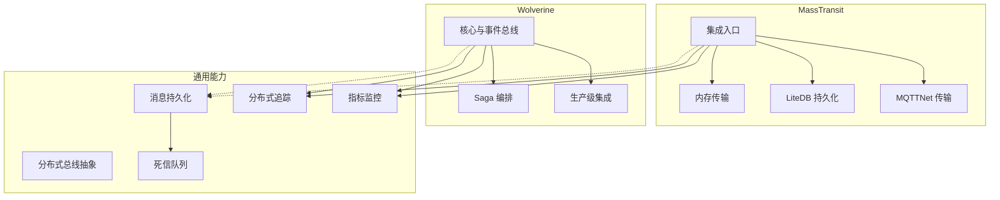
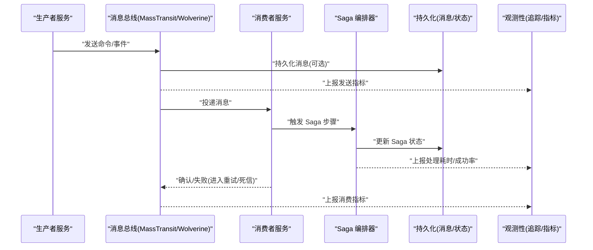
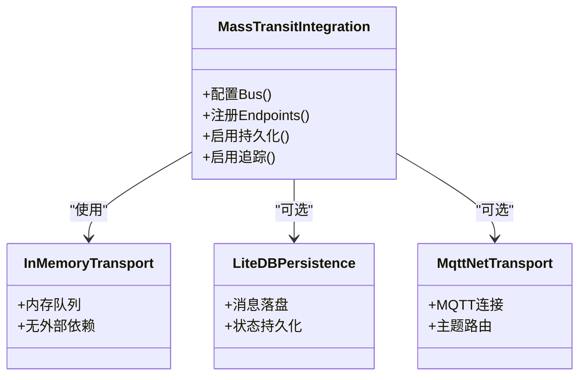
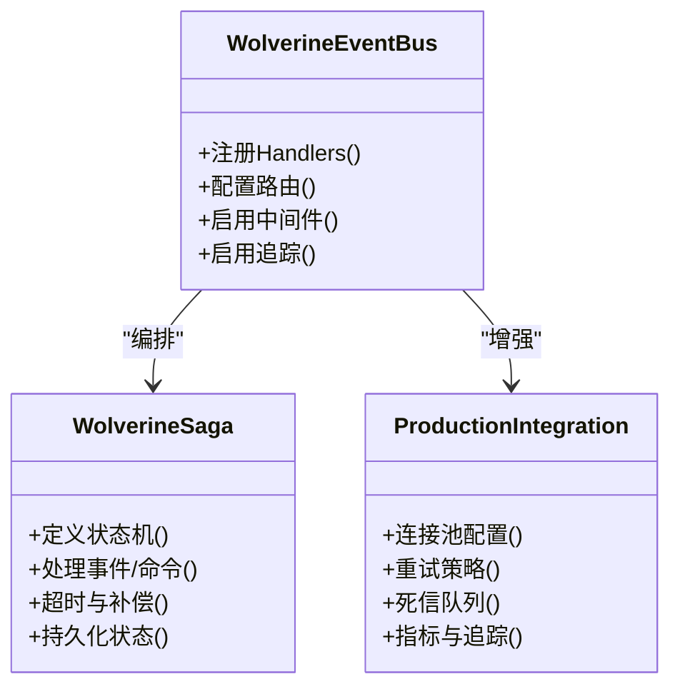
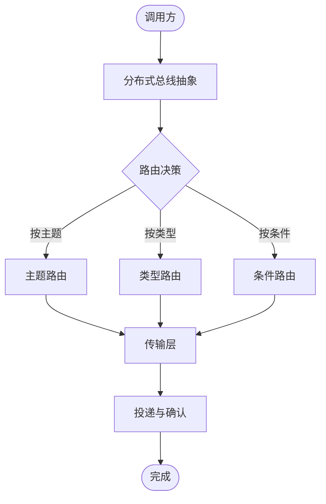
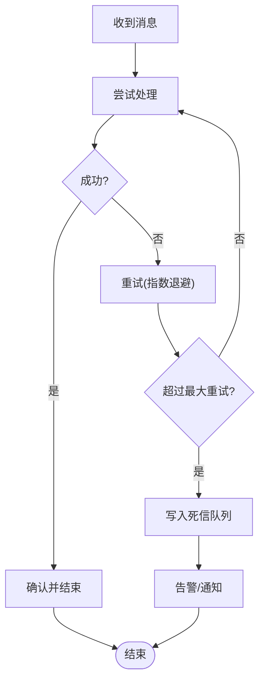
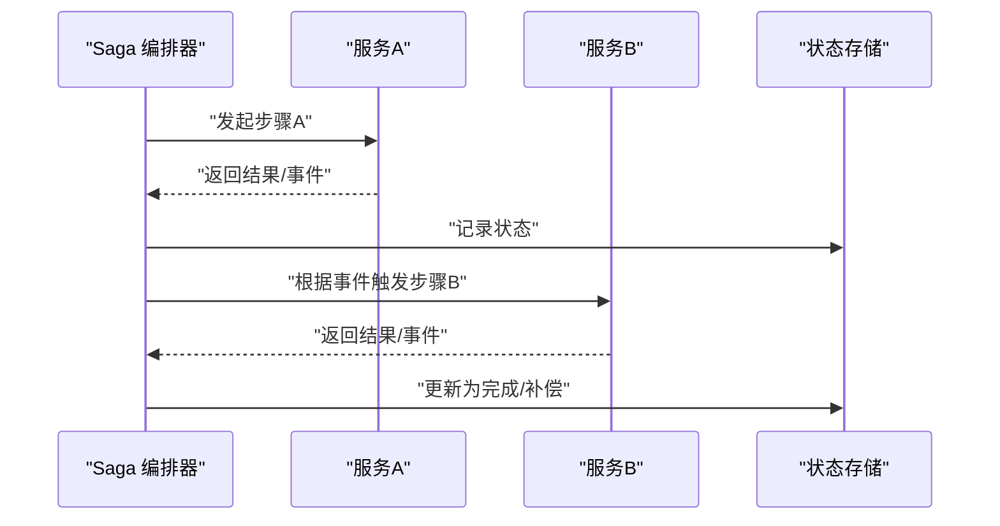
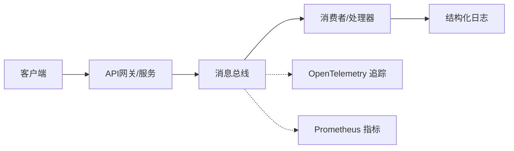
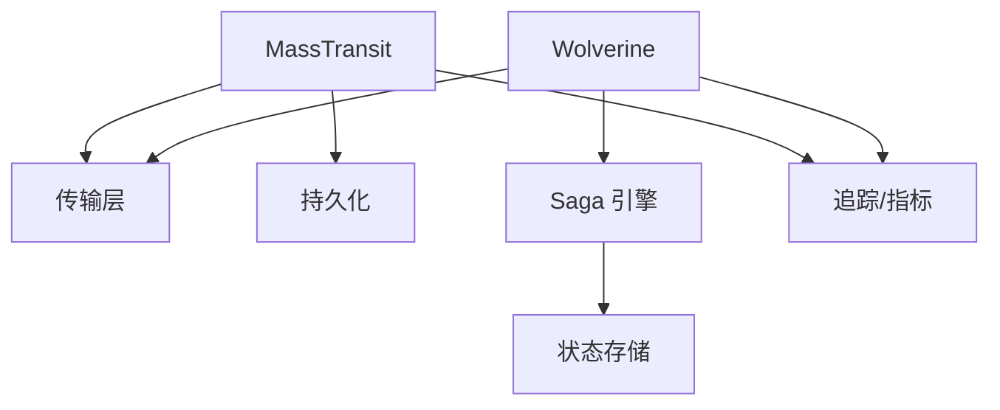

# 消息总线通信

<cite>
**本文引用的文件**   
- [masstransit_integration.cs](file://masstransit_integration.cs)
- [masstransit_inmemory_integration.cs](file://masstransit_inmemory_integration.cs)
- [masstransit_litedb_integration.cs](file://masstransit_litedb_integration.cs)
- [masstransit_mqttnet_integration.cs](file://masstransit_mqttnet_integration.cs)
- [wolverine.cs](file://wolverine.cs)
- [wolverine_event_bus.cs](file://wolverine_event_bus.cs)
- [wolverine_saga.cs](file://wolverine_saga.cs)
- [wolverinefx_production_integration.cs](file://wolverinefx_production_integration.cs)
- [distributed_bus.cs](file://distributed_bus.cs)
- [dead_letter.cs](file://dead_letter.cs)
- [message_persistence.cs](file://message_persistence.cs)
- [saga_orchestrator.cs](file://saga_orchestration.cs)
- [distributed_tracing.cs](file://distributed_tracing.cs)
- [metrics_monitoring.cs](file://metrics_monitoring.cs)
</cite>

## 目录
1. [简介](#简介)
2. [项目结构](#项目结构)
3. [核心组件](#核心组件)
4. [架构总览](#架构总览)
5. [详细组件分析](#详细组件分析)
6. [依赖关系分析](#依赖关系分析)
7. [性能考量](#性能考量)
8. [故障排查指南](#故障排查指南)
9. [结论](#结论)
10. [附录](#附录)

## 简介
本文件面向在分布式系统中使用消息总线进行服务解耦、事件编排与跨进程通信的工程师，聚焦于 MassTransit 与 Wolverine 两大框架在本仓库中的实践。内容覆盖：
- 消息路由与发布/订阅
- 事件编排与 Saga 模式
- 分布式事务与一致性保障
- 消息持久化、死信队列与重试机制
- 性能监控、追踪调试与容量规划
- 典型业务场景的消息流转设计与错误处理策略

## 项目结构
仓库中包含大量与消息总线相关的示例与集成代码，重点涉及：
- MassTransit 系列：内存、LiteDB、MQTTNet 等传输与持久化方案
- Wolverine 系列：事件总线、Saga、生产级配置与多传输集成
- 通用能力：分布式总线抽象、消息持久化、死信队列、分布式追踪与指标监控

图表来源
- [masstransit_integration.cs](file://masstransit_integration.cs)
- [masstransit_inmemory_integration.cs](file://masstransit_inmemory_integration.cs)
- [masstransit_litedb_integration.cs](file://masstransit_litedb_integration.cs)
- [masstransit_mqttnet_integration.cs](file://masstransit_mqttnet_integration.cs)
- [wolverine_event_bus.cs](file://wolverine_event_bus.cs)
- [wolverine_saga.cs](file://wolverine_saga.cs)
- [wolverinefx_production_integration.cs](file://wolverinefx_production_integration.cs)
- [distributed_bus.cs](file://distributed_bus.cs)
- [message_persistence.cs](file://message_persistence.cs)
- [dead_letter.cs](file://dead_letter.cs)
- [distributed_tracing.cs](file://distributed_tracing.cs)
- [metrics_monitoring.cs](file://metrics_monitoring.cs)

章节来源
- [masstransit_integration.cs](file://masstransit_integration.cs)
- [wolverine_event_bus.cs](file://wolverine_event_bus.cs)
- [distributed_bus.cs](file://distributed_bus.cs)

## 核心组件
- 消息总线抽象与接入点
  - MassTransit 提供统一的 Bus/Endpoint 模型，支持多种传输（内存、RabbitMQ、Kafka、MQTT 等）与持久化存储（LiteDB、SQL 等）。
  - Wolverine 以“命令/事件”为核心，内置强类型路由、内建 Saga 编排与可插拔传输层。
- 事件编排与 Saga
  - 通过状态机或工作流编排跨服务的长事务，保证最终一致性与幂等性。
- 可靠性与容错
  - 重试策略、退避算法、死信队列、补偿动作与告警。
- 观测性
  - OpenTelemetry 追踪、Prometheus 指标、结构化日志与链路 ID 透传。

章节来源
- [masstransit_integration.cs](file://masstransit_integration.cs)
- [wolverine_event_bus.cs](file://wolverine_event_bus.cs)
- [saga_orchestrator.cs](file://saga_orchestration.cs)
- [dead_letter.cs](file://dead_letter.cs)
- [distributed_tracing.cs](file://distributed_tracing.cs)
- [metrics_monitoring.cs](file://metrics_monitoring.cs)

## 架构总览
下图展示生产者、消息总线、消费者与 Saga 编排器之间的交互，以及追踪与指标采集点。

图表来源
- [masstransit_integration.cs](file://masstransit_integration.cs)
- [wolverine_event_bus.cs](file://wolverine_event_bus.cs)
- [wolverine_saga.cs](file://wolverine_saga.cs)
- [message_persistence.cs](file://message_persistence.cs)
- [dead_letter.cs](file://dead_letter.cs)
- [distributed_tracing.cs](file://distributed_tracing.cs)
- [metrics_monitoring.cs](file://metrics_monitoring.cs)

## 详细组件分析

### MassTransit 集成与传输
- 内存传输：适合本地开发与单元测试，零外部依赖，快速验证路由与处理器逻辑。
- LiteDB 持久化：将消息与端点状态落盘，便于回放与审计。
- MQTTNet 传输：适用于 IoT/边缘设备到云端的轻量消息通道。

图表来源
- [masstransit_integration.cs](file://masstransit_integration.cs)
- [masstransit_inmemory_integration.cs](file://masstransit_inmemory_integration.cs)
- [masstransit_litedb_integration.cs](file://masstransit_litedb_integration.cs)
- [masstransit_mqttnet_integration.cs](file://masstransit_mqttnet_integration.cs)

章节来源
- [masstransit_integration.cs](file://masstransit_integration.cs)
- [masstransit_inmemory_integration.cs](file://masstransit_inmemory_integration.cs)
- [masstransit_litedb_integration.cs](file://masstransit_litedb_integration.cs)
- [masstransit_mqttnet_integration.cs](file://masstransit_mqttnet_integration.cs)

### Wolverine 事件总线与 Saga
- 事件总线：强类型路由、自动发现处理器、内建中间件管道。
- Saga：声明式状态机，支持超时、补偿、分支与聚合。
- 生产级集成：连接池、背压、重试、死信、追踪与指标。

图表来源
- [wolverine_event_bus.cs](file://wolverine_event_bus.cs)
- [wolverine_saga.cs](file://wolverine_saga.cs)
- [wolverinefx_production_integration.cs](file://wolverinefx_production_integration.cs)

章节来源
- [wolverine_event_bus.cs](file://wolverine_event_bus.cs)
- [wolverine_saga.cs](file://wolverine_saga.cs)
- [wolverinefx_production_integration.cs](file://wolverinefx_production_integration.cs)

### 分布式总线抽象
- 统一抽象：屏蔽底层传输差异，向上暴露一致的发送/订阅接口。
- 扩展点：自定义传输、序列化、路由策略与拦截器。

图表来源
- [distributed_bus.cs](file://distributed_bus.cs)

章节来源
- [distributed_bus.cs](file://distributed_bus.cs)

### 消息持久化与死信队列
- 持久化：确保消息不丢失，支持重放与审计；结合 Saga 状态持久化实现可恢复流程。
- 死信队列：对不可重试或多次失败的消息隔离，配合告警与人工干预。

图表来源
- [message_persistence.cs](file://message_persistence.cs)
- [dead_letter.cs](file://dead_letter.cs)

章节来源
- [message_persistence.cs](file://message_persistence.cs)
- [dead_letter.cs](file://dead_letter.cs)

### Saga 编排与分布式事务
- 编排模式：基于事件的 Saga 驱动，跨服务协调业务流程。
- 一致性：通过补偿与回滚保证最终一致；必要时结合 TCC/XA（视后端能力）。
- 幂等：消息去重与状态检查避免重复执行。

图表来源
- [saga_orchestrator.cs](file://saga_orchestration.cs)
- [wolverine_saga.cs](file://wolverine_saga.cs)

章节来源
- [saga_orchestrator.cs](file://saga_orchestration.cs)
- [wolverine_saga.cs](file://wolverine_saga.cs)

### 追踪与监控
- 分布式追踪：注入 TraceId/SpanId，串联跨服务调用链。
- 指标监控：吞吐、延迟、错误率、队列深度、重试次数等关键指标。
- 日志关联：结构化日志携带上下文，便于问题定位。

图表来源
- [distributed_tracing.cs](file://distributed_tracing.cs)
- [metrics_monitoring.cs](file://metrics_monitoring.cs)

章节来源
- [distributed_tracing.cs](file://distributed_tracing.cs)
- [metrics_monitoring.cs](file://metrics_monitoring.cs)

## 依赖关系分析
- 组件耦合
  - MassTransit/Wolverine 作为总线核心，依赖传输层与持久化存储。
  - Saga 编排器依赖状态存储与事件源。
  - 观测性模块通过 SDK/中间件接入，低侵入。
- 外部依赖
  - 传输：内存、MQTT、RabbitMQ、Kafka 等。
  - 存储：LiteDB、关系型数据库、对象存储（用于附件/大消息）。
- 潜在循环依赖
  - 通过事件解耦避免直接服务间调用，降低循环风险。

图表来源
- [masstransit_integration.cs](file://masstransit_integration.cs)
- [wolverine_event_bus.cs](file://wolverine_event_bus.cs)
- [wolverine_saga.cs](file://wolverine_saga.cs)
- [message_persistence.cs](file://message_persistence.cs)
- [distributed_tracing.cs](file://distributed_tracing.cs)
- [metrics_monitoring.cs](file://metrics_monitoring.cs)

章节来源
- [masstransit_integration.cs](file://masstransit_integration.cs)
- [wolverine_event_bus.cs](file://wolverine_event_bus.cs)
- [wolverine_saga.cs](file://wolverine_saga.cs)
- [message_persistence.cs](file://message_persistence.cs)
- [distributed_tracing.cs](file://distributed_tracing.cs)
- [metrics_monitoring.cs](file://metrics_monitoring.cs)

## 性能考量
- 吞吐与延迟
  - 批量发送/消费、异步 I/O、连接池与线程池调优。
  - 合理分区与分片，避免热点队列。
- 资源控制
  - 背压与限流，防止下游过载。
  - 消息大小限制与压缩策略。
- 存储与网络
  - 选择合适传输与序列化格式（如 Protobuf/MessagePack）。
  - 持久化开关与 WAL/索引优化。
- 观测与容量规划
  - 基于指标与追踪识别瓶颈，制定扩容与降级策略。

[本节为通用指导，不直接分析具体文件]

## 故障排查指南
- 常见问题
  - 消息堆积：检查消费者处理能力、重试策略与死信队列。
  - 重复消费：确保幂等键与去重逻辑。
  - 顺序性：单分区/单队列消费，或使用有序路由。
  - 链路中断：追踪断点、重试风暴与超时设置。
- 诊断手段
  - 查看死信队列与异常堆栈。
  - 通过追踪 ID 定位跨服务调用链。
  - 观察指标曲线（吞吐、延迟、错误率、队列长度）。
- 修复建议
  - 调整重试退避与最大重试次数。
  - 增加消费者实例或水平扩展。
  - 引入熔断与降级保护。

章节来源
- [dead_letter.cs](file://dead_letter.cs)
- [distributed_tracing.cs](file://distributed_tracing.cs)
- [metrics_monitoring.cs](file://metrics_monitoring.cs)

## 结论
本仓库提供了 MassTransit 与 Wolverine 在消息总线领域的完整实践路径：从基础路由与发布/订阅，到 Saga 编排与分布式事务，再到持久化、死信队列、重试与观测性。通过合理的架构设计与工程化实践，可在复杂分布式系统中实现高可靠、可扩展且可观测的消息通信体系。

[本节为总结性内容，不直接分析具体文件]

## 附录
- 术语表
  - 消息总线：跨进程/服务间的异步通信基础设施。
  - Saga：一种编排长事务的模式，通过事件与补偿保证最终一致。
  - 死信队列：存放无法处理或多次重试失败的消息。
  - 追踪：记录请求在系统中的完整调用链。
- 参考实践
  - 订单创建：下单 -> 库存扣减 -> 支付 -> 发货 -> 通知。
  - 设备上报：设备 -> MQTT -> 清洗/聚合 -> 规则引擎 -> 告警/存储。

[本节为概念性内容，不直接分析具体文件]