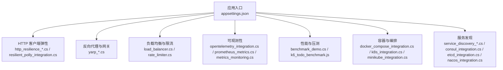
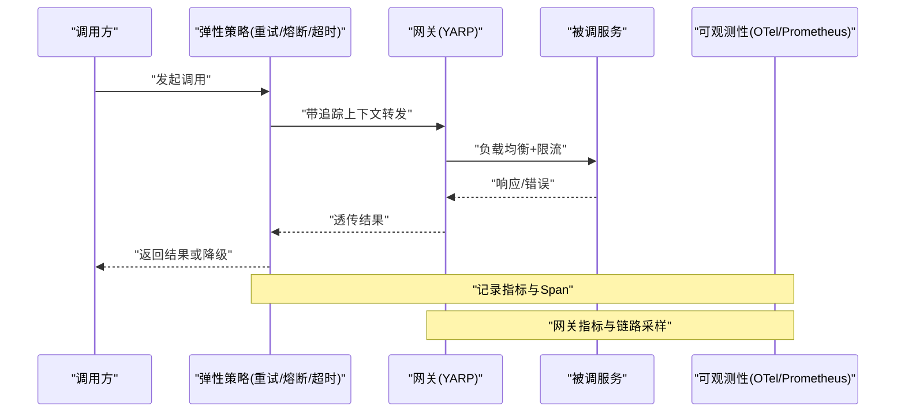
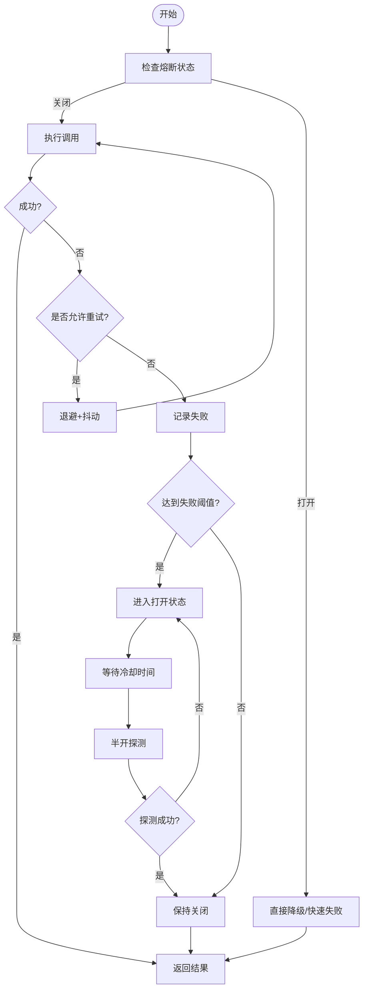
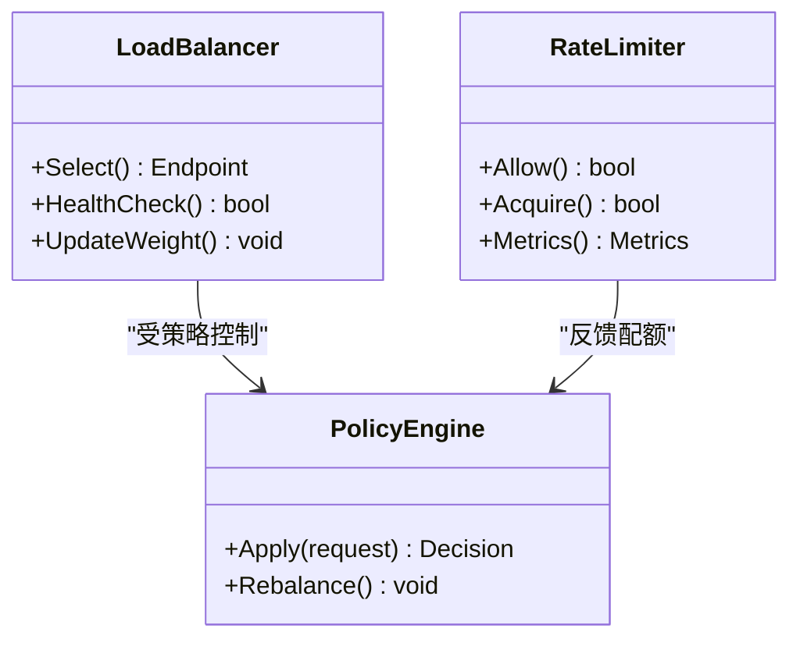
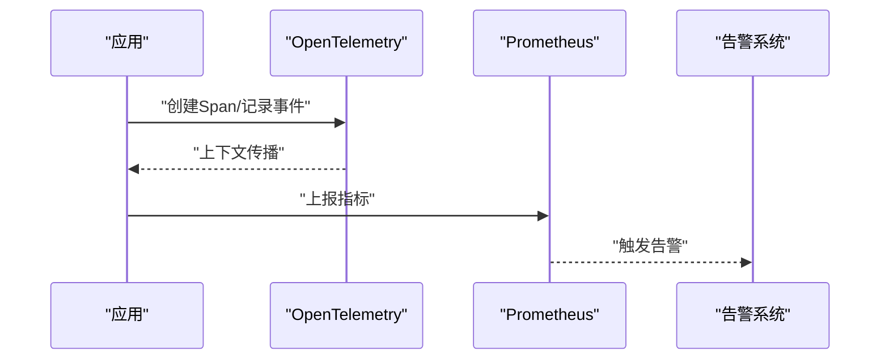
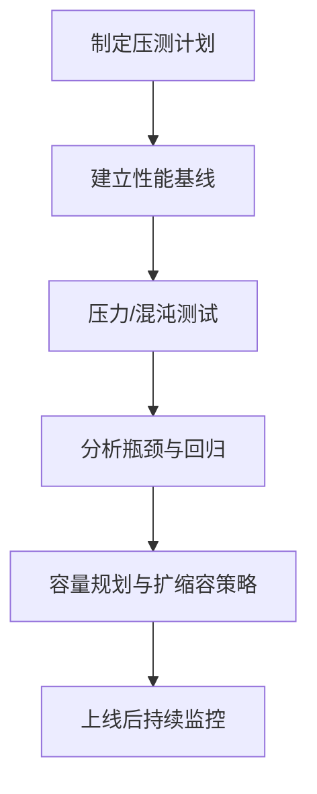
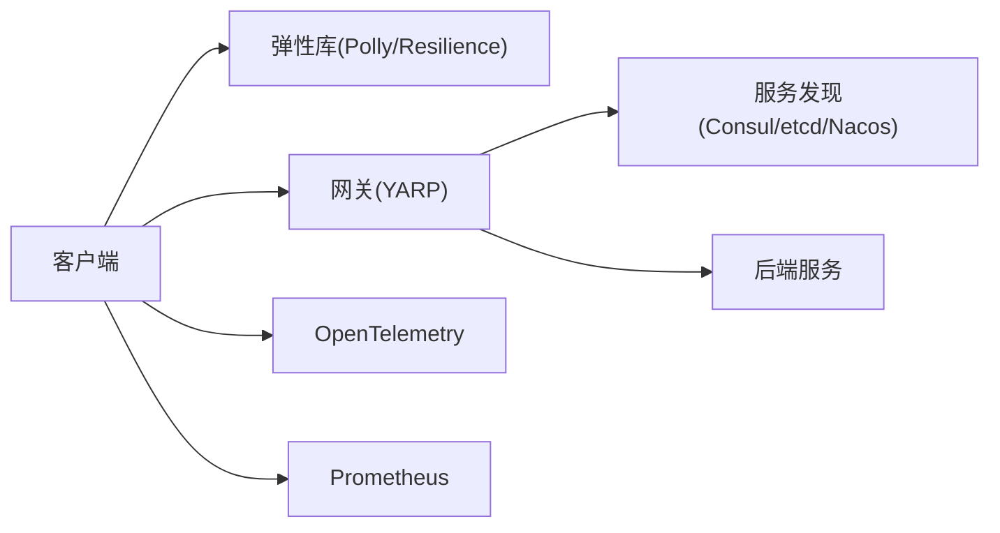

# 通信模式与最佳实践

<cite>
**本文引用的文件**   
- [README.md](file://README.md)
- [Directory.Build.props](file://Directory.Build.props)
- [Directory.Packages.props](file://Directory.Packages.props)
- [global.json](file://global.json)
- [appsettings.json](file://appsettings.json)
- [http_resilience_integration.cs](file://http_resilience_integration.cs)
- [http_resilience_advanced_integration.cs](file://http_resilience_advanced_integration.cs)
- [resilient_polly_integration.cs](file://resilient_polly_integration.cs)
- [webapiclientcore_circuitbreaker.cs](file://webapiclientcore_circuitbreaker.cs)
- [webapiclientcore_circuitbreaker_enhanced.cs](file://webapiclientcore_circuitbreaker_enhanced.cs)
- [restsharp_resiliency.cs](file://restsharp_resiliency.cs)
- [refit_resiliency.cs](file://refit_resiliency.cs)
- [yarp_circuit_breaker.cs](file://yarp_circuit_breaker.cs)
- [load_balancer.cs](file://load_balancer.cs)
- [rate_limiter.cs](file://rate_limiter.cs)
- [distributed_tracing.cs](file://distributed_tracing.cs)
- [distributed_tracing_enhanced.cs](file://distributed_tracing_enhanced.cs)
- [opentelemetry_integration.cs](file://opentelemetry_integration.cs)
- [prometheus_metrics.cs](file://prometheus_metrics.cs)
- [metrics_monitoring.cs](file://metrics_monitoring.cs)
- [performance_metrics.cs](file://performance_metrics.cs)
- [tail_latency_optimizer.cs](file://tail_latency_optimizer.cs)
- [jitter_algorithm_production.cs](file://jitter_algorithm_production.cs)
- [chaos_integration.cs](file://chaos_integration.cs)
- [k6_todo_benchmark.js](file://k6_todo_benchmark.js)
- [benchmark_demo.cs](file://benchmark_demo.cs)
- [docker_compose_integration.cs](file://docker_compose_integration.cs)
- [k8s_integration.cs](file://k8s_integration.cs)
- [minikube_integration.cs](file://minikube_integration.cs)
- [service_discovery_integration.cs](file://service_discovery_integration.cs)
- [service_discovery_advanced_integration.cs](file://service_discovery_advanced_integration.cs)
- [consul_integration.cs](file://consul_integration.cs)
- [etcd_integration.cs](file://etcd_integration.cs)
- [nacos_integration.cs](file://nacos_integration.cs)
- [signalr_production.cs](file://signalr_production.cs)
- [signalr_advanced.cs](file://signalr_advanced.cs)
- [signalr_monitoring.cs](file://signalr_monitoring.cs)
- [aspnet.ubuntu2204](file://aspnet.ubuntu2204)
</cite>

## 目录
1. [简介](#简介)
2. [项目结构](#项目结构)
3. [核心组件](#核心组件)
4. [架构总览](#架构总览)
5. [详细组件分析](#详细组件分析)
6. [依赖关系分析](#依赖关系分析)
7. [性能考量](#性能考量)
8. [故障排查指南](#故障排查指南)
9. [结论](#结论)
10. [附录](#附录)

## 简介
本文件面向服务间通信的可靠性、可观测性与弹性设计，围绕熔断器模式、重试策略、超时控制、负载均衡、服务降级、舱壁隔离与弹性伸缩等主题，结合仓库中的示例实现，提供从原理到落地的完整指导。文档同时覆盖性能基准测试、容量规划与扩展策略，以及监控告警、链路追踪与生产部署运维的最佳实践。

## 项目结构
该仓库以“技能/集成示例”为主，按功能域组织大量独立示例文件，涵盖 HTTP 客户端弹性（Polly/Resilience）、反向代理（YARP）熔断与路由、负载均衡与限流、分布式追踪与指标采集、容器化与 Kubernetes 部署等。顶层构建与包管理由 Directory.Build.props、Directory.Packages.props 与 global.json 统一管控，应用配置集中在 appsettings.json。

图表来源
- [appsettings.json](file://appsettings.json)
- [http_resilience_integration.cs](file://http_resilience_integration.cs)
- [resilient_polly_integration.cs](file://resilient_polly_integration.cs)
- [yarp_circuit_breaker.cs](file://yarp_circuit_breaker.cs)
- [load_balancer.cs](file://load_balancer.cs)
- [rate_limiter.cs](file://rate_limiter.cs)
- [opentelemetry_integration.cs](file://opentelemetry_integration.cs)
- [prometheus_metrics.cs](file://prometheus_metrics.cs)
- [metrics_monitoring.cs](file://metrics_monitoring.cs)
- [benchmark_demo.cs](file://benchmark_demo.cs)
- [k6_todo_benchmark.js](file://k6_todo_benchmark.js)
- [docker_compose_integration.cs](file://docker_compose_integration.cs)
- [k8s_integration.cs](file://k8s_integration.cs)
- [minikube_integration.cs](file://minikube_integration.cs)
- [service_discovery_integration.cs](file://service_discovery_integration.cs)
- [consul_integration.cs](file://consul_integration.cs)
- [etcd_integration.cs](file://etcd_integration.cs)
- [nacos_integration.cs](file://nacos_integration.cs)

章节来源
- [README.md](file://README.md)
- [Directory.Build.props](file://Directory.Build.props)
- [Directory.Packages.props](file://Directory.Packages.props)
- [global.json](file://global.json)
- [appsettings.json](file://appsettings.json)

## 核心组件
- 熔断器与弹性：通过 Polly/Resilience 管道对 HTTP/gRPC/消息调用进行重试、退避、熔断、舱壁隔离与超时控制，支持动态策略与指标上报。
- 反向代理与网关：基于 YARP 实现请求路由、负载均衡、熔断与压缩等能力，适合做服务网格侧或 API 网关层。
- 负载均衡与限流：内置多种负载均衡算法与令牌桶/漏桶限流，保护下游与自身资源。
- 可观测性：OpenTelemetry 全链路追踪 + Prometheus 指标采集 + 结构化日志，形成端到端可观测闭环。
- 性能与压测：BenchmarkDotNet 与 k6 脚本组合，覆盖吞吐、延迟与资源占用基线。
- 容器与编排：Docker Compose 与 Kubernetes 示例，配合服务发现与配置中心完成弹性部署。

章节来源
- [http_resilience_integration.cs](file://http_resilience_integration.cs)
- [resilient_polly_integration.cs](file://resilient_polly_integration.cs)
- [yarp_circuit_breaker.cs](file://yarp_circuit_breaker.cs)
- [load_balancer.cs](file://load_balancer.cs)
- [rate_limiter.cs](file://rate_limiter.cs)
- [opentelemetry_integration.cs](file://opentelemetry_integration.cs)
- [prometheus_metrics.cs](file://prometheus_metrics.cs)
- [metrics_monitoring.cs](file://metrics_monitoring.cs)
- [benchmark_demo.cs](file://benchmark_demo.cs)
- [k6_todo_benchmark.js](file://k6_todo_benchmark.js)
- [docker_compose_integration.cs](file://docker_compose_integration.cs)
- [k8s_integration.cs](file://k8s_integration.cs)
- [minikube_integration.cs](file://minikube_integration.cs)
- [service_discovery_integration.cs](file://service_discovery_integration.cs)
- [consul_integration.cs](file://consul_integration.cs)
- [etcd_integration.cs](file://etcd_integration.cs)
- [nacos_integration.cs](file://nacos_integration.cs)

## 架构总览
下图展示典型微服务调用链上的弹性与可观测性关键点：客户端侧重试/熔断/超时、网关侧负载均衡/限流、服务侧舱壁隔离/降级、以及统一的追踪与指标采集。

图表来源
- [http_resilience_integration.cs](file://http_resilience_integration.cs)
- [yarp_circuit_breaker.cs](file://yarp_circuit_breaker.cs)
- [opentelemetry_integration.cs](file://opentelemetry_integration.cs)
- [prometheus_metrics.cs](file://prometheus_metrics.cs)

## 详细组件分析

### 熔断器模式与重试策略
- 适用场景：网络抖动、下游瞬时不可用、级联故障防护。
- 关键要素：失败率阈值、冷却时间、快速失败、指数退避、抖动、最大重试次数、幂等性保障。
- 实现要点：
  - 在 HTTP/gRPC 客户端管线中注入重试与熔断策略，区分可重试与不可重试异常。
  - 使用抖动避免雪崩；对幂等操作启用重试，非幂等操作谨慎处理。
  - 将熔断状态与指标上报对接监控系统。

图表来源
- [http_resilience_integration.cs](file://http_resilience_integration.cs)
- [resilient_polly_integration.cs](file://resilient_polly_integration.cs)
- [webapiclientcore_circuitbreaker.cs](file://webapiclientcore_circuitbreaker.cs)
- [webapiclientcore_circuitbreaker_enhanced.cs](file://webapiclientcore_circuitbreaker_enhanced.cs)
- [restsharp_resiliency.cs](file://restsharp_resiliency.cs)
- [refit_resiliency.cs](file://refit_resiliency.cs)

章节来源
- [http_resilience_integration.cs](file://http_resilience_integration.cs)
- [http_resilience_advanced_integration.cs](file://http_resilience_advanced_integration.cs)
- [resilient_polly_integration.cs](file://resilient_polly_integration.cs)
- [webapiclientcore_circuitbreaker.cs](file://webapicclientcore_circuitbreaker.cs)
- [webapiclientcore_circuitbreaker_enhanced.cs](file://webapiclientcore_circuitbreaker_enhanced.cs)
- [restsharp_resiliency.cs](file://restsharp_resiliency.cs)
- [refit_resiliency.cs](file://refit_resiliency.cs)

### 超时控制与舱壁隔离
- 超时控制：为每个出站调用设置合理的超时，避免线程阻塞与资源耗尽；区分连接超时、读取超时与整体超时。
- 舱壁隔离：按业务域或下游实例划分线程池/连接池，限制单点故障影响范围；结合队列长度与拒绝策略。
- 最佳实践：
  - 超时值应小于 SLA，并考虑网络 RTT 与序列化开销。
  - 舱壁大小依据峰值 QPS、CPU 核数与 GC 行为调优。
  - 对长尾请求采用异步取消与超时中断。

章节来源
- [http_resilience_integration.cs](file://http_resilience_integration.cs)
- [resilient_polly_integration.cs](file://resilient_polly_integration.cs)
- [signalr_production.cs](file://signalr_production.cs)
- [signalr_advanced.cs](file://signalr_advanced.cs)

### 负载均衡与限流
- 负载均衡：轮询、加权、一致性哈希、最少连接等策略，结合健康检查与自动摘除。
- 限流：令牌桶/漏桶/滑动窗口，保护下游与服务自身；支持分级限流与热点保护。
- 实现建议：
  - 在网关层集中实施限流与路由策略。
  - 客户端侧结合重试与熔断，避免放大流量。
  - 指标驱动动态调整权重与配额。

图表来源
- [load_balancer.cs](file://load_balancer.cs)
- [rate_limiter.cs](file://rate_limiter.cs)

章节来源
- [load_balancer.cs](file://load_balancer.cs)
- [rate_limiter.cs](file://rate_limiter.cs)
- [yarp_circuit_breaker.cs](file://yarp_circuit_breaker.cs)

### 服务降级与弹性设计原则
- 降级策略：缓存兜底、默认值、只读模式、功能开关；保证核心链路可用。
- 弹性原则：
  - 幂等与最终一致性优先。
  - 多副本与无状态化。
  - 背压与削峰填谷。
  - 渐进式发布与灰度。
- 落地方式：在弹性策略中定义降级回调，结合配置中心动态切换。

章节来源
- [http_resilience_integration.cs](file://http_resilience_integration.cs)
- [resilient_polly_integration.cs](file://resilient_polly_integration.cs)
- [signalr_production.cs](file://signalr_production.cs)

### 反向代理与网关（YARP）
- 能力：路由分发、负载均衡、熔断、压缩、鉴权、重试与超时。
- 建议：
  - 将跨域、安全头、压缩放在网关层。
  - 结合服务发现动态更新后端列表。
  - 开启访问日志与指标暴露。

章节来源
- [yarp_circuit_breaker.cs](file://yarp_circuit_breaker.cs)
- [service_discovery_integration.cs](file://service_discovery_integration.cs)
- [consul_integration.cs](file://consul_integration.cs)
- [etcd_integration.cs](file://etcd_integration.cs)
- [nacos_integration.cs](file://nacos_integration.cs)

### 可观测性：监控告警与链路追踪
- 链路追踪：OpenTelemetry 注入 Span，跨进程传递 TraceId/SpanId，支持采样与导出。
- 指标采集：Prometheus 暴露自定义指标，结合 Grafana 可视化与告警规则。
- 日志规范：结构化日志，包含上下文与关联 ID，便于聚合检索。
- 实践建议：
  - 关键路径埋点，避免过度采样导致丢失问题。
  - 指标维度要能定位到服务、实例、接口与下游。
  - 告警规则关注 SLO 与错误率、延迟分位。

图表来源
- [opentelemetry_integration.cs](file://opentelemetry_integration.cs)
- [prometheus_metrics.cs](file://prometheus_metrics.cs)
- [metrics_monitoring.cs](file://metrics_monitoring.cs)
- [distributed_tracing.cs](file://distributed_tracing.cs)
- [distributed_tracing_enhanced.cs](file://distributed_tracing_enhanced.cs)

章节来源
- [opentelemetry_integration.cs](file://opentelemetry_integration.cs)
- [prometheus_metrics.cs](file://prometheus_metrics.cs)
- [metrics_monitoring.cs](file://metrics_monitoring.cs)
- [distributed_tracing.cs](file://distributed_tracing.cs)
- [distributed_tracing_enhanced.cs](file://distributed_tracing_enhanced.cs)

### 性能基准测试与容量规划
- 基准工具：BenchmarkDotNet 用于方法级性能对比；k6 用于端到端压测。
- 指标关注：吞吐、P95/P99 延迟、错误率、CPU/内存/GC 行为。
- 容量规划：
  - 基于压测结果估算单机容量与集群规模。
  - 预留扩容缓冲与突发容量。
  - 结合水平/垂直扩缩容策略。

图表来源
- [benchmark_demo.cs](file://benchmark_demo.cs)
- [k6_todo_benchmark.js](file://k6_todo_benchmark.js)
- [performance_metrics.cs](file://performance_metrics.cs)
- [tail_latency_optimizer.cs](file://tail_latency_optimizer.cs)
- [jitter_algorithm_production.cs](file://jitter_algorithm_production.cs)

章节来源
- [benchmark_demo.cs](file://benchmark_demo.cs)
- [k6_todo_benchmark.js](file://k6_todo_benchmark.js)
- [performance_metrics.cs](file://performance_metrics.cs)
- [tail_latency_optimizer.cs](file://tail_latency_optimizer.cs)
- [jitter_algorithm_production.cs](file://jitter_algorithm_production.cs)

### 生产环境部署与运维最佳实践
- 容器化：Docker 镜像分层优化、最小化基础镜像、健康检查探针。
- 编排：Kubernetes Deployment/HPA/ConfigMap/Secret，滚动更新与回滚。
- 服务发现：Consul/etcd/Nacos 注册与动态刷新。
- 安全：TLS、密钥管理、最小权限、网络策略。
- 运维：灰度发布、蓝绿/金丝雀、混沌工程演练、SLO 与告警联动。

章节来源
- [docker_compose_integration.cs](file://docker_compose_integration.cs)
- [k8s_integration.cs](file://k8s_integration.cs)
- [minikube_integration.cs](file://minikube_integration.cs)
- [consul_integration.cs](file://consul_integration.cs)
- [etcd_integration.cs](file://etcd_integration.cs)
- [nacos_integration.cs](file://nacos_integration.cs)
- [aspnet.ubuntu2204](file://aspnet.ubuntu2204)

## 依赖关系分析
- 组件内聚与耦合：
  - 弹性策略与客户端强耦合，需通过工厂/中间件解耦。
  - 网关与下游服务通过服务发现松耦合。
  - 可观测性作为横切关注点，通过 SDK/拦截器注入。
- 外部依赖：
  - Polly/Resilience 用于重试/熔断/超时。
  - YARP 作为反向代理与路由。
  - OpenTelemetry/Prometheus 用于可观测性。
  - Consul/etcd/Nacos 用于服务发现。
- 潜在循环依赖：
  - 避免在弹性策略中直接依赖具体下游实现，改用抽象接口。

图表来源
- [resilient_polly_integration.cs](file://resilient_polly_integration.cs)
- [yarp_circuit_breaker.cs](file://yarp_circuit_breaker.cs)
- [service_discovery_integration.cs](file://service_discovery_integration.cs)
- [consul_integration.cs](file://consul_integration.cs)
- [etcd_integration.cs](file://etcd_integration.cs)
- [nacos_integration.cs](file://nacos_integration.cs)
- [opentelemetry_integration.cs](file://opentelemetry_integration.cs)
- [prometheus_metrics.cs](file://prometheus_metrics.cs)

章节来源
- [resilient_polly_integration.cs](file://resilient_polly_integration.cs)
- [yarp_circuit_breaker.cs](file://yarp_circuit_breaker.cs)
- [service_discovery_integration.cs](file://service_discovery_integration.cs)
- [consul_integration.cs](file://consul_integration.cs)
- [etcd_integration.cs](file://etcd_integration.cs)
- [nacos_integration.cs](file://nacos_integration.cs)
- [opentelemetry_integration.cs](file://opentelemetry_integration.cs)
- [prometheus_metrics.cs](file://prometheus_metrics.cs)

## 性能考量
- 连接复用与池化：合理设置连接池大小与超时，避免频繁握手。
- 序列化与压缩：选择高效序列化（如 Protobuf/MessagePack），按需启用压缩。
- 长尾优化：尾延迟优化、热点分流、缓存与预取。
- 资源隔离：线程池/IO 线程分离，避免互相抢占。
- 压测与回归：持续压测与性能回归门禁。

章节来源
- [performance_metrics.cs](file://performance_metrics.cs)
- [tail_latency_optimizer.cs](file://tail_latency_optimizer.cs)
- [jitter_algorithm_production.cs](file://jitter_algorithm_production.cs)

## 故障排查指南
- 常见问题：
  - 熔断频繁触发：检查失败率阈值、冷却时间与抖动参数。
  - 重试风暴：确认幂等性与退避策略，增加抖动。
  - 超时过长：核对上下游 RTT 与处理耗时，调整超时。
  - 指标缺失：检查埋点与导出配置，确保采样率合理。
- 定位步骤：
  - 通过链路追踪定位慢调用与错误节点。
  - 查看网关与客户端指标，识别瓶颈。
  - 结合日志与堆栈信息，复现场景。
- 恢复手段：
  - 临时降级与限流，保护核心链路。
  - 滚动重启与回滚版本。
  - 扩容与流量切换。

章节来源
- [http_resilience_integration.cs](file://http_resilience_integration.cs)
- [resilient_polly_integration.cs](file://resilient_polly_integration.cs)
- [yarp_circuit_breaker.cs](file://yarp_circuit_breaker.cs)
- [opentelemetry_integration.cs](file://opentelemetry_integration.cs)
- [prometheus_metrics.cs](file://prometheus_metrics.cs)

## 结论
通过在本仓库示例基础上系统化地引入熔断、重试、超时、负载均衡、限流、降级与舱壁隔离，并结合 OpenTelemetry 与 Prometheus 的全链路可观测性，可以显著提升服务间通信的稳定性与可维护性。配合基准测试与容量规划、容器化与 K8s 编排，可实现弹性伸缩与高可用生产部署。建议在迭代中持续完善指标与告警，形成“观测—诊断—优化”的闭环。

## 附录
- 术语表：熔断、重试、超时、负载均衡、限流、降级、舱壁隔离、可观测性、SLO、SLI、混沌工程。
- 参考实践：
  - 在客户端管线统一注入弹性策略。
  - 在网关层集中实施路由、限流与安全策略。
  - 以 SLO 为导向设定告警阈值与自动化处置。