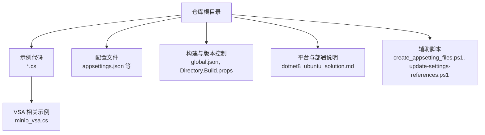
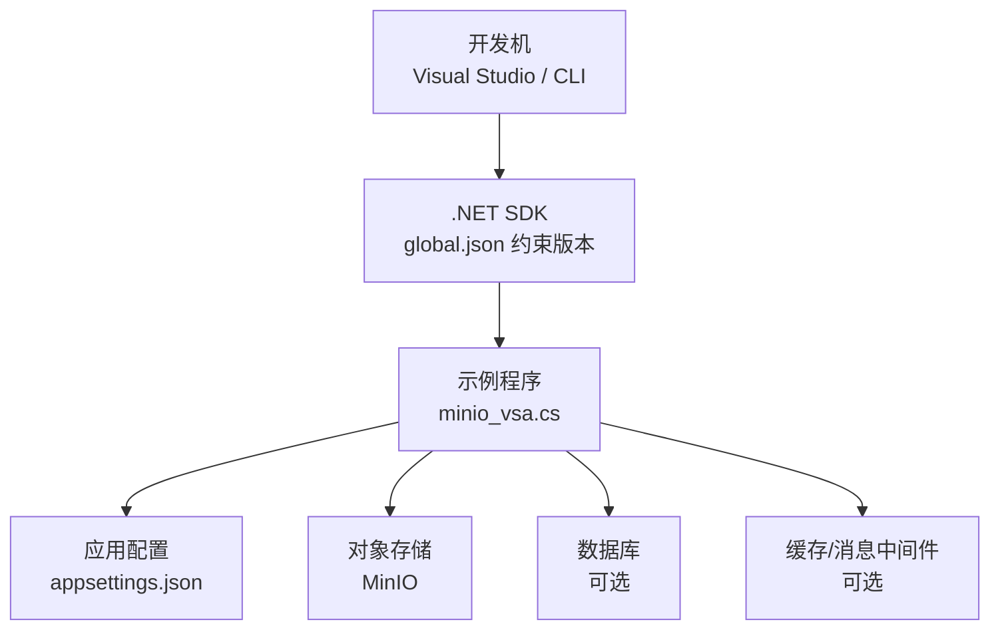
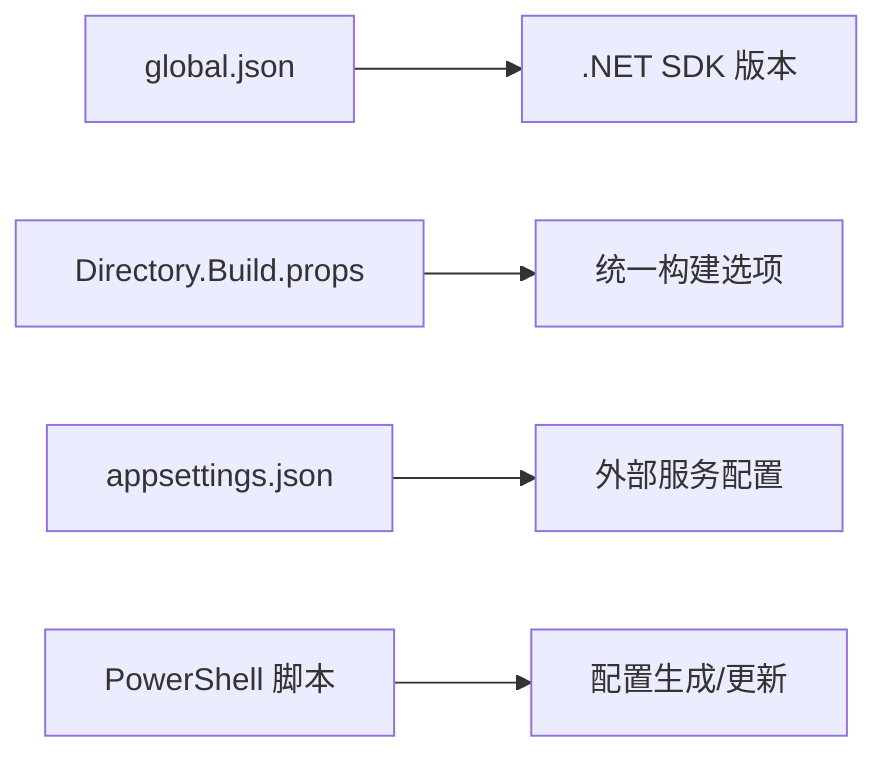

# 快速开始

<cite>
**本文引用的文件**   
- [README.md](file://README.md)
- [global.json](file://global.json)
- [Directory.Build.props](file://Directory.Build.props)
- [appsettings.json](file://appsettings.json)
- [minio_vsa.cs](file://minio_vsa.cs)
- [dotnet8_ubuntu_solution.md](file://dotnet8_ubuntu_solution.md)
- [create_appsetting_files.ps1](file://create_appsetting_files.ps1)
- [update-settings-references.ps1](file://update-settings-references.ps1)
</cite>

## 目录
1. [简介](#简介)
2. [项目结构](#项目结构)
3. [核心组件](#核心组件)
4. [架构总览](#架构总览)
5. [详细组件分析](#详细组件分析)
6. [依赖分析](#依赖分析)
7. [性能注意事项](#性能注意事项)
8. [故障排查指南](#故障排查指南)
9. [结论](#结论)
10. [附录](#附录)

## 简介
本指南面向首次接触 VSA 项目的开发者，目标是帮助你在 30 分钟内完成环境准备、依赖安装、配置设置并成功运行第一个示例。VSA 是一个以 .NET 为核心的多示例/集成演示仓库，包含大量与消息、存储、AI、监控等集成的示例代码。本文将聚焦于“如何快速跑起来”，并提供常见问题的排错方法。

## 项目结构
仓库采用“按功能/示例组织”的结构：根目录下包含大量独立示例文件（如 minio_vsa.cs），以及用于构建和配置的共享文件（如 global.json、Directory.Build.props）。此外还有 README 说明文档、平台适配说明（如 dotnet8_ubuntu_solution.md）以及用于生成或更新配置的脚本（如 create_appsetting_files.ps1、update-settings-references.ps1）。

图表来源
- [README.md](file://README.md)
- [global.json](file://global.json)
- [Directory.Build.props](file://Directory.Build.props)
- [appsettings.json](file://appsettings.json)
- [minio_vsa.cs](file://minio_vsa.cs)
- [dotnet8_ubuntu_solution.md](file://dotnet8_ubuntu_solution.md)
- [create_appsetting_files.ps1](file://create_appsetting_files.ps1)
- [update-settings-references.ps1](file://update-settings-references.ps1)

章节来源
- [README.md](file://README.md)
- [global.json](file://global.json)
- [Directory.Build.props](file://Directory.Build.props)
- [appsettings.json](file://appsettings.json)
- [minio_vsa.cs](file://minio_vsa.cs)
- [dotnet8_ubuntu_solution.md](file://dotnet8_ubuntu_solution.md)
- [create_appsetting_files.ps1](file://create_appsetting_files.ps1)
- [update-settings-references.ps1](file://update-settings-references.ps1)

## 核心组件
- 运行时与 SDK：通过 global.json 指定 .NET SDK 版本，确保本地安装的 SDK 与仓库要求一致。
- 构建属性：Directory.Build.props 提供全局构建选项，统一编译行为。
- 应用配置：appsettings.json 集中管理连接字符串、第三方服务地址、开关项等。
- VSA 示例：minio_vsa.cs 作为 VSA 相关示例的入口之一，演示对象存储（MinIO）集成用法。
- 平台适配：dotnet8_ubuntu_solution.md 提供在 Ubuntu 上运行 .NET 8 的参考方案。
- 配置脚本：create_appsetting_files.ps1 与 update-settings-references.ps1 用于生成或更新配置引用。

章节来源
- [global.json](file://global.json)
- [Directory.Build.props](file://Directory.Build.props)
- [appsettings.json](file://appsettings.json)
- [minio_vsa.cs](file://minio_vsa.cs)
- [dotnet8_ubuntu_solution.md](file://dotnet8_ubuntu_solution.md)
- [create_appsetting_files.ps1](file://create_appsetting_files.ps1)
- [update-settings-references.ps1](file://update-settings-references.ps1)

## 架构总览
下图展示了从开发机到示例程序的典型运行路径，包括 SDK、配置文件、外部依赖（数据库/缓存/对象存储）之间的交互关系。

图表来源
- [global.json](file://global.json)
- [minio_vsa.cs](file://minio_vsa.cs)
- [appsettings.json](file://appsettings.json)

## 详细组件分析

### 环境与依赖准备
- 安装 .NET SDK：根据 global.json 指定的版本安装对应 SDK（推荐 .NET 8/9）。
- 安装 Visual Studio：建议使用最新版，启用 .NET 桌面/服务器工作负载。
- 安装外部依赖：
  - 数据库：按需安装（例如 SQL Server、MySQL、PostgreSQL、SQLite 等）。
  - 缓存/消息：Redis、RabbitMQ、Kafka 等（视示例需要）。
  - 对象存储：MinIO（用于 VSA 示例）。
- 平台适配：Ubuntu 用户可参考 dotnet8_ubuntu_solution.md 中的步骤。

章节来源
- [global.json](file://global.json)
- [dotnet8_ubuntu_solution.md](file://dotnet8_ubuntu_solution.md)

### 配置文件设置
- appsettings.json：集中存放连接字符串、第三方服务地址、功能开关等。请根据实际环境修改：
  - 数据库连接字符串
  - 缓存/消息队列地址
  - MinIO 端点、访问密钥、存储桶名称
  - 日志级别、调试开关
- 环境变量：支持通过环境变量覆盖 appsettings.json 中的值（适用于容器化与云原生部署）。
- 配置脚本：
  - create_appsetting_files.ps1：用于生成或初始化配置相关文件。
  - update-settings-references.ps1：用于批量更新配置引用。

章节来源
- [appsettings.json](file://appsettings.json)
- [create_appsetting_files.ps1](file://create_appsetting_files.ps1)
- [update-settings-references.ps1](file://update-settings-references.ps1)

### 第一个示例运行（VSA + MinIO）
- 前置条件：
  - 已安装 .NET SDK（与 global.json 一致）
  - 已启动 MinIO 服务，并创建好存储桶与访问凭据
  - 已在 appsettings.json 中正确配置 MinIO 连接信息
- 运行步骤（命令行）：
  - 打开终端，进入仓库根目录
  - 使用 dotnet 命令运行 VSA 示例（具体项目名请参考 minio_vsa.cs 所在的项目或解决方案）
  - 观察控制台输出，确认 MinIO 连接成功
- 常见问题：
  - 连接失败：检查 MinIO 地址、端口、AccessKey/SecretKey、存储桶是否存在
  - 权限不足：确认 MinIO 用户具备读写目标存储桶的权限
  - 网络不通：检查防火墙、代理、DNS 解析

章节来源
- [minio_vsa.cs](file://minio_vsa.cs)
- [appsettings.json](file://appsettings.json)

### 数据库与第三方服务注册
- 数据库：
  - 在 appsettings.json 中配置连接字符串
  - 如需 EF Core 迁移，执行相应的迁移命令（见 dotnet8_ubuntu_solution.md 或项目内迁移脚本）
- 缓存/消息：
  - 配置 Redis/RabbitMQ/Kafka 的连接信息
  - 确保服务可达且认证信息正确
- 第三方服务：
  - 在 appsettings.json 中填写 API Key、Endpoint、超时等参数
  - 必要时通过环境变量注入敏感信息

章节来源
- [appsettings.json](file://appsettings.json)
- [dotnet8_ubuntu_solution.md](file://dotnet8_ubuntu_solution.md)

## 依赖分析
- 运行时依赖：由 global.json 锁定 .NET SDK 版本，保证跨机器一致性。
- 构建依赖：Directory.Build.props 统一编译选项，减少重复配置。
- 外部依赖：MinIO、数据库、缓存/消息中间件等通过 appsettings.json 注入。
- 脚本依赖：PowerShell 脚本用于生成/更新配置，便于自动化与团队协作。

图表来源
- [global.json](file://global.json)
- [Directory.Build.props](file://Directory.Build.props)
- [appsettings.json](file://appsettings.json)
- [create_appsetting_files.ps1](file://create_appsetting_files.ps1)
- [update-settings-references.ps1](file://update-settings-references.ps1)

章节来源
- [global.json](file://global.json)
- [Directory.Build.props](file://Directory.Build.props)
- [appsettings.json](file://appsettings.json)
- [create_appsetting_files.ps1](file://create_appsetting_files.ps1)
- [update-settings-references.ps1](file://update-settings-references.ps1)

## 性能注意事项
- 合理设置连接池大小与超时时间，避免资源耗尽。
- 对高频 I/O 操作启用异步与缓冲策略。
- 使用缓存层降低数据库压力。
- 在生产环境开启结构化日志与指标采集，便于定位瓶颈。

## 故障排查指南
- 无法找到 SDK：确认已安装与 global.json 一致的 .NET SDK，并使用 dotnet --info 验证。
- 配置未生效：检查 appsettings.json 是否被环境变量覆盖；确认配置文件路径与加载顺序。
- MinIO 连接失败：核对端点、端口、凭据、存储桶名称与权限；使用 MinIO 客户端工具测试连通性。
- 数据库连接失败：检查连接字符串、网络可达性、用户名密码与数据库状态。
- 构建错误：清理并重新还原包；检查 Directory.Build.props 中的全局设置是否与本地环境冲突。

章节来源
- [global.json](file://global.json)
- [appsettings.json](file://appsettings.json)
- [minio_vsa.cs](file://minio_vsa.cs)

## 结论
通过以上步骤，你可以在 30 分钟内完成 VSA 项目的开发与运行准备。建议先从 VSA + MinIO 的最小示例入手，逐步扩展至数据库与更多第三方服务集成。遇到问题时优先检查配置与网络连通性，再结合日志与工具进行定位。

## 附录
- 常用命令（示例）：
  - 查看 SDK 版本：dotnet --info
  - 还原包：dotnet restore
  - 构建：dotnet build
  - 运行：dotnet run（针对具体项目）
- 参考文档：
  - README.md：项目概览与使用说明
  - dotnet8_ubuntu_solution.md：Ubuntu 平台适配指南

章节来源
- [README.md](file://README.md)
- [dotnet8_ubuntu_solution.md](file://dotnet8_ubuntu_solution.md)