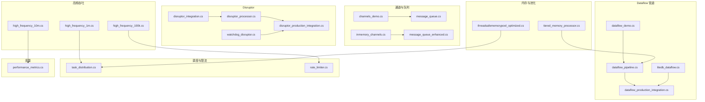
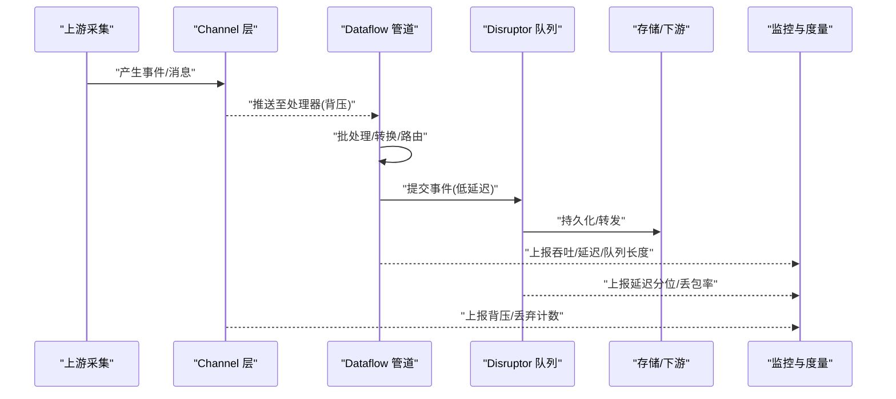
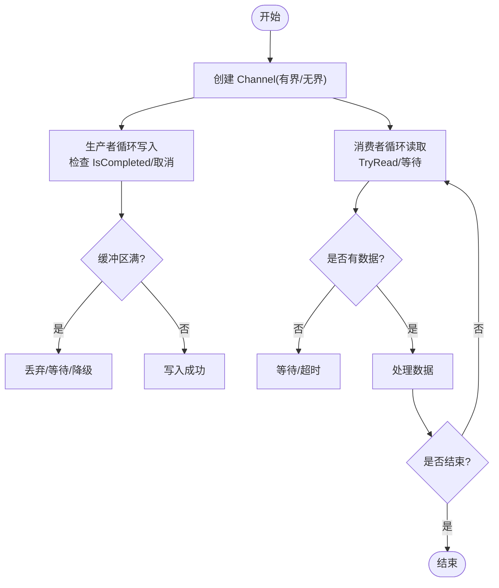
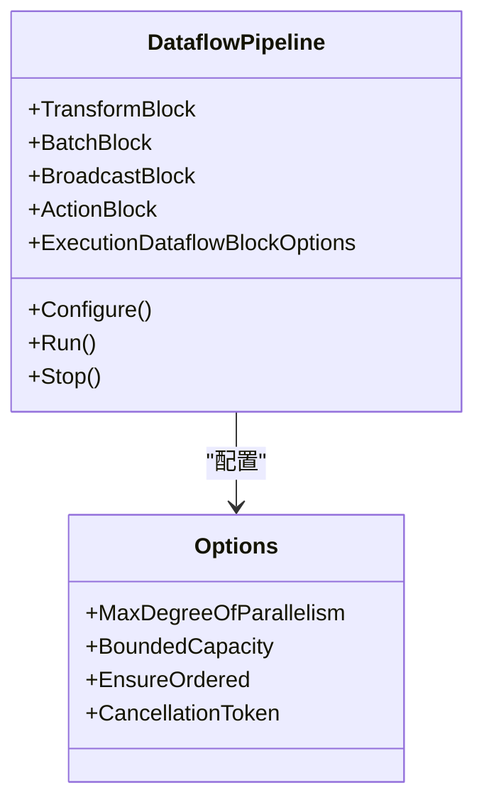
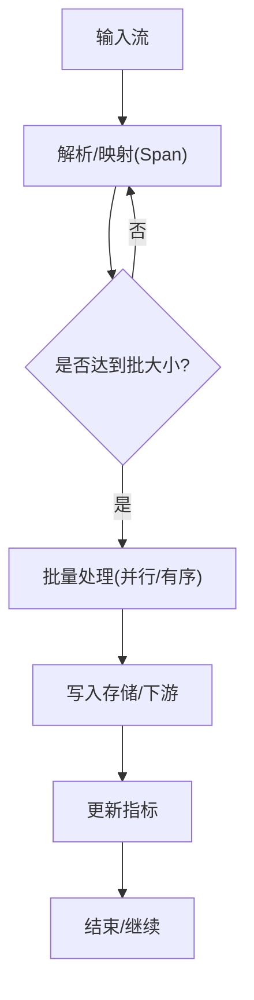
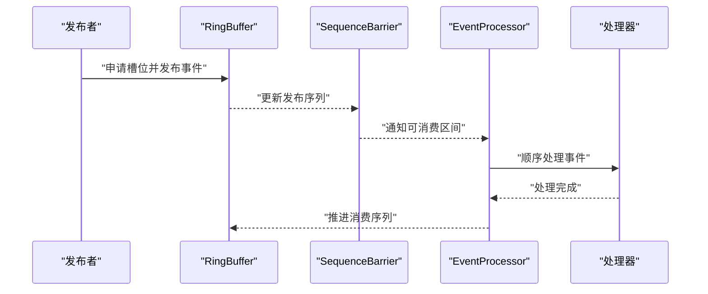
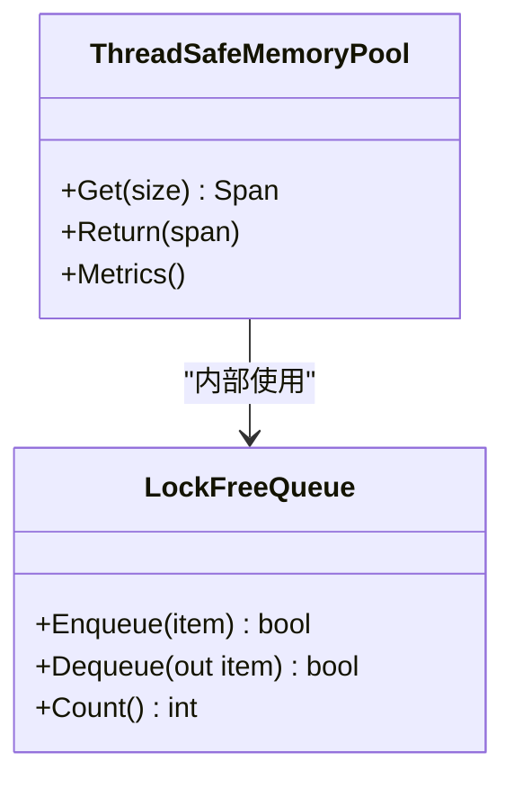
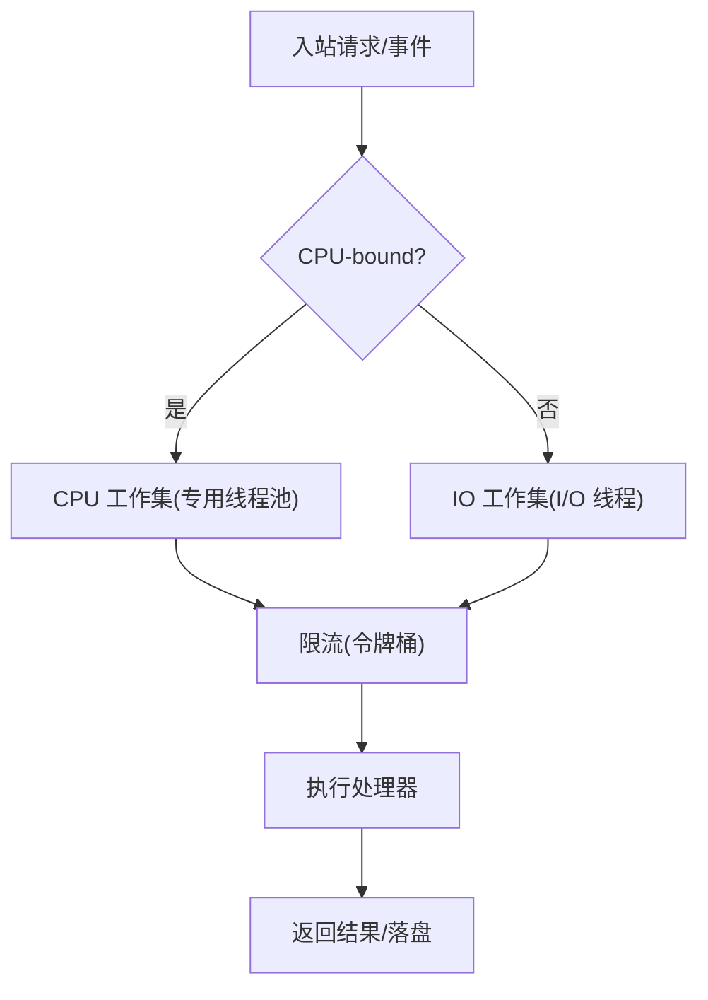
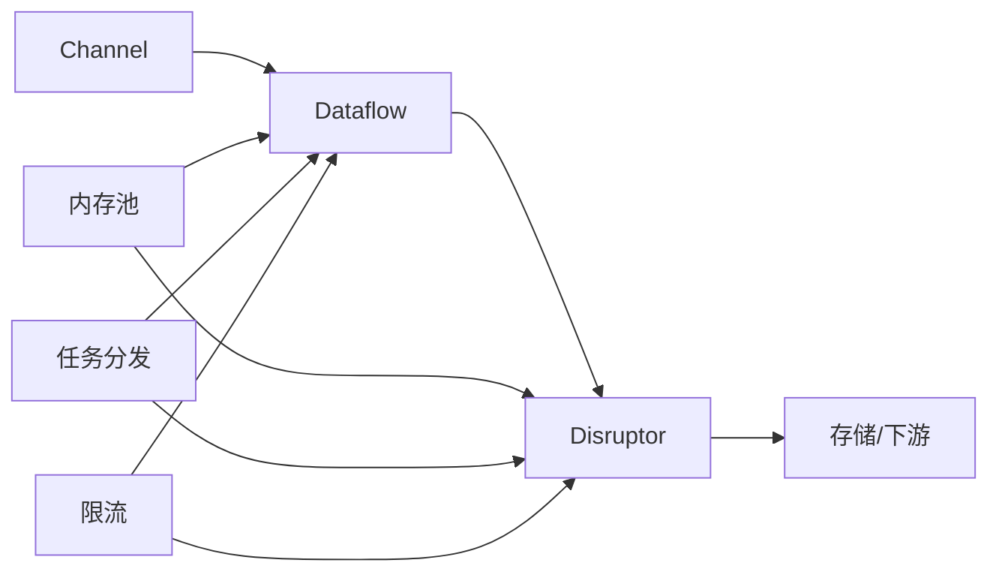

# 并发优化

<cite>
**本文引用的文件**   
- [channels_demo.cs](file://channels_demo.cs)
- [dataflow_demo.cs](file://dataflow_demo.cs)
- [dataflow_pipeline.cs](file://dataflow_pipeline.cs)
- [dataflow_production_integration.cs](file://dataflow_production_integration.cs)
- [high_frequency_100k.cs](file://high_frequency_100k.cs)
- [high_frequency_1m.cs](file://high_frequency_1m.cs)
- [high_frequency_10m.cs](file://high_frequency_10m.cs)
- [inmemory_channels.cs](file://inmemory_channels.cs)
- [litedb_dataflow.cs](file://litedb_dataflow.cs)
- [message_queue.cs](file://message_queue.cs)
- [message_queue_enhanced.cs](file://message_queue_enhanced.cs)
- [performance_metrics.cs](file://performance_metrics.cs)
- [rate_limiter.cs](file://rate_limiter.cs)
- [task_distribution.cs](file://task_distribution.cs)
- [threadsafememorypool_optimized.cs](file://threadsafememorypool_optimized.cs)
- [tiered_memory_processor.cs](file://tiered_memory_processor.cs)
- [watchdog_disruptor.cs](file://watchdog_disruptor.cs)
- [disruptor_integration.cs](file://disruptor_integration.cs)
- [disruptor_processor.cs](file://disruptor_processor.cs)
- [disruptor_production_integration.cs](file://disruptor_production_integration.cs)
</cite>

## 目录
1. [简介](#简介)
2. [项目结构](#项目结构)
3. [核心组件](#核心组件)
4. [架构总览](#架构总览)
5. [详细组件分析](#详细组件分析)
6. [依赖关系分析](#依赖关系分析)
7. [性能考量](#性能考量)
8. [故障排查指南](#故障排查指南)
9. [结论](#结论)
10. [附录](#附录)

## 简介
本文件面向高频率数据处理与高并发场景，系统性梳理并沉淀以下能力：
- Channel 异步编程与背压控制
- Dataflow 管道处理与有界缓冲
- 线程池与任务调度优化
- 锁优化、无锁数据结构与内存池
- 并行计算与异步 I/O 优化
- 资源竞争解决方案与限流/熔断
- 并发性能测试方法与调优策略

目标读者包括后端工程师、系统架构师与性能调优工程师。文档以“从概念到实现”的渐进方式组织，配合架构图与流程图帮助快速定位问题与落地优化。

## 项目结构
仓库中包含大量与并发相关的示例与集成代码，重点覆盖以下主题：
- Channel 与消息队列：channels_demo.cs、inmemory_channels.cs、message_queue.cs、message_queue_enhanced.cs
- Dataflow 管道：dataflow_demo.cs、dataflow_pipeline.cs、dataflow_production_integration.cs、litedb_dataflow.cs
- 高频数据吞吐：high_frequency_1m.cs、high_frequency_100k.cs、high_frequency_10m.cs
- Disruptor 高性能环形队列：disruptor_integration.cs、disruptor_processor.cs、disruptor_production_integration.cs、watchdog_disruptor.cs
- 内存与对象池：threadsafememorypool_optimized.cs、tiered_memory_processor.cs
- 任务分发与限流：task_distribution.cs、rate_limiter.cs
- 性能度量：performance_metrics.cs

图表来源
- [channels_demo.cs](file://channels_demo.cs)
- [inmemory_channels.cs](file://inmemory_channels.cs)
- [message_queue.cs](file://message_queue.cs)
- [message_queue_enhanced.cs](file://message_queue_enhanced.cs)
- [dataflow_demo.cs](file://dataflow_demo.cs)
- [dataflow_pipeline.cs](file://dataflow_pipeline.cs)
- [dataflow_production_integration.cs](file://dataflow_production_integration.cs)
- [litedb_dataflow.cs](file://litedb_dataflow.cs)
- [high_frequency_1m.cs](file://high_frequency_1m.cs)
- [high_frequency_100k.cs](file://high_frequency_100k.cs)
- [high_frequency_10m.cs](file://high_frequency_10m.cs)
- [disruptor_integration.cs](file://disruptor_integration.cs)
- [disruptor_processor.cs](file://disruptor_processor.cs)
- [disruptor_production_integration.cs](file://disruptor_production_integration.cs)
- [watchdog_disruptor.cs](file://watchdog_disruptor.cs)
- [threadsafememorypool_optimized.cs](file://threadsafememorypool_optimized.cs)
- [tiered_memory_processor.cs](file://tiered_memory_processor.cs)
- [task_distribution.cs](file://task_distribution.cs)
- [rate_limiter.cs](file://rate_limiter.cs)
- [performance_metrics.cs](file://performance_metrics.cs)

章节来源
- [channels_demo.cs](file://channels_demo.cs)
- [dataflow_pipeline.cs](file://dataflow_pipeline.cs)
- [high_frequency_1m.cs](file://high_frequency_1m.cs)
- [disruptor_integration.cs](file://disruptor_integration.cs)
- [threadsafememorypool_optimized.cs](file://threadsafememorypool_optimized.cs)
- [task_distribution.cs](file://task_distribution.cs)
- [rate_limiter.cs](file://rate_limiter.cs)
- [performance_metrics.cs](file://performance_metrics.cs)

## 核心组件
- Channel 异步编程
  - 使用 System.Threading.Channels 构建生产者-消费者模型，天然支持背压与取消。
  - 典型用法：单写多读/多写单读/多写多读；结合 CancellationToken 优雅关闭。
  - 适用场景：日志采集、事件聚合、I/O 解耦。

- Dataflow 管道处理
  - 基于 TPL Dataflow 构建有界缓冲、批处理、扇出/扇入、错误传播与完成信号。
  - 关键块：TransformBlock、BatchedJoinBlock、BroadcastBlock、ActionBlock 等。
  - 适用场景：ETL 流水线、实时分析、多级过滤与转换。

- 高频数据吞吐
  - 针对 100k/1m/10m 级别 QPS 的基准与优化实践，涵盖零拷贝、对象池、批量写入、缓存亲和性。
  - 关注 GC 压力、CPU 缓存行、NUMA 与线程亲和。

- Disruptor 高性能环形队列
  - 通过 RingBuffer + SequenceBarrier + EventProcessor 实现低延迟、高吞吐的消息处理。
  - 适用于对延迟敏感的核心路径（如风控、撮合、指标收集）。

- 内存池与无锁数据结构
  - 线程安全内存池减少分配与 GC 抖动；无锁队列/栈降低锁竞争。
  - 注意：无锁需配合内存序与屏障，避免伪共享。

- 任务分发与限流
  - 任务分发器按 CPU/IO 类型拆分工作集，避免阻塞线程池。
  - 令牌桶/漏桶限流保护下游，平滑突发流量。

- 性能度量
  - 统一埋点：吞吐、延迟分位、队列长度、GC、上下文切换、CPU 利用率。
  - 结合 Prometheus/Grafana 或内置计数器进行观测。

章节来源
- [channels_demo.cs](file://channels_demo.cs)
- [dataflow_pipeline.cs](file://dataflow_pipeline.cs)
- [high_frequency_1m.cs](file://high_frequency_1m.cs)
- [disruptor_integration.cs](file://disruptor_integration.cs)
- [threadsafememorypool_optimized.cs](file://threadsafememorypool_optimized.cs)
- [task_distribution.cs](file://task_distribution.cs)
- [rate_limiter.cs](file://rate_limiter.cs)
- [performance_metrics.cs](file://performance_metrics.cs)

## 架构总览
下图展示了一个典型的高频数据处理流水线：上游采集通过 Channel 接入，进入 Dataflow 管道进行清洗、聚合与路由，最终经 Disruptor 写入存储或下游服务。全程由任务分发器协调 CPU/IO 工作集，并通过限流器保护瓶颈组件，性能指标统一上报。

图表来源
- [channels_demo.cs](file://channels_demo.cs)
- [dataflow_pipeline.cs](file://dataflow_pipeline.cs)
- [disruptor_integration.cs](file://disruptor_integration.cs)
- [performance_metrics.cs](file://performance_metrics.cs)

## 详细组件分析

### Channel 异步编程与背压
- 设计要点
  - 选择合适容量：无界用于缓冲突发，有界用于强制背压。
  - 取消与关闭：在取消时清理未消费项，避免泄漏。
  - 多生产者/消费者：合理设置并发度，避免热点键冲突。
- 常见模式
  - 单写多读：日志广播、指标聚合。
  - 多写单读：合并写入、去重。
  - 多写多读：负载均衡、分区处理。

章节来源
- [channels_demo.cs](file://channels_demo.cs)
- [inmemory_channels.cs](file://inmemory_channels.cs)

### Dataflow 管道处理
- 设计要点
  - 有界缓冲：防止 OOM，保证背压。
  - 批处理：提高吞吐，降低开销。
  - 错误传播：失败分支隔离，死信队列兜底。
  - 完成信号：优雅关闭与资源释放。
- 典型组合
  - TransformBlock -> BatchBlock -> JoinBlock -> ActionBlock
  - BroadcastBlock 扇出到多个处理器
  - ExecutionDataflowBlockOptions 控制并发与最大并行度

图表来源
- [dataflow_pipeline.cs](file://dataflow_pipeline.cs)
- [dataflow_production_integration.cs](file://dataflow_production_integration.cs)

章节来源
- [dataflow_pipeline.cs](file://dataflow_pipeline.cs)
- [dataflow_production_integration.cs](file://dataflow_production_integration.cs)
- [litedb_dataflow.cs](file://litedb_dataflow.cs)

### 高频数据吞吐优化
- 优化方向
  - 零拷贝/Span/Memory：减少序列化与复制。
  - 对象池：复用大数据块、连接、缓冲区。
  - 批量写入：合并小请求，降低锁与 IO 次数。
  - 缓存亲和：按分区/哈希绑定线程，减少跨核迁移。
- 基准方法
  - 固定样本量与时间窗口，统计 P50/P95/P99、吞吐、GC 次数。
  - 对比不同并发度、批大小、缓冲容量的影响。

章节来源
- [high_frequency_1m.cs](file://high_frequency_1m.cs)
- [high_frequency_100k.cs](file://high_frequency_100k.cs)
- [high_frequency_10m.cs](file://high_frequency_10m.cs)

### Disruptor 高性能环形队列
- 设计要点
  - RingBuffer 预分配，SequenceBarrier 协调发布/消费序列。
  - EventProcessor 单线程顺序消费，避免锁竞争。
  - 事件对象池化，避免频繁分配。
- 适用场景
  - 极低延迟路径：风控规则、交易撮合、指标聚合。

图表来源
- [disruptor_integration.cs](file://disruptor_integration.cs)
- [disruptor_processor.cs](file://disruptor_processor.cs)
- [disruptor_production_integration.cs](file://disruptor_production_integration.cs)
- [watchdog_disruptor.cs](file://watchdog_disruptor.cs)

章节来源
- [disruptor_integration.cs](file://disruptor_integration.cs)
- [disruptor_processor.cs](file://disruptor_processor.cs)
- [disruptor_production_integration.cs](file://disruptor_production_integration.cs)
- [watchdog_disruptor.cs](file://watchdog_disruptor.cs)

### 内存池与无锁数据结构
- 线程安全内存池
  - 按大小分类池化，减少碎片与 GC 压力。
  - 提供 Get/Return 接口，支持超时与回收策略。
- 无锁数据结构
  - 使用 Interlocked/CAS 操作，避免互斥锁。
  - 注意伪共享：对齐与填充，必要时使用独占缓存行。

图表来源
- [threadsafememorypool_optimized.cs](file://threadsafememorypool_optimized.cs)

章节来源
- [threadsafememorypool_optimized.cs](file://threadsafememorypool_optimized.cs)
- [tiered_memory_processor.cs](file://tiered_memory_processor.cs)

### 任务分发与限流
- 任务分发器
  - 区分 CPU-bound 与 IO-bound 工作集，分别调度到专用线程池或 I/O 线程。
  - 动态调整并发度，避免饥饿与过载。
- 限流器
  - 令牌桶/漏桶：平滑突发，保护下游。
  - 分级限流：按租户/接口维度隔离。

章节来源
- [task_distribution.cs](file://task_distribution.cs)
- [rate_limiter.cs](file://rate_limiter.cs)

## 依赖关系分析
- 模块内聚与耦合
  - Channel/Dataflow 作为编排层，Disruptor 作为高性能内核，内存池为底层支撑。
  - 任务分发与限流贯穿各层，保障稳定性。
- 外部依赖
  - 存储/网络 I/O 通常成为瓶颈，应通过批处理、连接池与重试退避缓解。
- 潜在循环依赖
  - 管道与队列之间单向依赖，避免反向引用。

图表来源
- [channels_demo.cs](file://channels_demo.cs)
- [dataflow_pipeline.cs](file://dataflow_pipeline.cs)
- [disruptor_integration.cs](file://disruptor_integration.cs)
- [threadsafememorypool_optimized.cs](file://threadsafememorypool_optimized.cs)
- [task_distribution.cs](file://task_distribution.cs)
- [rate_limiter.cs](file://rate_limiter.cs)

章节来源
- [channels_demo.cs](file://channels_demo.cs)
- [dataflow_pipeline.cs](file://dataflow_pipeline.cs)
- [disruptor_integration.cs](file://disruptor_integration.cs)
- [threadsafememorypool_optimized.cs](file://threadsafememorypool_optimized.cs)
- [task_distribution.cs](file://task_distribution.cs)
- [rate_limiter.cs](file://rate_limiter.cs)

## 性能考量
- 线程池优化
  - 根据工作集类型分离线程池，避免 IO 阻塞 CPU 任务。
  - 合理设置最小/最大线程数，观察饱和与排队情况。
- 锁优化
  - 缩小临界区，优先使用无锁/细粒度锁。
  - 避免持有锁进行 I/O 或长耗时计算。
- 无锁数据结构
  - 使用 CAS 与内存序，避免伪共享导致的缓存失效。
- 并行计算
  - 利用 Parallel.ForEachAsync/ValueTask 提升吞吐。
  - 控制 MaxDegreeOfParallelism，避免过度并行导致抖动。
- 异步 I/O 优化
  - 使用非阻塞 API，避免同步阻塞调用。
  - 批处理与合并请求，减少握手与锁竞争。
- 资源竞争解决方案
  - 背压与限流：有界缓冲、令牌桶、滑动窗口。
  - 熔断与降级：快速失败，保护系统整体可用性。
- 内存管理
  - 对象池、Span/Memory、数组池，减少分配与 GC。
  - 大对象堆优化：避免频繁 LOH 分配。

[本节为通用指导，不直接分析具体文件]

## 故障排查指南
- 常见问题
  - 背压不足导致 OOM：检查 Channel/Dataflow 容量与丢弃策略。
  - 线程池饥饿：区分 CPU/IO 工作集，调整线程池参数。
  - 锁竞争严重：定位热点锁，改用无锁或细粒度锁。
  - GC 抖动：启用对象池，减少临时分配。
  - 尾延迟升高：检查批大小、队列长度、下游 RTT。
- 诊断步骤
  - 采集指标：吞吐、延迟分位、队列长度、GC、CPU、上下文切换。
  - 火焰图/采样：定位热点函数与锁热点。
  - 回放与复现：固定负载，逐步变更参数验证效果。
- 工具建议
  - 性能计数器、Profiler、分布式追踪、APM 平台。

章节来源
- [performance_metrics.cs](file://performance_metrics.cs)
- [message_queue.cs](file://message_queue.cs)
- [message_queue_enhanced.cs](file://message_queue_enhanced.cs)

## 结论
在高并发与高频数据处理场景中，应以“背压+管道+低延迟队列+内存池”为核心架构，辅以任务分发与限流，确保系统在稳定与性能间取得平衡。通过系统的性能度量与持续调优，可在复杂生产环境中获得可预期的吞吐与延迟表现。

[本节为总结性内容，不直接分析具体文件]

## 附录
- 并发性能测试方法
  - 基准设计：固定样本量、时间窗口、负载模型（均匀/突发/倾斜）。
  - 指标定义：P50/P95/P99、吞吐、错误率、队列长度、GC 次数、CPU 利用率。
  - 实验变量：并发度、批大小、缓冲容量、线程池大小、序列化方式。
  - 回归策略：自动化基准套件，阈值告警与回滚机制。
- 调优策略清单
  - 先测后改：以数据驱动决策。
  - 分层优化：I/O -> 锁 -> 算法 -> 数据结构。
  - 灰度上线：小流量验证，逐步放量。
  - 监控闭环：指标、日志、追踪三位一体。

[本节为方法论补充，不直接分析具体文件]