# 序列化优化

<cite>
**本文引用的文件**   
- [span_zero_copy_serializer.cs](file://span_zero_copy_serializer.cs)
- [zero_copy_serializer.cs](file://zero_copy_serializer.cs)
- [inproc_json_serializer.cs](file://inproc_json_serializer.cs)
- [inproc_messagepack_serializer.cs](file://inproc_messagepack_serializer.cs)
- [ipc_json_serializer.cs](file://ipc_json_serializer.cs)
- [ipc_messagepack_serializer.cs](file://ipc_messagepack_serializer.cs)
- [shared_memory_messagepack.cs](file://shared_memory_messagepack.cs)
- [shared_memory_serializer.cs](file://shared_memory_serializer.cs)
- [pipe_streaming_serializer.cs](file://pipe_streaming_serializer.cs)
- [memorypack_demo.cs](file://memorypack_demo.cs)
- [memorypack_integration.cs](file://memorypack_integration.cs)
- [serialization_impl.cs](file://serialization_impl.cs)
- [hybrid_serializer.cs](file://hybrid_serializer.cs)
- [threadsafe_memorypool_serializer.cs](file://threadsafe_memorypool_serializer.cs)
- [recyclable_memorystream_integration.cs](file://recyclable_memorystream_integration.cs)
</cite>

## 目录
1. [简介](#简介)
2. [项目结构](#项目结构)
3. [核心组件](#核心组件)
4. [架构总览](#架构总览)
5. [详细组件分析](#详细组件分析)
6. [依赖关系分析](#依赖关系分析)
7. [性能考量与基准](#性能考量与基准)
8. [故障排查指南](#故障排查指南)
9. [结论](#结论)
10. [附录：选型与调优清单](#附录选型与调优清单)

## 简介
本文件面向高性能序列化场景，系统性梳理零拷贝序列化、Span<T>优化、MessagePack 高性能序列化以及进程间通信（IPC）序列化的实现要点与最佳实践。内容涵盖内存布局优化、类型推断与编译时代码生成、不同方案的适用场景与选择指南，并提供可操作的调优方法与常见问题排查建议。

## 项目结构
仓库中包含多套序列化实现与集成示例，围绕“零拷贝”“Span<T>”“MessagePack”“共享内存/管道流式”等主题展开，形成从进程内到进程间的完整链路。

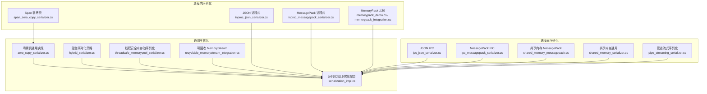

**图表来源** 
- [span_zero_copy_serializer.cs](file://span_zero_copy_serializer.cs)
- [zero_copy_serializer.cs](file://zero_copy_serializer.cs)
- [inproc_json_serializer.cs](file://inproc_json_serializer.cs)
- [inproc_messagepack_serializer.cs](file://inproc_messagepack_serializer.cs)
- [ipc_json_serializer.cs](file://ipc_json_serializer.cs)
- [ipc_messagepack_serializer.cs](file://ipc_messagepack_serializer.cs)
- [shared_memory_messagepack.cs](file://shared_memory_messagepack.cs)
- [shared_memory_serializer.cs](file://shared_memory_serializer.cs)
- [pipe_streaming_serializer.cs](file://pipe_streaming_serializer.cs)
- [memorypack_demo.cs](file://memorypack_demo.cs)
- [memorypack_integration.cs](file://memorypack_integration.cs)
- [serialization_impl.cs](file://serialization_impl.cs)
- [hybrid_serializer.cs](file://hybrid_serializer.cs)
- [threadsafe_memorypool_serializer.cs](file://threadsafe_memorypool_serializer.cs)
- [recyclable_memorystream_integration.cs](file://recyclable_memorystream_integration.cs)

**章节来源**
- [span_zero_copy_serializer.cs](file://span_zero_copy_serializer.cs)
- [zero_copy_serializer.cs](file://zero_copy_serializer.cs)
- [inproc_json_serializer.cs](file://inproc_json_serializer.cs)
- [inproc_messagepack_serializer.cs](file://inproc_messagepack_serializer.cs)
- [ipc_json_serializer.cs](file://ipc_json_serializer.cs)
- [ipc_messagepack_serializer.cs](file://ipc_messagepack_serializer.cs)
- [shared_memory_messagepack.cs](file://shared_memory_messagepack.cs)
- [shared_memory_serializer.cs](file://shared_memory_serializer.cs)
- [pipe_streaming_serializer.cs](file://pipe_streaming_serializer.cs)
- [memorypack_demo.cs](file://memorypack_demo.cs)
- [memorypack_integration.cs](file://memorypack_integration.cs)
- [serialization_impl.cs](file://serialization_impl.cs)
- [hybrid_serializer.cs](file://hybrid_serializer.cs)
- [threadsafe_memorypool_serializer.cs](file://threadsafe_memorypool_serializer.cs)
- [recyclable_memorystream_integration.cs](file://recyclable_memorystream_integration.cs)

## 核心组件
- Span<T> 零拷贝序列化：通过只读/读写 Span<T> 直接操作内存片段，避免额外分配与拷贝，适合高吞吐、低延迟的进程内数据路径。
- 零拷贝通用实现：抽象出零拷贝编解码能力，统一处理缓冲区生命周期与边界检查，便于在不同传输层复用。
- 进程内 JSON/MessagePack：提供轻量级或高性能的进程内序列化方案；MessagePack 在二进制紧凑性与速度上通常优于 JSON。
- 进程间 JSON/MessagePack：针对跨进程边界进行封装，结合缓冲池、批处理与压缩策略提升吞吐。
- 共享内存序列化：以共享内存为介质，配合 MessagePack 或自定义格式，实现极低开销的进程间数据交换。
- 管道流式序列化：基于流式写入/读取，避免一次性大对象分配，适用于大数据量与长连接场景。
- MemoryPack：利用编译时代码生成与结构化二进制协议，获得接近手写的高效序列化性能。
- 混合序列化策略：根据消息大小、类型特征与目标平台动态选择最优序列化器。
- 线程安全内存池序列化：在高并发下减少 GC 压力，降低分配抖动。
- 可回收 MemoryStream：复用底层缓冲区，减少频繁分配与释放带来的性能损耗。

**章节来源**
- [span_zero_copy_serializer.cs](file://span_zero_copy_serializer.cs)
- [zero_copy_serializer.cs](file://zero_copy_serializer.cs)
- [inproc_json_serializer.cs](file://inproc_json_serializer.cs)
- [inproc_messagepack_serializer.cs](file://inproc_messagepack_serializer.cs)
- [ipc_json_serializer.cs](file://ipc_json_serializer.cs)
- [ipc_messagepack_serializer.cs](file://ipc_messagepack_serializer.cs)
- [shared_memory_messagepack.cs](file://shared_memory_messagepack.cs)
- [shared_memory_serializer.cs](file://shared_memory_serializer.cs)
- [pipe_streaming_serializer.cs](file://pipe_streaming_serializer.cs)
- [memorypack_demo.cs](file://memorypack_demo.cs)
- [memorypack_integration.cs](file://memorypack_integration.cs)
- [hybrid_serializer.cs](file://hybrid_serializer.cs)
- [threadsafe_memorypool_serializer.cs](file://threadsafe_memorypool_serializer.cs)
- [recyclable_memorystream_integration.cs](file://recyclable_memorystream_integration.cs)

## 架构总览
下图展示从应用模型到不同序列化后端的整体调用链与数据流向，强调“零拷贝”“Span<T>”“共享内存/管道流”的关键路径。

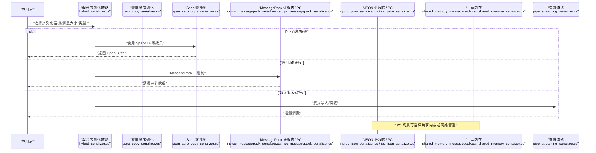

**图表来源** 
- [hybrid_serializer.cs](file://hybrid_serializer.cs)
- [zero_copy_serializer.cs](file://zero_copy_serializer.cs)
- [span_zero_copy_serializer.cs](file://span_zero_copy_serializer.cs)
- [inproc_messagepack_serializer.cs](file://inproc_messagepack_serializer.cs)
- [ipc_messagepack_serializer.cs](file://ipc_messagepack_serializer.cs)
- [inproc_json_serializer.cs](file://inproc_json_serializer.cs)
- [ipc_json_serializer.cs](file://ipc_json_serializer.cs)
- [shared_memory_messagepack.cs](file://shared_memory_messagepack.cs)
- [shared_memory_serializer.cs](file://shared_memory_serializer.cs)
- [pipe_streaming_serializer.cs](file://pipe_streaming_serializer.cs)

## 详细组件分析

### Span<T> 零拷贝序列化
- 设计要点
  - 以 Span<T>/ReadOnlySpan<T> 作为输入输出，避免中间 Buffer 分配。
  - 严格边界检查与长度校验，防止越界访问。
  - 与内存池/栈分配结合，进一步降低 GC 压力。
- 适用场景
  - 进程内高频小对象序列化/反序列化。
  - 对延迟敏感的数据平面（如事件总线、缓存键值）。
- 优化点
  - 预分配固定大小 Span，减少扩容。
  - 批量处理多个字段，减少方法调用开销。
  - 使用 SIMD/向量化指令（若库支持）加速数值编码。

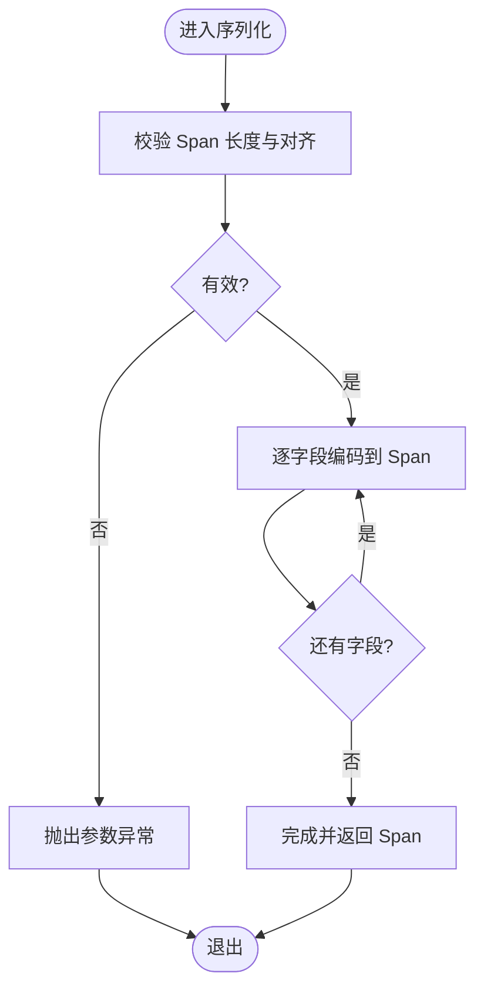

**图表来源** 
- [span_zero_copy_serializer.cs](file://span_zero_copy_serializer.cs)
- [zero_copy_serializer.cs](file://zero_copy_serializer.cs)

**章节来源**
- [span_zero_copy_serializer.cs](file://span_zero_copy_serializer.cs)
- [zero_copy_serializer.cs](file://zero_copy_serializer.cs)

### 零拷贝通用实现
- 设计要点
  - 抽象出 Write/Read 接口，统一处理缓冲区生命周期与错误码。
  - 提供默认实现与扩展点，便于替换具体编码器。
- 适用场景
  - 需要统一零拷贝能力的多种传输后端（内存、管道、共享内存）。
- 优化点
  - 合并多次写操作，减少系统调用。
  - 使用只读视图避免意外修改。

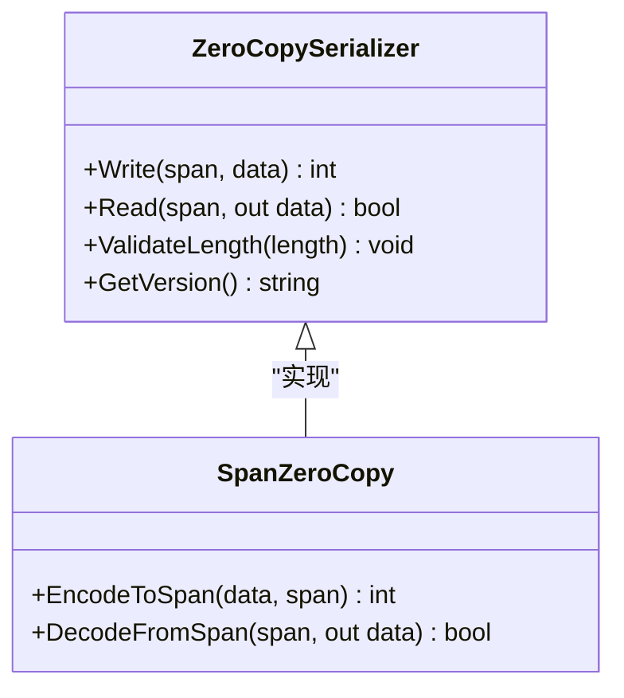

**图表来源** 
- [zero_copy_serializer.cs](file://zero_copy_serializer.cs)
- [span_zero_copy_serializer.cs](file://span_zero_copy_serializer.cs)

**章节来源**
- [zero_copy_serializer.cs](file://zero_copy_serializer.cs)
- [span_zero_copy_serializer.cs](file://span_zero_copy_serializer.cs)

### 进程内 MessagePack 序列化
- 设计要点
  - 使用紧凑二进制格式，减少体积与解析开销。
  - 结合对象池与缓冲区复用，降低分配。
- 适用场景
  - 进程内高频消息传递、缓存、日志。
- 优化点
  - 启用类型映射与属性忽略，减小元数据。
  - 批量序列化以减少上下文切换。

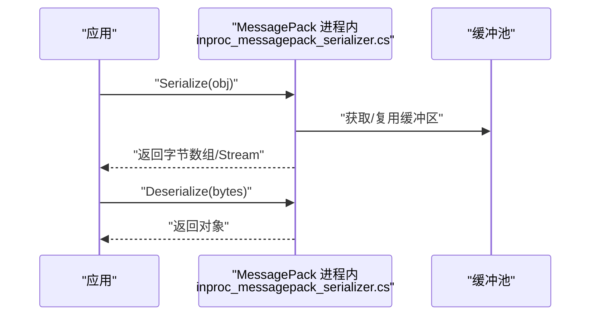

**图表来源** 
- [inproc_messagepack_serializer.cs](file://inproc_messagepack_serializer.cs)

**章节来源**
- [inproc_messagepack_serializer.cs](file://inproc_messagepack_serializer.cs)

### 进程内 JSON 序列化
- 设计要点
  - 使用高性能 JSON 库，配置紧凑模式与禁用冗余元数据。
  - 结合 Stream 与缓冲池，避免大对象分配。
- 适用场景
  - 调试、兼容外部系统、人类可读性优先。
- 优化点
  - 预定义类型映射，减少反射。
  - 使用异步 I/O 提高吞吐。

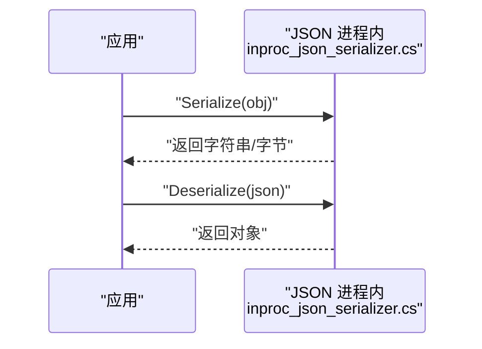

**图表来源** 
- [inproc_json_serializer.cs](file://inproc_json_serializer.cs)

**章节来源**
- [inproc_json_serializer.cs](file://inproc_json_serializer.cs)

### 进程间 JSON/MessagePack 序列化
- 设计要点
  - 封装跨进程边界，统一头信息、版本控制与错误码。
  - 可选压缩（如 LZ4/Zstd）以降低带宽占用。
- 适用场景
  - 微服务间通信、插件加载、宿主与子进程交互。
- 优化点
  - 批处理与分片发送，避免拥塞。
  - 使用共享内存或本地管道降低内核态切换成本。

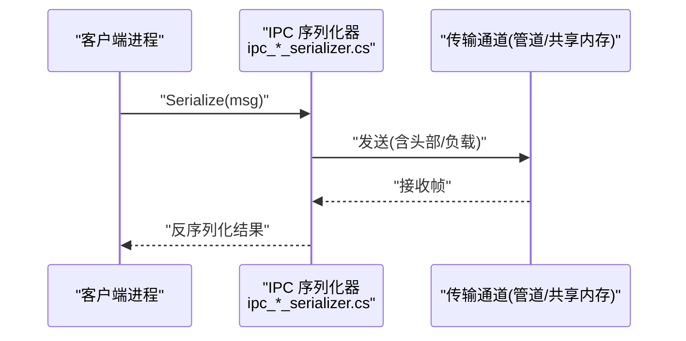

**图表来源** 
- [ipc_json_serializer.cs](file://ipc_json_serializer.cs)
- [ipc_messagepack_serializer.cs](file://ipc_messagepack_serializer.cs)

**章节来源**
- [ipc_json_serializer.cs](file://ipc_json_serializer.cs)
- [ipc_messagepack_serializer.cs](file://ipc_messagepack_serializer.cs)

### 共享内存 MessagePack 序列化
- 设计要点
  - 以共享内存为媒介，避免用户态/内核态拷贝。
  - 使用原子变量或锁机制保证一致性。
- 适用场景
  - 同机进程间高频数据交换（如采集器与处理器）。
- 优化点
  - 环形缓冲与生产者-消费者模式，减少阻塞。
  - 分段共享内存，避免单点瓶颈。

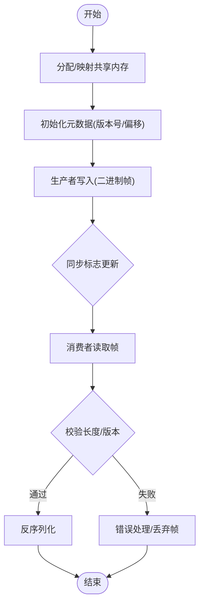

**图表来源** 
- [shared_memory_messagepack.cs](file://shared_memory_messagepack.cs)
- [shared_memory_serializer.cs](file://shared_memory_serializer.cs)

**章节来源**
- [shared_memory_messagepack.cs](file://shared_memory_messagepack.cs)
- [shared_memory_serializer.cs](file://shared_memory_serializer.cs)

### 管道流式序列化
- 设计要点
  - 基于流式写入/读取，逐步消费数据，避免一次性大对象。
  - 支持背压与流量控制，防止内存暴涨。
- 适用场景
  - 大文件、视频流、长连接消息队列。
- 优化点
  - 使用内存池分配小块缓冲，减少碎片。
  - 并行读写与流水线处理。

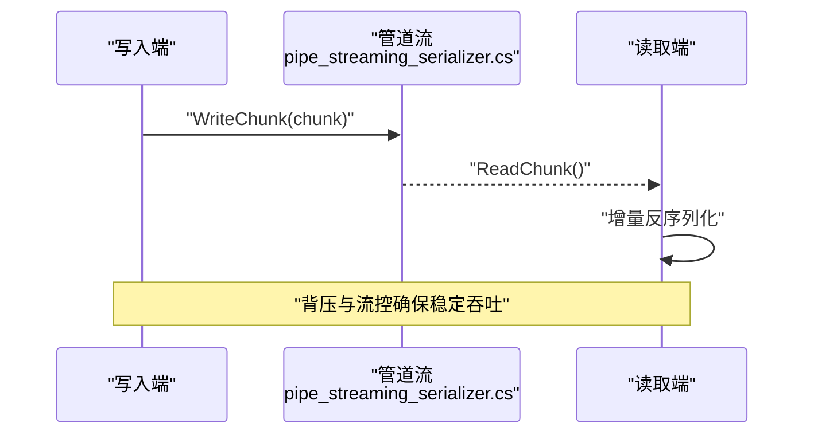

**图表来源** 
- [pipe_streaming_serializer.cs](file://pipe_streaming_serializer.cs)

**章节来源**
- [pipe_streaming_serializer.cs](file://pipe_streaming_serializer.cs)

### MemoryPack 高性能序列化
- 设计要点
  - 编译时代码生成，避免运行时反射与装箱。
  - 结构化二进制协议，字段顺序与类型强约束。
- 适用场景
  - 极致性能要求的进程内/进程间序列化。
- 优化点
  - 合理划分消息结构，避免过大对象。
  - 使用只读结构与不可变类型提升安全性与性能。

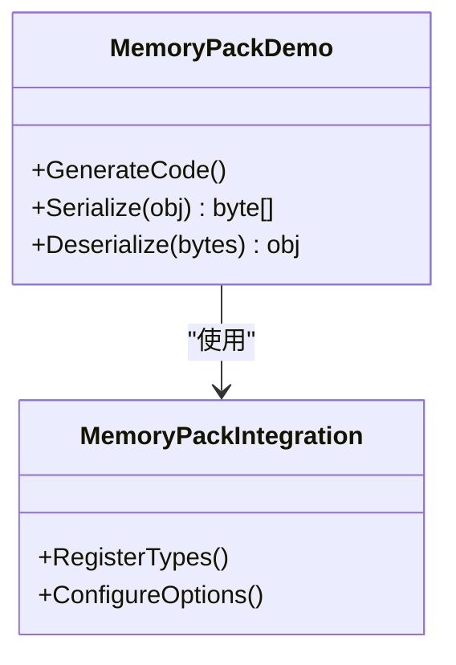

**图表来源** 
- [memorypack_demo.cs](file://memorypack_demo.cs)
- [memorypack_integration.cs](file://memorypack_integration.cs)

**章节来源**
- [memorypack_demo.cs](file://memorypack_demo.cs)
- [memorypack_integration.cs](file://memorypack_integration.cs)

### 混合序列化策略
- 设计要点
  - 根据消息大小、类型、目标平台动态选择序列化器。
  - 统一接口封装，屏蔽差异。
- 适用场景
  - 复杂业务中不同消息有不同性能需求。
- 优化点
  - 预热常用序列化器，减少首次开销。
  - 统计命中率，持续优化策略。

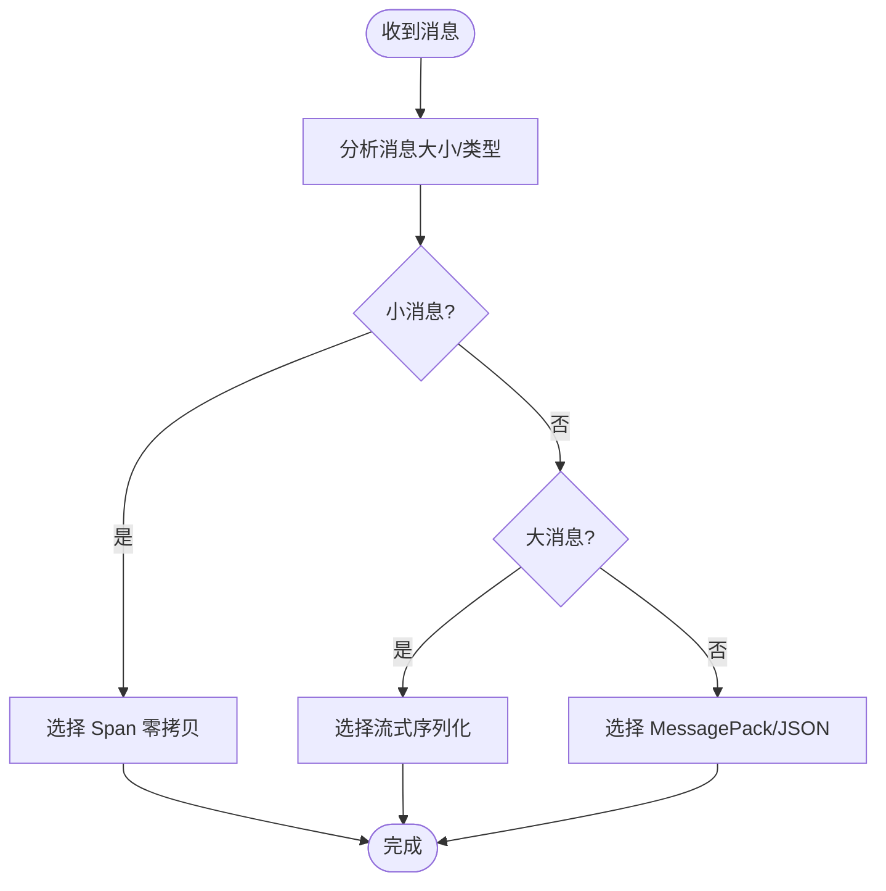

**图表来源** 
- [hybrid_serializer.cs](file://hybrid_serializer.cs)

**章节来源**
- [hybrid_serializer.cs](file://hybrid_serializer.cs)

### 线程安全内存池序列化
- 设计要点
  - 线程安全的缓冲池管理，避免竞争与泄漏。
  - 自动回收与超时清理。
- 适用场景
  - 高并发序列化/反序列化，GC 压力大。
- 优化点
  - 按工作线程维度隔离池，减少锁竞争。
  - 监控池命中率与溢出率。

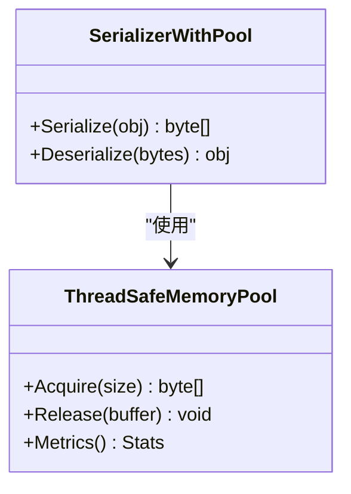

**图表来源** 
- [threadsafe_memorypool_serializer.cs](file://threadsafe_memorypool_serializer.cs)

**章节来源**
- [threadsafe_memorypool_serializer.cs](file://threadsafe_memorypool_serializer.cs)

### 可回收 MemoryStream
- 设计要点
  - 复用底层缓冲区，减少分配与释放。
  - 支持清空与重置，保持状态一致。
- 适用场景
  - 大量临时字节缓冲的场景。
- 优化点
  - 限制最大容量，防止内存膨胀。
  - 结合异步 I/O 提升吞吐。

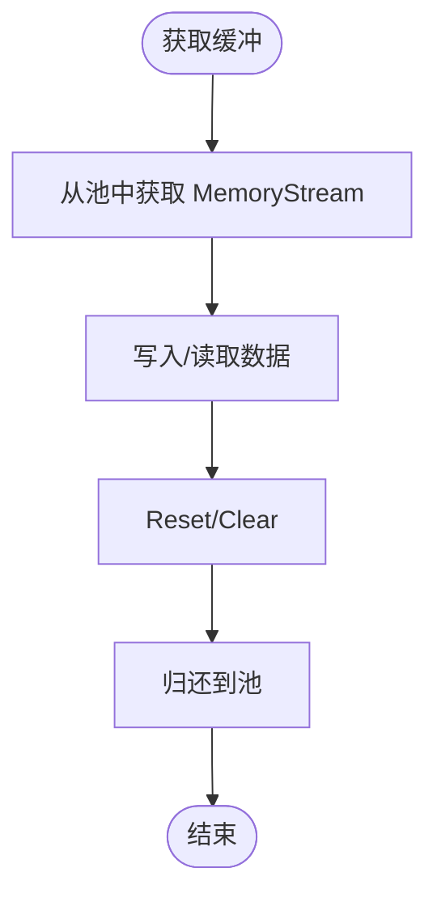

**图表来源** 
- [recyclable_memorystream_integration.cs](file://recyclable_memorystream_integration.cs)

**章节来源**
- [recyclable_memorystream_integration.cs](file://recyclable_memorystream_integration.cs)

## 依赖关系分析
各序列化组件通过统一的接口或策略层解耦，便于替换与扩展。下图展示关键依赖关系。

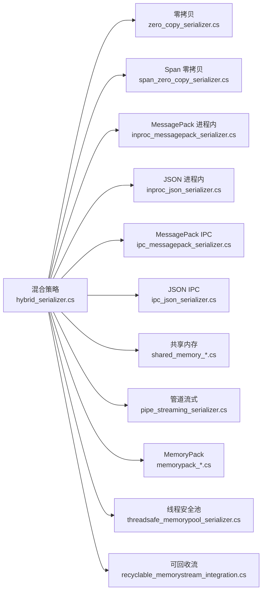

**图表来源** 
- [hybrid_serializer.cs](file://hybrid_serializer.cs)
- [zero_copy_serializer.cs](file://zero_copy_serializer.cs)
- [span_zero_copy_serializer.cs](file://span_zero_copy_serializer.cs)
- [inproc_messagepack_serializer.cs](file://inproc_messagepack_serializer.cs)
- [inproc_json_serializer.cs](file://inproc_json_serializer.cs)
- [ipc_messagepack_serializer.cs](file://ipc_messagepack_serializer.cs)
- [ipc_json_serializer.cs](file://ipc_json_serializer.cs)
- [shared_memory_messagepack.cs](file://shared_memory_messagepack.cs)
- [shared_memory_serializer.cs](file://shared_memory_serializer.cs)
- [pipe_streaming_serializer.cs](file://pipe_streaming_serializer.cs)
- [memorypack_demo.cs](file://memorypack_demo.cs)
- [memorypack_integration.cs](file://memorypack_integration.cs)
- [threadsafe_memorypool_serializer.cs](file://threadsafe_memorypool_serializer.cs)
- [recyclable_memorystream_integration.cs](file://recyclable_memorystream_integration.cs)

**章节来源**
- [hybrid_serializer.cs](file://hybrid_serializer.cs)
- [serialization_impl.cs](file://serialization_impl.cs)

## 性能考量与基准
- 零拷贝 vs 传统序列化
  - 零拷贝（Span<T>）在进程内高频小对象场景显著降低分配与拷贝开销，延迟更低。
  - 传统序列化（JSON/MessagePack）在跨进程或需兼容第三方时更实用。
- MessagePack vs JSON
  - MessagePack 二进制紧凑、解析更快，适合高吞吐；JSON 可读性强，适合调试与对外接口。
- 共享内存 vs 管道
  - 共享内存避免内核态拷贝，适合同机进程间高频交换；管道更通用，适合跨主机或容器化环境。
- 流式序列化
  - 适合大数据量与长连接，避免一次性分配导致 GC 抖动。
- 编译时代码生成（MemoryPack）
  - 通过生成专用序列化代码，消除反射与装箱，性能接近手写。
- 基准测试建议
  - 覆盖不同消息大小（小/中/大）、并发度、CPU/内存资源受限场景。
  - 记录吞吐（ops/s）、延迟（P50/P95/P99）、GC 分配与 CPU 使用率。
  - 对比不同序列化器在同一硬件与负载下的表现。

[本节为通用指导，不直接分析具体文件]

## 故障排查指南
- 常见错误
  - 缓冲区越界：检查 Span 长度与对齐，确保边界校验。
  - 版本不匹配：在 IPC 头中维护版本字段，升级时向后兼容。
  - 内存泄漏：确认缓冲池正确归还，避免循环引用。
  - 死锁与竞争：共享内存与池需合理使用锁或无锁结构。
- 诊断方法
  - 启用性能计数器与日志，定位热点路径。
  - 使用内存分析工具（如 dotnet-dump、PerfView）查看分配热点。
  - 压力测试与回归测试，验证稳定性。
- 修复建议
  - 增加断言与单元测试，覆盖边界条件。
  - 引入熔断与降级策略，保障系统可用性。

**章节来源**
- [zero_copy_serializer.cs](file://zero_copy_serializer.cs)
- [shared_memory_messagepack.cs](file://shared_memory_messagepack.cs)
- [threadsafe_memorypool_serializer.cs](file://threadsafe_memorypool_serializer.cs)
- [recyclable_memorystream_integration.cs](file://recyclable_memorystream_integration.cs)

## 结论
通过零拷贝、Span<T>、MessagePack、共享内存与流式序列化等技术的组合，可在不同场景下取得优异的序列化性能。选择合适的方案需综合考虑消息特征、部署环境与运维成本。建议以混合策略为核心，动态选择最优序列化器，并结合内存池、流式处理与编译时代码生成，持续提升吞吐与降低延迟。

[本节为总结，不直接分析具体文件]

## 附录：选型与调优清单
- 选型指南
  - 进程内高频小对象：优先 Span<T> 零拷贝或 MemoryPack。
  - 进程间通用通信：MessagePack IPC 或 JSON IPC（视兼容性需求）。
  - 同机高频交换：共享内存 + MessagePack。
  - 大数据量/长连接：管道流式序列化。
- 调优方法
  - 预热常用序列化器，减少冷启动开销。
  - 调整缓冲池大小与工作线程隔离。
  - 启用压缩（LZ4/Zstd）权衡 CPU 与带宽。
  - 监控指标：吞吐、延迟、GC 分配、CPU 使用率、池命中率。
- 最佳实践
  - 明确消息边界与版本管理。
  - 避免大对象与深嵌套结构。
  - 使用只读结构与不可变类型提升安全性。
  - 定期回归测试与性能审计。

[本节为通用指导，不直接分析具体文件]