# 性能优化

<cite>
**本文引用的文件**   
- [performance_metrics.cs](file://performance_metrics.cs)
- [performance_profiler_integration.cs](file://performance_profiler_integration.cs)
- [high_frequency_10m.cs](file://high_frequency_10m.cs)
- [high_frequency_1m.cs](file://high_frequency_1m.cs)
- [high_frequency_100k.cs](file://high_frequency_100k.cs)
- [zero_copy_serializer.cs](file://zero_copy_serializer.cs)
- [span_zero_copy_serializer.cs](file://span_zero_copy_serializer.cs)
- [zero_copy_messagepack.cs](file://zero_copy_messagepack.cs)
- [recyclable_memorystream.cs](file://recyclable_memorystream.cs)
- [recyclable_memorystream_integration.cs](file://recyclable_memorystream_integration.cs)
- [threadsafe_memorypool_optimized.cs](file://threadsafe_memorypool_optimized.cs)
- [tiered_memory_processor.cs](file://tiered_memory_processor.cs)
- [tiered_json_processor.cs](file://tiered_json_processor.cs)
- [inproc_json_serializer.cs](file://inproc_json_serializer.cs)
- [inproc_messagepack_serializer.cs](file://inproc_messagepack_serializer.cs)
- [shared_memory_messagepack.cs](file://shared_memory_messagepack.cs)
- [shared_memory_serializer.cs](file://shared_memory_serializer.cs)
- [pipe_streaming_serializer.cs](file://pipe_streaming_serializer.cs)
- [memory_streaming.cs](file://memory_streaming.cs)
- [memory_sse_streaming.cs](file://memory_sse_streaming.cs)
- [tail_latency_optimizer.cs](file://tail_latency_optimizer.cs)
- [watchdog_tail_latency.cs](file://watchdog_tail_latency.cs)
- [watchdog_memory.cs](file://watchdog_memory.cs)
- [prometheus_metrics.cs](file://prometheus_metrics.cs)
- [metrics_monitoring.cs](file://metrics_monitoring.cs)
- [metrics_influxdb.cs](file://metrics_influxdb.cs)
- [opentelemetry_production.cs](file://opentelemetry_production.cs)
- [appinsights_prometheus.cs](file://appinsights_prometheus.cs)
- [skyapm_prometheus.cs](file://skyapm_prometheus.cs)
- [datadog_prometheus.cs](file://datadog_prometheus.cs)
- [sqlite_connection_pool.cs](file://sqlite_connection_pool.cs)
- [sqlite_efcore_bulk.cs](file://sqlite_efcore_bulk.cs)
- [read_write_split.cs](file://read_write_split.cs)
- [efcore9_integration.cs](file://efcore9_integration.cs)
- [litedb_tieredmemory.cs](file://litedb_tieredmemory.cs)
- [litedb_dataflow.cs](file://litedb_dataflow.cs)
- [litedb_serialization.cs](file://litedb_serialization.cs)
- [stackexchange_redis_cache.cs](file://stackexchange_redis_cache.cs)
- [microsoft_cache_demo.cs](file://microsoft_cache_demo.cs)
- [fusioncache_demo.cs](file://fusioncache_demo.cs)
- [easycaching_demo.cs](file://easycaching_demo.cs)
- [kiota_cache.cs](file://kiota_cache.cs)
- [message_compression.cs](file://message_compression.cs)
- [compression_extension.cs](file://compression_extension.cs)
- [zstd_compression_integration.cs](file://zstd_compression_integration.cs)
- [brotli_compression_integration.cs](file://brotli_compression_integration.cs)
- [disruptor_production_integration.cs](file://disruptor_production_integration.cs)
- [disruptor_processor.cs](file://disruptor_processor.cs)
- [dataflow_production_integration.cs](file://dataflow_production_integration.cs)
- [signalr_production.cs](file://signalr_production.cs)
- [signalr_optimized.cs](file://signalr_optimized.cs)
- [kestrel_production.cs](file://kestrel_production.cs)
- [yarp_advanced_features.cs](file://yarp_advanced_features.cs)
- [webapiclientcore_performance.cs](file://webapiclientcore_performance.cs)
- [benchmark_demo.cs](file://benchmark_demo.cs)
- [custom_storage_profiler.cs](file://custom_storage_profiler.cs)
</cite>

## 目录
1. [简介](#简介)
2. [项目结构](#项目结构)
3. [核心组件](#核心组件)
4. [架构总览](#架构总览)
5. [详细组件分析](#详细组件分析)
6. [依赖关系分析](#依赖关系分析)
7. [性能考量与调优策略](#性能考量与调优策略)
8. [故障排查指南](#故障排查指南)
9. [结论](#结论)
10. [附录](#附录)

## 简介
本文件面向高吞吐、低延迟场景，系统性梳理内存优化、并发处理、数据库查询优化与缓存策略，并结合零拷贝序列化、内存池管理、垃圾回收调优与性能分析工具使用，提供可落地的实践方法与评估手段。文档以仓库中的示例与集成代码为依据，帮助读者快速定位热点、制定优化方案并验证效果。

## 项目结构
该仓库包含大量“集成/示例”类文件，覆盖序列化、流式处理、内存池、缓存、监控、数据库与网络栈等主题。针对性能优化，重点关注的模块包括：
- 零拷贝与高效序列化：零拷贝序列化、Span/MessagePack、管道流式序列化
- 内存管理与GC：可复用内存流、线程安全内存池、分层内存处理器
- 并发与高吞吐：Disruptor、DataFlow、SignalR/Kestrel/YARP 生产配置
- 数据库与缓存：SQLite连接池/批量写入、EF Core 9、LiteDB 分层内存、Redis/Microsoft/Fusion/EasyCaching 缓存
- 监控与剖析：Prometheus、OpenTelemetry、AppInsights/SkyAPM/Datadog、Tail Latency Watchdog、自定义存储剖析器

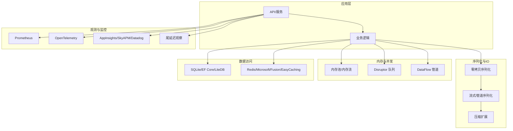

图表来源
- [performance_metrics.cs:1-200](file://performance_metrics.cs#L1-L200)
- [zero_copy_serializer.cs:1-200](file://zero_copy_serializer.cs#L1-L200)
- [recyclable_memorystream.cs:1-200](file://recyclable_memorystream.cs#L1-L200)
- [threadsafe_memorypool_optimized.cs:1-200](file://threadsafe_memorypool_optimized.cs#L1-L200)
- [disruptor_production_integration.cs:1-200](file://disruptor_production_integration.cs#L1-L200)
- [dataflow_production_integration.cs:1-200](file://dataflow_production_integration.cs#L1-L200)
- [efcore9_integration.cs:1-200](file://efcore9_integration.cs#L1-L200)
- [stackexchange_redis_cache.cs:1-200](file://stackexchange_redis_cache.cs#L1-L200)
- [prometheus_metrics.cs:1-200](file://prometheus_metrics.cs#L1-L200)
- [opentelemetry_production.cs:1-200](file://opentelemetry_production.cs#L1-L200)

章节来源
- [performance_metrics.cs:1-200](file://performance_metrics.cs#L1-L200)
- [performance_profiler_integration.cs:1-200](file://performance_profiler_integration.cs#L1-L200)

## 核心组件
- 零拷贝序列化：基于 Span/ReadOnlySpan 的序列化实现，避免中间缓冲分配，降低 GC 压力与拷贝开销。
- 流式与管道序列化：通过管道/流式接口将大对象分块处理，减少峰值内存占用。
- 内存池与内存流：线程安全的内存池与可复用内存流，显著降低频繁分配/释放带来的抖动。
- 分层内存处理器：按层级组织内存使用，结合淘汰策略控制峰值与碎片。
- 高并发队列与流水线：Disruptor 无锁环形队列与 DataFlow 有界缓冲区，提升吞吐并限制背压。
- 数据库批处理与连接池：SQLite 连接池与批量写入，EF Core 9 的性能特性与查询优化。
- 多级缓存：本地缓存（Microsoft/Fusion）+ 分布式缓存（Redis），配合一致性策略与过期策略。
- 监控与剖析：Prometheus 指标、OpenTelemetry 链路追踪、APM 集成、尾延迟观察与自定义存储剖析。

章节来源
- [zero_copy_serializer.cs:1-200](file://zero_copy_serializer.cs#L1-L200)
- [span_zero_copy_serializer.cs:1-200](file://span_zero_copy_serializer.cs#L1-L200)
- [zero_copy_messagepack.cs:1-200](file://zero_copy_messagepack.cs#L1-L200)
- [pipe_streaming_serializer.cs:1-200](file://pipe_streaming_serializer.cs#L1-L200)
- [recyclable_memorystream.cs:1-200](file://recyclable_memorystream.cs#L1-L200)
- [threadsafe_memorypool_optimized.cs:1-200](file://threadsafe_memorypool_optimized.cs#L1-L200)
- [tiered_memory_processor.cs:1-200](file://tiered_memory_processor.cs#L1-L200)
- [disruptor_production_integration.cs:1-200](file://disruptor_production_integration.cs#L1-L200)
- [dataflow_production_integration.cs:1-200](file://dataflow_production_integration.cs#L1-L200)
- [sqlite_connection_pool.cs:1-200](file://sqlite_connection_pool.cs#L1-L200)
- [sqlite_efcore_bulk.cs:1-200](file://sqlite_efcore_bulk.cs#L1-L200)
- [efcore9_integration.cs:1-200](file://efcore9_integration.cs#L1-L200)
- [stackexchange_redis_cache.cs:1-200](file://stackexchange_redis_cache.cs#L1-L200)
- [microsoft_cache_demo.cs:1-200](file://microsoft_cache_demo.cs#L1-L200)
- [fusioncache_demo.cs:1-200](file://fusioncache_demo.cs#L1-L200)
- [easycaching_demo.cs:1-200](file://easycaching_demo.cs#L1-L200)
- [prometheus_metrics.cs:1-200](file://prometheus_metrics.cs#L1-L200)
- [opentelemetry_production.cs:1-200](file://opentelemetry_production.cs#L1-L200)

## 架构总览
下图展示从请求入口到数据持久化与缓存的全链路关键路径，以及监控与剖析的接入点。

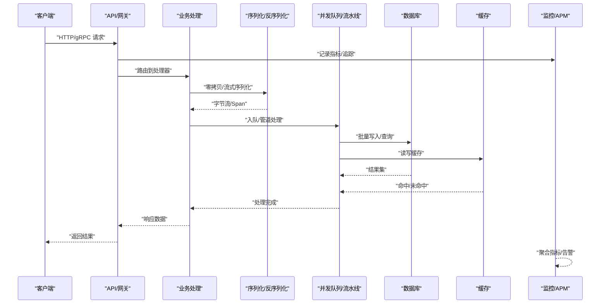

图表来源
- [performance_metrics.cs:1-200](file://performance_metrics.cs#L1-L200)
- [zero_copy_serializer.cs:1-200](file://zero_copy_serializer.cs#L1-L200)
- [disruptor_production_integration.cs:1-200](file://disruptor_production_integration.cs#L1-L200)
- [dataflow_production_integration.cs:1-200](file://dataflow_production_integration.cs#L1-L200)
- [efcore9_integration.cs:1-200](file://efcore9_integration.cs#L1-L200)
- [stackexchange_redis_cache.cs:1-200](file://stackexchange_redis_cache.cs#L1-L200)
- [prometheus_metrics.cs:1-200](file://prometheus_metrics.cs#L1-L200)
- [opentelemetry_production.cs:1-200](file://opentelemetry_production.cs#L1-L200)

## 详细组件分析

### 零拷贝序列化与消息包
- 设计要点
  - 基于 Span/ReadOnlySpan 的序列化，避免中间缓冲与额外分配。
  - MessagePack 零拷贝变体，减少解析时的内存复制。
  - 与管道/流式序列化组合，支持大对象分块传输。
- 适用场景
  - 高频短消息、内部 RPC、事件总线、日志采集。
- 优化建议
  - 优先使用 Span 序列化的 API；对热点路径启用零拷贝 MessagePack。
  - 合理设置缓冲区大小，避免频繁扩容。
  - 在 I/O 密集路径中结合管道序列化，降低峰值内存。

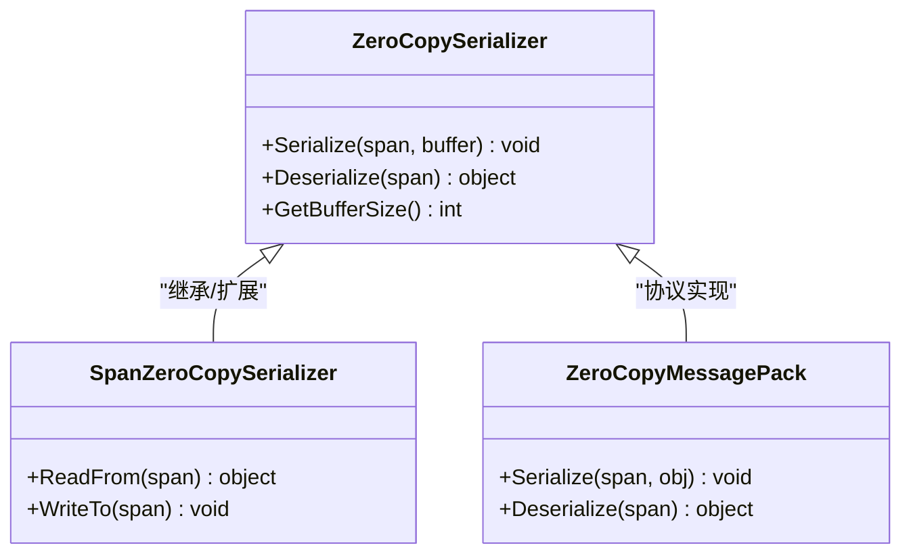

图表来源
- [zero_copy_serializer.cs:1-200](file://zero_copy_serializer.cs#L1-L200)
- [span_zero_copy_serializer.cs:1-200](file://span_zero_copy_serializer.cs#L1-L200)
- [zero_copy_messagepack.cs:1-200](file://zero_copy_messagepack.cs#L1-L200)

章节来源
- [zero_copy_serializer.cs:1-200](file://zero_copy_serializer.cs#L1-L200)
- [span_zero_copy_serializer.cs:1-200](file://span_zero_copy_serializer.cs#L1-L200)
- [zero_copy_messagepack.cs:1-200](file://zero_copy_messagepack.cs#L1-L200)

### 流式与管道序列化
- 设计要点
  - 使用 System.IO.Pipelines 或自定义流式接口，边读边写，避免一次性加载大对象。
  - 与压缩扩展结合，降低带宽与磁盘 IO。
- 适用场景
  - 大文件上传/下载、实时日志、视频/音频流、大数据导出。
- 优化建议
  - 设置合适的缓冲区与最大长度限制，防止 OOM。
  - 在热路径上复用流对象，减少分配。

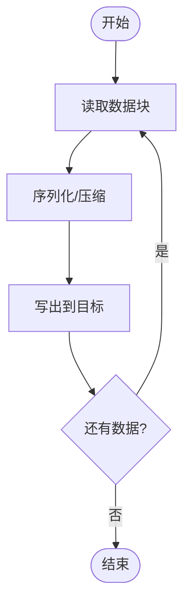

图表来源
- [pipe_streaming_serializer.cs:1-200](file://pipe_streaming_serializer.cs#L1-L200)
- [memory_streaming.cs:1-200](file://memory_streaming.cs#L1-L200)
- [memory_sse_streaming.cs:1-200](file://memory_sse_streaming.cs#L1-L200)
- [compression_extension.cs:1-200](file://compression_extension.cs#L1-L200)
- [zstd_compression_integration.cs:1-200](file://zstd_compression_integration.cs#L1-L200)
- [brotli_compression_integration.cs:1-200](file://brotli_compression_integration.cs#L1-L200)

章节来源
- [pipe_streaming_serializer.cs:1-200](file://pipe_streaming_serializer.cs#L1-L200)
- [memory_streaming.cs:1-200](file://memory_streaming.cs#L1-L200)
- [memory_sse_streaming.cs:1-200](file://memory_sse_streaming.cs#L1-L200)
- [compression_extension.cs:1-200](file://compression_extension.cs#L1-L200)
- [zstd_compression_integration.cs:1-200](file://zstd_compression_integration.cs#L1-L200)
- [brotli_compression_integration.cs:1-200](file://brotli_compression_integration.cs#L1-L200)

### 内存池与内存流
- 设计要点
  - 线程安全内存池，按尺寸分级缓存，减少分配/释放成本。
  - 可复用内存流，避免重复创建 MemoryStream。
- 适用场景
  - 高频小对象分配、临时缓冲、序列化/反序列化路径。
- 优化建议
  - 根据热点对象尺寸选择合适池大小，避免过大导致浪费。
  - 及时归还内存，避免泄漏；监控池命中率与等待时间。

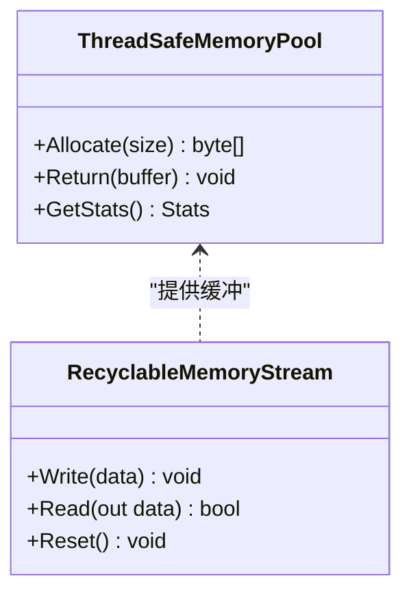

图表来源
- [threadsafe_memorypool_optimized.cs:1-200](file://threadsafe_memorypool_optimized.cs#L1-L200)
- [recyclable_memorystream.cs:1-200](file://recyclable_memorystream.cs#L1-L200)
- [recyclable_memorystream_integration.cs:1-200](file://recyclable_memorystream_integration.cs#L1-L200)

章节来源
- [threadsafe_memorypool_optimized.cs:1-200](file://threadsafe_memorypool_optimized.cs#L1-L200)
- [recyclable_memorystream.cs:1-200](file://recyclable_memorystream.cs#L1-L200)
- [recyclable_memorystream_integration.cs:1-200](file://recyclable_memorystream_integration.cs#L1-L200)

### 分层内存处理器
- 设计要点
  - 多层内存区域（如 L1/L2/L3），按热度与生命周期管理。
  - 结合淘汰策略（LRU/TTL）控制峰值与碎片。
- 适用场景
  - 热点数据缓存、事件缓冲、批处理中间态。
- 优化建议
  - 为不同层级设定容量上限与淘汰阈值。
  - 监控各层命中率与淘汰率，动态调整参数。

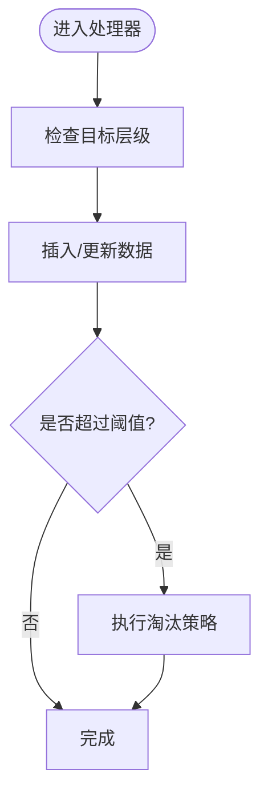

图表来源
- [tiered_memory_processor.cs:1-200](file://tiered_memory_processor.cs#L1-L200)
- [tiered_json_processor.cs:1-200](file://tiered_json_processor.cs#L1-L200)

章节来源
- [tiered_memory_processor.cs:1-200](file://tiered_memory_processor.cs#L1-L200)
- [tiered_json_processor.cs:1-200](file://tiered_json_processor.cs#L1-L200)

### 并发处理与高吞吐
- 设计要点
  - Disruptor 无锁环形队列，适合极低延迟与高吞吐的消息处理。
  - DataFlow 有界缓冲区与并行度控制，适合复杂流水线。
  - SignalR/Kestrel/YARP 生产配置，优化并发与资源限制。
- 适用场景
  - 高频事件处理、实时通信、网关转发、微服务间调用。
- 优化建议
  - 合理设置队列长度与消费者数量，避免背压与阻塞。
  - 使用异步 I/O 与非阻塞模型，减少线程切换。

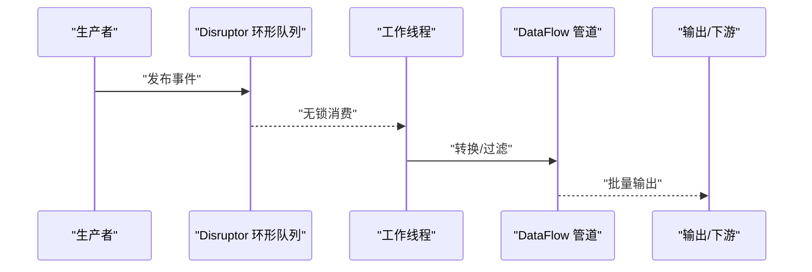

图表来源
- [disruptor_production_integration.cs:1-200](file://disruptor_production_integration.cs#L1-L200)
- [disruptor_processor.cs:1-200](file://disruptor_processor.cs#L1-L200)
- [dataflow_production_integration.cs:1-200](file://dataflow_production_integration.cs#L1-L200)
- [signalr_production.cs:1-200](file://signalr_production.cs#L1-L200)
- [signalr_optimized.cs:1-200](file://signalr_optimized.cs#L1-L200)
- [kestrel_production.cs:1-200](file://kestrel_production.cs#L1-L200)
- [yarp_advanced_features.cs:1-200](file://yarp_advanced_features.cs#L1-L200)

章节来源
- [disruptor_production_integration.cs:1-200](file://disruptor_production_integration.cs#L1-L200)
- [disruptor_processor.cs:1-200](file://disruptor_processor.cs#L1-L200)
- [dataflow_production_integration.cs:1-200](file://dataflow_production_integration.cs#L1-L200)
- [signalr_production.cs:1-200](file://signalr_production.cs#L1-L200)
- [signalr_optimized.cs:1-200](file://signalr_optimized.cs#L1-L200)
- [kestrel_production.cs:1-200](file://kestrel_production.cs#L1-L200)
- [yarp_advanced_features.cs:1-200](file://yarp_advanced_features.cs#L1-L200)

### 数据库查询优化
- 设计要点
  - SQLite 连接池与批量写入，减少连接开销与事务次数。
  - EF Core 9 的性能特性（如编译查询、跟踪优化）。
  - LiteDB 分层内存与序列化优化，适合嵌入式场景。
- 适用场景
  - 高写入负载、离线分析、边缘设备数据存储。
- 优化建议
  - 使用批量操作与最小化字段投影，减少 IO 与 CPU。
  - 合理设置连接池大小与超时，避免连接耗尽。

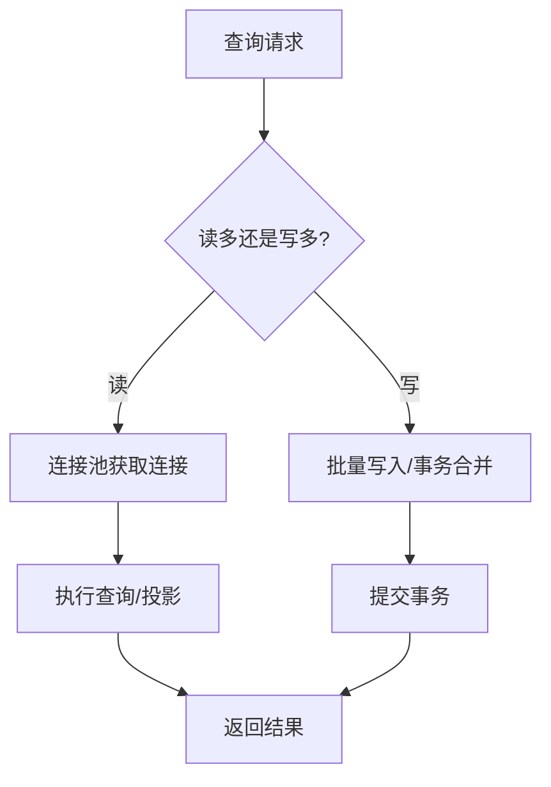

图表来源
- [sqlite_connection_pool.cs:1-200](file://sqlite_connection_pool.cs#L1-L200)
- [sqlite_efcore_bulk.cs:1-200](file://sqlite_efcore_bulk.cs#L1-L200)
- [read_write_split.cs:1-200](file://read_write_split.cs#L1-L200)
- [efcore9_integration.cs:1-200](file://efcore9_integration.cs#L1-L200)
- [litedb_tieredmemory.cs:1-200](file://litedb_tieredmemory.cs#L1-L200)
- [litedb_dataflow.cs:1-200](file://litedb_dataflow.cs#L1-L200)
- [litedb_serialization.cs:1-200](file://litedb_serialization.cs#L1-L200)

章节来源
- [sqlite_connection_pool.cs:1-200](file://sqlite_connection_pool.cs#L1-L200)
- [sqlite_efcore_bulk.cs:1-200](file://sqlite_efcore_bulk.cs#L1-L200)
- [read_write_split.cs:1-200](file://read_write_split.cs#L1-L200)
- [efcore9_integration.cs:1-200](file://efcore9_integration.cs#L1-L200)
- [litedb_tieredmemory.cs:1-200](file://litedb_tieredmemory.cs#L1-L200)
- [litedb_dataflow.cs:1-200](file://litedb_dataflow.cs#L1-L200)
- [litedb_serialization.cs:1-200](file://litedb_serialization.cs#L1-L200)

### 缓存策略
- 设计要点
  - 本地缓存（Microsoft.Extensions.Caching.Memory / Fusion）与分布式缓存（Redis）组合。
  - 多级缓存一致性策略、过期策略与回源机制。
- 适用场景
  - 热点数据加速、跨进程/跨节点共享、减轻后端压力。
- 优化建议
  - 设置合理的 TTL 与最大容量，避免缓存穿透/雪崩。
  - 监控命中率与回源率，动态调整策略。

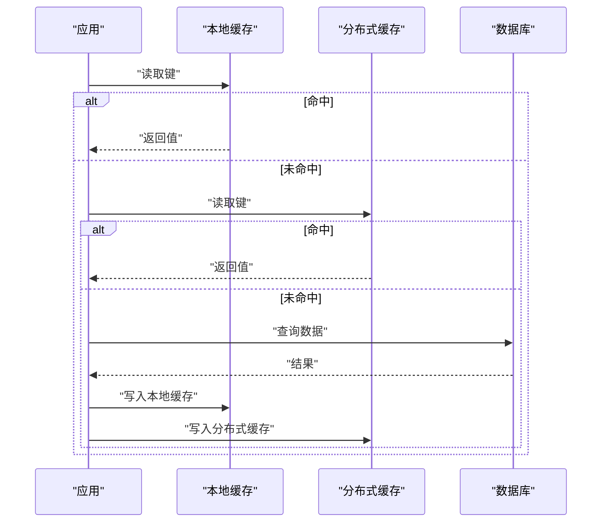

图表来源
- [stackexchange_redis_cache.cs:1-200](file://stackexchange_redis_cache.cs#L1-200)
- [microsoft_cache_demo.cs:1-200](file://microsoft_cache_demo.cs#L1-200)
- [fusioncache_demo.cs:1-200](file://fusioncache_demo.cs#L1-200)
- [easycaching_demo.cs:1-200](file://easycaching_demo.cs#L1-200)
- [kiota_cache.cs:1-200](file://kiota_cache.cs#L1-200)

章节来源
- [stackexchange_redis_cache.cs:1-200](file://stackexchange_redis_cache.cs#L1-200)
- [microsoft_cache_demo.cs:1-200](file://microsoft_cache_demo.cs#L1-200)
- [fusioncache_demo.cs:1-200](file://fusioncache_demo.cs#L1-200)
- [easycaching_demo.cs:1-200](file://easycaching_demo.cs#L1-200)
- [kiota_cache.cs:1-200](file://kiota_cache.cs#L1-200)

### 监控、剖析与尾延迟优化
- 设计要点
  - Prometheus 指标暴露、OpenTelemetry 链路追踪、APM 集成。
  - Tail Latency Watchdog 监控长尾延迟，触发告警与降级。
  - 自定义存储剖析器定位热点与内存问题。
- 适用场景
  - 线上稳定性保障、性能回归检测、瓶颈定位。
- 优化建议
  - 建立统一的指标口径与看板，持续跟踪关键 KPI。
  - 结合采样与聚合，降低监控开销。

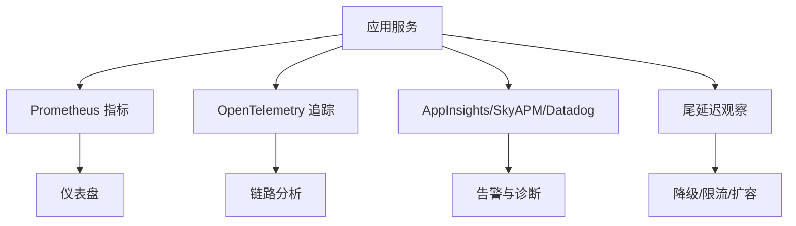

图表来源
- [prometheus_metrics.cs:1-200](file://prometheus_metrics.cs#L1-200)
- [opentelemetry_production.cs:1-200](file://opentelemetry_production.cs#L1-200)
- [appinsights_prometheus.cs:1-200](file://appinsights_prometheus.cs#L1-200)
- [skyapm_prometheus.cs:1-200](file://skyapm_prometheus.cs#L1-200)
- [datadog_prometheus.cs:1-200](file://datadog_prometheus.cs#L1-200)
- [watchdog_tail_latency.cs:1-200](file://watchdog_tail_latency.cs#L1-200)
- [custom_storage_profiler.cs:1-200](file://custom_storage_profiler.cs#L1-200)

章节来源
- [prometheus_metrics.cs:1-200](file://prometheus_metrics.cs#L1-200)
- [opentelemetry_production.cs:1-200](file://opentelemetry_production.cs#L1-200)
- [appinsights_prometheus.cs:1-200](file://appinsights_prometheus.cs#L1-200)
- [skyapm_prometheus.cs:1-200](file://skyapm_prometheus.cs#L1-200)
- [datadog_prometheus.cs:1-200](file://datadog_prometheus.cs#L1-200)
- [watchdog_tail_latency.cs:1-200](file://watchdog_tail_latency.cs#L1-200)
- [custom_storage_profiler.cs:1-200](file://custom_storage_profiler.cs#L1-200)

## 依赖关系分析
- 组件耦合
  - 序列化与流式处理紧密耦合，常与压缩扩展组合。
  - 内存池与内存流被序列化与数据处理广泛使用。
  - 并发队列与流水线位于业务与数据访问之间，起到削峰填谷作用。
  - 监控与剖析贯穿全链路，需最小化开销。
- 外部依赖
  - Redis、SQLite、EF Core、LiteDB、Kestrel、YARP、SignalR、OpenTelemetry、Prometheus、APM。
- 潜在循环依赖
  - 确保监控不反向依赖业务逻辑，避免引入额外耦合。

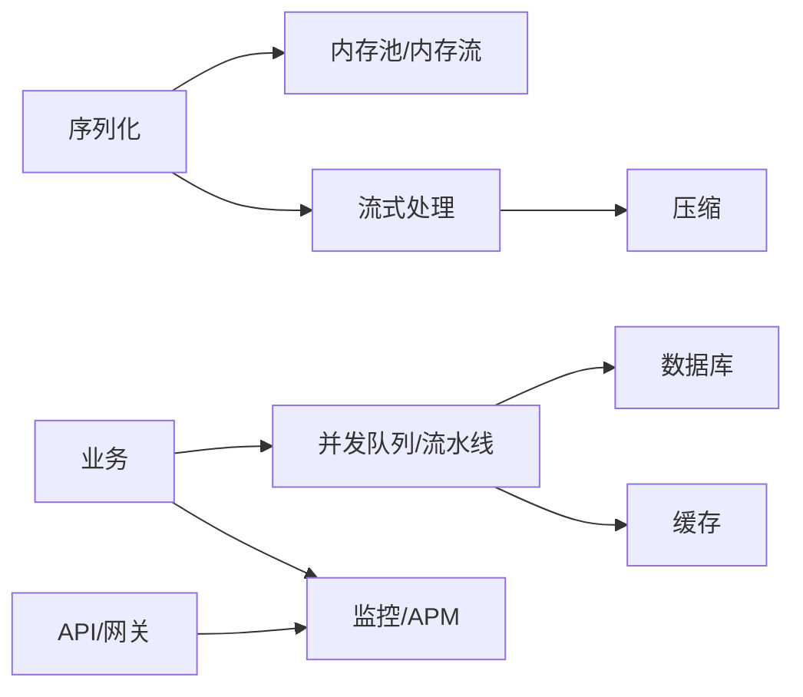

图表来源
- [zero_copy_serializer.cs:1-200](file://zero_copy_serializer.cs#L1-200)
- [recyclable_memorystream.cs:1-200](file://recyclable_memorystream.cs#L1-200)
- [threadsafe_memorypool_optimized.cs:1-200](file://threadsafe_memorypool_optimized.cs#L1-200)
- [disruptor_production_integration.cs:1-200](file://disruptor_production_integration.cs#L1-200)
- [dataflow_production_integration.cs:1-200](file://dataflow_production_integration.cs#L1-200)
- [efcore9_integration.cs:1-200](file://efcore9_integration.cs#L1-200)
- [stackexchange_redis_cache.cs:1-200](file://stackexchange_redis_cache.cs#L1-200)
- [prometheus_metrics.cs:1-200](file://prometheus_metrics.cs#L1-200)
- [opentelemetry_production.cs:1-200](file://opentelemetry_production.cs#L1-200)

章节来源
- [performance_metrics.cs:1-200](file://performance_metrics.cs#L1-200)
- [performance_profiler_integration.cs:1-200](file://performance_profiler_integration.cs#L1-200)

## 性能考量与调优策略
- 内存优化
  - 使用零拷贝序列化与 Span 类型，减少分配与拷贝。
  - 采用线程安全内存池与可复用内存流，降低 GC 压力。
  - 分层内存处理器结合淘汰策略，控制峰值与碎片。
- 并发处理
  - 使用 Disruptor 与 DataFlow 构建高吞吐流水线，设置合理背压。
  - 优化 Kestrel/YARP/SignalR 的生产配置，限制并发与资源。
- 数据库查询优化
  - SQLite 连接池与批量写入，EF Core 9 编译查询与投影优化。
  - LiteDB 分层内存与序列化优化，适合嵌入式与边缘场景。
- 缓存策略
  - 本地+分布式多级缓存，设置 TTL、容量与一致性策略。
  - 监控命中率与回源率，动态调整参数。
- 零拷贝序列化
  - 优先 Span/ReadOnlySpan 序列化；MessagePack 零拷贝变体用于热点路径。
- 内存池管理
  - 按对象尺寸分级缓存，监控命中率与等待时间。
- 垃圾回收调优
  - 根据工作负载调整 GC 模式与阈值，减少停顿与抖动。
- 性能分析工具
  - 使用 BenchmarkDotNet 进行基准测试，结合 Profiler 定位热点。
  - 使用自定义存储剖析器与 Watchdog 监控内存与尾延迟。
- 高吞吐量场景调优
  - 合理设置队列长度、消费者数量与超时，避免阻塞与溢出。
  - 使用异步 I/O 与非阻塞模型，减少线程切换。
- 热点代码优化
  - 识别热点路径，减少分支与装箱，内联关键函数。
- 资源限制配置
  - 限制 CPU、内存、连接数与并发度，避免资源争用。
- 性能监控与瓶颈定位
  - 统一指标口径，建立看板与告警；结合链路追踪定位慢点。
- 优化效果评估
  - 对比基线与优化后指标（吞吐、延迟、错误率、资源使用），持续迭代。

[本节为通用指导，无需特定文件引用]

## 故障排查指南
- 常见问题
  - 内存泄漏：检查内存池归还与流对象释放。
  - 高延迟：关注队列堆积、数据库锁与缓存穿透。
  - GC 抖动：减少频繁分配，使用对象池与零拷贝序列化。
  - 连接耗尽：调整连接池大小与超时，避免长时间持有。
- 排查步骤
  - 开启监控与追踪，定位热点与慢点。
  - 使用 Profiler 分析 CPU 与内存分布。
  - 逐步缩小范围，复现问题并验证修复。
- 工具推荐
  - Prometheus/OpenTelemetry/APM 可视化与告警。
  - BenchmarkDotNet 与自定义剖析器进行基准与热点分析。

章节来源
- [watchdog_memory.cs:1-200](file://watchdog_memory.cs#L1-200)
- [watchdog_tail_latency.cs:1-200](file://watchdog_tail_latency.cs#L1-200)
- [custom_storage_profiler.cs:1-200](file://custom_storage_profiler.cs#L1-200)
- [performance_metrics.cs:1-200](file://performance_metrics.cs#L1-200)
- [performance_profiler_integration.cs:1-200](file://performance_profiler_integration.cs#L1-200)

## 结论
通过零拷贝序列化、内存池与分层内存管理、高并发队列与流水线、数据库批处理与连接池、多级缓存与监控剖析，可在高吞吐与低延迟场景中显著提升性能与稳定性。建议以指标驱动持续优化，结合基准测试与在线监控，形成闭环优化流程。

[本节为总结性内容，无需特定文件引用]

## 附录
- 高频率场景参考
  - 10M/1M/100K 级别吞吐示例，用于验证优化效果与参数调优。
- 压缩与传输优化
  - Zstd/Brotli 压缩与压缩扩展，降低带宽与 IO 压力。
- 客户端性能
  - WebApiClientCore 性能优化，减少握手与连接开销。

章节来源
- [high_frequency_10m.cs:1-200](file://high_frequency_10m.cs#L1-200)
- [high_frequency_1m.cs:1-200](file://high_frequency_1m.cs#L1-200)
- [high_frequency_100k.cs:1-200](file://high_frequency_100k.cs#L1-200)
- [zstd_compression_integration.cs:1-200](file://zstd_compression_integration.cs#L1-200)
- [brotli_compression_integration.cs:1-200](file://brotli_compression_integration.cs#L1-200)
- [webapiclientcore_performance.cs:1-200](file://webapiclientcore_performance.cs#L1-200)
- [benchmark_demo.cs:1-200](file://benchmark_demo.cs#L1-200)