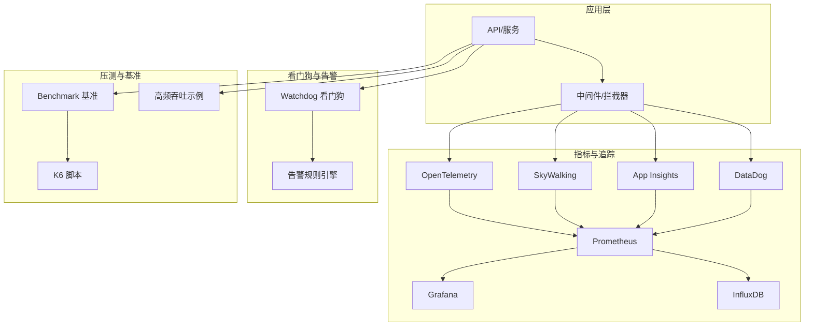
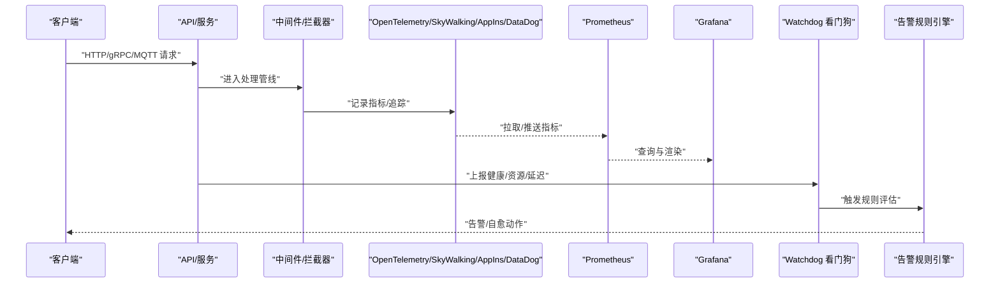
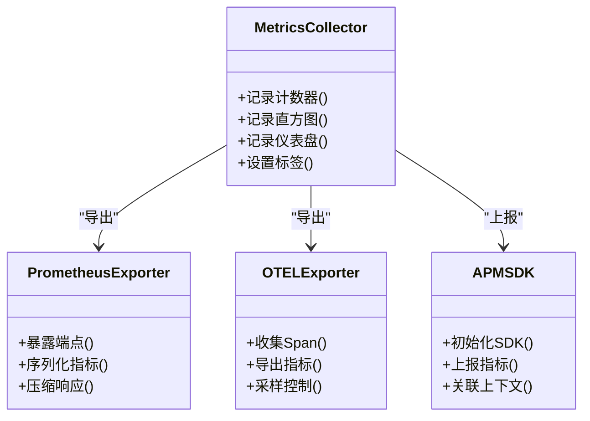
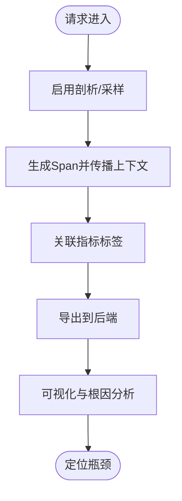
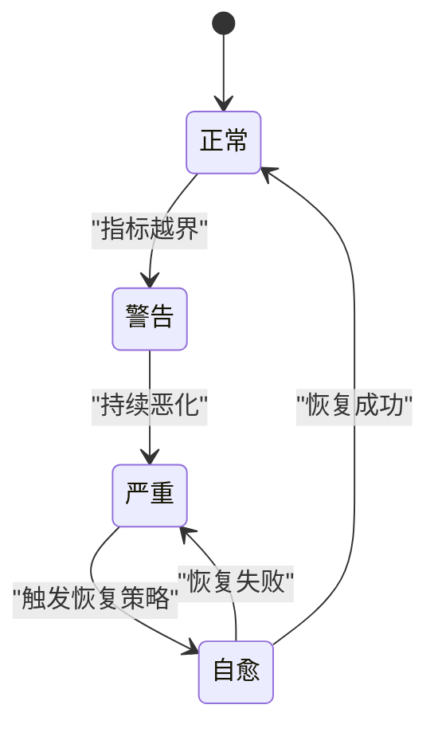
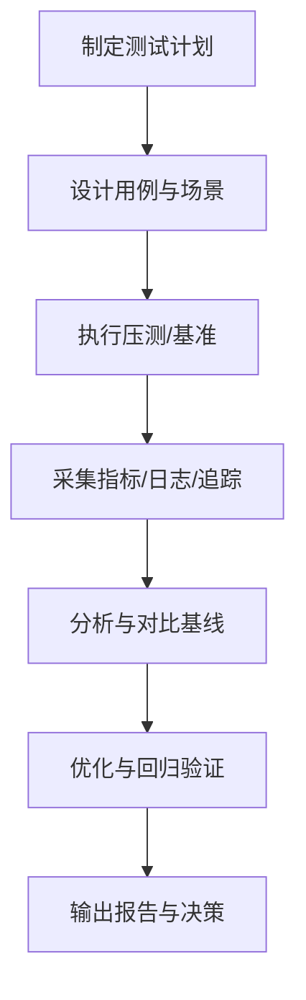
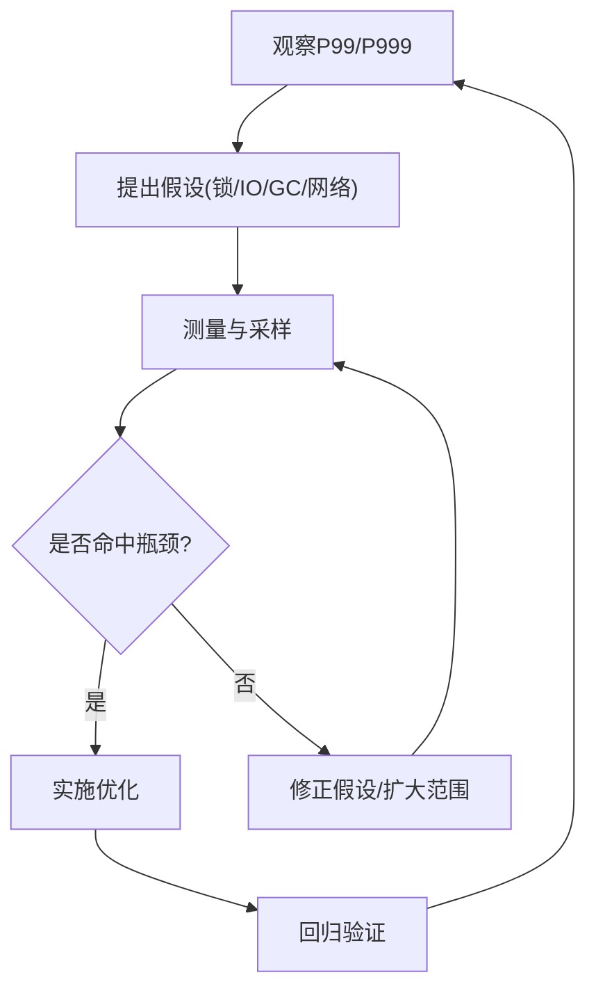
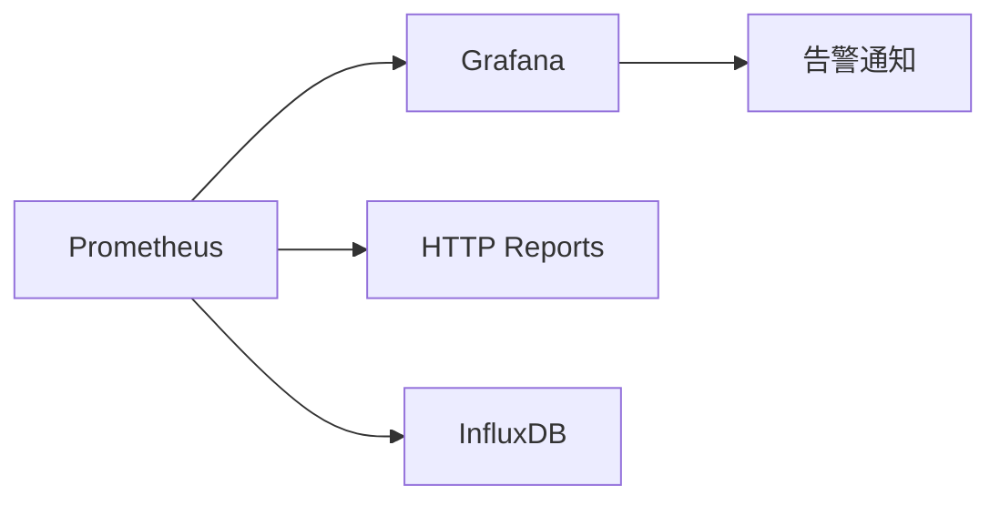
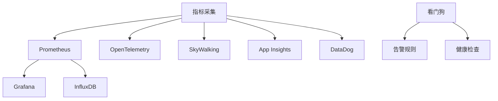

# 性能监控

<cite>
**本文引用的文件**   
- [performance_metrics.cs](file://performance_metrics.cs)
- [performance_profiler_integration.cs](file://performance_profiler_integration.cs)
- [metrics_monitoring.cs](file://metrics_monitoring.cs)
- [prometheus_metrics.cs](file://prometheus_metrics.cs)
- [opentelemetry_prometheus.cs](file://opentelemetry_prometheus.cs)
- [skyapm_prometheus.cs](file://skyapm_prometheus.cs)
- [datadog_prometheus.cs](file://datadog_prometheus.cs)
- [appinsights_prometheus.cs](file://appinsights_prometheus.cs)
- [watchdog_integration.cs](file://watchdog_integration.cs)
- [watchdog_alert_rules.cs](file://watchdog_alert_rules.cs)
- [watchdog_memory.cs](file://watchdog_memory.cs)
- [watchdog_tail_latency.cs](file://watchdog_tail_latency.cs)
- [watchdog_pipeline.cs](file://watchdog_pipeline.cs)
- [watchdog_disruptor.cs](file://watchdog_disruptor.cs)
- [watchdog_visualization.cs](file://watchdog_visualization.cs)
- [alert_rules.cs](file://alert_rules.cs)
- [alerting_profiler.cs](file://alerting_profiler.cs)
- [benchmark_demo.cs](file://benchmark_demo.cs)
- [k6_todo_benchmark.js](file://k6_todo_benchmark.js)
- [high_frequency_100k.cs](file://high_frequency_100k.cs)
- [high_frequency_1m.cs](file://high_frequency_1m.cs)
- [high_frequency_10m.cs](file://high_frequency_10m.cs)
- [tail_latency_optimizer.cs](file://tail_latency_optimizer.cs)
- [memory_leak_detection.cs](file://memory_leak_detection.cs)
- [distributed_tracing_profiler.cs](file://distributed_tracing_profiler.cs)
- [httpreports_prometheus.cs](file://httpreports_prometheus.cs)
- [grafana_integration.cs](file://grafana_integration.cs)
- [influxdb_integration.cs](file://influxdb_integration.cs)
</cite>

## 目录
1. [简介](#简介)
2. [项目结构](#项目结构)
3. [核心组件](#核心组件)
4. [架构总览](#架构总览)
5. [详细组件分析](#详细组件分析)
6. [依赖关系分析](#依赖关系分析)
7. [性能考量](#性能考量)
8. [故障排查指南](#故障排查指南)
9. [结论](#结论)
10. [附录](#附录)

## 简介
本文件面向性能监控与可观测性，系统性覆盖指标采集、分析器集成、告警规则配置与看门狗监控机制。内容涵盖APM工具集成（OpenTelemetry、SkyWalking、App Insights、DataDog等）、实时性能监控、性能基线建立与异常检测，并提供性能测试框架、负载与压力测试方法，以及问题诊断与调优指导。目标是帮助读者快速搭建稳定、可扩展且可运维的性能监控体系。

## 项目结构
仓库以“能力/主题”组织大量独立示例与集成文件，性能相关能力主要分布在以下类别：
- 指标与监控：metrics_*、prometheus_*、opentelemetry_*、skyapm_*、datadog_*、appinsights_*、httpreports_*、grafana_*、influxdb_*
- 分析器与追踪：performance_profiler_integration.cs、distributed_tracing_profiler.cs、miniprofiler_integration.cs
- 看门狗与告警：watchdog_*、alert_rules.cs、alerting_profiler.cs
- 基准与压测：benchmark_demo.cs、k6_todo_benchmark.js、high_frequency_*
- 优化与诊断：tail_latency_optimizer.cs、memory_leak_detection.cs

图表来源
- [metrics_monitoring.cs](file://metrics_monitoring.cs)
- [prometheus_metrics.cs](file://prometheus_metrics.cs)
- [opentelemetry_prometheus.cs](file://opentelemetry_prometheus.cs)
- [skyapm_prometheus.cs](file://skyapm_prometheus.cs)
- [datadog_prometheus.cs](file://datadog_prometheus.cs)
- [appinsights_prometheus.cs](file://appinsights_prometheus.cs)
- [grafana_integration.cs](file://grafana_integration.cs)
- [influxdb_integration.cs](file://influxdb_integration.cs)
- [watchdog_integration.cs](file://watchdog_integration.cs)
- [alert_rules.cs](file://alert_rules.cs)
- [benchmark_demo.cs](file://benchmark_demo.cs)
- [k6_todo_benchmark.js](file://k6_todo_benchmark.js)
- [high_frequency_100k.cs](file://high_frequency_100k.cs)

章节来源
- [metrics_monitoring.cs](file://metrics_monitoring.cs)
- [prometheus_metrics.cs](file://prometheus_metrics.cs)

## 核心组件
- 指标采集与导出
  - 内置指标：请求计数、延迟分布、错误率、资源使用（CPU/内存/GC）等
  - 导出目标：Prometheus、InfluxDB、Grafana 可视化
  - APM 集成：OpenTelemetry、SkyWalking、App Insights、DataDog 的指标/追踪导出
- 分析器与分布式追踪
  - 代码级剖析：Miniprofiler、自定义 Profiler
  - 分布式追踪：OpenTelemetry/SkyWalking 链路聚合
- 看门狗与告警
  - 健康检查、内存/尾延迟阈值、管道背压、Disruptor 队列水位
  - 告警规则引擎：阈值、SLO、同比环比、动态基线
- 基准与压测
  - BenchmarkDotNet 基准、K6 脚本、高频吞吐示例
- 优化与诊断
  - 尾延迟优化、内存泄漏检测、GC 行为分析

章节来源
- [performance_metrics.cs](file://performance_metrics.cs)
- [metrics_monitoring.cs](file://metrics_monitoring.cs)
- [prometheus_metrics.cs](file://prometheus_metrics.cs)
- [opentelemetry_prometheus.cs](file://opentelemetry_prometheus.cs)
- [skyapm_prometheus.cs](file://skyapm_prometheus.cs)
- [datadog_prometheus.cs](file://datadog_prometheus.cs)
- [appinsights_prometheus.cs](file://appinsights_prometheus.cs)
- [grafana_integration.cs](file://grafana_integration.cs)
- [influxdb_integration.cs](file://influxdb_integration.cs)

## 架构总览
下图展示从应用到指标/追踪再到可视化的整体数据流，以及看门狗与告警的闭环控制。

图表来源
- [metrics_monitoring.cs](file://metrics_monitoring.cs)
- [prometheus_metrics.cs](file://prometheus_metrics.cs)
- [opentelemetry_prometheus.cs](file://opentelemetry_prometheus.cs)
- [skyapm_prometheus.cs](file://skyapm_prometheus.cs)
- [datadog_prometheus.cs](file://datadog_prometheus.cs)
- [appinsights_prometheus.cs](file://appinsights_prometheus.cs)
- [grafana_integration.cs](file://grafana_integration.cs)
- [watchdog_integration.cs](file://watchdog_integration.cs)
- [alert_rules.cs](file://alert_rules.cs)

## 详细组件分析

### 指标采集与导出（Prometheus/OpenTelemetry/APM）
- 指标定义与采集
  - 计数器、直方图、仪表盘、摘要等类型的使用与标签设计
  - 关键指标：请求数、错误率、P50/P90/P99 延迟、吞吐量、GC 次数/耗时、线程池/队列长度
- 导出与对接
  - Prometheus 端点暴露与抓取间隔
  - OpenTelemetry 指标/追踪导出到后端
  - SkyWalking/App Insights/DataDog 的 SDK 接入与采样策略
- 可视化与报表
  - Grafana 面板模板与告警联动
  - InfluxDB 时序存储与查询

图表来源
- [prometheus_metrics.cs](file://prometheus_metrics.cs)
- [opentelemetry_prometheus.cs](file://opentelemetry_prometheus.cs)
- [skyapm_prometheus.cs](file://skyapm_prometheus.cs)
- [datadog_prometheus.cs](file://datadog_prometheus.cs)
- [appinsights_prometheus.cs](file://appinsights_prometheus.cs)
- [metrics_monitoring.cs](file://metrics_monitoring.cs)

章节来源
- [prometheus_metrics.cs](file://prometheus_metrics.cs)
- [opentelemetry_prometheus.cs](file://opentelemetry_prometheus.cs)
- [skyapm_prometheus.cs](file://skyapm_prometheus.cs)
- [datadog_prometheus.cs](file://datadog_prometheus.cs)
- [appinsights_prometheus.cs](file://appinsights_prometheus.cs)
- [metrics_monitoring.cs](file://metrics_monitoring.cs)

### 分析器与分布式追踪集成
- 代码级剖析
  - Miniprofiler 集成用于开发/测试环境热点定位
  - 自定义 Profiler 针对关键路径进行采样
- 分布式追踪
  - OpenTelemetry/SkyWalking 链路注入与跨进程传播
  - 追踪采样策略（按延迟/错误率/权重）
- 与指标联动
  - 将 Span 与指标标签关联，便于根因分析

图表来源
- [performance_profiler_integration.cs](file://performance_profiler_integration.cs)
- [distributed_tracing_profiler.cs](file://distributed_tracing_profiler.cs)
- [miniprofiler_integration.cs](file://miniprofiler_integration.cs)

章节来源
- [performance_profiler_integration.cs](file://performance_profiler_integration.cs)
- [distributed_tracing_profiler.cs](file://distributed_tracing_profiler.cs)

### 看门狗监控与告警规则
- 看门狗职责
  - 健康检查、资源水位（内存/CPU/GC）、尾延迟阈值、管道背压、消息队列水位
  - 自动恢复：限流、熔断、降级、重启子进程
- 告警规则
  - 静态阈值、动态基线（移动平均/分位数）、同比环比、复合条件
  - 通知渠道：Webhook、邮件、IM、工单系统
- 可视化与演练
  - Grafana 看板、告警历史、变更回溯

图表来源
- [watchdog_integration.cs](file://watchdog_integration.cs)
- [watchdog_alert_rules.cs](file://watchdog_alert_rules.cs)
- [watchdog_memory.cs](file://watchdog_memory.cs)
- [watchdog_tail_latency.cs](file://watchdog_tail_latency.cs)
- [watchdog_pipeline.cs](file://watchdog_pipeline.cs)
- [watchdog_disruptor.cs](file://watchdog_disruptor.cs)
- [alert_rules.cs](file://alert_rules.cs)

章节来源
- [watchdog_integration.cs](file://watchdog_integration.cs)
- [watchdog_alert_rules.cs](file://watchdog_alert_rules.cs)
- [watchdog_memory.cs](file://watchdog_memory.cs)
- [watchdog_tail_latency.cs](file://watchdog_tail_latency.cs)
- [watchdog_pipeline.cs](file://watchdog_pipeline.cs)
- [watchdog_disruptor.cs](file://watchdog_disruptor.cs)
- [alert_rules.cs](file://alert_rules.cs)

### 性能测试框架与压测方法
- 基准测试
  - BenchmarkDotNet 用例设计与结果解读
- 负载与压力测试
  - K6 脚本编写与场景编排
  - 高频吞吐示例验证系统极限
- 稳定性与回归
  - 长期运行、混沌工程、回归对比

图表来源
- [benchmark_demo.cs](file://benchmark_demo.cs)
- [k6_todo_benchmark.js](file://k6_todo_benchmark.js)
- [high_frequency_100k.cs](file://high_frequency_100k.cs)
- [high_frequency_1m.cs](file://high_frequency_1m.cs)
- [high_frequency_10m.cs](file://high_frequency_10m.cs)

章节来源
- [benchmark_demo.cs](file://benchmark_demo.cs)
- [k6_todo_benchmark.js](file://k6_todo_benchmark.js)
- [high_frequency_100k.cs](file://high_frequency_100k.cs)
- [high_frequency_1m.cs](file://high_frequency_1m.cs)
- [high_frequency_10m.cs](file://high_frequency_10m.cs)

### 尾延迟优化与内存诊断
- 尾延迟优化
  - 超时/重试/退避、批量/异步、缓存/预取、连接池/线程池调优
- 内存诊断
  - GC 行为分析、对象分配热点、内存泄漏检测
- 数据库与IO
  - 慢查询、连接池、缓冲与零拷贝

图表来源
- [tail_latency_optimizer.cs](file://tail_latency_optimizer.cs)
- [memory_leak_detection.cs](file://memory_leak_detection.cs)

章节来源
- [tail_latency_optimizer.cs](file://tail_latency_optimizer.cs)
- [memory_leak_detection.cs](file://memory_leak_detection.cs)

### 可视化与报表
- Grafana 面板与告警联动
- HTTP Reports 与 Prometheus 集成
- InfluxDB 时序存储与查询

图表来源
- [grafana_integration.cs](file://grafana_integration.cs)
- [httpreports_prometheus.cs](file://httpreports_prometheus.cs)
- [influxdb_integration.cs](file://influxdb_integration.cs)

章节来源
- [grafana_integration.cs](file://grafana_integration.cs)
- [httpreports_prometheus.cs](file://httpreports_prometheus.cs)
- [influxdb_integration.cs](file://influxdb_integration.cs)

## 依赖关系分析
- 组件耦合
  - 指标采集与导出模块相对解耦，通过统一接口对接不同后端
  - 看门狗与告警规则之间低耦合，规则可热更新
- 外部依赖
  - Prometheus/Grafana/InfluxDB 作为指标与可视化后端
  - APM 厂商 SDK（OpenTelemetry/SkyWalking/App Insights/DataDog）
- 潜在循环依赖
  - 建议通过事件总线或消息队列解耦看门狗与业务逻辑

图表来源
- [prometheus_metrics.cs](file://prometheus_metrics.cs)
- [opentelemetry_prometheus.cs](file://opentelemetry_prometheus.cs)
- [skyapm_prometheus.cs](file://skyapm_prometheus.cs)
- [datadog_prometheus.cs](file://datadog_prometheus.cs)
- [appinsights_prometheus.cs](file://appinsights_prometheus.cs)
- [grafana_integration.cs](file://grafana_integration.cs)
- [influxdb_integration.cs](file://influxdb_integration.cs)
- [watchdog_integration.cs](file://watchdog_integration.cs)
- [alert_rules.cs](file://alert_rules.cs)

章节来源
- [prometheus_metrics.cs](file://prometheus_metrics.cs)
- [opentelemetry_prometheus.cs](file://opentelemetry_prometheus.cs)
- [skyapm_prometheus.cs](file://skyapm_prometheus.cs)
- [datadog_prometheus.cs](file://datadog_prometheus.cs)
- [appinsights_prometheus.cs](file://appinsights_prometheus.cs)
- [grafana_integration.cs](file://grafana_integration.cs)
- [influxdb_integration.cs](file://influxdb_integration.cs)
- [watchdog_integration.cs](file://watchdog_integration.cs)
- [alert_rules.cs](file://alert_rules.cs)

## 性能考量
- 指标开销控制
  - 采样与降采样、批处理导出、避免热点路径频繁分配
- 追踪成本
  - 合理采样率、减少Span数量、合并冗余Span
- 存储与查询
  - 保留策略、分区与索引、查询优化
- 高并发与背压
  - 队列容量、背压策略、优雅降级
- 资源隔离
  - 进程/容器隔离、CPU/内存限制、GC 模式选择

[本节为通用指导，不直接分析具体文件]

## 故障排查指南
- 常见问题
  - 指标缺失/延迟：检查导出端点、抓取间隔、网络与权限
  - 追踪断裂：确认上下文传播、采样策略、跨语言/跨进程边界
  - 告警风暴：去重、抑制、分级与静默窗口
  - 内存泄漏：堆快照、分配热点、弱引用与终结器
- 诊断步骤
  - 复现与最小化用例、开启详细日志、采集快照与火焰图
  - 结合追踪与指标定位根因，逐步缩小范围
- 恢复策略
  - 限流/熔断/降级、滚动重启、回滚版本、扩容缩容

章节来源
- [alerting_profiler.cs](file://alerting_profiler.cs)
- [memory_leak_detection.cs](file://memory_leak_detection.cs)
- [watchdog_alert_rules.cs](file://watchdog_alert_rules.cs)

## 结论
通过统一的指标采集、APM 集成、看门狗与告警规则、完善的压测与基准体系，以及针对性的尾延迟与内存优化方法，可以构建高可用、可观测、易运维的性能监控体系。建议在上线前完成基线建立与回归验证，在运行期持续监控与迭代优化。

[本节为总结，不直接分析具体文件]

## 附录
- 术语表
  - 指标、追踪、看门狗、告警、基线、SLO、SLI、SLA
- 参考实践
  - 指标命名规范、标签设计原则、告警分级策略
  - 压测场景设计、容量规划与弹性伸缩

[本节为补充信息，不直接分析具体文件]