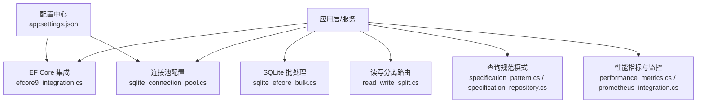
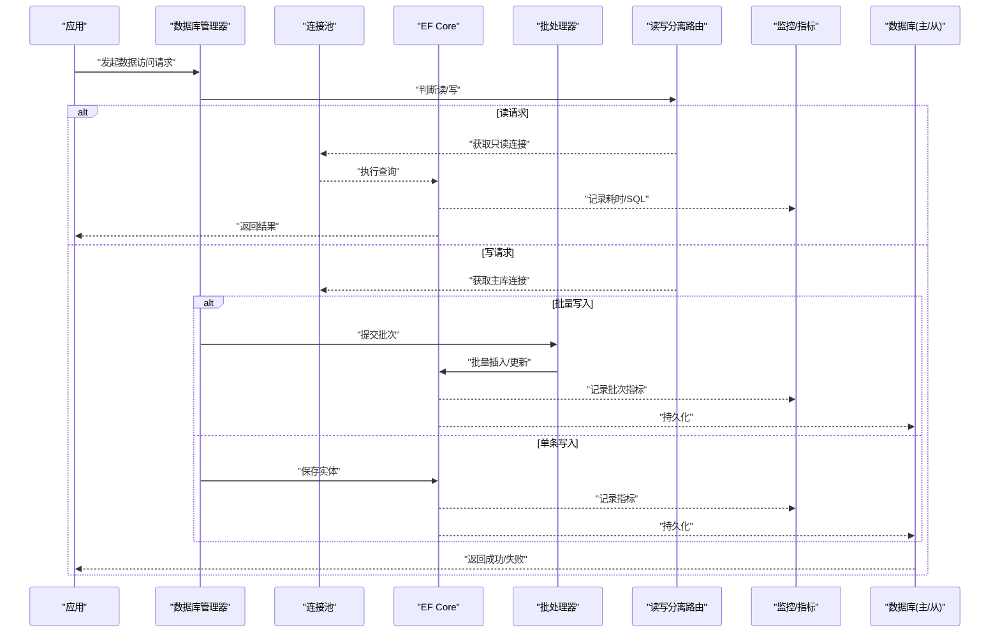
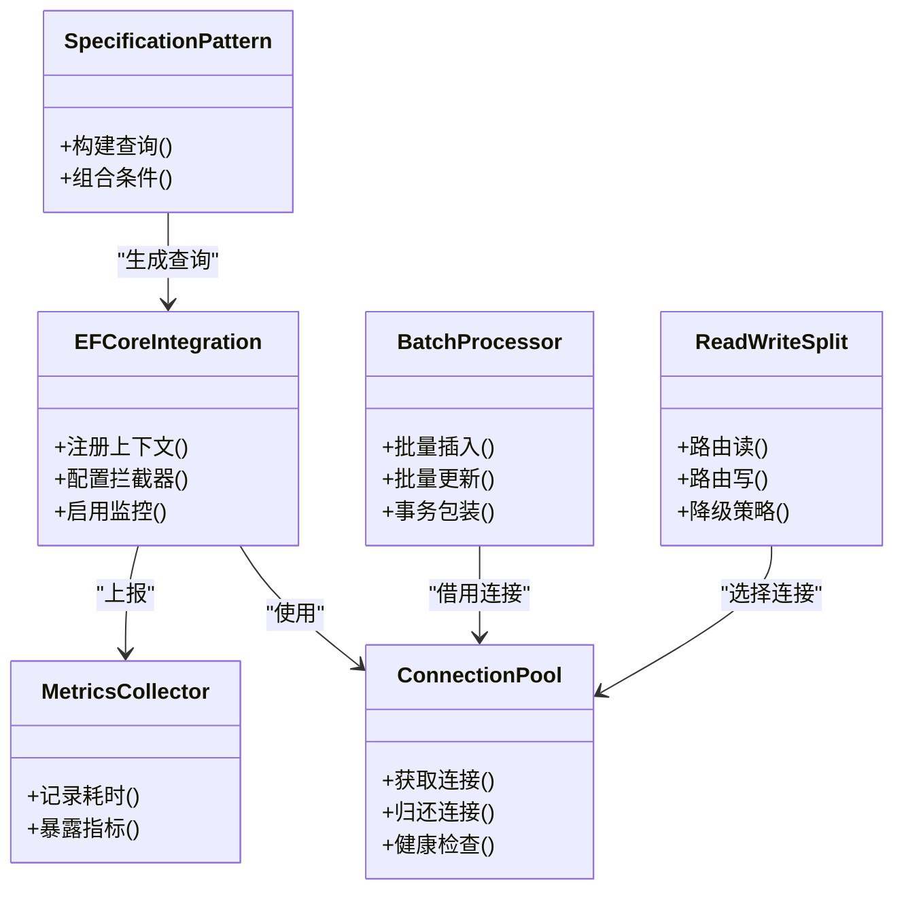

# 数据库优化

<cite>
**本文引用的文件**   
- [efcore9_integration.cs](file://efcore9_integration.cs)
- [sqlite_efcore_bulk.cs](file://sqlite_efcore_bulk.cs)
- [sqlite_connection_pool.cs](file://sqlite_connection_pool.cs)
- [read_write_split.cs](file://read_write_split.cs)
- [specification_pattern.cs](file://specification_pattern.cs)
- [specification_repository.cs](file://specification_repository.cs)
- [performance_metrics.cs](file://performance_metrics.cs)
- [prometheus_integration.cs](file://prometheus_integration.cs)
- [appsettings.json](file://appsettings.json)
</cite>

## 目录
1. [简介](#简介)
2. [项目结构](#项目结构)
3. [核心组件](#核心组件)
4. [架构总览](#架构总览)
5. [详细组件分析](#详细组件分析)
6. [依赖关系分析](#依赖关系分析)
7. [性能考量](#性能考量)
8. [故障排查指南](#故障排查指南)
9. [结论](#结论)
10. [附录](#附录)

## 简介
本文件面向数据库性能与稳定性优化，围绕批量写入、连接池配置、EF Core 调优、读写分离与查询规范模式展开，覆盖索引优化、查询计划分析、事务优化与缓存策略。同时给出连接管理、批处理操作、异步查询最佳实践，以及监控与慢查询分析方法，帮助在复杂业务场景下获得稳定且高效的数据库访问能力。

## 项目结构
仓库中包含多个与数据库相关的示例与集成实现，重点涉及 EF Core、SQLite 批处理、连接池、读写分离、Specification 模式与性能指标采集等。以下图展示了与本主题直接相关的关键文件及其职责：

图表来源 
- [efcore9_integration.cs](file://efcore9_integration.cs)
- [sqlite_efcore_bulk.cs](file://sqlite_efcore_bulk.cs)
- [sqlite_connection_pool.cs](file://sqlite_connection_pool.cs)
- [read_write_split.cs](file://read_write_split.cs)
- [specification_pattern.cs](file://specification_pattern.cs)
- [specification_repository.cs](file://specification_repository.cs)
- [performance_metrics.cs](file://performance_metrics.cs)
- [prometheus_integration.cs](file://prometheus_integration.cs)
- [appsettings.json](file://appsettings.json)

章节来源
- [efcore9_integration.cs](file://efcore9_integration.cs)
- [sqlite_efcore_bulk.cs](file://sqlite_efcore_bulk.cs)
- [sqlite_connection_pool.cs](file://sqlite_connection_pool.cs)
- [read_write_split.cs](file://read_write_split.cs)
- [specification_pattern.cs](file://specification_pattern.cs)
- [specification_repository.cs](file://specification_repository.cs)
- [performance_metrics.cs](file://performance_metrics.cs)
- [prometheus_integration.cs](file://prometheus_integration.cs)
- [appsettings.json](file://appsettings.json)

## 核心组件
- EF Core 集成与调优：提供上下文注册、命令拦截、日志与性能度量入口，便于统一接入监控与诊断。
- SQLite 批处理：封装批量插入/更新的高效路径，减少往返与事务开销。
- 连接池：针对 SQLite 的连接复用与并发控制，避免资源争用与锁竞争。
- 读写分离：基于操作类型或路由规则将读请求导向只读副本，写请求走主库。
- Specification 模式：以声明式方式组合查询条件，提升可测试性与一致性。
- 性能监控：通过指标采集与 Prometheus 暴露，形成可视化与告警闭环。

章节来源
- [efcore9_integration.cs](file://efcore9_integration.cs)
- [sqlite_efcore_bulk.cs](file://sqlite_efcore_bulk.cs)
- [sqlite_connection_pool.cs](file://sqlite_connection_pool.cs)
- [read_write_split.cs](file://read_write_split.cs)
- [specification_pattern.cs](file://specification_pattern.cs)
- [specification_repository.cs](file://specification_repository.cs)
- [performance_metrics.cs](file://performance_metrics.cs)
- [prometheus_integration.cs](file://prometheus_integration.cs)

## 架构总览
下图展示从应用到数据库的端到端流程，涵盖连接管理、批处理、读写分离与监控埋点。

图表来源 
- [read_write_split.cs](file://read_write_split.cs)
- [sqlite_connection_pool.cs](file://sqlite_connection_pool.cs)
- [sqlite_efcore_bulk.cs](file://sqlite_efcore_bulk.cs)
- [efcore9_integration.cs](file://efcore9_integration.cs)
- [performance_metrics.cs](file://performance_metrics.cs)

## 详细组件分析

### EF Core 集成与性能调优
- 上下文生命周期：建议按请求作用域创建 DbContext，避免跨请求共享导致状态污染。
- 命令拦截与日志：通过拦截器收集 SQL、参数与耗时，配合指标系统上报。
- 跟踪与投影：对只读查询使用非跟踪读取；优先选择投影以减少数据传输。
- 变更追踪：批量写入时关闭变更追踪，降低内存与 CPU 消耗。
- 超时与重试：设置合理的命令超时，结合幂等性设计与重试策略。

章节来源
- [efcore9_integration.cs](file://efcore9_integration.cs)

### SQLite 批处理与批量写入
- 批大小规划：根据内存与磁盘 I/O 特性选择合适的批次大小，平衡吞吐与延迟。
- 事务边界：将多行写入包裹在单个事务中，减少提交开销。
- 并行与串行：SQLite 写锁严格，建议串行写入或分表/分库拆分热点。
- 索引影响：批量导入前临时禁用非必要索引，完成后重建。

章节来源
- [sqlite_efcore_bulk.cs](file://sqlite_efcore_bulk.cs)

### 连接池配置与管理
- 连接数上限：依据并发量与数据库承载能力设定最大连接数，避免耗尽。
- 空闲回收：合理设置空闲超时，释放长期未使用的连接。
- 健康检查：定期探测连接可用性，快速剔除失效连接。
- 错误隔离：对连接异常进行熔断与退避，防止雪崩。

章节来源
- [sqlite_connection_pool.cs](file://sqlite_connection_pool.cs)

### 读写分离与路由策略
- 路由规则：基于方法名、特性或操作类型区分读/写，自动选择目标连接。
- 一致性模型：明确最终一致或强一致需求，必要时强制走主库。
- 负载均衡：对只读副本做轮询或权重分配，提升读吞吐。
- 故障转移：当从库不可用时降级为直连主库或返回缓存。

章节来源
- [read_write_split.cs](file://read_write_split.cs)

### 查询规范模式（Specification）
- 组合查询：将过滤、排序、分页等条件抽象为可组合的规范对象。
- 可测试性：规范可独立单元测试，保证查询逻辑正确性。
- 与仓储集成：仓储层将规范转换为具体查询，屏蔽底层细节。
- 性能提示：避免过度组合导致生成低效 SQL，必要时手写优化。

章节来源
- [specification_pattern.cs](file://specification_pattern.cs)
- [specification_repository.cs](file://specification_repository.cs)

### 性能监控与慢查询分析
- 指标采集：记录 QPS、P95/P99 延迟、错误率、连接池使用率等。
- 慢查询识别：统计耗时超过阈值的 SQL，附带参数与调用栈。
- 可视化与告警：对接 Prometheus/Grafana 形成看板与告警。
- 根因定位：结合执行计划与索引命中情况定位瓶颈。

章节来源
- [performance_metrics.cs](file://performance_metrics.cs)
- [prometheus_integration.cs](file://prometheus_integration.cs)

## 依赖关系分析
下图展示关键模块之间的依赖关系，有助于理解耦合度与扩展点。

图表来源 
- [efcore9_integration.cs](file://efcore9_integration.cs)
- [sqlite_connection_pool.cs](file://sqlite_connection_pool.cs)
- [sqlite_efcore_bulk.cs](file://sqlite_efcore_bulk.cs)
- [read_write_split.cs](file://read_write_split.cs)
- [specification_pattern.cs](file://specification_pattern.cs)
- [performance_metrics.cs](file://performance_metrics.cs)

## 性能考量
- 批量写入
  - 合并小事务为大事务，减少提交次数。
  - 关闭变更追踪与非必要字段加载。
  - 合理分片与顺序写入，降低锁竞争。
- 连接池
  - 根据峰值并发与数据库容量计算最大连接数。
  - 启用连接健康检查与快速失败。
- EF Core 调优
  - 使用 AsNoTracking 进行只读查询。
  - 投影到 DTO，避免全列加载。
  - 避免 N+1 查询，采用 Include 或显式 JOIN。
- 索引优化
  - 为高频过滤与排序字段建立合适索引。
  - 避免过多索引影响写入性能。
  - 定期分析索引使用率并清理无用索引。
- 查询计划分析
  - 使用 EXPLAIN/EXPLAIN ANALYZE 查看执行计划。
  - 关注全表扫描、回表与临时表使用。
- 事务优化
  - 缩短事务范围，避免长事务持有锁。
  - 合理设置隔离级别，权衡一致性与吞吐。
- 缓存策略
  - 读多写少场景引入多级缓存（本地/分布式）。
  - 设计合理的过期与失效策略，保证数据新鲜度。

## 故障排查指南
- 连接池耗尽
  - 现象：请求阻塞、超时增多。
  - 排查：观察连接池使用率与等待队列长度，检查是否存在连接泄漏。
  - 处置：增大池上限、修复泄漏、增加重试与熔断。
- 慢查询
  - 现象：接口 P99 升高、CPU/IO 飙升。
  - 排查：采集慢查询 SQL 与执行计划，定位缺失索引或低效 JOIN。
  - 处置：补充索引、改写查询、引入缓存或异步化。
- 死锁与锁竞争
  - 现象：偶发超时与回滚。
  - 排查：查看锁等待链与事务边界，确认是否长事务或无序访问。
  - 处置：调整事务粒度、统一访问顺序、拆分热点表。
- 监控缺失
  - 现象：问题难以复现与定位。
  - 排查：确认指标采集与上报链路是否正常。
  - 处置：补齐关键指标，完善告警阈值与通知渠道。

章节来源
- [performance_metrics.cs](file://performance_metrics.cs)
- [prometheus_integration.cs](file://prometheus_integration.cs)

## 结论
通过规范的连接池管理、高效的批处理写入、稳健的读写分离与清晰的查询规范模式，结合完善的监控与慢查询分析，可以显著提升数据库系统的吞吐、延迟与稳定性。建议在上线前完成压测与基线评估，持续迭代索引与查询，确保性能随业务增长而稳步提升。

## 附录
- 配置项参考
  - 连接字符串、超时、重试策略、连接池大小等可通过配置文件集中管理。
- 常用工具
  - 执行计划分析、慢查询日志、指标采集与可视化平台。

章节来源
- [appsettings.json](file://appsettings.json)